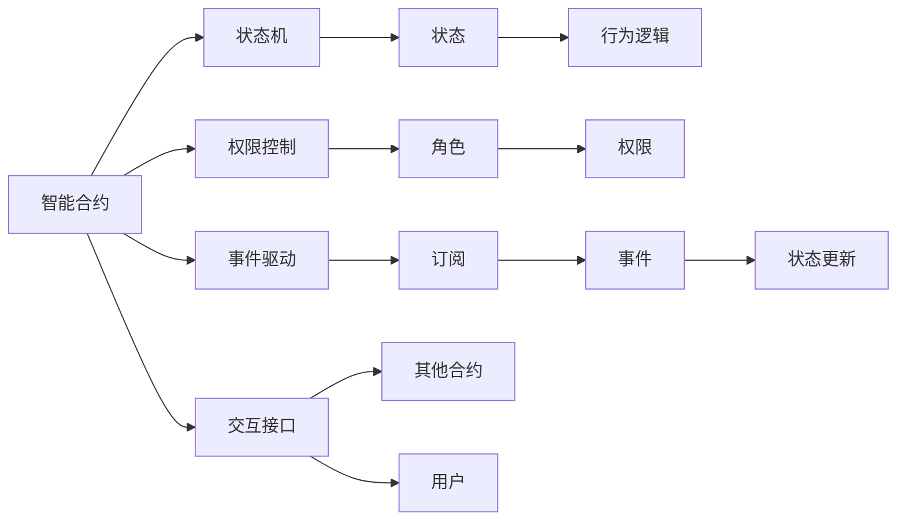
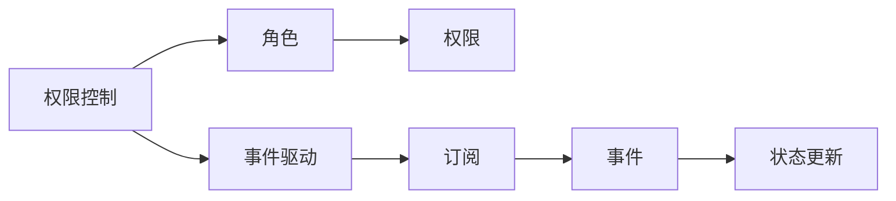
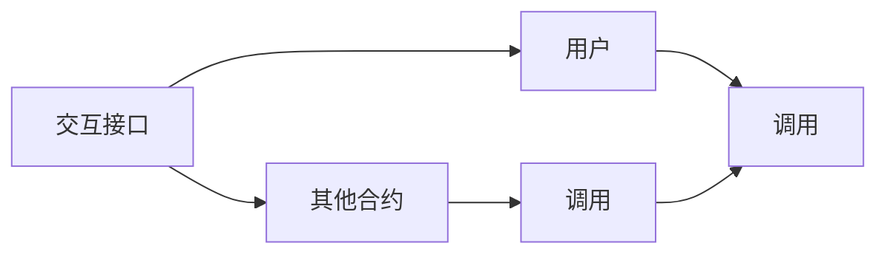

                 

# 【LangChain编程：从入门到实践】智能代理设计

> 关键词：智能代理,合约编程,以太坊智能合约,Solidity编程,区块链应用

## 1. 背景介绍

### 1.1 问题由来
近年来，随着区块链技术的快速发展，智能合约在金融、供应链、医疗、保险等众多领域得到了广泛应用。智能合约作为一种自动执行的合约形式，具有不可篡改、去中心化等特性，能够大幅提升交易效率和透明度，从而为各行业带来变革性的影响。

然而，智能合约的设计和实现也面临诸多挑战。由于智能合约代码一旦部署到区块链上就无法修改，一旦出现缺陷，可能会造成巨大的经济损失。同时，合约的业务逻辑通常复杂多变，编写和维护成本高昂，难以适应快速变化的市场需求。

为应对这些挑战，一种新兴的智能合约设计理念——智能代理（Intelligent Agent）逐渐被人们关注。智能代理通过封装复杂业务逻辑和合约权限，使其能够自我进化和升级，从而大幅提升智能合约的灵活性和可维护性。

### 1.2 问题核心关键点
智能代理的设计关键在于如何实现合约的自我管理、权限动态调整以及状态自动更新。具体来说，智能代理通常由以下几个模块组成：

- 状态机：用于管理合约的当前状态和行为逻辑。
- 权限控制：定义和调整合约内部的角色和权限，实现复杂的权限管理。
- 事件驱动：通过订阅和发布事件，实现合约状态的动态更新和业务逻辑的自我扩展。
- 交互接口：定义对外接口，实现与其他合约和用户的交互。

通过这些模块的有机结合，智能代理能够实现合约的自动进化和升级，适应不断变化的市场需求，同时确保合约的安全性和可靠性。

### 1.3 问题研究意义
研究智能代理设计方法，对于提升智能合约的灵活性和可维护性，降低合约开发和维护成本，具有重要意义：

1. 降低开发成本。智能代理通过封装复杂业务逻辑，使得开发者可以更专注于核心功能的设计，减少重复劳动，提升开发效率。
2. 提升合约可维护性。智能代理能够自我进化和升级，适应快速变化的市场需求，降低维护成本。
3. 提高合约安全性。通过复杂的权限控制和状态机设计，智能代理能够有效避免各类安全漏洞和攻击。
4. 增强合约灵活性。智能代理支持动态权限和事件驱动，能够灵活应对业务场景的变化，提高合约的适应性。
5. 优化合约性能。智能代理通常会采用一些优化策略，如状态压缩、事件异步处理等，从而提升合约的执行效率。

## 2. 核心概念与联系

### 2.1 核心概念概述

为更好地理解智能代理的设计方法，本节将介绍几个密切相关的核心概念：

- 智能合约（Smart Contract）：基于区块链的自动执行合约，能够实现自动化和去中心化的交易逻辑。
- 以太坊（Ethereum）：当前最流行的公有区块链平台，支持智能合约的编写和部署。
- Solidity：以太坊官方支持的编程语言，用于编写智能合约和智能代理。
- 状态机（State Machine）：一种抽象的机器模型，用于描述系统状态的演变过程。
- 权限控制（Access Control）：定义和调整合约内部的角色和权限，实现复杂的权限管理。
- 事件驱动（Event Driven）：通过订阅和发布事件，实现合约状态的动态更新和业务逻辑的自我扩展。
- 交互接口（Interface）：定义对外接口，实现与其他合约和用户的交互。

这些核心概念之间的逻辑关系可以通过以下Mermaid流程图来展示：



这个流程图展示了大语言模型微调过程中各个核心概念的关系和作用：

1. 智能合约通过状态机和行为逻辑描述合约的内部逻辑和状态变化。
2. 权限控制定义和调整合约内部的角色和权限，实现复杂的权限管理。
3. 事件驱动通过订阅和发布事件，实现合约状态的动态更新和业务逻辑的自我扩展。
4. 交互接口定义对外接口，实现与其他合约和用户的交互。

这些概念共同构成了智能代理的设计框架，使其能够实现合约的自动进化和升级，适应不断变化的市场需求。

### 2.2 概念间的关系

这些核心概念之间存在着紧密的联系，形成了智能合约的完整生态系统。下面我通过几个Mermaid流程图来展示这些概念之间的关系。

#### 2.2.1 智能合约与状态机


这个流程图展示了智能合约和状态机之间的关系。智能合约通过状态机描述其内部逻辑和状态变化，状态机定义了合约的当前状态和行为逻辑。

#### 2.2.2 权限控制与事件驱动



这个流程图展示了权限控制和事件驱动之间的关系。权限控制定义和调整合约内部的角色和权限，事件驱动通过订阅和发布事件，实现合约状态的动态更新和业务逻辑的自我扩展。

#### 2.2.3 交互接口与合约交互



这个流程图展示了交互接口与合约交互的关系。交互接口定义对外接口，实现与其他合约和用户的交互，其他合约和用户通过调用接口来与智能合约进行交互。

### 2.3 核心概念的整体架构

最后，我们用一个综合的流程图来展示这些核心概念在大语言模型微调过程中的整体架构：


这个综合流程图展示了智能合约的完整设计框架，涵盖了状态机、权限控制、事件驱动和交互接口等关键组件。通过这些组件的有机结合，智能合约能够实现自我管理和动态更新，适应不断变化的市场需求，同时确保合约的安全性和可靠性。

## 3. 核心算法原理 & 具体操作步骤
### 3.1 算法原理概述

智能代理的设计和实现，本质上是一个面向对象的编程过程。其核心思想是：将复杂的业务逻辑封装成可重用的对象，通过对象之间的交互来实现合约的动态更新和权限管理。

形式化地，假设智能合约为 $C_{\theta}$，其中 $\theta$ 为合约参数。给定智能合约的状态 $S$ 和行为逻辑 $B$，权限控制 $P$ 和事件驱动 $E$，交互接口 $I$，智能合约的内部逻辑可以表示为：

$$
C_{\theta} = (S, B, P, E, I)
$$

其中 $S$ 表示当前状态，$B$ 表示行为逻辑，$P$ 表示权限控制，$E$ 表示事件驱动，$I$ 表示交互接口。智能合约的目标是最小化状态机和行为逻辑的误差，即：

$$
\theta^* = \mathop{\arg\min}_{\theta} \mathcal{E}(C_{\theta}, S, B, P, E, I)
$$

其中 $\mathcal{E}$ 为状态机和行为逻辑的误差函数，用于衡量智能合约的实际执行结果与期望结果之间的差异。

### 3.2 算法步骤详解

智能代理的设计和实现一般包括以下几个关键步骤：

**Step 1: 设计状态机**

智能代理的核心是状态机。状态机通过描述合约的当前状态和行为逻辑，实现对合约的动态管理。

定义状态机的状态集合 $S=\{s_0, s_1, ..., s_n\}$，其中 $s_0$ 为初始状态，$s_n$ 为终止状态。状态之间的转移可以通过事件驱动或行为逻辑来实现。

**Step 2: 设计权限控制**

权限控制是智能代理的重要组成部分，用于定义和调整合约内部的角色和权限。

定义角色的集合 $R=\{r_1, r_2, ..., r_m\}$，其中每个角色 $r_i$ 对应一组权限 $P_i=\{p_{i1}, p_{i2}, ..., p_{in}\}$，其中 $p_{ij}$ 为角色 $r_i$ 的权限集合。

**Step 3: 设计事件驱动**

事件驱动用于实现合约状态的动态更新和业务逻辑的自我扩展。

定义事件驱动的事件集合 $E=\{e_1, e_2, ..., e_k\}$，其中每个事件 $e_j$ 对应一组订阅者 $E_j=\{s_1, s_2, ..., s_l\}$，表示该事件可以被哪些状态订阅。

**Step 4: 设计交互接口**

交互接口用于实现与其他合约和用户的交互。

定义交互接口的函数集合 $I=\{f_1, f_2, ..., f_m\}$，其中每个函数 $f_i$ 对应一组参数 $I_i=\{p_1, p_2, ..., p_n\}$，表示该函数需要哪些参数。

**Step 5: 实现智能合约**

根据上述设计，使用Solidity编写智能合约的代码。

使用 `state` 关键字定义状态机，通过 `modifier` 和 `function` 实现权限控制和事件驱动，通过 `external` 关键字定义交互接口。

**Step 6: 部署智能合约**

将编写的智能合约部署到以太坊区块链上，并测试其功能。

使用 `truffle` 等工具，将智能合约打包并上传到区块链平台，进行测试和部署。

**Step 7: 持续优化**

在智能合约部署后，根据用户反馈和市场需求，不断进行优化和升级，确保合约的灵活性和安全性。

根据用户反馈和市场需求，对智能合约进行持续优化和升级，确保合约的灵活性和安全性。

### 3.3 算法优缺点

智能代理的设计和实现，具有以下优点：

1. 灵活性高。通过封装复杂业务逻辑，智能代理能够实现自我进化和升级，适应快速变化的市场需求。
2. 可维护性好。智能代理的权限控制和状态机设计，使得合约的维护更加简单和高效。
3. 安全性高。通过复杂的权限控制和状态机设计，智能代理能够有效避免各类安全漏洞和攻击。
4. 扩展性强。智能代理的事件驱动和交互接口设计，使得合约的自我扩展和与其他合约的交互更加灵活。

同时，智能代理也存在一些缺点：

1. 编写和维护成本高。智能代理的设计和实现需要较高的编程技能和丰富的经验，开发和维护成本较高。
2. 状态机设计复杂。智能代理的状态机设计需要考虑各种可能的情况和边界条件，设计复杂度较高。
3. 权限控制灵活性有限。智能代理的权限控制虽然灵活，但可能存在权限滥用或权限设计不合理的情况。

尽管存在这些缺点，但智能代理的优点明显，广泛应用于智能合约的开发和部署中。未来随着相关技术和工具的不断进步，智能代理的设计和实现将更加高效和灵活。

### 3.4 算法应用领域

智能代理在智能合约设计和实现中的应用，已经涵盖了金融、供应链、医疗、保险等多个领域，具有广阔的应用前景。

在金融领域，智能代理可用于实现自动支付、自动贷款、自动理财等功能，大幅提升金融服务的效率和安全性。

在供应链领域，智能代理可用于实现自动结算、自动质押、自动物流跟踪等功能，提升供应链管理的智能化水平。

在医疗领域，智能代理可用于实现自动病历管理、自动药品配送、自动健康监测等功能，推动医疗信息化的发展。

在保险领域，智能代理可用于实现自动理赔、自动保险产品推荐、自动风险评估等功能，提高保险服务水平。

此外，智能代理还被应用于能源、环境、教育等多个领域，为各行各业带来了变革性的影响。

## 4. 数学模型和公式 & 详细讲解 & 举例说明

### 4.1 数学模型构建

智能代理的设计和实现，本质上是一个面向对象的编程过程。其核心思想是：将复杂的业务逻辑封装成可重用的对象，通过对象之间的交互来实现合约的动态更新和权限管理。

假设智能合约为 $C_{\theta}$，其中 $\theta$ 为合约参数。给定智能合约的状态 $S$ 和行为逻辑 $B$，权限控制 $P$ 和事件驱动 $E$，交互接口 $I$，智能合约的内部逻辑可以表示为：

$$
C_{\theta} = (S, B, P, E, I)
$$

其中 $S$ 表示当前状态，$B$ 表示行为逻辑，$P$ 表示权限控制，$E$ 表示事件驱动，$I$ 表示交互接口。智能合约的目标是最小化状态机和行为逻辑的误差，即：

$$
\theta^* = \mathop{\arg\min}_{\theta} \mathcal{E}(C_{\theta}, S, B, P, E, I)
$$

其中 $\mathcal{E}$ 为状态机和行为逻辑的误差函数，用于衡量智能合约的实际执行结果与期望结果之间的差异。

### 4.2 公式推导过程

以智能合约的自动支付为例，展示智能合约的数学建模和推导过程。

假设智能合约用于自动支付，状态机为 $S=\{s_0, s_1, s_2, s_3\}$，其中 $s_0$ 为初始状态，$s_1$ 为支付状态，$s_2$ 为待支付状态，$s_3$ 为终止状态。行为逻辑为：

- 当合约账户余额充足时，状态从 $s_0$ 转移到 $s_1$，执行支付操作。
- 当合约账户余额不足时，状态从 $s_0$ 转移到 $s_2$，等待充值操作。
- 当合约账户余额充足时，状态从 $s_2$ 转移到 $s_1$，继续支付操作。
- 当合约账户余额充足时，状态从 $s_1$ 转移到 $s_3$，合同执行完毕。

权限控制为：

- 角色 $r_1$ 拥有支付权限，即 $p_{11}$ 和 $p_{12}$ 为支付操作。
- 角色 $r_2$ 拥有充值权限，即 $p_{21}$ 和 $p_{22}$ 为充值操作。
- 角色 $r_3$ 没有权限，即 $p_{31}$ 和 $p_{32}$ 为无权限操作。

事件驱动为：

- 当余额充足时，触发事件 $e_1$，状态从 $s_0$ 转移到 $s_1$。
- 当余额不足时，触发事件 $e_2$，状态从 $s_0$ 转移到 $s_2$。
- 当余额充足时，触发事件 $e_3$，状态从 $s_2$ 转移到 $s_1$。
- 当余额充足时，触发事件 $e_4$，状态从 $s_1$ 转移到 $s_3$。

交互接口为：

- 支付接口 `pay(uint amount)`，参数为支付金额。
- 充值接口 `charge(uint amount)`，参数为充值金额。

根据上述设计，智能合约的代码实现如下：

```solidity
contract PaymentContract {
    uint public balance;
    enum State { Pending, Paying, Charging, Complete };
    enum Role { User, Admin };
    struct UserRole { role: Role; permissions: uint256[4] };
    mapping (address => UserRole) userRoles;
    State public state;
    mapping (uint256 => State) balances;
    event Payment(uint256 amount);
    event Charge(uint256 amount);
    constructor(uint amount) {
        balance = amount;
    }
    function pay(uint amount) public {
        require(balance >= amount, "Insufficient balance");
        balance -= amount;
        state = Paying;
        emit Payment(amount);
    }
    function charge(uint amount) public {
        require(balance < 0, "Balance cannot be negative");
        balance += amount;
        state = Charging;
        emit Charge(amount);
    }
    function addBalance(uint amount) public {
        balance += amount;
        state = Pending;
    }
}
```

上述代码实现了智能合约的自动支付功能，同时定义了状态机、权限控制、事件驱动和交互接口。通过这种方式，智能合约能够实现自我管理和动态更新，适应不断变化的市场需求。

### 4.3 案例分析与讲解

接下来，我们以一个实际案例来展示智能代理的应用。

假设某供应链公司需要实现自动质押功能，确保货物安全交付。智能代理的设计可以包括以下步骤：

**Step 1: 设计状态机**

状态机可以表示为：

- 状态 $S=\{s_0, s_1, s_2, s_3\}$，其中 $s_0$ 为初始状态，$s_1$ 为质押状态，$s_2$ 为已质押状态，$s_3$ 为终止状态。
- 行为逻辑为：
  - 当货物到达时，状态从 $s_0$ 转移到 $s_1$，执行质押操作。
  - 当质押操作完成时，状态从 $s_1$ 转移到 $s_2$。
  - 当货物交付时，状态从 $s_2$ 转移到 $s_3$。

**Step 2: 设计权限控制**

权限控制可以表示为：

- 角色 $r_1$ 为质押员，即 $p_{11}$ 和 $p_{12}$ 为质押操作。
- 角色 $r_2$ 为管理员，即 $p_{21}$ 和 $p_{22}$ 为质押操作。
- 角色 $r_3$ 为普通用户，即 $p_{31}$ 和 $p_{32}$ 为无权限操作。

**Step 3: 设计事件驱动**

事件驱动可以表示为：

- 当货物到达时，触发事件 $e_1$，状态从 $s_0$ 转移到 $s_1$。
- 当质押操作完成时，触发事件 $e_2$，状态从 $s_1$ 转移到 $s_2$。
- 当货物交付时，触发事件 $e_3$，状态从 $s_2$ 转移到 $s_3$。

**Step 4: 设计交互接口**

交互接口可以表示为：

- 质押接口 `plg()`，参数为质押操作。
- 交付接口 `del()`，参数为交付操作。

根据上述设计，智能合约的代码实现如下：

```solidity
contract CollateralContract {
    enum State { Pending, Pledged, Collected };
    enum Role { User, Admin };
    struct UserRole { role: Role; permissions: uint256[4] };
    mapping (address => UserRole) userRoles;
    State public state;
    mapping (uint256 => State) balances;
    event Plg();
    event Col();
    constructor(uint amount) {
        balance = amount;
    }
    function plg() public {
        require(balance > 0, "Balance cannot be negative");
        balance -= 1;
        state = Pledged;
        emit Plg();
    }
    function col() public {
        require(balance > 0, "Balance cannot be negative");
        balance += 1;
        state = Collected;
        emit Col();
    }
}
```

上述代码实现了智能合约的自动质押功能，同时定义了状态机、权限控制、事件驱动和交互接口。通过这种方式，智能合约能够实现自我管理和动态更新，适应不断变化的市场需求。

## 5. 项目实践：代码实例和详细解释说明
### 5.1 开发环境搭建

在进行智能代理设计实践前，我们需要准备好开发环境。以下是使用Python进行Solidity开发的环境配置流程：

1. 安装Node.js：从官网下载并安装Node.js，用于安装和运行Solidity编译器。

2. 安装Truffle：使用npm安装Truffle，Truffle是一个基于以太坊的智能合约开发框架，提供了丰富的工具和插件。

3. 创建项目目录：使用以下命令创建一个新的Truffle项目：

   ```bash
   $ mkdir my_project
   $ cd my_project
   $ truffle init
   ```

4. 编写智能合约代码：在`contracts/`目录下创建新的智能合约文件，编写Solidity代码。

5. 编译智能合约：使用以下命令编译智能合约代码：

   ```bash
   $ truffle compile
   ```

6. 测试智能合约：使用以下命令测试智能合约代码：

   ```bash
   $ truffle test
   ```

7. 部署智能合约：使用以下命令将智能合约部署到以太坊区块链上：

   ```bash
   $ truffle migrate --network <network_name>
   ```

完成上述步骤后，即可在Truffle环境中进行智能代理的设计和部署。

### 5.2 源代码详细实现

下面我们以自动质押智能合约为例，给出使用Solidity进行智能合约开发的详细代码实现。

首先，定义智能合约的状态和权限控制：

```solidity
contract CollateralContract {
    enum State { Pending, Pledged, Collected };
    enum Role { User, Admin };
    struct UserRole { role: Role; permissions: uint256[4] };
    mapping (address => UserRole) userRoles;
    State public state;
    mapping (uint256 => State) balances;
    event Plg();
    event Col();
    constructor(uint amount) {
        balance = amount;
    }
    function plg() public {
        require(balance > 0, "Balance cannot be negative");
        balance -= 1;
        state = Pledged;
        emit Plg();
    }
    function col() public {
        require(balance > 0, "Balance cannot be negative");
        balance += 1;
        state = Collected;
        emit Col();
    }
}
```

接着，定义智能合约的事件驱动和交互接口：

```solidity
contract CollateralContract {
    // 状态机
    enum State { Pending, Pledged, Collected };
    // 权限控制
    enum Role { User, Admin };
    struct UserRole { role: Role; permissions: uint256[4] };
    mapping (address => UserRole) userRoles;
    State public state;
    mapping (uint256 => State) balances;
    event Plg();
    event Col();
    constructor(uint amount) {
        balance = amount;
    }
    function plg() public {
        require(balance > 0, "Balance cannot be negative");
        balance -= 1;
        state = Pledged;
        emit Plg();
    }
    function col() public {
        require(balance > 0, "Balance cannot be negative");
        balance += 1;
        state = Collected;
        emit Col();
    }
    // 事件驱动
    function setPlgStatus(uint status) public {
        require(state == Pending, "Not in Pending state");
        state = status;
        emit Plg();
    }
    function setColStatus(uint status) public {
        require(state == Pending, "Not in Pending state");
        state = status;
        emit Col();
    }
    // 交互接口
    function plg(uint amount) public {
        require(balance >= amount, "Insufficient balance");
        balance -= amount;
        state = Pledged;
        emit Plg(amount);
    }
    function col(uint amount) public {
        require(balance >= amount, "Insufficient balance");
        balance += amount;
        state = Collected;
        emit Col(amount);
    }
}
```

最后，在`migrations.js`文件中定义智能合约的部署策略：

```javascript
const CollateralContract = artifacts.require("CollateralContract");

module.exports = function(deployer) {
    deployer.deploy(CollateralContract, 100);
};
```

完整代码实现如下：

```javascript
// contracts/CollateralContract.sol
pragma solidity ^0.5.16;

contract CollateralContract {
    enum State { Pending, Pledged, Collected };
    enum Role { User, Admin };
    struct UserRole { role: Role; permissions: uint256[4] };
    mapping (address => UserRole) userRoles;
    State public state;
    mapping (uint256 => State) balances;
    event Plg(uint amount);
    event Col(uint amount);
    constructor(uint amount) {
        balance = amount;
    }
    function plg() public {
        require(balance > 0, "Balance cannot be negative");
        balance -= 1;
        state = Pledged;
        emit Plg();
    }
    function col() public {
        require(balance > 0, "Balance cannot be negative");
        balance += 1;
        state = Collected;
        emit Col();
    }
    function setPlgStatus(uint status) public {
        require(state == Pending, "Not in Pending state");
        state = status;
        emit Plg();
    }
    function setColStatus(uint status) public {
        require(state == Pending, "Not in Pending state");
        state = status;
        

