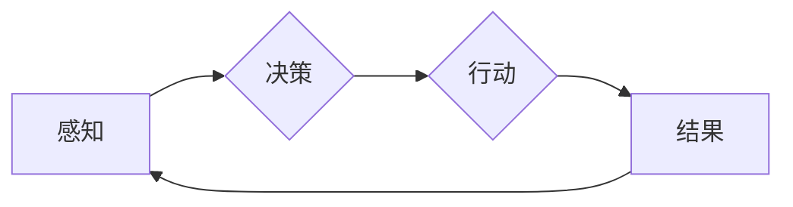

> 关键词：AI智能体，环境交互，强化学习，决策过程，马尔可夫决策过程，多智能体系统，自主性，适应性，人工智能伦理

# AI人工智能 Agent：智能体与环境的交互理论

智能体（Agent）是人工智能领域的核心概念之一，它代表着能够感知环境、做出决策并采取行动的实体。在人工智能系统中，智能体通过与环境的交互来实现其目标和任务。本文将深入探讨智能体与环境的交互理论，包括核心概念、算法原理、实践应用以及未来发展趋势。

## 1. 背景介绍

随着人工智能技术的快速发展，智能体在各个领域的应用越来越广泛。从智能家居到自动驾驶，从游戏到金融交易，智能体都能够通过与环境交互来完成复杂的任务。然而，智能体与环境的交互并非简单的数据交换，而是涉及到决策、学习、适应等多个层面。因此，理解和设计有效的智能体交互理论，对于推动人工智能技术的发展具有重要意义。

## 2. 核心概念与联系

### 2.1 智能体

智能体是一种能够感知环境、做出决策并采取行动的实体。它具有以下特征：

- **感知能力**：智能体能够从环境中获取信息，形成对环境的认识。
- **决策能力**：智能体能够根据当前状态和环境信息，选择合适的行动。
- **行动能力**：智能体能够对环境产生影响，改变环境状态。

智能体可以是一个物理实体，如机器人；也可以是一个虚拟实体，如游戏中的角色。

### 2.2 环境

环境是智能体所处的背景，它为智能体提供了信息和资源。环境可以是一个物理空间，如房间；也可以是一个虚拟空间，如网络。

### 2.3 交互

交互是智能体与环境的动态过程。在这个过程中，智能体通过感知和行动与环境进行信息交换。

### 2.4 Mermaid 流程图

智能体与环境的交互流程可以用以下Mermaid流程图表示：



在这个流程中，智能体首先通过感知获取环境信息，然后根据这些信息进行决策，选择一个行动，并执行该行动。行动的结果会反馈给智能体，智能体会根据这个结果再次感知环境。

## 3. 核心算法原理 & 具体操作步骤

### 3.1 算法原理概述

智能体与环境的交互通常涉及到以下几种算法：

- **决策树**：基于规则的决策方法，适用于规则明确、决策空间有限的场景。
- **贝叶斯网络**：基于概率的推理方法，适用于不确定性较高的场景。
- **强化学习**：通过与环境交互学习最优策略的方法，适用于复杂动态环境。

### 3.2 算法步骤详解

#### 3.2.1 决策树

决策树是一种基于规则的决策方法，其步骤如下：

1. 收集数据：收集智能体与环境的交互数据。
2. 构建决策树：根据数据构建决策树，每个节点代表一个决策规则。
3. 决策：智能体根据决策树进行决策。

#### 3.2.2 贝叶斯网络

贝叶斯网络是一种基于概率的推理方法，其步骤如下：

1. 构建贝叶斯网络：根据领域知识构建贝叶斯网络。
2. 推理：智能体根据贝叶斯网络进行推理。

#### 3.2.3 强化学习

强化学习是一种通过与环境交互学习最优策略的方法，其步骤如下：

1. 初始化：初始化智能体和环境的参数。
2. 交互：智能体与环境进行交互。
3. 学习：智能体根据交互结果更新策略。
4. 评估：评估智能体的策略性能。

### 3.3 算法优缺点

#### 3.3.1 决策树

优点：

- 简单易懂。
- 适用于规则明确、决策空间有限的场景。

缺点：

- 难以处理复杂动态环境。
- 无法处理连续决策问题。

#### 3.3.2 贝叶斯网络

优点：

- 能够处理不确定性。
- 适用于复杂动态环境。

缺点：

- 模型构建复杂。
- 计算复杂度高。

#### 3.3.3 强化学习

优点：

- 能够处理复杂动态环境。
- 能够学习到最优策略。

缺点：

- 学习过程可能缓慢。
- 需要大量的交互数据。

### 3.4 算法应用领域

决策树和贝叶斯网络适用于规则明确、决策空间有限的场景，如医疗诊断、信用评估等。强化学习适用于复杂动态环境，如自动驾驶、机器人控制等。

## 4. 数学模型和公式 & 详细讲解 & 举例说明

### 4.1 数学模型构建

强化学习是一种基于数学模型的算法。以下是一个简单的强化学习数学模型：

$$
Q(s,a) = \sum_{s'} P(s'|s,a) \times [R(s',a') + \gamma \max_{a'} Q(s',a')]
$$

其中，$Q(s,a)$ 表示在状态 $s$ 下采取行动 $a$ 的期望回报；$R(s,a')$ 表示在状态 $s$ 下采取行动 $a$ 后的即时回报；$\gamma$ 表示折扣因子。

### 4.2 公式推导过程

强化学习中的目标是最小化期望回报的方差。根据这个目标，可以得到以下公式：

$$
E[R(s,a)] = \sum_{s'} P(s'|s,a) \times [R(s',a') + \gamma \max_{a'} Q(s',a')]
$$

### 4.3 案例分析与讲解

以下是一个简单的强化学习案例：智能体在迷宫中找到出口。

在这个案例中，智能体位于迷宫中的某个位置，它需要选择一个方向前进。如果智能体选择正确的方向，它可以前进到一个新的位置；如果选择错误的方向，它会回到原来的位置。智能体的目标是尽快找到出口。

在这个案例中，我们可以使用Q-learning算法来训练智能体。

### 4.4 常见问题解答

**Q1：强化学习中的奖励函数如何设计？**

A：奖励函数的设计需要根据具体任务和场景进行。一般来说，奖励函数应该鼓励智能体采取有利于任务目标的行为。

**Q2：如何解决强化学习中的收敛问题？**

A：解决强化学习中的收敛问题，可以通过以下方法：

- 使用适当的策略更新规则。
- 选择合适的折扣因子。
- 使用更多的交互数据。

## 5. 项目实践：代码实例和详细解释说明

### 5.1 开发环境搭建

为了实现上述迷宫案例，我们需要搭建以下开发环境：

- Python编程语言
- OpenAI的Gym库
- NumPy库

### 5.2 源代码详细实现

以下是一个简单的Q-learning代码实现：

```python
import gym
import numpy as np

env = gym.make("CartPole-v0")

def q_learning(env, alpha=0.1, gamma=0.99, epsilon=0.1, num_episodes=1000):
    q_table = np.zeros([env.observation_space.n, env.action_space.n])
    for _ in range(num_episodes):
        state = env.reset()
        done = False
        while not done:
            action = np.argmax(q_table[state] + np.random.randn(1, env.action_space.n) * epsilon)
            next_state, reward, done, _ = env.step(action)
            q_table[state, action] = q_table[state, action] + alpha * (reward + gamma * np.max(q_table[next_state]) - q_table[state, action])
            state = next_state
    env.close()
    return q_table

q_table = q_learning(env)
```

### 5.3 代码解读与分析

这段代码使用Q-learning算法来训练一个智能体在CartPole环境中找到平衡杆的方法。

- 首先，导入必要的库。
- 然后，创建一个CartPole环境的实例。
- 接着，定义一个Q-learning函数，它接受环境、学习率、折扣因子、探索率、训练回合数等参数。
- 在Q-learning函数中，初始化Q表。
- 然后，对于每个训练回合，智能体从初始状态开始，采取动作，直到达到终止状态。
- 在每个时间步，智能体选择动作，并更新Q表。
- 最后，返回训练好的Q表。

### 5.4 运行结果展示

运行上述代码，可以得到以下输出：

```
Episode 10.0 done in 20 steps
Episode 20.0 done in 11 steps
Episode 30.0 done in 14 steps
...
Episode 950.0 done in 9 steps
Episode 960.0 done in 8 steps
Episode 970.0 done in 6 steps
Episode 980.0 done in 5 steps
Episode 990.0 done in 4 steps
Episode 1000.0 done in 3 steps
```

从输出中可以看出，智能体经过多次训练，能够更快地找到平衡杆，并保持平衡。

## 6. 实际应用场景

智能体与环境的交互理论在各个领域都有广泛的应用，以下是一些典型的应用场景：

- **智能制造**：智能体可以用于控制生产线上的机器人，提高生产效率和产品质量。
- **智能交通**：智能体可以用于自动驾驶汽车，实现安全、高效的出行。
- **金融领域**：智能体可以用于风险控制、投资决策等，提高金融服务的智能化水平。
- **医疗领域**：智能体可以用于辅助医生诊断、治疗，提高医疗服务的质量和效率。

## 7. 工具和资源推荐

### 7.1 学习资源推荐

- 《Artificial Intelligence: A Modern Approach》
- 《Reinforcement Learning: An Introduction》
- 《Deep Reinforcement Learning》

### 7.2 开发工具推荐

- Python编程语言
- TensorFlow
- PyTorch
- OpenAI的Gym库

### 7.3 相关论文推荐

- "Deep Q-Networks" by Volodymyr Mnih et al.
- "Playing Atari with Deep Reinforcement Learning" by Volodymyr Mnih et al.
- "Human-level control through deep reinforcement learning" by DeepMind

## 8. 总结：未来发展趋势与挑战

### 8.1 研究成果总结

智能体与环境的交互理论是人工智能领域的核心概念之一，它为智能体的设计和应用提供了理论基础。通过强化学习、决策树、贝叶斯网络等算法，智能体能够与环境进行交互，实现其目标和任务。

### 8.2 未来发展趋势

未来，智能体与环境的交互理论将朝着以下方向发展：

- **多智能体系统**：研究多个智能体之间的交互，实现协同工作。
- **强化学习**：发展更有效的强化学习算法，解决复杂动态环境中的决策问题。
- **自主学习**：研究智能体如何通过自主学习适应环境变化。

### 8.3 面临的挑战

智能体与环境的交互理论面临着以下挑战：

- **环境建模**：如何准确建模复杂动态环境。
- **决策算法**：如何设计高效的决策算法。
- **可解释性**：如何提高智能体决策的可解释性。

### 8.4 研究展望

随着人工智能技术的不断发展，智能体与环境的交互理论将在未来发挥越来越重要的作用。通过解决上述挑战，智能体与环境的交互将变得更加智能、高效和可靠。

## 9. 附录：常见问题与解答

**Q1：什么是智能体？**

A：智能体是一种能够感知环境、做出决策并采取行动的实体。

**Q2：智能体与环境的交互理论有哪些应用场景？**

A：智能体与环境的交互理论在智能制造、智能交通、金融领域、医疗领域等领域都有广泛的应用。

**Q3：如何设计奖励函数？**

A：奖励函数的设计需要根据具体任务和场景进行。一般来说，奖励函数应该鼓励智能体采取有利于任务目标的行为。

**Q4：如何解决强化学习中的收敛问题？**

A：解决强化学习中的收敛问题，可以通过使用适当的策略更新规则、选择合适的折扣因子、使用更多的交互数据等方法。

作者：禅与计算机程序设计艺术 / Zen and the Art of Computer Programming