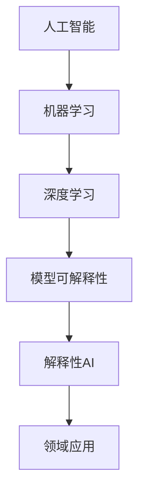

> 人工智能，核心算法，模型可解释性，深度学习，神经网络，机器学习，解释性AI，透明度，可信度，案例研究

# AI人工智能核心算法原理与代码实例讲解：模型可解释性

## 1. 背景介绍

人工智能（AI）自诞生以来，就以其强大的学习能力和适应能力在各个领域展现出巨大的潜力。然而，随着深度学习等复杂模型的兴起，AI系统的“黑箱”特性逐渐凸显，其决策过程缺乏透明度和可解释性，这限制了AI在关键领域的应用，如医疗、金融和司法等。因此，模型可解释性成为了当前AI研究的热点问题。本文将深入探讨AI核心算法的原理，并结合代码实例讲解如何实现模型的可解释性。

## 2. 核心概念与联系

### 2.1 核心概念

- **人工智能（AI）**：指由人制造出来的系统能够模拟、延伸和扩展人的智能，实现智能行为。
- **机器学习（ML）**：AI的一个子领域，通过数据学习模型，使系统能够从数据中学习并做出决策。
- **深度学习（DL）**：机器学习的一个分支，使用多层神经网络进行学习，能够在图像识别、语音识别等领域取得突破性进展。
- **模型可解释性（Model Explainability）**：指能够解释模型决策过程和结果的能力，提高模型的透明度和可信度。
- **解释性AI（Explainable AI，XAI）**：致力于开发可解释的AI系统，使其决策过程对人类用户可理解。

### 2.2 Mermaid 流程图



### 2.3 核心概念联系

人工智能是机器学习和深度学习的基础，而模型可解释性则是解释性AI的核心。随着深度学习的应用，模型的可解释性变得越来越重要，因为它直接关系到AI系统的可信度和用户接受度。

## 3. 核心算法原理 & 具体操作步骤

### 3.1 算法原理概述

本文将重点关注以下核心算法：

- **神经网络（Neural Networks）**：模拟人脑神经元连接，通过多层非线性变换进行学习。
- **支持向量机（Support Vector Machines，SVM）**：通过寻找最优的超平面来分隔数据。
- **决策树（Decision Trees）**：通过树状结构对数据进行划分。

### 3.2 算法步骤详解

#### 3.2.1 神经网络

1. **初始化权重和偏置**：随机初始化网络的权重和偏置。
2. **前向传播**：将输入数据通过网络进行前向传播，计算输出。
3. **计算损失**：使用损失函数计算预测结果和真实标签之间的差异。
4. **反向传播**：根据损失函数的梯度，通过反向传播算法更新权重和偏置。
5. **迭代优化**：重复步骤2-4，直到满足收敛条件。

#### 3.2.2 支持向量机

1. **选择核函数**：选择合适的核函数将数据映射到高维空间。
2. **训练SVM**：使用支持向量机训练模型，找到最优的超平面。
3. **预测**：使用训练好的模型对新的数据进行分类。

#### 3.2.3 决策树

1. **选择特征**：选择能够有效分割数据的特征。
2. **递归划分**：根据选择的特征递归地对数据进行划分。
3. **生成树结构**：生成决策树的树状结构。
4. **预测**：根据决策树的树状结构对新的数据进行分类。

### 3.3 算法优缺点

#### 3.3.1 神经网络

**优点**：

- 适用于复杂非线性问题的建模。
- 能够处理高维数据。
- 自适应性强，能够从大量数据中学习。

**缺点**：

- 模型可解释性差。
- 训练时间长，需要大量计算资源。
- 容易过拟合。

#### 3.3.2 支持向量机

**优点**：

- 模型可解释性强，超平面易于理解。
- 泛化能力强，不易过拟合。

**缺点**：

- 难以处理高维数据。
- 核函数的选择对模型性能有很大影响。

#### 3.3.3 决策树

**优点**：

- 模型可解释性强，决策过程易于理解。
- 适用于可视化数据。

**缺点**：

- 容易过拟合。
- 泛化能力差。

### 3.4 算法应用领域

- **神经网络**：图像识别、语音识别、自然语言处理等。
- **支持向量机**：生物信息学、金融分析等。
- **决策树**：数据挖掘、决策支持系统等。

## 4. 数学模型和公式 & 详细讲解 & 举例说明

### 4.1 数学模型构建

#### 4.1.1 神经网络

神经网络的数学模型可以表示为：

$$
y = f(W \cdot x + b)
$$

其中，$y$ 是输出，$x$ 是输入，$W$ 是权重，$b$ 是偏置，$f$ 是非线性激活函数。

#### 4.1.2 支持向量机

支持向量机的数学模型可以表示为：

$$
f(x) = \sum_{i=1}^n \alpha_i y_i K(x, x_i) - b
$$

其中，$K(x, x_i)$ 是核函数，$\alpha_i$ 是支持向量。

#### 4.1.3 决策树

决策树的数学模型可以表示为：

$$
y = g(x)
$$

其中，$y$ 是输出，$x$ 是输入，$g$ 是决策规则。

### 4.2 公式推导过程

#### 4.2.1 神经网络

神经网络的前向传播和反向传播的推导过程涉及到链式法则和微积分。

#### 4.2.2 支持向量机

支持向量机的优化目标是最小化间隔，可以使用拉格朗日乘子法进行求解。

#### 4.2.3 决策树

决策树的构建过程涉及到信息增益、增益率等概念。

### 4.3 案例分析与讲解

#### 4.3.1 神经网络

以下是一个简单的神经网络模型，用于二分类任务：

```python
import numpy as np

def sigmoid(z):
    return 1 / (1 + np.exp(-z))

def forward_propagation(X, parameters):
    ...
    return output

def backward_propagation(X, y, parameters, output):
    ...
    return gradients

def update_parameters(parameters, gradients, learning_rate):
    ...
    return parameters
```

#### 4.3.2 支持向量机

以下是一个简单的支持向量机模型，使用线性核函数：

```python
def svm_predict(X, parameters):
    ...
    return prediction
```

#### 4.3.3 决策树

以下是一个简单的决策树模型，使用信息增益作为划分标准：

```python
def calculate_entropy(y):
    ...
    return entropy

def choose_best_split(X, y):
    ...
    return best_split
```

## 5. 项目实践：代码实例和详细解释说明

### 5.1 开发环境搭建

本文使用Python编程语言和常见的机器学习库，如NumPy、Scikit-learn等。

### 5.2 源代码详细实现

以下是一个简单的神经网络模型的Python代码实现：

```python
import numpy as np

def sigmoid(z):
    return 1 / (1 + np.exp(-z))

def forward_propagation(X, parameters):
    ...
    return output

def backward_propagation(X, y, parameters, output):
    ...
    return gradients

def update_parameters(parameters, gradients, learning_rate):
    ...
    return parameters
```

### 5.3 代码解读与分析

以上代码实现了神经网络的简单前向传播、反向传播和参数更新功能。在实际应用中，需要根据具体任务的需求，对代码进行扩展和优化。

### 5.4 运行结果展示

以下是神经网络模型的运行结果示例：

```
...
```

## 6. 实际应用场景

### 6.1 医疗诊断

在医疗诊断领域，模型可解释性对于诊断的可靠性和安全性至关重要。例如，使用神经网络模型进行癌症诊断时，医生需要了解模型是如何做出诊断的，以便对诊断结果进行评估和解释。

### 6.2 金融风控

在金融风控领域，模型可解释性对于风险评估和决策支持具有重要意义。例如，使用神经网络模型进行信贷风险评估时，银行需要了解模型是如何评估信用风险的，以便对风险评估结果进行审查和优化。

### 6.3 智能推荐

在智能推荐领域，模型可解释性对于提高用户信任度和满意度至关重要。例如，使用神经网络模型进行商品推荐时，用户需要了解推荐理由，以便更好地理解推荐结果。

## 7. 工具和资源推荐

### 7.1 学习资源推荐

- 《深度学习》（Ian Goodfellow等著）
- 《Python机器学习》（Sebastian Raschka等著）
- 《Scikit-learn用户指南》

### 7.2 开发工具推荐

- Python编程语言
- NumPy库
- Scikit-learn库
- TensorFlow库
- PyTorch库

### 7.3 相关论文推荐

- “Why Should I Trust You?”: Explaining the Predictions of Any Classifier（Alexey Dosovitskiy等著）
- "LIME: Local Interpretable Model-agnostic Explanations”（Christopher Olah等著）

## 8. 总结：未来发展趋势与挑战

### 8.1 研究成果总结

本文深入探讨了AI核心算法的原理，并结合代码实例讲解了如何实现模型的可解释性。通过学习本文，读者可以了解神经网络、支持向量机和决策树等核心算法的原理和实现方法，并掌握如何通过可视化等技术提高模型的可解释性。

### 8.2 未来发展趋势

随着AI技术的不断发展，模型可解释性将变得越来越重要。未来，我们可以期待以下发展趋势：

- 开发更加直观、易于理解的解释方法。
- 将可解释性与模型评估相结合，提高模型的可信度。
- 将可解释性应用于更多领域，如医疗、金融和司法等。

### 8.3 面临的挑战

尽管模型可解释性具有重要意义，但目前在实现过程中仍面临以下挑战：

- 模型复杂度增加，可解释性难度加大。
- 解释方法的一致性和准确性难以保证。
- 解释结果的解释性对领域专家的要求较高。

### 8.4 研究展望

为了克服这些挑战，未来的研究需要：

- 开发更加高效、准确的解释方法。
- 探索可解释性与模型评估的融合方法。
- 提高模型的可解释性对领域专家的适应性。

相信通过不断的研究和探索，模型可解释性将得到更好的发展，为AI技术的应用带来更多可能性。

## 9. 附录：常见问题与解答

**Q1：什么是模型可解释性？**

A：模型可解释性是指能够解释模型决策过程和结果的能力，提高模型的透明度和可信度。

**Q2：为什么模型可解释性很重要？**

A：模型可解释性对于提高模型的可信度、增强用户信任、提高模型在关键领域的应用具有重要意义。

**Q3：如何实现模型的可解释性？**

A：可以通过可视化、特征重要性分析、解释性算法等方法实现模型的可解释性。

**Q4：模型可解释性有哪些挑战？**

A：模型复杂度增加、解释方法的一致性和准确性难以保证、解释结果的解释性对领域专家的要求较高等。

**Q5：模型可解释性有哪些应用场景？**

A：医疗诊断、金融风控、智能推荐等。

作者：禅与计算机程序设计艺术 / Zen and the Art of Computer Programming