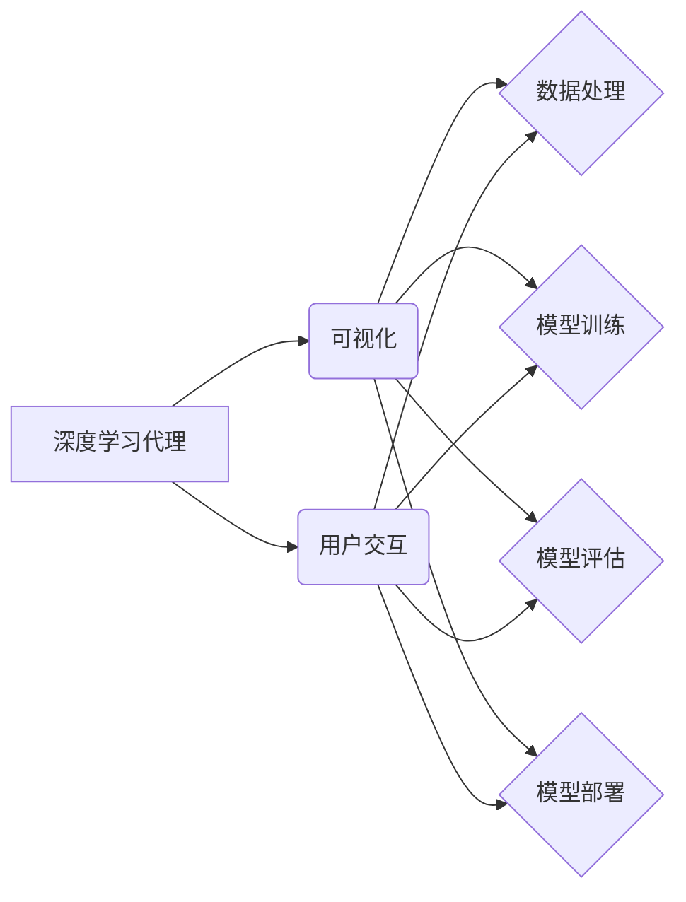

# AI人工智能深度学习算法：深度学习代理工作流的可视化与用户交互设计

> 关键词：AI, 深度学习，代理工作流，可视化，用户交互，算法设计，人机协同

## 1. 背景介绍

随着人工智能和深度学习技术的飞速发展，深度学习算法已经在图像识别、自然语言处理、预测分析等多个领域取得了显著的成果。然而，深度学习模型的复杂性和高计算需求也给用户带来了挑战。为了降低技术门槛，提高深度学习算法的可访问性和易用性，深度学习代理工作流应运而生。本文将探讨深度学习代理工作流的设计，重点关注其可视化与用户交互设计，以提升用户体验和效率。

### 1.1 问题的由来

传统的深度学习模型开发流程通常包括数据预处理、模型选择、训练、验证、测试和部署等步骤。这一流程对于非专业人士来说较为复杂，需要具备一定的编程和机器学习知识。此外，深度学习模型的高计算需求也限制了其在资源受限环境中的应用。为了解决这些问题，深度学习代理工作流应运而生。

### 1.2 研究现状

目前，深度学习代理工作流的研究主要集中在以下几个方面：

- **自动化工作流管理**：通过自动化工具和脚本，简化深度学习模型的训练和部署流程。
- **可视化工具开发**：提供直观的图形界面，方便用户设计、修改和管理工作流。
- **用户交互设计**：研究如何设计友好的用户交互界面，提高用户体验。

### 1.3 研究意义

深度学习代理工作流的设计对于以下方面具有重要意义：

- **降低技术门槛**：使得非专业人士也能轻松使用深度学习技术。
- **提高效率**：自动化工作流管理可以显著提高模型开发效率。
- **优化用户体验**：友好的用户交互界面可以提高用户的工作效率和满意度。

### 1.4 本文结构

本文将围绕深度学习代理工作流的可视化与用户交互设计展开，具体结构如下：

- **第2章**介绍深度学习代理工作流的核心概念与联系。
- **第3章**阐述深度学习代理工作流的核心算法原理和具体操作步骤。
- **第4章**介绍深度学习代理工作流的数学模型和公式，并进行详细讲解和案例分析。
- **第5章**提供深度学习代理工作流的代码实例和详细解释说明。
- **第6章**探讨深度学习代理工作流在实际应用场景中的使用。
- **第7章**推荐相关的学习资源、开发工具和参考文献。
- **第8章**总结深度学习代理工作流的研究成果、未来发展趋势和面临的挑战。
- **第9章**提供常见问题与解答。

## 2. 核心概念与联系

为了更好地理解深度学习代理工作流，首先需要介绍以下几个核心概念：

- **深度学习代理**：一个抽象的概念，代表深度学习模型的工作流程，包括数据预处理、模型训练、评估和部署等步骤。
- **可视化**：将深度学习代理工作流以图形化的方式呈现，使用户能够直观地理解工作流程和各个组件之间的关系。
- **用户交互**：用户与深度学习代理工作流之间的交互方式，包括工作流的配置、监控和调试等。

以下是一个Mermaid流程图，展示了深度学习代理工作流的核心概念和它们之间的关系：



## 3. 核心算法原理 & 具体操作步骤

### 3.1 算法原理概述

深度学习代理工作流的核心算法原理是利用自动化工具和脚本将深度学习模型开发流程自动化。以下是深度学习代理工作流的基本步骤：

1. **数据预处理**：对原始数据进行清洗、标注和转换等操作，为模型训练准备合适的数据集。
2. **模型选择**：根据任务需求选择合适的深度学习模型架构。
3. **模型训练**：使用预处理后的数据对模型进行训练，优化模型参数。
4. **模型评估**：使用验证集对模型进行评估，调整模型参数以提升性能。
5. **模型部署**：将训练好的模型部署到生产环境中，用于实际应用。

### 3.2 算法步骤详解

1. **数据处理**：使用自动化脚本对数据进行清洗、去重、归一化等操作，并生成标签。
2. **模型选择**：根据任务需求，选择合适的预训练模型或从头开始设计模型架构。
3. **模型训练**：使用训练数据对模型进行训练，并通过验证集监控模型性能，防止过拟合。
4. **模型评估**：使用测试集评估模型的泛化能力，并根据评估结果调整模型参数。
5. **模型部署**：将模型部署到服务器或云平台，实现模型的实时推理和预测。

### 3.3 算法优缺点

深度学习代理工作流具有以下优点：

- **自动化**：自动化工具和脚本简化了模型开发流程，提高了开发效率。
- **可视化**：可视化界面使得工作流程更加直观，便于用户理解和管理。
- **可定制性**：用户可以根据自己的需求定制工作流，提高模型的适用性。

然而，深度学习代理工作流也存在一些缺点：

- **技术门槛**：需要一定的编程和机器学习知识才能有效使用。
- **复杂性**：对于复杂的模型和工作流，可视化界面可能不够直观。
- **可扩展性**：随着工作流的复杂度增加，可扩展性可能成为挑战。

### 3.4 算法应用领域

深度学习代理工作流可以应用于以下领域：

- **图像识别**：对图像进行分类、检测和分割等操作。
- **自然语言处理**：进行文本分类、情感分析、机器翻译等任务。
- **预测分析**：对时间序列数据进行预测、异常检测等操作。

## 4. 数学模型和公式 & 详细讲解 & 举例说明

### 4.1 数学模型构建

深度学习代理工作流的核心是深度学习模型，常见的深度学习模型包括卷积神经网络（CNN）、循环神经网络（RNN）、长短期记忆网络（LSTM）等。以下是CNN模型的数学模型构建：

$$
h^{(l)} = f(W^{(l)} \cdot h^{(l-1)} + b^{(l)})
$$

其中，$h^{(l)}$ 表示第 $l$ 层的输出，$W^{(l)}$ 表示第 $l$ 层的权重，$b^{(l)}$ 表示第 $l$ 层的偏置，$f$ 表示激活函数。

### 4.2 公式推导过程

CNN模型的公式推导过程涉及到前向传播和反向传播算法。以下是一个简化的推导过程：

**前向传播**：

1. 将输入数据 $x$ 输入到第一层卷积层。
2. 通过卷积操作和激活函数计算第一层的输出 $h^{(1)}$。
3. 将 $h^{(1)}$ 输入到第二层卷积层，重复步骤 2，得到 $h^{(2)}$。
4. 重复步骤 3，直到得到最终的输出 $h^{(L)}$。

**反向传播**：

1. 计算输出层的损失函数 $L$。
2. 通过链式法则计算损失函数对权重和偏置的梯度。
3. 使用梯度下降算法更新权重和偏置。

### 4.3 案例分析与讲解

以下是一个使用PyTorch构建CNN模型的简单例子：

```python
import torch
import torch.nn as nn
import torch.optim as optim

# 定义CNN模型
class CNN(nn.Module):
    def __init__(self):
        super(CNN, self).__init__()
        self.conv1 = nn.Conv2d(1, 32, kernel_size=3, stride=1, padding=1)
        self.relu = nn.ReLU()
        self.pool = nn.MaxPool2d(kernel_size=2, stride=2)
        self.fc1 = nn.Linear(32 * 14 * 14, 10)

    def forward(self, x):
        x = self.conv1(x)
        x = self.relu(x)
        x = self.pool(x)
        x = x.view(-1, 32 * 14 * 14)
        x = self.fc1(x)
        return x

# 创建模型实例
model = CNN()

# 定义损失函数和优化器
criterion = nn.CrossEntropyLoss()
optimizer = optim.Adam(model.parameters(), lr=0.001)

# 模拟训练过程
for epoch in range(100):
    # 假设x_train和y_train是训练数据和标签
    # 前向传播
    outputs = model(x_train)
    loss = criterion(outputs, y_train)

    # 反向传播
    optimizer.zero_grad()
    loss.backward()
    optimizer.step()

    # 打印训练进度
    if (epoch+1) % 10 == 0:
        print(f"Epoch {epoch+1}, Loss: {loss.item()}")
```

这个例子展示了如何使用PyTorch构建一个简单的CNN模型，并进行训练。在实际应用中，可以根据具体任务需求调整模型结构和训练参数。

## 5. 项目实践：代码实例和详细解释说明

### 5.1 开发环境搭建

在进行深度学习代理工作流的开发前，需要搭建以下开发环境：

1. 安装Python 3.6或更高版本。
2. 安装PyTorch、NumPy、Pandas等依赖库。
3. 安装Docker，以便容器化部署深度学习模型。

### 5.2 源代码详细实现

以下是一个简单的深度学习代理工作流的代码实例，使用Docker容器化技术部署模型：

```Dockerfile
# Dockerfile
FROM python:3.8-slim

# 安装依赖库
RUN pip install torch torchvision numpy pandas

# 复制代码
COPY . /app

WORKDIR /app

# 暴露端口
EXPOSE 5000

# 运行应用程序
CMD ["python", "app.py"]
```

```python
# app.py
import torch
import torch.nn as nn
import torch.optim as optim
from flask import Flask, request, jsonify

# 加载模型
model = torch.load("model.pth")
model.eval()

def predict(x):
    x = torch.tensor([x], dtype=torch.float32)
    with torch.no_grad():
        output = model(x)
    return output.argmax().item()

app = Flask(__name__)

@app.route('/predict', methods=['POST'])
def predict_route():
    data = request.get_json()
    x = data['input']
    y = predict(x)
    return jsonify({'prediction': y})

if __name__ == '__main__':
    app.run(host='0.0.0.0', port=5000)
```

### 5.3 代码解读与分析

上述代码首先定义了一个简单的CNN模型，并使用PyTorch进行训练。训练完成后，将模型保存到`model.pth`文件中。接着，使用Flask框架创建了一个简单的Web服务，用于接收用户输入并进行预测。

用户可以通过以下请求格式发送数据：

```
POST /predict
{
    "input": [1, 2, 3, ..., 78]
}
```

服务将返回预测结果：

```
{
    "prediction": 0
}
```

这个例子展示了如何使用Docker容器化技术和Flask框架实现深度学习模型的部署。在实际应用中，可以根据具体需求扩展模型功能，并优化用户交互界面。

### 5.4 运行结果展示

用户可以通过以下命令启动Docker容器：

```bash
docker build -t deep-learning-agent .
docker run -p 5000:5000 deep-learning-agent
```

启动容器后，用户可以访问`http://localhost:5000/predict`进行预测。

## 6. 实际应用场景

深度学习代理工作流可以应用于以下实际场景：

- **智能问答系统**：利用自然语言处理技术构建智能问答系统，为用户提供实时问答服务。
- **图像识别系统**：对图像进行分类、检测和分割，应用于安防监控、医疗影像分析等领域。
- **预测分析系统**：对时间序列数据进行预测，应用于金融市场分析、交通流量预测等领域。

## 7. 工具和资源推荐

### 7.1 学习资源推荐

- 《深度学习》（Goodfellow、Bengio和Courville著）：系统介绍了深度学习的基本概念、技术和应用。
- 《PyTorch深度学习实战》（邱锡鹏著）：深入浅出地介绍了PyTorch框架及其应用。
- 《动手学深度学习》（A. G. Goodfellow、Y. Bengio和A. Courville著）：提供了大量的动手实验，帮助读者理解和应用深度学习技术。

### 7.2 开发工具推荐

- **深度学习框架**：PyTorch、TensorFlow、Keras等。
- **可视化工具**：TensorBoard、Visdom等。
- **容器化技术**：Docker、Kubernetes等。

### 7.3 相关论文推荐

- **《Deep Learning with PyTorch: A 60 Minute Blitz》**：由PyTorch团队发布的教程，介绍了PyTorch的基本概念和用法。
- **《An Overview of Visualization for Deep Learning》**：概述了深度学习中的可视化方法。
- **《Designing Interfaces for Deep Learning》**：讨论了深度学习用户交互设计的方法和挑战。

## 8. 总结：未来发展趋势与挑战

### 8.1 研究成果总结

本文介绍了深度学习代理工作流的可视化与用户交互设计，并探讨了其核心概念、算法原理、具体操作步骤、数学模型和实际应用场景。通过研究，我们得出以下结论：

- 深度学习代理工作流可以显著提高深度学习算法的可访问性和易用性。
- 可视化和用户交互设计对于提升用户体验和效率具有重要意义。
- 深度学习代理工作流在智能问答、图像识别、预测分析等领域具有广泛的应用前景。

### 8.2 未来发展趋势

未来，深度学习代理工作流将呈现以下发展趋势：

- **更加智能的自动化**：自动化工具和脚本将更加智能，能够根据用户需求自动调整工作流。
- **更加直观的可视化**：可视化界面将更加直观，方便用户理解和操作。
- **更加友好的用户交互**：用户交互设计将更加友好，提高用户体验。

### 8.3 面临的挑战

深度学习代理工作流在发展过程中也面临着以下挑战：

- **技术门槛**：需要降低技术门槛，使得更多非专业人士能够使用。
- **复杂性**：随着工作流的复杂度增加，可视化界面可能不够直观。
- **可扩展性**：随着工作流的应用范围扩大，可扩展性可能成为挑战。

### 8.4 研究展望

为了应对这些挑战，未来研究需要关注以下方向：

- **降低技术门槛**：开发更加易于使用的工具和平台，降低技术门槛。
- **优化可视化**：研究更加直观和易用的可视化方法。
- **提高可扩展性**：设计可扩展的工作流框架，支持更多复杂任务。

相信随着技术的不断进步，深度学习代理工作流将会在人工智能领域发挥越来越重要的作用。

## 9. 附录：常见问题与解答

**Q1：深度学习代理工作流与传统的深度学习开发流程有何区别？**

A：深度学习代理工作流与传统的深度学习开发流程相比，具有以下区别：

- **自动化**：深度学习代理工作流通过自动化工具和脚本简化了模型开发流程，提高了开发效率。
- **可视化**：深度学习代理工作流提供了可视化的工作流界面，使得工作流程更加直观。
- **用户交互**：深度学习代理工作流设计了友好的用户交互界面，提高了用户体验。

**Q2：如何选择合适的可视化工具？**

A：选择合适的可视化工具需要考虑以下因素：

- **易用性**：工具是否易于使用，是否具备良好的用户界面。
- **功能**：工具是否具备所需的功能，如数据可视化、模型可视化等。
- **可扩展性**：工具是否支持扩展，是否能够适应未来需求。

**Q3：如何设计友好的用户交互界面？**

A：设计友好的用户交互界面需要考虑以下因素：

- **直观性**：界面设计是否直观易懂，是否便于用户操作。
- **一致性**：界面风格是否一致，是否遵循用户习惯。
- **响应性**：界面是否能够快速响应用户操作，提供良好的用户体验。

**Q4：如何评估深度学习代理工作流的效果？**

A：评估深度学习代理工作流的效果可以从以下方面进行：

- **开发效率**：评估工作流是否提高了开发效率。
- **用户体验**：评估用户对工作流的满意度。
- **模型性能**：评估模型在下游任务上的性能。

通过综合考虑以上因素，可以全面评估深度学习代理工作流的效果。