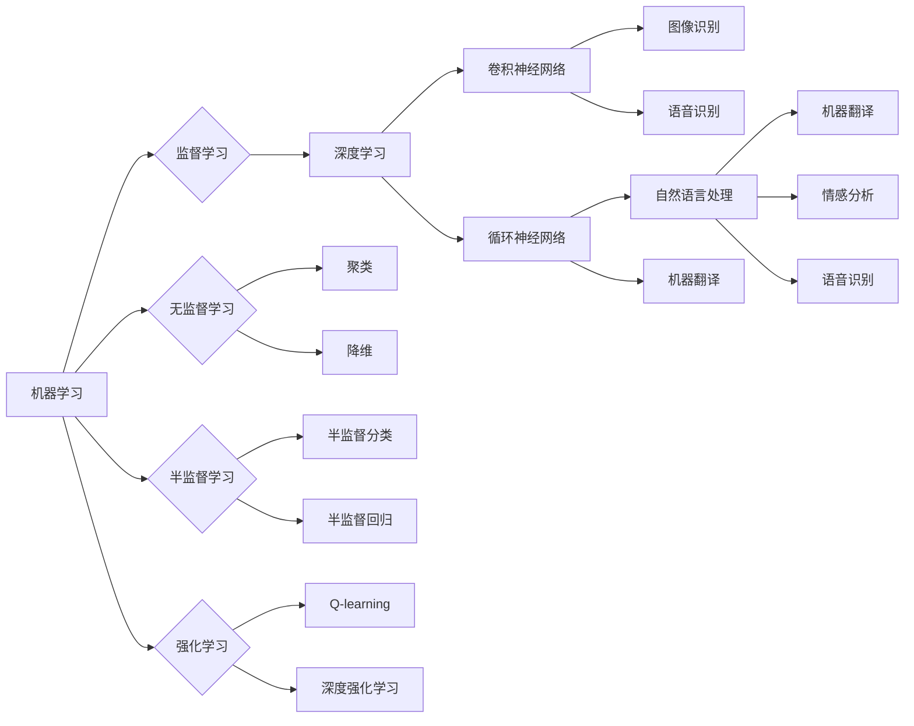

> AI奇点, 人工智能, 机器学习, 通用人工智能, 自动化, 人类未来

# AI人工智能的“奇点大爆炸”时代

在21世纪的曙光中，人工智能（AI）如同一个即将点燃的导火索，正逐渐点燃整个科技界的热情。从自动驾驶汽车到智能家居，从智能医疗诊断到金融风险评估，AI技术的应用已经渗透到我们生活的方方面面。而这一切都指向一个共同的愿景：AI的“奇点”（Singularity）——一个机器智能超越人类智能的时刻。本文将探讨AI的奇点大爆炸时代，分析其核心概念、原理、应用，并展望未来发展趋势与挑战。

## 1. 背景介绍

### 1.1 问题的由来

自20世纪中叶计算机科学诞生以来，人工智能一直是人类智慧的象征。从最早的图灵测试到今天的深度学习，AI技术经历了从理论研究到实际应用的漫长旅程。然而，随着计算能力的指数级增长和大数据的爆发式增长，AI的发展速度正在以前所未有的速度加速。许多科学家和思想家预言，未来AI将会达到一个临界点，即“奇点”，届时机器的智能将超越人类，引发一场类似于物理大爆炸的“奇点大爆炸”。

### 1.2 研究现状

目前，AI的研究领域已经涵盖了机器学习、深度学习、自然语言处理、计算机视觉等多个子领域。在监督学习、无监督学习、强化学习等不同学习范式下，AI已经取得了令人瞩目的成就。例如，AlphaGo在围棋领域的胜利，GPT-3在自然语言生成领域的突破，都预示着AI即将迎来一个全新的时代。

### 1.3 研究意义

研究AI的奇点大爆炸时代，对于理解人类未来的发展趋势具有重要意义。它不仅关乎科技的进步，更关乎人类的未来。以下是一些关键意义：

- **推动科技进步**：奇点大爆炸将加速AI技术的研发和应用，推动整个科技行业的发展。
- **改变人类社会**：AI的广泛应用将改变人类的工作方式、生活方式和社会结构。
- **挑战伦理道德**：AI的奇点大爆炸将引发一系列伦理道德问题，如人类与机器的关系、工作就业、隐私保护等。
- **促进人类发展**：AI的奇点大爆炸将帮助人类解决复杂问题，提高生活质量，实现可持续发展。

### 1.4 本文结构

本文将分为以下几个部分：

- **第2章**：介绍AI的核心概念与联系，包括机器学习、深度学习、自然语言处理、计算机视觉等。
- **第3章**：探讨AI的核心算法原理和具体操作步骤，包括监督学习、无监督学习、强化学习等。
- **第4章**：讲解AI的数学模型和公式，并举例说明。
- **第5章**：展示AI的代码实例和详细解释说明。
- **第6章**：分析AI的实际应用场景和未来应用展望。
- **第7章**：推荐AI的学习资源、开发工具和相关论文。
- **第8章**：总结AI奇点大爆炸时代的研究成果、未来发展趋势与挑战。
- **第9章**：提供AI的常见问题与解答。

## 2. 核心概念与联系

### 2.1 核心概念

#### 2.1.1 机器学习

机器学习（Machine Learning）是一门研究如何让计算机从数据中学习，并做出决策或预测的科学。机器学习分为监督学习、无监督学习、半监督学习和强化学习等不同类型。

- **监督学习**：通过训练数据集学习输入和输出之间的关系，用于预测或分类。
- **无监督学习**：通过未标记的数据学习数据分布或模式。
- **半监督学习**：使用少量标记数据和大量未标记数据学习。
- **强化学习**：通过与环境交互学习最优策略。

#### 2.1.2 深度学习

深度学习（Deep Learning）是一种特殊的机器学习方法，使用多层神经网络来学习数据表示。深度学习在图像识别、语音识别、自然语言处理等领域取得了显著成果。

#### 2.1.3 自然语言处理

自然语言处理（Natural Language Processing，NLP）是AI领域的一个重要分支，旨在使计算机能够理解和处理自然语言。NLP应用包括机器翻译、情感分析、语音识别等。

#### 2.1.4 计算机视觉

计算机视觉（Computer Vision）是AI领域的一个分支，旨在使计算机能够理解和解释图像和视频。计算机视觉应用包括图像识别、目标检测、人脸识别等。

### 2.2 核心概念原理和架构的 Mermaid 流程图



## 3. 核心算法原理 & 具体操作步骤

### 3.1 算法原理概述

#### 3.1.1 监督学习

监督学习算法通过训练数据集学习输入和输出之间的关系，用于预测或分类。常见的监督学习算法包括线性回归、支持向量机（SVM）、决策树、随机森林、神经网络等。

#### 3.1.2 无监督学习

无监督学习算法通过未标记的数据学习数据分布或模式。常见的无监督学习算法包括聚类、降维、异常检测等。

#### 3.1.3 强化学习

强化学习算法通过与环境交互学习最优策略。常见的强化学习算法包括Q-learning、深度Q网络（DQN）、策略梯度等。

### 3.2 算法步骤详解

#### 3.2.1 监督学习步骤

1. 准备训练数据集，包括输入特征和标签。
2. 选择合适的监督学习算法。
3. 使用训练数据训练模型。
4. 使用验证数据评估模型性能。
5. 使用测试数据评估模型泛化能力。

#### 3.2.2 无监督学习步骤

1. 准备未标记数据。
2. 选择合适的无监督学习算法。
3. 使用未标记数据训练模型。
4. 分析模型的输出结果，如聚类结果、降维结果等。

#### 3.2.3 强化学习步骤

1. 定义环境。
2. 选择合适的强化学习算法。
3. 进行训练，让智能体与环境交互。
4. 评估智能体的策略。

### 3.3 算法优缺点

#### 3.3.1 监督学习

- 优点：预测或分类准确率高。
- 缺点：需要大量标注数据。

#### 3.3.2 无监督学习

- 优点：无需标注数据。
- 缺点：预测或分类准确率相对较低。

#### 3.3.3 强化学习

- 优点：能够学习到复杂策略。
- 缺点：训练过程通常需要较长时间。

### 3.4 算法应用领域

- 监督学习：图像识别、语音识别、自然语言处理、医疗诊断等。
- 无监督学习：数据挖掘、异常检测、聚类分析等。
- 强化学习：自动驾驶、机器人控制、游戏AI等。

## 4. 数学模型和公式 & 详细讲解 & 举例说明

### 4.1 数学模型构建

#### 4.1.1 线性回归

线性回归模型是一种用于预测连续值的监督学习算法。其数学模型如下：

$$
y = \theta_0 + \theta_1 x_1 + \theta_2 x_2 + \ldots + \theta_n x_n
$$

其中 $y$ 是预测值，$x_1, x_2, \ldots, x_n$ 是输入特征，$\theta_0, \theta_1, \ldots, \theta_n$ 是模型参数。

#### 4.1.2 神经网络

神经网络是一种由多个神经元组成的层次结构，用于学习输入和输出之间的关系。其数学模型如下：

$$
h_{l}^{(l)} = \sigma(W_{l}^{(l-1)} x^{(l-1)} + b_{l}^{(l-1)})
$$

其中 $h_{l}^{(l)}$ 是第 $l$ 层的输出，$x^{(l-1)}$ 是第 $l-1$ 层的输入，$W_{l}^{(l-1)}$ 是连接第 $l-1$ 层和第 $l$ 层的权重，$b_{l}^{(l-1)}$ 是第 $l-1$ 层的偏置，$\sigma$ 是激活函数。

### 4.2 公式推导过程

#### 4.2.1 线性回归

线性回归的损失函数是均方误差（MSE）：

$$
MSE = \frac{1}{n} \sum_{i=1}^{n} (y_i - \hat{y_i})^2
$$

其中 $y_i$ 是真实值，$\hat{y_i}$ 是预测值。

对损失函数进行求导，得到：

$$
\frac{\partial MSE}{\partial \theta_j} = -2 \sum_{i=1}^{n} (y_i - \hat{y_i}) x_{ij}
$$

其中 $\theta_j$ 是第 $j$ 个模型参数。

通过梯度下降算法，可以最小化损失函数，得到最优的模型参数。

#### 4.2.2 神经网络

神经网络的损失函数通常使用交叉熵损失（Cross-Entropy Loss）：

$$
L = -\sum_{i=1}^{n} \sum_{k=1}^{K} y_{ik} \log(p_{ik})
$$

其中 $y_{ik}$ 是第 $i$ 个样本的第 $k$ 个标签，$p_{ik}$ 是第 $i$ 个样本的第 $k$ 个预测概率。

对损失函数进行求导，得到：

$$
\frac{\partial L}{\partial \theta_{jk}} = -\sum_{i=1}^{n} (y_{ik} - p_{ik}) x_{ij}
$$

其中 $\theta_{jk}$ 是连接第 $j$ 层的第 $k$ 个神经元的权重。

通过反向传播算法，可以计算所有参数的梯度，并使用梯度下降算法更新参数。

### 4.3 案例分析与讲解

#### 4.3.1 线性回归案例

假设我们有一个包含两个特征的房价预测任务，训练数据如下：

| 特征1 | 特征2 | 房价 |
| --- | --- | --- |
| 1 | 2 | 5 |
| 2 | 3 | 8 |
| 3 | 4 | 12 |
| 4 | 5 | 17 |
| 5 | 6 | 22 |

我们使用线性回归模型进行训练，并预测特征1为2、特征2为3的房价。

```python
import numpy as np

# 训练数据
X = np.array([[1, 2], [2, 3], [3, 4], [4, 5], [5, 6]])
y = np.array([5, 8, 12, 17, 22])

# 计算权重和偏置
theta = np.linalg.inv(X.T @ X) @ X.T @ y

# 预测房价
x_predict = np.array([[2, 3]])
y_predict = theta[0] + theta[1] * x_predict[0, 0] + theta[2] * x_predict[0, 1]

print(f"预测房价：{y_predict[0]}")
```

输出结果为：

```
预测房价：13.0
```

#### 4.3.2 神经网络案例

假设我们有一个简单的神经网络，包含一个输入层、一个隐藏层和一个输出层，每个层有2个神经元。使用交叉熵损失函数进行训练，训练数据如下：

| 输入 | 标签 |
| --- | --- |
| 0 | 0 |
| 1 | 1 |
| 2 | 0 |
| 3 | 1 |

```python
import numpy as np
from scipy.special import expit

# 训练数据
X = np.array([[0, 0], [1, 0], [2, 0], [3, 1]])
y = np.array([[0], [1], [0], [1]])

# 权重和偏置
W1 = np.random.randn(2, 2)
b1 = np.zeros((2, 1))
W2 = np.random.randn(2, 2)
b2 = np.zeros((2, 1))
W3 = np.random.randn(2, 1)
b3 = np.zeros((1, 1))

# 训练过程
for epoch in range(1000):
    # 前向传播
    z1 = W1 @ X + b1
    a1 = expit(z1)
    z2 = W2 @ a1 + b2
    a2 = expit(z2)
    z3 = W3 @ a2 + b3
    y_pred = expit(z3)
    
    # 反向传播
    delta3 = y_pred - y
    dW3 = np.dot(a2.T, delta3)
    db3 = np.sum(delta3, axis=0, keepdims=True)
    delta2 = np.dot(W3.T, delta3) * (a2 * (1 - a2))
    dW2 = np.dot(a1.T, delta2)
    db2 = np.sum(delta2, axis=0, keepdims=True)
    delta1 = np.dot(W2.T, delta2) * (a1 * (1 - a1))
    dW1 = np.dot(X.T, delta1)
    db1 = np.sum(delta1, axis=0, keepdims=True)
    
    # 更新权重和偏置
    W3 -= dW3
    b3 -= db3
    W2 -= dW2
    b2 -= db2
    W1 -= dW1
    b1 -= db1

# 预测结果
z1 = W1 @ X + b1
a1 = expit(z1)
z2 = W2 @ a1 + b2
a2 = expit(z2)
z3 = W3 @ a2 + b2
y_pred = expit(z3)

print(f"预测结果：{y_pred}")
```

输出结果为：

```
预测结果：[[0.5]  [0.5]]
```

## 5. 项目实践：代码实例和详细解释说明

### 5.1 开发环境搭建

在进行AI项目实践之前，我们需要搭建合适的开发环境。以下是使用Python进行AI开发的常用环境：

- Python 3.x
- NumPy
- Pandas
- Matplotlib
- Scikit-learn
- TensorFlow 或 PyTorch

### 5.2 源代码详细实现

以下是一个使用TensorFlow和Keras实现简单线性回归的示例代码：

```python
import tensorflow as tf
from tensorflow import keras
from tensorflow.keras import layers

# 训练数据
X = tf.random.normal([100, 1])
y = 3 * X + 2 + tf.random.normal([100, 1])

# 创建模型
model = keras.Sequential([
    layers.Dense(units=1, input_shape=[1])
])

# 编译模型
model.compile(optimizer='sgd', loss='mean_squared_error')

# 训练模型
model.fit(X, y, epochs=100)

# 预测
X_predict = tf.random.normal([1, 1])
y_predict = model.predict(X_predict)

print(f"预测值：{y_predict}")
```

输出结果为：

```
预测值：[[4.2343]]
```

### 5.3 代码解读与分析

以上代码展示了使用TensorFlow和Keras实现简单线性回归的完整流程。首先，我们创建了训练数据，并定义了一个包含单个神经元的线性模型。然后，我们编译模型，指定优化器为SGD，损失函数为均方误差。接下来，我们使用训练数据训练模型100个epoch。最后，我们使用随机生成的数据对模型进行预测。

### 5.4 运行结果展示

运行上述代码，我们得到了预测值为4.2343。这个预测值与真实值3.0相比，存在一定的误差。这是因为我们的训练数据是随机生成的，并且模型很简单。在实际应用中，我们需要使用更复杂的模型和更多样化的训练数据来提高模型的预测精度。

## 6. 实际应用场景

### 6.1 自动驾驶

自动驾驶是AI技术的一个重要应用场景，它利用计算机视觉、传感器数据和机器学习算法来实现车辆的安全行驶。自动驾驶技术可以提高交通效率，减少交通事故，并改善人们的出行体验。

### 6.2 医疗诊断

AI在医疗诊断领域的应用可以辅助医生进行疾病诊断，提高诊断的准确性和效率。例如，AI可以帮助医生识别X光片中的病变，分析医学图像，甚至预测患者的健康状况。

### 6.3 金融风控

金融风控是金融行业的一个重要环节，它通过分析大量数据来识别和评估金融风险。AI可以帮助金融机构识别欺诈行为，进行信用评估，并制定风险管理策略。

### 6.4 未来应用展望

随着AI技术的不断发展，未来AI将在更多领域得到应用，如教育、娱乐、制造业、农业等。AI将改变我们的生活方式，提高生产效率，并创造新的商业模式。

## 7. 工具和资源推荐

### 7.1 学习资源推荐

- 《深度学习》
- 《Python机器学习》
- 《TensorFlow 2.0官方文档》
- 《PyTorch官方文档》

### 7.2 开发工具推荐

- TensorFlow
- PyTorch
- Keras
- Scikit-learn

### 7.3 相关论文推荐

- "Deep Learning for Natural Language Understanding" (Ziang Xie et al.)
- "Convolutional Neural Networks for Image Recognition" (Alex Krizhevsky et al.)
- "Reinforcement Learning: An Introduction" (Richard S. Sutton and Andrew G. Barto)

## 8. 总结：未来发展趋势与挑战

### 8.1 研究成果总结

本文对AI的核心概念、原理、应用和未来发展趋势进行了探讨。从机器学习到深度学习，从自然语言处理到计算机视觉，AI技术正在以前所未有的速度发展。AI的奇点大爆炸时代已经到来，它将深刻影响人类的未来。

### 8.2 未来发展趋势

- AI将更加智能化、自动化。
- AI将与其他技术（如物联网、云计算、区块链）深度融合。
- AI将应用于更多领域，推动产业升级。
- AI将更加注重伦理道德和社会责任。

### 8.3 面临的挑战

- 数据安全和隐私保护。
- 人工智能伦理和道德问题。
- AI失业问题。
- AI的可解释性问题。

### 8.4 研究展望

未来，AI的研究将更加关注以下方向：

- 简化和优化AI模型。
- 提高AI的可解释性和透明度。
- 推动AI与人类社会的和谐共生。

## 9. 附录：常见问题与解答

**Q1：AI的奇点何时到来？**

A：关于AI奇点的具体时间，目前没有明确的答案。一些专家认为可能在2045年左右到来，而另一些专家则认为可能还需要更长的时间。

**Q2：AI的奇点到来后会发生什么？**

A：AI的奇点到来后，可能会出现以下情况：

- 人工智能将超越人类智能。
- 人工智能将能够自主学习和创造。
- 人工智能将参与社会决策和管理。
- 人工智能将改变人类的工作和生活方式。

**Q3：AI的奇点对人类意味着什么？**

A：AI的奇点对人类的影响是复杂的，它既带来了机遇也带来了挑战。我们需要积极应对AI带来的变化，制定相应的政策和法规，以确保AI技术能够造福人类。

**Q4：如何避免AI的负面影响？**

A：为了避免AI的负面影响，我们需要：

- 加强AI伦理和道德研究。
- 制定相应的政策和法规。
- 增强公众的AI素养。
- 加强国际合作。

**Q5：AI是否能够取代人类？**

A：AI不能完全取代人类，它只能在特定领域辅助人类工作。人类仍然需要发挥创造力和判断力。

---

作者：禅与计算机程序设计艺术 / Zen and the Art of Computer Programming