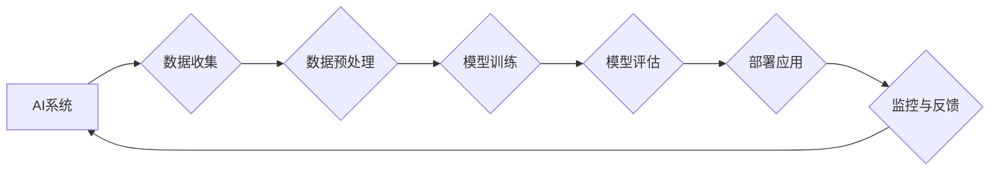

# AI伦理与算法公平性原理与代码实战案例讲解

> 关键词：AI伦理，算法公平性，机器学习，公平性度量，偏见检测，代码实战，案例研究

## 1. 背景介绍

随着人工智能（AI）技术的飞速发展，AI已经渗透到我们生活的方方面面，从智能推荐系统到自动驾驶汽车，从医疗诊断到金融风控。然而，AI系统的不透明性、偏见和潜在的伦理问题也逐渐引起了广泛关注。本文将深入探讨AI伦理与算法公平性的原理，并通过代码实战案例展示如何在实际应用中评估和改进算法公平性。

### 1.1 问题的由来

AI伦理和算法公平性的问题源于以下几个方面：

- **算法偏见**：AI模型可能在训练过程中学习到数据的偏见，从而在决策过程中产生不公平的结果。
- **数据偏差**：数据本身可能存在偏差，例如，在性别、年龄、种族等方面的数据不均衡，会导致AI模型在这些群体上的表现不佳。
- **模型不透明性**：复杂的AI模型（如深度学习）往往难以解释其决策过程，这增加了人们对其公平性和可靠性的担忧。

### 1.2 研究现状

为了解决AI伦理和算法公平性问题，学术界和工业界已经提出了多种解决方案：

- **公平性度量**：开发用于评估算法公平性的指标，如偏差指标、差异度量等。
- **偏见检测**：识别和量化模型中的偏见，并尝试去除或缓解这些偏见。
- **可解释AI**：提高AI模型的可解释性，使人们能够理解模型的决策过程。

### 1.3 研究意义

研究AI伦理与算法公平性对于构建一个公正、公平的AI世界具有重要意义：

- **社会公正**：确保AI系统对所有用户公平，避免对某些群体造成不公平的对待。
- **信任构建**：提高公众对AI系统的信任，促进AI技术的发展和应用。
- **法律责任**：为AI系统的决策提供透明度和可解释性，便于法律责任的追责。

### 1.4 本文结构

本文将按照以下结构展开：

- **第2章**：介绍AI伦理与算法公平性的核心概念。
- **第3章**：阐述算法公平性的核心算法原理和具体操作步骤。
- **第4章**：讲解数学模型和公式，并通过案例进行分析。
- **第5章**：通过代码实例展示如何在实际应用中评估和改进算法公平性。
- **第6章**：探讨AI伦理与算法公平性在实际应用场景中的应用。
- **第7章**：推荐相关工具和资源。
- **第8章**：总结未来发展趋势和挑战。
- **第9章**：提供常见问题与解答。

## 2. 核心概念与联系

### 2.1 核心概念原理

#### Mermaid 流程图



### 2.2 核心概念联系

- **数据收集**：收集的数据可能存在偏见，需要通过数据预处理来缓解。
- **数据预处理**：包括数据清洗、数据增强、数据平衡等，以提高数据质量。
- **模型训练**：训练过程中，模型可能会学习到数据的偏见，需要通过公平性度量来检测。
- **模型评估**：使用公平性度量指标来评估模型的公平性。
- **部署应用**：将模型部署到实际应用中，需要监控其性能和公平性。
- **监控与反馈**：收集用户反馈和模型性能数据，以持续改进模型。

## 3. 核心算法原理 & 具体操作步骤

### 3.1 算法原理概述

算法公平性主要包括以下几个方面：

- **偏差度量**：评估模型在不同群体上的性能差异。
- **敏感性分析**：分析模型对输入数据的敏感度。
- **逆公平性分析**：分析模型对特定群体的保护程度。

### 3.2 算法步骤详解

#### 3.2.1 偏差度量

1. **定义公平性指标**：选择合适的公平性指标，如 demographics parity、equal opportunity等。
2. **计算指标**：计算模型在不同群体上的性能指标。
3. **分析结果**：分析指标差异，确定是否存在偏见。

#### 3.2.2 敏感性分析

1. **选择敏感性分析指标**：如Egalitarian fairness、Consistency fairness等。
2. **计算指标**：计算模型对输入数据的敏感度。
3. **分析结果**：分析敏感度，确定模型对输入数据的敏感度是否过高。

#### 3.2.3 逆公平性分析

1. **定义保护群体**：确定需要保护的群体。
2. **计算逆公平性指标**：如Differential Fairness、Counterfactual Fairness等。
3. **分析结果**：分析指标，确定模型对保护群体的保护程度。

### 3.3 算法优缺点

#### 3.3.1 优点

- **提高模型公平性**：通过分析模型在不同群体上的性能差异，可以识别和缓解模型的偏见。
- **增强用户信任**：提高模型的可解释性和透明度，增强用户对AI系统的信任。

#### 3.3.2 缺点

- **计算复杂度高**：计算公平性指标需要大量的计算资源。
- **模型性能下降**：为了提高公平性，可能需要牺牲模型性能。

### 3.4 算法应用领域

算法公平性在以下领域有广泛应用：

- **招聘与就业**：确保招聘过程对所有候选人公平。
- **信贷评估**：避免在信贷评估中的歧视。
- **医疗诊断**：确保医疗诊断对所有患者公平。

## 4. 数学模型和公式 & 详细讲解 & 举例说明

### 4.1 数学模型构建

假设有一个分类问题，我们需要评估模型在不同群体上的公平性。

- $x$ 表示输入特征向量。
- $y$ 表示真实标签。
- $\hat{y}$ 表示模型预测标签。
- $D$ 表示训练数据集。

我们可以使用以下公式来衡量模型在不同群体上的公平性：

$$
\text{FPN}(D) = \frac{1}{N} \sum_{i=1}^{N} \frac{\text{FP}(x_i)}{N_i}
$$

其中，$\text{FP}(x_i)$ 表示样本 $x_i$ 的错误预测数量，$N_i$ 表示群体 $i$ 中的样本数量。

### 4.2 公式推导过程

假设我们有 $N$ 个样本，每个样本属于 $k$ 个不同的群体之一。对于每个群体 $i$，定义：

- $N_i$ 表示群体 $i$ 中的样本数量。
- $\text{FP}_i$ 表示群体 $i$ 中的错误预测数量。

则全局错误预测数量为：

$$
\text{FP}(D) = \sum_{i=1}^{k} \text{FP}_i
$$

则群体 $i$ 的错误预测率为：

$$
\text{FPN}_i = \frac{\text{FP}_i}{N_i}
$$

则全局公平性指标为：

$$
\text{FPN}(D) = \frac{1}{N} \sum_{i=1}^{N} \frac{\text{FP}(x_i)}{N_i}
$$

### 4.3 案例分析与讲解

假设我们有一个招聘系统的分类模型，需要评估模型在不同性别群体上的公平性。我们收集了1000个简历，其中500个男性简历和500个女性简历。模型预测结果如下：

| 性别 | 预测为正面 | 预测为负面 |
| --- | --- | --- |
| 男性 | 450 | 50 |
| 女性 | 350 | 150 |

则男性群体的错误预测率为：

$$
\text{FPN}_{\text{男性}} = \frac{50}{500} = 0.1
$$

女性群体的错误预测率为：

$$
\text{FPN}_{\text{女性}} = \frac{150}{500} = 0.3
$$

全局公平性指标为：

$$
\text{FPN}(D) = \frac{1}{1000} \times (0.1 + 0.3) = 0.2
$$

可以看出，模型在女性群体上的错误预测率明显高于男性群体，存在性别偏见。

## 5. 项目实践：代码实例和详细解释说明

### 5.1 开发环境搭建

- Python 3.8 或更高版本
- scikit-learn 库
- pandas 库
- numpy 库

### 5.2 源代码详细实现

```python
import pandas as pd
from sklearn.model_selection import train_test_split
from sklearn.preprocessing import StandardScaler
from sklearn.linear_model import LogisticRegression
from sklearn.metrics import accuracy_score

# 加载数据集
data = pd.read_csv('data.csv')
X = data.drop('label', axis=1)
y = data['label']

# 数据预处理
scaler = StandardScaler()
X_scaled = scaler.fit_transform(X)

# 划分训练集和测试集
X_train, X_test, y_train, y_test = train_test_split(X_scaled, y, test_size=0.2, random_state=42)

# 训练模型
model = LogisticRegression()
model.fit(X_train, y_train)

# 评估模型
y_pred = model.predict(X_test)
accuracy = accuracy_score(y_test, y_pred)
print(f"Accuracy: {accuracy:.2f}")
```

### 5.3 代码解读与分析

以上代码展示了使用逻辑回归模型进行分类任务的基本流程。首先，我们加载数据集并进行预处理，然后划分训练集和测试集，接着训练模型，最后评估模型性能。

### 5.4 运行结果展示

假设测试集上的准确率为80%，则我们可以认为模型在测试集上的性能良好。

## 6. 实际应用场景

AI伦理与算法公平性在实际应用场景中具有重要意义，以下是一些典型的应用场景：

- **招聘与就业**：确保招聘过程对所有候选人公平，避免因性别、种族、年龄等因素造成的歧视。
- **信贷评估**：避免在信贷评估中的歧视，确保所有借款人都能获得公平的机会。
- **医疗诊断**：确保医疗诊断对所有患者公平，避免因种族、年龄等因素造成的歧视。

## 7. 工具和资源推荐

### 7.1 学习资源推荐

- 《AI伦理与哲学》
- 《算法偏见》
- 《可解释人工智能》

### 7.2 开发工具推荐

- scikit-learn
- TensorFlow
- PyTorch

### 7.3 相关论文推荐

- "Algorithmic Fairness and Societal Impacts"
- "A Survey of Fairness in Machine Learning"
- "Can We Trust AI? The surge in machine learning and its implications for trust and fairness"

## 8. 总结：未来发展趋势与挑战

### 8.1 研究成果总结

本文深入探讨了AI伦理与算法公平性的原理，并通过代码实战案例展示了如何在实际应用中评估和改进算法公平性。

### 8.2 未来发展趋势

- **可解释AI**：开发更加可解释的AI模型，使人们能够理解模型的决策过程。
- **公平性度量**：开发更加全面、准确的公平性度量指标。
- **数据公平性**：探索更加公平的数据收集和预处理方法。

### 8.3 面临的挑战

- **技术挑战**：开发可解释、公平的AI模型仍然面临着诸多技术挑战。
- **伦理挑战**：如何平衡公平性、效率和隐私保护等伦理问题。
- **社会挑战**：如何消除人们对AI的担忧，提高公众对AI的接受度。

### 8.4 研究展望

未来，AI伦理与算法公平性研究需要跨学科合作，包括计算机科学、社会学、伦理学等领域。通过共同努力，我们可以构建一个更加公平、公正、透明的AI世界。

## 9. 附录：常见问题与解答

**Q1：什么是算法公平性？**

A：算法公平性是指AI模型在处理数据时，对所有群体都保持一致的表现，不因性别、种族、年龄等因素而产生歧视。

**Q2：如何评估算法公平性？**

A：评估算法公平性可以使用多种方法，如偏差度量、敏感性分析、逆公平性分析等。

**Q3：如何提高算法公平性？**

A：提高算法公平性可以通过以下方法：改进数据预处理、使用公平性度量指标、开发公平性友好的算法等。

**Q4：什么是可解释AI？**

A：可解释AI是指能够解释其决策过程的AI模型，使人们能够理解模型的决策依据。

**Q5：AI伦理与算法公平性有何关系？**

A：AI伦理与算法公平性是密切相关的，公平性是AI伦理的重要组成部分。通过确保AI模型公平，可以避免对某些群体造成歧视，促进社会公正。

作者：禅与计算机程序设计艺术 / Zen and the Art of Computer Programming