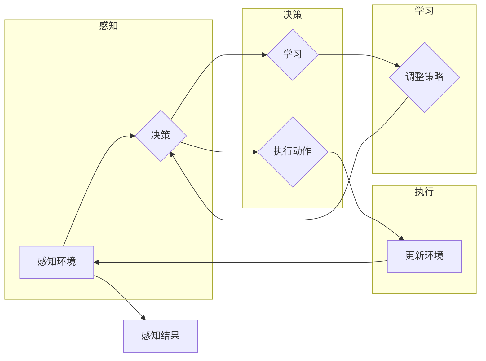

# AI工程学：大模型应用开发实战：AI Agent代理

> 关键词：AI工程，大模型，应用开发，AI Agent，智能代理，自然语言处理，机器学习，深度学习

---

## 1. 背景介绍

随着人工智能技术的飞速发展，大模型（Large Models）在自然语言处理（NLP）、计算机视觉（CV）、强化学习（RL）等多个领域取得了显著的突破。大模型的应用开发已经成为AI工程学的重要方向之一。AI Agent，即智能代理，是大模型应用开发的一个典型应用场景，它能够模拟人类智能行为，自主地与环境交互，并做出决策。

本文将深入探讨AI Agent代理的应用开发实战，从核心概念、算法原理、数学模型、项目实践到实际应用场景，全面解析大模型在AI Agent中的应用。

## 2. 核心概念与联系

### 2.1 AI Agent

AI Agent是人工智能领域的一个基本概念，指的是一个能够感知环境、根据感知到的环境信息自主决策并采取行动的实体。AI Agent可以是一个简单的软件程序，也可以是一个复杂的物理实体。

### 2.2 智能代理

智能代理是AI Agent的一种，它具有以下特点：

- **自主性**：能够自主地执行任务，无需人类的直接干预。
- **适应性**：能够根据环境变化调整其行为策略。
- **交互性**：能够与环境中的其他实体进行交互。
- **智能性**：能够通过学习改进其行为策略。

### 2.3 Mermaid流程图

以下是AI Agent代理的核心概念原理和架构的Mermaid流程图：



## 3. 核心算法原理 & 具体操作步骤

### 3.1 算法原理概述

AI Agent代理的核心算法包括感知、决策、执行和学习四个步骤。其中，感知和决策环节通常依赖于机器学习，特别是深度学习技术；执行环节则可能涉及到强化学习或模拟。

### 3.2 算法步骤详解

1. **感知**：AI Agent通过传感器收集环境信息，如文本、图像、声音等。
2. **决策**：根据感知到的信息，AI Agent使用机器学习模型进行决策，确定下一步的行动。
3. **执行**：AI Agent执行决策，采取行动，如发送指令、移动等。
4. **学习**：AI Agent根据执行结果和环境反馈，调整其行为策略。

### 3.3 算法优缺点

**优点**：

- **高效性**：AI Agent能够自动执行任务，提高工作效率。
- **适应性**：AI Agent能够根据环境变化调整行为策略，适应不同场景。
- **交互性**：AI Agent能够与其他实体进行交互，实现协同工作。

**缺点**：

- **复杂性**：AI Agent的设计和开发需要复杂的算法和计算资源。
- **可靠性**：AI Agent的行为可能受到数据质量、模型精度等因素的影响。
- **安全性**：AI Agent的决策可能存在偏见或错误，需要确保其行为的安全性。

### 3.4 算法应用领域

AI Agent代理的应用领域非常广泛，包括：

- **智能客服**：通过AI Agent提供24/7的客户服务。
- **自动驾驶**：AI Agent控制无人驾驶汽车在复杂环境中行驶。
- **智能家居**：AI Agent控制智能家居设备的运行。
- **游戏**：AI Agent作为游戏角色与玩家互动。

## 4. 数学模型和公式 & 详细讲解 & 举例说明

### 4.1 数学模型构建

AI Agent代理的数学模型通常包括以下部分：

- **感知模型**：用于处理感知数据，如图像处理、语音识别等。
- **决策模型**：用于根据感知数据做出决策，如强化学习中的Q值函数、策略网络等。
- **执行模型**：用于将决策转化为具体的行动，如机器人控制等。

### 4.2 公式推导过程

以下是一个简单的Q值函数的公式推导过程：

$$
Q(s,a) = Q(s,a) + \alpha [R + \gamma \max_{a'} Q(s',a') - Q(s,a)]
$$

其中：

- $Q(s,a)$：在状态 $s$ 下采取动作 $a$ 的期望回报。
- $\alpha$：学习率。
- $R$：即时回报。
- $\gamma$：折扣因子。
- $s'$：采取动作 $a$ 后的新状态。
- $a'$：在状态 $s'$ 下采取的动作。

### 4.3 案例分析与讲解

以下是一个简单的AI Agent代理的案例：

**场景**：智能客服机器人

**任务**：根据用户的问题提供合适的答案。

**算法**：使用基于Q学习的强化学习算法。

**步骤**：

1. 初始化Q值函数。
2. AI Agent通过自然语言处理技术理解用户问题。
3. AI Agent根据Q值函数选择最佳动作（回答）。
4. AI Agent执行动作，并获取用户反馈。
5. 更新Q值函数。

## 5. 项目实践：代码实例和详细解释说明

### 5.1 开发环境搭建

为了实现上述案例，我们需要搭建以下开发环境：

- **编程语言**：Python
- **机器学习框架**：TensorFlow或PyTorch
- **自然语言处理库**：NLTK、spaCy、transformers

### 5.2 源代码详细实现

以下是一个简单的智能客服机器人的代码示例：

```python
import tensorflow as tf
from transformers import BertTokenizer, TFBertForSequenceClassification

# 加载预训练的BERT模型和分词器
tokenizer = BertTokenizer.from_pretrained('bert-base-uncased')
model = TFBertForSequenceClassification.from_pretrained('bert-base-uncased')

# 定义Q值函数
def q_value_function(state, action):
    # 将状态和动作输入BERT模型
    inputs = tokenizer(state, action, return_tensors='tf')
    # 获取模型的输出
    logits = model(inputs).logits
    # 取logits的最大值作为Q值
    return tf.reduce_max(logits, axis=-1)

# 定义强化学习算法
class QLearningAgent:
    def __init__(self, learning_rate, discount_factor):
        self.learning_rate = learning_rate
        self.discount_factor = discount_factor
        self.q_table = {}

    def choose_action(self, state):
        # 根据Q值函数选择最佳动作
        if state not in self.q_table:
            self.q_table[state] = [0.0] * len(model.config.id2token)
        return tf.argmax(tf.convert_to_tensor(self.q_table[state]))

    def learn(self, state, action, reward, next_state):
        # 更新Q值函数
        next_max = tf.reduce_max(model(inputs=tokenizer(next_state, return_tensors='tf')).logits, axis=-1)
        td_target = reward + self.discount_factor * next_max
        td_error = td_target - self.q_table[state][action]
        self.q_table[state][action] += self.learning_rate * td_error

# 实例化强化学习代理
agent = QLearningAgent(learning_rate=0.01, discount_factor=0.99)

# 与用户交互
while True:
    state = input("请输入您的疑问：")
    action = agent.choose_action(state)
    print(f"机器人回复：{model.config.id2token[action]}")
    reward = int(input("请输入回答满意度（1-5）："))
    next_state = input("请输入下一个疑问：")
    agent.learn(state, action, reward, next_state)
```

### 5.3 代码解读与分析

上述代码定义了一个基于Q学习的智能客服机器人。它首先加载预训练的BERT模型和分词器，然后定义了Q值函数和强化学习代理。在交互循环中，机器人根据用户输入的问题选择最佳回答，并根据用户反馈更新Q值函数。

### 5.4 运行结果展示

运行上述代码，用户可以与智能客服机器人进行交互。机器人会根据用户的问题提供回答，并根据用户反馈不断学习改进。

## 6. 实际应用场景

AI Agent代理在实际应用场景中具有广泛的应用，以下是一些典型的应用案例：

- **智能客服**：自动回答用户问题，提供24/7的客户服务。
- **自动驾驶**：控制无人驾驶汽车在复杂环境中行驶。
- **智能助手**：帮助用户完成日常任务，如日程管理、邮件处理等。
- **游戏AI**：与玩家进行互动，提供更具挑战性的游戏体验。

## 7. 工具和资源推荐

### 7.1 学习资源推荐

- **书籍**：《深度学习》（Goodfellow, Bengio, Courville）
- **在线课程**：Coursera的《深度学习》课程
- **技术博客**：Hugging Face的Transformers博客

### 7.2 开发工具推荐

- **编程语言**：Python
- **机器学习框架**：TensorFlow、PyTorch
- **自然语言处理库**：NLTK、spaCy、transformers

### 7.3 相关论文推荐

- **《Reinforcement Learning: An Introduction》（Sutton, Barto）**：强化学习入门经典。
- **《Deep Reinforcement Learning》（Silver, Szepesvári, Srinivasan）**：深度强化学习权威著作。

## 8. 总结：未来发展趋势与挑战

### 8.1 研究成果总结

AI Agent代理是AI工程学的一个重要方向，它在智能客服、自动驾驶、智能家居等领域的应用日益广泛。通过深度学习和强化学习等技术的结合，AI Agent代理能够模拟人类智能行为，自主地与环境交互，并做出决策。

### 8.2 未来发展趋势

- **多模态AI Agent**：结合文本、图像、声音等多模态信息，实现更丰富的感知和交互能力。
- **可解释AI Agent**：提高AI Agent决策的可解释性，增强用户对AI Agent的信任。
- **自主决策AI Agent**：让AI Agent能够在没有人类干预的情况下自主决策。

### 8.3 面临的挑战

- **数据隐私**：如何保护用户数据隐私是AI Agent应用的一个重要挑战。
- **安全性和可靠性**：确保AI Agent的行为安全和可靠是AI Agent应用的关键。
- **伦理问题**：AI Agent的决策可能存在偏见，需要确保其符合伦理道德。

### 8.4 研究展望

随着技术的不断进步，AI Agent代理将在更多领域得到应用，为人类社会带来更多便利。未来，AI Agent代理的研究将更加注重多模态感知、可解释性和自主决策能力，以实现更加智能、安全、可靠的AI Agent代理。

---

作者：禅与计算机程序设计艺术 / Zen and the Art of Computer Programming