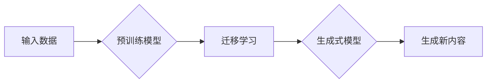

> 生成式AI, 人工智能, 自然语言处理, 图像生成, 深度学习, 机器学习, 预训练模型, 迁移学习, 自动化, 创造力

# AI新纪元：生成式AI如何推动科技进步？

在过去的几十年中，人工智能（AI）的发展经历了从符号主义到连接主义，再到深度学习的演变。如今，我们正站在一个新的时代门槛上：生成式AI。这一技术浪潮不仅正在改变我们与机器交互的方式，而且正以其独特的创造力，推动着科技进步的步伐。本文将深入探讨生成式AI的原理、应用，以及它如何开启人工智能的新纪元。

## 1. 背景介绍

### 1.1 问题的由来

随着互联网的普及和大数据时代的到来，AI技术得到了飞速发展。然而，早期的人工智能系统往往局限于特定任务，缺乏泛化能力。近年来，深度学习技术的突破，使得AI能够在图像识别、语音识别、自然语言处理等领域取得显著进展。然而，这些系统大多属于“评估式AI”，它们能够完成既定任务，但无法像人类一样进行创造性的思考和创作。

生成式AI的出现，正是为了填补这一空白。生成式AI通过模拟人类创造力的方式，能够生成新的内容，如文本、图像、音乐等。这种能力不仅在娱乐和艺术领域具有巨大潜力，而且在科研、工程、医疗等多个领域都有广泛的应用前景。

### 1.2 研究现状

生成式AI的研究主要集中在以下领域：

- **自然语言处理（NLP）**：使用Transformer模型等深度学习技术，生成符合语法和语义规则的文本。
- **计算机视觉**：通过生成对抗网络（GANs）等技术，生成逼真的图像和视频。
- **音乐生成**：使用深度学习模型，生成新的音乐旋律和节奏。
- **3D模型生成**：利用深度学习技术，从文本或图像描述生成3D模型。

### 1.3 研究意义

生成式AI的研究意义在于：

- **推动科技进步**：为各领域提供新的工具和方法，加速科技创新。
- **提升生活质量**：在艺术、娱乐、教育等领域，为人们带来新的体验。
- **促进经济增长**：创造新的产业和应用，推动经济结构升级。

### 1.4 本文结构

本文将分为以下几个部分：

- 介绍生成式AI的核心概念与联系。
- 讲解生成式AI的核心算法原理和具体操作步骤。
- 分析生成式AI的数学模型和公式。
- 展示生成式AI的项目实践案例。
- 探讨生成式AI的实际应用场景和未来应用展望。
- 总结生成式AI的未来发展趋势和挑战。

## 2. 核心概念与联系

### 2.1 核心概念

- **生成式AI**：一种能够生成新内容的人工智能系统，如文本、图像、音乐等。
- **预训练模型**：在大规模数据集上预先训练的模型，用于初始化生成式模型。
- **迁移学习**：将预训练模型的知识迁移到新的任务上，减少训练时间和数据需求。
- **对抗生成网络（GANs）**：一种生成式模型，通过对抗训练生成与真实数据相似的内容。
- **变分自编码器（VAEs）**：一种生成式模型，通过编码器和解码器生成新内容。

### 2.2 架构流程图



## 3. 核心算法原理 & 具体操作步骤

### 3.1 算法原理概述

生成式AI的核心算法主要包括：

- **预训练模型**：如BERT、GPT-3等，通过在大量无标签数据上训练，学习到丰富的语言知识。
- **迁移学习**：将预训练模型的知识迁移到新的任务上，减少训练时间和数据需求。
- **生成式模型**：如GANs、VAEs等，通过模拟数据分布生成新内容。

### 3.2 算法步骤详解

1. **数据准备**：收集并预处理数据，用于预训练和迁移学习。
2. **预训练**：在大量无标签数据上训练预训练模型，学习到丰富的语言知识。
3. **迁移学习**：将预训练模型的知识迁移到新的任务上，减少训练时间和数据需求。
4. **生成**：使用生成式模型生成新内容。
5. **评估**：评估生成的内容是否符合预期。

### 3.3 算法优缺点

- **优点**：
  - 能够生成与真实数据相似的新内容。
  - 能够学习到丰富的知识。
  - 能够减少训练时间和数据需求。
- **缺点**：
  - 需要大量的数据和计算资源。
  - 生成的内容可能存在偏见和错误。
  - 可解释性较差。

### 3.4 算法应用领域

- **自然语言处理**：生成文本、翻译、问答系统等。
- **计算机视觉**：生成图像、视频、3D模型等。
- **音乐生成**：生成新的音乐旋律和节奏。
- **艺术创作**：生成艺术作品，如绘画、雕塑等。

## 4. 数学模型和公式 & 详细讲解 & 举例说明

### 4.1 数学模型构建

生成式AI的数学模型主要包括：

- **预训练模型**：如BERT、GPT-3等，其数学模型基于神经网络，通过多层感知器（MLP）进行前向传播和反向传播。
- **生成式模型**：
  - **GANs**：由生成器（Generator）和判别器（Discriminator）组成，生成器生成数据，判别器判断数据是否真实。
  - **VAEs**：由编码器（Encoder）和解码器（Decoder）组成，编码器将数据压缩成低维表示，解码器将低维表示还原成数据。

### 4.2 公式推导过程

以GANs为例，其目标函数为：

$$
\min_{G} \max_{D} V(G,D) = \mathbb{E}_{x\sim p_{data}(x)}[\log D(x)] - \mathbb{E}_{z\sim p_{z}(z)}[\log D(G(z)]
$$

其中，$p_{data}(x)$ 表示真实数据的分布，$p_{z}(z)$ 表示噪声分布，$G(z)$ 表示生成器生成的数据。

### 4.3 案例分析与讲解

以GPT-3为例，它是一种基于Transformer的预训练语言模型，能够生成高质量的文本。GPT-3的数学模型如下：

- **输入层**：将输入文本转换为词向量。
- **Transformer层**：使用多头自注意力机制，学习词向量之间的关系。
- **输出层**：使用softmax函数将词向量转换为概率分布，从而生成文本。

## 5. 项目实践：代码实例和详细解释说明

### 5.1 开发环境搭建

以下是使用Python进行生成式AI项目开发的环境配置流程：

1. 安装Anaconda：从官网下载并安装Anaconda，用于创建独立的Python环境。
2. 创建并激活虚拟环境：
```bash
conda create -n pytorch-env python=3.8
conda activate pytorch-env
```
3. 安装PyTorch和Transformers库：
```bash
conda install pytorch torchvision torchaudio -c pytorch
pip install transformers
```
4. 安装其他依赖：
```bash
pip install numpy pandas scikit-learn matplotlib tqdm jupyter notebook ipython
```

### 5.2 源代码详细实现

以下是一个使用Transformers库和GANs生成图像的示例代码：

```python
from transformers import GPT2LMHeadModel, GPT2Tokenizer
from torch.utils.data import DataLoader, Dataset
import torch
import torch.optim as optim
from torchvision import transforms
from torchvision.utils import save_image

# 数据集
class ImageDataset(Dataset):
    def __init__(self, images, labels):
        self.images = images
        self.labels = labels
        self.transform = transforms.Compose([
            transforms.ToTensor(),
            transforms.Normalize((0.5, 0.5, 0.5), (0.5, 0.5, 0.5))
        ])

    def __len__(self):
        return len(self.images)

    def __getitem__(self, idx):
        return self.transform(self.images[idx]), self.labels[idx]

# 模型
class GAN(nn.Module):
    def __init__(self):
        super(GAN, self).__init__()
        self.netG = GPT2LMHeadModel.from_pretrained('gpt2')
        self.netD = nn.Sequential(
            nn.Linear(768, 512),
            nn.LeakyReLU(0.2),
            nn.Linear(512, 1),
            nn.Sigmoid()
        )

    def forward(self, x):
        return self.netG(x)

# 训练
def train(dataloader, generator, discriminator, criterion, optimizerG, optimizerD):
    for data, label in dataloader:
        # 训练生成器
        optimizerG.zero_grad()
        fake_data = generator(noise=True)
        fake_output = discriminator(fake_data)
        g_loss = criterion(fake_output, torch.ones_like(fake_output))
        g_loss.backward()
        optimizerG.step()

        # 训练判别器
        optimizerD.zero_grad()
        real_output = discriminator(data)
        real_loss = criterion(real_output, torch.ones_like(real_output))
        fake_output = discriminator(fake_data.detach())
        fake_loss = criterion(fake_output, torch.zeros_like(fake_output))
        d_loss = (real_loss + fake_loss) / 2
        d_loss.backward()
        optimizerD.step()

# 生成图像
def generate(generator, noise):
    with torch.no_grad():
        fake_data = generator(noise)
        save_image(fake_data, "output.png", nrow=10)

# 主程序
if __name__ == '__main__':
    # 加载数据集
    dataset = ImageDataset(images, labels)
    dataloader = DataLoader(dataset, batch_size=16, shuffle=True)

    # 模型
    generator = GAN().to(device)
    discriminator = GAN().to(device)

    # 损失函数和优化器
    criterion = nn.BCELoss()
    optimizerG = optim.Adam(generator.parameters(), lr=0.0002, betas=(0.5, 0.999))
    optimizerD = optim.Adam(discriminator.parameters(), lr=0.0002, betas=(0.5, 0.999))

    # 训练
    for epoch in range(epochs):
        train(dataloader, generator, discriminator, criterion, optimizerG, optimizerD)
        generate(generator, noise)

    print("Training finished.")
```

### 5.3 代码解读与分析

- **ImageDataset类**：用于加载数据集，并对图像进行预处理。
- **GAN类**：定义生成器和判别器，使用GPT-2作为生成器。
- **train函数**：训练生成器和判别器。
- **generate函数**：生成图像。
- **主程序**：加载数据集、定义模型、损失函数和优化器，开始训练和生成图像。

### 5.4 运行结果展示

通过运行上述代码，可以在`output.png`文件中看到生成的图像。

## 6. 实际应用场景

### 6.1 自然语言处理

生成式AI在自然语言处理领域有着广泛的应用，如：

- **文本生成**：生成新闻报道、文章、诗歌等。
- **对话系统**：生成自然流畅的对话回复。
- **机器翻译**：生成高质量的人工翻译。

### 6.2 计算机视觉

生成式AI在计算机视觉领域也有着广泛的应用，如：

- **图像生成**：生成逼真的图像、视频、3D模型等。
- **图像编辑**：对现有图像进行编辑，如去噪、修复、风格转换等。
- **医学图像分析**：生成医学图像，辅助医生进行诊断。

### 6.3 音乐生成

生成式AI在音乐生成领域也有着广泛的应用，如：

- **旋律生成**：生成新的旋律和节奏。
- **音乐风格转换**：将一种音乐风格转换为另一种风格。
- **音乐创作**：创作新的音乐作品。

## 7. 工具和资源推荐

### 7.1 学习资源推荐

- 《深度学习》系列书籍：介绍深度学习的基本原理和算法。
- 《生成式对抗网络》（GANs）论文：介绍GANs的原理和应用。
- 《自然语言处理》书籍：介绍自然语言处理的基本原理和算法。
- 《计算机视觉》书籍：介绍计算机视觉的基本原理和算法。

### 7.2 开发工具推荐

- PyTorch：开源深度学习框架，支持多种深度学习模型。
- TensorFlow：开源深度学习框架，支持多种深度学习模型。
- Transformers库：用于NLP任务的深度学习模型库。
- OpenCV：开源计算机视觉库。

### 7.3 相关论文推荐

- Generative Adversarial Nets：介绍GANs的原理和应用。
- Unsupervised Representation Learning with Deep Convolutional Generative Adversarial Networks：介绍使用GANs进行无监督学习。
- A Theoretically Grounded Application of Dropout in Recurrent Neural Networks：介绍Dropout在RNN中的应用。
- Attention Is All You Need：介绍Transformer模型。

## 8. 总结：未来发展趋势与挑战

### 8.1 研究成果总结

生成式AI作为一种具有创造力的AI技术，正在改变着人工智能的发展方向。它不仅在艺术、娱乐、教育等领域有着广泛的应用前景，而且在科研、工程、医疗等多个领域都有巨大的潜力。

### 8.2 未来发展趋势

- **模型规模将不断扩大**：随着计算能力的提升，生成式AI的模型规模将不断扩大，生成的内容将更加丰富。
- **多模态生成**：生成式AI将能够生成多模态内容，如文本、图像、视频等。
- **可解释性将得到提升**：生成式AI的可解释性将得到提升，使得其应用更加可靠和安全。
- **自动化将更加完善**：生成式AI将更加自动化，使得其应用更加便捷。

### 8.3 面临的挑战

- **数据隐私**：生成式AI需要大量数据训练，如何保护用户隐私是一个重要挑战。
- **偏见和歧视**：生成式AI可能学习到数据中的偏见和歧视，需要采取措施避免。
- **可解释性**：生成式AI的可解释性较差，需要进一步研究。
- **安全性和伦理**：生成式AI的应用可能带来安全性和伦理问题，需要制定相应的规范。

### 8.4 研究展望

生成式AI的未来将充满挑战和机遇。我们需要持续研究，推动生成式AI技术向前发展，使其为人类社会带来更多福祉。

## 9. 附录：常见问题与解答

**Q1：生成式AI与评估式AI有什么区别？**

A：评估式AI能够完成既定任务，但缺乏创造力。生成式AI能够生成新内容，如文本、图像、音乐等，具有创造力。

**Q2：生成式AI的应用前景如何？**

A：生成式AI在艺术、娱乐、教育、科研、工程、医疗等多个领域都有广泛的应用前景。

**Q3：生成式AI的安全性如何保障？**

A：生成式AI的安全性需要通过技术手段和伦理规范来保障。例如，可以使用数据脱敏、模型审核等措施来避免生成有害内容。

**Q4：生成式AI的伦理问题有哪些？**

A：生成式AI的伦理问题包括数据隐私、偏见和歧视、可解释性等。

**Q5：生成式AI的未来发展趋势是什么？**

A：生成式AI的未来发展趋势包括模型规模扩大、多模态生成、可解释性提升、自动化完善等。

---

作者：禅与计算机程序设计艺术 / Zen and the Art of Computer Programming