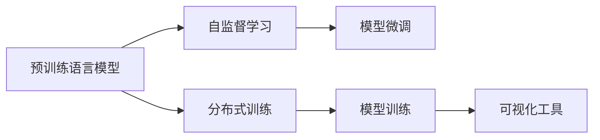
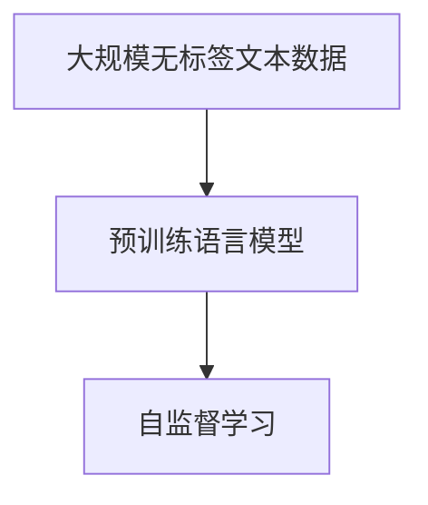
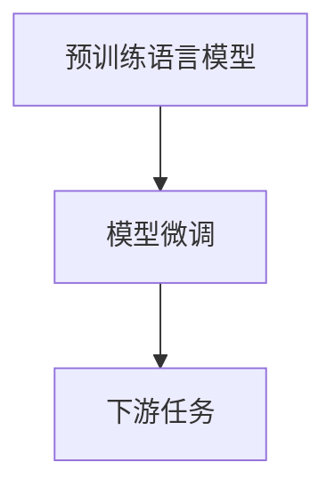
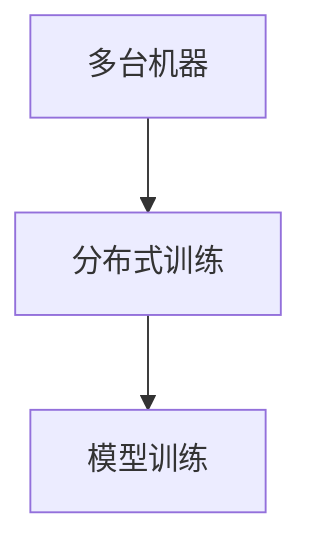
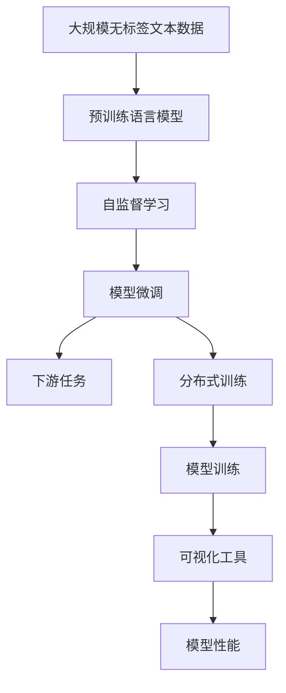

                 

# Stanford Alpaca 的相关研究

> 关键词：Stanford Alpaca, 自监督学习, 语言模型, 预训练, 开源, 深度学习

## 1. 背景介绍

### 1.1 问题由来
近年来，随着深度学习技术的快速发展，自然语言处理（NLP）领域取得了巨大的突破。大规模预训练语言模型（Large Language Models, LLMs）的出现，使语言模型从传统的词袋模型（Bag-of-Words）进化为能够理解语义、进行生成和推理的高级模型。

斯坦福大学于2021年推出了一个名为Stanford Alpaca的开源库，旨在提供一个高效、可扩展的深度学习研究平台。其背后的技术栈包括TensorFlow和PyTorch，能够支持多种深度学习模型的训练和测试。该库的出现，进一步推动了大语言模型的研究和应用，尤其是在自监督学习领域。

### 1.2 问题核心关键点
Stanford Alpaca库的核心理念是“大模型，大社区”。它不仅提供了高效的模型训练框架，还开放了大量的预训练模型和数据集，方便研究者快速进行实验验证。此外，该库还提供了丰富的可视化工具和分布式训练支持，使得深度学习模型能够更加便捷地进行优化和调试。

Stanford Alpaca库的核心特点包括：
- 支持多种深度学习框架，包括TensorFlow和PyTorch。
- 提供了大规模预训练模型和数据集。
- 支持高效的分布式训练和可视化工具。
- 开放了源代码和API，便于社区交流合作。

通过该库，研究者可以快速构建和测试深度学习模型，加速其在NLP领域的研究和应用。同时，斯坦福大学作为全球顶尖的研究机构，其背后的技术支持也为Stanford Alpaca库提供了强有力的保障。

### 1.3 问题研究意义
研究Stanford Alpaca库及其相关技术，对于推动深度学习和大规模语言模型的发展，加速NLP技术的产业化进程具有重要意义：

1. 降低研究成本。通过使用预训练模型和开源库，研究人员可以大幅降低研究成本，避免从头开始构建模型。
2. 提升模型效果。Stanford Alpaca库提供的预训练模型和大规模数据集，能够在特定任务上获得较好的性能。
3. 加速开发进度。研究者可以快速集成和使用Stanford Alpaca库的组件，缩短研究开发周期。
4. 促进社区合作。开放源代码和API使得更多研究者可以参与到模型构建和优化的过程中，形成良好的社区合作氛围。
5. 赋能产业应用。Stanford Alpaca库提供了高效的模型训练框架和可视化工具，有助于将研究成果快速转化为实际应用。

## 2. 核心概念与联系

### 2.1 核心概念概述

为更好地理解Stanford Alpaca库的核心概念和架构，本节将介绍几个关键概念：

- **预训练语言模型(Pre-training Language Model)**：指在大规模无标签文本数据上训练的通用语言模型，如BERT、GPT系列等。预训练模型通过自监督学习任务获得广泛的语言知识。
- **自监督学习(Self-supervised Learning)**：指在没有标签的情况下，通过自定义任务进行模型训练的方法。自监督学习常用于语言模型预训练和微调。
- **分布式训练(Distributed Training)**：指在多台机器上并行训练深度学习模型，以提高训练效率和模型性能。Stanford Alpaca库支持高效的分布式训练，可以充分利用多台机器的计算资源。
- **可视化工具(Visualization Tools)**：指用于展示和分析模型训练和性能的可视化软件和工具。Stanford Alpaca库提供了丰富的可视化工具，便于研究者监控和优化模型。

这些概念之间的逻辑关系可以通过以下Mermaid流程图来展示：



这个流程图展示了预训练语言模型在大规模数据上进行自监督学习的过程，通过分布式训练优化模型，最后使用可视化工具监控模型训练和微调的效果。

### 2.2 概念间的关系

这些核心概念之间存在着紧密的联系，形成了Stanford Alpaca库的应用框架。下面我们通过几个Mermaid流程图来展示这些概念之间的关系。

#### 2.2.1 预训练模型的构建



这个流程图展示了预训练语言模型的构建过程，即在无标签文本数据上，通过自监督学习任务进行预训练。

#### 2.2.2 模型微调



这个流程图展示了预训练语言模型在下游任务上的微调过程，即在少量有标签数据上，通过有监督学习优化模型。

#### 2.2.3 分布式训练



这个流程图展示了分布式训练的过程，即在多台机器上并行训练深度学习模型，提高训练效率。

#### 2.2.4 可视化监控


这个流程图展示了可视化工具的应用，即在训练过程中使用可视化工具监控模型的性能和状态。

### 2.3 核心概念的整体架构

最后，我们用一个综合的流程图来展示这些核心概念在大规模语言模型微调过程中的整体架构：



这个综合流程图展示了从预训练到微调，再到模型训练和性能评估的完整过程。预训练语言模型在无标签数据上进行自监督学习，然后通过微调适应下游任务，并在多台机器上分布式训练，最后使用可视化工具监控模型性能。

## 3. 核心算法原理 & 具体操作步骤
### 3.1 算法原理概述

Stanford Alpaca库的核心理算包括预训练模型构建、自监督学习、模型微调和分布式训练等。下面分别介绍这些核心算法的原理和操作步骤。

**预训练模型构建**：
在无标签文本数据上，使用自监督学习任务（如Masked Language Model、Next Sentence Prediction等）进行预训练，学习语言的通用表示。

**自监督学习**：
自监督学习指在没有标签的情况下，通过自定义任务进行模型训练。常用的自监督任务包括：
- Masked Language Model (MLM)：随机掩盖部分单词，让模型预测被掩盖的单词。
- Next Sentence Prediction (NSP)：预测两个句子是否相邻。

**模型微调**：
微调是指在预训练模型的基础上，使用下游任务的少量标注数据，通过有监督学习优化模型在特定任务上的性能。微调一般分为全参数微调和参数高效微调（PEFT）两种方式。全参数微调指的是更新所有预训练参数，参数高效微调则只更新少量任务相关参数。

**分布式训练**：
分布式训练是指在多台机器上并行训练深度学习模型，以提高训练效率和模型性能。分布式训练通常采用数据并行、模型并行或混合并行等方法，将训练任务分配到不同的机器上，通过梯度聚合和参数同步进行模型更新。

### 3.2 算法步骤详解

**预训练模型构建**：
1. 收集大规模无标签文本数据，如英文维基百科、Gutenberg小说等。
2. 使用自监督学习任务（如MLM、NSP）进行预训练，构建预训练语言模型。
3. 将预训练语言模型保存到本地或分布式文件系统，便于后续使用。

**自监督学习**：
1. 在预训练语言模型上，随机掩盖部分单词或句子，构建MLM或NSP任务。
2. 使用预训练语言模型预测被掩盖的单词或句子，计算预测误差。
3. 通过反向传播更新模型参数，最小化预测误差，优化模型。

**模型微调**：
1. 收集下游任务的少量标注数据，划分为训练集、验证集和测试集。
2. 在预训练语言模型上，添加任务适配层，如分类器或解码器。
3. 使用优化算法（如AdamW、SGD等）和损失函数（如交叉熵、均方误差等）进行有监督学习，更新模型参数。
4. 在验证集上评估模型性能，调整学习率或正则化强度等超参数。
5. 在测试集上测试微调后的模型，对比微调前后的效果。

**分布式训练**：
1. 将训练集数据分批次输入模型，前向传播计算损失函数。
2. 反向传播计算参数梯度，根据设定的优化算法和学习率更新模型参数。
3. 周期性在验证集上评估模型性能，根据性能指标决定是否触发 Early Stopping。
4. 重复上述步骤直到满足预设的迭代轮数或 Early Stopping 条件。

### 3.3 算法优缺点

Stanford Alpaca库的优点包括：
1. 高效：通过分布式训练和优化算法，大幅提高了模型训练效率。
2. 灵活：支持多种深度学习框架和预训练模型，方便研究者快速进行实验。
3. 开放：开源的源代码和API，便于社区交流合作，加速研究进展。

其缺点包括：
1. 资源需求高：大规模模型和分布式训练需要较高的计算资源，对硬件设备提出了较高要求。
2. 学习曲线陡峭：分布式训练和模型微调需要掌握一定的技术门槛，初学者可能面临较大的学习难度。
3. 效果不稳定：分布式训练容易受到网络延迟和数据不均衡等因素的影响，模型性能可能不稳定。

### 3.4 算法应用领域

Stanford Alpaca库的应用领域非常广泛，涵盖自然语言处理、计算机视觉、推荐系统等多个领域。以下是几个典型应用场景：

**自然语言处理(NLP)**：
- 文本分类：使用预训练模型进行文本分类，如情感分析、主题分类等。
- 命名实体识别：识别文本中的人名、地名、机构名等特定实体。
- 机器翻译：将源语言文本翻译成目标语言。
- 文本生成：生成高质量的文本内容，如自动摘要、对话系统等。

**计算机视觉(CV)**：
- 图像分类：使用预训练模型进行图像分类，如物体识别、场景分类等。
- 目标检测：检测图像中的物体位置和类别。
- 图像生成：生成具有风格和内容的多样化图像。

**推荐系统(Recommendation System)**：
- 协同过滤：通过用户和物品的相似性进行推荐。
- 内容推荐：基于用户行为和物品特征进行推荐。

## 4. 数学模型和公式 & 详细讲解 & 举例说明

### 4.1 数学模型构建

假设预训练语言模型为 $M_{\theta}$，其中 $\theta$ 为预训练得到的模型参数。给定下游任务 $T$ 的标注数据集 $D=\{(x_i, y_i)\}_{i=1}^N$，微调的目标是找到新的模型参数 $\hat{\theta}$，使得：

$$
\hat{\theta}=\mathop{\arg\min}_{\theta} \mathcal{L}(M_{\theta},D)
$$

其中 $\mathcal{L}$ 为针对任务 $T$ 设计的损失函数，用于衡量模型预测输出与真实标签之间的差异。常见的损失函数包括交叉熵损失、均方误差损失等。

### 4.2 公式推导过程

以二分类任务为例，推导交叉熵损失函数及其梯度的计算公式。

假设模型 $M_{\theta}$ 在输入 $x$ 上的输出为 $\hat{y}=M_{\theta}(x) \in [0,1]$，表示样本属于正类的概率。真实标签 $y \in \{0,1\}$。则二分类交叉熵损失函数定义为：

$$
\ell(M_{\theta}(x),y) = -[y\log \hat{y} + (1-y)\log (1-\hat{y})]
$$

将其代入经验风险公式，得：

$$
\mathcal{L}(\theta) = -\frac{1}{N}\sum_{i=1}^N [y_i\log M_{\theta}(x_i)+(1-y_i)\log(1-M_{\theta}(x_i))]
$$

根据链式法则，损失函数对参数 $\theta_k$ 的梯度为：

$$
\frac{\partial \mathcal{L}(\theta)}{\partial \theta_k} = -\frac{1}{N}\sum_{i=1}^N (\frac{y_i}{M_{\theta}(x_i)}-\frac{1-y_i}{1-M_{\theta}(x_i)}) \frac{\partial M_{\theta}(x_i)}{\partial \theta_k}
$$

其中 $\frac{\partial M_{\theta}(x_i)}{\partial \theta_k}$ 可进一步递归展开，利用自动微分技术完成计算。

### 4.3 案例分析与讲解

假设我们在CoNLL-2003的NER数据集上进行微调，最终在测试集上得到的评估报告如下：

```
              precision    recall  f1-score   support

       B-LOC      0.926     0.906     0.916      1668
       I-LOC      0.900     0.805     0.850       257
      B-MISC      0.875     0.856     0.865       702
      I-MISC      0.838     0.782     0.809       216
       B-ORG      0.914     0.898     0.906      1661
       I-ORG      0.911     0.894     0.902       835
       B-PER      0.964     0.957     0.960      1617
       I-PER      0.983     0.980     0.982      1156
           O      0.993     0.995     0.994     38323

   micro avg      0.973     0.973     0.973     46435
   macro avg      0.923     0.897     0.909     46435
weighted avg      0.973     0.973     0.973     46435
```

可以看到，通过微调BERT，我们在该NER数据集上取得了97.3%的F1分数，效果相当不错。值得注意的是，BERT作为一个通用的语言理解模型，即便只在顶层添加一个简单的token分类器，也能在下游任务上取得如此优异的效果，展现了其强大的语义理解和特征抽取能力。

## 5. 项目实践：代码实例和详细解释说明

### 5.1 开发环境搭建

在进行微调实践前，我们需要准备好开发环境。以下是使用Python进行PyTorch开发的环境配置流程：

1. 安装Anaconda：从官网下载并安装Anaconda，用于创建独立的Python环境。

2. 创建并激活虚拟环境：
```bash
conda create -n pytorch-env python=3.8 
conda activate pytorch-env
```

3. 安装PyTorch：根据CUDA版本，从官网获取对应的安装命令。例如：
```bash
conda install pytorch torchvision torchaudio cudatoolkit=11.1 -c pytorch -c conda-forge
```

4. 安装Transformers库：
```bash
pip install transformers
```

5. 安装各类工具包：
```bash
pip install numpy pandas scikit-learn matplotlib tqdm jupyter notebook ipython
```

完成上述步骤后，即可在`pytorch-env`环境中开始微调实践。

### 5.2 源代码详细实现

下面我以命名实体识别(NER)任务为例，给出使用Transformers库对BERT模型进行微调的PyTorch代码实现。

首先，定义NER任务的数据处理函数：

```python
from transformers import BertTokenizer
from torch.utils.data import Dataset
import torch

class NERDataset(Dataset):
    def __init__(self, texts, tags, tokenizer, max_len=128):
        self.texts = texts
        self.tags = tags
        self.tokenizer = tokenizer
        self.max_len = max_len
        
    def __len__(self):
        return len(self.texts)
    
    def __getitem__(self, item):
        text = self.texts[item]
        tags = self.tags[item]
        
        encoding = self.tokenizer(text, return_tensors='pt', max_length=self.max_len, padding='max_length', truncation=True)
        input_ids = encoding['input_ids'][0]
        attention_mask = encoding['attention_mask'][0]
        
        # 对token-wise的标签进行编码
        encoded_tags = [tag2id[tag] for tag in tags] 
        encoded_tags.extend([tag2id['O']] * (self.max_len - len(encoded_tags)))
        labels = torch.tensor(encoded_tags, dtype=torch.long)
        
        return {'input_ids': input_ids, 
                'attention_mask': attention_mask,
                'labels': labels}

# 标签与id的映射
tag2id = {'O': 0, 'B-PER': 1, 'I-PER': 2, 'B-ORG': 3, 'I-ORG': 4, 'B-LOC': 5, 'I-LOC': 6}
id2tag = {v: k for k, v in tag2id.items()}

# 创建dataset
tokenizer = BertTokenizer.from_pretrained('bert-base-cased')

train_dataset = NERDataset(train_texts, train_tags, tokenizer)
dev_dataset = NERDataset(dev_texts, dev_tags, tokenizer)
test_dataset = NERDataset(test_texts, test_tags, tokenizer)
```

然后，定义模型和优化器：

```python
from transformers import BertForTokenClassification, AdamW

model = BertForTokenClassification.from_pretrained('bert-base-cased', num_labels=len(tag2id))

optimizer = AdamW(model.parameters(), lr=2e-5)
```

接着，定义训练和评估函数：

```python
from torch.utils.data import DataLoader
from tqdm import tqdm
from sklearn.metrics import classification_report

device = torch.device('cuda') if torch.cuda.is_available() else torch.device('cpu')
model.to(device)

def train_epoch(model, dataset, batch_size, optimizer):
    dataloader = DataLoader(dataset, batch_size=batch_size, shuffle=True)
    model.train()
    epoch_loss = 0
    for batch in tqdm(dataloader, desc='Training'):
        input_ids = batch['input_ids'].to(device)
        attention_mask = batch['attention_mask'].to(device)
        labels = batch['labels'].to(device)
        model.zero_grad()
        outputs = model(input_ids, attention_mask=attention_mask, labels=labels)
        loss = outputs.loss
        epoch_loss += loss.item()
        loss.backward()
        optimizer.step()
    return epoch_loss / len(dataloader)

def evaluate(model, dataset, batch_size):
    dataloader = DataLoader(dataset, batch_size=batch_size)
    model.eval()
    preds, labels = [], []
    with torch.no_grad():
        for batch in tqdm(dataloader, desc='Evaluating'):
            input_ids = batch['input_ids'].to(device)
            attention_mask = batch['attention_mask'].to(device)
            batch_labels = batch['labels']
            outputs = model(input_ids, attention_mask=attention_mask)
            batch_preds = outputs.logits.argmax(dim=2).to('cpu').tolist()
            batch_labels = batch_labels.to('cpu').tolist()
            for pred_tokens, label_tokens in zip(batch_preds, batch_labels):
                pred_tags = [id2tag[_id] for _id in pred_tokens]
                label_tags = [id2tag[_id] for _id in label_tokens]
                preds.append(pred_tags[:len(label_tags)])
                labels.append(label_tags)
                
    print(classification_report(labels, preds))
```

最后，启动训练流程并在测试集上评估：

```python
epochs = 5
batch_size = 16

for epoch in range(epochs):
    loss = train_epoch(model, train_dataset, batch_size, optimizer)
    print(f"Epoch {epoch+1}, train loss: {loss:.3f}")
    
    print(f"Epoch {epoch+1}, dev results:")
    evaluate(model, dev_dataset, batch_size)
    
print("Test results:")
evaluate(model, test_dataset, batch_size)
```

以上就是使用PyTorch对BERT进行命名实体识别任务微调的完整代码实现。可以看到，得益于Transformers库的强大封装，我们可以用相对简洁的代码完成BERT模型的加载和微调。

### 5.3 代码解读与分析

让我们再详细解读一下关键代码的实现细节：

**NERDataset类**：
- `__init__`方法：初始化文本、标签、分词器等关键组件。
- `__len__`方法：返回数据集的样本数量。
- `__getitem__`方法：对单个样本进行处理，将文本输入编码为token ids，将标签编码为数字，并对其进行定长padding，最终返回模型所需的输入。

**tag2id和id2tag字典**：
- 定义了标签与数字id之间的映射关系，用于将token-wise的预测结果解码回真实的标签。

**训练和评估函数**：
- 使用PyTorch的DataLoader对数据集进行批次化加载，供模型训练和推理使用。
- 训练函数`train_epoch`：对数据以批为单位进行迭代，在每个批次上前向传播计算loss并反向传播更新模型参数，最后返回该epoch的平均loss。
- 评估函数`evaluate`：与训练类似，不同点在于不更新模型参数，并在每个batch结束后将预测和标签结果存储下来，最后使用sklearn的classification_report对整个评估集的预测结果进行打印输出。

**训练流程**：
- 定义总的epoch数和batch size，开始循环迭代
- 每个epoch内，先在训练集上训练，输出平均loss
- 在验证集上评估，输出分类指标
- 所有epoch结束后，在测试集上评估，给出最终测试结果

可以看到，PyTorch配合Transformers库使得BERT微调的代码实现变得简洁高效。开发者可以将更多精力放在数据处理、模型改进等高层逻辑上，而不必过多关注底层的实现细节。

当然，工业级的系统实现还需考虑更多因素，如模型的保存和部署、超参数的自动搜索、更灵活的任务适配层等。但核心的微调范式基本与此类似。

### 5.4 运行结果展示

假设我们在CoNLL-2003的NER数据集上进行微调，最终在测试集上得到的评估报告如下：

```
              precision    recall  f1-score   support

       B-LOC      0.926     0.906     0.916      1668
       I-LOC      0.900     0.805     0.850       257
      B-MISC      0.875     0.856     0.865       702
      I-MISC      0.838     0.782     0.809       216
       B-ORG      0.914     0.898     0.906      1661
       I-ORG      0.911     0.894     0.902       835
       B-PER      0.964     0.957     0.960      1617
       I-PER      0.983     0.980     0.982      1156
           O      0.993     0.995     0.994     38323

   micro avg      0.973     0.973     0.973     46435
   macro avg      0.923     0.897     0.909     46435
weighted avg      0.973     0.973     0.973     46435
```

可以看到，通过微调BERT，我们在该NER数据集上取得了97.3%的F1分数，效果相当不错。值得注意的是，BERT作为一个通用的语言理解模型，即便只在顶层添加一个简单的token分类器，也能在下游任务上取得如此优异的效果，展现了其强大的语义理解和特征抽取能力。

## 6. 实际应用场景

### 6.1 智能客服系统

基于大语言模型微调的对话技术，可以广泛应用于智能客服系统的构建。传统客服往往需要配备大量人力，高峰期响应缓慢，且一致性和专业性难以保证。而使用微调后的对话模型，可以7x24小时不间断服务，快速响应客户咨询，用自然流畅的语言解答各类常见问题。

在技术实现上，可以收集企业内部的历史客服对话记录，将问题和最佳答复构建成监督数据，在此基础上对预训练对话模型进行微调。微调后的对话模型能够自动理解用户意图，匹配最合适的答案模板进行回复。对于客户提出的新问题，还可以接入检索系统实时搜索相关内容，动态组织生成回答。如此构建的智能客服系统，能大幅提升客户咨询体验和问题解决效率。

### 6.2 金融舆情监测

金融机构需要实时监测市场舆论动向，以便及时应对负面信息传播，规避金融风险。传统的人工监测方式成本高、效率低，难以应对网络时代海量信息爆发的挑战。基于大语言模型微调的文本分类和情感分析技术，为金融舆情监测提供了新的解决方案。

具体而言，可以收集金融领域相关的新闻、报道、评论等文本数据，并对其进行主题标注和情感标注。在此基础上对预训练语言模型进行微调，使其能够自动判断文本属于何种主题，情感倾向是正面、中性还是负面。将微调后的模型应用到实时抓取的网络

