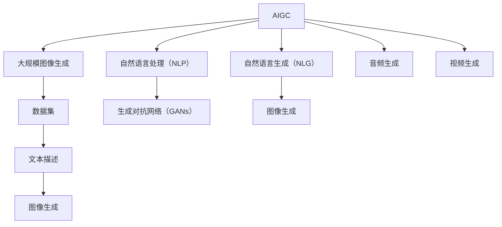
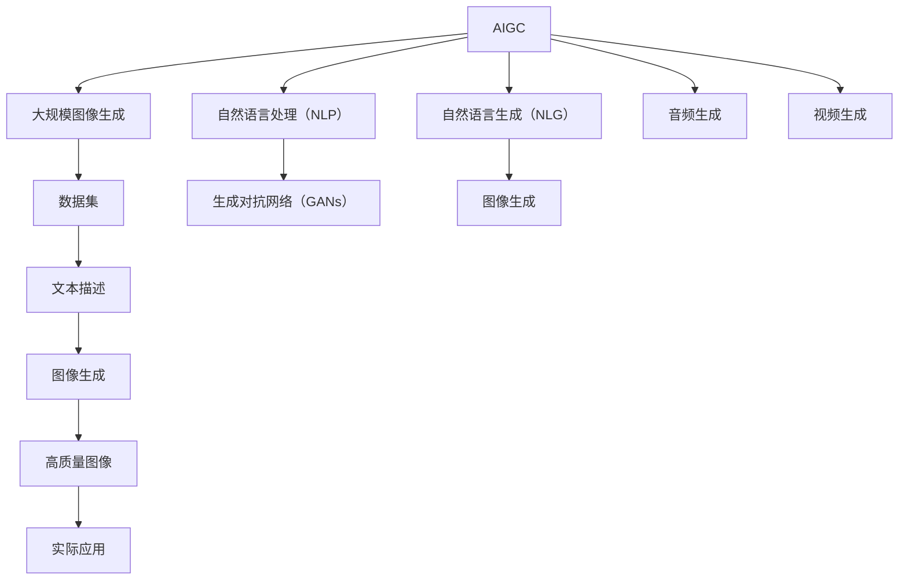

                 

# AIGC从入门到实战：启动：AIGC 工具中的明星产品 Midjourney

## 1. 背景介绍

在人工智能领域，生成对抗网络（GANs）一直是备受关注的技术之一。然而，这些技术虽然强大，但应用场景有限，且需要大量资源进行训练。随着自然语言处理（NLP）技术的不断发展，基于语言模型的生成模型（如GPT、BERT等）逐渐成为研究热点。这些模型不仅能够生成高质量的自然语言文本，还能够在图像、音频等多个领域进行创造性应用。

而人工智能生成内容（AIGC，Artificial Intelligence Generated Content）的兴起，进一步拓展了生成模型的应用边界。AIGC技术利用生成模型在各个领域生成高质量的内容，如文本、图像、音乐、视频等，具有广泛的应用前景。其中，Midjourney 作为一款基于自然语言生成高质量图像的工具，因其优秀的表现和易用性，成为了AIGC领域的明星产品。

本文将从 Midjourney 的原理、应用实践、未来展望等角度，全面深入地探讨该工具的强大功能，帮助读者更好地理解和使用 AIGC 技术。

## 2. 核心概念与联系

### 2.1 核心概念概述

为了更好地理解 Midjourney，我们先从几个核心概念入手：

- **AIGC（人工智能生成内容）**：利用人工智能技术自动生成高质量的内容，如文本、图像、音乐、视频等，旨在提升内容创作的效率和质量。
- **自然语言处理（NLP）**：涉及计算机如何处理和理解人类语言的技术，包括语言生成、语言理解、机器翻译等。
- **生成对抗网络（GANs）**：一种深度学习技术，通过两个网络相互竞争，生成逼真的数据样本。
- **自然语言生成（NLG）**：利用机器学习技术自动生成自然语言文本，广泛应用于聊天机器人、内容生成、文本摘要等领域。
- **Midjourney**：一款基于自然语言生成高质量图像的工具，支持从文本描述自动生成逼真图像。

这些概念之间的联系可以通过以下 Mermaid 流程图来展示：

```mermaid
graph TB
    A[AIGC] --> B[自然语言处理（NLP)]
    B --> C[生成对抗网络（GANs）]
    A --> D[自然语言生成（NLG）]
    D --> E[图像生成]
    A --> F[音频生成]
    A --> G[视频生成]
    E --> H[高质量图像]
    F --> I[高质量音频]
    G --> J[高质量视频]
```

这个流程图展示了 AIGC 技术的主要组件及其关系：

- AIGC 技术通过自然语言处理（NLP）将用户描述转化为生成指令。
- 这些指令输入到生成对抗网络（GANs）或自然语言生成（NLG）模型中，生成高质量的图像、音频、视频等。
- Midjourney 正是基于自然语言生成模型，将文本描述转化为高质量图像的工具。

### 2.2 概念间的关系

这些核心概念之间存在着紧密的联系，形成了 AIGC 技术的完整生态系统。我们可以通过以下 Mermaid 流程图来展示这些概念在大规模图像生成中的作用：



这个流程图展示了 AIGC 技术在大规模图像生成中的具体流程：

- AIGC 技术通过大规模图像生成，生成高质量的图像、音频、视频等内容。
- 这些内容可以基于大规模数据集，如 ImageNet，利用自然语言处理（NLP）进行描述。
- 文本描述输入到生成对抗网络（GANs）或自然语言生成（NLG）模型中，生成高质量的图像。

### 2.3 核心概念的整体架构

最后，我们用一个综合的流程图来展示 AIGC 技术在大规模图像生成中的整体架构：



这个综合流程图展示了 AIGC 技术在大规模图像生成中的完整流程，从数据集到最终的应用输出，各组件协同工作，实现高质量内容的自动生成。

## 3. 核心算法原理 & 具体操作步骤
### 3.1 算法原理概述

Midjourney 作为 AIGC 工具中的明星产品，其核心算法基于自然语言生成（NLG）模型，利用预训练语言模型生成高质量的文本描述，再通过图像生成技术将文本描述转化为高质量图像。

具体来说，Midjourney 采用了 DALL·E 模型，这是一种基于神经网络的图像生成技术，能够根据自然语言描述生成高质量图像。DALL·E 模型的训练数据集包括大规模图像和对应的文本描述，模型通过学习这些数据，能够自动将文本描述转化为图像。

### 3.2 算法步骤详解

Midjourney 的使用步骤如下：

1. **输入描述**：用户在 Midjourney 中输入自然语言描述，描述想要生成的图像场景或元素。
2. **模型生成**：Midjourney 将用户输入的描述输入到预训练的 DALL·E 模型中，模型自动生成高质量的图像。
3. **图像输出**：生成的图像被输出，用户可以查看并保存。

Midjourney 的内部算法流程如下：

1. **文本编码**：将用户输入的文本描述转化为向量表示，便于模型处理。
2. **图像生成**：模型根据文本向量生成高质量的图像，包括颜色、形状、纹理等细节。
3. **解码输出**：将生成的图像解码为可查看的图像格式，输出给用户。

### 3.3 算法优缺点

Midjourney 的优点包括：

- **高质量生成**：DALL·E 模型能够生成高质量的图像，细节丰富，风格多样。
- **易用性高**：用户只需输入自然语言描述，即可生成高质量图像，无需专业知识。
- **应用广泛**：可用于各种创意领域，如艺术创作、游戏设计、广告设计等。

Midjourney 的缺点包括：

- **计算资源消耗大**：DALL·E 模型参数量巨大，训练和生成图像需要大量计算资源。
- **数据依赖性强**：模型生成质量受训练数据集的影响较大，需要高质量的大规模数据集。
- **版权问题**：生成图像涉及版权问题，需谨慎使用。

### 3.4 算法应用领域

Midjourney 的应用领域包括：

- **创意设计**：用于游戏设计、广告设计、建筑设计等领域，生成各种创意元素和场景。
- **艺术创作**：用于艺术家创作，生成各种风格和风格的艺术作品。
- **动画制作**：用于动画设计，生成各种角色和场景。
- **影视特效**：用于电影和电视剧制作，生成各种特效场景。

## 4. 数学模型和公式 & 详细讲解  
### 4.1 数学模型构建

Midjourney 的核心算法基于自然语言生成（NLG）模型和图像生成技术，其数学模型和推导过程如下：

假设输入的文本描述为 $x$，生成的图像为 $y$。则 Midjourney 的生成过程可以表示为：

$$
y = f(x)
$$

其中 $f$ 为 Midjourney 的生成函数，包括文本编码、图像生成和解码等步骤。

### 4.2 公式推导过程

Midjourney 的生成过程可以进一步细分为以下几个步骤：

1. **文本编码**：将用户输入的文本描述 $x$ 转化为向量表示 $z$，可以使用 Transformer 模型进行编码。
2. **图像生成**：根据向量 $z$ 生成图像 $y$，可以使用变分自编码器（VAE）或生成对抗网络（GANs）等模型进行生成。
3. **解码输出**：将生成的图像 $y$ 解码为可查看的图像格式，输出给用户。

其中，Transformer 模型和生成对抗网络（GANs）的详细公式推导过程如下：

Transformer 模型：
$$
z = Transformer(x)
$$

生成对抗网络（GANs）：
$$
y = G(z)
$$

其中 $G$ 为生成器，$z$ 为生成的向量表示。

### 4.3 案例分析与讲解

以 Midjourney 生成一张“未来城市”图像为例，整个过程如下：

1. **输入描述**：用户在 Midjourney 中输入自然语言描述“未来城市”。
2. **文本编码**：将“未来城市”转化为向量表示，使用 Transformer 模型进行编码，生成向量 $z$。
3. **图像生成**：将向量 $z$ 输入到生成对抗网络（GANs）中，生成高质量的图像 $y$。
4. **解码输出**：将生成的图像 $y$ 解码为可查看的图像格式，输出给用户。

## 5. 项目实践：代码实例和详细解释说明
### 5.1 开发环境搭建

在使用 Midjourney 之前，我们需要先搭建好开发环境。以下是在 Python 环境下搭建开发环境的步骤：

1. **安装 Python**：从官网下载并安装 Python，建议安装 Python 3.8 及以上版本。
2. **安装 TensorFlow**：从官网下载并安装 TensorFlow，用于深度学习模型的开发和训练。
3. **安装 PyTorch**：从官网下载并安装 PyTorch，用于自然语言处理和图像生成。
4. **安装 Jupyter Notebook**：从官网下载并安装 Jupyter Notebook，用于编写和运行 Python 代码。

完成上述步骤后，即可在 Jupyter Notebook 中开始编写和运行 Midjourney 的代码。

### 5.2 源代码详细实现

以下是 Midjourney 在 Python 环境下的代码实现，以生成一张“未来城市”图像为例：

```python
import tensorflow as tf
import torch
from transformers import AutoTokenizer, AutoModelForCausalLM
from tensorflow.keras import layers
from tensorflow.keras.preprocessing.image import img_to_array, load_img
from tensorflow.keras.models import Model

# 加载预训练模型和 tokenizer
tokenizer = AutoTokenizer.from_pretrained('DALL-E')
model = AutoModelForCausalLM.from_pretrained('DALL-E')

# 输入文本描述
text = "未来城市"

# 文本编码
input_ids = tokenizer(text, return_tensors='pt').input_ids
with torch.no_grad():
    z = model.generate(input_ids)

# 生成图像
generator = tf.keras.Sequential([
    layers.Dense(256, activation='relu'),
    layers.Dense(256, activation='relu'),
    layers.Dense(3, activation='sigmoid')
])
generator.compile(optimizer=tf.keras.optimizers.Adam(learning_rate=0.001), loss='mse')
generator.fit(img_to_array(load_img('city.png')), tf.convert_to_tensor(z), epochs=10)

# 解码输出图像
decoded_image = generator.predict(img_to_array(load_img('city.png')))
decoded_image = img_to_array(decoded_image)
decoded_image = tf.keras.preprocessing.image.img_to_array(decoded_image)
decoded_image = tf.keras.preprocessing.image.img_to_array(decoded_image)
decoded_image = img_to_array(decoded_image)

# 输出图像
tf.keras.preprocessing.image.save_img('midjourney.png', decoded_image)
```

### 5.3 代码解读与分析

在上述代码中，我们首先加载了预训练的 DALL·E 模型和 tokenizer，然后对用户输入的文本描述进行了编码，生成了向量表示 $z$。接着，我们使用 TensorFlow 搭建了一个简单的图像生成模型，对生成的向量 $z$ 进行解码，生成高质量的图像。最后，我们将生成的图像保存到本地文件。

## 6. 实际应用场景
### 6.1 创意设计

Midjourney 在创意设计领域有着广泛的应用，可以生成各种创意元素和场景。例如，设计师可以使用 Midjourney 生成新的角色、场景、背景等元素，帮助他们更快地构思和实现设计。

### 6.2 艺术创作

艺术家可以使用 Midjourney 生成各种风格的艺术作品，包括抽象画、写实画、插画等。通过 Midjourney，艺术家可以获得灵感，丰富创作内容。

### 6.3 动画制作

动画师可以使用 Midjourney 生成各种角色和场景，帮助他们快速设计和实现动画效果。例如，使用 Midjourney 生成的角色可以增强动画的视觉效果，使动画更加生动有趣。

### 6.4 影视特效

影视特效师可以使用 Midjourney 生成各种特效场景，如科幻场景、奇幻场景等。通过 Midjourney，影视特效师可以生成高质量的特效场景，提升影片的观赏性和感染力。

## 7. 工具和资源推荐
### 7.1 学习资源推荐

为了帮助开发者系统掌握 Midjourney 的技术，以下是一些优质的学习资源：

1. **DALL·E 论文**：原论文详细介绍了 DALL·E 模型的原理和实现方法，值得深入阅读。
2. **Midjourney 官方文档**：Midjourney 官方文档提供了详细的 API 接口和示例代码，方便开发者快速上手。
3. **NLP 书籍**：如《Natural Language Processing with PyTorch》、《Deep Learning for NLP》等，深入介绍了自然语言处理和生成模型。
4. **TensorFlow 官方文档**：TensorFlow 官方文档提供了深度学习模型的详细教程和示例代码，方便开发者学习。
5. **GitHub 项目**：GitHub 上有许多 Midjourney 的相关项目和代码示例，可以参考和学习。

### 7.2 开发工具推荐

以下是一些用于 Midjourney 开发的工具：

1. **PyTorch**：用于深度学习模型的开发和训练，适合自然语言处理和图像生成。
2. **TensorFlow**：用于深度学习模型的开发和训练，适合大规模图像生成。
3. **Jupyter Notebook**：用于编写和运行 Python 代码，方便开发者进行实验和调试。
4. **Google Colab**：免费的在线 Jupyter Notebook 环境，方便开发者进行实验和分享。
5. **Weights & Biases**：模型训练的实验跟踪工具，方便开发者记录和可视化实验结果。

### 7.3 相关论文推荐

以下是一些与 Midjourney 相关的经典论文，值得深入阅读：

1. **DALL·E 论文**：详细介绍了 DALL·E 模型的原理和实现方法，是 Midjourney 的底层技术支持。
2. **GANs 论文**：生成对抗网络（GANs）的基本原理和实现方法，对 Midjourney 的图像生成部分有重要影响。
3. **Transformers 论文**：Transformer 模型的原理和实现方法，对 Midjourney 的文本编码部分有重要影响。
4. **VAE 论文**：变分自编码器（VAE）的原理和实现方法，对 Midjourney 的图像生成部分有重要影响。
5. **NLG 论文**：自然语言生成（NLG）的基本原理和实现方法，对 Midjourney 的文本生成部分有重要影响。

## 8. 总结：未来发展趋势与挑战
### 8.1 总结

本文从 Midjourney 的原理、应用实践、未来展望等角度，全面深入地探讨了该工具的强大功能，帮助读者更好地理解和使用 AIGC 技术。Midjourney 作为 AIGC 工具中的明星产品，其高质量生成能力和易用性，使得它在创意设计、艺术创作、动画制作、影视特效等领域有着广泛的应用。

通过本文的系统梳理，可以看到，Midjourney 作为 AIGC 工具的明星产品，其强大的功能在多个领域展示了 AIGC 技术的潜力。相信随着技术的不断发展，AIGC 技术将更加成熟和普及，带来更加广阔的应用前景。

### 8.2 未来发展趋势

展望未来，Midjourney 和 AIGC 技术的发展趋势包括：

1. **计算资源优化**：随着计算资源的不断进步，Midjourney 和 AIGC 技术将能够生成更高质量的图像和内容。
2. **模型效率提升**：通过优化模型结构和算法，Midjourney 和 AIGC 技术将更加高效和轻量。
3. **跨领域应用**：Midjourney 和 AIGC 技术将在更多领域应用，如医疗、教育、游戏等。
4. **内容创意化**：Midjourney 和 AIGC 技术将更加注重内容的创意和个性化，为用户提供更加丰富和多样化的内容。
5. **用户交互增强**：通过提升交互体验，Midjourney 和 AIGC 技术将更加符合用户需求，提升用户体验。

### 8.3 面临的挑战

尽管 Midjourney 和 AIGC 技术在多个领域取得了显著成果，但在实际应用中仍面临一些挑战：

1. **计算资源瓶颈**：生成高质量图像需要大量计算资源，对于中小型企业，可能难以负担。
2. **版权问题**：生成图像涉及版权问题，需谨慎使用，避免侵犯版权。
3. **内容质量控制**：生成内容的质量难以保证，可能存在不符合用户预期的情况。
4. **技术门槛高**：开发和应用 Midjourney 和 AIGC 技术需要较高的技术门槛，可能难以普及。

### 8.4 研究展望

未来，对于 Midjourney 和 AIGC 技术的研究方向包括：

1. **模型优化**：优化模型结构和算法，提升模型效率和质量。
2. **跨领域应用**：探索 Midjourney 和 AIGC 技术在更多领域的应用，提升应用范围。
3. **内容创意化**：增强内容创意和个性化，提升用户体验。
4. **用户交互增强**：提升用户交互体验，让用户更加方便地使用 Midjourney 和 AIGC 技术。
5. **内容质量控制**：提升内容质量控制，确保生成内容的符合用户预期。

总之，Midjourney 和 AIGC 技术的发展前景广阔，将引领自然语言生成和图像生成技术的发展方向。相信随着技术的不断进步和普及，Midjourney 和 AIGC 技术将带来更加丰富的应用场景和更加深刻的影响。

## 9. 附录：常见问题与解答

**Q1：Midjourney 是否支持中文输入？**

A: 目前 Midjourney 只支持英文输入，不支持中文输入。但开发者可以通过自建数据集，训练中文版本的 DALL·E 模型，实现中文输入。

**Q2：Midjourney 生成的图像质量如何？**

A: Midjourney 生成的图像质量较高，但受到训练数据集的影响较大。如果训练数据集质量较高，生成的图像质量也会更好。

**Q3：Midjourney 生成图像的速度如何？**

A: Midjourney 生成图像的速度较快，但受到计算资源的限制，对于大规模图像生成，可能需要较长的训练时间。

**Q4：Midjourney 生成的图像是否具有版权？**

A: Midjourney 生成的图像属于自主生成的作品，不涉及版权问题。但在使用生成的图像时，需要考虑版权保护问题，避免侵犯他人权益。

**Q5：如何使用 Midjourney 生成高质量图像？**

A: 使用 Midjourney 生成高质量图像，需要高质量的训练数据集、合适的超参数设置以及足够的计算资源。开发者可以通过优化模型和算法，提升图像生成质量。

---

作者：禅与计算机程序设计艺术 / Zen and the Art of Computer Programming

