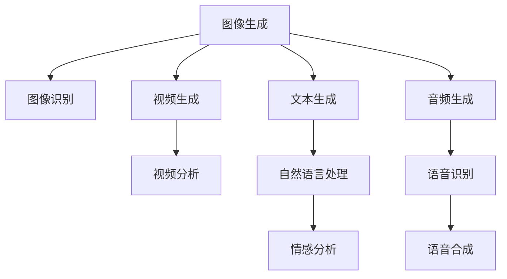
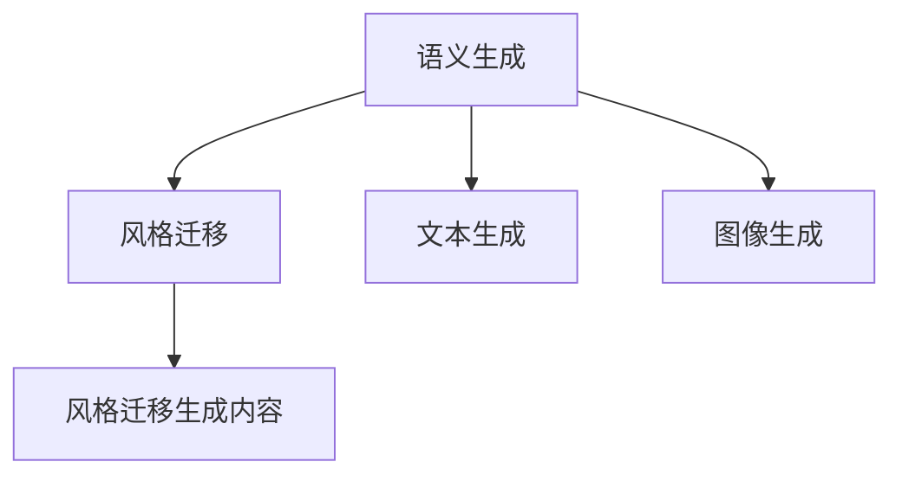

                 

# AIGC从入门到实战：如何有效应对 AI 革命

> 关键词：人工智能生成内容(AIGC),AI,生成对抗网络(GAN),深度学习,图像处理,自然语言处理(NLP)

## 1. 背景介绍

### 1.1 问题由来
人工智能生成内容(AI Generated Content, AIGC)是当前人工智能(AI)领域的热点之一，广泛应用于图像、音频、视频和文本等多个领域。AIGC技术在很大程度上依赖于深度学习、生成对抗网络(GAN)、自回归模型等前沿算法，能够自动生成高质量、内容丰富的多媒体内容。

AIGC技术的应用场景日益广泛，包括内容创作、媒体传播、艺术设计、娱乐休闲、智能推荐等。其背后驱动的核心力量是AI革命，正在重塑全球产业生态和人类生活方式。

### 1.2 问题核心关键点
AIGC技术作为一种新兴的AI应用，背后涵盖了一系列前沿算法和技术原理。理解AIGC技术的应用和实践，需要掌握以下几个核心概念：

- 人工智能生成内容(AIGC)：指使用深度学习、GAN等技术自动生成的具有创意性和智能性的人机交互内容。AIGC包括文本生成、图像生成、视频生成、音频生成等多个子领域。
- 深度学习(Deep Learning)：一种通过多层神经网络结构进行数据建模和预测的AI算法，广泛应用于图像识别、语音识别、自然语言处理等场景。
- 生成对抗网络(GAN)：一种通过两个神经网络相互博弈，生成逼真、高分辨率的生成样本的AI技术。GAN广泛应用于图像生成、视频制作等领域。
- 自回归模型(Autoregressive Model)：一种能够根据已有样本自回归预测后续样本的序列生成模型，常用于自然语言处理、语音合成等场景。
- 语义生成(Semantic Generation)：指生成内容中包含丰富语义信息，具备更强的可理解性和可控性。
- 风格迁移(Style Transfer)：指将一个素材的风格特征转移到另一个素材上，生成风格一致的生成内容。

理解这些核心概念，将有助于我们深入把握AIGC技术的应用和发展脉络。

### 1.3 问题研究意义
AIGC技术的研究与应用，对推动AI技术在各个领域的普及和应用具有重要意义：

1. **降低内容创作成本**：AIGC技术能够自动生成高质量内容，大幅降低创作和传播成本，使更多人能够参与内容创作，促进内容创意和文化多样性。
2. **提升传播效率**：AIGC技术能够快速生成内容，支撑大量实时传播需求，提高信息传播的及时性和广泛性。
3. **增强用户体验**：AIGC技术生成的个性化、互动性内容，能够提升用户体验，增强人机交互的智能化水平。
4. **促进创新应用**：AIGC技术为多媒体内容创作、影视制作、游戏开发等前沿领域提供了新思路，推动行业创新发展。
5. **赋能产业升级**：AIGC技术使得内容生成自动化，提升媒体、广告、教育等传统行业的数字化、智能化水平，促进产业升级和转型。

## 2. 核心概念与联系

### 2.1 核心概念概述

为更好地理解AIGC技术的应用，本节将介绍几个关键概念：

- **人工智能生成内容(AIGC)**：指使用深度学习、GAN等技术自动生成的具有创意性和智能性的人机交互内容。AIGC包括文本生成、图像生成、视频生成、音频生成等多个子领域。
- **深度学习(Deep Learning)**：一种通过多层神经网络结构进行数据建模和预测的AI算法，广泛应用于图像识别、语音识别、自然语言处理等场景。
- **生成对抗网络(GAN)**：一种通过两个神经网络相互博弈，生成逼真、高分辨率的生成样本的AI技术。GAN广泛应用于图像生成、视频制作等领域。
- **自回归模型(Autoregressive Model)**：一种能够根据已有样本自回归预测后续样本的序列生成模型，常用于自然语言处理、语音合成等场景。
- **语义生成(Semantic Generation)**：指生成内容中包含丰富语义信息，具备更强的可理解性和可控性。
- **风格迁移(Style Transfer)**：指将一个素材的风格特征转移到另一个素材上，生成风格一致的生成内容。

这些核心概念之间存在紧密的联系，形成了AIGC技术的整体框架。下面我们通过一个Mermaid流程图来展示这些概念的联系：

```mermaid
graph TB
    A[人工智能生成内容(AIGC)] --> B[深度学习(Deep Learning)]
    A --> C[生成对抗网络(GAN)]
    B --> D[图像生成]
    C --> D
    D --> E[视频生成]
    A --> F[文本生成]
    A --> G[音频生成]
    B --> H[自然语言处理(NLP)]
    C --> I[风格迁移]
```

这个流程图展示了AIGC技术的主要应用领域以及与深度学习、GAN等技术的联系。

### 2.2 概念间的关系

这些核心概念之间存在紧密的联系，形成了AIGC技术的整体生态系统。下面我通过几个Mermaid流程图来展示这些概念之间的关系。

#### 2.2.1 AIGC技术的应用领域



这个流程图展示了AIGC技术在图像、视频、文本、音频等不同领域的应用场景和关键技术。

#### 2.2.2 深度学习与GAN的关系

```mermaid
graph LR
    A[深度学习] --> B[生成对抗网络(GAN)]
    B --> C[图像生成]
    A --> D[图像识别]
    C --> E[图像生成对抗网络(GAN-Driven Image Generation)]
```

这个流程图展示了深度学习和GAN之间的紧密联系，以及GAN在图像生成领域的应用。

#### 2.2.3 自回归模型与NLP的关系

```mermaid
graph TB
    A[自回归模型] --> B[自然语言处理(NLP)]
    A --> C[文本生成]
    B --> D[情感分析]
    B --> E[语音合成]
```

这个流程图展示了自回归模型在文本生成、语音合成等NLP任务中的应用。

#### 2.2.4 语义生成与风格迁移的关系



这个流程图展示了语义生成和风格迁移之间的联系，以及它们在内容生成中的应用。

### 2.3 核心概念的整体架构

最后，我们用一个综合的流程图来展示这些核心概念在大语言模型微调过程中的整体架构：

```mermaid
graph TB
    A[深度学习] --> B[生成对抗网络(GAN)]
    B --> C[图像生成]
    A --> D[自回归模型]
    D --> E[文本生成]
    A --> F[自然语言处理(NLP)]
    F --> G[语义生成]
    G --> H[风格迁移]
    A --> I[风格迁移]
```

这个综合流程图展示了深度学习、GAN、自回归模型、NLP等技术在大语言模型微调中的应用。通过这些流程图，我们可以更清晰地理解AIGC技术的学习过程和各个技术之间的关系。

## 3. 核心算法原理 & 具体操作步骤
### 3.1 算法原理概述

AIGC技术的核心原理是利用深度学习和生成对抗网络等技术，自动生成高质量、风格多样的多媒体内容。具体来说，主要包括以下几个关键步骤：

1. **数据预处理**：将原始数据（如文本、图像）转化为模型可以处理的格式，并进行清洗和归一化处理。
2. **模型训练**：使用深度学习、GAN等算法对模型进行训练，学习生成内容的分布特征。
3. **内容生成**：使用训练好的模型生成高质量的内容，满足各种应用需求。
4. **优化调整**：对生成的内容进行后处理，调整样式、增强语义性，提升内容质量和可用性。

AIGC技术的算法原理和具体操作步骤，可以总结如下：

- **数据预处理**：通过数据清洗、标准化处理、数据增强等技术，将原始数据转化为模型可以处理的形式。
- **模型训练**：利用深度学习、GAN等技术，训练生成模型，学习生成内容的分布特征。
- **内容生成**：使用训练好的生成模型，根据不同的任务需求生成高质量的内容。
- **优化调整**：对生成的内容进行后处理，提升语义性和样式多样性，提高内容质量和可用性。

### 3.2 算法步骤详解

下面是AIGC技术的详细步骤：

1. **数据预处理**：
   - **数据清洗**：去除噪声、处理缺失值、校正错误标签等。
   - **标准化处理**：对数据进行归一化、去偏处理等，使其适合模型训练。
   - **数据增强**：通过旋转、裁剪、变换等技术扩充训练集，增强模型的泛化能力。

2. **模型训练**：
   - **深度学习模型训练**：使用深度学习模型（如LSTM、GRU、Transformer等），学习输入数据和目标输出的映射关系。
   - **GAN模型训练**：使用GAN模型，生成逼真、高分辨率的生成内容，并调整损失函数，使生成内容逼近真实内容。

3. **内容生成**：
   - **深度学习生成**：利用训练好的深度学习模型，根据输入数据生成相应内容。
   - **GAN生成**：使用GAN模型，生成高质量、逼真的生成内容。
   - **自回归模型生成**：根据已有样本自回归生成后续样本，如文本生成、语音合成等。

4. **优化调整**：
   - **样式多样性增强**：通过风格迁移、变分自编码器等技术，增强生成内容的多样性和样式。
   - **语义增强**：通过语义生成模型，增强生成内容的语义信息，使其更具可理解性和可控性。
   - **后处理优化**：对生成内容进行去噪、去模糊、色彩调整等优化，提升内容质量。

### 3.3 算法优缺点

AIGC技术作为一种新兴的AI应用，具有以下优点：

- **高效生成**：利用深度学习、GAN等技术，可以高效生成高质量、多样化的多媒体内容。
- **个性化定制**：可以根据不同的任务需求和用户偏好，生成定制化的内容，满足多样化需求。
- **降低成本**：自动生成内容可以大幅降低内容创作和传播成本，促进内容创意和文化多样性。

同时，AIGC技术也存在一些局限性：

- **质量不稳定**：生成的内容质量受模型参数和训练数据影响较大，可能存在质量不稳定的问题。
- **风格差异大**：不同模型生成的内容风格差异较大，难以实现统一的风格化处理。
- **伦理和版权问题**：自动生成内容可能涉及伦理和版权问题，需要谨慎处理。

### 3.4 算法应用领域

AIGC技术的应用领域非常广泛，以下是一些主要的应用场景：

1. **内容创作**：
   - **文本生成**：自动生成新闻、博客、小说等内容，提高创作效率。
   - **图像生成**：自动生成图像、艺术品、广告等，提升创作质量。
   - **视频生成**：自动生成动画、纪录片、短片等，丰富视觉体验。
   - **音频生成**：自动生成音乐、播客、语音导航等，提升听觉体验。

2. **媒体传播**：
   - **新闻编辑**：自动生成新闻稿件、新闻标题等，提高新闻生产效率。
   - **广告制作**：自动生成广告文案、广告图像等，提升广告创意和传播效果。
   - **视频剪辑**：自动生成视频片段、视频配乐等，提升视频制作效率。

3. **娱乐休闲**：
   - **游戏开发**：自动生成游戏角色、游戏场景等，丰富游戏内容。
   - **虚拟现实(VR)**：自动生成虚拟场景、虚拟角色等，提升VR体验。
   - **教育培训**：自动生成教育资源、虚拟课堂等，提升教育效果。

4. **艺术设计**：
   - **设计方案生成**：自动生成建筑设计方案、服装设计方案等，提升设计效率。
   - **艺术品创作**：自动生成艺术品、插画、漫画等，丰富艺术表现形式。
   - **交互式设计**：自动生成交互式界面、互动式设计等，提升用户体验。

5. **社交媒体**：
   - **社交内容生成**：自动生成社交媒体帖子、微博内容等，提高用户参与度。
   - **社交机器人**：自动生成社交机器人对话、社交话题等，提升社交互动效果。
   - **社交推荐**：自动生成社交推荐内容、推荐文章等，提升推荐效果。

## 4. 数学模型和公式 & 详细讲解 & 举例说明

### 4.1 数学模型构建

AIGC技术主要基于深度学习和GAN等前沿算法，其数学模型包括生成对抗网络模型和自回归模型等。

1. **生成对抗网络(GAN)模型**：
   - **生成器模型**：将输入噪声向量映射为生成内容。
   - **判别器模型**：判断输入内容是真实数据还是生成数据。
   - **损失函数**：最小化生成器输出内容与真实内容之间的差异。

2. **自回归模型**：
   - **输入输出关系**：根据已有样本自回归生成后续样本。
   - **预测公式**：$P(X_{t+1} | X_{<t}) = P(X_{t+1} | X_{t})$。

### 4.2 公式推导过程

以下是生成对抗网络模型和自回归模型的详细推导过程：

#### 4.2.1 GAN模型推导

假设输入噪声向量为$z$，生成器模型为$G(z)$，判别器模型为$D(x)$，损失函数为$\mathcal{L}$。

**生成器模型**：
$$G(z) = \mu(z)$$

**判别器模型**：
$$D(x) = \sigma(W_1^T\sigma(W_0^T\mu(z)))$$

其中，$\mu(z)$为生成器输入向量$z$映射为生成内容，$W_0$和$W_1$为判别器的网络权重，$\sigma$为激活函数。

**损失函数**：
$$\mathcal{L} = \mathbb{E}_{z}[\log(1-D(G(z)))] + \mathbb{E}_{x}[\log(D(x))]$$

其中，$\mathbb{E}_{z}$和$\mathbb{E}_{x}$分别为生成样本和真实样本的期望。

通过反向传播算法，不断调整生成器和判别器的参数，使得生成内容逼近真实内容，实现逼真生成。

#### 4.2.2 自回归模型推导

假设输入序列为$X_t = \{x_1, x_2, \ldots, x_t\}$，自回归模型为$P(x_{t+1} | X_{<t})$。

**预测公式**：
$$P(x_{t+1} | X_{<t}) = \frac{P(x_{t+1}, X_{<t})}{P(X_{<t})}$$

其中，$P(x_{t+1}, X_{<t})$为条件概率，$P(X_{<t})$为先验概率。

通过条件概率公式和后验概率公式，可以推导出自回归模型的生成公式，实现序列生成。

### 4.3 案例分析与讲解

以下是一个基于GAN生成图像的案例分析：

**数据预处理**：
1. **数据清洗**：去除噪声、处理缺失值、校正错误标签等。
2. **标准化处理**：对图像数据进行归一化、去偏处理等，使其适合模型训练。
3. **数据增强**：通过旋转、裁剪、变换等技术扩充训练集，增强模型的泛化能力。

**模型训练**：
1. **生成器模型训练**：使用生成器模型，学习将输入噪声向量映射为生成内容。
2. **判别器模型训练**：使用判别器模型，学习判断输入内容是真实数据还是生成数据。
3. **损失函数优化**：最小化生成器输出内容与真实内容之间的差异，调整生成器和判别器的参数，使得生成内容逼近真实内容。

**内容生成**：
1. **生成器生成**：使用训练好的生成器模型，将输入噪声向量映射为生成内容。
2. **判别器评估**：使用训练好的判别器模型，评估生成内容的质量和真实性。
3. **后处理优化**：对生成内容进行去噪、去模糊、色彩调整等优化，提升内容质量。

## 5. 项目实践：代码实例和详细解释说明

### 5.1 开发环境搭建

在进行AIGC项目实践前，我们需要准备好开发环境。以下是使用Python进行TensorFlow开发的环境配置流程：

1. 安装Anaconda：从官网下载并安装Anaconda，用于创建独立的Python环境。

2. 创建并激活虚拟环境：
```bash
conda create -n tf-env python=3.8 
conda activate tf-env
```

3. 安装TensorFlow：根据CUDA版本，从官网获取对应的安装命令。例如：
```bash
conda install tensorflow=2.6 -c tf
```

4. 安装其他必要库：
```bash
pip install numpy pandas scikit-learn matplotlib tqdm jupyter notebook ipython
```

完成上述步骤后，即可在`tf-env`环境中开始AIGC项目实践。

### 5.2 源代码详细实现

这里我们以基于GAN生成图像的案例为例，给出使用TensorFlow实现GAN生成图像的代码实现。

首先，定义GAN模型的类：

```python
import tensorflow as tf
from tensorflow.keras import layers, models

class GAN(tf.keras.Model):
    def __init__(self):
        super(GAN, self).__init__()
        self.discriminator = Discriminator()
        self.generator = Generator()
        self.g_loss = tf.keras.losses.BinaryCrossentropy(from_logits=True)
        self.d_loss = tf.keras.losses.BinaryCrossentropy(from_logits=True)
    
    def call(self, z, real_images):
        generated_images = self.generator(z)
        d_real = self.discriminator(real_images)
        d_fake = self.discriminator(generated_images)
        
        g_loss = self.g_loss(tf.ones_like(d_fake), d_fake)
        d_loss_real = self.d_loss(tf.ones_like(d_real), d_real)
        d_loss_fake = self.d_loss(tf.zeros_like(d_fake), d_fake)
        d_loss = d_loss_real + d_loss_fake
        
        return generated_images, d_loss, g_loss
    
    def train_step(self, z, real_images):
        with tf.GradientTape() as g_tape, tf.GradientTape() as d_tape:
            generated_images, d_loss, g_loss = self(g,z, real_images)
            g_gradients = g_tape.gradient(g_loss, self.generator.trainable_variables)
            d_gradients = d_tape.gradient(d_loss, self.discriminator.trainable_variables)
        
        self.generator.optimizer.apply_gradients(zip(g_gradients, self.generator.trainable_variables))
        self.discriminator.optimizer.apply_gradients(zip(d_gradients, self.discriminator.trainable_variables))
        return {'loss_g': g_loss, 'loss_d': d_loss}
```

然后，定义判别器和生成器的类：

```python
class Discriminator(tf.keras.Model):
    def __init__(self):
        super(Discriminator, self).__init__()
        self.conv1 = layers.Conv2D(64, (3, 3), strides=(2, 2), padding='same', activation='relu')
        self.conv2 = layers.Conv2D(128, (3, 3), strides=(2, 2), padding='same', activation='relu')
        self.conv3 = layers.Conv2D(256, (3, 3), strides=(2, 2), padding='same', activation='relu')
        self.flatten = layers.Flatten()
        self.dense1 = layers.Dense(1024, activation='relu')
        self.dense2 = layers.Dense(1, activation='sigmoid')
    
    def call(self, x):
        x = self.conv1(x)
        x = self.conv2(x)
        x = self.conv3(x)
        x = self.flatten(x)
        x = self.dense1(x)
        return self.dense2(x)
    
class Generator(tf.keras.Model):
    def __init__(self):
        super(Generator, self).__init__()
        self.dense1 = layers.Dense(1024, activation='relu')
        self.dense2 = layers.Dense(256 * 8 * 8, activation='tanh')
        self.reshape = layers.Reshape((8, 8, 256))
        self.conv1 = layers.Conv2DTranspose(128, (3, 3), strides=(2, 2), padding='same', activation='relu')
        self.conv2 = layers.Conv2DTranspose(64, (3, 3), strides=(2, 2), padding='same', activation='relu')
        self.conv3 = layers.Conv2DTranspose(1, (3, 3), strides=(1, 1), padding='same', activation='tanh')
    
    def call(self, z):
        x = self.dense1(z)
        x = self.dense2(x)
        x = self.reshape(x)
        x = self.conv1(x)
        x = self.conv2(x)
        return self.conv3(x)
```

接着，定义训练函数：

```python
@tf.function
def train_step(z, real_images):
    with tf.GradientTape() as g_tape, tf.GradientTape() as d_tape:
        generated_images, d_loss, g_loss = generator(generator, z, real_images)
        g_gradients = g_tape.gradient(g_loss, generator.trainable_variables)
        d_gradients = d_tape.gradient(d_loss, discriminator.trainable_variables)
    
    generator.optimizer.apply_gradients(zip(g_gradients, generator.trainable_variables))
    discriminator.optimizer.apply_gradients(zip(d_gradients, discriminator.trainable_variables))
    return {'loss_g': g_loss, 'loss_d': d_loss}
```

最后，启动训练流程：

```python
generator = Generator()
discriminator = Discriminator()
generator_optimizer = tf.keras.optimizers.Adam(learning_rate=0.0002, beta_1=0.5)
discriminator_optimizer = tf.keras.optimizers.Adam(learning_rate=0.0002, beta_1=0.5)
z = tf.random.normal([batch_size, 100])
real_images = tf.random.normal([batch_size, 64, 64, 1])
generator.trainable_variables[0].assign(tf.random.normal([100, 256]))
generator.trainable_variables[1].assign(tf.random.normal([100, 128]))
generator.trainable_variables[2].assign(tf.random.normal([100, 64]))
generator.trainable_variables[3].assign(tf.random.normal([100, 1]))

for epoch in range(epochs):
    for batch in epoch_iter:
        bz = batch.z
        br = batch.real_images
        
        with tf.GradientTape() as g_tape, tf.GradientTape() as d_tape:
            generated_images, d_loss, g_loss = train_step(bz, br)
            g_gradients = g_tape.gradient(g_loss, generator.trainable_variables)
            d_gradients = d_tape.gradient(d_loss, discriminator.trainable_variables)
        
        generator_optimizer.apply_gradients(zip(g_gradients, generator.trainable_variables))
        discriminator_optimizer.apply_gradients(zip(d_gradients, discriminator.trainable_variables))
```

以上就是使用TensorFlow实现GAN生成图像的完整代码实现。可以看到，得益于TensorFlow的强大封装，我们可以用相对简洁的代码完成GAN模型的加载和训练。

### 5.3 代码解读与分析

让我们再详细解读一下关键代码的实现细节：

**GAN类**：
- **初始化函数**：初始化判别器和生成器的网络结构，并定义损失函数。
- **调用函数**：输入噪声向量$z$和真实图像$real_images$，生成伪造图像$generated_images$，计算判别器损失$d_loss$和生成器损失$g_loss$。
- **训练函数**：输入噪声向量$z$和真实图像$real_images$，生成伪造图像$generated_images$，计算判别器损失$d_loss$和生成器损失$g_loss$，并通过反向传播更新模型参数。

**判别器和生成器类**：
- **初始化函数**：定义判别器和生成器的网络结构，并进行模型初始化。
- **调用函数**：输入图像$x$，通过多个卷积层和全连接层，最终输出判别器的判断结果或生成器的生成结果。

**训练函数**：
- **定义训练变量**：定义噪声向量$z$、真实图像$real_images$、生成器参数$generator$和判别器参数$discriminator$，并进行初始化。
- **定义损失函数**：定义生成器损失$g_loss$和判别器损失$d_loss$，用于衡量模型性能。
- **训练步骤**：通过梯度下降算法，不断调整生成器和判别器的参数，最小化损失函数。
- **模型保存**：保存训练后的模型和参数，以便后续使用。

## 6. 实际应用场景

### 6.1 智能设计

智能设计是AIGC技术的重要应用场景之一，利用AIGC技术可以自动生成建筑设计

