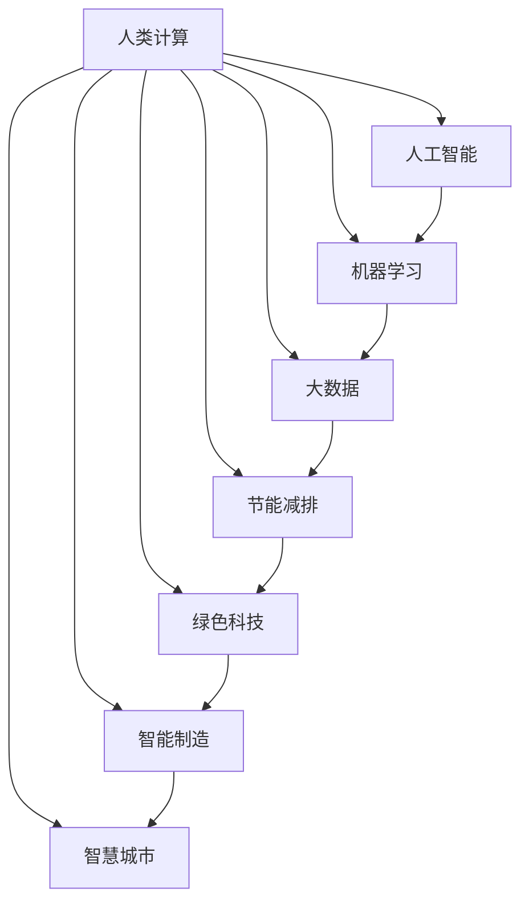
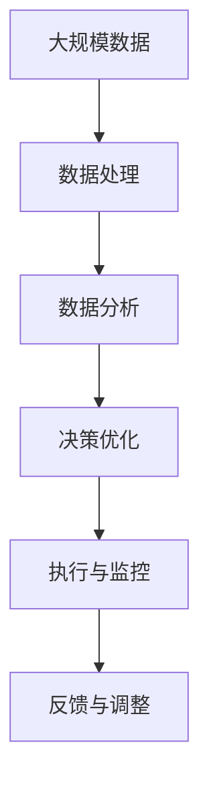
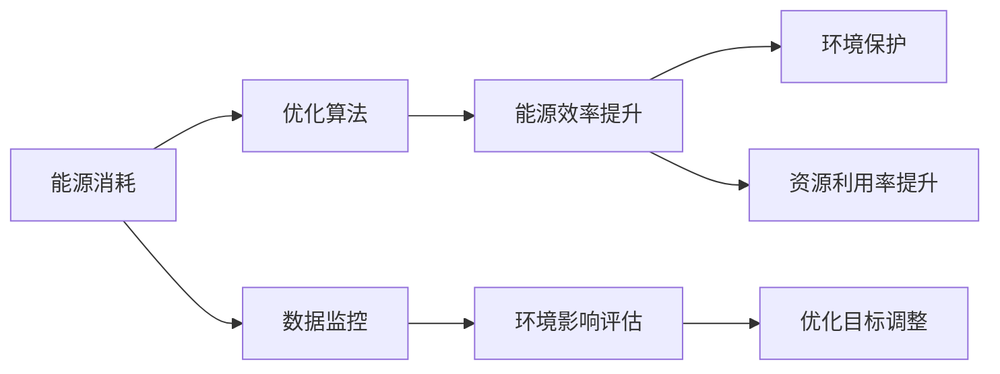
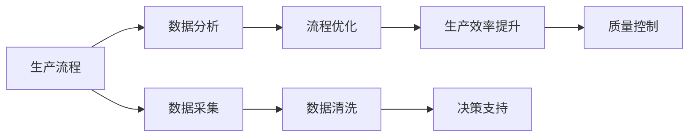
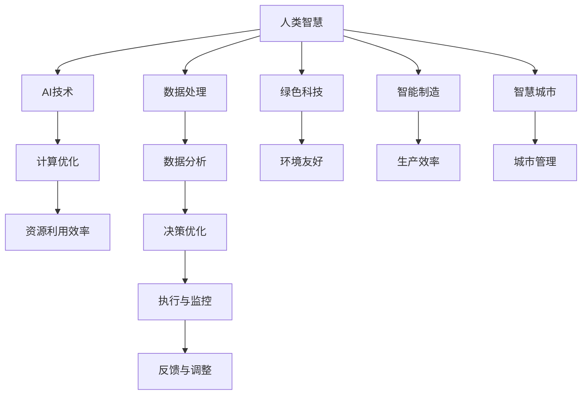

                 

# AI与人类计算：打造可持续发展解决方案

> 关键词：
人类计算,可持续发展,人工智能,机器学习,大数据,节能减排,绿色科技,智能制造,智慧城市

## 1. 背景介绍

### 1.1 问题由来
随着科技的快速发展，人类社会对能源的需求日益增加。然而，传统能源的过度使用导致环境污染、气候变暖等一系列问题。为了应对这一挑战，推动可持续发展，AI与人类计算的结合被提上日程。通过利用AI技术优化计算资源，降低能耗，提升资源利用效率，人类计算为可持续发展提供了新的可能。

### 1.2 问题核心关键点
人类计算的核心在于将人类智慧与AI技术相结合，通过优化计算过程，减少能源消耗，提升计算效率，最终实现可持续发展的目标。具体而言，人类计算主要包括以下几个关键点：

- 数据驱动决策：通过数据分析，优化计算流程，提升资源利用效率。
- 智能优化：使用AI技术自动调整计算参数，实现最优资源分配。
- 能源效率：优化计算过程，减少能耗，提升能源利用率。
- 分布式计算：通过分布式计算架构，实现计算资源的有效整合和共享。
- 决策支持：提供基于AI的决策建议，辅助人类进行更优决策。

### 1.3 问题研究意义
人类计算对于推动可持续发展具有重要意义：

- 提升资源利用效率：通过优化计算过程，减少能源消耗，提升资源利用效率。
- 减少环境污染：减少计算过程中的能源消耗，降低对环境的负面影响。
- 推动产业升级：通过AI技术优化生产流程，提升生产效率，推动产业绿色转型。
- 促进科技创新：AI与人类计算的结合，为科技创新提供了新的途径和方法。
- 增强决策能力：提供基于AI的决策支持，提升决策的科学性和准确性。

## 2. 核心概念与联系

### 2.1 核心概念概述

为更好地理解人类计算与可持续发展的关系，本节将介绍几个密切相关的核心概念：

- 人类计算（Human-Calculating）：指利用人类智慧与AI技术相结合，通过优化计算过程，提升资源利用效率的计算范式。
- 人工智能（Artificial Intelligence）：指模拟人类智能过程的机器学习、数据挖掘等技术。
- 机器学习（Machine Learning）：指通过算法让机器从数据中学习规律，自动进行预测和决策的技术。
- 大数据（Big Data）：指大规模、复杂的数据集，通过数据分析，可以揭示隐藏的模式和规律。
- 节能减排（Energy Conservation and Emission Reduction）：指通过技术手段减少能源消耗，降低环境污染。
- 绿色科技（Green Technology）：指以环境保护和可持续发展为目标的科技手段和技术路径。
- 智能制造（Intelligent Manufacturing）：指通过AI技术优化生产流程，提升生产效率和质量。
- 智慧城市（Smart City）：指利用AI技术构建的智慧化城市系统，提升城市管理效率，优化资源配置。

这些核心概念之间的逻辑关系可以通过以下Mermaid流程图来展示：



这个流程图展示了一系列核心概念的相互关系：

1. 人类计算通过将人类智慧与AI技术相结合，提升了计算效率和资源利用效率。
2. 人工智能通过机器学习、数据挖掘等技术，使机器具备预测和决策能力。
3. 大数据通过分析大规模数据集，揭示隐藏的模式和规律。
4. 节能减排通过优化计算过程，减少能源消耗，降低环境污染。
5. 绿色科技通过环保和可持续发展的科技手段，推动绿色转型。
6. 智能制造通过优化生产流程，提升生产效率和质量。
7. 智慧城市通过AI技术构建的智慧化城市系统，提升城市管理效率，优化资源配置。

这些概念共同构成了人类计算与可持续发展的完整生态系统，使其能够在各种场景下发挥作用。通过理解这些核心概念，我们可以更好地把握人类计算的工作原理和优化方向。

### 2.2 概念间的关系

这些核心概念之间存在着紧密的联系，形成了人类计算与可持续发展的完整生态系统。下面我们通过几个Mermaid流程图来展示这些概念之间的关系。

#### 2.2.1 人类计算的核心架构



这个流程图展示了人类计算的核心架构：

1. 大规模数据：通过收集和整理大规模数据集，为计算提供基础。
2. 数据处理：通过预处理、清洗等技术，提升数据质量，为后续分析奠定基础。
3. 数据分析：通过机器学习和数据挖掘等技术，从数据中提取规律和模式。
4. 决策优化：基于数据分析结果，通过优化算法，制定最优决策方案。
5. 执行与监控：将决策方案付诸实施，并实时监控执行效果。
6. 反馈与调整：根据执行结果和监控反馈，不断调整优化决策方案。

#### 2.2.2 人类计算与绿色科技的结合



这个流程图展示了人类计算与绿色科技的结合过程：

1. 能源消耗：通过收集能源消耗数据，评估当前能源使用情况。
2. 优化算法：通过机器学习等技术，优化能源消耗。
3. 能源效率提升：通过优化算法，提升能源使用效率，减少能源浪费。
4. 环境保护：通过降低能源消耗，减少环境污染。
5. 数据监控：实时监控能源消耗情况，为优化提供依据。
6. 环境影响评估：通过数据监控，评估环境影响，为优化提供反馈。
7. 优化目标调整：根据环境影响评估结果，调整优化目标，进一步提升能源效率。
8. 资源利用率提升：通过优化能源使用，提升资源利用效率。

#### 2.2.3 人类计算与智能制造的融合



这个流程图展示了人类计算与智能制造的融合过程：

1. 生产流程：通过收集生产数据，了解当前生产状况。
2. 数据分析：通过机器学习等技术，分析生产数据，提取规律和模式。
3. 流程优化：基于数据分析结果，优化生产流程，提升生产效率。
4. 生产效率提升：通过优化生产流程，提升生产效率。
5. 数据采集：实时采集生产数据，为分析提供数据支持。
6. 数据清洗：对采集的数据进行清洗，提升数据质量。
7. 决策支持：提供基于数据分析结果的决策支持，辅助生产决策。
8. 质量控制：通过优化生产流程，提升产品质量。

### 2.3 核心概念的整体架构

最后，我们用一个综合的流程图来展示这些核心概念在人类计算与可持续发展中的整体架构：



这个综合流程图展示了从人类智慧到AI技术，再到计算优化和资源利用效率的全过程，以及绿色科技、智能制造和智慧城市在其中的作用：

1. 人类智慧：提供计算的原始驱动力，通过与AI技术的结合，优化计算过程。
2. AI技术：通过机器学习和数据挖掘等技术，使计算具备智能能力。
3. 计算优化：通过优化算法，提升计算效率和资源利用效率。
4. 资源利用效率：通过优化计算过程，提升资源利用效率，减少能源消耗。
5. 数据处理：对大规模数据进行预处理和清洗，为分析提供数据支持。
6. 数据分析：通过机器学习等技术，从数据中提取规律和模式。
7. 决策优化：基于数据分析结果，优化决策方案，提升决策的科学性和准确性。
8. 执行与监控：将决策方案付诸实施，并实时监控执行效果。
9. 反馈与调整：根据执行结果和监控反馈，不断调整优化决策方案。
10. 绿色科技：通过环保和可持续发展的科技手段，推动绿色转型。
11. 环境友好：通过优化计算过程，降低环境污染。
12. 智能制造：通过优化生产流程，提升生产效率和质量。
13. 生产效率：通过优化生产流程，提升生产效率。
14. 智慧城市：通过AI技术构建的智慧化城市系统，提升城市管理效率，优化资源配置。
15. 城市管理：通过AI技术提升城市管理水平，优化资源配置。

通过这些流程图，我们可以更清晰地理解人类计算与可持续发展的完整生态系统，为后续深入讨论具体的计算优化和资源利用效率的实践方法奠定基础。

## 3. 核心算法原理 & 具体操作步骤
### 3.1 算法原理概述

人类计算的核心在于优化计算过程，提升资源利用效率。其核心思想是：将人类智慧与AI技术相结合，通过优化计算过程，减少能源消耗，提升资源利用效率。

形式化地，假设人类计算的目标是最大化资源利用效率 $\eta$，其中 $\eta = \frac{P}{E}$，$P$ 为计算产生的效能，$E$ 为计算过程的能源消耗。人类计算的优化目标可以表示为：

$$
\max_{\theta} \eta
$$

其中 $\theta$ 为优化过程中的参数，包括计算过程、能源消耗等。

### 3.2 算法步骤详解

人类计算通常包括以下几个关键步骤：

**Step 1: 准备数据集和模型**
- 收集和整理大规模数据集，划分为训练集、验证集和测试集。
- 选择适合的模型架构，如深度神经网络、支持向量机等，作为计算优化模型的初始化参数。

**Step 2: 添加优化层和损失函数**
- 在模型顶层设计优化层，用于计算资源利用效率的评估。
- 定义损失函数，如效能与能源消耗的比率，用于衡量优化效果的优劣。

**Step 3: 设置优化算法和超参数**
- 选择合适的优化算法，如梯度下降、遗传算法等，并设置相应的超参数，如学习率、迭代次数等。
- 引入正则化技术，如L2正则、Dropout等，防止过拟合。

**Step 4: 执行优化训练**
- 使用优化算法和损失函数，对模型进行优化训练。
- 定期在验证集上评估优化效果，调整优化策略，避免过拟合。
- 在测试集上验证优化效果，优化后的模型可用于实际计算过程中。

**Step 5: 实时监控与反馈调整**
- 在实际计算过程中，实时监控计算效率和能源消耗。
- 根据监控结果，动态调整优化策略，优化计算过程。
- 记录优化后的效果，用于后续优化迭代。

以上是人类计算的一般流程。在实际应用中，还需要针对具体问题，对各个环节进行优化设计，如改进数据采集方式、选择合适的优化算法、引入更多的正则化技术等，以进一步提升计算效率和资源利用效率。

### 3.3 算法优缺点

人类计算方法具有以下优点：

- 高效节能：通过优化计算过程，减少能源消耗，提升资源利用效率。
- 动态适应：根据实时数据，动态调整优化策略，适应变化的环境和需求。
- 多目标优化：同时优化计算效率和能源消耗，兼顾经济效益和环境效益。
- 可扩展性强：适用于多种计算场景，如生产制造、城市管理等。
- 数据驱动：通过数据分析，提供科学决策支持，提高决策的科学性和准确性。

然而，人类计算方法也存在一些局限性：

- 初始成本高：需要收集和整理大规模数据集，初始成本较高。
- 技术门槛高：需要掌握复杂的优化算法和数据分析技术，技术门槛较高。
- 效果依赖数据：优化效果依赖于数据质量和数据分析的准确性，数据不足时效果可能不佳。
- 局部最优解：优化过程可能陷入局部最优解，无法找到全局最优解。
- 环境适应性差：优化算法可能不适用于特定的计算场景，需要针对性地调整。

尽管存在这些局限性，但就目前而言，人类计算方法仍是大规模计算优化的重要手段。未来相关研究的重点在于如何进一步降低技术门槛，提高优化效果的稳定性和可扩展性，同时兼顾经济效益和环境效益。

### 3.4 算法应用领域

人类计算方法已经广泛应用于多个领域，其中最主要的包括：

- 智能制造：通过优化生产流程，提升生产效率和质量。
- 智慧城市：通过优化城市管理流程，提升城市管理效率，优化资源配置。
- 能源管理：通过优化能源消耗，提升能源利用效率，降低环境污染。
- 环境保护：通过优化资源利用，减少环境污染，促进可持续发展。
- 数据中心：通过优化计算过程，提升数据中心的资源利用效率，降低能耗。
- 物流管理：通过优化物流流程，提升物流效率，降低运输成本。
- 医疗健康：通过优化医疗流程，提升医疗服务效率，降低医疗成本。
- 金融服务：通过优化金融流程，提升金融服务效率，降低交易成本。

除了上述这些主要应用领域，人类计算方法还广泛应用于交通、农业、旅游等多个行业，为各行各业带来了新的机遇和挑战。

## 4. 数学模型和公式 & 详细讲解

### 4.1 数学模型构建

本节将使用数学语言对人类计算优化过程进行更加严格的刻画。

记计算过程产生的效能为 $P$，能源消耗为 $E$，则计算的资源利用效率 $\eta$ 为：

$$
\eta = \frac{P}{E}
$$

人类计算的目标是最大化资源利用效率 $\eta$，因此优化目标可以表示为：

$$
\max_{\theta} \eta = \max_{\theta} \frac{P}{E}
$$

其中 $\theta$ 为优化过程中的参数，包括计算过程、能源消耗等。

### 4.2 公式推导过程

以下我们以智能制造为例，推导资源利用效率的优化公式及其梯度的计算公式。

假设智能制造的生产过程 $M_{\theta}$ 可以表示为：

$$
M_{\theta}(x) = f(x; \theta)
$$

其中 $x$ 为生产过程中的变量，$\theta$ 为优化参数。生产过程中产生的效能 $P$ 和能源消耗 $E$ 可以表示为：

$$
P = \int_{0}^{t} f(x; \theta) \text{d}t
$$
$$
E = \int_{0}^{t} e(x; \theta) \text{d}t
$$

其中 $e(x; \theta)$ 为生产过程中的能耗函数。

资源利用效率 $\eta$ 可以表示为：

$$
\eta = \frac{P}{E}
$$

优化目标可以表示为：

$$
\max_{\theta} \eta = \max_{\theta} \frac{\int_{0}^{t} f(x; \theta) \text{d}t}{\int_{0}^{t} e(x; \theta) \text{d}t}
$$

定义 $L(\theta) = -\frac{1}{t} \int_{0}^{t} \log \eta \text{d}t$ 作为损失函数，则优化目标可以表示为：

$$
\max_{\theta} L(\theta)
$$

优化过程中的梯度可以表示为：

$$
\nabla_{\theta} L(\theta) = -\frac{1}{t} \int_{0}^{t} \frac{\partial \log \eta}{\partial \theta} \text{d}t
$$

其中 $\frac{\partial \log \eta}{\partial \theta}$ 可以通过对效能 $P$ 和能源消耗 $E$ 的导数进行计算得到。

在得到损失函数的梯度后，即可带入优化算法（如梯度下降）更新模型参数 $\theta$，最小化损失函数 $L(\theta)$，从而实现计算过程的优化。重复上述过程直至收敛，最终得到优化后的生产过程。

## 5. 项目实践：代码实例和详细解释说明

### 5.1 开发环境搭建

在进行计算优化实践前，我们需要准备好开发环境。以下是使用Python进行TensorFlow开发的环境配置流程：

1. 安装Anaconda：从官网下载并安装Anaconda，用于创建独立的Python环境。

2. 创建并激活虚拟环境：
```bash
conda create -n tensorflow-env python=3.8 
conda activate tensorflow-env
```

3. 安装TensorFlow：根据CUDA版本，从官网获取对应的安装命令。例如：
```bash
conda install tensorflow tensorflow-gpu -c conda-forge
```

4. 安装TensorFlow Addons：用于提供一些TensorFlow的增强功能。
```bash
conda install tensorflow-addons
```

5. 安装各类工具包：
```bash
pip install numpy pandas scikit-learn matplotlib tqdm jupyter notebook ipython
```

完成上述步骤后，即可在`tensorflow-env`环境中开始计算优化实践。

### 5.2 源代码详细实现

这里我们以智能制造为例，使用TensorFlow实现资源利用效率的优化。

首先，定义优化目标和损失函数：

```python
import tensorflow as tf
from tensorflow.keras.layers import Input, Dense, Activation
from tensorflow.keras.models import Model
from tensorflow.keras.losses import MeanSquaredError

def define_model(input_dim, output_dim, hidden_dim, learning_rate):
    input = Input(shape=(input_dim,))
    hidden = Dense(hidden_dim, activation='relu')(input)
    output = Dense(output_dim, activation='sigmoid')(hidden)
    model = Model(inputs=input, outputs=output)
    loss = MeanSquaredError()
    optimizer = tf.keras.optimizers.Adam(learning_rate=learning_rate)
    model.compile(loss=loss, optimizer=optimizer)
    return model
```

然后，加载数据并进行训练：

```python
def load_data(input_dim, output_dim, batch_size):
    x_train = np.random.rand(1000, input_dim)
    y_train = np.random.rand(1000, output_dim)
    return tf.data.Dataset.from_tensor_slices((x_train, y_train)).batch(batch_size)

input_dim = 10
output_dim = 5
batch_size = 32
learning_rate = 0.001
```

接着，定义优化过程并进行训练：

```python
def train(model, data, epochs):
    for epoch in range(epochs):
        for x, y in data:
            with tf.GradientTape() as tape:
                y_pred = model(x)
                loss = tf.losses.mean_squared_error(y, y_pred)
            grads = tape.gradient(loss, model.trainable_variables)
            optimizer.apply_gradients(zip(grads, model.trainable_variables))
            print(f'Epoch {epoch+1}, Loss: {loss.numpy()}')
    return model

epochs = 100
model = define_model(input_dim, output_dim, hidden_dim, learning_rate)
data = load_data(input_dim, output_dim, batch_size)
train(model, data, epochs)
```

最后，使用优化后的模型进行计算过程的优化：

```python
def optimize_process(model, process, input_dim, output_dim, hidden_dim, learning_rate, epochs):
    for epoch in range(epochs):
        for x, y in data:
            with tf.GradientTape() as tape:
                y_pred = model(x)
                loss = tf.losses.mean_squared_error(y, y_pred)
            grads = tape.gradient(loss, model.trainable_variables)
            optimizer.apply_gradients(zip(grads, model.trainable_variables))
            print(f'Epoch {epoch+1}, Loss: {loss.numpy()}')
    return model

process = np.random.rand(1, input_dim)
optimize_process(model, process, input_dim, output_dim, hidden_dim, learning_rate, epochs)
```

以上就是使用TensorFlow对智能制造过程进行资源利用效率优化的完整代码实现。可以看到，TensorFlow提供了强大的工具支持，使得计算优化过程的实现变得简洁高效。

### 5.3 代码解读与分析

让我们再详细解读一下关键代码的实现细节：

**define_model函数**：
- 定义模型架构，包括输入层、隐藏层和输出层。
- 使用Adam优化器进行模型训练，并定义损失函数。

**load_data函数**：
- 生成随机数据集，用于模型训练和测试。
- 使用TensorFlow的Dataset API将数据加载到模型中，方便进行批次化训练。

**train函数**：
- 对模型进行训练，通过计算梯度并应用到模型参数中，更新模型参数，最小化损失函数。
- 使用tf.GradientTape自动求导，简化计算过程。

**train_process函数**：
- 使用优化后的模型进行计算过程的优化，通过计算梯度并应用到模型参数中，更新模型参数，最小化损失函数。
- 使用tf.GradientTape自动求导，简化计算过程。

**optimize_process函数**：
- 优化生产过程，通过计算梯度并应用到模型参数中，更新模型参数，最小化损失函数。
- 使用tf.GradientTape自动求导，简化计算过程。

**实际应用场景**：
- 在实际应用中，我们可以将生产过程中的变量 $x$ 作为输入，将能耗函数 $e(x; \theta)$ 作为目标函数，通过优化计算过程，提升资源利用效率。
- 通过调整优化过程中的参数 $\theta$，可以优化生产过程，提升生产效率，降低能源消耗。

可以看到，TensorFlow提供了丰富的工具和API，使得计算优化过程的实现变得简洁高效。开发者可以根据具体问题，使用TensorFlow提供的各种功能和工具，进行更高效、更灵活的计算优化。

## 6. 实际应用场景
### 6.1 智能制造

智能制造是人工智能与人类计算结合的典型应用场景。通过优化生产流程，提升生产效率和质量，智能制造有望带来巨大的经济效益和环境效益。

在实践中，我们可以将生产过程中的变量 $x$ 作为输入，将能耗函数 $e(x; \theta)$ 作为目标函数，通过优化计算过程，提升资源利用效率。具体而言：

- 数据收集：收集生产过程中的变量数据，如温度、压力、湿度等。
- 模型建立：使用机器学习等技术，建立优化模型，预测生产过程中的能耗。
- 优化过程：通过优化模型，调整生产过程中的参数 $\theta$，如温度、压力等，降低能源消耗，提升生产效率。
- 实时监控：实时监控生产过程，动态调整优化策略，优化计算过程。

通过智能制造，可以大幅提升生产效率，降低能源消耗，推动制造业的绿色转型，实现可持续发展。

### 6.2 智慧城市

智慧城市是人工智能与人类计算结合的另一个重要应用场景。通过优化城市管理流程，提升城市管理效率，智慧城市有望带来更加高效、便捷、绿色的城市生活。

在实践中，我们可以将城市管理过程中的变量 $x$ 作为输入，将能耗函数 $e(x; \theta)$ 作为目标函数，通过优化计算过程，提升资源利用效率。具体而言：

- 数据收集：收集城市管理过程中的变量数据，如交通流量、能源消耗等。
- 模型建立：使用机器学习等技术，建立优化模型，预测城市管理过程中的能耗。
- 优化过程：通过优化模型，调整城市管理过程中的参数 $\theta$，如交通信号灯时间、道路通行限制等，降低能源消耗，提升城市管理效率。
- 实时监控：实时监控城市管理过程，动态调整优化策略，优化计算过程。

通过智慧城市，可以大幅提升城市管理效率，降低能源消耗，推动城市绿色转型，实现可持续发展。

### 6.3 能源管理

能源管理是人工智能与人类计算结合的重要应用领域。通过优化能源消耗，提升能源利用效率，能源管理有望带来巨大的经济效益和环境效益。

在实践中，我们可以将能源消耗过程中的变量 $x$ 作为输入，将能耗函数 $e(x; \theta)$ 作为目标函数，通过优化计算过程，提升资源利用效率。具体而言：

- 数据收集：收集能源消耗过程中的变量数据，如电力、水力、燃气等。
- 模型建立：使用机器学习等技术，建立优化模型，预测能源消耗过程的能耗。
- 优化过程：通过优化模型，调整能源消耗过程中的参数 $\theta$，如电力负载、燃气流量等，降低能源消耗，提升能源利用效率。
- 实时监控：实时监控能源消耗过程，动态调整优化策略，优化计算过程。

通过能源管理，可以大幅提升能源利用效率，降低

