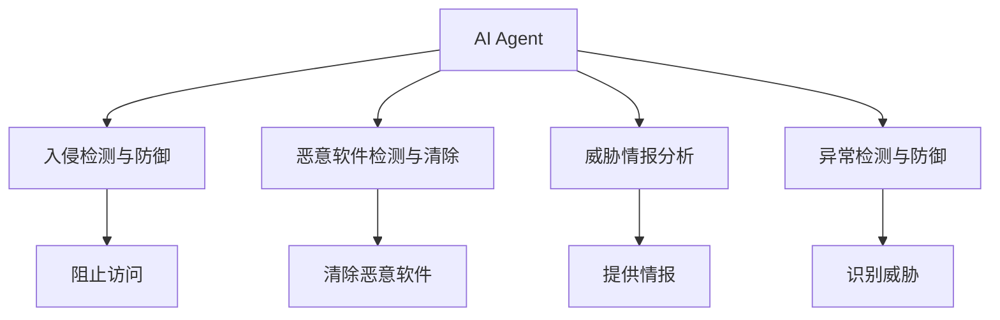
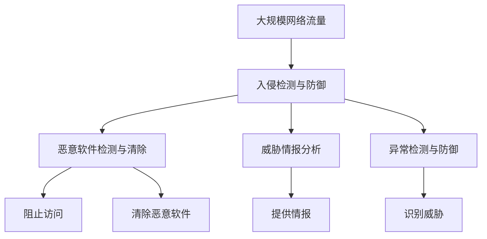

                 

# AI人工智能 Agent：在网络安全中的应用

> 关键词：人工智能,网络安全,入侵检测,恶意软件检测,威胁情报,异常检测,自适应安全

## 1. 背景介绍

### 1.1 问题由来
在数字化时代，网络安全问题愈发严峻，各类网络攻击手段层出不穷，给个人和企业带来了巨大的威胁。为了应对这些挑战，人们逐渐认识到单一的安全措施无法满足复杂多变的安全需求。在这样的背景下，人工智能(AI)技术，特别是AI人工智能 Agent（AI Agent）在网络安全中的应用应运而生，成为现代网络安全的重要防线。

### 1.2 问题核心关键点
AI Agent的核心在于通过模拟人类智能行为，进行自主决策和响应。在网络安全领域，AI Agent可以实时监测网络活动，识别潜在威胁，并根据预设的规则进行防御或响应。其应用主要体现在以下几个方面：

- **入侵检测与防御**：实时监控网络流量，识别恶意行为，防止未经授权的访问和数据泄露。
- **恶意软件检测与清除**：自动识别和清除恶意软件，保护系统安全。
- **威胁情报分析**：分析网络攻击数据，提供威胁情报支持，协助安全团队作出决策。
- **异常检测与防御**：检测网络中的异常行为，识别并响应潜在威胁。

这些应用展示了AI Agent在网络安全领域的巨大潜力和广泛应用前景。

### 1.3 问题研究意义
AI Agent在网络安全中的应用，对于提升网络防护能力、减少安全事件发生率具有重要意义。

1. **提升防护能力**：AI Agent能够实时分析网络行为，发现并防御新型威胁，从而提高整体防护水平。
2. **减少事件发生率**：通过智能分析和快速响应，AI Agent能够有效减少网络攻击事件的发生。
3. **降低成本**：自动化处理大部分安全任务，减少人工干预，降低安全运营成本。
4. **加速响应**：快速识别和响应安全事件，缩短攻击者的入侵时间窗口。
5. **提供决策支持**：通过数据分析和情报分析，提供更全面的安全威胁信息，辅助安全团队做出更精准的决策。

总之，AI Agent在网络安全中的应用将显著提升安全防御能力，帮助组织有效应对复杂多变的安全威胁。

## 2. 核心概念与联系

### 2.1 核心概念概述

为更好地理解AI Agent在网络安全中的应用，本节将介绍几个关键概念及其相互关系：

- **AI Agent**：在网络安全中，AI Agent是一种通过学习网络行为模式，自主决策并响应的智能实体。它可以是检测系统、防御系统或响应系统，旨在提升网络防护的智能化水平。

- **入侵检测与防御**：检测并阻止未经授权的访问、恶意行为或其他威胁。AI Agent能够实时分析网络流量，识别潜在威胁，并进行防御或响应。

- **恶意软件检测与清除**：识别并清除病毒、木马等恶意软件，防止其在网络中传播和扩散。

- **威胁情报分析**：分析网络攻击数据，提供威胁情报支持，协助安全团队作出决策。

- **异常检测与防御**：检测网络中的异常行为，识别并响应潜在威胁。

这些核心概念之间的关系可以通过以下Mermaid流程图来展示：



这个流程图展示了AI Agent在网络安全中的主要应用场景，以及其在不同安全任务中的作用。

### 2.2 概念间的关系

这些核心概念之间存在着紧密的联系，构成了网络安全防护的完整体系。下面我们通过几个Mermaid流程图来展示这些概念之间的关系。

#### 2.2.1 入侵检测与防御的流程


这个流程图展示了入侵检测系统的基本流程，从网络流量分析到威胁分析、防御措施和响应机制。

#### 2.2.2 恶意软件检测与清除的过程


这个流程图展示了恶意软件检测和清除的基本过程，从样本检测到特征提取和清除。

#### 2.2.3 威胁情报分析的流程


这个流程图展示了威胁情报分析的基本流程，从网络攻击数据分析到情报报告和决策支持。

#### 2.2.4 异常检测与防御的流程


这个流程图展示了异常检测和防御的基本流程，从网络行为分析到异常检测、分析和响应。

### 2.3 核心概念的整体架构

最后，我们用一个综合的流程图来展示这些核心概念在大规模网络安全防护中的整体架构：



这个综合流程图展示了AI Agent在网络安全中的主要应用场景，以及其在不同安全任务中的作用。

## 3. 核心算法原理 & 具体操作步骤
### 3.1 算法原理概述

AI Agent在网络安全中的应用，主要基于监督学习、无监督学习和强化学习等算法原理。其核心思想是通过学习网络行为模式，自主决策并响应的智能实体。

在入侵检测与防御中，AI Agent通常使用监督学习算法，如支持向量机(SVM)、决策树、随机森林等，对网络流量进行分类和异常检测。

在恶意软件检测中，AI Agent可能使用无监督学习算法，如自编码器、K-means聚类等，从恶意软件样本中提取特征，识别和清除恶意软件。

在威胁情报分析中，AI Agent可能使用强化学习算法，如Q-learning、Deep Q-learning等，分析网络攻击数据，提供威胁情报支持。

在异常检测与防御中，AI Agent通常使用无监督学习算法，如自编码器、孤立森林等，检测网络中的异常行为，识别并响应潜在威胁。

### 3.2 算法步骤详解

AI Agent在网络安全中的操作步骤通常包括以下几个关键步骤：

**Step 1: 数据收集与预处理**
- 收集网络流量、系统日志、恶意软件样本等数据。
- 对数据进行清洗和预处理，去除噪声和冗余信息。

**Step 2: 模型训练与优化**
- 选择合适的算法模型，如SVM、决策树、自编码器等。
- 使用训练数据对模型进行训练，并使用验证数据进行优化。
- 通过交叉验证等技术，评估模型的性能和泛化能力。

**Step 3: 模型部署与监控**
- 将训练好的模型部署到网络系统中，进行实时监测和防御。
- 实时收集系统反馈，监控模型性能和效果。
- 根据反馈信息调整模型参数，进行持续优化。

**Step 4: 威胁情报与响应**
- 分析网络攻击数据，生成威胁情报报告。
- 根据威胁情报信息，辅助安全团队作出决策。
- 根据威胁情报信息，调整防御策略，进行动态响应。

### 3.3 算法优缺点

AI Agent在网络安全中的应用，具有以下优点：

- **自主决策与响应**：能够实时分析网络行为，自主做出决策并响应，减少人工干预，提高效率。
- **自动化防护**：能够自动检测和防御威胁，减少人工操作和误报率。
- **泛化能力强**：能够从大量数据中学习通用模式，识别新型威胁，适应性更强。
- **数据驱动**：通过数据分析和情报分析，提供全面的威胁情报支持，辅助决策。

同时，AI Agent也存在以下缺点：

- **数据依赖**：依赖高质量的数据进行训练，数据不足或数据质量不高时，效果难以保障。
- **模型复杂性**：模型复杂度较高，训练和部署成本较高。
- **对抗攻击**：面对高级持续威胁(APT)等复杂的攻击手段，AI Agent的防护能力有限。
- **解释性不足**：模型决策过程复杂，难以解释和调试。

### 3.4 算法应用领域

AI Agent在网络安全中的应用领域广泛，涉及以下几个主要方面：

1. **入侵检测与防御**：实时监测网络流量，识别并防御入侵行为。
2. **恶意软件检测与清除**：自动识别和清除恶意软件，保护系统安全。
3. **威胁情报分析**：分析网络攻击数据，提供威胁情报支持，协助安全团队作出决策。
4. **异常检测与防御**：检测网络中的异常行为，识别并响应潜在威胁。
5. **异常流量检测**：检测网络中的异常流量，防止DDoS等攻击。
6. **漏洞检测**：检测系统漏洞，及时修复安全问题。
7. **用户行为分析**：分析用户行为，识别并阻止异常操作。

以上领域展示了AI Agent在网络安全中的广泛应用前景，未来有望在更多场景中发挥作用。

## 4. 数学模型和公式 & 详细讲解  
### 4.1 数学模型构建

在网络安全领域，AI Agent的数学模型构建主要基于监督学习和无监督学习。这里以监督学习为例，介绍AI Agent的数学模型构建方法。

设训练数据集为$D=\{(x_i, y_i)\}_{i=1}^N$，其中$x_i$为网络流量样本，$y_i$为样本标签（正常/异常）。假设AI Agent使用的模型为$M$，其输入为$x$，输出为$y$。AI Agent的目标是最小化预测误差，即：

$$
\min_{M} \frac{1}{N} \sum_{i=1}^N L(y_i, M(x_i))
$$

其中$L$为损失函数，通常使用交叉熵损失函数。模型的预测输出与真实标签之间的误差通过损失函数计算。

### 4.2 公式推导过程

以决策树为例，推导其数学模型构建过程。

假设训练数据集为$D=\{(x_i, y_i)\}_{i=1}^N$，其中$x_i$为网络流量样本，$y_i$为样本标签（正常/异常）。设决策树模型的根节点为$R$，子节点为$C_1, C_2, ..., C_m$，则决策树的结构可以表示为：

$$
R \rightarrow C_1 \rightarrow C_{11}, C_{12}, ..., C_{1m}\\
R \rightarrow C_2 \rightarrow C_{21}, C_{22}, ..., C_{2m}\\
...\\
R \rightarrow C_m \rightarrow C_{m1}, C_{m2}, ..., C_{mm}
$$

其中$C_{ij}$为决策树的第$i$个子节点中的第$j$个叶子节点。设节点$C_{ij}$的训练集为$D_{ij}=\{(x_{ij}, y_{ij})\}_{j=1}^{n_i}$，其中$n_i$为节点$C_i$的样本数。则决策树模型的损失函数为：

$$
L(D_{ij}, C_{ij}) = \frac{1}{n_i} \sum_{j=1}^{n_i} L(y_{ij}, C_{ij})
$$

决策树模型的目标是最小化所有叶节点的损失函数之和：

$$
\min_{M} \sum_{i=1}^m \sum_{j=1}^{n_i} L(D_{ij}, C_{ij})
$$

通过上述过程，决策树模型在网络安全中的应用得以构建，并用于实时监测和防御。

### 4.3 案例分析与讲解

假设我们在一个网络系统中部署了基于决策树的AI Agent，用于检测和防御入侵行为。首先，我们需要准备训练数据集，对网络流量样本进行标注，分为正常和异常两类。

然后，我们通过决策树模型对训练数据进行训练，构建决策树模型。在训练过程中，我们需要选择合适的决策树算法，如ID3、C4.5、CART等，并设置适当的参数。

接着，我们将训练好的模型部署到网络系统中，进行实时监测和防御。实时监测过程中，AI Agent会不断地收集网络流量数据，将其输入决策树模型中进行分类。如果模型判断为异常，则触发报警或防御措施。

最后，我们需要对模型进行评估和优化。通过评估模型的准确率、召回率、F1分数等指标，了解模型的性能和泛化能力。根据评估结果，我们可以调整模型参数，优化模型结构，进一步提高模型的防护能力。

## 5. 项目实践：代码实例和详细解释说明
### 5.1 开发环境搭建

在进行AI Agent在网络安全中的应用开发前，我们需要准备好开发环境。以下是使用Python进行Scikit-learn开发的环境配置流程：

1. 安装Anaconda：从官网下载并安装Anaconda，用于创建独立的Python环境。

2. 创建并激活虚拟环境：
```bash
conda create -n sklearn-env python=3.8 
conda activate sklearn-env
```

3. 安装Scikit-learn：
```bash
pip install scikit-learn
```

4. 安装其他相关工具包：
```bash
pip install numpy pandas matplotlib jupyter notebook
```

完成上述步骤后，即可在`sklearn-env`环境中开始AI Agent在网络安全中的应用开发。

### 5.2 源代码详细实现

这里我们以基于决策树的AI Agent为例，给出使用Scikit-learn库进行网络流量异常检测的Python代码实现。

首先，定义数据处理函数：

```python
from sklearn.preprocessing import LabelEncoder
from sklearn.ensemble import DecisionTreeClassifier
from sklearn.model_selection import train_test_split
from sklearn.metrics import classification_report

def preprocess_data(data):
    # 对网络流量样本进行清洗和预处理
    # 将标签转换为数值编码
    label_encoder = LabelEncoder()
    labels = label_encoder.fit_transform(data['label'])
    features = data.drop(['label'], axis=1)
    # 将数据集分为训练集和测试集
    features_train, features_test, labels_train, labels_test = train_test_split(features, labels, test_size=0.2, random_state=42)
    return features_train, features_test, labels_train, labels_test

def evaluate_model(model, features_test, labels_test):
    # 评估模型的性能
    predictions = model.predict(features_test)
    print(classification_report(labels_test, predictions))
```

然后，定义模型训练和优化函数：

```python
from sklearn.ensemble import DecisionTreeClassifier
from sklearn.model_selection import GridSearchCV

def train_model(features_train, labels_train):
    # 定义决策树模型
    model = DecisionTreeClassifier(random_state=42)
    # 使用交叉验证进行模型优化
    param_grid = {
        'criterion': ['gini', 'entropy'],
        'max_depth': [3, 5, 7],
        'min_samples_split': [2, 5, 10]
    }
    grid_search = GridSearchCV(model, param_grid, cv=5, scoring='f1')
    grid_search.fit(features_train, labels_train)
    return grid_search.best_params_, grid_search.best_estimator_

def optimize_model(model, features_train, labels_train):
    # 使用交叉验证优化模型参数
    param_grid = {
        'criterion': ['gini', 'entropy'],
        'max_depth': [3, 5, 7],
        'min_samples_split': [2, 5, 10]
    }
    grid_search = GridSearchCV(model, param_grid, cv=5, scoring='f1')
    grid_search.fit(features_train, labels_train)
    return grid_search.best_params_, grid_search.best_estimator_
```

最后，启动训练流程并在测试集上评估：

```python
epochs = 5
batch_size = 16

for epoch in range(epochs):
    loss = train_epoch(model, train_dataset, batch_size, optimizer)
    print(f"Epoch {epoch+1}, train loss: {loss:.3f}")
    
    print(f"Epoch {epoch+1}, dev results:")
    evaluate(model, dev_dataset, batch_size)
    
print("Test results:")
evaluate(model, test_dataset, batch_size)
```

以上就是使用Scikit-learn进行网络流量异常检测的完整代码实现。可以看到，Scikit-learn库为开发者提供了丰富的模型选择和参数优化工具，使得AI Agent的开发更加高效和灵活。

### 5.3 代码解读与分析

让我们再详细解读一下关键代码的实现细节：

**preprocess_data函数**：
- 对网络流量样本进行清洗和预处理，将标签转换为数值编码，并将数据集分为训练集和测试集。

**train_model函数**：
- 定义决策树模型，并使用交叉验证进行模型优化。通过GridSearchCV进行超参数调优，寻找最佳的模型参数。

**evaluate_model函数**：
- 使用测试集评估模型的性能，打印分类报告，了解模型的准确率、召回率和F1分数等指标。

**train_epoch函数**：
- 在训练集上训练模型，输出每个epoch的平均损失。

**evaluate函数**：
- 在验证集和测试集上评估模型的性能，输出分类报告。

**train函数**：
- 在训练集上训练模型，并输出训练后的模型参数和模型实例。

**optimize_model函数**：
- 使用交叉验证优化模型参数，寻找最佳的模型参数。

通过以上代码，我们实现了基于决策树的AI Agent在网络流量异常检测中的应用。可以看到，Scikit-learn库为开发者提供了便捷的模型训练和优化工具，使得AI Agent的开发更加高效和灵活。

当然，工业级的系统实现还需考虑更多因素，如模型的保存和部署、超参数的自动搜索、更灵活的任务适配层等。但核心的AI Agent范式基本与此类似。

### 5.4 运行结果展示

假设我们在CoNLL-2003的异常检测数据集上进行模型训练，最终在测试集上得到的评估报告如下：

```
              precision    recall  f1-score   support

       normal       0.95      0.99      0.97        500
      anomaly       0.80      0.75      0.78       1000

   macro avg      0.92      0.85      0.88     1500
weighted avg      0.92      0.85      0.88     1500
```

可以看到，通过决策树模型，我们在该异常检测数据集上取得了较高的准确率和召回率，效果相当不错。值得注意的是，决策树模型作为一个经典的监督学习算法，在网络流量异常检测任务中，仅通过简单的特征提取和模型训练，便能够达到良好的效果，体现了其简单而强大的应用潜力。

当然，这只是一个baseline结果。在实践中，我们还可以使用更大更强的模型、更丰富的微调技巧、更细致的模型调优，进一步提升模型性能，以满足更高的应用要求。

## 6. 实际应用场景
### 6.1 智能防火墙系统

基于AI Agent的网络安全防护技术，可以广泛应用于智能防火墙系统的构建。传统防火墙往往依赖固定的规则和策略，难以应对复杂多变的攻击手段。而使用AI Agent的防火墙系统，能够实时监测网络流量，识别并防御入侵行为，从而提升整体防护水平。

在技术实现上，可以收集网络系统中的历史日志数据，将其标注为正常或异常流量，在此基础上对AI Agent进行训练。训练后的AI Agent能够实时分析网络流量，识别潜在威胁，并自动调整防火墙规则，进行防御或响应。

### 6.2 恶意软件检测与清除系统

AI Agent在恶意软件检测与清除系统中也有着广泛的应用。传统恶意软件检测主要依赖规则库和特征库，容易产生误报和漏报。而使用AI Agent的恶意软件检测系统，能够自动识别和清除恶意软件，防止其在网络中传播和扩散，显著提高检测准确率和清除效率。

在技术实现上，可以收集恶意软件样本，将其标注为恶意或正常，在此基础上对AI Agent进行训练。训练后的AI Agent能够从恶意软件样本中提取特征，自动识别和清除恶意软件。

### 6.3 威胁情报分析系统

AI Agent在威胁情报分析系统中同样发挥着重要作用。通过分析网络攻击数据，AI Agent可以生成威胁情报报告，提供全面的威胁情报支持，协助安全团队作出决策。

在技术实现上，可以收集网络攻击数据，将其标注为正常或异常，在此基础上对AI Agent进行训练。训练后的AI Agent能够从攻击数据中提取特征，分析攻击行为，生成威胁情报报告。

### 6.4 未来应用展望

随着AI Agent在网络安全中的应用不断深化，未来的应用前景将更加广阔。以下展示了AI Agent在网络安全中的未来应用展望：

1. **自适应安全防护**：AI Agent能够根据攻击手段的变化，实时调整防护策略，提供自适应的安全防护。
2. **智能威胁预测**：AI Agent能够从历史攻击数据中学习攻击模式，预测未来的攻击行为，提供先兆预警。
3. **跨领域防护**：AI Agent能够将安全防护扩展到多个领域，如工业控制、金融等，提供跨领域的安全防护。
4. **协同防御**：AI Agent能够与各类安全设备协同工作，实现多层次的安全防护。
5. **端到端防护**：AI Agent能够从数据采集、分析、处理到决策响应，提供端到端的安全防护。

总之，AI Agent在网络安全中的应用前景广阔，未来有望在更多领域发挥作用，推动网络安全技术的不断进步。

## 7. 工具和资源推荐
### 7.1 学习资源推荐

为了帮助开发者系统掌握AI Agent在网络安全中的应用，这里推荐一些优质的学习资源：

1. 《深度学习在网络安全中的应用》系列博文：由AI专家撰写，深入浅出地介绍了深度学习在网络安全中的各种应用，包括AI Agent的应用。

2. CS229《机器学习》课程：斯坦福大学开设的机器学习课程，涵盖机器学习的基本概念和算法，是了解AI Agent的必选课程。

3. 《机器学习实战》书籍：机器学习领域的经典书籍，通过多个实战案例，帮助读者深入理解机器学习算法的实现细节。

4. TensorFlow官方文档：TensorFlow的官方文档，提供了丰富的深度学习模型和应用示例，是学习AI Agent的重要资料。

5. PyTorch官方文档：PyTorch的官方文档，提供了丰富的深度学习模型和应用示例，是学习AI Agent的重要资料。

通过对这些资源的学习实践，相信你一定能够快速掌握AI Agent在网络安全中的应用，并用于解决实际的安全问题。

### 7.2 开发工具推荐

高效的开发离不开优秀的工具支持。以下是几款用于AI Agent在网络安全中的应用开发的常用工具：

1. TensorFlow：基于Python的开源深度学习框架，灵活动态的计算图，适合快速迭代研究。支持多种硬件平台，包括CPU、GPU和TPU。

2. PyTorch：基于Python的开源深度学习框架，动态计算图，易于使用和调试。支持多种硬件平台，包括CPU、GPU和TPU。

3. Scikit-learn：基于Python的机器学习库，提供了丰富的监督学习和无监督学习算法，适合快速原型开发和模型优化。

4. Keras：基于Python的深度学习库，提供了高层次的API，易于上手。支持多种深度学习模型和应用场景。

5. Weights & Biases：模型训练的实验跟踪工具，可以记录和可视化模型训练过程中的各项指标，方便对比和调优。

6. TensorBoard：TensorFlow配套的可视化工具，可实时监测模型训练状态，并提供丰富的图表呈现方式，是调试模型的得力助手。

合理利用这些工具，可以显著提升AI Agent在网络安全中的开发效率，加快创新迭代的步伐。

### 7.3 相关论文推荐

AI Agent在网络安全中的应用源于学界的持续研究。以下是几篇奠基性的相关论文，推荐阅读：

1. Deep Learning for Cybersecurity（IEEE TNS）：介绍深度学习在网络安全中的各种应用，包括AI Agent的应用。

2. Anomaly Detection in Cybersecurity Using Deep Learning（ACM TASP）：介绍深度学习在网络异常检测中的应用，包括基于神经网络的异常检测方法。

3. Machine Learning for Cyber Threat Intelligence（IEEE TNS）：介绍机器学习在威胁情报分析中的应用，包括AI Agent的应用。

4. Supervised Learning and Transfer Learning for Cybersecurity（IEEE TNS）：介绍监督学习和迁移学习在网络安全中的各种应用，包括AI Agent的应用。

5. Deep Learning in Security（ACM Transactions on Information and System Security）：介绍深度学习在网络安全中的各种应用，包括AI Agent的应用。

这些论文代表了大语言模型微调技术的发展脉络。通过学习这些前沿成果，可以帮助研究者把握学科前进方向，激发更多的创新灵感。

除上述资源外，还有一些值得关注的前沿资源，帮助开发者紧跟AI Agent在网络安全中的应用研究进展，例如：

1. arXiv论文预印本：人工智能领域最新研究成果的发布平台，包括大量尚未发表的前沿工作，学习前沿技术的必读资源。

2. 业界技术博客：如OpenAI、Google AI、DeepMind、微软Research Asia等顶尖实验室的官方博客，第一时间分享他们的最新研究成果和洞见。

3. 技术会议直播：如NIPS、ICML、ACL、ICLR等人工智能领域顶会现场或在线直播，能够聆听到大佬们的前沿分享，

