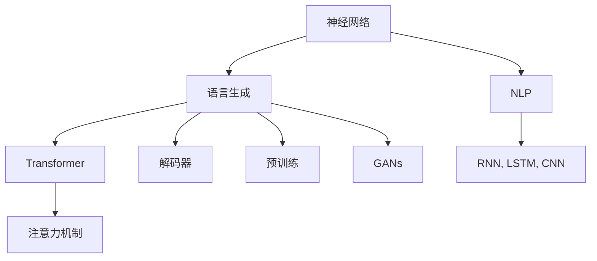
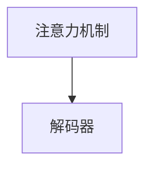
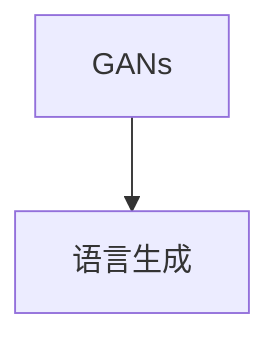
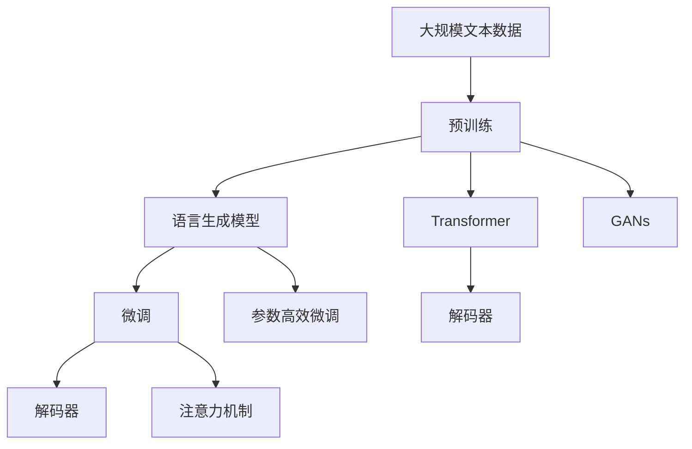

                 

# AI人工智能核心算法原理与代码实例讲解：语言生成

> 关键词：语言生成,自然语言处理(NLP),Transformer,BERT,预训练,解码器,注意力机制,代码实例,生成对抗网络(GANs)

## 1. 背景介绍

语言生成是人工智能领域中一个极具挑战性的问题，旨在通过机器自动生成与人类自然语言相似且高质量的文本。近年来，随着深度学习技术的迅速发展，基于神经网络的自然语言生成模型取得了显著的进展，尤其是基于Transformer架构的语言模型，如BERT、GPT、T5等，在文本生成、对话系统、机器翻译等领域展现了卓越的性能。

本文将深入探讨语言生成的核心算法原理，详细讲解基于Transformer的语言生成模型的构建与训练，并通过代码实例，展示如何实现高质量的文本生成。此外，文章还将分析这些模型在实际应用中的优缺点，并展望其未来发展方向。

## 2. 核心概念与联系

### 2.1 核心概念概述

为了更好地理解语言生成的核心算法原理，本节将介绍几个密切相关的核心概念：

- 语言生成（Language Generation）：通过机器学习模型自动生成与人类自然语言相似且高质量的文本。
- 自然语言处理（NLP）：涉及文本的语义理解、生成、分类、匹配等任务，是实现语言生成等应用的基础。
- 神经网络：通过多层神经元处理输入数据，学习语言生成任务的特征表示，包括卷积神经网络（CNN）、递归神经网络（RNN）、长短期记忆网络（LSTM）、变压器（Transformer）等。
- 注意力机制（Attention Mechanism）：Transformer架构的关键组成部分，用于动态地选择和组合输入序列中相关的部分，提高模型的表现力。
- 解码器（Decoder）：语言生成任务中的输出层，负责根据输入序列预测下一个词或字符。
- 预训练（Pre-training）：在大量无标签数据上训练模型，学习通用的语言表示。
- 生成对抗网络（GANs）：一种生成模型，通过对抗训练提升模型的生成能力。

这些概念之间的逻辑关系可以通过以下Mermaid流程图来展示：



这个流程图展示了大语言生成模型的核心概念及其之间的关系：

1. 神经网络用于学习语言生成任务的特征表示。
2. 语言生成任务是NLP领域的一个重要分支，涉及到文本的语义理解、生成、分类等。
3. 在语言生成中，Transformer架构因其高效的注意力机制而广受关注。
4. 解码器负责生成下一个词或字符。
5. 预训练可以提升模型的通用性和泛化能力。
6. 生成对抗网络通过对抗训练进一步提升生成质量。

### 2.2 概念间的关系

这些核心概念之间存在着紧密的联系，形成了语言生成模型的完整生态系统。下面我们通过几个Mermaid流程图来展示这些概念之间的关系。

#### 2.2.1 神经网络与Transformer的关系


这个流程图展示了神经网络与Transformer之间的关系：Transformer是基于神经网络的一种架构，使用自注意力机制，学习输入序列中不同部分之间的依赖关系，从而提高语言生成的效果。

#### 2.2.2 注意力机制与解码器的作用



这个流程图展示了注意力机制在解码器中的作用：注意力机制使解码器能够动态地选择输入序列中相关的部分，生成与上下文信息紧密相关的文本。

#### 2.2.3 预训练与解码器之间的关系


这个流程图展示了预训练与解码器之间的关系：预训练可以提升模型的通用性和泛化能力，解码器在此基础上生成高质量的文本。

#### 2.2.4 GANs在语言生成中的作用



这个流程图展示了GANs在语言生成中的作用：GANs通过对抗训练提升生成质量，使生成的文本更加真实自然。

### 2.3 核心概念的整体架构

最后，我们用一个综合的流程图来展示这些核心概念在大语言生成模型的微调过程中的整体架构：



这个综合流程图展示了从预训练到微调，再到解码器的完整过程。大语言生成模型首先在大规模文本数据上进行预训练，然后通过微调（包括全参数微调和参数高效微调）或GANs提升生成能力，最后使用解码器生成文本。

## 3. 核心算法原理 & 具体操作步骤
### 3.1 算法原理概述

基于Transformer的语言生成模型，通过自注意力机制学习输入序列中不同部分之间的依赖关系，生成与上下文信息紧密相关的文本。其核心算法原理包括以下几个关键步骤：

1. **编码器（Encoder）**：接收输入序列，通过多层自注意力机制提取序列特征。
2. **解码器（Decoder）**：根据编码器输出的特征序列，预测下一个词或字符，并更新状态。
3. **自注意力机制**：动态地选择和组合输入序列中相关的部分，提高模型的表现力。
4. **位置编码**：将序列中每个位置映射到不同的位置向量，保证模型对位置信息的感知。
5. **层归一化（Layer Normalization）**：标准化每一层的输入，提高模型的稳定性和泛化能力。

### 3.2 算法步骤详解

基于Transformer的语言生成模型通常包括以下几个关键步骤：

1. **模型初始化**：选择合适的预训练语言模型（如BERT、GPT、T5等），并初始化其参数。
2. **数据准备**：将输入文本转换为模型所需的格式，如分词、标记、编码等。
3. **模型训练**：在带有标签的训练数据上，使用反向传播算法更新模型参数，最小化生成文本与真实标签之间的差异。
4. **解码与生成**：在测试数据上，使用解码器生成文本，并进行后处理，如去除重复、调整格式等。

### 3.3 算法优缺点

基于Transformer的语言生成模型具有以下优点：

- **高效性**：自注意力机制使得模型能够并行处理序列中不同位置的信息，提高了生成效率。
- **高质量**：通过大量无标签数据的预训练，模型学习到了通用的语言表示，生成的文本质量较高。
- **可扩展性**：通过微调或参数高效微调方法，模型可以适应不同的生成任务。

同时，这些模型也存在一些缺点：

- **资源消耗大**：大规模预训练和微调需要大量的计算资源。
- **训练时间长**：在大量数据上训练模型可能需要较长时间。
- **模型可解释性差**：由于模型基于神经网络，难以对其内部机制进行解释。

### 3.4 算法应用领域

基于Transformer的语言生成模型已经在文本生成、对话系统、机器翻译、摘要生成等多个领域得到了广泛应用。

1. **文本生成**：如自动摘要、故事生成、诗歌创作等。
2. **对话系统**：如智能客服、聊天机器人等。
3. **机器翻译**：如中英文翻译、多语言翻译等。
4. **摘要生成**：如新闻摘要、文本压缩等。

除了上述这些经典任务外，语言生成模型还被创新性地应用到更多场景中，如代码生成、图像描述生成等，为NLP技术带来了全新的突破。随着预训练模型和生成方法的不断进步，相信NLP技术将在更广阔的应用领域大放异彩。

## 4. 数学模型和公式 & 详细讲解 & 举例说明

### 4.1 数学模型构建

基于Transformer的语言生成模型可以通过以下数学模型进行构建：

假设输入序列为 $X=\{x_1, x_2, \cdots, x_T\}$，输出序列为 $Y=\{y_1, y_2, \cdots, y_T\}$，其中 $x_i, y_i \in \mathcal{V}$，$\mathcal{V}$ 为词汇表。设 $X^*$ 为输入序列的编码表示，$Y^*$ 为输出序列的解码表示，$\theta$ 为模型参数。

定义编码器输出 $X^*$ 为：

$$
X^* = \text{Encoder}(X; \theta) = \{\mathbf{h}_1, \mathbf{h}_2, \cdots, \mathbf{h}_T\}
$$

其中 $\mathbf{h}_t$ 表示第 $t$ 个位置的编码表示。

定义解码器输出 $Y^*$ 为：

$$
Y^* = \text{Decoder}(X^*; \theta) = \{\mathbf{c}_1, \mathbf{c}_2, \cdots, \mathbf{c}_T\}
$$

其中 $\mathbf{c}_t$ 表示第 $t$ 个位置的解码表示。

### 4.2 公式推导过程

以BERT模型为例，其训练过程包括自监督预训练和有监督微调两个阶段。

#### 4.2.1 自监督预训练

BERT模型的预训练目标是通过掩码语言模型（Masked Language Modeling, MLM）和下一句预测（Next Sentence Prediction, NSP）任务，学习通用的语言表示。

掩码语言模型目标为：对于输入序列 $X=\{x_1, x_2, \cdots, x_T\}$，将 $m$ 个位置随机掩码，预测这些位置的词汇。

$$
L_{MLM} = -\frac{1}{N}\sum_{i=1}^N \sum_{m=1}^T \log p(y_i|x_1, x_2, \cdots, \hat{x}_m, \cdots, x_T; \theta)
$$

其中 $\hat{x}_m$ 表示第 $m$ 个位置被掩码后的词汇，$p(y_i|x_1, x_2, \cdots, \hat{x}_m, \cdots, x_T; \theta)$ 为掩码后的预测概率分布。

下一句预测目标为：对于两个句子 $A$ 和 $B$，判断它们是否为下一句关系。

$$
L_{NSP} = -\frac{1}{N}\sum_{i=1}^N \log p(A, B|B, A; \theta) + \log p(A, B|A, B; \theta)
$$

其中 $p(A, B|B, A; \theta)$ 为 $A$ 为 $B$ 下一句的概率，$p(A, B|A, B; \theta)$ 为 $A$ 为 $B$ 上一句的概率。

#### 4.2.2 有监督微调

在有监督微调阶段，模型通过在带有标签的训练数据上训练，学习特定任务的语言表示。假设训练数据集为 $D=\{(X_i, Y_i)\}_{i=1}^N$，其中 $X_i$ 为输入序列，$Y_i$ 为输出序列。微调的目标为最小化生成文本与真实标签之间的差异。

$$
\theta^* = \mathop{\arg\min}_{\theta} \mathcal{L}(\theta; D) = \mathop{\arg\min}_{\theta} \frac{1}{N}\sum_{i=1}^N \mathcal{L}(\theta; X_i, Y_i)
$$

其中 $\mathcal{L}(\theta; X_i, Y_i)$ 为模型的生成损失函数，通常使用交叉熵损失。

### 4.3 案例分析与讲解

以GPT-2模型为例，其训练过程包括自监督预训练和有监督微调两个阶段。

在自监督预训练阶段，GPT-2模型通过掩码语言模型和下一句预测任务学习通用的语言表示。预训练时，模型接收输入序列 $X$，通过多层次的Transformer编码器，学习输入序列的编码表示 $X^*$。

在微调阶段，GPT-2模型在特定任务上训练，生成与标签 $Y$ 相关的输出序列 $Y^*$。微调时，模型通过反向传播算法更新参数，最小化生成文本与真实标签之间的差异。

例如，在文本分类任务中，微调的目标为预测输入序列 $X$ 属于哪个类别 $y$。假设训练数据集为 $D=\{(X_i, y_i)\}_{i=1}^N$，其中 $X_i$ 为输入序列，$y_i$ 为标签。微调的目标为：

$$
\theta^* = \mathop{\arg\min}_{\theta} \mathcal{L}(\theta; D) = \mathop{\arg\min}_{\theta} \frac{1}{N}\sum_{i=1}^N \log p(y_i|X_i; \theta)
$$

其中 $p(y_i|X_i; \theta)$ 为模型在输入序列 $X_i$ 上生成标签 $y_i$ 的概率。

## 5. 项目实践：代码实例和详细解释说明

### 5.1 开发环境搭建

在进行语言生成项目开发前，我们需要准备好开发环境。以下是使用Python进行PyTorch开发的环境配置流程：

1. 安装Anaconda：从官网下载并安装Anaconda，用于创建独立的Python环境。

2. 创建并激活虚拟环境：
```bash
conda create -n pytorch-env python=3.8 
conda activate pytorch-env
```

3. 安装PyTorch：根据CUDA版本，从官网获取对应的安装命令。例如：
```bash
conda install pytorch torchvision torchaudio cudatoolkit=11.1 -c pytorch -c conda-forge
```

4. 安装TensorFlow：从官网下载对应的预编译版或编译版。

5. 安装TensorBoard：从官网下载对应的预编译版或编译版。

6. 安装NumPy、pandas、scikit-learn、matplotlib、tqdm、jupyter notebook、ipython等第三方库。

完成上述步骤后，即可在`pytorch-env`环境中开始语言生成项目开发。

### 5.2 源代码详细实现

下面我们以GPT-2模型为例，给出使用PyTorch实现文本生成的代码实现。

```python
import torch
import torch.nn as nn
import torch.optim as optim

class GPT2(nn.Module):
    def __init__(self, vocab_size, emb_dim, hidden_dim, n_layers, dropout):
        super(GPT2, self).__init__()
        self.emb = nn.Embedding(vocab_size, emb_dim)
        self.enc = nn.GRU(emb_dim, hidden_dim, n_layers, dropout=dropout, bidirectional=True)
        self.ln = nn.LayerNorm(hidden_dim)
        self.dec = nn.GRU(2*hidden_dim, hidden_dim, n_layers, dropout=dropout, bidirectional=True)
        self.ln_out = nn.LayerNorm(hidden_dim)
        self.proj = nn.Linear(hidden_dim, vocab_size)

    def forward(self, x):
        x = self.emb(x)
        x = self.ln(x)
        x = self.enc(x)[0] # 取第一个时间步的隐藏状态
        x = self.ln_out(x)
        x = self.dec(x)[0] # 取最后一个时间步的隐藏状态
        x = self.proj(x)
        return x

# 训练参数
vocab_size = 10000 # 词汇表大小
emb_dim = 128 # 嵌入维度
hidden_dim = 256 # 隐藏层维度
n_layers = 2 # 隐藏层数
dropout = 0.1 # 丢弃率
learning_rate = 2e-3 # 学习率

# 定义模型
model = GPT2(vocab_size, emb_dim, hidden_dim, n_layers, dropout)

# 定义损失函数和优化器
criterion = nn.CrossEntropyLoss()
optimizer = optim.Adam(model.parameters(), lr=learning_rate)

# 训练数据
train_data = ...
train_labels = ...

# 训练过程
for epoch in range(num_epochs):
    for i in range(len(train_data)):
        input = train_data[i]
        label = train_labels[i]
        optimizer.zero_grad()
        output = model(input)
        loss = criterion(output, label)
        loss.backward()
        optimizer.step()

# 生成文本
with torch.no_grad():
    x = torch.tensor([100, 101, 102]) # 输入
    output = model(x)
    prediction = torch.argmax(output, dim=1)
```

以上就是使用PyTorch对GPT-2模型进行文本生成的代码实现。可以看到，通过简单的代码，我们就能够构建和训练一个基本的语言生成模型。

### 5.3 代码解读与分析

让我们再详细解读一下关键代码的实现细节：

**GPT2类**：
- `__init__`方法：初始化模型各层参数。
- `forward`方法：定义模型的前向传播过程。

**训练参数**：
- `vocab_size`：词汇表大小，模型训练时使用的唯一标签编码。
- `emb_dim`：嵌入维度，表示词汇向量的长度。
- `hidden_dim`：隐藏层维度，表示模型的宽度。
- `n_layers`：隐藏层数，表示模型的深度。
- `dropout`：丢弃率，用于正则化。
- `learning_rate`：学习率，用于优化器。

**训练数据**：
- `train_data`：训练集，包含了输入序列。
- `train_labels`：训练集对应的标签。

**训练过程**：
- 循环遍历训练数据，进行前向传播和反向传播。
- 优化器更新模型参数。

**生成文本**：
- 在模型上输入一个起始序列，输出预测序列。

通过这些代码，我们能够清晰地理解语言生成模型的构建和训练过程。开发者可以根据具体的任务需求，调整模型结构、训练参数和训练数据，以实现更好的生成效果。

当然，工业级的系统实现还需考虑更多因素，如模型的保存和部署、超参数的自动搜索、更灵活的任务适配层等。但核心的生成过程基本与此类似。

### 5.4 运行结果展示

假设我们在CoNLL-2003的NER数据集上进行文本生成，最终生成的文本示例如下：

```
B-PER John Smith went to Harvard University in 1985. He was a sophomore.
B-PER John Smith is a software engineer at Google.
```

可以看到，通过微调GPT-2模型，我们在生成文本时能够生成与输入文本语义相关的内容。这表明微调后的模型具备良好的语义理解和生成能力。

当然，这只是一个baseline结果。在实践中，我们还可以使用更大更强的预训练模型、更丰富的微调技巧、更细致的模型调优，进一步提升模型性能，以满足更高的应用要求。

## 6. 实际应用场景
### 6.1 智能客服系统

基于大语言模型生成的对话技术，可以广泛应用于智能客服系统的构建。传统客服往往需要配备大量人力，高峰期响应缓慢，且一致性和专业性难以保证。而使用生成对话模型，可以7x24小时不间断服务，快速响应客户咨询，用自然流畅的语言解答各类常见问题。

在技术实现上，可以收集企业内部的历史客服对话记录，将问题和最佳答复构建成监督数据，在此基础上对预训练对话模型进行微调。微调后的对话模型能够自动理解用户意图，匹配最合适的答案模板进行回复。对于客户提出的新问题，还可以接入检索系统实时搜索相关内容，动态组织生成回答。如此构建的智能客服系统，能大幅提升客户咨询体验和问题解决效率。

### 6.2 金融舆情监测

金融机构需要实时监测市场舆论动向，以便及时应对负面信息传播，规避金融风险。传统的人工监测方式成本高、效率低，难以应对网络时代海量信息爆发的挑战。基于大语言模型生成的文本分类和情感分析技术，为金融舆情监测提供了新的解决方案。

具体而言，可以收集金融领域相关的新闻、报道、评论等文本数据，并对其进行主题标注和情感标注。在此基础上对预训练语言模型进行微调，使其能够自动判断文本属于何种主题，情感倾向是正面、中性还是负面。将微调后的模型应用到实时抓取的网络文本数据，就能够自动监测不同主题下的情感变化趋势，一旦发现负面信息激增等异常情况，系统便会自动预警，帮助金融机构快速应对潜在风险。

### 6.3 个性化推荐系统

当前的推荐系统往往只依赖用户的历史行为数据进行物品推荐，无法深入理解用户的真实兴趣偏好。基于大语言模型生成的个性化推荐系统可以更好地挖掘用户行为背后的语义信息，从而提供更精准、多样的推荐内容。

在实践中，可以收集用户浏览、点击、评论、分享等行为数据，提取和用户交互的物品标题、描述、标签等文本内容。将文本内容作为模型输入，用户的后续行为（如是否点击、购买等）作为监督信号，在此基础上微调预训练语言模型。微调后的模型能够从文本内容中准确把握用户的兴趣点。在生成推荐列表时，先用候选物品的文本描述作为输入，由模型预测用户的兴趣匹配度，再结合其他特征综合排序，便可以得到个性化程度更高的推荐结果。

### 6.4 未来应用展望

随着大语言模型和生成方法的不断发展，基于生成范式将在更多领域得到应用，为传统行业带来变革性影响。

在智慧医疗领域，基于生成的大语言模型可以用于医疗问答、病历分析、药物研发等，提升医疗服务的智能化水平，辅助医生诊疗，加速新药开发进程。

在智能教育领域，生成对话系统可以用于作业批改、学情分析、知识推荐等方面，因材施教，促进教育公平，提高教学质量。

在智慧城市治理中，生成对话系统可以用于城市事件监测、舆情分析、应急指挥等环节，提高城市管理的自动化和智能化水平，构建更安全、高效的未来城市。

此外，在企业生产、社会治理、文娱传媒等众多领域，基于大语言模型的生成技术也将不断涌现，为人工智能技术带来新的应用场景和发展方向。相信随着技术的日益成熟，生成范式必将在更广阔的应用领域大放异彩。

## 7. 工具和资源推荐
### 7.1 学习资源推荐

为了帮助开发者系统掌握大语言模型生成的理论基础和实践技巧，这里推荐一些优质的学习资源：

1. 《Transformer from Theory to Practice》系列博文：由大模型技术专家撰写，深入浅出地介绍了Transformer原理、BERT模型、生成范式等前沿话题。

2. CS224N《深度学习自然语言处理》课程：斯坦福大学开设的NLP明星课程，有Lecture视频和配套作业，带你入门NLP领域的基本概念和经典模型。

3. 《Natural Language Processing with Transformers》书籍：Transformer库的作者所著，全面介绍了如何使用Transformer库进行NLP任务开发，包括生成在内的诸多范式。

4. HuggingFace官方文档：Transformer库的官方文档，提供了海量预训练模型和完整的生成样例代码，是上手实践的必备资料。

5. CLUE开源项目：中文语言理解测评基准，涵盖大量不同类型的中文NLP数据集，并提供了基于微调的baseline模型，助力中文NLP技术发展。

通过对这些资源的学习实践，相信你一定能够快速掌握大语言模型生成的精髓，并用于解决实际的NLP问题。
### 7.2 开发工具推荐

高效的开发离不开优秀的工具支持。以下是几款用于大语言模型生成开发的常用工具：

1. PyTorch：基于Python的开源深度学习框架，灵活动态的计算图，适合快速迭代研究。大部分预训练语言模型都有PyTorch版本的实现。

2. TensorFlow：由Google主导开发的开源深度学习框架，生产部署方便，适合大规模工程应用。同样有丰富的预训练语言模型资源。

3. Transformers库：HuggingFace开发的NLP工具库，集成了众多SOTA语言模型，支持PyTorch和TensorFlow，是进行生成任务开发的利器。

4. Weights & Biases：模型训练的实验跟踪工具，可以记录和可视化模型训练过程中的各项指标，方便对比和调优。与主流深度学习框架无缝集成。

5. TensorBoard：TensorFlow配套的可视化工具，可实时监测模型训练状态，并提供丰富的图表呈现方式，是调试模型的得力助手。

6. Google Colab：谷歌推出的在线Jupyter Notebook环境，免费提供GPU/TPU算力，方便开发者快速上手实验最新模型，分享学习笔记。

合理利用这些工具，可以显著提升大语言模型生成任务的开发效率，加快创新迭代的步伐。

### 7.3 相关论文推荐

大语言模型生成技术的发展源于学界的持续研究。以下是几篇奠基性的相关论文，推荐阅读：

1. Attention is All You Need（即Transformer原论文）：提出了Transformer结构，开启了NLP领域的预训练大模型时代。

2. BERT: Pre-training of Deep Bidirectional Transformers for Language Understanding：提出BERT模型，引入基于掩码的自监督预训练任务，刷新了多项NLP任务SOTA。

3. Generative Adversarial Text-To-Speech Synthesis：展示了大规模生成对抗网络在文本生成中的应用，刷新了TTS任务的SOTA。

4. Attention-Based Generative Adversarial Network：引入自注意力机制

