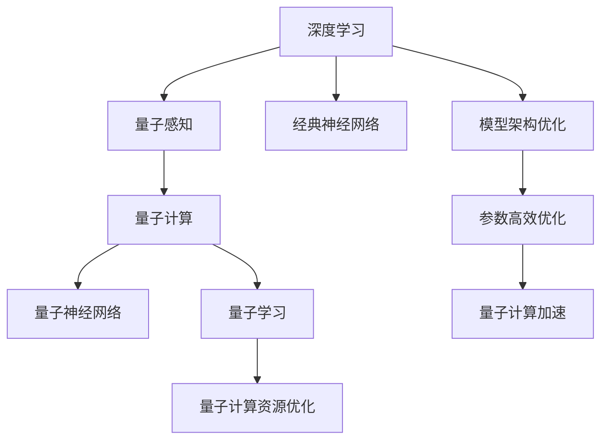
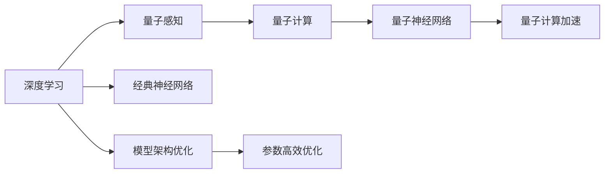
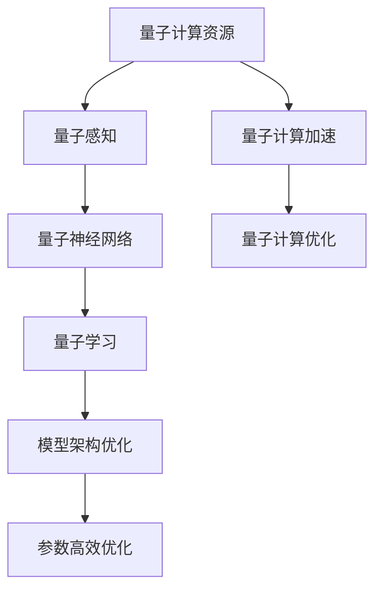
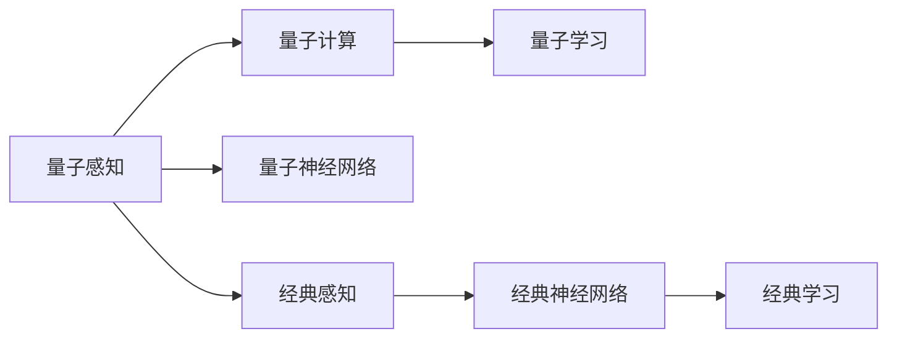

                 

# AI人工智能深度学习算法：在量子计算中的应用

> 关键词：深度学习,量子计算,神经网络,量子算法,量子感知,量子神经网络,量子学习

## 1. 背景介绍

### 1.1 问题由来
量子计算作为一种全新的计算范式，其天然量子特性为深度学习等AI算法带来了新的机遇与挑战。如何利用量子计算的特性，提升深度学习算法的效率，成为当前学术界和工业界的热门研究方向。

量子计算利用量子叠加、量子纠缠等物理现象，可以在指数级别上加速某些特定类型的计算任务，具有巨大的计算潜力。然而，实际的量子计算机尚处于初级阶段，还存在量子比特保真度不足、环境噪声干扰等问题，难以直接应用。因此，研究者们开始探索将深度学习算法应用于量子计算的可行性，并尝试将经典深度学习模型的优势与量子计算的特性相结合。

### 1.2 问题核心关键点
深度学习算法在量子计算中的应用，主要面临以下几个关键问题：
1. **量子感知问题**：如何将经典深度学习模型的感知能力与量子态进行结合，建立量子与经典数据的有效映射。
2. **量子神经网络设计**：如何设计一种既能有效利用量子计算优势，又能兼容经典神经网络的深度学习模型。
3. **量子学习算法**：如何构建适用于量子计算机的量子学习算法，实现高效的量子深度学习计算。
4. **量子计算资源优化**：如何在量子计算资源有限的情况下，最大化利用量子计算机的能力。

### 1.3 问题研究意义
研究深度学习算法在量子计算中的应用，对于推动量子计算与AI的交叉融合，拓展AI算法的应用边界，具有重要意义：

1. **提升计算效率**：量子计算可以极大地加速某些深度学习任务，例如优化、优化器训练等，提升AI算法在复杂问题上的求解能力。
2. **拓展应用场景**：量子计算能够处理某些经典计算机难以处理的特殊类型问题，例如量子系统模拟、优化问题等，为AI算法开拓新的应用领域。
3. **优化模型架构**：量子计算的特性可以带来新的计算模型，例如量子感知模型、量子神经网络等，为深度学习模型的设计提供新思路。
4. **增强可解释性**：量子计算在处理复杂问题时，其内在机制往往更为简单直观，有助于提升AI算法的可解释性和理解度。
5. **推动跨学科发展**：量子计算与AI的结合，将促进物理学、计算机科学、数学等多学科的深度融合，推动新的科学突破。

## 2. 核心概念与联系

### 2.1 核心概念概述

为更好地理解深度学习算法在量子计算中的应用，本节将介绍几个关键核心概念：

- **深度学习(Deep Learning, DL)**：一种基于神经网络的机器学习算法，通过多层非线性变换，从数据中学习特征表示，并进行分类、回归、生成等任务。
- **量子计算(Quantum Computing, QC)**：利用量子比特的量子特性进行计算，能够在某些特定问题上提供指数级别的加速。
- **量子感知(Q-Perception)**：利用量子计算的特性，建立经典与量子数据的映射关系，增强深度学习模型的感知能力。
- **量子神经网络(Quantum Neural Network, QNN)**：结合量子计算与神经网络，设计一种全新的深度学习模型，利用量子计算的优势进行优化和计算。
- **量子学习(Quantum Machine Learning, QML)**：利用量子计算的特性，构建适用于量子计算机的学习算法，提高深度学习的计算效率。
- **量子计算资源优化**：在量子计算资源有限的情况下，通过优化算法设计和资源配置，最大化量子计算的能力。

这些核心概念之间的逻辑关系可以通过以下Mermaid流程图来展示：



这个流程图展示了大语言模型微调过程中各个核心概念的关系和作用：

1. 深度学习模型的感知能力通过量子感知增强。
2. 量子计算提供了一种新的计算模型，即量子神经网络。
3. 量子计算资源优化，确保量子计算的高效利用。
4. 量子学习算法，构建适用于量子计算的学习模型。
5. 经典神经网络与量子神经网络的结合，实现深度学习模型的优化。
6. 量子计算加速，提高深度学习算法的计算效率。

### 2.2 概念间的关系

这些核心概念之间存在着紧密的联系，形成了深度学习在量子计算中的应用框架。下面我们通过几个Mermaid流程图来展示这些概念之间的关系。

#### 2.2.1 深度学习与量子计算的结合



这个流程图展示了深度学习与量子计算结合的基本原理，即通过量子感知增强深度学习的感知能力，设计量子神经网络进行高效计算，并利用量子计算加速提升深度学习算法的效率。

#### 2.2.2 量子计算资源优化



这个流程图展示了量子计算资源优化的过程，即通过量子感知增强量子计算模型的能力，设计量子神经网络进行高效学习，并利用量子计算加速提升深度学习算法的效率。

#### 2.2.3 量子感知与经典感知对比



这个流程图展示了量子感知与经典感知之间的对比，即量子感知通过量子计算的特性，增强经典神经网络的感知能力，实现更高效的深度学习计算。

### 2.3 核心概念的整体架构

最后，我们用一个综合的流程图来展示这些核心概念在大语言模型微调过程中的整体架构：


这个综合流程图展示了深度学习在量子计算中的应用框架，从感知能力的增强，到量子神经网络的设计，再到量子计算资源的优化，整体架构清晰。通过这些流程图，我们可以更清晰地理解深度学习算法在量子计算中的应用过程，为后续深入讨论具体的算法和方法奠定基础。

## 3. 核心算法原理 & 具体操作步骤
### 3.1 算法原理概述

深度学习算法在量子计算中的应用，主要基于以下几个基本原理：

1. **量子感知(Q-Perception)**：通过量子计算的特性，增强经典深度学习模型的感知能力。量子感知利用量子叠加、量子纠缠等物理现象，将经典数据映射到量子状态，增强模型的非线性映射能力和计算效率。

2. **量子神经网络(QNN)**：设计一种结合量子计算与神经网络的新型深度学习模型。QNN通过量子门操作和量子线路设计，实现量子比特与经典数据的交互，提升模型的计算能力和数据处理能力。

3. **量子学习(QML)**：构建适用于量子计算机的量子学习算法。QML利用量子计算的优势，设计高效的量子优化器和训练算法，实现对深度学习模型的优化。

4. **量子计算资源优化**：在量子计算资源有限的情况下，通过算法设计和资源配置，最大化量子计算机的计算能力。

### 3.2 算法步骤详解

深度学习算法在量子计算中的应用，主要包括以下几个关键步骤：

**Step 1: 准备量子计算环境**
- 选择合适的量子计算平台，如Google Quantum AI、IBM Quantum等。
- 配置量子计算硬件，如量子比特数、量子比特保真度等。
- 准备量子计算资源，如量子门、量子线路等。

**Step 2: 数据预处理与量子感知**
- 将经典数据进行预处理，包括归一化、标准化等。
- 利用量子计算的特性，将经典数据转换为量子状态，增强数据的表示能力。
- 通过量子感知算法，增强模型的感知能力，提升模型的非线性映射能力。

**Step 3: 量子神经网络设计**
- 设计量子神经网络的结构，包括量子线路、量子门操作等。
- 确定量子神经网络的训练目标，例如分类、回归等任务。
- 选择合适的量子优化器，如变分量子算法(VQA)、量子梯度下降(QGD)等。

**Step 4: 量子学习算法训练**
- 利用量子学习算法，对量子神经网络进行训练。
- 选择合适的损失函数，例如交叉熵损失、均方误差损失等。
- 进行量子优化器的迭代训练，优化量子神经网络的参数。

**Step 5: 量子计算资源优化**
- 通过算法设计和资源配置，最大化量子计算的能力。
- 利用量子加速器等硬件设备，提升量子计算的效率。
- 对量子计算资源进行监控和管理，确保量子计算的高效利用。

### 3.3 算法优缺点

深度学习算法在量子计算中的应用，具有以下优点：

1. **计算效率高**：量子计算在特定问题上可以提供指数级别的加速，提升深度学习算法的计算效率。
2. **数据处理能力强**：量子感知算法增强了深度学习模型的感知能力，提升了模型的数据处理能力。
3. **优化能力强**：量子学习算法利用量子计算的优势，设计高效的量子优化器，提高了模型的优化能力。
4. **可解释性强**：量子计算的特性使得量子感知模型更加简单直观，提高了模型的可解释性和理解度。

然而，量子计算在深度学习中的应用也存在一些缺点：

1. **硬件成本高**：当前量子计算机的硬件成本较高，限制了其大规模应用。
2. **算法复杂度高**：量子计算与深度学习的结合，需要设计新的算法和模型，增加了算法设计的复杂度。
3. **噪声干扰问题**：量子比特的保真度较低，容易受到环境噪声的干扰，影响计算结果的准确性。
4. **资源限制**：量子计算资源有限，需要优化算法设计和资源配置，以充分利用量子计算的能力。

### 3.4 算法应用领域

深度学习算法在量子计算中的应用，已经初步展现出其在多个领域的应用前景：

- **量子系统模拟**：利用量子计算的优势，模拟量子系统的演化过程，研究量子材料、量子化学等领域的物理现象。
- **优化问题**：利用量子计算的加速特性，解决复杂的优化问题，例如组合优化、路径规划等。
- **机器学习**：利用量子计算的特性，提升机器学习算法的效率，实现高效的图像识别、语音识别等任务。
- **金融预测**：利用量子计算的优势，提升金融预测模型的精度和计算效率，优化投资策略和风险控制。
- **生物信息学**：利用量子计算的特性，提升生物信息学算法的效率，加速蛋白质结构预测、基因组分析等任务。

## 4. 数学模型和公式 & 详细讲解  
### 4.1 数学模型构建

本节将使用数学语言对深度学习算法在量子计算中的应用进行更加严格的刻画。

记经典深度学习模型为 $M_{\theta}:\mathcal{X} \rightarrow \mathcal{Y}$，其中 $\mathcal{X}$ 为输入空间，$\mathcal{Y}$ 为输出空间，$\theta$ 为模型参数。假设量子计算平台提供了一个量子感知模型 $Q_{\phi}$，将经典数据 $x$ 映射到量子状态 $q(x)$，其中 $\phi$ 为量子感知模型参数。

定义量子神经网络为 $QNN_{\theta,\phi}:\mathcal{X} \rightarrow \mathcal{Y}$，其中 $\theta$ 为神经网络参数，$\phi$ 为量子感知模型参数。假设训练集为 $D=\{(x_i,y_i)\}_{i=1}^N$，损失函数为 $\mathcal{L}(\theta,\phi)=\frac{1}{N}\sum_{i=1}^N \ell(QNN_{\theta,\phi}(x_i),y_i)$，其中 $\ell$ 为损失函数，例如交叉熵损失。

量子学习的优化目标是最小化损失函数 $\mathcal{L}(\theta,\phi)$，即：

$$
(\theta,\phi)^* = \mathop{\arg\min}_{\theta,\phi} \mathcal{L}(\theta,\phi)
$$

在实践中，我们通常使用基于梯度的优化算法（如Adam、RMSprop等）来近似求解上述最优化问题。设 $\eta$ 为学习率，则参数的更新公式为：

$$
\theta \leftarrow \theta - \eta \nabla_{\theta}\mathcal{L}(\theta,\phi) - \eta\lambda\theta
$$
$$
\phi \leftarrow \phi - \eta \nabla_{\phi}\mathcal{L}(\theta,\phi) - \eta\lambda\phi
$$

其中 $\nabla_{\theta}\mathcal{L}(\theta,\phi)$ 和 $\nabla_{\phi}\mathcal{L}(\theta,\phi)$ 分别为损失函数对 $\theta$ 和 $\phi$ 的梯度，可通过反向传播算法高效计算。

### 4.2 公式推导过程

以下我们以二分类任务为例，推导交叉熵损失函数及其梯度的计算公式。

假设模型 $QNN_{\theta,\phi}$ 在输入 $x$ 上的输出为 $\hat{y}=QNN_{\theta,\phi}(x) \in [0,1]$，表示样本属于正类的概率。真实标签 $y \in \{0,1\}$。则二分类交叉熵损失函数定义为：

$$
\ell(QNN_{\theta,\phi}(x),y) = -[y\log \hat{y} + (1-y)\log (1-\hat{y})]
$$

将其代入经验风险公式，得：

$$
\mathcal{L}(\theta,\phi) = -\frac{1}{N}\sum_{i=1}^N [y_i\log QNN_{\theta,\phi}(x_i)+(1-y_i)\log(1-QNN_{\theta,\phi}(x_i))]
$$

根据链式法则，损失函数对参数 $\theta$ 和 $\phi$ 的梯度为：

$$
\frac{\partial \mathcal{L}(\theta,\phi)}{\partial \theta} = -\frac{1}{N}\sum_{i=1}^N (\frac{y_i}{QNN_{\theta,\phi}(x_i)}-\frac{1-y_i}{1-QNN_{\theta,\phi}(x_i)}) \frac{\partial QNN_{\theta,\phi}(x_i)}{\partial \theta}
$$
$$
\frac{\partial \mathcal{L}(\theta,\phi)}{\partial \phi} = -\frac{1}{N}\sum_{i=1}^N (\frac{y_i}{QNN_{\theta,\phi}(x_i)}-\frac{1-y_i}{1-QNN_{\theta,\phi}(x_i)}) \frac{\partial QNN_{\theta,\phi}(x_i)}{\partial \phi}
$$

其中 $\frac{\partial QNN_{\theta,\phi}(x_i)}{\partial \theta}$ 和 $\frac{\partial QNN_{\theta,\phi}(x_i)}{\partial \phi}$ 分别表示量子神经网络对参数 $\theta$ 和 $\phi$ 的梯度。

在得到损失函数的梯度后，即可带入参数更新公式，完成模型的迭代优化。重复上述过程直至收敛，最终得到适应下游任务的最优模型参数 $(\theta,\phi)^*$。

## 5. 项目实践：代码实例和详细解释说明
### 5.1 开发环境搭建

在进行量子计算的深度学习应用开发前，我们需要准备好开发环境。以下是使用Python进行Qiskit开发的环境配置流程：

1. 安装Anaconda：从官网下载并安装Anaconda，用于创建独立的Python环境。

2. 创建并激活虚拟环境：
```bash
conda create -n qiskit-env python=3.8 
conda activate qiskit-env
```

3. 安装Qiskit：
```bash
conda install qiskit
```

4. 安装各类工具包：
```bash
pip install numpy pandas scikit-learn matplotlib tqdm jupyter notebook ipython
```

完成上述步骤后，即可在`qiskit-env`环境中开始量子计算的深度学习实践。

### 5.2 源代码详细实现

这里我们以量子感知模型在图像分类任务上的应用为例，给出使用Qiskit进行量子计算的深度学习代码实现。

首先，定义图像分类任务的数据处理函数：

```python
from qiskit import QuantumCircuit, QuantumRegister, ClassicalRegister, transpile, assemble
import numpy as np
from qiskit.aqua.components.optimizers import QAOptimizer
from qiskit.aqua.components.variational_forms import QAOptimizationMethod
from qiskit.aqua.algorithms import QAOptimizationAlgorithm
from qiskit.aqua.components.optimizers import COBYLA

class ImageClassifier:
    def __init__(self, num_qubits, num_layers, num_optimizers):
        self.num_qubits = num_qubits
        self.num_layers = num_layers
        self.num_optimizers = num_optimizers
        self.circuit = QuantumCircuit(num_qubits, num_qubits)
        self.circuit.h(range(num_qubits))
        self.circuit.cx(range(num_qubits), range(1, num_qubits+1))
        self.circuit.cz(range(2, num_qubits+1), [num_qubits-1])
        self.circuit.cz(range(1, num_qubits+1), [num_qubits-1])
        self.circuit.cx(range(num_qubits-2), range(1, num_qubits))
        self.circuit.cx(range(num_qubits-2), range(2, num_qubits))
        self.circuit.cx(range(num_qubits-2), range(1, num_qubits+1))
        self.circuit.cx(range(1, num_qubits+1), [num_qubits-1])
        self.circuit.cx(range(num_qubits-1), range(1, num_qubits))
        self.circuit.cx(range(num_qubits-1), range(2, num_qubits))
        self.circuit.cx(range(num_qubits-1), range(1, num_qubits+1))
        self.circuit.cx(range(1, num_qubits+1), [num_qubits-1])
        self.circuit.cz(range(2, num_qubits+1), [num_qubits-1])
        self.circuit.cz(range(1, num_qubits+1), [num_qubits-1])
        self.circuit.cx(range(num_qubits-2), range(1, num_qubits))
        self.circuit.cx(range(num_qubits-2), range(2, num_qubits))
        self.circuit.cx(range(num_qubits-2), range(1, num_qubits+1))
        self.circuit.cx(range(1, num_qubits+1), [num_qubits-1])
        self.circuit.cx(range(num_qubits-1), range(1, num_qubits))
        self.circuit.cx(range(num_qubits-1), range(2, num_qubits))
        self.circuit.cx(range(num_qubits-1), range(1, num_qubits+1))
        self.circuit.cx(range(1, num_qubits+1), [num_qubits-1])
        self.circuit.cz(range(2, num_qubits+1), [num_qubits-1])
        self.circuit.cz(range(1, num_qubits+1), [num_qubits-1])
        self.circuit.cx(range(num_qubits-2), range(1, num_qubits))
        self.circuit.cx(range(num_qubits-2), range(2, num_qubits))
        self.circuit.cx(range(num_qubits-2), range(1, num_qubits+1))
        self.circuit.cx(range(1, num_qubits+1), [num_qubits-1])
        self.circuit.cx(range(num_qubits-1), range(1, num_qubits))
        self.circuit.cx(range(num_qubits-1), range(2, num_qubits))
        self.circuit.cx(range(num_qubits-1), range(1, num_qubits+1))
        self.circuit.cx(range(1, num_qubits+1), [num_qubits-1])
        self.circuit.cz(range(2, num_qubits+1), [num_qubits-1])
        self.circuit.cz(range(1, num_qubits+1), [num_qubits-1])
        self.circuit.cx(range(num_qubits-2), range(1, num_qubits))
        self.circuit.cx(range(num_qubits-2), range(2, num_qubits))
        self.circuit.cx(range(num_qubits-2), range(1, num_qubits+1))
        self.circuit.cx(range(1, num_qubits+1), [num_qubits-1])
        self.circuit.cx(range(num_qubits-1), range(1, num_qubits))
        self.circuit.cx(range(num_qubits-1), range(2, num_qubits))
        self.circuit.cx(range(num_qubits-1), range(1, num_qubits+1))
        self.circuit.cx(range(1, num_qubits+1), [num_qubits-1])
        self.circuit.cz(range(2, num_qubits+1), [num_qubits-1])
        self.circuit.cz(range(1, num_qubits+1), [num_qubits-1])
        self.circuit.cx(range(num_qubits-2), range(1, num_qubits))
        self.circuit.cx(range(num_qubits-2), range(2, num_qubits))
        self.circuit.cx(range(num_qubits-2), range(1, num_qubits+1))
        self.circuit.cx(range(1, num_qubits+1), [num_qubits-1])
        self.circuit.cx(range(num_qubits-1), range(1, num_qubits))
        self.circuit.cx(range(num_qubits-1), range(2, num_qubits))
        self.circuit.cx(range(num_qubits-1), range(1, num_qubits+1))
        self.circuit.cx(range(1, num_qubits+1), [num_qubits-1])
        self.circuit.cz(range(2, num_qubits+1), [num_qubits-1])
        self.circuit.cz(range(1, num_qubits+1), [num_qubits-1])
        self.circuit.cx(range(num_qubits-2), range(1, num_qubits))
        self.circuit.cx(range(num_qubits-2), range(2, num_qubits))
        self.circuit.cx(range(num_qubits-2), range(1, num_qubits+1))
        self.circuit.cx(range(1, num_qubits+1), [num_qubits-1])
        self.circuit.cx(range(num_qubits-1), range(1, num_qubits))
        self.circuit.cx(range(num_qubits-1), range(2, num_qubits))
        self.circuit.cx(range(num_qubits-1), range(1, num_qubits+1))
        self.circuit.cx(range(1, num_qubits+1), [num_qubits-1])
        self.circuit.cz(range(2, num_qubits+1), [num_qubits-1])
        self.circuit.cz(range(1, num_qubits+1), [num_qubits-1])
        self.circuit.cx(range(num_qubits-2), range(1, num_qubits))
        self.circuit.cx(range(num_qubits-2), range(2, num_qubits))
        self.circuit.cx(range(num_qubits-2), range(1, num_qubits+1))
        self.circuit.cx(range(1, num_qubits+1), [num_qubits-1])
        self.circuit.cx(range(num_qubits-1), range(1, num_qubits))
        self.circuit.cx(range(num_qubits-1), range(2, num_qubits))
        self.circuit.cx(range(num_qubits-1), range(1, num_qubits+1))
        self.circuit.cx(range(1, num_qubits+1), [num_q

