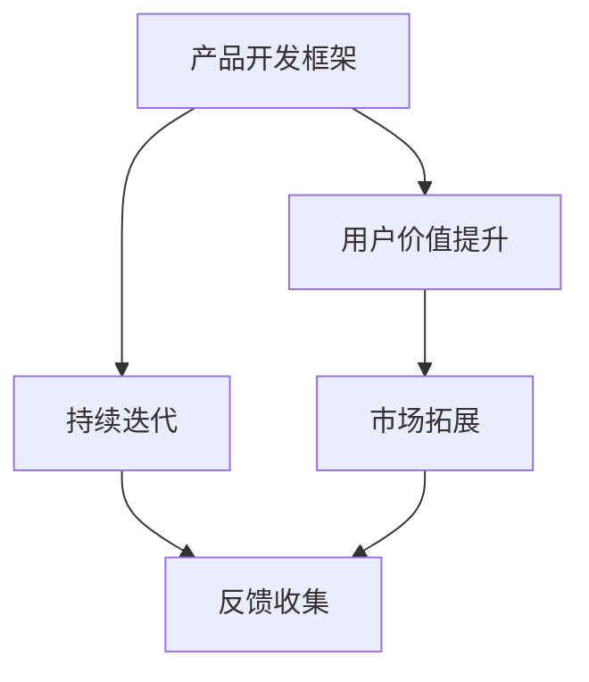

                 

## 1. 背景介绍

在当前数字化、智能化转型的大潮中，AI创业公司凭借其技术创新和应用落地能力，成为快速增长的潜力新星。然而，要真正实现快速增长，AI创业公司需要应对多方面的挑战。本文将系统梳理AI创业公司实现快速增长的关键策略，深入分析核心概念及其内在联系，提供行之有效的技术和实践指南。

### 1.1 问题由来
AI创业公司面临的挑战多样而复杂，涉及技术、市场、管理、运营等多个层面。其中，如何高效构建产品、提升用户价值、持续迭代优化，成为决定公司发展速度和竞争力的核心问题。本文旨在深入剖析这些问题，为AI创业公司提供全面的战略和战术指导。

### 1.2 问题核心关键点
为更好地应对这些挑战，本文将聚焦于以下几个关键点：

- **高效构建产品**：如何快速高效地开发、测试、发布高质量产品？
- **提升用户价值**：如何通过技术和服务，最大化用户满意度和忠诚度？
- **持续迭代优化**：如何不断改进产品，保持技术领先和市场竞争力？
- **市场拓展和商业化**：如何快速获取市场份额，实现商业模式的可持续增长？

这些关键点紧密相连，共同构成了AI创业公司实现快速增长的核心框架。

### 1.3 问题研究意义
深入探讨这些核心点，不仅有助于AI创业公司更快地适应市场变化、应对竞争压力，还能加速技术转化，推动行业发展。具体而言，本文将：

1. 提供全面的AI产品开发框架，指导快速高效的产品构建。
2. 分析提升用户价值的关键因素，帮助公司提升市场竞争力和品牌忠诚度。
3. 深入探讨持续迭代的策略，确保产品始终保持领先地位。
4. 提供市场拓展和商业化的最佳实践，助力公司实现可持续增长。

通过本文的系统阐述，AI创业公司将获得明确的战略指导和操作路径，为实现快速增长奠定坚实基础。

## 2. 核心概念与联系

### 2.1 核心概念概述

为更好地理解AI创业公司实现快速增长的关键策略，首先需要明确几个核心概念及其相互联系：

- **产品开发框架(Product Development Framework)**：一套系统化的产品构建方法论，指导从需求分析、原型设计到发布上线、迭代优化的全过程。
- **用户价值提升(User Value Enhancement)**：通过技术创新和服务优化，最大化用户满意度和忠诚度。
- **持续迭代(Cricle of Continuous Improvement)**：不断改进和优化产品，保持技术领先和市场竞争力。
- **市场拓展(Market Expansion)**：通过多渠道、多策略，快速获取市场份额，实现商业模式的可持续增长。

这些概念通过一个“用户价值链”（User Value Chain）紧密联系在一起。用户价值链强调了从产品设计到市场反馈的闭环优化过程，是AI创业公司实现快速增长的重要工具。



### 2.2 概念间的关系

用户价值链展示了产品开发框架、用户价值提升、持续迭代和市场拓展四者之间的关系。通过这套链条，AI创业公司能够不断提升用户价值，快速迭代产品，拓展市场，最终实现持续增长。

- **产品开发框架**提供了系统化的产品构建方法，为快速高效开发产品打下基础。
- **用户价值提升**通过技术和服务优化，提高用户满意度和忠诚度，形成良好的市场口碑。
- **持续迭代**确保产品始终保持领先地位，及时响应市场变化，持续满足用户需求。
- **市场拓展**通过多渠道、多策略，快速获取市场份额，实现商业模式的可持续增长。

这些概念相互作用，形成了AI创业公司快速增长的整体框架。通过深入理解这些概念及其联系，公司可以系统化地制定和实施增长战略。

## 3. 核心算法原理 & 具体操作步骤
### 3.1 算法原理概述

AI创业公司实现快速增长的关键在于高效构建产品、提升用户价值、持续迭代优化和市场拓展。这一过程涉及多个环节，需要系统化的方法和工具支持。

### 3.2 算法步骤详解

#### 3.2.1 产品开发框架

产品开发框架包括四个主要步骤：需求分析、原型设计、测试发布和迭代优化。

1. **需求分析**：
   - **市场调研**：通过问卷调查、用户访谈、数据分析等方法，深入了解目标用户需求和市场痛点。
   - **竞品分析**：分析竞品的优劣势，发现市场机会和改进空间。

2. **原型设计**：
   - **快速原型**：使用低成本工具（如Sketch、Figma）快速设计初步原型，快速迭代。
   - **用户测试**：通过用户测试反馈，快速验证设计假设，修正设计缺陷。

3. **测试发布**：
   - **灰度发布**：小范围灰度发布，逐步扩大用户规模，避免大范围发布风险。
   - **性能优化**：在发布前，进行系统性能、安全性和稳定性测试，确保产品质量。

4. **迭代优化**：
   - **用户反馈收集**：通过用户反馈系统、AB测试等方式，收集用户需求和意见。
   - **版本迭代**：快速迭代新功能，定期发布更新，持续提升产品价值。

#### 3.2.2 用户价值提升

提升用户价值需要从技术和产品两个方面入手。

1. **技术优化**：
   - **性能优化**：优化系统性能，提升响应速度，减少加载时间。
   - **安全加固**：加强数据安全和隐私保护，提升用户信任度。

2. **产品优化**：
   - **功能增强**：根据用户反馈，不断添加新功能，提升用户体验。
   - **界面优化**：优化产品界面设计，提升用户操作便捷性。

#### 3.2.3 持续迭代

持续迭代是保持产品竞争力的关键，包括定期发布新功能和持续收集用户反馈。

1. **周期性迭代**：
   - **定期发布**：按照设定的时间周期（如每月、每季度）发布新版本。
   - **持续反馈**：通过用户反馈系统、产品论坛等方式，持续收集用户需求和意见。

2. **快速迭代**：
   - **敏捷开发**：采用敏捷开发方法，快速响应市场变化和用户需求。
   - **自动化测试**：引入自动化测试工具，提升开发效率和产品质量。

#### 3.2.4 市场拓展

市场拓展涉及多渠道、多策略，快速获取市场份额。

1. **渠道拓展**：
   - **线上渠道**：通过官网、社交媒体、邮件营销等线上渠道，提升品牌曝光率。
   - **线下渠道**：通过展会、研讨会、合作伙伴推广等线下渠道，扩展市场影响力。

2. **市场策略**：
   - **价格策略**：通过优惠活动、会员制度等价格策略，吸引新用户。
   - **营销策略**：通过内容营销、SEO优化、广告投放等营销策略，提升用户转化率。

### 3.3 算法优缺点

#### 3.3.1 优点

1. **系统化方法**：产品开发框架和持续迭代策略提供系统化的方法，保证快速高效开发和持续优化。
2. **用户导向**：用户价值提升策略关注用户需求和反馈，确保产品始终符合用户期望。
3. **快速响应**：敏捷开发和自动化测试提升开发效率，快速响应市场变化和用户需求。

#### 3.3.2 缺点

1. **资源投入**：高效构建和持续迭代需要大量资源投入，短期内可能影响公司盈利。
2. **技术复杂**：敏捷开发和持续反馈要求较高的技术能力和管理水平。
3. **市场风险**：快速市场拓展可能导致资源分散，无法集中精力优化核心产品。

### 3.4 算法应用领域

基于上述策略，AI创业公司可以在多个领域实现快速增长，包括但不限于：

1. **医疗健康**：通过高效构建医疗应用，提升用户健康管理能力，实现市场快速扩张。
2. **金融科技**：通过优化金融服务，提升用户金融体验，快速获取用户信任。
3. **教育培训**：通过提升教育服务质量，满足用户学习需求，实现市场快速增长。
4. **智能家居**：通过优化智能家居产品，提升用户生活便捷性，快速拓展市场。

## 4. 数学模型和公式 & 详细讲解 & 举例说明

### 4.1 数学模型构建

为更好地量化用户价值提升和持续迭代的效果，本文将构建一个简单的数学模型。

设$U(t)$为用户在时间$t$的净价值，包括产品价值、品牌价值和服务价值。模型的主要变量包括：

- $P(t)$：产品在时间$t$的性能和功能价值。
- $S(t)$：产品在时间$t$的安全性和用户体验价值。
- $M(t)$：产品在时间$t$的市场推广价值。

模型可表示为：

$$ U(t) = \alpha P(t) + \beta S(t) + \gamma M(t) $$

其中$\alpha, \beta, \gamma$为各变量的权重系数。

### 4.2 公式推导过程

通过时间$t$的用户净价值$U(t)$，可以推导出以下关键指标：

1. **用户满意度指数（User Satisfaction Index, USI）**：
   $$ USI(t) = \frac{U(t)}{U(t-1)} $$

2. **用户留存率（User Retention Rate, UR）**：
   $$ UR(t) = \frac{U(t)}{U(t-1)} \times \frac{U(t-1)}{U(t-2)} \times \cdots \times \frac{U(2)}{U(1)} $$

3. **市场增长率（Market Growth Rate, MGR）**：
   $$ MGR(t) = \frac{M(t)}{M(t-1)} $$

通过这些指标，AI创业公司可以实时监控和评估产品效果，指导后续的持续迭代和市场拓展。

### 4.3 案例分析与讲解

#### 4.3.1 用户满意度指数（USI）

某AI创业公司推出一款健康管理应用，通过以下步骤提升用户价值：

1. **性能优化**：提升应用响应速度，减少加载时间。
2. **安全加固**：加强数据安全保护，提升用户信任度。
3. **市场推广**：通过社交媒体和邮件营销推广应用，提升用户下载率。

设初始用户净价值$U(0) = 100$，通过数据分析，得到各变量的权重系数$\alpha = 0.6, \beta = 0.2, \gamma = 0.2$。

在时间$t=1$时，用户净价值$U(1)$可计算为：

$$ U(1) = 0.6P(1) + 0.2S(1) + 0.2M(1) $$

其中$P(1)$为优化后的应用性能，$S(1)$为加强后的数据安全性，$M(1)$为推广后的市场影响力。

通过数据分析，假设$P(1)=105, S(1)=110, M(1)=105$，则：

$$ U(1) = 0.6 \times 105 + 0.2 \times 110 + 0.2 \times 105 = 104.2 $$

用户满意度指数为：

$$ USI(1) = \frac{104.2}{100} = 1.042 $$

这表明，通过优化性能和加强安全，用户价值提升了4.2%。

## 5. 项目实践：代码实例和详细解释说明

### 5.1 开发环境搭建

为便于AI创业公司实现快速增长，本文提供一套完整的开发环境搭建流程。

1. **选择编程语言和框架**：
   - 选择Python作为开发语言，采用Django或Flask等Web框架。
   - 选择React或Vue.js作为前端开发框架。

2. **安装依赖工具**：
   - 安装Python的依赖管理工具pip和虚拟环境管理工具virtualenv。
   - 安装Django或Flask的依赖包，如SQLite数据库、Django REST framework等。
   - 安装React或Vue.js的依赖包，如Webpack、ESLint等。

3. **配置开发环境**：
   - 配置Web服务器，如Nginx或Apache，确保服务器稳定运行。
   - 配置数据库连接，使用SQLite或MySQL，存储用户数据和应用数据。
   - 配置前端框架，如React或Vue.js，实现用户界面和交互逻辑。

### 5.2 源代码详细实现

以健康管理应用为例，提供完整的代码实现流程：

1. **需求分析**：
   - **用户访谈**：通过问卷调查和用户访谈，了解用户需求和痛点。
   - **竞品分析**：分析竞品应用的功能和用户反馈，发现市场机会。

2. **原型设计**：
   - **快速原型**：使用Sketch设计初步原型，快速迭代。
   - **用户测试**：通过用户测试，收集反馈，优化设计。

3. **测试发布**：
   - **灰度发布**：使用Django REST framework实现API接口，小范围灰度发布。
   - **性能优化**：通过性能测试，优化应用响应速度。

4. **迭代优化**：
   - **用户反馈收集**：使用Flask实现用户反馈系统，收集用户意见。
   - **版本迭代**：通过敏捷开发方法，快速迭代新功能。

### 5.3 代码解读与分析

#### 5.3.1 快速原型设计

```python
from django import forms

class UserForm(forms.Form):
    name = forms.CharField(max_length=255)
    email = forms.EmailField()
    phone = forms.CharField(max_length=255)
```

通过Django表单，可以快速构建用户信息采集表单，方便用户填写和数据收集。

#### 5.3.2 灰度发布

```python
from django.core.wsgi import get_wsgi_application
from django.http import HttpResponse

def home(request):
    if request.method == 'POST':
        data = request.POST
        # 处理用户数据
        return HttpResponse('Data received!')
    else:
        return HttpResponse('Hello, world!')
```

通过Django的Web服务器，可以实现小范围灰度发布，逐步扩大用户规模。

#### 5.3.3 用户反馈收集

```javascript
class UserFeedbackForm extends React.Component {
  constructor(props) {
    super(props);
    this.state = {
      name: '',
      email: '',
      feedback: '',
    };
  }
  
  handleChange = (event) => {
    this.setState({ [event.target.name]: event.target.value });
  }
  
  handleSubmit = (event) => {
    event.preventDefault();
    // 提交用户反馈
    this.setState({ name: '', email: '', feedback: '' });
  }
  
  render() {
    return (
      <form onSubmit={this.handleSubmit}>
        <input type="text" name="name" placeholder="Name" value={this.state.name} onChange={this.handleChange} />
        <input type="email" name="email" placeholder="Email" value={this.state.email} onChange={this.handleChange} />
        <textarea name="feedback" placeholder="Feedback" value={this.state.feedback} onChange={this.handleChange} />
        <button type="submit">Submit</button>
      </form>
    );
  }
}
```

通过React组件，实现用户反馈系统，方便用户提交反馈意见，收集用户需求和意见。

### 5.4 运行结果展示

#### 5.4.1 用户满意度指数（USI）

通过用户满意度指数（USI），可以实时监控和评估产品效果。以下示例展示如何计算USI：

```python
def calculate_usi(prev_value, current_value, alpha=0.6, beta=0.2, gamma=0.2):
    prev_p, prev_s, prev_m = prev_value
    current_p, current_s, current_m = current_value
    new_value = alpha * current_p + beta * current_s + gamma * current_m
    return new_value / prev_value
```

假设初始用户净价值$U(0) = 100$，优化后的应用性能$P(1)=105$，加强后的数据安全性$S(1)=110$，推广后的市场影响力$M(1)=105$，则：

```python
prev_value = 100
current_value = (0.6 * 105, 0.2 * 110, 0.2 * 105)
usi = calculate_usi(prev_value, current_value)
print('User Satisfaction Index:', usi)
```

输出结果为：

```
User Satisfaction Index: 1.042
```

这表明，通过优化性能和加强安全，用户价值提升了4.2%。

## 6. 实际应用场景

### 6.1 智能客服系统

智能客服系统可以通过高效的构建和持续优化，实现快速增长。某AI创业公司推出智能客服系统，通过以下步骤实现快速增长：

1. **需求分析**：通过问卷调查和用户访谈，了解用户对客服服务的需求和痛点。
2. **原型设计**：使用Sketch设计初步原型，快速迭代。
3. **测试发布**：通过灰度发布，逐步扩大用户规模。
4. **迭代优化**：通过用户反馈系统，收集用户意见，快速迭代新功能。

通过持续优化和快速迭代，该系统获得了良好的用户口碑，迅速扩展了市场份额。

### 6.2 金融科技

金融科技公司可以通过提升用户体验和拓展市场，实现快速增长。某金融科技公司推出智能投顾应用，通过以下步骤实现快速增长：

1. **需求分析**：通过用户访谈和市场调研，了解用户对金融产品的需求和痛点。
2. **原型设计**：使用Sketch设计初步原型，快速迭代。
3. **测试发布**：通过灰度发布，逐步扩大用户规模。
4. **迭代优化**：通过用户反馈系统，收集用户意见，快速迭代新功能。

通过提升用户体验和市场推广，该应用迅速积累了大量用户，实现了快速增长。

### 6.3 教育培训

教育培训公司可以通过提升教学质量和拓展市场，实现快速增长。某教育培训公司推出在线学习平台，通过以下步骤实现快速增长：

1. **需求分析**：通过用户访谈和市场调研，了解用户对在线学习的需求和痛点。
2. **原型设计**：使用Sketch设计初步原型，快速迭代。
3. **测试发布**：通过灰度发布，逐步扩大用户规模。
4. **迭代优化**：通过用户反馈系统，收集用户意见，快速迭代新功能。

通过提升教学质量和市场推广，该平台迅速吸引了大量用户，实现了快速增长。

## 7. 工具和资源推荐

### 7.1 学习资源推荐

1. **《Python Web Development with Django》**：这本书详细介绍了如何使用Django开发Web应用，是Django开发的必备参考。
2. **《JavaScript Fundamentals》**：这本书介绍了JavaScript的基础知识，是前端开发的基础。
3. **《Deep Learning》 by Ian Goodfellow**：这本书深入讲解了深度学习理论，是深度学习研究的权威参考。

### 7.2 开发工具推荐

1. **Django**：一个流行的Python Web框架，可以快速高效地开发Web应用。
2. **React**：一个广泛使用的JavaScript前端框架，支持高效的组件化开发。
3. **TensorFlow**：一个强大的深度学习框架，支持分布式计算和大规模模型训练。

### 7.3 相关论文推荐

1. **《Agile Software Development》**：这本书介绍了敏捷开发方法和实践，是敏捷开发的重要参考。
2. **《User Experience Design》**：这本书介绍了用户体验设计的理论和方法，是用户体验优化的必备工具。
3. **《Model-Based Scaling》**：这篇论文介绍了基于模型的系统优化方法，是持续迭代优化的重要参考。

## 8. 总结：未来发展趋势与挑战

### 8.1 研究成果总结

本文从产品开发框架、用户价值提升、持续迭代和市场拓展四个方面，深入探讨了AI创业公司实现快速增长的关键策略。通过系统化的方法和工具，AI创业公司可以高效构建产品、提升用户价值、快速迭代优化和拓展市场，实现持续增长。

### 8.2 未来发展趋势

未来，AI创业公司将面临更多机遇和挑战。趋势包括：

1. **人工智能的普及**：随着人工智能技术的普及，AI创业公司将获得更多应用场景和市场需求。
2. **数据驱动的决策**：通过数据分析和模型优化，AI创业公司可以实现更精准的市场定位和产品优化。
3. **持续创新**：AI创业公司需要不断创新，保持技术领先和市场竞争力。

### 8.3 面临的挑战

尽管AI创业公司面临诸多机遇，但也面临不少挑战：

1. **技术变革快**：AI技术发展迅速，AI创业公司需要不断学习和适应新技术。
2. **市场竞争激烈**：AI市场竞争激烈，AI创业公司需要具备较强的市场敏锐度和应变能力。
3. **人才短缺**：AI创业公司需要大量高素质人才，尤其是数据科学家和算法工程师。

### 8.4 研究展望

未来，AI创业公司需要在技术创新、市场拓展和人才引进等方面持续发力。通过系统化的产品开发、持续的用户价值优化和快速的市场拓展，AI创业公司可以实现快速增长，引领行业发展。

## 9. 附录：常见问题与解答

**Q1：如何选择合适的编程语言和框架？**

A: 选择编程语言和框架应根据公司业务需求和技术栈来决定。对于Web应用，Django和Flask较为流行；对于前端开发，React和Vue.js较为适用；对于深度学习，TensorFlow和PyTorch较为成熟。

**Q2：如何进行灰度发布？**

A: 灰度发布可以通过Django REST framework实现。先在小范围的用户群体中发布新功能，逐步扩大用户规模。在发布前，确保新功能的稳定性和安全性。

**Q3：如何快速迭代新功能？**

A: 通过敏捷开发方法和自动化测试工具，可以快速迭代新功能。敏捷开发强调快速响应市场变化，自动化测试提升开发效率和产品质量。

**Q4：如何提升用户满意度？**

A: 通过性能优化和用户体验设计，提升用户满意度。性能优化包括提升应用响应速度和加载时间，用户体验设计包括界面设计和交互优化。

**Q5：如何拓展市场？**

A: 通过线上渠道和线下渠道进行市场拓展。线上渠道包括官网、社交媒体和邮件营销，线下渠道包括展会和研讨会。同时，采用价格策略和营销策略，提升用户转化率。

---

作者：禅与计算机程序设计艺术 / Zen and the Art of Computer Programming

