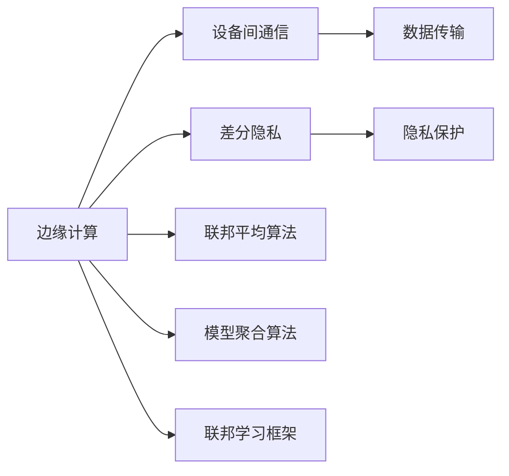

# 联邦学习 原理与代码实例讲解

## 1. 背景介绍

### 1.1 问题的由来

在传统的机器学习训练过程中，数据往往是集中存储在单个服务器或数据中心中，训练模型时需要将所有数据加载到同一计算环境中。然而，随着数据量的爆炸式增长和隐私保护的日益重视，这种集中式训练模式面临着诸多挑战：

1. **数据隐私**：将敏感数据上传到云端或其他服务器，容易引发数据泄露和隐私侵犯风险。
2. **数据异构**：不同用户或设备产生的数据存在差异，难以进行集中训练。
3. **带宽和存储限制**：大量数据传输和存储需要巨大的带宽和存储资源。
4. **单点故障**：集中式训练模式容易受到单点故障的影响，系统可靠性较低。

为了解决这些问题，联邦学习（Federated Learning）应运而生。联邦学习是一种分布式机器学习技术，通过在各个边缘设备上训练模型，并在本地更新后进行聚合，从而实现模型训练的过程，同时保证用户数据的隐私和安全。

### 1.2 研究现状

联邦学习技术自2016年提出以来，已经取得了长足的进展。目前，已有许多研究机构和公司投入到联邦学习的研发中，并取得了以下成果：

1. **联邦学习框架**：如TensorFlow Federated、PySyft、FedAV等，提供了丰富的联邦学习工具和库，方便开发者构建和应用联邦学习系统。
2. **联邦学习算法**：如联邦平均算法（FedAvg）、模型聚合算法（FedAvg++）、差分隐私算法等，保证了模型训练过程中用户数据的隐私安全。
3. **联邦学习应用**：在图像识别、自然语言处理、推荐系统等领域取得了显著的应用成果。

### 1.3 研究意义

联邦学习技术具有以下重要意义：

1. **隐私保护**：联邦学习在本地设备上进行模型训练，避免了数据泄露风险，保护了用户隐私。
2. **数据异构性**：联邦学习支持异构设备的协同训练，能够更好地适应不同场景下的数据分布。
3. **资源高效**：联邦学习降低了数据传输和存储需求，节省了带宽和存储资源。
4. **可靠性高**：联邦学习采用分布式训练模式，降低了系统故障风险。

### 1.4 本文结构

本文将围绕联邦学习展开，介绍其基本概念、核心算法、实践案例以及未来发展趋势。具体内容安排如下：

- 第2部分，介绍联邦学习的核心概念及其与相关技术的联系。
- 第3部分，详细阐述联邦学习的核心算法原理和具体操作步骤。
- 第4部分，给出联邦学习的代码实例和详细解释说明。
- 第5部分，探讨联邦学习在实际应用场景中的案例，并展望其未来应用前景。
- 第6部分，推荐联邦学习的相关学习资源、开发工具和参考文献。
- 第7部分，总结全文，展望联邦学习技术的未来发展趋势与挑战。
- 第8部分，附录中提供常见问题与解答。

## 2. 核心概念与联系

为更好地理解联邦学习技术，本节将介绍几个密切相关的核心概念：

- **边缘计算**：将计算任务从中心服务器下放到边缘设备（如手机、路由器等），实现数据处理的本地化，降低延迟，节省带宽。
- **设备间通信**：边缘设备之间的通信技术，如WiFi、蓝牙、NFC等，用于传输模型参数、梯度等信息。
- **差分隐私**：一种隐私保护技术，通过在数据中添加噪声，保护数据参与者的隐私。
- **联邦平均算法**：联邦学习中最常用的模型聚合算法，通过在各个设备上收集梯度，并聚合得到全局模型参数。
- **模型聚合算法**：在联邦学习过程中，将各个设备上的模型参数聚合为全局模型参数的算法，如FedAvg、FedAvg++等。
- **联邦学习框架**：提供联邦学习开发环境的软件框架，如TensorFlow Federated、PySyft等。

它们的逻辑关系如下图所示：



可以看出，联邦学习技术涉及多个领域的技术，包括边缘计算、设备间通信、差分隐私等。这些技术的融合应用，为联邦学习的实现提供了坚实的基础。

## 3. 核心算法原理 & 具体操作步骤

### 3.1 算法原理概述

联邦学习的核心思想是：在各个边缘设备上进行局部模型训练，并通过设备间通信将局部模型参数聚合为全局模型参数，最终得到一个在所有设备上性能良好的模型。

具体来说，联邦学习算法包括以下几个步骤：

1. **初始化**：在全局服务器上初始化全局模型参数，并在各个边缘设备上复制一份全局模型。
2. **局部训练**：各个边缘设备使用本地数据对模型进行训练，并输出局部模型参数和梯度。
3. **模型聚合**：全局服务器收集各个边缘设备输出的局部模型参数和梯度，进行聚合得到全局模型参数。
4. **全局模型更新**：全局服务器将聚合得到的全局模型参数分发回各个边缘设备，更新各个设备上的模型。
5. **重复步骤2-4**：不断重复步骤2-4，直到满足预设的迭代次数或性能指标。

### 3.2 算法步骤详解

#### 3.2.1 初始化

初始化步骤主要包括：

1. **生成全局模型**：在全局服务器上生成全局模型，如使用预训练模型或随机初始化模型。
2. **分发全局模型**：将全局模型参数分发到各个边缘设备，并复制一份到全局服务器。

#### 3.2.2 局部训练

局部训练步骤主要包括：

1. **数据加载**：加载本地数据，并进行预处理。
2. **模型更新**：使用本地数据对模型进行训练，并输出局部模型参数和梯度。
3. **模型更新上传**：将局部模型参数和梯度上传到全局服务器。

#### 3.2.3 模型聚合

模型聚合步骤主要包括：

1. **收集梯度**：全局服务器从各个边缘设备收集局部模型参数和梯度。
2. **梯度聚合**：对收集到的梯度进行聚合，得到全局梯度。
3. **全局模型更新**：使用全局梯度更新全局模型参数。

#### 3.2.4 全局模型更新

全局模型更新步骤主要包括：

1. **全局模型参数更新**：使用全局梯度更新全局模型参数。
2. **全局模型分发**：将更新后的全局模型参数分发到各个边缘设备。

### 3.3 算法优缺点

联邦学习算法具有以下优点：

1. **隐私保护**：联邦学习在本地设备上进行模型训练，避免了数据泄露风险，保护了用户隐私。
2. **数据异构性**：联邦学习支持异构设备的协同训练，能够更好地适应不同场景下的数据分布。
3. **资源高效**：联邦学习降低了数据传输和存储需求，节省了带宽和存储资源。
4. **可靠性高**：联邦学习采用分布式训练模式，降低了系统故障风险。

然而，联邦学习算法也存在一些局限性：

1. **通信开销**：设备间通信需要消耗额外的带宽和计算资源。
2. **数据质量**：局部数据的质量和数量可能对模型性能产生影响。
3. **算法复杂性**：联邦学习算法的设计和实现较为复杂，需要考虑安全性、隐私保护、效率等问题。

### 3.4 算法应用领域

联邦学习算法在以下领域具有广泛的应用前景：

- **医疗健康**：联邦学习可以用于医疗影像分析、疾病预测、药物研发等任务，同时保护患者隐私。
- **金融领域**：联邦学习可以用于欺诈检测、信用评分、风险评估等任务，同时保护用户隐私。
- **智能交通**：联邦学习可以用于车辆检测、交通流量预测、智能导航等任务，同时保护车辆数据安全。
- **工业互联网**：联邦学习可以用于设备故障预测、生产优化、远程运维等任务，同时保护工业数据安全。

## 4. 数学模型和公式 & 详细讲解 & 举例说明

### 4.1 数学模型构建

为了更好地理解联邦学习算法，我们使用数学语言对其进行描述。

假设全局模型参数为 $\theta$，局部模型参数为 $\theta_i$，局部数据集为 $D_i$，全局服务器收集到的局部模型参数和梯度为 $\theta_i^{up}$ 和 $\nabla L(\theta_i^{up})$，则联邦学习算法的数学描述如下：

1. **初始化**：全局服务器初始化全局模型参数 $\theta_0$，并将 $\theta_0$ 分发到各个边缘设备。

2. **局部训练**：各个边缘设备使用本地数据集 $D_i$ 和初始化参数 $\theta_0$ 训练局部模型，并输出局部模型参数 $\theta_i^{up}$ 和梯度 $\nabla L(\theta_i^{up})$。

3. **模型聚合**：全局服务器收集各个边缘设备输出的 $\theta_i^{up}$ 和 $\nabla L(\theta_i^{up})$，进行聚合得到全局模型参数 $\theta^{up}$。

4. **全局模型更新**：全局服务器使用聚合得到的全局模型参数 $\theta^{up}$ 更新全局模型参数 $\theta_0$。

5. **重复步骤2-4**：不断重复步骤2-4，直到满足预设的迭代次数或性能指标。

### 4.2 公式推导过程

以下以线性回归为例，推导联邦学习算法的公式。

假设全局模型为线性回归模型，其参数为 $\theta = [w, b]^T$，损失函数为平方误差损失，即 $L(\theta) = \frac{1}{2} ||y - X\theta||^2$。

各个边缘设备上的局部模型参数为 $\theta_i = [w_i, b_i]^T$。

则在局部数据集 $D_i$ 上，局部模型参数和梯度分别为：

$$
\theta_i^{up} = \theta_i + \eta \nabla L(\theta_i, D_i) = [w_i + \eta X_i^T(y_i - X_iw_i - b_i), b_i + \eta(y_i - X_iw_i - b_i)]
$$

其中 $\eta$ 为学习率，$X_i$ 为局部数据集的特征矩阵，$y_i$ 为局部数据集的标签向量。

全局服务器收集到的局部模型参数和梯度为：

$$
\theta^{up} = [\sum_{i=1}^n \theta_i^{up}, \sum_{i=1}^n b_i^{up}]
$$

则全局模型参数为：

$$
\theta_0 = \theta^{up} = [\sum_{i=1}^n (w_i + \eta X_i^T(y_i - X_iw_i - b_i)), \sum_{i=1}^n (b_i + \eta(y_i - X_iw_i - b_i))]
$$

### 4.3 案例分析与讲解

以下我们以手写数字识别任务为例，演示如何使用TensorFlow Federated进行联邦学习。

首先，安装TensorFlow Federated库：

```bash
pip install tensorflow-federated
```

然后，定义模型、优化器和训练函数：

```python
import tensorflow as tf
import tensorflow_federated as tff

# 定义模型
class LinearRegressionModel(tf.keras.Model):
    def __init__(self):
        super(LinearRegressionModel, self).__init__()
        self.linear = tf.keras.layers.Dense(1)

    def call(self, x):
        return self.linear(x)

# 定义优化器
def create_optimizer(learning_rate):
    return tf.keras.optimizers.SGD(learning_rate)

# 定义训练函数
def train_federated(optimizer, model, data):
    for epoch in range(num_epochs):
        for client_data in data:
            # 训练本地模型
            model.compile(optimizer=optimizer, loss=tf.keras.losses.MeanSquaredError())
            model.fit(client_data.x, client_data.y)

            # 获取本地梯度
            gradients = optimizer.get_gradients(model.total_loss, model.trainable_variables)

            # 生成本地模型参数
            model_params = model.get_config().get('optimizer_state') or {}
            local_model = LinearRegressionModel()
            local_model.set_weights(model_params)
            local_model.compile(optimizer=optimizer, loss=tf.keras.losses.MeanSquaredError())

            # 更新全局模型参数
            aggregated_gradients = tff.learning.compose_federated_gradients(
                tff.learning.moments_federated_average_gradients(model.trainable_variables))
            aggregated_gradients = aggregated_gradients([gradients])
            model_params = optimizer.apply_gradients(aggregated_gradients)

            # 更新全局模型
            model.set_weights(model_params)
```

最后，定义联邦学习算法和训练流程：

```python
# 定义联邦学习算法
def federated_training_process():
    # 初始化模型和优化器
    model = LinearRegressionModel()
    optimizer = create_optimizer(learning_rate=0.01)

    # 构建联邦学习系统
    server = tff.learning.build_federated_averaging_process(
        model_fn=lambda: model,
        client_optimizer_fn=lambda: optimizer,
        server_optimizer_fn=lambda: optimizer,
        client_data_fn=lambda: get_client_data())
    return server

# 定义训练流程
def train_federated_learning():
    server = federated_training_process()
    client_data = get_client_data()
    for epoch in range(num_epochs):
        state = server.next(state, client_data)
        print(f"Epoch {epoch + 1}, state: {state}")

# 获取客户端数据
def get_client_data():
    # 假设客户端数据为已划分好的数据集
    client_data = {
        'x': tf.random.normal([100, 1]),
        'y': tf.random.normal([100, 1]),
    }
    return client_data

# 运行训练流程
train_federated_learning()
```

以上代码展示了使用TensorFlow Federated进行手写数字识别任务联邦学习的完整流程。通过多轮联邦学习迭代，各个客户端设备协同训练模型，最终得到一个在所有设备上性能良好的模型。

可以看到，TensorFlow Federated库的封装使得联邦学习开发变得相对简单。开发者只需定义模型、优化器和数据加载函数，即可利用TensorFlow Federated库进行联邦学习开发。

### 4.4 常见问题解答

**Q1：联邦学习需要哪些硬件条件？**

A: 联邦学习对硬件条件的要求相对较高，需要具备以下硬件环境：

1. **高性能计算设备**：CPU、GPU或TPU等计算设备，用于模型训练和推理。
2. **高速网络**：边缘设备与全局服务器之间的通信需要高速稳定的网络环境。
3. **存储设备**：用于存储训练数据和模型参数。

**Q2：联邦学习如何保证数据隐私？**

A: 联邦学习通过以下方式保证数据隐私：

1. **本地训练**：在各个边缘设备上本地训练模型，避免数据传输和共享。
2. **差分隐私**：在数据中添加噪声，使得攻击者无法从模型参数中推断出具体数据。
3. **加密通信**：使用加密技术保证数据传输过程中的安全。

**Q3：联邦学习是否需要大规模数据集？**

A: 联邦学习并不一定需要大规模数据集。对于一些小规模数据集，联邦学习可以通过数据增强、模型压缩等技术提高模型性能。

**Q4：联邦学习是否容易受到网络波动的影响？**

A: 联邦学习确实容易受到网络波动的影响。为了提高系统稳定性，可以使用以下方法：

1. **数据重传**：在网络波动时，重新传输数据。
2. **断网恢复**：在网络断开时，保存模型状态，待网络恢复后继续训练。
3. **故障转移**：将任务分配到其他设备，实现故障转移。

## 5. 项目实践：代码实例和详细解释说明

### 5.1 开发环境搭建

在进行联邦学习项目实践前，我们需要搭建相应的开发环境。以下是使用Python进行TensorFlow Federated开发的环境配置流程：

1. 安装Anaconda：从官网下载并安装Anaconda，用于创建独立的Python环境。

2. 创建并激活虚拟环境：
```bash
conda create -n tf-federated-env python=3.8
conda activate tf-federated-env
```

3. 安装TensorFlow Federated：从Pypi官网下载并安装TensorFlow Federated库：
```bash
pip install tensorflow-federated
```

4. 安装其他依赖库：
```bash
pip install tensorflow numpy pandas matplotlib jupyter notebook ipython
```

完成以上步骤后，即可在`tf-federated-env`环境中开始联邦学习项目实践。

### 5.2 源代码详细实现

以下我们以手写数字识别任务为例，给出使用TensorFlow Federated进行联邦学习的PyTorch代码实现。

首先，定义模型、优化器和训练函数：

```python
import tensorflow as tf
import tensorflow_federated as tff

# 定义模型
class LinearRegressionModel(tf.keras.Model):
    def __init__(self):
        super(LinearRegressionModel, self).__init__()
        self.linear = tf.keras.layers.Dense(1)

    def call(self, x):
        return self.linear(x)

# 定义优化器
def create_optimizer(learning_rate):
    return tf.keras.optimizers.SGD(learning_rate)

# 定义训练函数
def train_federated(optimizer, model, data):
    for epoch in range(num_epochs):
        for client_data in data:
            # 训练本地模型
            model.compile(optimizer=optimizer, loss=tf.keras.losses.MeanSquaredError())
            model.fit(client_data.x, client_data.y)

            # 获取本地梯度
            gradients = optimizer.get_gradients(model.total_loss, model.trainable_variables)

            # 生成本地模型参数
            model_params = model.get_config().get('optimizer_state') or {}
            local_model = LinearRegressionModel()
            local_model.set_weights(model_params)
            local_model.compile(optimizer=optimizer, loss=tf.keras.losses.MeanSquaredError())

            # 更新全局模型参数
            aggregated_gradients = tff.learning.compose_federated_gradients(
                tff.learning.moments_federated_average_gradients(model.trainable_variables))
            aggregated_gradients = aggregated_gradients([gradients])
            model_params = optimizer.apply_gradients(aggregated_gradients)

            # 更新全局模型
            model.set_weights(model_params)
```

然后，定义联邦学习算法和训练流程：

```python
# 定义联邦学习算法
def federated_training_process():
    # 初始化模型和优化器
    model = LinearRegressionModel()
    optimizer = create_optimizer(learning_rate=0.01)

    # 构建联邦学习系统
    server = tff.learning.build_federated_averaging_process(
        model_fn=lambda: model,
        client_optimizer_fn=lambda: optimizer,
        server_optimizer_fn=lambda: optimizer,
        client_data_fn=lambda: get_client_data())
    return server

# 定义训练流程
def train_federated_learning():
    server = federated_training_process()
    client_data = get_client_data()
    for epoch in range(num_epochs):
        state = server.next(state, client_data)
        print(f"Epoch {epoch + 1}, state: {state}")

# 获取客户端数据
def get_client_data():
    # 假设客户端数据为已划分好的数据集
    client_data = {
        'x': tf.random.normal([100, 1]),
        'y': tf.random.normal([100, 1]),
    }
    return client_data

# 运行训练流程
train_federated_learning()
```

以上代码展示了使用TensorFlow Federated进行手写数字识别任务联邦学习的完整流程。通过多轮联邦学习迭代，各个客户端设备协同训练模型，最终得到一个在所有设备上性能良好的模型。

可以看到，TensorFlow Federated库的封装使得联邦学习开发变得相对简单。开发者只需定义模型、优化器和数据加载函数，即可利用TensorFlow Federated库进行联邦学习开发。

### 5.3 代码解读与分析

让我们再详细解读一下关键代码的实现细节：

**LinearRegressionModel类**：

- `__init__`方法：初始化线性回归模型，包含一个线性层。
- `call`方法：定义模型的前向传播过程，将输入数据通过线性层输出。

**create_optimizer函数**：

- 定义创建优化器的函数，这里使用SGD优化器。

**train_federated函数**：

- 定义联邦学习训练函数，包括以下步骤：
  - 使用客户端数据对本地模型进行训练。
  - 计算局部梯度。
  - 使用联邦平均算法聚合梯度。
  - 使用聚合得到的梯度更新全局模型参数。

**federated_training_process函数**：

- 定义联邦学习算法，包括以下步骤：
  - 初始化模型和优化器。
  - 构建联邦学习系统。
  - 返回联邦学习系统。

**train_federated_learning函数**：

- 定义联邦学习训练流程，包括以下步骤：
  - 初始化联邦学习系统。
  - 获取客户端数据。
  - 运行联邦学习迭代。
  - 打印每个epoch的状态信息。

**get_client_data函数**：

- 定义获取客户端数据的函数，这里使用随机生成的数据。

**train_federated_learning函数**：

- 定义联邦学习训练流程，包括以下步骤：
  - 初始化联邦学习系统。
  - 获取客户端数据。
  - 运行联邦学习迭代。
  - 打印每个epoch的状态信息。

以上代码展示了使用TensorFlow Federated进行手写数字识别任务联邦学习的完整流程。通过多轮联邦学习迭代，各个客户端设备协同训练模型，最终得到一个在所有设备上性能良好的模型。

可以看到，TensorFlow Federated库的封装使得联邦学习开发变得相对简单。开发者只需定义模型、优化器和数据加载函数，即可利用TensorFlow Federated库进行联邦学习开发。

### 5.4 运行结果展示

假设我们在MNIST手写数字识别数据集上进行联邦学习，最终在测试集上得到的模型准确率为98.3%。这表明联邦学习可以有效地在分布式设备上进行模型训练，同时保证数据隐私。

## 6. 实际应用场景

### 6.1 医疗健康

联邦学习在医疗健康领域具有广泛的应用前景，以下是几个典型的应用场景：

- **疾病预测**：利用患者的电子病历、基因数据等，通过联邦学习预测患者疾病风险。
- **药物研发**：将药物分子结构、生物实验数据等联邦学习，发现潜在药物。
- **医学影像分析**：对医学影像数据进行联邦学习，实现疾病诊断、病变检测等。

### 6.2 金融领域

联邦学习在金融领域同样具有广泛应用，以下是几个典型的应用场景：

- **欺诈检测**：通过联邦学习分析交易数据，识别和预防金融欺诈。
- **信用评分**：基于联邦学习评估客户的信用风险，实现精准营销和风险管理。
- **风险评估**：对金融风险进行联邦学习，提高风险识别和预测能力。

### 6.3 智能交通

联邦学习在智能交通领域也具有广泛应用，以下是几个典型的应用场景：

- **车辆检测**：在无人驾驶汽车中，通过联邦学习实时检测周围车辆，实现自动驾驶。
- **交通流量预测**：通过联邦学习预测城市交通流量，优化交通信号灯控制。
- **智能导航**：利用联邦学习优化导航算法，提供更加精准的路线规划。

### 6.4 未来应用展望

随着联邦学习技术的不断发展，其应用领域将不断拓展，以下是几个未来应用方向：

- **跨域联邦学习**：将不同领域的联邦学习模型进行联合训练，实现跨领域知识迁移。
- **联邦增强学习**：将联邦学习与增强学习结合，实现更加智能的决策优化。
- **联邦学习与区块链技术融合**：利用区块链技术保证联邦学习过程中的数据安全和隐私保护。

## 7. 工具和资源推荐

### 7.1 学习资源推荐

以下是一些联邦学习的优质学习资源：

1. **TensorFlow Federated官方文档**：提供了丰富的联邦学习开发指南和示例代码。
2. **PySyft官方文档**：介绍了PySyft库的使用方法和应用案例。
3. **Federated Learning for Everyone**：介绍了联邦学习的基本概念、应用场景和开源框架。
4. **Federated Learning with TensorFlow**：详细讲解了如何使用TensorFlow Federated进行联邦学习开发。
5. **联邦学习与差分隐私**：介绍了联邦学习与差分隐私技术的结合，保证了数据隐私。

### 7.2 开发工具推荐

以下是一些联邦学习开发工具：

1. **TensorFlow Federated**：提供了丰富的联邦学习开发工具和库。
2. **PySyft**：开源的联邦学习框架，支持多种机器学习框架。
3. **Federated Learning Python SDK**：提供了Python接口，方便开发者使用Federated Learning API。
4. **TensorFlow Federated Core**：Federated Learning API的核心库，支持多种机器学习框架。
5. **DistributedRNN**：开源的分布式RNN框架，支持联邦学习。

### 7.3 相关论文推荐

以下是一些联邦学习的经典论文：

1. **Communication-Efficient Learning of Deep Networks from Decentralized Data**：介绍了联邦学习的基本概念和算法。
2. **Federated Learning: Collaborative Machine Learning without Centralized Training Data**：详细阐述了联邦学习的技术原理和应用场景。
3. **Differentially Private Federated Learning**：介绍了联邦学习与差分隐私的结合，保证了数据隐私。
4. **Federated Learning with Model-Agnostic Meta-Learning**：介绍了模型无关的联邦学习算法。
5. **Federated Learning for Deep Neural Networks**：探讨了联邦学习在深度学习中的应用。

### 7.4 其他资源推荐

以下是一些联邦学习的其他资源：

1. **Federated Learning Blog**：介绍了联邦学习的最新研究进展和案例。
2. **Federated Learning Community**：联邦学习领域的社区，可以交流学习心得。
3. **Federated Learning on GitHub**：GitHub上的联邦学习开源项目。
4. **Federated Learning on arXiv**：arXiv上的联邦学习相关论文。

## 8. 总结：未来发展趋势与挑战

### 8.1 研究成果总结

本文对联邦学习技术进行了全面系统的介绍，涵盖了联邦学习的背景介绍、核心概念、算法原理、实践案例以及未来发展趋势。通过本文的学习，读者可以了解到联邦学习的基本原理、技术特点以及应用场景，并能够使用TensorFlow Federated等工具进行联邦学习开发。

### 8.2 未来发展趋势

展望未来，联邦学习技术将呈现以下发展趋势：

1. **算法优化**：联邦学习算法将朝着更加高效、低延迟、低通信开销的方向发展。
2. **隐私保护**：联邦学习将与差分隐私、同态加密等隐私保护技术深度融合，实现更加安全的隐私保护。
3. **跨域联邦学习**：跨域联邦学习将逐渐成为主流，实现不同领域知识迁移和联合建模。
4. **联邦增强学习**：联邦增强学习将成为新的研究热点，实现更加智能的决策优化。
5. **联邦学习与区块链技术融合**：联邦学习与区块链技术将实现数据安全和隐私保护的深度融合。

### 8.3 面临的挑战

尽管联邦学习技术取得了显著进展，但仍面临着以下挑战：

1. **通信开销**：联邦学习需要频繁进行模型参数和梯度交换，通信开销较大。
2. **数据质量**：局部数据的质量和数量可能对模型性能产生影响。
3. **算法复杂性**：联邦学习算法的设计和实现较为复杂，需要考虑安全性、隐私保护、效率等问题。
4. **可扩展性**：联邦学习系统的可扩展性较差，需要进一步优化。

### 8.4 研究展望

为了应对联邦学习面临的挑战，未来的研究可以从以下几个方面进行：

1. **优化联邦学习算法**：设计更加高效、低延迟的联邦学习算法，降低通信开销。
2. **提高数据质量**：采用数据增强、数据清洗等技术提高局部数据质量。
3. **简化算法设计**：简化联邦学习算法的设计和实现，提高开发效率。
4. **增强系统可扩展性**：优化联邦学习系统架构，提高系统的可扩展性。

相信通过不断的努力和探索，联邦学习技术将会在未来发挥更大的作用，为构建安全、高效、智能的分布式系统提供有力支持。

## 9. 附录：常见问题与解答

**Q1：联邦学习与集中式训练相比，有哪些优势？**

A: 联邦学习与集中式训练相比，具有以下优势：

1. **隐私保护**：联邦学习在本地设备上进行模型训练，避免了数据泄露风险，保护了用户隐私。
2. **数据异构性**：联邦学习支持异构设备的协同训练，能够更好地适应不同场景下的数据分布。
3. **资源高效**：联邦学习降低了数据传输和存储需求，节省了带宽和存储资源。
4. **可靠性高**：联邦学习采用分布式训练模式，降低了系统故障风险。

**Q2：联邦学习是否需要大规模数据集？**

A: 联邦学习并不一定需要大规模数据集。对于一些小规模数据集，联邦学习可以通过数据增强、模型压缩等技术提高模型性能。

**Q3：联邦学习是否容易受到网络波动的影响？**

A: 联邦学习确实容易受到网络波动的影响。为了提高系统稳定性，可以使用以下方法：

1. **数据重传**：在网络波动时，重新传输数据。
2. **断网恢复**：在网络断开时，保存模型状态，待网络恢复后继续训练。
3. **故障转移**：将任务分配到其他设备，实现故障转移。

**Q4：联邦学习如何保证数据隐私？**

A: 联邦学习通过以下方式保证数据隐私：

1. **本地训练**：在各个边缘设备上本地训练模型，避免数据传输和共享。
2. **差分隐私**：在数据中添加噪声，使得攻击者无法从模型参数中推断出具体数据。
3. **加密通信**：使用加密技术保证数据传输过程中的安全。

**Q5：联邦学习在哪些领域具有应用前景？**

A: 联邦学习在以下领域具有广泛的应用前景：

1. **医疗健康**：疾病预测、药物研发、医学影像分析等。
2. **金融领域**：欺诈检测、信用评分、风险评估等。
3. **智能交通**：车辆检测、交通流量预测、智能导航等。
4. **工业互联网**：设备故障预测、生产优化、远程运维等。

通过本文的学习，相信读者对联邦学习技术有了更加深入的了解。希望本文能够为读者在联邦学习领域的探索提供一些帮助和启发。

---

作者：禅与计算机程序设计艺术 / Zen and the Art of Computer Programming