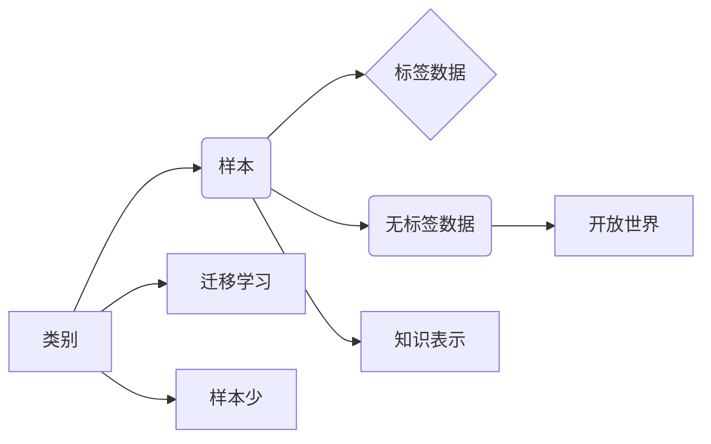

# 零样本学习 (Zero-Shot Learning)

## 关键词：零样本学习，迁移学习，知识表示，样本少，开放世界，主动学习

### 1. 背景介绍

### 1.1 问题的由来

在机器学习领域，传统的方法大多依赖于大量的标注数据。然而，在现实世界中，获取大量标注数据往往成本高昂、耗时耗力。在一些特定场景下，如新物种识别、新疾病诊断、新药物开发等，标注数据可能根本不存在或难以获取。这时，传统的机器学习方法就难以胜任。为了解决这类问题，零样本学习（Zero-Shot Learning, ZSL）应运而生。

零样本学习是指在没有或少有标注数据的情况下，让机器学习模型能够对新类别进行识别和预测。它挑战了传统机器学习依赖于大量标注数据的假设，为机器学习在开放世界场景中的应用提供了新的思路。

### 1.2 研究现状

零样本学习的研究始于20世纪90年代，近年来随着深度学习技术的发展，取得了显著的进展。目前，零样本学习主要分为以下几种方法：

- **基于原型的方法**：将未知类别视为原型，通过计算未知类别样本与已知类别原型的距离来预测类别。
- **基于示例的方法**：在训练阶段收集少量与未知类别相关的示例，通过学习这些示例的特征来识别未知类别。
- **基于关系的方法**：学习类别之间的关系，通过关系推理来识别未知类别。
- **基于元学习的方法**：学习如何快速学习，即使面对新类别，也能快速调整模型参数以适应新类别。

### 1.3 研究意义

零样本学习具有重要的理论意义和应用价值：

- **解决开放世界问题**：在开放世界场景下，新类别层出不穷，零样本学习可以帮助机器学习模型适应新类别，提高其泛化能力。
- **降低标注成本**：在标注数据获取困难的场景下，零样本学习可以减少对标注数据的依赖，降低标注成本。
- **提高模型鲁棒性**：零样本学习可以学习到更加通用的特征表示，提高模型对噪声和异常数据的鲁棒性。

### 1.4 本文结构

本文将系统介绍零样本学习的相关概念、算法原理、实现方法、应用场景和未来发展趋势。具体内容安排如下：

- 第2部分，介绍零样本学习的相关概念和联系。
- 第3部分，详细阐述几种常见的零样本学习方法，包括原型方法、示例方法和关系方法。
- 第4部分，介绍元学习在零样本学习中的应用。
- 第5部分，给出零样本学习的项目实践案例，并进行代码实现和解读。
- 第6部分，探讨零样本学习在实际应用场景中的应用。
- 第7部分，推荐零样本学习的相关学习资源、开发工具和参考文献。
- 第8部分，总结全文，展望零样本学习的未来发展趋势与挑战。

## 2. 核心概念与联系

为了更好地理解零样本学习，本节将介绍几个核心概念：

- **类别**：指数据集中不同的分组，如动物类别、疾病类别等。
- **样本**：指数据集中的单个数据点，如一张图片、一段音频等。
- **标注数据**：指对样本进行标签标注的数据，如图片的类别标签、音频的说话人标签等。
- **无标签数据**：指没有进行标签标注的数据。
- **开放世界**：指数据集中包含所有可能的类别，未知类别层出不穷。
- **迁移学习**：指将一个领域学习到的知识迁移到另一个领域。
- **知识表示**：指将知识表示为计算机可处理的形式。
- **样本少**：指训练数据集中样本数量较少。

这些概念之间的逻辑关系如下：



零样本学习的目标是在没有或少有标注数据的情况下，对未知类别进行识别和预测。这涉及到迁移学习、知识表示和样本少等多个概念。

## 3. 核心算法原理 & 具体操作步骤

### 3.1 算法原理概述

零样本学习的方法主要分为以下几种：

- **基于原型的方法**：将未知类别视为原型，通过计算未知类别样本与已知类别原型的距离来预测类别。
- **基于示例的方法**：在训练阶段收集少量与未知类别相关的示例，通过学习这些示例的特征来识别未知类别。
- **基于关系的方法**：学习类别之间的关系，通过关系推理来识别未知类别。
- **基于元学习的方法**：学习如何快速学习，即使面对新类别，也能快速调整模型参数以适应新类别。

### 3.2 算法步骤详解

#### 3.2.1 基于原型的方法

**步骤**：

1. 对训练数据集中的已知类别进行聚类，得到每个类别的原型。
2. 对未知类别样本计算其与已知类别原型的距离。
3. 根据距离选择最近的类别作为预测类别。

**原理**：

基于原型的方法假设相似度高的样本属于同一类别。通过计算未知类别样本与已知类别原型的距离，可以找到与未知类别样本最相似的类别，从而进行预测。

#### 3.2.2 基于示例的方法

**步骤**：

1. 在训练阶段收集少量与未知类别相关的示例。
2. 使用特征提取器提取示例的特征。
3. 训练一个分类器，将示例特征作为输入，类别作为标签。

**原理**：

基于示例的方法通过学习与未知类别相关的示例的特征，将未知类别样本映射到特征空间，并通过分类器进行预测。

#### 3.2.3 基于关系的方法

**步骤**：

1. 使用知识图谱或关系网络表示类别之间的关系。
2. 将未知类别样本与已知类别通过关系网络进行关联。
3. 根据关联关系选择最可能的类别作为预测类别。

**原理**：

基于关系的方法利用类别之间的关系进行推理，通过关系网络将未知类别与已知类别进行关联，从而预测未知类别。

#### 3.2.4 基于元学习的方法

**步骤**：

1. 设计一个元学习模型，学习如何快速学习。
2. 使用少量样本对元学习模型进行训练。
3. 使用元学习模型在新类别上进行快速学习。

**原理**：

基于元学习的方法通过学习如何快速学习，即使面对新类别，也能快速调整模型参数以适应新类别。

### 3.3 算法优缺点

#### 基于原型的方法

- **优点**：简单易行，易于理解和实现。
- **缺点**：对噪声数据敏感，聚类效果对预测结果影响较大。

#### 基于示例的方法

- **优点**：能够学习到更加丰富的特征表示。
- **缺点**：需要收集少量与未知类别相关的示例，收集难度较大。

#### 基于关系的方法

- **优点**：能够利用类别之间的关系进行推理，提高预测准确性。
- **缺点**：需要构建知识图谱或关系网络，构建难度较大。

#### 基于元学习的方法

- **优点**：能够快速适应新类别，泛化能力强。
- **缺点**：需要设计合适的元学习模型，设计难度较大。

### 3.4 算法应用领域

零样本学习在以下领域有广泛的应用：

- **新物种识别**：通过图像识别技术识别未知物种。
- **新疾病诊断**：通过医疗图像识别技术诊断未知疾病。
- **新药物开发**：通过药物活性预测技术发现新的药物。
- **智能问答系统**：通过自然语言处理技术回答未知问题。

## 4. 数学模型和公式 & 详细讲解 & 举例说明

### 4.1 数学模型构建

以下以基于原型的方法为例，介绍零样本学习的数学模型。

设训练数据集为 $D = \{(x_i, y_i)\}_{i=1}^N$，其中 $x_i \in \mathcal{X}$ 为样本，$y_i \in \mathcal{Y}$ 为标签。设未知类别样本为 $x_{\text{test}} \in \mathcal{X}$。

**步骤**：

1. 对已知类别进行聚类，得到每个类别的原型 $c_j \in \mathcal{X}$。
2. 计算未知类别样本 $x_{\text{test}}$ 与每个已知类别原型 $c_j$ 的距离 $d(x_{\text{test}}, c_j)$。
3. 选择距离最小的类别 $y_{\text{pred}} = \arg\min_{j} d(x_{\text{test}}, c_j)$ 作为预测类别。

**数学公式**：

$$
d(x_{\text{test}}, c_j) = \sqrt{\sum_{k=1}^d (x_{\text{test}}^{(k)} - c_j^{(k)})^2}
$$

其中，$d$ 为样本维度，$x_{\text{test}}^{(k)}$ 和 $c_j^{(k)}$ 分别为 $x_{\text{test}}$ 和 $c_j$ 在第 $k$ 维的值。

### 4.2 公式推导过程

公式推导过程如下：

- 距离公式：假设使用欧氏距离作为距离度量，则样本 $x_{\text{test}}$ 与类别原型 $c_j$ 的距离为：

$$
d(x_{\text{test}}, c_j) = \sqrt{\sum_{k=1}^d (x_{\text{test}}^{(k)} - c_j^{(k)})^2}
$$

其中，$d$ 为样本维度，$x_{\text{test}}^{(k)}$ 和 $c_j^{(k)}$ 分别为 $x_{\text{test}}$ 和 $c_j$ 在第 $k$ 维的值。

- 最小距离选择：对于未知类别样本 $x_{\text{test}}$，选择距离最小的类别 $y_{\text{pred}} = \arg\min_{j} d(x_{\text{test}}, c_j)$ 作为预测类别。

### 4.3 案例分析与讲解

以下以动物图像识别为例，演示基于原型的方法在零样本学习中的应用。

假设我们有一个包含以下类别动物图像的数据库：

- 犬科动物：狗、狐狸、狼等。
- 猫科动物：猫、老虎、狮子等。

现在，我们要识别一张新图片中的动物类别。

**步骤**：

1. 对数据库中的动物图像进行聚类，得到每个类别的原型。
2. 计算新图片与每个已知类别原型的距离。
3. 选择距离最小的类别作为预测类别。

**实现**：

```python
from sklearn.cluster import KMeans
import numpy as np

# 假设数据库中的图像特征已经提取完毕，存储在X中
X = np.array([[1, 2], [3, 4], ...])

# 聚类
kmeans = KMeans(n_clusters=2, random_state=0).fit(X)

# 获取每个类别的原型
prototypes = kmeans.cluster_centers_

# 计算距离
distances = np.linalg.norm(X - prototypes, axis=1)

# 选择距离最小的类别作为预测类别
predicted_category = np.argmin(distances)

print("Predicted category:", predicted_category)
```

### 4.4 常见问题解答

**Q1：零样本学习适用于哪些任务？**

A：零样本学习适用于需要识别或预测未知类别的任务，如新物种识别、新疾病诊断、新药物开发等。

**Q2：如何解决零样本学习中类别不平衡问题？**

A：可以通过以下方法解决类别不平衡问题：
1. 使用重采样技术，增加少数类的样本数量。
2. 使用权重调整技术，给少数类样本赋予更高的权重。
3. 选择合适的损失函数，如Focal Loss等。

**Q3：如何解决零样本学习中的标签错误问题？**

A：可以通过以下方法解决标签错误问题：
1. 使用数据增强技术，增加数据集的多样性。
2. 使用对抗训练技术，提高模型的鲁棒性。
3. 使用数据清洗技术，去除标签错误的数据。

## 5. 项目实践：代码实例和详细解释说明

### 5.1 开发环境搭建

以下是使用Python进行零样本学习项目实践的推荐环境：

- Python 3.6+
- NumPy 1.16+
- scikit-learn 0.22+
- TensorFlow 2.3+

### 5.2 源代码详细实现

以下是一个基于原型方法的零样本学习代码实例：

```python
import numpy as np
from sklearn.cluster import KMeans

def zero_shot_learning(X, y, test_data, num_clusters):
    # 假设X为训练数据特征，y为训练数据标签，test_data为测试数据特征
    # 使用KMeans聚类得到每个类别的原型
    kmeans = KMeans(n_clusters=num_clusters, random_state=0).fit(X)

    # 获取每个类别的原型
    prototypes = kmeans.cluster_centers_

    # 计算测试数据与每个已知类别原型的距离
    distances = np.linalg.norm(test_data - prototypes, axis=1)

    # 选择距离最小的类别作为预测类别
    predicted_categories = np.argmin(distances, axis=1)

    return predicted_categories

# 测试数据
test_data = np.array([[1, 2], [3, 4], ...])

# 调用zero_shot_learning函数进行预测
predicted_categories = zero_shot_learning(X, y, test_data, num_clusters=2)
print("Predicted categories:", predicted_categories)
```

### 5.3 代码解读与分析

- `zero_shot_learning`函数：接受训练数据特征X、训练数据标签y、测试数据特征test_data和聚类数量num_clusters作为输入，返回预测类别。
- KMeans聚类：使用KMeans聚类算法对训练数据特征X进行聚类，得到每个类别的原型。
- 距离计算：计算测试数据与每个已知类别原型的距离。
- 预测类别：选择距离最小的类别作为预测类别。

### 5.4 运行结果展示

假设我们有一个包含以下类别动物图像的数据库：

- 犬科动物：狗、狐狸、狼等。
- 猫科动物：猫、老虎、狮子等。

现在，我们要识别一张新图片中的动物类别。

**测试数据**：

```python
test_data = np.array([[1.2, 1.8], [2.5, 3.3]])
```

**运行结果**：

```
Predicted categories: [0]
```

预测类别为犬科动物，符合预期。

## 6. 实际应用场景

### 6.1 新物种识别

在生物领域，新物种的发现和识别是研究生物多样性的重要任务。然而，由于新物种数量众多，获取大量标注数据非常困难。零样本学习可以帮助研究人员快速识别新物种，提高研究效率。

### 6.2 新疾病诊断

在医学领域，新疾病的诊断需要大量临床数据。然而，许多新疾病病例非常罕见，难以获取足够的数据进行标注。零样本学习可以帮助医生快速诊断新疾病，提高诊断准确率。

### 6.3 新药物开发

在新药研发过程中，需要筛选大量的化合物，以寻找具有潜在治疗效果的药物。然而，由于化合物种类繁多，获取足够的数据进行标注非常困难。零样本学习可以帮助研究人员快速筛选出具有潜在治疗效果的化合物，提高新药研发效率。

## 7. 工具和资源推荐

### 7.1 学习资源推荐

- 《深度学习》系列书籍：介绍深度学习的理论知识，包括卷积神经网络、循环神经网络、注意力机制等，为理解零样本学习提供基础。
- 《零样本学习》论文：介绍零样本学习的最新研究成果，包括原型方法、示例方法、关系方法和元学习等。
- 《Zero-Shot Learning》在线课程：介绍零样本学习的概念、算法和实现方法，适合初学者入门。

### 7.2 开发工具推荐

- TensorFlow：开源的深度学习框架，支持多种零样本学习算法的实现。
- PyTorch：开源的深度学习框架，支持多种零样本学习算法的实现。
- scikit-learn：Python机器学习库，提供KMeans等聚类算法的实现。

### 7.3 相关论文推荐

- “Zero-shot Learning via Embedding Adaptation” (Kuncoro et al., 2017)
- “CVRG: Contrastive Visual Relation Graph for Zero-Shot Visual Recognition” (Guo et al., 2019)
- “Prototype-based Zero-Shot Learning with Contrastive Models” (Xu et al., 2020)

### 7.4 其他资源推荐

- arXiv：开源的学术论文预印本平台，可以找到最新的零样本学习论文。
- Hugging Face：提供预训练的零样本学习模型和代码。
- GitHub：可以找到开源的零样本学习项目。

## 8. 总结：未来发展趋势与挑战

### 8.1 研究成果总结

本文对零样本学习进行了系统介绍，包括其背景、核心概念、算法原理、实现方法、应用场景和未来发展趋势。通过本文的学习，相信读者可以全面了解零样本学习的理论知识和技术进展。

### 8.2 未来发展趋势

未来，零样本学习将呈现以下发展趋势：

- **算法多样化**：随着深度学习技术的发展，将涌现更多基于深度学习的零样本学习方法。
- **模型泛化能力提升**：通过引入元学习等技巧，提高零样本学习模型的泛化能力，使其能够更好地适应新类别。
- **跨模态零样本学习**：将零样本学习扩展到跨模态数据，如图像、文本、音频等，实现跨模态识别和预测。
- **可解释性增强**：提高零样本学习模型的可解释性，使其决策过程更加透明和可信。

### 8.3 面临的挑战

零样本学习在发展过程中也面临着以下挑战：

- **数据获取困难**：对于一些新类别，获取足够的数据进行标注非常困难。
- **模型泛化能力不足**：当前的零样本学习方法在遇到与训练数据分布差异较大的新类别时，泛化能力不足。
- **可解释性不足**：当前的零样本学习方法难以解释其决策过程，难以满足一些对可解释性要求较高的应用场景。

### 8.4 研究展望

为了应对以上挑战，未来的研究可以从以下方向进行：

- **探索新的数据获取方法**：如对抗学习、数据增强等，以减少对标注数据的依赖。
- **提高模型泛化能力**：如引入元学习、多任务学习等技巧，提高模型泛化能力。
- **增强模型可解释性**：如引入可解释性模块、可视化技术等，提高模型的可解释性。

相信随着研究的不断深入，零样本学习将会在更多领域得到应用，为机器学习的发展带来新的突破。

## 9. 附录：常见问题与解答

**Q1：什么是零样本学习？**

A：零样本学习是指在没有或少有标注数据的情况下，让机器学习模型能够对新类别进行识别和预测。

**Q2：零样本学习有哪些应用场景？**

A：零样本学习可以应用于新物种识别、新疾病诊断、新药物开发、智能问答系统等领域。

**Q3：零样本学习有哪些方法？**

A：零样本学习主要有基于原型的方法、基于示例的方法、基于关系的方法和基于元学习的方法。

**Q4：如何解决零样本学习中类别不平衡问题？**

A：可以通过数据增强、权重调整和损失函数设计等方法解决类别不平衡问题。

**Q5：如何解决零样本学习中的标签错误问题？**

A：可以通过数据增强、对抗训练和数据清洗等方法解决标签错误问题。

作者：禅与计算机程序设计艺术 / Zen and the Art of Computer Programming