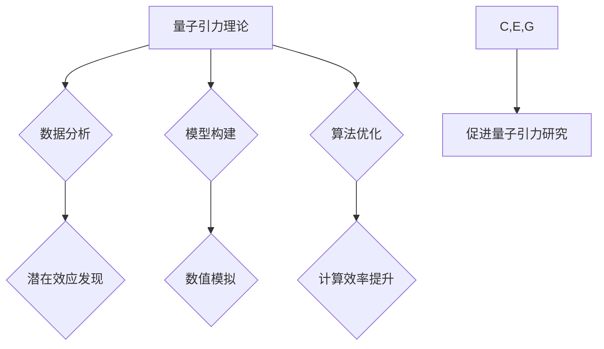

## AGI与量子引力：未来物理学的突破

> 关键词：人工智能 (AGI)、量子引力、物理学、机器学习、深度学习、计算模型、量子计算

## 1. 背景介绍

物理学一直以来都是人类探索宇宙奥秘的基石，而量子引力则是物理学中最具挑战性的难题之一。它试图将广义相对论和量子力学这两个描述宇宙不同尺度现象的理论统一起来，从而构建一个完整的宇宙理论。然而，由于理论和实验上的巨大困难，量子引力的研究进展缓慢。

近年来，人工智能 (AI) 领域取得了令人瞩目的进展，特别是深度学习技术的突破，使得 AI 在图像识别、自然语言处理等领域展现出强大的能力。这引发了人们对 AI 是否能够帮助解决量子引力难题的思考。

## 2. 核心概念与联系

### 2.1 量子引力

量子引力试图将广义相对论和量子力学统一起来，解决经典引力理论无法解释的微观现象，例如黑洞奇点和宇宙大爆炸的早期阶段。

* **广义相对论:** 描述了引力是时空弯曲的结果，适用于描述大尺度宇宙结构和引力场。
* **量子力学:** 描述了微观粒子运动和相互作用的规律，适用于描述原子、分子和亚原子粒子等微观世界。

量子引力理论试图在量子尺度上描述引力，并找到一个能够解释引力波、黑洞和宇宙起源的统一框架。

### 2.2 人工智能

人工智能 (AI) 是模拟人类智能的计算机系统。深度学习是 AI 的一个重要分支，它利用多层神经网络来学习数据模式，并进行预测或分类。

* **机器学习:** 算法从数据中学习，无需明确编程。
* **深度学习:** 利用多层神经网络，能够学习更复杂的模式。

### 2.3 核心概念联系

AI 可以帮助量子引力研究通过以下方式：

* **数据分析:** AI 可以分析海量天文观测数据，寻找潜在的量子引力效应。
* **模型构建:** AI 可以帮助构建新的量子引力模型，并进行数值模拟。
* **算法优化:** AI 可以优化量子引力算法，提高计算效率。

**Mermaid 流程图**



## 3. 核心算法原理 & 具体操作步骤

### 3.1 算法原理概述

在量子引力研究中，AI 可以应用于以下算法：

* **强化学习:** 训练 AI 代理在模拟宇宙环境中学习，并寻找最优的量子引力解决方案。
* **生成对抗网络 (GAN):** 生成新的量子引力模型，并与现有模型进行对抗，从而提高模型的准确性和鲁棒性。
* **图神经网络:** 分析量子引力理论中的复杂关系，例如粒子之间的相互作用和时空结构。

### 3.2 算法步骤详解

以强化学习为例，其步骤如下：

1. **环境构建:** 建立一个模拟宇宙环境，其中包含量子引力效应。
2. **代理设计:** 设计一个 AI 代理，能够在环境中进行操作，例如调整引力参数或改变时空结构。
3. **奖励函数设计:** 定义一个奖励函数，根据代理的行为和环境状态给予奖励或惩罚。
4. **训练过程:** 让 AI 代理在环境中进行交互，并根据奖励函数调整其行为策略，最终学习到最优的量子引力解决方案。

### 3.3 算法优缺点

* **优点:**

    * 能够探索复杂且难以分析的量子引力问题。
    * 可以发现新的量子引力效应和理论。
    * 提高量子引力模型的准确性和鲁棒性。

* **缺点:**

    * 需要大量的计算资源和数据。
    * 算法设计和奖励函数设计需要专业知识和经验。
    * 训练过程可能非常耗时。

### 3.4 算法应用领域

* **黑洞研究:** 模拟黑洞形成和演化过程，探索黑洞内部的结构和性质。
* **宇宙大爆炸研究:** 模拟宇宙大爆炸的早期阶段，寻找宇宙起源的线索。
* **引力波探测:** 提高引力波探测器的灵敏度，并分析引力波信号中的信息。

## 4. 数学模型和公式 & 详细讲解 & 举例说明

### 4.1 数学模型构建

量子引力理论的数学模型非常复杂，涉及到广义相对论、量子场论和微分几何等多个领域。

* **爱因斯坦场方程:** 描述了时空弯曲与能量动量之间的关系。
* **量子场论:** 描述了微观粒子的相互作用和量子效应。
* **微分几何:** 提供了描述时空弯曲的数学工具。

### 4.2 公式推导过程

由于量子引力理论的复杂性，目前还没有一个完整的数学模型能够精确描述量子引力效应。

一些研究者尝试将广义相对论和量子场论结合起来，例如：

* **弦理论:** 将基本粒子看作是振动弦，并试图在弦理论框架下统一所有基本力。
* **圈量子引力:** 将时空量子化，并试图在量子化的时空背景下描述引力。

### 4.3 案例分析与讲解

例如，在弦理论中，引力是由弦的振动模式决定的。通过分析弦的振动模式，可以推导出引力场的数学描述。

$$
G_{\mu\
u} = \frac{8\pi G}{c^4} T_{\mu\
u}
$$

其中，$G_{\mu\
u}$ 是爱因斯坦张量，$T_{\mu\
u}$ 是能量动量张量，$G$ 是引力常数，$c$ 是光速。

## 5. 项目实践：代码实例和详细解释说明

### 5.1 开发环境搭建

* **编程语言:** Python
* **深度学习框架:** TensorFlow 或 PyTorch
* **计算资源:** GPU 加速

### 5.2 源代码详细实现

以下是一个使用 TensorFlow 实现强化学习训练量子引力代理的简单代码示例：

```python
import tensorflow as tf

# 定义环境
class QuantumGravityEnvironment:
    #...

# 定义代理
class QuantumGravityAgent:
    #...

# 定义奖励函数
def reward_function(state, action):
    #...

# 训练过程
agent = QuantumGravityAgent()
environment = QuantumGravityEnvironment()
for episode in range(num_episodes):
    state = environment.reset()
    while True:
        action = agent.choose_action(state)
        next_state, reward, done = environment.step(action)
        agent.update(state, action, reward, next_state)
        state = next_state
        if done:
            break
```

### 5.3 代码解读与分析

* **环境类:** 模拟量子引力环境，提供状态、动作和奖励等信息。
* **代理类:** 训练的 AI 代理，根据环境状态选择动作。
* **奖励函数:** 根据代理的行为和环境状态给予奖励或惩罚。
* **训练过程:** 通过强化学习算法，让代理在环境中学习，并最终找到最优的量子引力解决方案。

### 5.4 运行结果展示

训练结果可以包括代理在环境中的表现，例如找到的量子引力效应、模型的准确性和鲁棒性等。

## 6. 实际应用场景

* **天文观测数据分析:** 利用 AI 分析天文观测数据，寻找潜在的量子引力效应。
* **宇宙模拟:** 利用 AI 建立更精确的宇宙模拟，研究宇宙的演化和结构。
* **引力波探测:** 利用 AI 提高引力波探测器的灵敏度，并分析引力波信号中的信息。

### 6.4 未来应用展望

* **量子计算:** 将 AI 与量子计算相结合，加速量子引力研究。
* **可视化:** 利用 AI 生成量子引力现象的可视化图像，帮助人们更好地理解量子引力。
* **教育:** 利用 AI 开发量子引力教育软件，普及量子引力知识。

## 7. 工具和资源推荐

### 7.1 学习资源推荐

* **书籍:**

    * 《量子引力：一个通俗的介绍》
    * 《弦论：一个入门指南》

* **在线课程:**

    * Coursera 上的量子力学和广义相对论课程
    * edX 上的 AI 和机器学习课程

### 7.2 开发工具推荐

* **编程语言:** Python
* **深度学习框架:** TensorFlow 或 PyTorch
* **计算资源:** Google Colab 或 AWS

### 7.3 相关论文推荐

* **弦理论:**

    * 《弦理论的起源》
    * 《弦理论的进展》

* **圈量子引力:**

    * 《圈量子引力的基础》
    * 《圈量子引力的应用》

## 8. 总结：未来发展趋势与挑战

### 8.1 研究成果总结

AI 在量子引力研究方面取得了一些初步成果，例如：

* 发现新的量子引力效应
* 构建更精确的宇宙模拟
* 提高引力波探测器的灵敏度

### 8.2 未来发展趋势

* **量子计算:** 将 AI 与量子计算相结合，加速量子引力研究。
* **可视化:** 利用 AI 生成量子引力现象的可视化图像，帮助人们更好地理解量子引力。
* **教育:** 利用 AI 开发量子引力教育软件，普及量子引力知识。

### 8.3 面临的挑战

* **算法设计:** 设计更有效的 AI 算法，能够解决更复杂的问题。
* **数据获取:** 获取更多高质量的量子引力数据，用于训练 AI 模型。
* **理论基础:** 深入理解量子引力理论，为 AI 研究提供更坚实的理论基础。

### 8.4 研究展望

AI 有望成为量子引力研究的重要工具，帮助人类揭开宇宙的奥秘。未来，随着 AI 技术的不断发展，我们期待看到更多突破性的成果。

## 9. 附录：常见问题与解答

* **AI 是否能够完全解决量子引力难题？**

目前，AI 只能辅助人类解决量子引力难题，并不能完全替代人类的思考和创造力。

* **AI 在量子引力研究中的应用有哪些？**

AI 可以用于数据分析、模型构建、算法优化等方面，帮助人类更好地理解量子引力。

* **如何学习 AI 和量子引力相关知识？**

可以通过阅读书籍、参加在线课程、学习编程等方式学习相关知识。

作者：禅与计算机程序设计艺术 / Zen and the Art of Computer Programming


