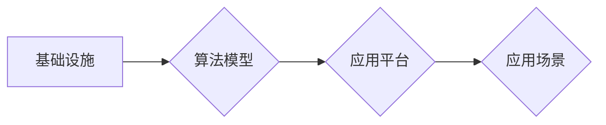

## AIGC从入门到实战：AIGC 的产业图谱带来新的创变纪元

> 关键词：AIGC, 文本生成, 图像生成, 产业图谱, 算法原理, 应用场景, 未来趋势

### 1. 背景介绍

人工智能（AI）技术近年来发展迅速，特别是生成式人工智能（AIGC）的兴起，为人类创造内容的方式带来了革命性的改变。AIGC能够根据输入的文本或其他数据，生成新的文本、图像、音频、视频等多种形式的内容，打破了传统内容创作的局限性，为各个行业带来了无限的可能性。

从ChatGPT的爆火到DALL-E 2的惊艳表现，AIGC已经不再是科幻小说中的幻想，而是触手可及的现实。它正在深刻地改变着我们生活、工作和娱乐的方式，并催生出全新的产业生态。

### 2. 核心概念与联系

**2.1 AIGC 的定义**

AIGC 指的是利用人工智能技术，自动生成新内容的系统。它可以接受文本、图像、音频等多种形式的输入，并根据输入生成新的文本、图像、音频等多种形式的内容。

**2.2 AIGC 的核心技术**

AIGC 的核心技术主要包括：

* **深度学习:** 深度学习是 AIGC 的基础，它利用多层神经网络学习数据中的复杂模式，从而能够生成高质量的内容。
* **自然语言处理 (NLP):** NLP 技术用于理解和生成人类语言，是 AIGC 生成文本内容的关键技术。
* **计算机视觉 (CV):** CV 技术用于理解和生成图像，是 AIGC 生成图像内容的关键技术。

**2.3 AIGC 的产业图谱**

AIGC 的产业图谱可以分为以下几个主要环节：

* **基础设施:** 包括计算资源、存储资源、数据标注等。
* **算法模型:** 包括文本生成模型、图像生成模型、音频生成模型等。
* **应用平台:** 包括内容创作平台、营销推广平台、教育培训平台等。
* **应用场景:** 包括内容创作、营销推广、教育培训、医疗诊断等。

**2.4 AIGC 的发展趋势**

AIGC 的发展趋势主要包括：

* **模型规模化:** 模型规模不断扩大，性能不断提升。
* **多模态生成:** 融合文本、图像、音频等多种模态，生成更加丰富的内容。
* **个性化定制:** 根据用户的需求，生成个性化的内容。
* **伦理规范:** 加强 AIGC 的伦理规范建设，确保其安全、可控、可持续发展。

**Mermaid 流程图**



### 3. 核心算法原理 & 具体操作步骤

**3.1 算法原理概述**

AIGC 的核心算法原理主要基于深度学习，特别是 Transformer 架构。Transformer 模型能够有效地捕捉文本中的长距离依赖关系，从而生成更加流畅、自然的文本内容。

**3.2 算法步骤详解**

1. **数据预处理:** 将原始数据进行清洗、格式化、编码等处理，使其能够被模型理解。
2. **模型训练:** 利用训练数据训练 Transformer 模型，使其能够学习数据中的模式和规律。
3. **文本生成:** 将输入文本作为模型的提示，模型根据训练的知识生成新的文本内容。

**3.3 算法优缺点**

**优点:**

* 生成质量高: Transformer 模型能够生成高质量、流畅的文本内容。
* 适应性强: 可以应用于多种文本生成任务，例如文本摘要、机器翻译、对话系统等。

**缺点:**

* 计算资源消耗大: 训练 Transformer 模型需要大量的计算资源。
* 训练数据依赖性强: 模型的性能取决于训练数据的质量和数量。

**3.4 算法应用领域**

* **内容创作:** 自动生成新闻报道、广告文案、小说等内容。
* **营销推广:** 自动生成社交媒体文案、电子邮件营销内容等。
* **教育培训:** 自动生成学习材料、考试题等。
* **客服服务:** 自动回复用户咨询，提供智能客服服务。

### 4. 数学模型和公式 & 详细讲解 & 举例说明

**4.1 数学模型构建**

Transformer 模型的核心是注意力机制，它能够捕捉文本中的长距离依赖关系。注意力机制可以看作是一种加权平均，它根据输入文本的不同部分之间的相关性，为每个部分分配不同的权重。

**4.2 公式推导过程**

注意力机制的计算公式如下：

$$
Attention(Q, K, V) = softmax(\frac{QK^T}{\sqrt{d_k}})V
$$

其中：

* $Q$ 是查询矩阵，表示需要关注的文本部分。
* $K$ 是键矩阵，表示所有文本部分的特征表示。
* $V$ 是值矩阵，表示所有文本部分的语义信息。
* $d_k$ 是键向量的维度。
* $softmax$ 函数将注意力权重归一化到 [0, 1] 之间。

**4.3 案例分析与讲解**

例如，在翻译句子 "The cat sat on the mat" 时，注意力机制会将 "cat" 和 "sat" 两个词语的注意力权重分配得更高，因为它们是句子中最重要的两个词语。

### 5. 项目实践：代码实例和详细解释说明

**5.1 开发环境搭建**

* Python 3.7+
* TensorFlow 或 PyTorch
* CUDA 和 cuDNN (可选)

**5.2 源代码详细实现**

```python
import tensorflow as tf

# 定义 Transformer 模型
class Transformer(tf.keras.Model):
    def __init__(self, vocab_size, embedding_dim, num_heads, num_layers):
        super(Transformer, self).__init__()
        self.embedding = tf.keras.layers.Embedding(vocab_size, embedding_dim)
        self.transformer_layers = tf.keras.layers.StackedRNNCells([
            tf.keras.layers.MultiHeadAttention(num_heads=num_heads, key_dim=embedding_dim)
            for _ in range(num_layers)
        ])

    def call(self, inputs):
        # Embedding
        embedded = self.embedding(inputs)
        # Transformer layers
        output = self.transformer_layers(embedded)
        return output

# 实例化模型
model = Transformer(vocab_size=10000, embedding_dim=512, num_heads=8, num_layers=6)

# 训练模型
#...

# 生成文本
#...
```

**5.3 代码解读与分析**

* `Transformer` 类定义了 Transformer 模型的结构。
* `embedding` 层将输入的词语转换为向量表示。
* `transformer_layers` 层包含多个 `MultiHeadAttention` 层，用于捕捉文本中的长距离依赖关系。
* `call` 方法定义了模型的输入和输出。

**5.4 运行结果展示**

* 模型训练完成后，可以利用模型生成新的文本内容。
* 生成结果可以根据实际应用场景进行评估。

### 6. 实际应用场景

**6.1 内容创作**

* 自动生成新闻报道、博客文章、小说等内容。
* 为游戏、电影等娱乐作品生成剧本、对话等内容。

**6.2 营销推广**

* 自动生成社交媒体文案、广告文案、电子邮件营销内容等。
* 为产品、服务等进行个性化营销推广。

**6.3 教育培训**

* 自动生成学习材料、考试题、个性化学习计划等。
* 为学生提供智能化的学习辅导。

**6.4 其他应用场景**

* 代码生成
* 音乐创作
* 艺术作品生成

**6.5 未来应用展望**

* AIGC 将更加深入地融入到我们的生活和工作中。
* AIGC 将能够生成更加复杂、多样化的内容。
* AIGC 将与其他人工智能技术融合，形成更加强大的应用场景。

### 7. 工具和资源推荐

**7.1 学习资源推荐**

* **书籍:**
    * 《深度学习》
    * 《自然语言处理》
* **在线课程:**
    * Coursera: 深度学习
    * edX: 自然语言处理
* **博客:**
    * The Gradient
    * Towards Data Science

**7.2 开发工具推荐**

* **TensorFlow:** 开源深度学习框架
* **PyTorch:** 开源深度学习框架
* **Hugging Face:** 提供预训练模型和开发工具

**7.3 相关论文推荐**

* Attention Is All You Need
* BERT: Pre-training of Deep Bidirectional Transformers for Language Understanding

### 8. 总结：未来发展趋势与挑战

**8.1 研究成果总结**

AIGC 技术取得了显著的进展，能够生成高质量、多样化的内容，并应用于多个领域。

**8.2 未来发展趋势**

* 模型规模化
* 多模态生成
* 个性化定制
* 伦理规范

**8.3 面临的挑战**

* 数据标注成本高
* 模型训练时间长
* 内容原创性问题
* 伦理道德问题

**8.4 研究展望**

* 开发更加高效、低成本的训练方法
* 探索新的模型架构和算法
* 加强 AIGC 的伦理规范建设
* 推广 AIGC 的应用，造福人类社会

### 9. 附录：常见问题与解答

* **Q: AIGC 会取代人类吗？**

A: AIGC 是一种工具，可以帮助人类提高效率，但它不会取代人类。人类的创造力和想象力是 AIGC 所无法替代的。

* **Q: AIGC 的内容是否真实可靠？**

A: AIGC 生成的内容需要经过人工审核，以确保其真实性和可靠性。

* **Q: 如何使用 AIGC 工具？**

A: 许多 AIGC 工具都提供免费试用版，用户可以根据自己的需求选择合适的工具。

作者：禅与计算机程序设计艺术 / Zen and the Art of Computer Programming


