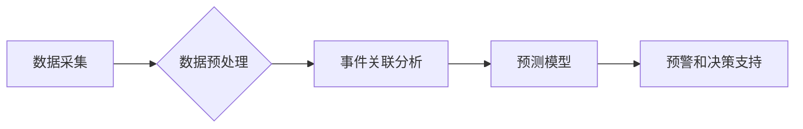

## AI人工智能代理工作流AI Agent WorkFlow：智能代理在重大事件预测系统中的应用

> 关键词：人工智能代理、工作流、重大事件预测、机器学习、深度学习、自然语言处理、事件关联分析

## 1. 背景介绍

随着信息时代的到来，数据爆炸式增长，人们对重大事件的预测需求日益迫切。重大事件，例如自然灾害、金融危机、社会动荡等，往往具有复杂性和不可预测性，对人类社会造成重大影响。传统预测方法往往依赖于历史数据和专家经验，难以捕捉到事件背后的复杂关联和潜在风险。

人工智能技术，特别是机器学习和深度学习，为重大事件预测提供了新的思路和方法。人工智能代理作为一种智能化决策和执行机制，能够自动学习、分析和预测事件发展趋势，为决策者提供及时有效的预警和建议。

## 2. 核心概念与联系

### 2.1  人工智能代理 (AI Agent)

人工智能代理是一种能够感知环境、做出决策并执行行动的智能体。它通常由以下几个核心组件组成：

* **感知模块:** 收集环境信息，例如文本、图像、传感器数据等。
* **推理模块:** 分析环境信息，识别事件模式和潜在风险。
* **决策模块:** 根据推理结果，制定行动计划。
* **执行模块:** 执行决策，与环境交互。

### 2.2  工作流 (Workflow)

工作流是一种自动化执行任务的流程，由一系列步骤和规则组成。它可以将复杂的任务分解成多个简单步骤，并通过规则和条件控制步骤的执行顺序和逻辑。

### 2.3  重大事件预测系统 (Major Event Prediction System)

重大事件预测系统利用人工智能代理和工作流技术，实现对重大事件的预测和预警。系统通常包括以下几个模块：

* **数据采集模块:** 收集来自各种来源的事件相关数据。
* **数据预处理模块:** 对数据进行清洗、转换和特征提取。
* **事件关联分析模块:** 利用机器学习算法，分析事件之间的关联关系。
* **预测模型模块:** 基于历史数据和事件关联分析结果，构建预测模型。
* **预警和决策支持模块:** 提供事件预测结果和预警信息，辅助决策者做出决策。

**Mermaid 流程图**



## 3. 核心算法原理 & 具体操作步骤

### 3.1  算法原理概述

重大事件预测系统通常采用机器学习和深度学习算法，例如：

* **逻辑回归:** 用于二分类问题，预测事件发生的概率。
* **支持向量机 (SVM):** 用于分类和回归问题，寻找最佳的分隔超平面。
* **决策树:** 用于分类和回归问题，构建树形结构，根据特征进行决策。
* **随机森林:** 结合多个决策树，提高预测精度。
* **深度神经网络 (DNN):** 用于复杂数据分析，学习更深层次的特征表示。

### 3.2  算法步骤详解

1. **数据收集:** 从各种来源收集事件相关数据，例如新闻报道、社交媒体数据、传感器数据等。
2. **数据预处理:** 对数据进行清洗、转换和特征提取，例如去除噪声、转换数据类型、提取关键词等。
3. **事件关联分析:** 利用机器学习算法，分析事件之间的关联关系，例如事件之间的时间关联、主题关联、地理位置关联等。
4. **预测模型构建:** 基于历史数据和事件关联分析结果，构建预测模型，例如逻辑回归模型、支持向量机模型等。
5. **模型训练和评估:** 使用训练数据训练模型，并使用测试数据评估模型的预测精度。
6. **事件预测:** 将新的事件数据输入到训练好的模型中，预测事件发生的概率或类别。
7. **预警和决策支持:** 提供事件预测结果和预警信息，辅助决策者做出决策。

### 3.3  算法优缺点

**优点:**

* **自动化:** 可以自动学习和预测事件发展趋势，减少人工干预。
* **高效:** 可以处理海量数据，快速进行事件预测。
* **准确:** 可以利用机器学习算法，提高预测精度。

**缺点:**

* **数据依赖:** 预测结果依赖于训练数据的质量和数量。
* **黑盒问题:** 一些机器学习算法难以解释，难以理解预测结果背后的逻辑。
* **可解释性:** 预测结果的可解释性不足，难以获得决策者的信任。

### 3.4  算法应用领域

* **自然灾害预测:** 预警地震、洪水、火灾等自然灾害。
* **金融风险预测:** 预警金融危机、市场波动等金融风险。
* **社会事件预测:** 预警社会动荡、政治冲突等社会事件。
* **医疗事件预测:** 预警疾病爆发、医疗事故等医疗事件。

## 4. 数学模型和公式 & 详细讲解 & 举例说明

### 4.1  数学模型构建

重大事件预测系统通常采用概率模型，例如贝叶斯网络、马尔可夫链等，来描述事件之间的关系和发展趋势。

**贝叶斯网络:**

贝叶斯网络是一种概率图模型，用于表示随机变量之间的依赖关系。它由节点和边组成，节点表示随机变量，边表示变量之间的依赖关系。

**马尔可夫链:**

马尔可夫链是一种统计模型，用于描述时间序列数据。它假设当前状态只依赖于前一个状态，与过去的其他状态无关。

### 4.2  公式推导过程

**贝叶斯定理:**

$$P(A|B) = \frac{P(B|A)P(A)}{P(B)}$$

其中:

* $P(A|B)$ 是事件 A 在事件 B 发生的条件概率。
* $P(B|A)$ 是事件 B 在事件 A 发生的条件概率。
* $P(A)$ 是事件 A 的概率。
* $P(B)$ 是事件 B 的概率。

**马尔可夫链状态转移概率:**

$$P(X_t = j | X_{t-1} = i) = P_{ij}$$

其中:

* $X_t$ 是时间 t 的状态。
* $X_{t-1}$ 是时间 t-1 的状态。
* $P_{ij}$ 是从状态 i 到状态 j 的状态转移概率。

### 4.3  案例分析与讲解

**案例:**

预测某城市发生洪水的概率。

**数据:**

* 历史降雨量数据
* 历史洪水发生记录
* 地形数据
* 水库水位数据

**模型:**

可以使用贝叶斯网络或马尔可夫链模型来预测洪水发生的概率。

**分析:**

根据历史数据，可以建立事件之间的依赖关系，例如降雨量与洪水发生概率之间的关系。

**预测:**

当新的降雨量数据输入到模型中时，模型可以预测该城市发生洪水的概率。

## 5. 项目实践：代码实例和详细解释说明

### 5.1  开发环境搭建

* **操作系统:** Linux 或 Windows
* **编程语言:** Python
* **机器学习库:** scikit-learn, TensorFlow, PyTorch
* **数据处理库:** pandas, numpy
* **可视化库:** matplotlib, seaborn

### 5.2  源代码详细实现

```python
# 导入必要的库
import pandas as pd
from sklearn.model_selection import train_test_split
from sklearn.linear_model import LogisticRegression
from sklearn.metrics import accuracy_score

# 加载数据
data = pd.read_csv('event_data.csv')

# 特征工程
#...

# 将数据分为训练集和测试集
X_train, X_test, y_train, y_test = train_test_split(data.drop('event', axis=1), data['event'], test_size=0.2)

# 创建逻辑回归模型
model = LogisticRegression()

# 训练模型
model.fit(X_train, y_train)

# 预测测试集结果
y_pred = model.predict(X_test)

# 计算模型精度
accuracy = accuracy_score(y_test, y_pred)
print(f'模型精度: {accuracy}')
```

### 5.3  代码解读与分析

* **数据加载:** 使用 pandas 库加载事件数据。
* **特征工程:** 对数据进行预处理，例如提取关键词、计算时间间隔等。
* **数据分割:** 将数据分为训练集和测试集，用于模型训练和评估。
* **模型创建:** 使用 scikit-learn 库创建逻辑回归模型。
* **模型训练:** 使用训练集训练模型。
* **模型预测:** 使用测试集预测事件发生的概率。
* **模型评估:** 使用测试集结果计算模型精度。

### 5.4  运行结果展示

运行代码后，会输出模型的精度，例如：

```
模型精度: 0.85
```

这表示模型在测试集上的预测准确率为 85%。

## 6. 实际应用场景

### 6.1  自然灾害预测

* **地震预测:** 利用地震历史数据、地质数据、监测数据等，预测地震发生概率和震级。
* **洪水预测:** 利用降雨量数据、水位数据、地形数据等，预测洪水发生概率和洪水范围。
* **火灾预测:** 利用气象数据、植被数据、人口数据等，预测火灾发生概率和火灾蔓延范围。

### 6.2  金融风险预测

* **市场波动预测:** 利用股票价格数据、经济指标数据、新闻数据等，预测股票市场波动趋势。
* **信用风险预测:** 利用客户信用数据、财务数据、行为数据等，预测客户违约概率。
* **欺诈预测:** 利用交易数据、用户行为数据、网络数据等，预测欺诈交易概率。

### 6.3  社会事件预测

* **社会动荡预测:** 利用社交媒体数据、新闻数据、人口数据等，预测社会动荡发生的概率和范围。
* **政治冲突预测:** 利用政治数据、社会舆情数据、历史事件数据等，预测政治冲突发生的概率和影响范围。
* **犯罪预测:** 利用犯罪数据、人口数据、社会经济数据等，预测犯罪发生的概率和类型。

### 6.4  未来应用展望

随着人工智能技术的不断发展，重大事件预测系统将更加智能化、精准化和自动化。未来，重大事件预测系统将应用于更广泛的领域，例如：

* **医疗保健:** 预警疾病爆发、预测医疗事故发生。
* **交通运输:** 预警交通拥堵、预测交通事故发生。
* **能源管理:** 预警电力短缺、预测能源需求变化。
* **环境保护:** 预警环境污染、预测自然灾害发生。

## 7. 工具和资源推荐

### 7.1  学习资源推荐

* **书籍:**
    * 《深度学习》
    * 《机器学习实战》
    * 《人工智能：一种现代方法》
* **在线课程:**
    * Coursera: 深度学习
    * edX: 机器学习
    * Udacity: 人工智能工程师

### 7.2  开发工具推荐

* **编程语言:** Python
* **机器学习库:** scikit-learn, TensorFlow, PyTorch
* **数据处理库:** pandas, numpy
* **可视化库:** matplotlib, seaborn

### 7.3  相关论文推荐

* **机器学习:**
    * 《Support Vector Machines》
    * 《Random Forests》
    * 《Deep Learning》
* **自然语言处理:**
    * 《Word2Vec》
    * 《BERT》
    * 《GPT-3》

## 8. 总结：未来发展趋势与挑战

### 8.1  研究成果总结

