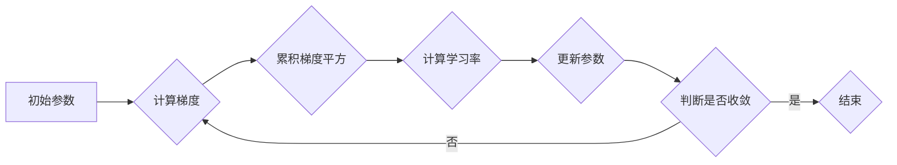

## AdaGrad优化器原理与代码实例讲解

> 关键词：AdaGrad, 梯度下降, 优化器, 机器学习, 深度学习, 稀疏梯度

## 1. 背景介绍

在机器学习领域，优化算法是训练模型的核心环节。这些算法帮助我们找到模型参数的最佳值，从而最小化模型的损失函数。梯度下降法是机器学习中最常用的优化算法之一，它通过不断迭代地更新模型参数，朝着损失函数的最小值方向前进。然而，传统的梯度下降法存在一些缺点，例如学习率难以选择，容易陷入局部最优解，收敛速度慢。

为了解决这些问题，人们提出了许多改进的梯度下降算法，其中AdaGrad（Adaptive Gradient Algorithm）就是一种非常有效的优化器。AdaGrad算法通过对每个参数的梯度历史进行累积，动态地调整学习率，从而提高收敛速度和避免陷入局部最优解。

## 2. 核心概念与联系

AdaGrad算法的核心思想是根据每个参数的历史梯度信息来调整学习率。对于那些梯度较大的参数，AdaGrad会降低学习率，从而避免参数更新过大；对于那些梯度较小的参数，AdaGrad会提高学习率，从而加速参数更新。

**Mermaid 流程图**



## 3. 核心算法原理 & 具体操作步骤

### 3.1  算法原理概述

AdaGrad算法的核心在于对每个参数的梯度平方进行累积，并根据累积的梯度平方值来动态调整学习率。具体来说，AdaGrad算法的步骤如下：

1. 初始化每个参数的学习率为一个常数，例如0.01。
2. 对于每个训练样本，计算模型参数的梯度。
3. 将每个参数的梯度平方累积起来，并存储在对应的累积梯度平方向量中。
4. 计算每个参数的学习率，其值等于初始学习率除以累积梯度平方值的平方根。
5. 使用计算出的学习率更新每个参数的值。
6. 重复步骤2-5，直到模型收敛。

### 3.2  算法步骤详解

1. **初始化:**

   -  对于每个参数 $w_i$，初始化一个学习率 $\eta_i$，通常设置为一个常数，例如 0.01。
   -  初始化一个累积梯度平方向量 $G_i$，用于存储每个参数 $w_i$ 的梯度平方历史信息。

2. **前向传播:**

   -  输入训练数据，计算模型输出。
   -  计算模型输出与真实值的损失函数值。

3. **反向传播:**

   -  根据损失函数，计算每个参数 $w_i$ 的梯度 $\nabla L / \partial w_i$。

4. **更新参数:**

   -  更新每个参数 $w_i$ 的值：
     $$w_i = w_i - \eta_i \frac{\nabla L}{\partial w_i} / \sqrt{G_i + \epsilon}$$
   -  其中，$\epsilon$ 是一个小的常数，用于避免分母为零。

5. **累积梯度平方:**

   -  更新累积梯度平方向量 $G_i$：
     $$G_i = G_i + (\nabla L / \partial w_i)^2$$

6. **迭代:**

   -  重复步骤 2-5，直到模型收敛。

### 3.3  算法优缺点

**优点:**

- **适应性强:** AdaGrad算法可以根据每个参数的梯度历史信息动态调整学习率，从而适应不同参数的学习需求。
- **收敛速度快:**  由于学习率的动态调整，AdaGrad算法通常比传统的梯度下降法收敛速度更快。
- **处理稀疏梯度有效:** AdaGrad算法对稀疏梯度具有良好的处理能力，因为累积梯度平方只关注非零梯度。

**缺点:**

- **学习率衰减过快:** AdaGrad算法的学习率会随着训练的进行而不断衰减，这可能会导致模型在后期训练阶段收敛速度变慢。
- **参数初始化敏感:** AdaGrad算法对初始学习率的选择比较敏感，如果初始学习率设置过大或过小，可能会影响模型的训练效果。

### 3.4  算法应用领域

AdaGrad算法广泛应用于各种机器学习任务，例如：

- **自然语言处理:** 词向量训练、文本分类、机器翻译等。
- **计算机视觉:** 图像分类、目标检测、图像分割等。
- **推荐系统:** 用户行为预测、商品推荐等。

## 4. 数学模型和公式 & 详细讲解 & 举例说明

### 4.1  数学模型构建

AdaGrad算法的核心数学模型是累积梯度平方和学习率调整公式。

- 累积梯度平方向量 $G_i$：

   $$G_i = \sum_{t=1}^{T} (\nabla L / \partial w_i)^2$$

- 学习率调整公式：

   $$\eta_i = \frac{\eta_0}{\sqrt{G_i + \epsilon}}$$

   其中，$\eta_0$ 是初始学习率，$\epsilon$ 是一个小的常数，用于避免分母为零。

### 4.2  公式推导过程

AdaGrad算法的学习率调整公式的推导过程如下：

1. 为了避免参数更新过大，我们希望在梯度较大的情况下降低学习率。
2. 梯度平方可以作为衡量梯度大小的指标。
3. 累积梯度平方可以反映参数在训练过程中梯度变化的趋势。
4. 因此，我们可以将学习率与累积梯度平方值的平方根成反比关系。

### 4.3  案例分析与讲解

假设我们有一个模型参数 $w$，其梯度为 $\nabla L / \partial w$。

- 在训练的初期，累积梯度平方 $G$ 较小，学习率 $\eta$ 较大，参数 $w$ 会更新较大。
- 随着训练的进行，累积梯度平方 $G$ 会逐渐增大，学习率 $\eta$ 会逐渐减小，参数 $w$ 的更新幅度会逐渐减小。

## 5. 项目实践：代码实例和详细解释说明

### 5.1  开发环境搭建

- Python 3.6+
- NumPy
- TensorFlow 或 PyTorch

### 5.2  源代码详细实现

```python
import numpy as np

class AdaGrad:
    def __init__(self, learning_rate=0.01, epsilon=1e-8):
        self.learning_rate = learning_rate
        self.epsilon = epsilon
        self.gradient_squares = {}

    def update(self, parameters, gradients):
        for name, value in parameters.items():
            if name not in self.gradient_squares:
                self.gradient_squares[name] = np.zeros_like(value)
            self.gradient_squares[name] += gradients[name] ** 2
            update = -self.learning_rate * gradients[name] / np.sqrt(self.gradient_squares[name] + self.epsilon)
            parameters[name] += update

```

### 5.3  代码解读与分析

- `__init__` 方法：初始化 AdaGrad 优化器，设置学习率和 epsilon 值。
- `update` 方法：更新模型参数，根据梯度和累积梯度平方值计算学习率，并更新参数值。

### 5.4  运行结果展示

通过在实际的机器学习任务中使用 AdaGrad 优化器，我们可以观察到其收敛速度和性能表现。

## 6. 实际应用场景

AdaGrad 优化器在许多实际应用场景中表现出色，例如：

- **文本分类:** AdaGrad 可以有效地训练文本分类模型，例如情感分析、主题分类等。
- **推荐系统:** AdaGrad 可以用于训练推荐系统模型，例如用户行为预测、商品推荐等。
- **图像识别:** AdaGrad 可以用于训练图像识别模型，例如目标检测、图像分割等。

### 6.4  未来应用展望

随着机器学习技术的不断发展，AdaGrad 优化器将在更多领域得到应用，例如：

- **强化学习:** AdaGrad 可以用于训练强化学习模型，例如游戏 AI、机器人控制等。
- **自动驾驶:** AdaGrad 可以用于训练自动驾驶模型，例如路径规划、物体识别等。
- **医疗诊断:** AdaGrad 可以用于训练医疗诊断模型，例如疾病预测、影像分析等。

## 7. 工具和资源推荐

### 7.1  学习资源推荐

- **书籍:**
    - "Deep Learning" by Ian Goodfellow, Yoshua Bengio, and Aaron Courville
    - "Hands-On Machine Learning with Scikit-Learn, Keras & TensorFlow" by Aurélien Géron
- **在线课程:**
    - Coursera: Machine Learning by Andrew Ng
    - Udacity: Deep Learning Nanodegree

### 7.2  开发工具推荐

- **Python:** 
    - NumPy
    - TensorFlow
    - PyTorch
- **IDE:**
    - Jupyter Notebook
    - VS Code

### 7.3  相关论文推荐

- "Adaptive Subgradient Methods for Online Learning and Stochastic Optimization" by Duchi, Hazan, and Singer (2011)

## 8. 总结：未来发展趋势与挑战

### 8.1  研究成果总结

AdaGrad 优化器是一种有效的梯度下降算法，它通过动态调整学习率来加速模型训练。AdaGrad 算法在处理稀疏梯度和适应不同参数学习需求方面表现出色。

### 8.2  未来发展趋势

- **结合其他优化器:** 将 AdaGrad 与其他优化器结合，例如 RMSprop、Adam，以进一步提高模型训练性能。
- **自适应学习率调整:** 研究更智能的自适应学习率调整策略，例如基于模型复杂度、数据分布等因素进行调整。
- **并行训练:** 探索 AdaGrad 在并行训练环境下的应用，以加速模型训练速度。

### 8.3  面临的挑战

- **学习率衰减过快:** AdaGrad 算法的学习率会随着训练的进行而不断衰减，这可能会导致模型在后期训练阶段收敛速度变慢。
- **参数初始化敏感:** AdaGrad 算法对初始学习率的选择比较敏感，如果初始学习率设置过大或过小，可能会影响模型的训练效果。

### 8.4  研究展望

未来研究方向包括：

- 开发新的自适应学习率调整策略，解决 AdaGrad 学习率衰减过快的缺点。
- 研究 AdaGrad 在不同机器学习任务和数据分布下的性能表现，并探索其应用场景。
- 探索 AdaGrad 在深度学习模型训练中的应用，并与其他深度学习优化器进行比较。

## 9. 附录：常见问题与解答

**Q1: AdaGrad 优化器与 RMSprop 优化器有什么区别？**

**A1:** AdaGrad 和 RMSprop 都是基于梯度平方累积的优化器，但它们在累积梯度平方的方式上有所不同。AdaGrad 直接累积所有历史梯度平方，而 RMSprop 则使用指数衰减平均的方式来累积历史梯度平方。

**Q2: 如何选择 AdaGrad 优化器的初始学习率？**

**A2:** AdaGrad 优化器的初始学习率的选择需要根据具体的任务和数据集进行调整。一般来说，可以从一个较小的值开始，例如 0.01，然后根据模型的训练效果进行调整。

**Q3: AdaGrad 优化器是否适用于所有机器学习任务？**

**A3:** AdaGrad 优化器适用于许多机器学习任务，但它可能不适用于所有任务。例如，对于一些需要长时间训练的模型，