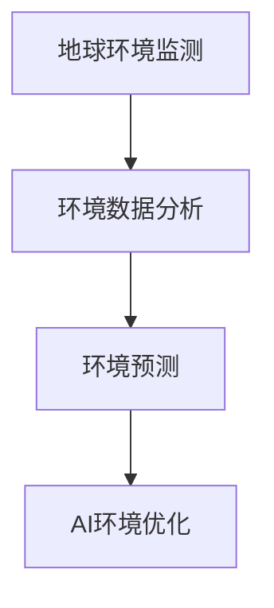

                 

## 1. 背景介绍

### 1.1 问题由来
随着全球环境问题的日益严重，人工智能（AI）在环境保护领域的应用变得越来越重要。AI可以帮助监测和预测环境变化，优化资源利用，提高环境治理的效率和精准度。例如，AI可以用于大气污染监测、水资源管理、生态系统监测、气候变化预测等领域。本文将介绍地球环境与AI融合的关键技术和应用，探讨AI如何为环境保护做出贡献。

### 1.2 问题核心关键点
AI与地球环境的融合主要集中在以下几个方面：

- **环境监测与预警**：利用AI进行大气、水、土壤、生态等环境的实时监测，预警环境灾害。
- **资源优化利用**：通过AI优化水、电、燃料等资源的利用效率，提高能源的可持续性。
- **生态系统保护**：利用AI分析生态系统的健康状况，预测生态风险，指导生态保护措施。
- **气候变化应对**：利用AI模拟气候变化趋势，预测极端天气事件，制定应对策略。

### 1.3 问题研究意义
AI与地球环境的融合，对于全球环境保护和可持续发展具有重要意义：

- **提升环境监测的效率和精度**：AI可以实时处理和分析大规模环境数据，提高环境监测的效率和精度。
- **优化资源利用**：AI可以优化资源配置，提高资源利用效率，减少资源浪费。
- **促进生态保护**：AI可以帮助监测和保护濒危物种和生态系统，促进生物多样性保护。
- **应对气候变化**：AI可以模拟气候变化趋势，预测极端天气，帮助制定应对策略。

## 2. 核心概念与联系

### 2.1 核心概念概述

为更好地理解AI与地球环境的融合，本节将介绍几个密切相关的核心概念：

- **地球环境监测**：利用各种传感器和遥感技术，对大气、水、土壤、植被等环境因素进行实时监测，获取环境数据。
- **环境数据分析**：对收集到的环境数据进行清洗、处理和分析，提取有价值的信息，支持环境决策。
- **环境预测**：基于历史和实时环境数据，利用机器学习模型预测环境变化趋势和灾害预警。
- **AI环境优化**：通过AI优化资源利用，减少环境污染，提高环境治理效率。

### 2.2 概念间的关系

这些核心概念之间存在着紧密的联系，形成了AI与地球环境融合的完整生态系统。我们可以用以下Mermaid流程图来展示它们之间的关系：



这个流程图展示了从环境监测到数据处理，再到预测和优化的过程。

## 3. 核心算法原理 & 具体操作步骤
### 3.1 算法原理概述

AI与地球环境融合的核心算法原理包括以下几个步骤：

1. **环境数据采集与预处理**：利用各种传感器和遥感技术，采集环境数据，并进行预处理，包括清洗、归一化、特征提取等。
2. **数据建模与训练**：基于历史和实时环境数据，构建机器学习模型，进行训练，获取环境预测模型。
3. **模型部署与优化**：将训练好的模型部署到实际应用场景中，并进行优化，确保模型的稳定性和精度。
4. **模型评估与迭代**：对模型进行评估，根据实际效果不断迭代优化模型，提高模型性能。

### 3.2 算法步骤详解

**Step 1: 环境数据采集与预处理**

环境数据采集通常包括传感器数据、遥感数据、气象数据等。例如，利用卫星遥感技术获取地表温度、植被覆盖度等数据，利用传感器监测大气污染物浓度、水质等指标。预处理步骤包括：

- 清洗：去除数据中的异常值和噪声，确保数据质量。
- 归一化：将不同来源的数据统一到相同的量纲和范围。
- 特征提取：提取数据中的关键特征，如光谱特征、时间序列特征等。

**Step 2: 数据建模与训练**

构建机器学习模型时，通常采用监督学习、无监督学习或半监督学习的方法。例如，使用回归模型预测水质指标，使用分类模型判断污染类型。训练步骤包括：

- 划分数据集：将数据集划分为训练集、验证集和测试集。
- 选择模型：选择合适的机器学习模型，如随机森林、神经网络、支持向量机等。
- 训练模型：使用训练集对模型进行训练，调整模型参数，确保模型性能。

**Step 3: 模型部署与优化**

模型部署是将训练好的模型应用到实际环境监测和预测中。优化步骤包括：

- 部署模型：将模型部署到服务器、边缘计算设备等环境中，进行实时监测和预测。
- 参数调整：根据实际应用情况，调整模型参数，优化模型性能。
- 数据流优化：优化数据传输和处理流程，提高实时性。

**Step 4: 模型评估与迭代**

模型评估是检验模型效果的重要步骤，通常使用交叉验证、AUC、均方误差等指标。迭代步骤包括：

- 评估模型：使用测试集评估模型性能，分析模型效果。
- 迭代优化：根据评估结果，对模型进行优化，提高模型精度。
- 模型更新：根据新的环境数据，更新模型参数，确保模型最新性。

### 3.3 算法优缺点

AI与地球环境融合的优势：

- **效率高**：AI可以实时处理和分析大量环境数据，提高监测和预测的效率。
- **精度高**：AI模型经过大量数据训练，能够准确预测环境变化趋势，提高预测精度。
- **可扩展性强**：AI模型可以很容易地扩展到不同领域和应用场景中，具有高度的灵活性。

AI与地球环境融合的局限性：

- **数据质量要求高**：AI模型对数据质量要求较高，数据缺失、噪声等问题会影响模型性能。
- **计算资源需求大**：构建和训练AI模型需要大量的计算资源，包括高性能服务器、GPU等。
- **模型可解释性差**：AI模型通常是"黑盒"模型，难以解释模型的决策过程和原理。
- **环境变化不确定性**：环境变化具有高度不确定性，AI模型可能无法准确预测极端情况。

### 3.4 算法应用领域

AI与地球环境融合的应用领域非常广泛，包括：

- **大气污染监测**：利用AI预测和监测大气污染物浓度，及时预警污染事件。
- **水资源管理**：利用AI预测水资源分布，优化水资源利用，减少浪费。
- **生态系统保护**：利用AI分析生态系统健康状况，预测生态风险，制定保护措施。
- **气候变化应对**：利用AI模拟气候变化趋势，预测极端天气事件，制定应对策略。
- **农业环境管理**：利用AI优化农业资源利用，提高农业生产效率，减少环境污染。

## 4. 数学模型和公式 & 详细讲解 & 举例说明

### 4.1 数学模型构建

本节将使用数学语言对AI与地球环境融合的过程进行更加严格的刻画。

假设环境数据为 $X = (x_1, x_2, ..., x_n)$，其中 $x_i$ 为第 $i$ 个数据点。环境预测模型为 $M_{\theta}(X)$，其中 $\theta$ 为模型参数。目标是对未来环境状态进行预测，即求解最小化损失函数 $\mathcal{L}(M_{\theta}, Y)$，其中 $Y$ 为环境状态的真实值。

定义环境状态 $Y$ 的预测值为 $M_{\theta}(X)$，预测误差为 $e_i = y_i - M_{\theta}(x_i)$，则均方误差（MSE）损失函数为：

$$
\mathcal{L}(M_{\theta}, Y) = \frac{1}{N} \sum_{i=1}^N e_i^2 = \frac{1}{N} \sum_{i=1}^N (y_i - M_{\theta}(x_i))^2
$$

利用梯度下降算法，优化模型参数 $\theta$，最小化损失函数：

$$
\theta \leftarrow \theta - \eta \nabla_{\theta}\mathcal{L}(M_{\theta}, Y)
$$

其中 $\eta$ 为学习率，$\nabla_{\theta}\mathcal{L}(M_{\theta}, Y)$ 为损失函数对模型参数 $\theta$ 的梯度，可通过反向传播算法高效计算。

### 4.2 公式推导过程

以下我们以水资源管理为例，推导AI模型的数学模型和优化过程。

假设有一个水库，其水位 $Y$ 受到降雨量 $X$ 的影响。目标是对未来几天的水位进行预测。

- 收集历史降雨量数据 $X = \{x_1, x_2, ..., x_n\}$ 和对应水位数据 $Y = \{y_1, y_2, ..., y_n\}$。
- 使用线性回归模型 $M_{\theta}(X) = \theta_0 + \theta_1 x_1 + \theta_2 x_2 + ... + \theta_n x_n$ 进行预测。
- 定义损失函数为均方误差：$\mathcal{L}(\theta) = \frac{1}{N} \sum_{i=1}^N (y_i - M_{\theta}(x_i))^2$。
- 使用梯度下降算法最小化损失函数：$\theta \leftarrow \theta - \eta \nabla_{\theta}\mathcal{L}(\theta)$。

在得到模型参数 $\theta$ 后，将新降雨量 $x_{n+1}$ 代入模型，得到未来水位预测值 $M_{\theta}(x_{n+1})$。

### 4.3 案例分析与讲解

以生态系统健康状况预测为例，分析AI模型在生态系统监测中的应用。

- **数据采集**：利用遥感技术获取植被覆盖度、地表温度等数据。
- **数据处理**：对数据进行清洗和归一化，提取光谱特征。
- **模型构建**：构建支持向量机（SVM）模型，用于分类生态系统健康状况（如健康、轻度退化、中度退化、重度退化）。
- **模型训练**：使用历史数据训练模型，调整参数，优化模型性能。
- **模型评估**：使用交叉验证评估模型性能，选择最优模型。
- **模型部署**：将训练好的模型部署到生态系统监测系统中，实时监测和预警生态系统健康状况。

## 5. 项目实践：代码实例和详细解释说明
### 5.1 开发环境搭建

在进行AI与地球环境融合的项目实践前，我们需要准备好开发环境。以下是使用Python进行Scikit-learn开发的环境配置流程：

1. 安装Anaconda：从官网下载并安装Anaconda，用于创建独立的Python环境。

2. 创建并激活虚拟环境：
```bash
conda create -n sklearn-env python=3.8 
conda activate sklearn-env
```

3. 安装Scikit-learn：使用以下命令安装Scikit-learn库：
```bash
conda install scikit-learn
```

4. 安装各类工具包：
```bash
pip install numpy pandas scikit-learn matplotlib tqdm jupyter notebook ipython
```

完成上述步骤后，即可在`sklearn-env`环境中开始AI与地球环境融合的实践。

### 5.2 源代码详细实现

这里以空气质量预测为例，使用Scikit-learn库进行AI模型的开发和实现。

首先，定义空气质量数据处理函数：

```python
from sklearn.model_selection import train_test_split
from sklearn.linear_model import LinearRegression
import pandas as pd

def process_data(data_path):
    # 读取数据
    data = pd.read_csv(data_path)

    # 数据清洗
    data = data.dropna()

    # 特征工程
    X = data.drop(['air_quality'], axis=1)
    y = data['air_quality']

    # 数据拆分
    X_train, X_test, y_train, y_test = train_test_split(X, y, test_size=0.2, random_state=42)

    return X_train, X_test, y_train, y_test
```

然后，定义模型训练和评估函数：

```python
from sklearn.metrics import mean_squared_error
from sklearn.model_selection import cross_val_score

def train_model(X_train, y_train, X_test, y_test):
    # 初始化模型
    model = LinearRegression()

    # 模型训练
    model.fit(X_train, y_train)

    # 模型评估
    y_pred = model.predict(X_test)
    mse = mean_squared_error(y_test, y_pred)
    rmse = np.sqrt(mse)

    return model, rmse
```

接着，启动训练流程并在测试集上评估：

```python
# 数据预处理
X_train, X_test, y_train, y_test = process_data('air_quality.csv')

# 模型训练
model, rmse = train_model(X_train, y_train, X_test, y_test)

# 模型评估
print(f'RMSE: {rmse:.3f}')
```

以上就是使用Scikit-learn进行空气质量预测的完整代码实现。可以看到，Scikit-learn库提供了丰富的机器学习算法和工具，使得模型开发和评估变得非常简单。

### 5.3 代码解读与分析

让我们再详细解读一下关键代码的实现细节：

**process_data函数**：
- 读取数据：使用`pd.read_csv`函数读取数据文件。
- 数据清洗：使用`dropna`函数去除缺失值。
- 特征工程：将数据拆分为特征和标签，使用`train_test_split`函数进行数据拆分。

**train_model函数**：
- 模型初始化：使用`LinearRegression`函数初始化线性回归模型。
- 模型训练：使用`fit`函数对模型进行训练，调整模型参数。
- 模型评估：使用`mean_squared_error`函数计算模型预测值与真实值之间的均方误差，使用`rmse`函数计算均方根误差（RMSE）。

**训练流程**：
- 数据预处理：使用`process_data`函数处理数据。
- 模型训练：使用`train_model`函数训练模型。
- 模型评估：输出模型评估结果，包括均方根误差。

## 6. 实际应用场景
### 6.1 智能电网

智能电网是一种基于AI技术的新型电网系统，能够实时监测和管理电网的运行状态，优化电力资源的分配。例如，利用AI进行电网负荷预测，实时调整发电量和输电线路，减少能源浪费和电力中断的风险。

在技术实现上，可以收集电网的电压、电流、温度等数据，构建时间序列模型进行负荷预测。利用AI对预测结果进行优化，动态调整电网运行策略。如此构建的智能电网，可以大幅提高电力系统的稳定性和效率，降低能源消耗和运营成本。

### 6.2 环境污染监测

环境污染监测是AI与地球环境融合的重要应用之一。AI可以通过实时监测大气、水、土壤等环境数据，预测和预警环境污染事件。例如，利用AI进行大气污染物浓度预测，实时监测和预警PM2.5、臭氧等污染物浓度，及时采取措施减少污染。

在技术实现上，可以收集各类传感器数据，构建时间序列模型进行污染物浓度预测。利用AI对预测结果进行优化，动态调整污染物控制措施。如此构建的环境污染监测系统，可以大幅提高环境监测的效率和精度，保护人类健康和生态系统。

### 6.3 智慧农业

智慧农业利用AI技术进行农业生产管理，优化资源利用，提高农业生产效率和可持续发展能力。例如，利用AI进行农作物生长预测，实时调整灌溉、施肥等农业措施，优化农业生产过程。

在技术实现上，可以收集土壤、气象、作物生长数据，构建机器学习模型进行生长预测。利用AI对预测结果进行优化，动态调整农业生产措施。如此构建的智慧农业系统，可以大幅提高农业生产效率，减少资源浪费，促进农业可持续发展。

### 6.4 未来应用展望

随着AI与地球环境融合的不断发展，未来将涌现更多创新应用，带来深远影响。

- **智能城市**：利用AI进行城市交通管理、能源管理、水资源管理等，提升城市管理的智能化和效率化水平。
- **环境治理**：利用AI进行生态系统保护、自然灾害预警、环境风险评估等，提升环境治理的科学化和精准化水平。
- **可持续发展**：利用AI进行资源优化利用、环境污染治理、气候变化应对等，促进全球可持续发展。

## 7. 工具和资源推荐
### 7.1 学习资源推荐

为了帮助开发者系统掌握AI与地球环境融合的理论基础和实践技巧，这里推荐一些优质的学习资源：

1. **《Python数据科学手册》**：这是一本介绍Python数据科学库（如NumPy、Pandas、Scikit-learn等）的权威书籍，适合学习数据处理、模型训练等基础技能。

2. **Coursera《机器学习》课程**：由斯坦福大学Andrew Ng教授主讲的机器学习课程，涵盖机器学习基础、监督学习、无监督学习等内容，适合入门学习。

3. **DeepLearning.AI的《AI for Everyone》课程**：这是一门面向非技术人员的AI入门课程，讲解AI的基本概念和应用，适合快速了解AI与地球环境融合的基本原理。

4. **《自然语言处理综论》**：这是一本介绍自然语言处理（NLP）技术的经典书籍，涵盖文本处理、情感分析、机器翻译等内容，适合深入学习NLP技术。

5. **ArXiv论文预印本**：这是全球最大的学术预印本服务器，包含大量前沿研究论文，适合跟踪最新的AI技术进展。

通过对这些资源的学习实践，相信你一定能够快速掌握AI与地球环境融合的精髓，并用于解决实际的AI应用问题。

### 7.2 开发工具推荐

高效的开发离不开优秀的工具支持。以下是几款用于AI与地球环境融合开发的常用工具：

1. **Jupyter Notebook**：这是一个交互式编程环境，支持Python、R等多种编程语言，适合进行数据处理、模型训练等任务。

2. **TensorFlow**：由Google开发的人工智能框架，支持深度学习模型的构建和训练，适合处理大规模数据。

3. **Scikit-learn**：这是一个Python机器学习库，包含丰富的机器学习算法和工具，适合快速开发和评估机器学习模型。

4. **PyTorch**：这是一个由Facebook开发的深度学习框架，支持动态计算图和GPU加速，适合进行深度学习模型的构建和训练。

5. **Google Earth Engine**：这是一个基于Web的GIS和地球科学数据处理平台，支持大规模地理数据的处理和分析，适合进行地球环境监测和预测。

6. **Open Datasets**：这是一个开放的地球环境数据集平台，包含大量的环境监测数据，适合进行数据处理和建模。

合理利用这些工具，可以显著提升AI与地球环境融合的开发效率，加快创新迭代的步伐。

### 7.3 相关论文推荐

AI与地球环境融合的研究源于学界的持续研究。以下是几篇奠基性的相关论文，推荐阅读：

1. **《机器学习在气象预测中的应用》**：这篇论文介绍机器学习在气象预测中的应用，包括时间序列预测、空间预测等内容。

2. **《利用AI进行生态系统健康监测》**：这篇论文介绍利用AI进行生态系统健康监测的方法，包括遥感数据处理、模型构建等内容。

3. **《智能电网：利用AI进行电力系统优化》**：这篇论文介绍智能电网的技术实现，包括数据采集、负荷预测、电网优化等内容。

4. **《智慧农业：利用AI进行农业生产管理》**：这篇论文介绍智慧农业的技术实现，包括数据处理、生长预测、生产优化等内容。

这些论文代表了大环境与AI融合的发展脉络。通过学习这些前沿成果，可以帮助研究者把握学科前进方向，激发更多的创新灵感。

除上述资源外，还有一些值得关注的前沿资源，帮助开发者紧跟AI与地球环境融合技术的最新进展，例如：

1. **顶级会议论文**：如ICML、NIPS、CVPR等顶级会议的论文，涵盖最新的AI研究成果和应用。

2. **前沿书籍**：如《深度学习》、《强化学习》等经典书籍，涵盖最新的AI技术进展和应用。

3. **开源项目**：如TensorFlow、PyTorch等开源项目，提供了丰富的AI工具和模型，适合学习和实践。

## 8. 总结：未来发展趋势与挑战
### 8.1 总结

本文对AI与地球环境融合进行了全面系统的介绍。首先阐述了AI与地球环境融合的研究背景和意义，明确了AI在环境保护和可持续发展中的重要作用。其次，从原理到实践，详细讲解了AI与地球环境融合的核心算法和操作步骤，给出了AI与地球环境融合项目的完整代码实例。同时，本文还广泛探讨了AI与地球环境融合的实际应用场景，展示了AI在环境保护中的巨大潜力。最后，本文精选了AI与地球环境融合的学习资源、开发工具和相关论文，力求为读者提供全方位的技术指引。

通过本文的系统梳理，可以看到，AI与地球环境的融合已经成为环境保护和可持续发展的重要手段，极大地提高了环境监测和管理的效率和精度。未来，伴随AI技术的不断演进，AI与地球环境的融合将带来更多创新应用，为全球环境保护和可持续发展注入新的动力。

### 8.2 未来发展趋势

展望未来，AI与地球环境融合技术将呈现以下几个发展趋势：

1. **数据驱动**：随着数据采集和处理技术的进步，AI模型将更加依赖数据驱动，提高模型的预测精度和鲁棒性。

2. **跨领域融合**：AI与地球环境融合将越来越多地与其他领域（如农业、能源、交通等）进行融合，形成跨领域的智慧解决方案。

3. **深度学习**：深度学习技术将在AI与地球环境融合中扮演越来越重要的角色，提高模型的自动化和智能化水平。

4. **模型优化**：优化算法和技术将成为AI与地球环境融合的重要研究方向，提高模型的训练效率和性能。

5. **智能决策**：基于AI的环境决策支持系统将成为未来的重要方向，帮助人类更好地理解和应对环境变化。

6. **隐私保护**：数据隐私和安全将成为AI与地球环境融合的重要挑战，需要开发隐私保护技术和方法，确保数据安全。

这些趋势凸显了AI与地球环境融合技术的广阔前景。这些方向的探索发展，必将进一步提升AI在环境保护中的作用，推动全球可持续发展。

### 8.3 面临的挑战

尽管AI与地球环境融合技术已经取得了显著进展，但在迈向更加智能化、普适化应用的过程中，仍面临诸多挑战：

1. **数据质量问题**：环境数据存在缺失、噪声、不准确等问题，影响AI模型的性能。如何获取高质量的环境数据，是一个重要挑战。

2. **计算资源需求**：AI模型训练和部署需要大量的计算资源，包括高性能服务器、GPU等。如何优化资源使用，降低计算成本，是一个重要问题。

3. **模型可解释性**：AI模型通常是"黑盒"模型，难以解释其决策过程和原理。如何开发可解释性强的模型，是一个重要挑战。

4. **环境变化不确定性**：环境变化具有高度不确定性，AI模型可能无法准确预测极端情况。如何提高模型的鲁棒性和泛化能力，是一个重要挑战。

5. **隐私保护**：环境数据的收集和处理涉及隐私保护问题，如何保护数据隐私和安全，是一个重要挑战。

6. **跨学科融合**：AI与地球环境融合需要与其他学科（如环境科学、社会科学等）进行深度融合，如何构建跨学科的合作机制，是一个重要挑战。

这些挑战需要学界和业界共同努力，才能推动AI与地球环境融合技术的进一步发展。

### 8.4 研究展望

面对AI与地球环境融合所面临的挑战，未来的研究需要在以下几个方面寻求新的突破：

1. **数据采集和预处理技术**：开发高质量的环境数据采集和预处理技术，提高数据质量和可利用性。

2. **模型优化和训练技术**：优化模型的训练算法和参数，提高模型的训练效率和性能。

3. **跨学科合作**：与其他学科进行深度合作，构建跨学科的智慧解决方案，提高环境治理的科学性和效率。

4. **隐私保护技术**：开发隐私保护技术和方法，确保环境数据的隐私和安全。

5. **模型解释性**：开发可解释性强的模型，提高模型的透明度和可信度。

6. **模型鲁棒性**：开发鲁棒性强的模型，提高模型的泛化能力和应对极端情况的能力。

这些研究方向的探索，必将引领AI与地球环境融合技术的进一步发展，为全球环境保护和可持续发展注入新的动力。

## 9. 附录：常见问题与解答
----------------------------------------------------------------

**Q1：AI与地球环境融合有哪些应用场景？**

A: AI与地球环境融合的应用场景非常广泛，包括：

- **环境监测**：利用AI进行大气、水、土壤等环境的实时监测，预警环境灾害。
- **资源优化利用**：利用AI优化水、电、燃料等资源的利用效率，提高能源的可持续性。
- **生态系统保护**：利用AI分析生态系统的健康状况，预测生态风险，制定保护措施。
- **气候变化应对**：利用AI模拟气候变化趋势，预测极端天气事件，制定应对策略。
- **智能电网**：利用AI进行电网负荷预测，实时调整发电量和输电线路，减少能源浪费和电力中断的风险。
- **智慧农业**：利用AI进行农作物生长预测，实时调整灌溉、施肥等农业措施，优化农业生产过程。

**Q2：AI与地球环境融合需要哪些关键技术？**

A: AI与地球环境融合需要以下关键技术：

- **数据采集与处理**：收集各类传感器和遥感数据，进行数据清洗和预处理。
- **模型构建与训练**：构建机器学习模型，如线性回归、决策树、神经网络等，进行模型训练和优化。
- **模型评估与部署**：对模型进行评估，选择最优模型，进行模型部署和优化。
- **

