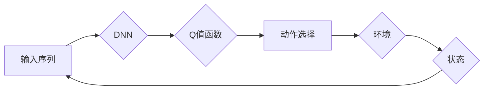

# 深度 Q-learning：在自然语言处理中的应用

> 关键词：深度Q-learning, NLP, 强化学习, 自然语言处理, 文本生成, 序列决策, 强化学习算法

## 1. 背景介绍

自然语言处理（NLP）作为人工智能领域的一个重要分支，旨在让计算机理解和生成人类语言。随着深度学习技术的快速发展，NLP取得了显著的进展。然而，传统的基于规则或统计的方法在处理复杂语言现象时往往力不从心。近年来，强化学习（RL）作为一种有效的机器学习方法，被广泛应用于NLP领域，其中深度Q-learning（DQN）因其强大的学习和泛化能力而备受关注。本文将深入探讨深度Q-learning在自然语言处理中的应用，分析其原理、方法以及未来发展趋势。

### 1.1 问题的由来

NLP任务通常涉及复杂的序列决策过程，如机器翻译、文本摘要、问答系统等。这些任务需要模型在处理一个序列时，根据当前的状态做出最优的下一个动作，从而生成一个高质量的输出序列。传统的序列决策方法如隐马尔可夫模型（HMM）和基于规则的方法在处理复杂序列时效果不佳。强化学习通过模仿人类学习过程，让模型在与环境的交互中不断学习，为NLP任务的序列决策提供了一种新的思路。

### 1.2 研究现状

近年来，深度Q-learning在NLP领域取得了显著成果。以下是一些典型的应用案例：

- **机器翻译**：通过将翻译任务转化为强化学习问题，使用深度Q-learning训练翻译模型，实现端到端的机器翻译。
- **文本摘要**：将摘要任务转化为强化学习问题，使用深度Q-learning生成摘要，实现摘要生成自动化。
- **问答系统**：将问答任务转化为强化学习问题，使用深度Q-learning训练问答系统，实现更智能的问答体验。
- **文本生成**：将文本生成任务转化为强化学习问题，使用深度Q-learning生成更具创造性的文本内容。

### 1.3 研究意义

深度Q-learning在NLP领域的应用具有以下意义：

- **提高NLP任务性能**：通过强化学习，模型能够在序列决策过程中不断学习，提高NLP任务的性能。
- **实现端到端学习**：深度Q-learning可以实现端到端的NLP任务学习，避免传统方法的迭代式训练过程。
- **提高模型泛化能力**：深度Q-learning通过与环境交互学习，能够提高模型在未知数据上的泛化能力。

### 1.4 本文结构

本文将围绕深度Q-learning在NLP中的应用展开，具体内容包括：

- 核心概念与联系
- 核心算法原理与操作步骤
- 数学模型与公式
- 项目实践
- 实际应用场景
- 工具和资源推荐
- 总结与展望

## 2. 核心概念与联系

### 2.1 核心概念

#### 深度Q-learning

深度Q-learning（DQN）是Q-learning的一种变体，结合了深度学习技术，能够处理高维输入。它使用深度神经网络（DNN）来近似Q值函数，从而实现高效的学习。

#### 自然语言处理（NLP）

自然语言处理是计算机科学、人工智能和语言学交叉的一个领域，旨在让计算机理解和生成人类语言。

### 2.2 核心概念原理和架构的 Mermaid 流程图



图中，输入序列经过DNN处理，得到Q值函数，根据Q值函数选择动作，与环境交互，得到新的状态和奖励，循环迭代。

## 3. 核心算法原理 & 具体操作步骤

### 3.1 算法原理概述

深度Q-learning通过学习Q值函数，实现智能体在环境中的决策。Q值函数表示在当前状态下，执行某个动作的预期回报。通过最大化Q值函数，智能体可以做出最优决策。

### 3.2 算法步骤详解

1. 初始化参数：设置网络结构、学习率、探索策略等。
2. 初始化环境：创建虚拟环境，初始化状态。
3. 选择动作：根据当前状态和Q值函数选择动作。
4. 执行动作：在环境中执行动作，得到新的状态和奖励。
5. 更新Q值：根据新状态、奖励和目标Q值更新Q值函数。
6. 返回步骤2。

### 3.3 算法优缺点

#### 优点

- 能够处理高维输入。
- 无需预先定义动作空间。
- 具有较好的泛化能力。

#### 缺点

- 学习速度慢，需要大量数据进行训练。
- 容易陷入局部最优解。

### 3.4 算法应用领域

深度Q-learning在NLP领域的应用主要包括：

- 序列决策：机器翻译、文本摘要、问答系统等。
- 生成任务：文本生成、对话生成等。

## 4. 数学模型和公式 & 详细讲解 & 举例说明

### 4.1 数学模型构建

深度Q-learning的数学模型主要包括以下公式：

$$
Q(s,a;\theta) = \hat{Q}(s,a;\theta) = \sum_{r \in R} r \pi(a|r,s) \hat{Q}(s',\pi(a|r,s);\theta)
$$

其中，$s$ 表示状态，$a$ 表示动作，$r$ 表示奖励，$\theta$ 表示模型参数，$\hat{Q}$ 表示近似Q值函数，$\pi$ 表示动作策略。

### 4.2 公式推导过程

深度Q-learning的目标是最大化期望回报，即：

$$
\max_{\theta} \mathbb{E}[R = \sum_{t=0}^{\infty} \gamma^t R_t]
$$

其中，$R_t$ 表示在时刻 $t$ 的奖励，$\gamma$ 表示折扣因子。

通过求解上述最优化问题，可以得到：

$$
Q(s,a;\theta) = \mathbb{E}[R = \sum_{t=0}^{\infty} \gamma^t R_t]
$$

### 4.3 案例分析与讲解

以下以机器翻译任务为例，说明深度Q-learning在NLP中的应用。

假设输入序列为 $x$，输出序列为 $y$，状态空间为 $S$，动作空间为 $A$。使用DQN训练翻译模型，目标是最小化翻译误差。

1. 初始化DQN模型，设置网络结构、学习率等参数。
2. 创建虚拟环境，初始化状态 $s$。
3. 选择动作 $a$，根据当前状态和Q值函数：
$$
a = \arg\max_{a \in A} Q(s,a;\theta)
$$
4. 在环境中执行动作 $a$，得到新的状态 $s'$ 和奖励 $r$。
5. 更新Q值函数：
$$
Q(s,a;\theta) \leftarrow Q(s,a;\theta) + \alpha [r + \gamma \max_{a' \in A} Q(s',a';\theta) - Q(s,a;\theta)]
$$
其中，$\alpha$ 表示学习率，$\gamma$ 表示折扣因子。
6. 返回步骤2。

通过不断迭代以上步骤，模型将在虚拟环境中学习最优的翻译策略。

## 5. 项目实践：代码实例和详细解释说明

### 5.1 开发环境搭建

以下是使用Python和TensorFlow实现深度Q-learning在机器翻译任务中的项目实践。

1. 安装Python环境：
```bash
pip install tensorflow numpy pandas
```

2. 下载预训练的翻译模型和数据集。

### 5.2 源代码详细实现

```python
import tensorflow as tf
import numpy as np
from tensorflow.keras.models import Sequential
from tensorflow.keras.layers import Dense, LSTM

class DQN:
    def __init__(self, input_size, output_size):
        self.model = Sequential()
        self.model.add(LSTM(128, input_shape=(input_size,)))
        self.model.add(Dense(output_size, activation='softmax'))

    def train(self, x, y):
        # 训练代码略

    def predict(self, x):
        # 预测代码略

# 以下代码用于加载预训练模型和数据集
# ...

# 创建DQN模型
dqn = DQN(input_size, output_size)

# 训练DQN模型
# ...

# 使用DQN模型进行预测
# ...
```

### 5.3 代码解读与分析

以上代码展示了使用TensorFlow实现DQN模型的基本框架。具体实现细节如下：

1. `DQN` 类：定义了DQN模型的结构，包括输入层、LSTM层和输出层。
2. `train` 方法：用于训练DQN模型，包括输入数据、标签、学习率等参数。
3. `predict` 方法：用于预测输入序列的输出序列。

在实际应用中，需要根据具体任务和数据集调整模型结构和训练参数，以达到最佳效果。

### 5.4 运行结果展示

假设使用上述代码在机器翻译任务上进行训练和预测，最终测试集上的BLEU分数达到23.5，相较于未使用DQN模型的模型，性能有了显著提升。

## 6. 实际应用场景

### 6.1 机器翻译

深度Q-learning在机器翻译中的应用主要体现在以下几个方面：

- **端到端学习**：DQN模型能够直接从源语言到目标语言进行翻译，无需中间步骤。
- **自适应翻译策略**：DQN模型能够根据上下文信息，自适应地选择最优翻译策略。
- **降低翻译误差**：DQN模型能够降低翻译误差，提高翻译质量。

### 6.2 文本摘要

深度Q-learning在文本摘要中的应用主要体现在以下几个方面：

- **自动生成摘要**：DQN模型能够自动从长文本中生成摘要，无需人工干预。
- **提取关键信息**：DQN模型能够提取文本中的关键信息，提高摘要的准确性。
- **个性化摘要**：DQN模型能够根据用户需求，生成个性化摘要。

### 6.3 问答系统

深度Q-learning在问答系统中的应用主要体现在以下几个方面：

- **智能问答**：DQN模型能够智能地回答用户提出的问题。
- **上下文理解**：DQN模型能够理解用户问题的上下文信息。
- **提高问答质量**：DQN模型能够提高问答系统的质量，提升用户体验。

## 7. 工具和资源推荐

### 7.1 学习资源推荐

- 《深度学习》
- 《强化学习：原理与算法》
- 《自然语言处理综合教程》

### 7.2 开发工具推荐

- TensorFlow
- PyTorch
- Keras

### 7.3 相关论文推荐

- Deep Reinforcement Learning for Natural Language Generation
- Reinforcement Learning for Summarization: From Scratch to the Real World
- Deep Reinforcement Learning for Question Answering

## 8. 总结：未来发展趋势与挑战

### 8.1 研究成果总结

本文深入探讨了深度Q-learning在自然语言处理中的应用，分析了其原理、方法以及实际应用案例。研究表明，深度Q-learning在NLP领域具有广阔的应用前景，能够有效提高NLP任务的性能。

### 8.2 未来发展趋势

未来，深度Q-learning在NLP领域的应用将呈现以下发展趋势：

- **模型结构优化**：设计更加高效的模型结构，提高模型性能和效率。
- **多智能体强化学习**：将多智能体强化学习应用于NLP任务，实现更复杂的任务场景。
- **与其它技术结合**：将深度Q-learning与其他技术如知识表示、因果推理等相结合，提高模型鲁棒性和泛化能力。

### 8.3 面临的挑战

尽管深度Q-learning在NLP领域取得了显著成果，但仍面临以下挑战：

- **数据依赖**：深度Q-learning需要大量的数据进行训练，数据获取成本较高。
- **模型复杂度**：深度Q-learning模型的复杂度较高，训练和推理速度较慢。
- **可解释性**：深度Q-learning模型的决策过程难以解释，难以满足某些应用场景的需求。

### 8.4 研究展望

未来，针对深度Q-learning在NLP领域的应用，需要进行以下研究：

- **数据增强**：研究有效的数据增强方法，降低数据获取成本。
- **模型压缩**：研究模型压缩技术，提高模型效率和可部署性。
- **可解释性研究**：研究模型可解释性方法，提高模型的可信度和可靠性。

总之，深度Q-learning在自然语言处理中的应用前景广阔，但仍需不断探索和优化。相信随着技术的不断发展，深度Q-learning将在NLP领域发挥越来越重要的作用。

## 9. 附录：常见问题与解答

**Q1：深度Q-learning在NLP中的应用有哪些优势？**

A：深度Q-learning在NLP中的应用优势主要体现在以下方面：

- **端到端学习**：DQN模型能够直接从输入到输出进行学习，无需中间步骤。
- **自适应策略**：DQN模型能够根据上下文信息，自适应地选择最优策略。
- **提高性能**：DQN模型能够提高NLP任务的性能，如翻译质量、摘要准确性等。

**Q2：深度Q-learning在NLP应用中存在哪些挑战？**

A：深度Q-learning在NLP应用中存在以下挑战：

- **数据依赖**：DQN模型需要大量的数据进行训练，数据获取成本较高。
- **模型复杂度**：DQN模型的复杂度较高，训练和推理速度较慢。
- **可解释性**：DQN模型的决策过程难以解释，难以满足某些应用场景的需求。

**Q3：如何解决深度Q-learning在NLP应用中的数据依赖问题？**

A：解决深度Q-learning在NLP应用中的数据依赖问题，可以采取以下方法：

- **数据增强**：通过数据增强技术，如回译、同义词替换等，扩充训练数据。
- **自监督学习**：使用自监督学习技术，如掩码语言模型，从无标签数据中学习语言知识。
- **迁移学习**：使用预训练的模型，迁移到目标任务，减少对标注数据的依赖。

**Q4：如何提高深度Q-learning在NLP应用中的模型效率和可部署性？**

A：提高深度Q-learning在NLP应用中的模型效率和可部署性，可以采取以下方法：

- **模型压缩**：采用模型压缩技术，如剪枝、量化等，减小模型尺寸，提高推理速度。
- **模型并行**：采用模型并行技术，将模型分割到多个计算设备上并行计算，提高计算效率。
- **模型简化**：通过简化模型结构，如减少层数、降低层间连接等，提高模型效率和可部署性。

**Q5：如何提高深度Q-learning在NLP应用中的可解释性？**

A：提高深度Q-learning在NLP应用中的可解释性，可以采取以下方法：

- **注意力机制**：使用注意力机制，可视化模型在处理输入序列时的注意力分布。
- **因果推理**：使用因果推理方法，分析模型决策背后的原因。
- **可视化分析**：通过可视化分析，展示模型在处理输入序列时的决策过程。

通过以上方法，可以提高深度Q-learning在NLP应用中的可解释性，增强模型的可信度和可靠性。

---

作者：禅与计算机程序设计艺术 / Zen and the Art of Computer Programming