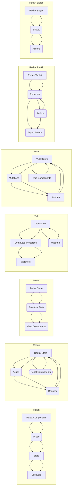

> 状态管理, React, Redux, MobX, Vue, Vuex, Redux Toolkit, Redux Sagas, 上下文 (Context), React Hooks

# 状态管理 原理与代码实例讲解

> 关键词：状态管理, React, Redux, MobX, Vue, Vuex, Redux Toolkit, Redux Sagas, 上下文 (Context), React Hooks

## 1. 背景介绍

在软件开发中，状态管理是一个至关重要的概念，尤其是在构建复杂的前端应用时。状态管理指的是如何组织、存储和同步应用程序中各个组件的状态。随着应用的复杂性增加，手动管理状态变得越来越困难，因此出现了多种状态管理库和框架，如Redux、MobX、Vuex等，它们旨在简化状态的管理，提高应用的性能和可维护性。

### 1.1 问题的由来

随着前端框架的发展，如React、Vue和Angular，前端应用变得越来越复杂。以下是一些导致状态管理困难的问题：

- 组件间通信：随着组件数量的增加，组件之间的通信变得复杂，难以追踪数据流动。
- 状态更新：在组件间共享和更新状态需要编写冗长的代码，容易出错。
- 可维护性：手动管理状态使得代码难以维护和理解。
- 性能：不当的状态管理可能导致不必要的渲染和性能问题。

### 1.2 研究现状

为了解决这些问题，开发者们开发了多种状态管理库和框架：

- **Redux**：一个用于React的状态管理库，使用单一的状态树来存储整个应用的状态。
- **MobX**：一个基于 observable 响应式的状态管理库，通过跟踪变化来自动更新组件。
- **Vuex**：一个用于Vue的状态管理库，提供了集中的状态存储和全局状态管理。
- **Redux Toolkit**：一个基于 Redux 的现代工具包，简化了 Redux 的使用。
- **Redux Sagas**：一个扩展 Redux 的库，用于处理异步操作和副作用。

### 1.3 研究意义

良好的状态管理可以带来以下好处：

- **可预测性**：状态的变化是可预测的，使得调试和测试变得更加容易。
- **可维护性**：代码结构清晰，易于维护和理解。
- **可重用性**：状态管理库和框架支持组件和状态的复用。
- **性能优化**：减少不必要的渲染，提高应用的性能。

### 1.4 本文结构

本文将分为以下几个部分：

- 核心概念与联系
- 核心算法原理 & 具体操作步骤
- 数学模型和公式 & 详细讲解 & 举例说明
- 项目实践：代码实例和详细解释说明
- 实际应用场景
- 工具和资源推荐
- 总结：未来发展趋势与挑战
- 附录：常见问题与解答

## 2. 核心概念与联系

### 2.1 核心概念原理和架构的 Mermaid 流程图



### 2.2 核心概念解释

- **React Components**：React组件是构成React应用的基石，它们可以接收props（属性）和state（状态）。
- **Props**：Props是组件外部的数据，用于从父组件向子组件传递信息。
- **State**：State是组件内部的数据，用于组件自身的状态管理。
- **Lifecycle**：组件的生命周期方法，如`componentDidMount`、`componentWillUnmount`等，用于在组件生命周期中执行代码。
- **Redux Store**：Redux的集中状态存储，负责存储整个应用的状态。
- **Action**：Action是一个描述发生了什么的对象，用于触发状态的变化。
- **Reducer**：Reducer是一个函数，用于根据action更新state。
- **MobX Store**：MobX的响应式状态存储，任何状态的变化都会自动触发视图的更新。
- **Reactive State**：MobX中的响应式状态，任何状态的变化都会自动通知视图进行更新。
- **View Components**：视图组件，根据响应式状态自动更新。
- **Vue State**：Vue中的状态，存储在组件的data对象中。
- **Computed Properties**：Vue中的计算属性，根据data中的状态自动计算得到。
- **Watchers**：Vue中的观察者，监听data中的状态变化，并执行相关操作。
- **Vuex Store**：Vuex的集中状态存储，负责存储整个应用的状态。
- **Mutations**：Vuex中的同步状态更新函数。
- **Actions**：Vuex中的异步状态更新函数。
- **Vue Components**：Vue组件，根据Vuex中的状态进行渲染。
- **Redux Toolkit**：Redux的现代化工具包，简化了Redux的使用。
- **Reducers**：Redux Toolkit中的reducer生成器，用于创建reducers。
- **Actions**：Redux Toolkit中的action创建器，用于创建actions。
- **Async Actions**：Redux Toolkit中的异步action创建器，用于处理异步操作。
- **Redux Sagas**：Redux的副作用处理库，用于处理异步操作和副作用。
- **Effects**：Redux Sagas中的副作用，如API调用、定时器等。
- **Async Actions**：Redux Sagas中的异步actions，用于执行副作用。

## 3. 核心算法原理 & 具体操作步骤

### 3.1 算法原理概述

状态管理库和框架通常遵循以下原理：

- **单一状态树**：所有组件的状态都存储在一个集中位置，便于管理和追踪。
- **不可变数据**：状态是不可变的，任何状态的变化都通过创建新的状态来体现。
- **函数式更新**：状态的变化通过函数式更新来体现，易于追踪和理解。
- **异步更新**：状态的变化可以通过异步操作来实现，如API调用、定时器等。

### 3.2 算法步骤详解

以下是使用Redux进行状态管理的步骤：

1. **定义Action**：Action是一个描述发生了什么的对象，通常包含type和payload两个属性。
2. **创建Reducer**：Reducer是一个函数，用于根据action更新state。
3. **创建Store**：Store是Redux的集中状态存储，用于存储整个应用的状态，并提供dispatch和subscribe等方法。
4. **连接组件与Store**：使用Provider组件将Store提供给所有子组件，以便它们可以访问状态和dispatch actions。
5. **在组件中使用状态和actions**：组件可以通过connect函数连接到Store，从而访问状态和dispatch actions。

### 3.3 算法优缺点

#### 优点：

- **可预测性**：状态的变化是可预测的，使得调试和测试变得更加容易。
- **可维护性**：代码结构清晰，易于维护和理解。
- **可重用性**：状态管理库和框架支持组件和状态的复用。
- **性能优化**：减少不必要的渲染，提高应用的性能。

#### 缺点：

- **学习曲线**：需要学习新的概念和API。
- **复杂性**：对于小型应用，引入状态管理库可能会增加不必要的复杂性。
- **性能问题**：对于大型应用，状态管理库可能会带来性能问题。

### 3.4 算法应用领域

状态管理库和框架适用于以下应用领域：

- **Web应用**：如React、Vue和Angular应用。
- **移动应用**：如React Native和Flutter应用。
- **桌面应用**：如Electron应用。

## 4. 数学模型和公式 & 详细讲解 & 举例说明

### 4.1 数学模型构建

在状态管理中，数学模型通常涉及到以下概念：

- **State**：状态是一个数据结构，用于存储组件或应用的数据。
- **Action**：动作是一个描述发生了什么的对象。
- **Reducer**：Reducer是一个函数，用于根据动作更新状态。

以下是一个简单的数学模型示例：

$$
\text{state} = \text{applyReducer}(\text{state}, \text{action})
$$

其中，applyReducer是一个函数，用于根据动作更新状态。

### 4.2 公式推导过程

以下是一个简单的状态更新公式：

$$
\text{newState} = \text{oldState} + \text{action.payload}
$$

其中，newState是新的状态，oldState是旧的状态，action.payload是动作携带的数据。

### 4.3 案例分析与讲解

以下是一个简单的React组件，使用Redux进行状态管理：

```jsx
import React from 'react';
import { connect } from 'react-redux';

const Counter = ({ count, increment, decrement }) => (
  <div>
    <p>Count: {count}</p>
    <button onClick={increment}>Increment</button>
    <button onClick={decrement}>Decrement</button>
  </div>
);

const mapStateToProps = (state) => ({
  count: state.count,
});

const mapDispatchToProps = (dispatch) => ({
  increment: () => dispatch({ type: 'INCREMENT' }),
  decrement: () => dispatch({ type: 'DECREMENT' }),
});

export default connect(mapStateToProps, mapDispatchToProps)(Counter);
```

在这个例子中，Counter组件通过connect函数连接到Redux的Store，从而可以访问状态和dispatch actions。

## 5. 项目实践：代码实例和详细解释说明

### 5.1 开发环境搭建

以下是使用React和Redux进行状态管理的开发环境搭建步骤：

1. 创建一个新项目：`npx create-react-app my-app`
2. 安装Redux和React-Redux库：`npm install redux react-redux`
3. 创建一个Redux Store：`src/store.js`
4. 创建一个Reducer：`src/reducers/counterReducer.js`
5. 创建一个Action Creator：`src/actions/counterActions.js`
6. 在组件中使用Redux：`src/Counter.js`

### 5.2 源代码详细实现

以下是`src/store.js`的代码：

```javascript
import { createStore } from 'redux';
import counterReducer from './reducers/counterReducer';

const store = createStore(counterReducer);

export default store;
```

以下是`src/reducers/counterReducer.js`的代码：

```javascript
const initialState = {
  count: 0,
};

const counterReducer = (state = initialState, action) => {
  switch (action.type) {
    case 'INCREMENT':
      return { ...state, count: state.count + 1 };
    case 'DECREMENT':
      return { ...state, count: state.count - 1 };
    default:
      return state;
  }
};

export default counterReducer;
```

以下是`src/actions/counterActions.js`的代码：

```javascript
export const increment = () => ({
  type: 'INCREMENT',
});

export const decrement = () => ({
  type: 'DECREMENT',
});
```

以下是`src/Counter.js`的代码：

```jsx
import React from 'react';
import { connect } from 'react-redux';
import { increment, decrement } from './actions/counterActions';

const Counter = ({ count, increment, decrement }) => (
  <div>
    <p>Count: {count}</p>
    <button onClick={increment}>Increment</button>
    <button onClick={decrement}>Decrement</button>
  </div>
);

const mapStateToProps = (state) => ({
  count: state.count,
});

const mapDispatchToProps = (dispatch) => ({
  increment: () => dispatch(increment()),
  decrement: () => dispatch(decrement()),
});

export default connect(mapStateToProps, mapDispatchToProps)(Counter);
```

### 5.3 代码解读与分析

在这个例子中，我们创建了一个简单的计数器应用。首先，我们定义了一个Reducer `counterReducer`，用于更新计数器的状态。然后，我们创建了一个Action Creator `counterActions`，用于生成actions。最后，我们在Counter组件中连接到Redux的Store，从而可以访问状态和dispatch actions。

### 5.4 运行结果展示

运行`npm start`命令，你将看到一个简单的计数器应用。点击“Increment”和“Decrement”按钮，计数器的值会发生变化。

## 6. 实际应用场景

### 6.1 Web应用

状态管理库和框架在Web应用中得到了广泛的应用，以下是一些常见的应用场景：

- 用户认证和授权
- 数据表单处理
- 购物车管理
- 内容管理
- 任务调度

### 6.2 移动应用

在移动应用中，状态管理库和框架同样重要，以下是一些常见的应用场景：

- 用户界面状态管理
- 数据库操作
- 位置跟踪
- 通知管理
- 用户体验优化

### 6.3 桌面应用

在桌面应用中，状态管理库和框架可以用于：

- 应用设置管理
- 用户数据存储
- 界面布局管理
- 资源管理
- 系统事件处理

## 7. 工具和资源推荐

### 7.1 学习资源推荐

- React官方文档：[https://reactjs.org/docs/getting-started.html](https://reactjs.org/docs/getting-started.html)
- Redux官方文档：[https://redux.js.org/introduction](https://redux.js.org/introduction)
- MobX官方文档：[https://mobx.js.org/docs/getting-started.html](https://mobx.js.org/docs/getting-started.html)
- Vue官方文档：[https://vuejs.org/v2/guide/](https://vuejs.org/v2/guide/)
- Vuex官方文档：[https://vuex.vuejs.org/](https://vuex.vuejs.org/)

### 7.2 开发工具推荐

- Redux DevTools：[https://redux.js.org/introduction](https://redux.js.org/introduction)
- Redux Toolkit：[https://redux-toolkit.js.org/](https://redux-toolkit.js.org/)
- MobX DevTools：[https://github.com/mobxjs/mobx-devtools](https://github.com/mobxjs/mobx-devtools)
- Vuex DevTools：[https://vuex.vuejs.org/guide/intro.html](https://vuex.vuejs.org/guide/intro.html)

### 7.3 相关论文推荐

- "Flux: A React Architecture for Building User Interfaces"：介绍了React的架构和Flux模式。
- "You might not need Redux"：讨论了是否真的需要Redux。
- "MobX: React with More Or Less State"：介绍了MobX的核心概念。
- "Vuex: A Modular Data Store for Vue.js"：介绍了Vuex的核心概念。

## 8. 总结：未来发展趋势与挑战

### 8.1 研究成果总结

本文介绍了状态管理的概念、原理和应用，并通过代码实例讲解了如何使用Redux进行状态管理。状态管理库和框架为开发者提供了强大的工具，用于管理复杂应用的状态，提高应用的性能和可维护性。

### 8.2 未来发展趋势

未来，状态管理技术将朝着以下方向发展：

- **更简单的API**：状态管理库和框架将提供更简单的API，降低学习曲线。
- **更好的性能**：状态管理库和框架将提供更好的性能，减少不必要的渲染和计算。
- **更灵活的架构**：状态管理库和框架将提供更灵活的架构，支持更多种类的应用场景。

### 8.3 面临的挑战

状态管理技术面临的挑战包括：

- **学习曲线**：状态管理库和框架的API和概念需要开发者学习。
- **复杂性**：对于小型应用，引入状态管理库可能会增加不必要的复杂性。
- **性能问题**：对于大型应用，状态管理库可能会带来性能问题。

### 8.4 研究展望

未来，状态管理技术的研究将主要集中在以下方面：

- **无状态架构**：探索无状态架构，减少状态管理的复杂性。
- **更智能的状态管理**：开发更智能的状态管理库和框架，自动处理常见的状态管理问题。
- **跨框架状态管理**：开发跨框架的状态管理库和框架，支持不同前端框架。

## 9. 附录：常见问题与解答

**Q1：为什么需要状态管理？**

A1：随着应用复杂性的增加，手动管理状态变得越来越困难，容易出错。状态管理库和框架提供了一种集中管理状态的方法，简化了状态的管理，提高了应用的性能和可维护性。

**Q2：Redux和MobX哪个更好？**

A2：Redux和MobX各有优缺点，选择哪个取决于具体的应用场景和开发者的偏好。Redux的优点是社区支持强大，有成熟的生态系统，而MobX的优点是学习曲线较低，代码更简洁。

**Q3：状态管理库和框架如何提高性能？**

A3：状态管理库和框架通过以下方式提高性能：

- **减少不必要的渲染**：通过优化渲染策略，减少不必要的渲染。
- **减少计算**：通过优化计算策略，减少不必要的计算。
- **内存优化**：通过优化内存使用，减少内存占用。

**Q4：如何选择合适的状态管理库和框架？**

A4：选择合适的状态管理库和框架需要考虑以下因素：

- **应用场景**：根据应用场景选择合适的状态管理库和框架。
- **开发团队**：考虑开发团队的熟悉程度和偏好。
- **社区支持**：考虑社区支持和生态系统。

**Q5：状态管理库和框架如何与后端集成？**

A5：状态管理库和框架通常与后端通过API进行集成。开发者可以使用HTTP请求或WebSocket将状态数据从后端获取到前端，然后通过状态管理库和框架进行管理。

作者：禅与计算机程序设计艺术 / Zen and the Art of Computer Programming