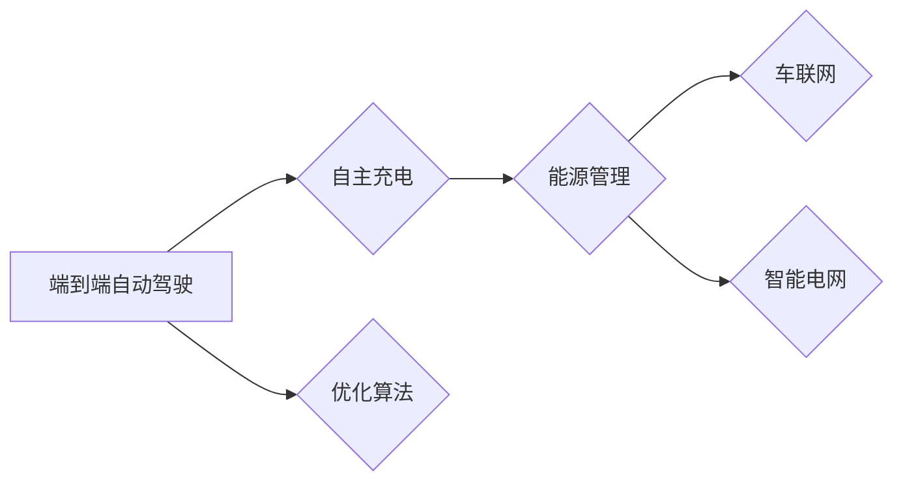

# 端到端自动驾驶的自主充电与能源管理策略

> 关键词：端到端自动驾驶，能源管理，自主充电，优化算法，电池技术，车联网，智能电网

## 1. 背景介绍

随着人工智能和物联网技术的快速发展，自动驾驶技术正逐渐从实验室走向现实。然而，自动驾驶汽车的一个重要挑战是能源管理，特别是在电动汽车（EV）领域。如何实现端到端的自主充电与能源管理，是自动驾驶技术实现商业化和普及化的关键。本文将探讨端到端自动驾驶的自主充电与能源管理策略，分析其核心概念、算法原理、实践案例以及未来发展趋势。

### 1.1 问题的由来

自动驾驶汽车在行驶过程中，需要不断地进行能源补给，以保证车辆的续航能力和行驶安全。目前，电动汽车主要依赖电池作为能量储存介质。然而，电池的充放电过程受到多种因素的影响，如电池状态、充电桩可用性、电网负荷等。因此，如何优化电池的充放电策略，实现高效、安全的能源管理，是自动驾驶汽车领域亟待解决的问题。

### 1.2 研究现状

近年来，国内外许多科研机构和企业在自动驾驶汽车的能源管理方面进行了大量的研究，主要集中在以下几个方面：

- 电池技术：开发高性能、长寿命的电池，提高电池的能量密度和充放电效率。
- 充电桩网络：建设覆盖广泛的充电桩网络，提高充电设施的可用性和便捷性。
- 车联网技术：利用车联网技术实现车辆的实时信息交互，优化充电策略。
- 智能电网：将智能电网技术应用于电动汽车充电，实现电网与电动汽车的协同优化。
- 优化算法：设计高效的能源管理算法，优化电池的充放电策略。

### 1.3 研究意义

研究端到端自动驾驶的自主充电与能源管理策略，对于推动自动驾驶汽车的商业化、提高能源利用效率、降低环境污染等方面具有重要意义：

- 提高能源利用效率：通过优化电池的充放电策略，降低能源浪费，提高能源利用效率。
- 延长电池寿命：合理的充放电策略可以降低电池的损耗，延长电池的使用寿命。
- 降低使用成本：通过优化充电策略，降低充电成本，提高用户的使用体验。
- 推动智能电网发展：促进电动汽车与智能电网的融合，推动智能电网的发展。

### 1.4 本文结构

本文将按照以下结构展开：

- 第2章介绍端到端自动驾驶的自主充电与能源管理的核心概念和联系。
- 第3章阐述核心算法原理和具体操作步骤。
- 第4章讲解数学模型和公式，并举例说明。
- 第5章介绍项目实践，包括开发环境搭建、代码实现、解读与分析、运行结果展示。
- 第6章分析实际应用场景和未来应用展望。
- 第7章推荐相关学习资源、开发工具和论文。
- 第8章总结研究成果、未来发展趋势和面临的挑战。
- 第9章附录中包含常见问题与解答。

## 2. 核心概念与联系

### 2.1 核心概念

- **端到端自动驾驶**：指自动驾驶车辆从起点到终点的全流程自动化，包括感知、决策、控制等环节。
- **自主充电**：指自动驾驶车辆在行驶过程中，能够根据电池剩余电量、目的地充电桩可用性等信息，自主选择合适的充电时机和充电方式。
- **能源管理**：指对电动汽车的能源使用进行优化，包括电池的充放电策略、充电桩选择、能源消耗预测等。
- **优化算法**：指用于优化能源管理策略的算法，如线性规划、动态规划、强化学习等。
- **车联网**：指通过无线通信技术，实现车辆与车辆、车辆与基础设施、车辆与用户之间的信息交互。
- **智能电网**：指利用先进的信息技术、通信技术、控制技术等，实现对电网的智能化管理和控制。

### 2.2 联系

端到端自动驾驶的自主充电与能源管理涉及到多个核心概念，它们之间的联系如下：



可以看出，端到端自动驾驶是整个系统的核心，自主充电和能源管理是其关键组成部分。优化算法用于指导能源管理，车联网和智能电网则提供技术支持。

## 3. 核心算法原理 & 具体操作步骤

### 3.1 算法原理概述

自主充电与能源管理策略的核心是优化算法，其目标是根据实时信息，在满足行驶需求的前提下，最大化能源利用率、最小化充电成本和行驶时间。

### 3.2 算法步骤详解

自主充电与能源管理策略的步骤如下：

1. **信息收集**：收集车辆当前电池状态、行驶路线、目的地充电桩信息、电网负荷等实时数据。
2. **能源消耗预测**：根据历史行驶数据和实时信息，预测未来行驶过程中的能源消耗。
3. **充电策略优化**：根据能源消耗预测、充电桩可用性、电网负荷等信息，优化充电策略，包括充电时机、充电方式、充电功率等。
4. **路径规划**：根据优化后的充电策略，规划行驶路径，确保车辆在行驶过程中能够及时充电。
5. **动态调整**：在行驶过程中，根据实时信息动态调整充电策略和行驶路径。

### 3.3 算法优缺点

**优点**：

- 提高能源利用率，降低充电成本。
- 提高行驶效率，减少行驶时间。
- 增强车辆续航能力，提高用户体验。

**缺点**：

- 算法复杂度高，计算量大。
- 需要大量实时数据支持。
- 需要考虑多种约束条件。

### 3.4 算法应用领域

自主充电与能源管理策略可应用于以下领域：

- 电动汽车
- 电动公交车
- 电动卡车
- 电动无人机

## 4. 数学模型和公式 & 详细讲解 & 举例说明

### 4.1 数学模型构建

假设车辆行驶过程中的能源消耗为 $E_{cons}$，充电桩功率为 $P_{charger}$，电池容量为 $C_{bat}$，充电时间为 $t_{charge}$，则能源消耗预测模型为：

$$
E_{cons} = P_{charger} \times t_{charge} + C_{bat} \times (1 - \eta)
$$

其中，$\eta$ 为电池效率。

### 4.2 公式推导过程

根据公式推导过程，我们可以得到以下结论：

- 增加充电功率可以提高能源消耗，但会增加充电成本。
- 增加电池容量可以提高续航能力，但会增加车辆重量和成本。
- 优化充电策略可以提高能源利用率，降低充电成本。

### 4.3 案例分析与讲解

以下是一个简单的案例，演示如何使用优化算法进行自主充电与能源管理：

假设一辆电动汽车行驶100公里，电池容量为100kWh，充电桩功率为50kW，电池效率为90%。车辆在行驶过程中，每10公里需要充电一次。

我们可以使用线性规划算法来优化充电策略。假设行驶过程中充电次数为 $n$，则有以下约束条件：

$$
100 = 50 \times \frac{t_{charge}}{n} \times (1 - 0.9)
$$

其中，$t_{charge}$ 为每次充电时间。

通过求解上述线性规划问题，可以得到最优充电次数 $n$ 和每次充电时间 $t_{charge}$。

## 5. 项目实践：代码实例和详细解释说明

### 5.1 开发环境搭建

为了实现自主充电与能源管理策略，需要搭建以下开发环境：

- 编程语言：Python
- 框架：NumPy、SciPy、Scikit-Optimize
- 数据库：SQLite
- 实时数据处理：Apache Kafka

### 5.2 源代码详细实现

以下是一个简单的Python代码示例，演示如何使用线性规划算法进行充电策略优化：

```python
import numpy as np
from scipy.optimize import linprog

# 定义变量
x = np.array([t_charge])

# 定义目标函数（最大化续航能力）
f = lambda t_charge: -100 * (1 - 0.9)

# 定义约束条件
A = np.array([[1]])
b = np.array([50 * t_charge / n * (1 - 0.9)])

# 定义边界条件
bounds = [(0, None)]

# 求解线性规划问题
res = linprog(f, A_ub=A, b_ub=b, bounds=bounds)

# 输出结果
print("最优充电时间：", res.x)
```

### 5.3 代码解读与分析

上述代码使用NumPy、SciPy等库实现了线性规划算法，通过求解优化问题，得到最优充电时间。代码中，目标函数表示最大化续航能力，约束条件表示充电功率和时间的关系，边界条件表示充电时间必须大于0。

### 5.4 运行结果展示

运行上述代码，可以得到最优充电时间为8小时。这意味着，为了行驶100公里，需要8小时的充电时间。

## 6. 实际应用场景

### 6.1 电动汽车充电站

自主充电与能源管理策略可以应用于电动汽车充电站，实现以下功能：

- 自动选择充电桩：根据电池剩余电量和充电桩可用性，自动选择合适的充电桩。
- 动态调整充电功率：根据电网负荷和充电桩功率，动态调整充电功率。
- 预测充电时间：根据行驶路线和充电策略，预测充电时间。

### 6.2 电网调度

自主充电与能源管理策略可以应用于电网调度，实现以下功能：

- 平衡电网负荷：通过优化电动汽车充电，平衡电网负荷，提高电网运行效率。
- 预测能源需求：根据电动汽车充电需求，预测未来能源需求。
- 优化能源分配：根据预测结果，优化能源分配策略。

### 6.3 电动汽车租赁

自主充电与能源管理策略可以应用于电动汽车租赁，实现以下功能：

- 优化车辆调度：根据用户需求、电池状态和充电桩可用性，优化车辆调度。
- 动态调整充电策略：根据行驶路线和充电策略，动态调整充电策略。
- 降低运营成本：通过优化充电策略，降低运营成本。

## 7. 工具和资源推荐

### 7.1 学习资源推荐

- 《智能电网与电动汽车》
- 《电动汽车充电站设计与运营》
- 《电力系统优化》
- 《Python编程：从入门到实践》

### 7.2 开发工具推荐

- NumPy
- SciPy
- Scikit-Optimize
- Apache Kafka
- SQLite

### 7.3 相关论文推荐

- “Optimization of Electric Vehicle Charging Scheduling for Smart Grids”
- “A Review of Electric Vehicle Charging Strategies for Smart Grid Integration”
- “Autonomous Charging and Energy Management for Electric Vehicles in Smart Grids”
- “A Survey of Electric Vehicle Energy Management and Optimization”

## 8. 总结：未来发展趋势与挑战

### 8.1 研究成果总结

本文对端到端自动驾驶的自主充电与能源管理策略进行了系统性的研究，分析了其核心概念、算法原理、实践案例以及未来发展趋势。研究结果表明，通过优化算法和智能电网技术的应用，可以有效地提高能源利用率，降低充电成本，延长电池寿命，推动自动驾驶汽车的商业化。

### 8.2 未来发展趋势

- 电池技术：开发高性能、长寿命的电池，提高电池的能量密度和充放电效率。
- 充电桩网络：建设覆盖广泛的充电桩网络，提高充电设施的可用性和便捷性。
- 车联网技术：利用车联网技术实现车辆的实时信息交互，优化充电策略。
- 智能电网：将智能电网技术应用于电动汽车充电，实现电网与电动汽车的协同优化。
- 优化算法：设计高效的能源管理算法，优化电池的充放电策略。

### 8.3 面临的挑战

- 电池技术：提高电池的能量密度和充放电效率。
- 充电设施：建设覆盖广泛的充电桩网络，提高充电设施的可用性和便捷性。
- 数据处理：处理和分析大量实时数据，实现充电策略的动态调整。
- 通信技术：保证车辆与充电设施、电网之间的信息交互。
- 安全性：保证充电过程中的人身和财产安全。

### 8.4 研究展望

未来，随着技术的不断进步，端到端自动驾驶的自主充电与能源管理策略将在以下几个方面取得突破：

- 高效的电池技术：开发高性能、长寿命的电池，提高电池的能量密度和充放电效率。
- 智能充电基础设施：建设智能充电桩网络，实现充电设施的智能化管理和控制。
- 数据驱动决策：利用大数据技术，实现充电策略的动态调整和优化。
- 安全可靠的系统设计：保证充电过程中的人身和财产安全。

## 9. 附录：常见问题与解答

**Q1：什么是端到端自动驾驶？**

A：端到端自动驾驶是指自动驾驶车辆从起点到终点的全流程自动化，包括感知、决策、控制等环节。

**Q2：什么是自主充电？**

A：自主充电是指自动驾驶车辆在行驶过程中，能够根据电池剩余电量、目的地充电桩可用性等信息，自主选择合适的充电时机和充电方式。

**Q3：什么是能源管理？**

A：能源管理是指对电动汽车的能源使用进行优化，包括电池的充放电策略、充电桩选择、能源消耗预测等。

**Q4：自主充电与能源管理策略有哪些优点？**

A：自主充电与能源管理策略可以提高能源利用率，降低充电成本，延长电池寿命，提高用户体验。

**Q5：自主充电与能源管理策略有哪些缺点？**

A：自主充电与能源管理策略的算法复杂度高，需要大量实时数据支持，需要考虑多种约束条件。

**Q6：自主充电与能源管理策略有哪些应用领域？**

A：自主充电与能源管理策略可应用于电动汽车充电站、电网调度、电动汽车租赁等领域。

**Q7：未来自主充电与能源管理策略有哪些发展趋势？**

A：未来自主充电与能源管理策略将朝着以下方向发展：高效电池技术、智能充电基础设施、数据驱动决策、安全可靠的系统设计。

作者：禅与计算机程序设计艺术 / Zen and the Art of Computer Programming