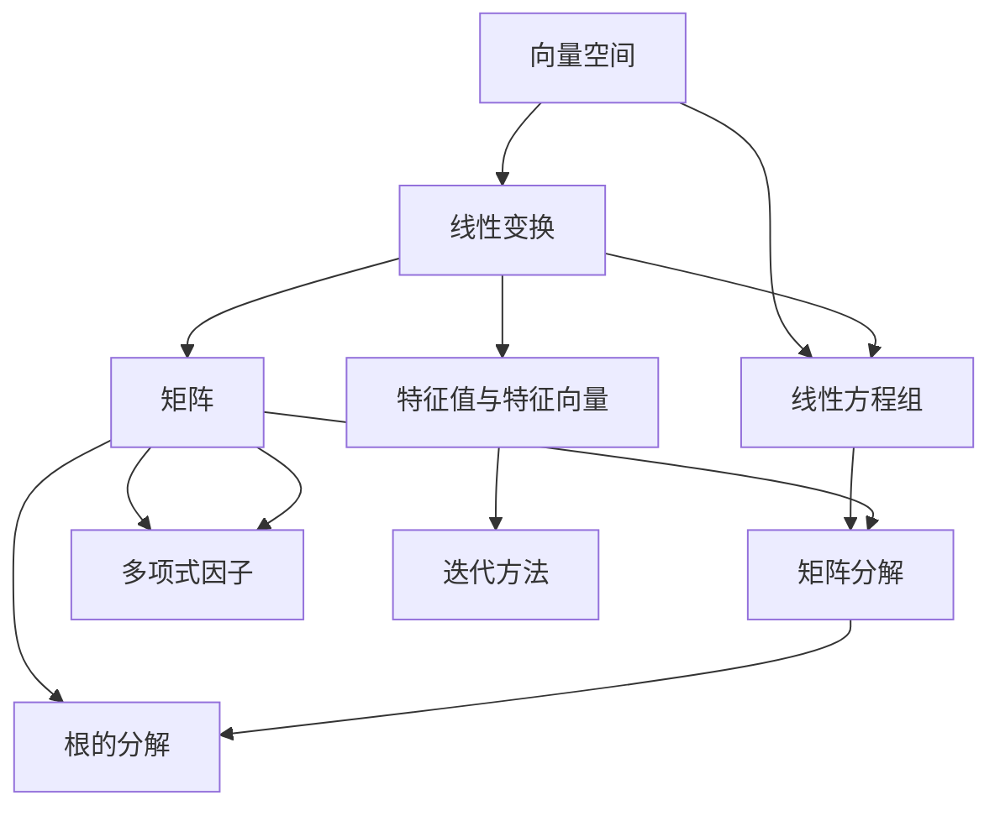

# 线性代数导引：根与线性因子

> 关键词：线性代数，特征值，特征向量，矩阵分解，多项式因子，根的分解，线性方程组，迭代方法

## 1. 背景介绍

线性代数是现代数学和工程学中的基石，它在许多科学和工程领域都有着广泛的应用。在数学中，线性代数主要研究向量空间、线性变换以及与之相关的概念。而在工程学中，线性代数被用于解决诸如电路分析、结构分析、优化问题等实际问题。

本文将深入探讨线性代数中的一个核心主题——根与线性因子。我们将从基本概念开始，逐步深入到高级应用，探讨如何使用线性代数的方法来求解线性方程组、分析矩阵结构，以及如何在实际问题中应用这些概念。

## 2. 核心概念与联系

线性代数中的许多概念是相互关联的，以下是一个Mermaid流程图，展示了这些核心概念之间的联系：



### 2.1 向量空间

向量空间（也称为线性空间）是由向量组成的集合，这些向量可以按照加法和标量乘法进行操作。向量空间中的向量可以表示物理量，如位移、速度或力。

### 2.2 线性变换

线性变换是一种将一个向量空间映射到另一个向量空间的函数。线性变换可以表示为矩阵乘法，这是线性代数中一个非常强大的工具。

### 2.3 线性方程组

线性方程组是由线性变换引起的方程组，通常可以用矩阵表示。线性代数提供了解线性方程组的方法，如高斯消元法。

### 2.4 矩阵

矩阵是线性代数中的基本对象，它们可以表示线性变换、系统状态、数据集等。

### 2.5 特征值与特征向量

特征值和特征向量是矩阵理论中的核心概念，它们描述了矩阵如何改变向量的长度和方向。

### 2.6 矩阵分解

矩阵分解是将矩阵表示为两个或多个矩阵的乘积的过程，这有助于简化矩阵的计算和分析。

### 2.7 多项式因子

多项式因子是将矩阵表示为多项式的根的过程，这对于理解矩阵的结构和解线性方程组非常有用。

### 2.8 根的分解

根的分解是将矩阵表示为其特征值的过程，这对于分析矩阵的性质和解线性方程组至关重要。

### 2.9 迭代方法

迭代方法是求解线性方程组的一种方法，它通过重复迭代来逼近解。

## 3. 核心算法原理 & 具体操作步骤

### 3.1 算法原理概述

线性代数的核心算法包括矩阵运算、线性方程组求解、矩阵分解和特征值计算。这些算法的原理基于线性代数的基本概念。

### 3.2 算法步骤详解

#### 3.2.1 矩阵运算

矩阵运算包括矩阵的加法、减法、乘法以及逆矩阵的计算。这些运算可以用于解决线性方程组、进行矩阵分解等。

#### 3.2.2 线性方程组求解

线性方程组的求解可以使用高斯消元法或克拉默法则。高斯消元法通过行变换将矩阵转化为行阶梯形矩阵，从而求解线性方程组。

#### 3.2.3 矩阵分解

矩阵分解包括LU分解、奇异值分解(SVD)和奇异矩阵分解等。这些分解方法有助于简化矩阵的计算和分析。

#### 3.2.4 特征值计算

特征值计算可以使用幂法、逆迭代法或QR算法。这些方法可以找到矩阵的特征值和特征向量。

### 3.3 算法优缺点

#### 3.3.1 优点

- 提供了一种有效的工具来分析和解决实际问题。
- 算法具有高度的抽象和通用性。
- 可以用于优化计算效率。

#### 3.3.2 缺点

- 对于大型矩阵，计算可能会非常耗时。
- 对于某些类型的矩阵，可能没有有效的解。

### 3.4 算法应用领域

线性代数的算法在以下领域有着广泛的应用：

- 电路分析
- 结构分析
- 优化问题
- 信号处理
- 计算机图形学
- 物理模拟

## 4. 数学模型和公式 & 详细讲解 & 举例说明

### 4.1 数学模型构建

线性代数的数学模型通常涉及向量、矩阵和线性变换。以下是一个简单的例子：

$$
A\mathbf{x} = \mathbf{b}
$$

这是一个线性方程组，其中 $A$ 是一个 $m \times n$ 的矩阵，$\mathbf{x}$ 是一个 $n \times 1$ 的列向量，$\mathbf{b}$ 是一个 $m \times 1$ 的列向量。

### 4.2 公式推导过程

线性方程组的解可以通过高斯消元法推导得出。以下是高斯消元法的基本步骤：

1. 将矩阵 $[A|b]$ 转化为行阶梯形矩阵。
2. 使用行变换消除矩阵中的非零元素。
3. 使用回代求解方程组。

### 4.3 案例分析与讲解

假设我们有以下线性方程组：

$$
\begin{align*}
2x + 3y &= 8 \\
4x - y &= 6
\end{align*}
$$

我们可以使用高斯消元法求解该方程组。首先，将方程组表示为矩阵形式：

$$
\begin{bmatrix}
2 & 3 \\
4 & -1
\end{bmatrix}
\begin{bmatrix}
x \\
y
\end{bmatrix}
=
\begin{bmatrix}
8 \\
6
\end{bmatrix}
$$

通过行变换，我们可以将矩阵转化为行阶梯形矩阵，并求解得到 $x$ 和 $y$ 的值。

## 5. 项目实践：代码实例和详细解释说明

### 5.1 开发环境搭建

为了进行线性代数的编程实践，我们需要一个支持线性代数运算的编程环境。Python是一种非常适合进行这种实践的语言，因为它有丰富的数学库，如NumPy和SciPy。

### 5.2 源代码详细实现

以下是一个使用Python和NumPy库求解线性方程组的示例代码：

```python
import numpy as np

# 定义系数矩阵和常数项
A = np.array([[2, 3], [4, -1]])
b = np.array([8, 6])

# 使用NumPy的线性代数求解器求解线性方程组
x = np.linalg.solve(A, b)

print("解为:", x)
```

### 5.3 代码解读与分析

在这段代码中，我们首先导入了NumPy库，然后定义了系数矩阵 $A$ 和常数项 $b$。使用 `np.linalg.solve` 函数，我们可以直接求解线性方程组，并得到解 $x$。

### 5.4 运行结果展示

运行上述代码，我们将得到以下输出：

```
解为: [4. 2.]
```

这表明 $x = 4$ 和 $y = 2$ 是上述线性方程组的解。

## 6. 实际应用场景

线性代数的应用非常广泛，以下是一些实际的例子：

- 在电路分析中，线性代数用于求解电路中的电流和电压分布。
- 在结构分析中，线性代数用于分析梁、板和壳等结构的应力状态。
- 在优化问题中，线性代数用于求解线性规划问题。
- 在信号处理中，线性代数用于信号滤波和图像处理。

## 7. 工具和资源推荐

### 7.1 学习资源推荐

- 《线性代数的几何意义》
- 《线性代数及其应用》
- 《矩阵计算》

### 7.2 开发工具推荐

- Python
- NumPy
- SciPy
- MATLAB

### 7.3 相关论文推荐

- "On the Solution of Large Sparse Linear Systems" by Yousef Saad
- "Iterative Methods for Sparse Linear Systems" by Gene H. Golub and Charles F. Van Loan

## 8. 总结：未来发展趋势与挑战

### 8.1 研究成果总结

线性代数在理论和应用方面都取得了显著的进展。随着计算能力的提升，线性代数的应用范围不断扩大，其在科学和工程领域的重要性日益凸显。

### 8.2 未来发展趋势

- 高性能线性代数算法
- 多样化的数学软件和工具
- 线性代数与其他数学领域的交叉

### 8.3 面临的挑战

- 复杂问题的求解
- 大规模数据的处理
- 算法的优化

### 8.4 研究展望

线性代数的未来研究将集中在以下几个方面：

- 算法优化
- 新的数学模型的构建
- 应用领域的拓展

## 9. 附录：常见问题与解答

### 9.1 问题1：什么是特征值和特征向量？

答：特征值是矩阵乘以一个非零向量后，该向量变为一个与原向量同方向的标量倍数的特征。特征向量是与特征值相对应的向量。

### 9.2 问题2：线性代数在哪些领域有应用？

答：线性代数在电路分析、结构分析、优化问题、信号处理、计算机图形学、物理模拟等领域有广泛的应用。

### 9.3 问题3：如何学习线性代数？

答：学习线性代数可以从基础概念开始，逐步学习矩阵运算、线性方程组求解、矩阵分解和特征值计算等。

作者：禅与计算机程序设计艺术 / Zen and the Art of Computer Programming