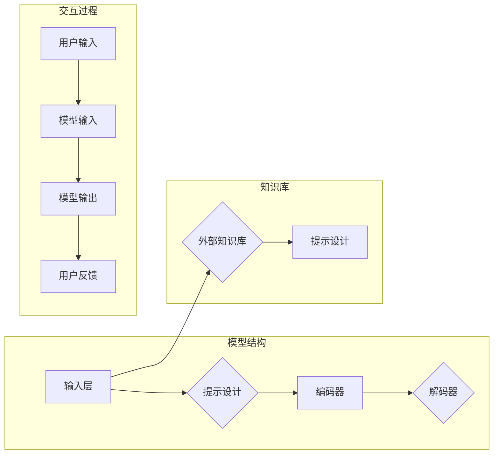

# 聚焦应用自身的 Prompt 设计

> 关键词：Prompt 学习，自然语言生成，对话系统，个性化，用户交互，可解释性，设计原则

## 1. 背景介绍

随着自然语言处理（NLP）技术的飞速发展，基于深度学习的人工智能系统在自然语言生成（NLG）、对话系统、文本摘要、机器翻译等领域取得了显著的进展。其中，Prompt 学习作为一种新兴的研究方向，通过将提示（Prompt）作为输入引导模型生成内容，为这些任务提供了新的解决方案。本文将深入探讨 Prompt 设计的原则和方法，旨在帮助开发者构建更加智能、个性化和可解释的 AI 应用。

### 1.1 问题的由来

传统的 NLP 模型往往需要大量的标注数据进行训练，这在实际应用中存在以下问题：

- **标注成本高**：获取高质量的标注数据需要大量时间和人力，成本高昂。
- **泛化能力有限**：模型在训练数据上的表现良好，但在未见过的数据上可能表现不佳。
- **可解释性差**：模型的决策过程难以解释，不利于用户信任和监管。

Prompt 学习通过将提示作为输入，引导模型生成内容，可以有效地解决上述问题。通过精心设计的提示，模型可以：

- **降低标注需求**：通过提示引导，模型可以生成与标注数据相似的内容，从而减少对标注数据的依赖。
- **提高泛化能力**：通过多样化的提示，模型可以学习到更丰富的知识，提高泛化能力。
- **提升可解释性**：通过分析提示和模型输出之间的关系，可以更好地理解模型的决策过程。

### 1.2 研究现状

Prompt 学习的研究主要集中在以下几个方面：

- **提示设计**：如何设计有效的提示，引导模型生成符合预期内容。
- **提示工程**：如何根据不同的应用场景，选择合适的模型和提示技术。
- **提示评估**：如何评估提示的效果，以及如何改进提示设计。

### 1.3 研究意义

Prompt 学习为 NLP 应用带来了以下意义：

- **降低开发成本**：通过减少标注需求，可以显著降低 AI 应用的开发成本。
- **提高用户体验**：通过个性化的提示，可以提升用户体验，增强用户交互。
- **促进技术进步**：推动 NLP 技术的进一步发展，为 AI 应用的创新提供新的思路。

## 2. 核心概念与联系

### 2.1 核心概念原理

#### Mermaid 流程图



#### 核心概念解释

- **模型结构**：输入层接收用户输入，经过编码器处理，再通过解码器生成输出内容。
- **提示设计**：设计有效的提示，引导模型生成符合预期内容。
- **编码器**：将输入内容转换为模型可理解的内部表示。
- **解码器**：根据内部表示生成输出内容。
- **用户输入**：用户输入的内容作为模型输入。
- **模型输出**：模型生成的输出内容。
- **用户反馈**：用户对模型输出的反馈。
- **外部知识库**：外部知识库可以提供额外的信息，用于提示设计。

### 2.2 核心概念联系

Prompt 学习的核心是提示设计，它将用户输入、模型结构和外部知识库连接起来，形成一个闭环的交互过程。通过不断地调整提示，可以优化模型输出，提升用户体验。

## 3. 核心算法原理 & 具体操作步骤

### 3.1 算法原理概述

Prompt 学习的原理可以概括为以下步骤：

1. 设计提示：根据任务需求和用户输入，设计有效的提示。
2. 模型输入：将提示和用户输入作为模型输入。
3. 模型输出：模型根据输入生成输出内容。
4. 用户反馈：用户对输出内容进行反馈。
5. 调整提示：根据用户反馈调整提示，优化模型输出。

### 3.2 算法步骤详解

#### 步骤 1：设计提示

设计提示是 Prompt 学习的关键步骤。以下是一些设计提示的原则：

- **相关性**：提示应与任务需求和用户输入高度相关，避免无关信息的干扰。
- **清晰性**：提示应简洁明了，易于理解。
- **多样性**：提示应包含多种可能性，以便模型选择合适的输出。
- **可解释性**：提示应包含可解释的信息，以便用户理解模型的决策过程。

#### 步骤 2：模型输入

将提示和用户输入作为模型输入，模型根据输入生成输出内容。

#### 步骤 3：模型输出

模型根据输入生成输出内容。输出内容可以是文本、图像、语音等。

#### 步骤 4：用户反馈

用户对输出内容进行反馈，包括点赞、评论、修改等。

#### 步骤 5：调整提示

根据用户反馈调整提示，优化模型输出。

### 3.3 算法优缺点

#### 优点

- **降低标注需求**：通过提示引导，模型可以生成与标注数据相似的内容，从而减少对标注数据的依赖。
- **提高泛化能力**：通过多样化的提示，模型可以学习到更丰富的知识，提高泛化能力。
- **提升可解释性**：通过分析提示和模型输出之间的关系，可以更好地理解模型的决策过程。

#### 缺点

- **提示设计难度大**：设计有效的提示需要丰富的经验和专业知识。
- **模型依赖性高**：模型的性能对提示设计敏感，需要根据不同的模型进行调整。
- **用户交互成本高**：用户需要参与反馈过程，这可能增加用户交互成本。

### 3.4 算法应用领域

Prompt 学习可以应用于以下领域：

- **自然语言生成**：如文本摘要、机器翻译、对话系统等。
- **图像生成**：如图像描述、风格迁移等。
- **语音合成**：如语音识别、语音合成等。
- **其他领域**：如代码生成、问答系统等。

## 4. 数学模型和公式 & 详细讲解 & 举例说明

### 4.1 数学模型构建

Prompt 学习的数学模型可以概括为以下公式：

$$
\text{output} = \text{model}(\text{input} + \text{prompt})
$$

其中，`output` 为模型输出，`input` 为用户输入，`prompt` 为提示。

### 4.2 公式推导过程

公式推导过程如下：

1. 模型输入：将用户输入和提示拼接，作为模型输入。
2. 模型输出：模型根据输入生成输出内容。
3. 输出内容：输出内容可以表示为 `output = \text{model}(\text{input} + \text{prompt})`。

### 4.3 案例分析与讲解

#### 案例一：文本摘要

假设我们要对一篇新闻进行摘要，用户输入为新闻标题和正文，提示为“以下是对新闻的摘要：”。

- **输入**：新闻标题 + 新闻正文
- **提示**：以下是对新闻的摘要：
- **输出**：摘要文本

#### 案例二：对话系统

假设我们要构建一个简单的对话系统，用户输入为问题，提示为“以下是对问题的回答：”。

- **输入**：用户问题
- **提示**：以下是对问题的回答：
- **输出**：回答文本

## 5. 项目实践：代码实例和详细解释说明

### 5.1 开发环境搭建

以下是使用 Python 和 Hugging Face 的 Transformers 库进行 Prompt 学习的代码示例：

```python
from transformers import GPT2LMHeadModel, GPT2Tokenizer

# 加载预训练模型和分词器
model = GPT2LMHeadModel.from_pretrained('gpt2')
tokenizer = GPT2Tokenizer.from_pretrained('gpt2')

# 设计提示
prompt = "以下是对问题的回答："

# 用户输入
input_text = "如何使用 GPT-2 进行 Prompt 学习？"

# 模型输入
input_ids = tokenizer.encode(prompt + input_text, return_tensors='pt')

# 模型输出
outputs = model.generate(input_ids)

# 解码输出内容
decoded_output = tokenizer.decode(outputs[0], skip_special_tokens=True)

print(decoded_output)
```

### 5.2 源代码详细实现

以上代码首先加载了预训练的 GPT-2 模型和分词器。然后设计了一个提示“以下是对问题的回答：”，并将用户输入“如何使用 GPT-2 进行 Prompt 学习？”与提示拼接作为模型输入。模型根据输入生成输出内容，最后将输出内容解码为文本。

### 5.3 代码解读与分析

- 加载预训练模型和分词器：使用 `from_pretrained` 方法加载预训练的 GPT-2 模型和分词器。
- 设计提示：根据任务需求设计提示，引导模型生成符合预期内容。
- 用户输入：获取用户输入内容。
- 模型输入：将提示和用户输入作为模型输入。
- 模型输出：模型根据输入生成输出内容。
- 解码输出内容：将模型输出解码为文本。

### 5.4 运行结果展示

假设用户输入为“如何使用 GPT-2 进行 Prompt 学习？”，运行上述代码后，模型输出的结果可能如下：

```
以下是对问题的回答：首先，你需要一个预训练的 GPT-2 模型。然后，你可以设计一个提示，引导模型生成符合预期内容。最后，将提示和用户输入作为模型输入，模型会根据输入生成输出内容。
```

## 6. 实际应用场景

### 6.1 自动摘要

Prompt 学习可以用于自动摘要任务，如新闻摘要、会议摘要等。通过设计合适的提示，模型可以生成简洁明了的摘要文本。

### 6.2 对话系统

Prompt 学习可以用于对话系统，如客服机器人、智能助手等。通过设计个性化的提示，模型可以更好地理解用户意图，并生成更自然的回答。

### 6.3 文本生成

Prompt 学习可以用于文本生成任务，如诗歌创作、故事创作等。通过设计创意性的提示，模型可以生成丰富多彩的文本内容。

### 6.4 未来应用展望

随着 Prompt 学习技术的不断发展，未来将在更多领域得到应用，如：

- 自动问答
- 文本分类
- 图像描述
- 代码生成
- 翻译
- 情感分析

## 7. 工具和资源推荐

### 7.1 学习资源推荐

- 《Natural Language Processing with Transformers》书籍
- Hugging Face 官方文档
- arXiv 论文预印本
- 《Prompt Engineering with GPT-3》博客文章

### 7.2 开发工具推荐

- Hugging Face Transformers 库
- PyTorch
- TensorFlow
- Jupyter Notebook

### 7.3 相关论文推荐

- "Pre-training of Deep Bidirectional Transformers for Language Understanding"（BERT）
- "Language Models are Unsupervised Multitask Learners"（GPT-2）
- "Generating Explicit Prompts for Text Generation"（PromptCraft）
- "Prompt-based Language Model Fine-tuning for Text Generation"（PPLM）

## 8. 总结：未来发展趋势与挑战

### 8.1 研究成果总结

Prompt 学习作为一种新兴的研究方向，为 NLP 应用带来了新的可能性。通过设计有效的提示，模型可以生成符合预期内容，降低标注需求，提高泛化能力，并提升可解释性。

### 8.2 未来发展趋势

- **多模态 Prompt 学习**：将文本、图像、语音等多模态信息融入提示设计，提高模型的理解和生成能力。
- **可解释性 Prompt 学习**：设计可解释的提示，使模型决策过程更加透明，提高用户信任和监管。
- **个性化 Prompt 学习**：根据用户需求和偏好设计个性化提示，提升用户体验。

### 8.3 面临的挑战

- **提示设计难度大**：设计有效的提示需要丰富的经验和专业知识。
- **模型依赖性高**：模型的性能对提示设计敏感，需要根据不同的模型进行调整。
- **用户交互成本高**：用户需要参与反馈过程，这可能增加用户交互成本。

### 8.4 研究展望

Prompt 学习技术将在 NLP 领域发挥越来越重要的作用。未来，随着研究的深入和技术的进步，Prompt 学习将为构建更加智能、个性化和可解释的 AI 应用提供新的思路和方法。

## 9. 附录：常见问题与解答

**Q1：Prompt 学习是否适用于所有 NLP 任务？**

A：Prompt 学习适用于大多数 NLP 任务，如文本生成、对话系统、文本摘要等。但对于某些需要复杂逻辑推理的任务，Prompt 学习的效果可能有限。

**Q2：如何设计有效的提示？**

A：设计有效的提示需要考虑以下因素：

- **相关性**：提示应与任务需求和用户输入高度相关。
- **清晰性**：提示应简洁明了，易于理解。
- **多样性**：提示应包含多种可能性，以便模型选择合适的输出。
- **可解释性**：提示应包含可解释的信息，以便用户理解模型的决策过程。

**Q3：Prompt 学习的成本如何？**

A：Prompt 学习的成本取决于任务需求和模型选择。一般来说，Prompt 学习的成本低于传统的标注数据训练方法。

**Q4：Prompt 学习是否安全？**

A：Prompt 学习的安全性取决于模型的训练和设计。为了避免潜在的安全风险，需要采取以下措施：

- **数据安全**：确保训练数据的安全性和隐私性。
- **模型安全**：设计安全的模型架构，防止恶意攻击。
- **输出安全**：对模型的输出进行审核，防止生成有害内容。

**Q5：Prompt 学习的未来发展方向是什么？**

A：Prompt 学习的未来发展方向包括：

- **多模态 Prompt 学习**
- **可解释性 Prompt 学习**
- **个性化 Prompt 学习**
- **安全的 Prompt 学习**