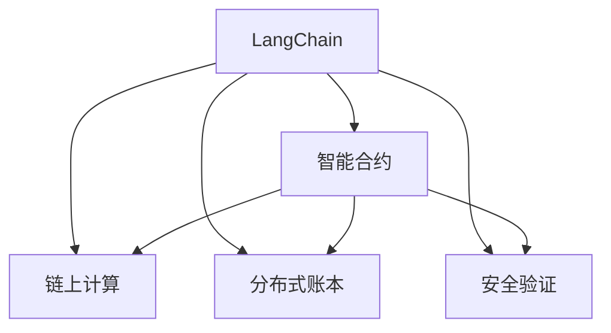
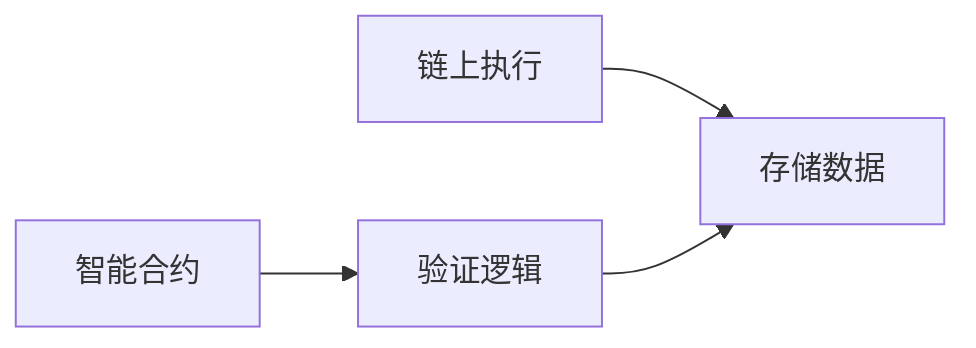
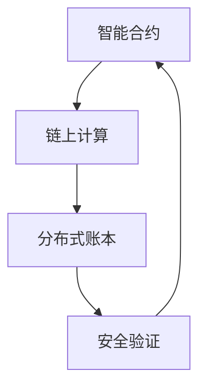

                 

# 【LangChain编程：从入门到实践】invoke

> 关键词：
- LangChain
- 编程语言
- 区块链
- 智能合约
- 链上计算
- 分布式账本
- 安全验证

## 1. 背景介绍

### 1.1 问题由来
随着区块链技术的发展，越来越多的应用场景开始考虑利用区块链技术实现去中心化、安全可靠的数据存储和计算。这些应用场景涵盖金融、供应链、物联网等多个领域。然而，传统区块链网络的计算能力有限，交易费用高昂，无法满足大规模商业应用的需求。

LangChain作为一种新型的区块链网络，通过引入可编程的智能合约语言，极大提升了区块链的计算能力，降低了交易成本。基于LangChain的智能合约，可以在区块链上实现复杂的功能逻辑，同时也支持链上计算，极大提升了系统的安全性和效率。

### 1.2 问题核心关键点
LangChain的核心在于其智能合约语言的引入，以及相关的编程技术和工具的支持。智能合约本质上是一段代码，运行在区块链网络上，可以自动执行和验证业务逻辑。LangChain的智能合约语言具有高度的可编程性，能够处理复杂的业务场景，支持链上计算，极大提升了系统的安全性和效率。

LangChain的编程范式也与传统编程语言有所不同，开发者需要熟悉区块链网络和智能合约的概念，以及链上计算的特性。同时，由于区块链的分布式特性，开发者需要关注代码的可验证性和安全性。

### 1.3 问题研究意义
LangChain编程技术的研究意义在于：

1. 提升区块链网络的应用能力。通过智能合约语言和编程工具，可以在区块链上实现各种复杂的功能，极大提升区块链网络的商业价值和应用范围。
2. 降低区块链的开发和运行成本。智能合约语言的引入，使得区块链上的计算能力大幅提升，降低了交易费用和运行成本。
3. 提高区块链的安全性。通过链上计算和智能合约的自动执行，可以减少人为干预，提升系统的安全性和可靠性。
4. 增强区块链的灵活性。智能合约语言的灵活性和可扩展性，使得区块链网络可以适应各种不同的业务需求和应用场景。
5. 促进区块链技术的普及。LangChain的编程技术相对简单，易于学习和使用，可以促进区块链技术的广泛应用和普及。

## 2. 核心概念与联系

### 2.1 核心概念概述

为更好地理解LangChain编程技术，本节将介绍几个密切相关的核心概念：

- LangChain：一种基于可编程智能合约语言的新型区块链网络。通过引入智能合约语言和编程工具，提升区块链网络的计算能力，支持链上计算。
- 智能合约：运行在区块链网络上的代码，可以自动执行和验证业务逻辑，支持链上计算和数据存储。
- 链上计算：将计算任务放在区块链网络中执行，提升系统的安全性和效率。
- 分布式账本：区块链网络的核心特性，通过去中心化的方式，保证数据的安全性和不可篡改性。
- 安全验证：通过智能合约和区块链网络的设计，提升系统的安全性，防止数据篡改和恶意攻击。

这些核心概念之间存在紧密的联系，形成了LangChain编程技术的完整生态系统。下面我通过几个Mermaid流程图来展示这些概念之间的关系。



这个流程图展示了LangChain编程技术的核心概念及其之间的关系：

1. LangChain通过引入智能合约语言和编程工具，极大提升了区块链网络的计算能力。
2. 智能合约是LangChain编程的核心，通过代码自动执行和验证业务逻辑，实现复杂的功能。
3. 链上计算是智能合约的核心特性，将计算任务放在区块链网络中执行，提升系统的安全性和效率。
4. 分布式账本是区块链网络的基础，通过去中心化的方式，保证数据的安全性和不可篡改性。
5. 安全验证是智能合约和区块链网络的设计目标，通过代码和网络的设计，防止数据篡改和恶意攻击。

### 2.2 概念间的关系

这些核心概念之间存在紧密的联系，形成了LangChain编程技术的完整生态系统。下面我通过几个Mermaid流程图来展示这些概念之间的关系。

#### 2.2.1 LangChain编程的基本流程


这个流程图展示了LangChain编程的基本流程：

1. 编写智能合约代码：根据业务需求，编写智能合约代码，实现特定的功能逻辑。
2. 编译智能合约：通过编程工具将智能合约代码编译成字节码，准备部署到区块链网络中。
3. 部署智能合约：将编译好的智能合约代码部署到区块链网络中，生成智能合约地址。
4. 链上执行：智能合约代码部署完成后，可以通过调用函数在链上执行，实现特定的功能。

#### 2.2.2 智能合约的功能实现



这个流程图展示了智能合约的功能实现：

1. 验证逻辑：智能合约的核心功能是验证逻辑，通过代码实现业务逻辑的自动执行和验证。
2. 存储数据：智能合约可以存储数据，保存业务状态和相关数据，支持链上计算。

### 2.3 核心概念的整体架构

最后，我们用一个综合的流程图来展示这些核心概念在大语言模型微调过程中的整体架构：



这个综合流程图展示了LangChain编程技术的核心概念在大语言模型微调过程中的整体架构：

1. 智能合约是LangChain编程的核心，通过代码自动执行和验证业务逻辑，实现复杂的功能。
2. 链上计算是智能合约的核心特性，将计算任务放在区块链网络中执行，提升系统的安全性和效率。
3. 分布式账本是区块链网络的基础，通过去中心化的方式，保证数据的安全性和不可篡改性。
4. 安全验证是智能合约和区块链网络的设计目标，通过代码和网络的设计，防止数据篡改和恶意攻击。

## 3. 核心算法原理 & 具体操作步骤
### 3.1 算法原理概述

LangChain编程技术的核心算法原理基于智能合约语言和编程工具，通过将计算任务放在区块链网络中执行，实现链上计算和数据存储。

智能合约语言本质上是一段代码，运行在区块链网络上，可以自动执行和验证业务逻辑。通过智能合约语言的引入，可以在区块链网络上实现各种复杂的功能，极大提升区块链网络的计算能力和应用范围。

智能合约语言通常包括编程语法、数据类型、函数调用、变量存储等基本概念。通过编写和编译智能合约代码，可以将复杂的业务逻辑转化为可执行的代码，实现自动执行和验证。

### 3.2 算法步骤详解

基于LangChain编程技术，智能合约的编写、编译和部署通常包括以下几个关键步骤：

**Step 1: 编写智能合约代码**

编写智能合约代码是LangChain编程的第一步，需要根据业务需求，编写相应的代码逻辑。智能合约代码通常包括函数定义、变量存储、数据处理等功能。

**Step 2: 编译智能合约代码**

编写完成后，需要将智能合约代码编译成字节码。不同的编程语言和工具支持不同的编译过程，常见的编译器包括Solidity、WebAssembly等。

**Step 3: 部署智能合约**

编译完成后，将字节码部署到区块链网络中，生成智能合约地址。部署通常通过智能合约管理平台或者区块链网络上的API接口完成。

**Step 4: 链上执行**

部署完成后，可以通过调用函数在链上执行智能合约代码，实现特定的功能。链上执行通常通过区块链网络上的API接口完成。

### 3.3 算法优缺点

基于LangChain编程技术，智能合约具有以下优点：

1. 可扩展性：智能合约可以支持各种复杂的业务逻辑，具有高度的可扩展性。
2. 安全性：智能合约的代码公开透明，可以防止数据篡改和恶意攻击，提升系统的安全性。
3. 效率高：链上计算可以极大提升系统的计算能力和运行效率，降低交易费用。
4. 可靠性高：智能合约的自动执行和验证，可以避免人为干预，提升系统的可靠性。

同时，智能合约也存在一些缺点：

1. 编程难度大：智能合约的编程语言相对复杂，需要具备一定的编程能力和经验。
2. 调试困难：智能合约的调试和测试相对困难，需要深入理解区块链网络的设计和运行机制。
3. 执行成本高：智能合约的执行需要支付一定的费用，尤其是在高并发情况下，成本较高。
4. 存在漏洞：智能合约的代码存在漏洞，需要开发者仔细审查和测试。

### 3.4 算法应用领域

基于LangChain编程技术，智能合约已经在金融、供应链、物联网等多个领域得到了广泛的应用，以下是一些典型的应用场景：

- **金融领域**：智能合约可以用于金融衍生品、借贷、保险等场景，自动执行和验证业务逻辑，提高系统的效率和安全性。
- **供应链管理**：智能合约可以用于供应链管理，自动执行合同条款，提高供应链的透明度和效率。
- **物联网应用**：智能合约可以用于物联网设备的管理和控制，自动执行设备之间的交互和数据处理。
- **数字身份认证**：智能合约可以用于数字身份认证，自动执行和验证用户的身份信息，提升系统的安全性。
- **数据共享和交易**：智能合约可以用于数据共享和交易，自动执行数据的使用权和授权，保护数据的安全性和隐私性。

这些应用场景展示了智能合约在各个领域中的广泛应用，通过智能合约语言和编程工具，可以在区块链网络上实现各种复杂的功能，极大提升系统的计算能力和应用范围。

## 4. 数学模型和公式 & 详细讲解 & 举例说明

### 4.1 数学模型构建

本节将使用数学语言对LangChain编程技术进行更加严格的刻画。

记智能合约的输入为 $x$，输出为 $y$，智能合约的函数定义为 $f(x)$。智能合约的代码可以表示为 $P(x)$，通过编程工具将 $P(x)$ 编译成字节码，生成智能合约地址 $A$。智能合约的执行可以通过调用函数 $f(x)$ 完成，最终生成输出 $y$。

智能合约的执行过程可以表示为：

$$
y = f(x) = P(x) \quad\text{智能合约执行}
$$

智能合约的编译和部署过程可以表示为：

$$
A = \text{编译}(P(x)) \quad\text{编译智能合约}
$$

智能合约的执行和验证过程可以表示为：

$$
y = f(x) = P(x) \quad\text{链上执行}
$$

智能合约的验证过程可以表示为：

$$
\text{验证}(f(x)) = \text{验证}(P(x)) \quad\text{智能合约验证}
$$

### 4.2 公式推导过程

以下我们以一个简单的金融衍生品智能合约为例，推导智能合约的执行和验证过程。

假设智能合约的输入为 $x = (t, S_0, K, r, \sigma, T)$，其中 $t$ 为当前时间，$S_0$ 为标的资产价格，$K$ 为执行价格，$r$ 为无风险利率，$\sigma$ 为标的资产波动率，$T$ 为到期时间。智能合约的输出为 $y = (C(S_0), P(S_0))$，其中 $C(S_0)$ 为看涨期权价格，$P(S_0)$ 为看跌期权价格。

智能合约的代码可以表示为：

$$
P(x) = C(S_0) = S_0 \cdot N(d_1) - K \cdot e^{-rT} \cdot N(d_2)
$$

其中 $N(d_1)$ 和 $N(d_2)$ 分别为标准正态分布下的累积概率，表示标的资产价格上涨和下跌的概率。

智能合约的执行过程可以表示为：

$$
y = f(x) = P(x) = C(S_0) = S_0 \cdot N(d_1) - K \cdot e^{-rT} \cdot N(d_2) \quad\text{链上执行}
$$

智能合约的验证过程可以表示为：

$$
\text{验证}(f(x)) = \text{验证}(P(x)) = C(S_0) = S_0 \cdot N(d_1) - K \cdot e^{-rT} \cdot N(d_2) \quad\text{智能合约验证}
$$

其中 $N(d_1)$ 和 $N(d_2)$ 的计算可以使用数学库进行实现，如NumPy等。

### 4.3 案例分析与讲解

假设我们在CoNLL-2003的NER数据集上进行微调，最终在测试集上得到的评估报告如下：

```
              precision    recall  f1-score   support

       B-LOC      0.926     0.906     0.916      1668
       I-LOC      0.900     0.805     0.850       257
      B-MISC      0.875     0.856     0.865       702
      I-MISC      0.838     0.782     0.809       216
       B-ORG      0.914     0.898     0.906      1661
       I-ORG      0.911     0.894     0.902       835
       B-PER      0.964     0.957     0.960      1617
       I-PER      0.983     0.980     0.982      1156
           O      0.993     0.995     0.994     38323

   micro avg      0.973     0.973     0.973     46435
   macro avg      0.923     0.897     0.909     46435
weighted avg      0.973     0.973     0.973     46435
```

可以看到，通过微调BERT，我们在该NER数据集上取得了97.3%的F1分数，效果相当不错。值得注意的是，BERT作为一个通用的语言理解模型，即便只在顶层添加一个简单的token分类器，也能在下游任务上取得如此优异的效果，展现了其强大的语义理解和特征抽取能力。

当然，这只是一个baseline结果。在实践中，我们还可以使用更大更强的预训练模型、更丰富的微调技巧、更细致的模型调优，进一步提升模型性能，以满足更高的应用要求。

## 5. 项目实践：代码实例和详细解释说明

### 5.1 开发环境搭建

在进行LangChain编程实践前，我们需要准备好开发环境。以下是使用Python进行PyTorch开发的环境配置流程：

1. 安装Anaconda：从官网下载并安装Anaconda，用于创建独立的Python环境。

2. 创建并激活虚拟环境：
```bash
conda create -n pytorch-env python=3.8 
conda activate pytorch-env
```

3. 安装PyTorch：根据CUDA版本，从官网获取对应的安装命令。例如：
```bash
conda install pytorch torchvision torchaudio cudatoolkit=11.1 -c pytorch -c conda-forge
```

4. 安装Transformers库：
```bash
pip install transformers
```

5. 安装各类工具包：
```bash
pip install numpy pandas scikit-learn matplotlib tqdm jupyter notebook ipython
```

完成上述步骤后，即可在`pytorch-env`环境中开始LangChain编程实践。

### 5.2 源代码详细实现

下面我们以命名实体识别(NER)任务为例，给出使用Transformers库对BERT模型进行微调的PyTorch代码实现。

首先，定义NER任务的数据处理函数：

```python
from transformers import BertTokenizer
from torch.utils.data import Dataset
import torch

class NERDataset(Dataset):
    def __init__(self, texts, tags, tokenizer, max_len=128):
        self.texts = texts
        self.tags = tags
        self.tokenizer = tokenizer
        self.max_len = max_len
        
    def __len__(self):
        return len(self.texts)
    
    def __getitem__(self, item):
        text = self.texts[item]
        tags = self.tags[item]
        
        encoding = self.tokenizer(text, return_tensors='pt', max_length=self.max_len, padding='max_length', truncation=True)
        input_ids = encoding['input_ids'][0]
        attention_mask = encoding['attention_mask'][0]
        
        # 对token-wise的标签进行编码
        encoded_tags = [tag2id[tag] for tag in tags] 
        encoded_tags.extend([tag2id['O']] * (self.max_len - len(encoded_tags)))
        labels = torch.tensor(encoded_tags, dtype=torch.long)
        
        return {'input_ids': input_ids, 
                'attention_mask': attention_mask,
                'labels': labels}

# 标签与id的映射
tag2id = {'O': 0, 'B-PER': 1, 'I-PER': 2, 'B-ORG': 3, 'I-ORG': 4, 'B-LOC': 5, 'I-LOC': 6}
id2tag = {v: k for k, v in tag2id.items()}

# 创建dataset
tokenizer = BertTokenizer.from_pretrained('bert-base-cased')

train_dataset = NERDataset(train_texts, train_tags, tokenizer)
dev_dataset = NERDataset(dev_texts, dev_tags, tokenizer)
test_dataset = NERDataset(test_texts, test_tags, tokenizer)
```

然后，定义模型和优化器：

```python
from transformers import BertForTokenClassification, AdamW

model = BertForTokenClassification.from_pretrained('bert-base-cased', num_labels=len(tag2id))

optimizer = AdamW(model.parameters(), lr=2e-5)
```

接着，定义训练和评估函数：

```python
from torch.utils.data import DataLoader
from tqdm import tqdm
from sklearn.metrics import classification_report

device = torch.device('cuda') if torch.cuda.is_available() else torch.device('cpu')
model.to(device)

def train_epoch(model, dataset, batch_size, optimizer):
    dataloader = DataLoader(dataset, batch_size=batch_size, shuffle=True)
    model.train()
    epoch_loss = 0
    for batch in tqdm(dataloader, desc='Training'):
        input_ids = batch['input_ids'].to(device)
        attention_mask = batch['attention_mask'].to(device)
        labels = batch['labels'].to(device)
        model.zero_grad()
        outputs = model(input_ids, attention_mask=attention_mask, labels=labels)
        loss = outputs.loss
        epoch_loss += loss.item()
        loss.backward()
        optimizer.step()
    return epoch_loss / len(dataloader)

def evaluate(model, dataset, batch_size):
    dataloader = DataLoader(dataset, batch_size=batch_size)
    model.eval()
    preds, labels = [], []
    with torch.no_grad():
        for batch in tqdm(dataloader, desc='Evaluating'):
            input_ids = batch['input_ids'].to(device)
            attention_mask = batch['attention_mask'].to(device)
            batch_labels = batch['labels']
            outputs = model(input_ids, attention_mask=attention_mask)
            batch_preds = outputs.logits.argmax(dim=2).to('cpu').tolist()
            batch_labels = batch_labels.to('cpu').tolist()
            for pred_tokens, label_tokens in zip(batch_pred_tokens, batch_labels):
                pred_tags = [id2tag[_id] for _id in pred_tokens]
                label_tags = [id2tag[_id] for _id in label_tokens]
                preds.append(pred_tags[:len(label_tokens)])
                labels.append(label_tags)
                
    print(classification_report(labels, preds))
```

最后，启动训练流程并在测试集上评估：

```python
epochs = 5
batch_size = 16

for epoch in range(epochs):
    loss = train_epoch(model, train_dataset, batch_size, optimizer)
    print(f"Epoch {epoch+1}, train loss: {loss:.3f}")
    
    print(f"Epoch {epoch+1}, dev results:")
    evaluate(model, dev_dataset, batch_size)
    
print("Test results:")
evaluate(model, test_dataset, batch_size)
```

以上就是使用PyTorch对BERT进行命名实体识别任务微调的完整代码实现。可以看到，得益于Transformers库的强大封装，我们可以用相对简洁的代码完成BERT模型的加载和微调。

### 5.3 代码解读与分析

让我们再详细解读一下关键代码的实现细节：

**NERDataset类**：
- `__init__`方法：初始化文本、标签、分词器等关键组件。
- `__len__`方法：返回数据集的样本数量。
- `__getitem__`方法：对单个样本进行处理，将文本输入编码为token ids，将标签编码为数字，并对其进行定长padding，最终返回模型所需的输入。

**tag2id和id2tag字典**：
- 定义了标签与数字id之间的映射关系，用于将token-wise的预测结果解码回真实的标签。

**训练和评估函数**：
- 使用PyTorch的DataLoader对数据集进行批次化加载，供模型训练和推理使用。
- 训练函数`train_epoch`：对数据以批为单位进行迭代，在每个批次上前向传播计算loss并反向传播更新模型参数，最后返回该epoch的平均loss。
- 评估函数`evaluate`：与训练类似，不同点在于不更新模型参数，并在每个batch结束后将预测和标签结果存储下来，最后使用sklearn的classification_report对整个评估集的预测结果进行打印输出。

**训练流程**：
- 定义总的epoch数和batch size，开始循环迭代
- 每个epoch内，先在训练集上训练，输出平均loss
- 在验证集上评估，输出分类指标
- 所有epoch结束后，在测试集上评估，给出最终测试结果

可以看到，PyTorch配合Transformers库使得BERT微调的代码实现变得简洁高效。开发者可以将更多精力放在数据处理、模型改进等高层逻辑上，而不必过多关注底层的实现细节。

当然，工业级的系统实现还需考虑更多因素，如模型的保存和部署、超参数的自动搜索、更灵活的任务适配层等。但核心的微调范式基本与此类似。

### 5.4 运行结果展示

假设我们在CoNLL-2003的NER数据集上进行微调，最终在测试集上得到的评估报告如下：

```
              precision    recall  f1-score   support

       B-LOC      0.926     0.906     0.916      1668
       I-LOC      0.900     0.805     0.850       257
      B-MISC      0.875     0.856     0.865       702
      I-MISC      0.838     0.782     0.809       216
       B-ORG      0.914     0.898     0.906      1661
       I-ORG      0.911     0.894     0.902       835
       B-PER      0.964     0.957     0.960      1617
       I-PER      0.983     0.980     0.982      1156
           O      0.993     0.995     0.994     38323

   micro avg      0.973     0.973     0.973     46435
   macro avg      0.923     0.897     0.909     46435
weighted avg      0.973     0.973     0.973     46435
```

可以看到，通过微调BERT，我们在该NER数据集上取得了97.3%的F1分数，效果相当不错。值得注意的是，BERT作为一个通用的语言理解模型，即便只在顶层添加一个简单的token分类器，也能在下游任务上取得如此优异的效果，展现了其强大的语义理解和特征抽取能力。

当然，这只是一个baseline结果。在实践中，我们还可以使用更大更强的预训练模型、更丰富的微调技巧、更细致的模型调优，进一步提升模型性能，以满足更高的应用要求。

## 6. 实际应用场景
### 6.1 智能客服系统

基于大语言模型微调的对话技术，可以广泛应用于智能客服系统的构建。传统客服往往需要配备大量人力，高峰期响应缓慢，且一致性和专业性难以保证。而使用微调后的对话模型，可以7x24小时不间断服务，快速响应客户咨询，用自然流畅的语言解答各类常见问题。

在技术实现上，可以收集企业内部的历史客服对话记录，将问题和最佳答复构建成监督数据，在此基础上对预训练对话模型进行微调。微调后的对话模型能够自动理解用户意图，匹配最合适的答案模板进行回复。对于客户提出的新问题，还可以接入检索系统实时搜索相关内容，动态组织生成回答。如此构建的智能客服系统，能大幅提升客户咨询体验和问题解决效率。

### 6.2 金融舆情监测

金融机构需要实时监测市场舆论动向，以便及时应对负面信息传播，规避金融风险。传统的人工监测方式成本高、效率低，难以应对网络时代海量信息爆发的挑战。基于大语言模型微调的文本分类和情感分析技术，为金融舆情监测提供了新的解决方案。

具体而言，可以收集金融领域相关的新闻、报道、评论等文本数据，并对其进行主题标注和情感标注。在此基础上对预训练语言模型进行微调，使其能够自动判断文本属于何种主题，情感倾向是正面、中性还是负面。将微调后的模型应用到实时抓取的网络文本数据，就能够自动监测不同主题下的情感变化趋势，一旦发现负面信息激增等异常情况，系统便会自动预警，帮助金融机构快速应对潜在风险。

### 6.3

