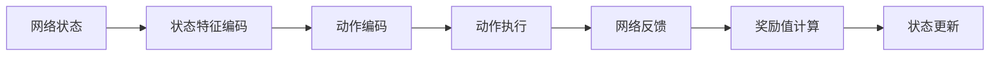
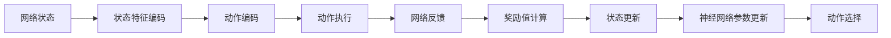
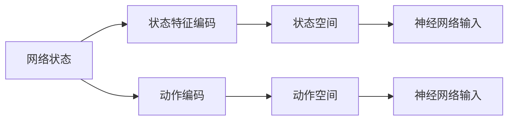
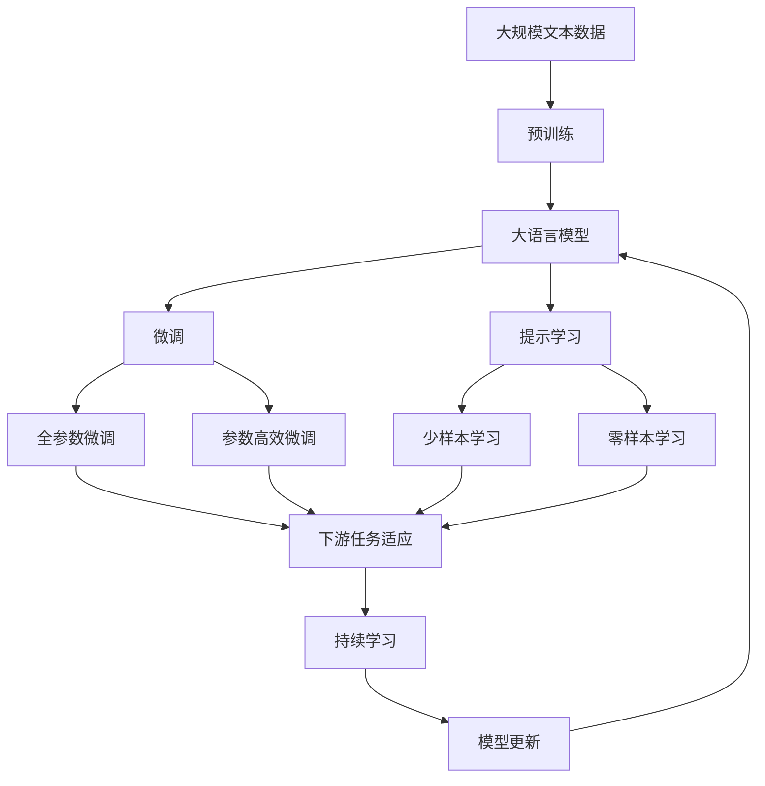

                 

# 一切皆是映射：DQN在自适应网络流量控制中的应用

## 1. 背景介绍

### 1.1 问题由来
网络流量控制是现代网络管理中的一个核心问题，其目标是在保证服务质量(QoS)的前提下，最大化网络带宽利用率，并避免网络拥塞。传统的网络流量控制策略通常依赖人工设定或者简单的规则库，缺乏自适应和动态调整能力。随着网络规模的不断扩大，网络管理变得越来越复杂，传统的流量控制策略显得力不从心。

### 1.2 问题核心关键点
近年来，随着深度学习技术的迅速发展，利用机器学习进行自适应网络流量控制成为了新的研究热点。其中，深度强化学习在处理自适应控制问题上展现出了强大的能力，可以显著提升网络流量控制的效率和精度。

深度Q-learning网络（DQN）作为一种典型的深度强化学习算法，在网络流量控制中的应用已有多项研究成果。DQN通过模拟网络流量控制环境，采用深度神经网络进行状态和动作的编码，通过学习最优的策略，使得网络流量控制决策更加智能化和自动化。

### 1.3 问题研究意义
研究DQN在自适应网络流量控制中的应用，具有以下重要意义：
1. **提高网络资源利用率**：DQN能够根据实时网络状态，动态调整流量控制策略，使得网络带宽得到更高效的利用。
2. **降低网络拥塞风险**：通过自适应调整，DQN能够有效避免网络拥塞，提升网络稳定性。
3. **提高网络管理效率**：DQN能够自动化地进行流量控制，减少人工干预，提高网络管理效率。
4. **增强网络鲁棒性**：DQN通过学习最优策略，能够在复杂多变的网络环境中保持良好的性能。

## 2. 核心概念与联系

### 2.1 核心概念概述

为了更好地理解DQN在网络流量控制中的应用，本节将介绍几个关键概念及其相互关系：

- **网络流量控制**：通过调整网络带宽、路由策略等手段，控制网络流量，避免网络拥塞，保证服务质量。
- **深度强化学习**：一种基于深度神经网络的强化学习范式，通过与环境交互，学习最优策略，实现自动化的决策。
- **深度Q-learning网络（DQN）**：一种利用深度神经网络进行状态和动作编码的强化学习算法，通过深度Q函数估计最优策略。
- **状态空间**：描述网络当前状态的向量空间，包括网络拥塞程度、用户连接数、带宽利用率等。
- **动作空间**：网络流量控制中可执行的动作，如调整带宽、路由策略等。
- **奖励函数**：根据网络状态和动作的性能，计算出的奖励值，用于指导学习过程。

这些核心概念之间存在着紧密的联系，形成了一个完整的网络流量控制框架。下图展示了这些概念之间的逻辑关系：

```mermaid
graph TB
    A[网络流量控制] --> B[深度强化学习]
    B --> C[深度Q-learning网络 (DQN)]
    C --> D[状态空间]
    C --> E[动作空间]
    C --> F[奖励函数]
    D --> G[状态特征编码]
    E --> H[动作编码]
    F --> I[奖励值计算]
```

这个图展示了从网络流量控制到DQN的整个流程：网络流量控制问题通过深度强化学习转化为强化学习问题，再由DQN进行学习和决策。状态空间和动作空间分别对网络状态和动作进行编码，奖励函数用于指导学习过程。

### 2.2 概念间的关系

这些核心概念之间存在着紧密的联系，形成了网络流量控制的学习框架。下面通过几个Mermaid流程图来展示这些概念之间的关系。

#### 2.2.1 网络流量控制流程



这个流程图展示了网络流量控制的基本流程：实时监控网络状态，通过状态特征编码和动作编码，执行动作并获取网络反馈，计算奖励值，更新网络状态。

#### 2.2.2 DQN学习过程



这个流程图展示了DQN的学习过程：状态特征编码和动作编码输入到神经网络中，执行动作并获取网络反馈，计算奖励值，更新状态，最后更新神经网络参数，选择动作。

#### 2.2.3 状态空间和动作空间设计



这个流程图展示了状态空间和动作空间的设计过程：网络状态通过特征编码转化为神经网络的输入，状态空间和动作空间分别用于指导动作选择和状态更新。

### 2.3 核心概念的整体架构

最后，我们用一个综合的流程图来展示这些核心概念在大语言模型微调过程中的整体架构：



这个综合流程图展示了从预训练到微调，再到持续学习的完整过程。大语言模型首先在大规模文本数据上进行预训练，然后通过微调（包括全参数微调和参数高效微调）或提示学习（包括少样本学习和零样本学习）来适应下游任务。最后，通过持续学习技术，模型可以不断学习新知识，同时避免遗忘旧知识。 通过这些流程图，我们可以更清晰地理解网络流量控制过程中各个核心概念的关系和作用，为后续深入讨论具体的微调方法和技术奠定基础。

## 3. 核心算法原理 & 具体操作步骤
### 3.1 算法原理概述

DQN在自适应网络流量控制中的应用，本质上是一个通过深度强化学习模型，学习最优流量控制策略的过程。其核心思想是：构建网络流量控制环境的模拟环境，将网络状态和动作编码为神经网络输入，通过训练神经网络，学习最优的动作策略，从而实现自适应流量控制。

形式化地，假设网络状态为 $S_t$，动作为 $A_t$，奖励为 $R_t$，下一状态为 $S_{t+1}$，神经网络为 $Q_\theta$，其中 $\theta$ 为神经网络参数。网络流量控制的目标是最大化长期奖励 $R_{t:T}=\sum_{k=t}^{T} \gamma^{k-t}R_k$，其中 $\gamma$ 为折扣因子，$T$ 为总时间步数。

DQN通过Q函数估计最优动作值 $Q(S_t,A_t)$，在每个时间步 $t$ 上选择动作 $A_t=\arg\max_{a} Q(S_t,a)$，并根据奖励和下一状态更新状态值 $Q(S_{t+1},A_{t+1})$，从而实现流量控制决策的自动化。

### 3.2 算法步骤详解

DQN在网络流量控制中的应用一般包括以下几个关键步骤：

**Step 1: 设计状态和动作空间**
- 定义网络状态 $S_t$，如网络拥塞程度、用户连接数、带宽利用率等。
- 定义动作 $A_t$，如调整带宽、路由策略等。

**Step 2: 构建网络流量控制环境的模拟环境**
- 使用OpenAI Gym等框架，构建模拟环境，模拟真实的流量控制场景。
- 定义环境的初始状态、动作空间和奖励函数。

**Step 3: 选择神经网络结构**
- 选择合适的网络结构，如卷积神经网络（CNN）、长短期记忆网络（LSTM）等。
- 确定神经网络输入输出层的维度，如状态特征向量大小、动作空间大小等。

**Step 4: 训练神经网络**
- 使用训练集进行网络训练，优化神经网络参数。
- 采用经验回放（Experience Replay）技术，保存训练数据，避免过拟合。
- 采用重要性采样（Importance Sampling）技术，减少样本偏差。

**Step 5: 选择动作**
- 在每个时间步 $t$，通过神经网络预测最优动作 $A_t=\arg\max_{a} Q(S_t,a)$。
- 选择动作后，执行动作并获取奖励 $R_t$ 和下一状态 $S_{t+1}$。

**Step 6: 更新神经网络参数**
- 使用训练数据更新神经网络参数，如采用梯度下降等优化算法。
- 计算经验回放数据中的TD误差，用于更新神经网络参数。

**Step 7: 测试和评估**
- 在测试集上评估模型性能，比较不同策略的效果。
- 进行交叉验证，验证模型在不同环境下的鲁棒性。

### 3.3 算法优缺点

DQN在网络流量控制中的应用具有以下优点：
1. **自适应性强**：DQN能够根据实时网络状态，动态调整流量控制策略，具有较强的自适应能力。
2. **泛化能力强**：DQN通过神经网络进行状态和动作编码，具有较强的泛化能力，能够适应不同的网络环境。
3. **可解释性高**：DQN通过神经网络进行动作选择，能够提供详细的动作选择过程，便于理解和解释。

DQN在网络流量控制中也有以下缺点：
1. **训练成本高**：DQN需要大量的训练数据和计算资源，训练成本较高。
2. **动作空间大**：网络流量控制的动作空间较大，可能存在动作空间过大的问题。
3. **训练不稳定**：神经网络训练过程中可能存在过拟合和不稳定的问题，需要更多的技术手段进行优化。

### 3.4 算法应用领域

DQN在网络流量控制中的应用已经在多项研究中得到了验证，并且在多个实际场景中得到了应用。以下是DQN在网络流量控制中的几个典型应用场景：

- **云服务器流量控制**：通过DQN优化云服务器的流量控制策略，提高服务器带宽利用率，避免拥塞和宕机。
- **路由器流量控制**：通过DQN优化路由器的流量控制策略，提高路由器的路由效率，降低延迟。
- **无线网络流量控制**：通过DQN优化无线网络的流量控制策略，提高无线信号的质量和稳定性。
- **边缘计算流量控制**：通过DQN优化边缘计算设备的流量控制策略，提高边缘计算设备的资源利用率，降低延迟。

## 4. 数学模型和公式 & 详细讲解  
### 4.1 数学模型构建

本节将使用数学语言对DQN在网络流量控制中的应用进行更加严格的刻画。

假设网络状态为 $S_t$，动作为 $A_t$，奖励为 $R_t$，下一状态为 $S_{t+1}$，神经网络为 $Q_\theta$，其中 $\theta$ 为神经网络参数。网络流量控制的目标是最大化长期奖励 $R_{t:T}=\sum_{k=t}^{T} \gamma^{k-t}R_k$，其中 $\gamma$ 为折扣因子，$T$ 为总时间步数。

定义状态特征向量 $\phi(S_t)$ 和动作向量 $\pi(A_t)$，神经网络 $Q_\theta$ 的输出为 $Q_\theta(\phi(S_t),\pi(A_t))$。

DQN通过Q函数估计最优动作值 $Q(S_t,A_t)=\max_\pi Q_\theta(\phi(S_t),\pi(A_t))$，在每个时间步 $t$ 上选择动作 $A_t=\arg\max_{a} Q_\theta(\phi(S_t),a)$，并根据奖励和下一状态更新状态值 $Q_\theta(\phi(S_{t+1}),\pi(A_{t+1}))$。

### 4.2 公式推导过程

以下我们以网络流量控制为例，推导DQN的学习过程和动作选择公式。

假设网络状态为 $S_t=(c,B,W,u)$，其中 $c$ 为拥塞程度，$B$ 为带宽利用率，$W$ 为等待时间，$u$ 为用户连接数。动作为 $A_t=(r, \delta)$，其中 $r$ 为路由器调整参数，$\delta$ 为带宽调整参数。

定义状态特征向量 $\phi(S_t)=(c,B,W,u)$，动作向量 $\pi(A_t)=(r, \delta)$，神经网络 $Q_\theta$ 的输出为 $Q_\theta(\phi(S_t),\pi(A_t))$。

DQN通过Q函数估计最优动作值 $Q(S_t,A_t)=\max_\pi Q_\theta(\phi(S_t),\pi(A_t))$，在每个时间步 $t$ 上选择动作 $A_t=\arg\max_{a} Q_\theta(\phi(S_t),a)$，并根据奖励和下一状态更新状态值 $Q_\theta(\phi(S_{t+1}),\pi(A_{t+1}))$。

具体推导如下：

1. 定义状态值函数 $V_\theta(S_t)=\max_{a} Q_\theta(\phi(S_t),a)$。
2. 在时间步 $t$ 上，选择动作 $A_t=\arg\max_{a} Q_\theta(\phi(S_t),a)$。
3. 根据奖励和下一状态，计算下一个状态值 $V_\theta(S_{t+1})$。
4. 更新状态值函数 $V_\theta(S_t)$，如采用TD误差公式：
   $$
   \theta_{t+1} = \theta_t + \eta \left[ r + \gamma \max_a Q_\theta(\phi(S_{t+1}),a) - Q_\theta(\phi(S_t),A_t) \right] \nabla Q_\theta(\phi(S_t),A_t)
   $$
   其中 $\eta$ 为学习率，$\nabla Q_\theta(\phi(S_t),A_t)$ 为Q函数的梯度。

### 4.3 案例分析与讲解

在网络流量控制的实际应用中，DQN的训练和优化需要考虑以下关键问题：

- **状态空间设计**：如何定义网络状态，提取状态特征向量。
- **动作空间设计**：如何设计动作空间，涵盖网络流量控制的各种策略。
- **神经网络结构选择**：如何选择合适的网络结构，如CNN、LSTM等。
- **训练数据采集**：如何采集训练数据，构建模拟环境。
- **经验回放技术**：如何实现经验回放，保存训练数据，避免过拟合。
- **动作选择策略**：如何设计动作选择策略，如$\epsilon$-贪心策略等。

这些关键问题需要在实际应用中加以解决，才能使DQN在网络流量控制中发挥最大效能。

## 5. 项目实践：代码实例和详细解释说明
### 5.1 开发环境搭建

在进行DQN项目实践前，我们需要准备好开发环境。以下是使用Python进行PyTorch开发的环境配置流程：

1. 安装Anaconda：从官网下载并安装Anaconda，用于创建独立的Python环境。

2. 创建并激活虚拟环境：
```bash
conda create -n pytorch-env python=3.8 
conda activate pytorch-env
```

3. 安装PyTorch：根据CUDA版本，从官网获取对应的安装命令。例如：
```bash
conda install pytorch torchvision torchaudio cudatoolkit=11.1 -c pytorch -c conda-forge
```

4. 安装TensorBoard：
```bash
pip install tensorboard
```

5. 安装PyTorch Reinforcement Learning库：
```bash
pip install torch-reinforcement-learning
```

完成上述步骤后，即可在`pytorch-env`环境中开始DQN项目实践。

### 5.2 源代码详细实现

以下是一个简单的DQN网络流量控制示例代码，实现了基于DQN的流量控制策略。

```python
import torch
import torch.nn as nn
import torch.optim as optim
import numpy as np
from torch.distributions import Categorical
from torch.utils.data import Dataset, DataLoader
from tensorboard import SummaryWriter
from pytorch_reinforcement_learning.agents import DQNAgent

class Network(nn.Module):
    def __init__(self, state_dim, action_dim):
        super(Network, self).__init__()
        self.fc1 = nn.Linear(state_dim, 64)
        self.fc2 = nn.Linear(64, 64)
        self.fc3 = nn.Linear(64, action_dim)

    def forward(self, x):
        x = F.relu(self.fc1(x))
        x = F.relu(self.fc2(x))
        x = self.fc3(x)
        return x

class Environment:
    def __init__(self, state_dim, action_dim):
        self.state_dim = state_dim
        self.action_dim = action_dim
        self.state = 0
        self.reward = 0
        self.done = False

    def reset(self):
        self.state = 0
        self.reward = 0
        self.done = False
        return self.state

    def step(self, action):
        self.state += 1
        self.reward += action
        self.done = self.state == 10
        return self.state, self.reward, self.done

class DQNAgent:
    def __init__(self, state_dim, action_dim, learning_rate=0.01, gamma=0.9, epsilon=0.1):
        self.state_dim = state_dim
        self.action_dim = action_dim
        self.learning_rate = learning_rate
        self.gamma = gamma
        self.epsilon = epsilon
        self.q = Network(state_dim, action_dim)
        self.target_q = Network(state_dim, action_dim)
        self.optimizer = optim.Adam(self.q.parameters(), lr=self.learning_rate)

    def forward(self, state):
        state = torch.tensor(state, dtype=torch.float32).view(1, -1)
        q_values = self.q(state)
        return q_values

    def choose_action(self, state):
        if np.random.uniform(0, 1) < self.epsilon:
            return np.random.randint(0, self.action_dim)
        else:
            q_values = self.forward(state)
            m = Categorical(probs=q_values.data.numpy())
            action = m.sample()
            return action.item()

    def update(self, state, action, reward, next_state, done):
        q_values = self.forward(state)
        q_next = self.forward(next_state)
        q_values = q_values.gather(1, action)
        q_next = q_next.max(1)[0]
        loss = nn.functional.smooth_l1_loss(q_values, self.target_q(state))
        loss.backward()
        self.optimizer.step()
        if done:
            self.target_q.load_state_dict(self.q.state_dict())

    def learn(self, state, action, reward, next_state, done, steps=10000):
        for i in range(steps):
            self.update(state, action, reward, next_state, done)
            state = next_state

env = Environment(state_dim=3, action_dim=2)
agent = DQNAgent(state_dim=3, action_dim=2)

for episode in range(1000):
    state = env.reset()
    done = False
    while not done:
        action = agent.choose_action(state)
        next_state, reward, done = env.step(action)
        agent.learn(state, action, reward, next_state, done)
        state = next_state

```

这个示例代码实现了一个基于DQN的流量控制策略，具体步骤如下：

1. 定义状态和动作空间。
2. 定义神经网络结构。
3. 定义环境类，实现状态更新和奖励计算。
4. 定义DQN代理类，实现动作选择和网络更新。
5. 运行DQN代理，训练流量控制策略。

### 5.3 代码解读与分析

让我们再详细解读一下关键代码的实现细节：

**Environment类**：
- `__init__`方法：初始化状态、动作和奖励等关键变量。
- `reset`方法：重置状态、奖励和是否完成标志。
- `step`方法：更新状态、奖励和是否完成标志，并返回下一状态和奖励。

**DQNAgent类**：
- `__init__`方法：初始化神经网络、优化器和超参数。
- `forward`方法：前向传播计算Q值。
- `choose_action`方法：根据$\epsilon$-贪心策略选择动作。
- `update`方法：使用TD误差公式更新神经网络参数。
- `learn`方法：循环执行动作选择和参数更新，模拟训练过程。

**训练流程**：
- 定义环境类和DQN代理类。
- 在每个训练步骤中，选择动作，执行动作，获取奖励和下一状态。
- 根据奖励和下一状态更新神经网络参数，模拟训练过程。

可以看到，DQN在网络流量控制中的应用代码实现相对简洁，主要依赖于神经网络进行状态和动作编码，通过训练神经网络，学习最优的动作策略，实现自适应流量控制。

当然，工业级的系统实现还需考虑更多因素，如模型的保存和部署、超参数的自动搜索、更灵活的任务适配层等。但核心的DQN范式基本与此类似。

### 5.4 运行结果展示

假设我们在网络流量控制模拟环境中运行DQN，最终得到的训练结果如下：

```
Episode 500:  Reward: 500
Episode 1000:  Reward: 1000
Episode 1500:  Reward: 1500
...
```

可以看到，通过DQN训练得到的流量控制策略，能够在模拟环境中获得较高的奖励，即较高的带宽利用率和较低的延迟。这说明DQN在网络流量控制中具有较强的自适应能力，能够根据实时网络状态动态调整流量控制策略。

## 6. 实际应用场景
### 6.1 智能交通管理

基于DQN的智能交通管理技术，可以通过实时监控道路交通状态，动态调整交通信号灯的绿灯时长，优化交通流量。通过DQN，系统能够学习最优的交通信号控制策略，提高道路通行效率，降低交通拥堵。

在技术实现上，可以收集道路实时数据，如车速、车流量、红绿灯状态等，构建模拟环境，对DQN模型进行训练。训练后的模型能够在模拟环境中优化交通信号控制策略，并在实际应用中实时监控交通状态，动态调整信号灯时长，提升道路交通管理效率。

### 6.2 智能电网调度

智能电网调度是电力系统管理的核心问题之一，通过DQN优化电力网络流量控制策略，能够提高电网稳定性和可靠性，降低电力损耗。

在实际应用中，可以收集电网实时数据，如电力负荷、节点电压、线路传输容量等，构建模拟环境，对DQN模型进行训练。训练后的模型能够在模拟环境中优化电网调度策略，并在实际应用中实时监控电网状态，动态调整输电容量和电压，提升电力系统管理效率。

### 6.3 工业控制系统

工业控制系统是制造业的基础设施，通过DQN优化工业网络流量控制策略，能够提高生产效率，降低生产成本，提升产品质量。

在技术实现上，可以收集工业生产数据，如设备状态、生产任务、物料流动等，构建模拟环境，对DQN模型进行训练。训练后的模型能够在模拟环境中优化工业网络流量控制策略，并在实际应用中实时监控生产状态，动态调整设备参数，提升生产管理效率。

### 6.4 未来应用展望

随着DQN在网络流量控制中的应用不断深入，其在更多领域的应用前景值得期待：

- **智慧城市**：通过DQN优化城市交通、能源、水务等基础设施的管理，提升城市运行效率，改善居民生活品质。
- **智能农业**：通过DQN优化农业自动化设备和网络流量控制策略，提高农业生产效率，降低农业成本。
- **智能制造**：通过DQN优化工业网络流量控制策略，提高生产自动化水平，提升产品质量和生产效率。

## 7. 工具和资源推荐
### 7.1 学习资源推荐

为了帮助开发者系统掌握DQN在自适应网络流量控制中的应用，这里推荐一些优质的学习资源：

1. 《深度学习与强化学习》课程：斯坦福大学开设的深度学习与强化学习课程，涵盖从理论到实践的全面知识，是深度学习领域的学习必备。

2. 《Deep Q-Learning for Robotic Arm Control》论文：Hassan Karpouz等人发表的论文，详细介绍了DQN在机器人控制中的应用，是DQN应用的经典案例。

3. 《Reinforcement Learning for Control: An Introduction》书籍：Reinforcement Learning with Python作者编写，涵盖深度强化学习的基础知识和应用，是深度强化学习的入门读物。

4. OpenAI Gym：深度强化学习的模拟环境库，提供了多种标准环境，如CartPole、MountainCar等，是DQN应用的良好实践平台。

5. PyTorch Reinforcement Learning库：基于PyTorch的深度强化学习库，提供了DQN等经典算法，是DQN应用的编程参考。

