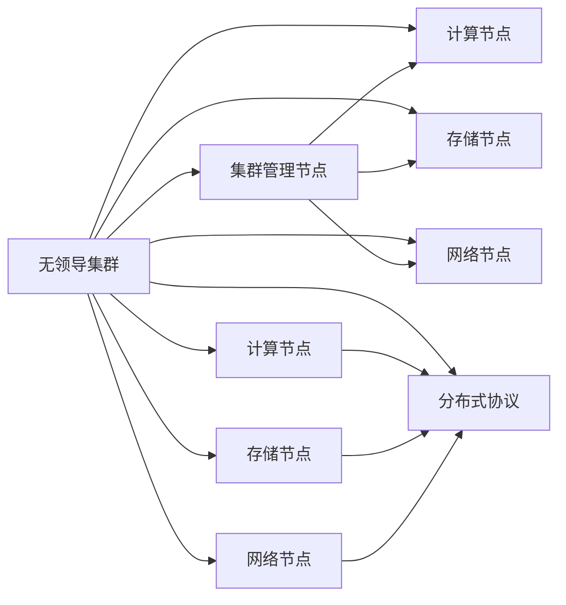

                 

# 单领导集群与无领导集群最佳实践

## 1. 背景介绍

随着互联网的迅速发展和企业数据量的激增，大规模集群已成为企业IT架构的重要组成部分。如何构建和管理这些集群，以实现高效的资源利用、稳定的业务运行和卓越的用户体验，成为IT架构师和运维工程师共同面临的挑战。

集群可以大致分为两类：单领导集群和无领导集群。单领导集群指所有节点都由一个统一的集群管理节点控制，所有计算、存储、网络等资源的管理和调度均由该管理节点负责。而无领导集群则没有固定的管理节点，各节点之间通过分布式协议实现相互通信和资源调度。

本文将深入探讨单领导集群与无领导集群的最佳实践，帮助IT架构师和运维工程师选择最合适的集群架构，提升集群的性能和稳定性，确保业务的连续性和可扩展性。

## 2. 核心概念与联系

### 2.1 核心概念概述

- **单领导集群（Single-Leader Cluster）**：由一个统一的集群管理节点控制，所有计算、存储、网络等资源的管理和调度均由该管理节点负责。
- **无领导集群（Leaderless Cluster）**：没有固定的管理节点，各节点之间通过分布式协议实现相互通信和资源调度。
- **集群管理节点**：负责集群资源的监控、调度和负载均衡，通常称为Master节点。
- **分布式协议**：用于节点之间的通信和资源调度，包括但不限于Zookeeper、etcd、Raft等。
- **负载均衡**：通过分布式协议实现任务在各个节点上的均匀分配，以提高集群的并行处理能力和资源利用率。

### 2.2 核心概念原理和架构

我们可以用以下Mermaid流程图来展示单领导集群和无领导集群的基本架构：



单领导集群由一个统一的集群管理节点和多个计算、存储、网络节点组成，集群管理节点负责集群资源的监控、调度和负载均衡。而无领导集群则没有固定的管理节点，各节点之间通过分布式协议实现相互通信和资源调度。

### 2.3 核心概念之间的关系

单领导集群和无领导集群的核心概念之间有着密切的联系和区别：

- **资源控制**：单领导集群由集群管理节点统一控制，各节点之间的资源分配和调度由管理节点决定；而无领导集群则由分布式协议进行资源调度。
- **故障容忍度**：单领导集群中的管理节点单点故障会导致整个集群宕机，而无领导集群中的节点故障只影响局部，整个集群可以继续运行。
- **扩展性**：单领导集群的管理节点成为瓶颈，扩展性受限；而无领导集群通过分布式协议实现自动负载均衡，扩展性更好。

这些关系决定了不同集群架构在不同场景下的适用性和优缺点。

## 3. 核心算法原理 & 具体操作步骤

### 3.1 算法原理概述

单领导集群和无领导集群的最佳实践主要围绕两个方面展开：资源管理和负载均衡。

- **单领导集群**：资源管理由集群管理节点负责，负载均衡通过管理节点进行调度。
- **无领导集群**：资源管理由分布式协议负责，负载均衡通过协议自身实现。

### 3.2 算法步骤详解

#### 单领导集群

1. **集群搭建**：选择合适的分布式系统框架（如Hadoop、Kubernetes等），搭建单领导集群。
2. **资源配置**：根据业务需求，配置计算、存储、网络等资源的容量和分配策略。
3. **负载均衡**：使用集群管理节点的负载均衡算法（如Round Robin、Consistent Hashing等），合理分配任务到各个计算节点。
4. **监控调优**：使用集群监控工具（如Grafana、Prometheus等），实时监控集群性能，调优负载均衡算法和资源配置。

#### 无领导集群

1. **集群搭建**：选择合适的分布式系统框架（如Apache Mesos、Apache Spark等），搭建无领导集群。
2. **资源配置**：根据业务需求，配置计算、存储、网络等资源的容量和分配策略。
3. **负载均衡**：使用分布式协议自身的负载均衡算法（如MultiTasking、Fedora等），合理分配任务到各个计算节点。
4. **监控调优**：使用集群监控工具（如Grafana、Prometheus等），实时监控集群性能，调优负载均衡算法和资源配置。

### 3.3 算法优缺点

#### 单领导集群

**优点**：

- **集中管理**：集群管理节点统一控制所有资源，管理方便。
- **资源利用率高**：集中管理有助于资源的优化配置和利用。

**缺点**：

- **单点故障风险**：管理节点故障会导致整个集群宕机。
- **扩展性差**：管理节点成为瓶颈，集群扩展受限。

#### 无领导集群

**优点**：

- **高容错性**：节点故障只影响局部，集群整体不受影响。
- **扩展性强**：节点可以自由添加和删除，集群扩展方便。

**缺点**：

- **资源管理复杂**：分布式协议实现资源管理，管理复杂。
- **负载均衡困难**：负载均衡需要复杂的算法，且容易受网络波动影响。

### 3.4 算法应用领域

单领导集群适用于对资源管理要求较高的应用场景，如Hadoop等大数据处理系统；无领导集群适用于对高容错性和扩展性要求较高的应用场景，如Apache Spark等。

## 4. 数学模型和公式 & 详细讲解

### 4.1 数学模型构建

在单领导集群中，集群管理节点通过负载均衡算法将任务分配到各个计算节点。假设集群中有$n$个计算节点，每个节点处理任务的能力为$c_i$，任务的总量为$T$，负载均衡算法的目标是最小化任务完成的总时间。

设任务在节点$i$上的执行时间为$t_i$，则目标函数为：

$$
\min \sum_{i=1}^n t_i
$$

其中$t_i$可由任务量$T$、节点处理能力$c_i$和任务分配比例$\alpha_i$计算得到：

$$
t_i = \frac{T}{c_i \alpha_i}
$$

$\alpha_i$为任务在节点$i$上的分配比例，满足：

$$
\sum_{i=1}^n \alpha_i = 1
$$

### 4.2 公式推导过程

假设任务量$T$均匀分配到各个节点上，即$\alpha_i = \frac{1}{n}$，则目标函数变为：

$$
\min \sum_{i=1}^n \frac{T}{c_i}
$$

利用拉格朗日乘数法，引入拉格朗日乘子$\lambda$，构造拉格朗日函数：

$$
L(\alpha_i, \lambda) = \sum_{i=1}^n \frac{T}{c_i} - \lambda \left(\sum_{i=1}^n \alpha_i - 1\right)
$$

对$\alpha_i$和$\lambda$求偏导数，并令偏导数为0，得到：

$$
\frac{\partial L}{\partial \alpha_i} = 0 \Rightarrow \frac{T}{c_i} - \lambda = 0
$$

$$
\frac{\partial L}{\partial \lambda} = 0 \Rightarrow \sum_{i=1}^n \alpha_i = 1
$$

代入$\alpha_i = \frac{1}{n}$，得到：

$$
t_i = \frac{T}{c_i}
$$

因此，负载均衡算法通过均匀分配任务到各个节点，实现最优的任务完成时间。

### 4.3 案例分析与讲解

假设有一个集群，包含5个计算节点，每个节点的处理能力分别为10G、20G、30G、40G、50G，总任务量为1TB。使用上述算法计算任务在各个节点上的分配比例和执行时间。

首先，将任务总量1TB分配到5个节点上，得到每个节点的分配比例：

$$
\alpha_i = \frac{1}{5} = 0.2
$$

然后，计算每个节点的执行时间：

$$
t_i = \frac{1TB}{c_i \cdot 0.2} = \frac{1TB}{2G}
$$

代入各个节点的处理能力，得到每个节点的执行时间：

$$
t_1 = \frac{1TB}{2G} = 500G
$$

$$
t_2 = \frac{1TB}{4G} = 250G
$$

$$
t_3 = \frac{1TB}{6G} = 167G
$$

$$
t_4 = \frac{1TB}{8G} = 125G
$$

$$
t_5 = \frac{1TB}{10G} = 100G
$$

通过上述计算，可以发现，任务在各个节点上的分配比例和执行时间都相同，实现了最优的负载均衡。

## 5. 项目实践：代码实例和详细解释说明

### 5.1 开发环境搭建

搭建单领导集群和无领导集群需要选择合适的分布式系统框架和监控工具。以下以Hadoop和Apache Mesos为例，介绍开发环境搭建的步骤。

#### Hadoop

1. 安装JDK：Hadoop要求Java 1.7及以上版本。

   ```bash
   sudo apt-get update
   sudo apt-get install default-jdk
   ```

2. 安装Hadoop：下载Hadoop安装包，解压并配置环境变量。

   ```bash
   wget https://archive.apache.org/dist/hadoop/common/hadoop-2.8.0/hadoop-2.8.0.tar.gz
   tar -xzf hadoop-2.8.0.tar.gz
   export HADOOP_HOME=/path/to/hadoop
   export PATH=$HADOOP_HOME/bin:$PATH
   ```

3. 启动Hadoop：启动NameNode、DataNode和ResourceManager等组件。

   ```bash
   bin/hdfs namenode -start
   bin/hdfs datanode -start
   bin/yarn rm -start
   ```

#### Apache Mesos

1. 安装JDK：Mesos要求Java 1.7及以上版本。

   ```bash
   sudo apt-get update
   sudo apt-get install default-jdk
   ```

2. 安装Mesos：下载Mesos安装包，解压并配置环境变量。

   ```bash
   wget https://github.com/apache/mesos/releases/download/1.13.0/mesos-1.13.0.tgz
   tar -xzf mesos-1.13.0.tgz
   export MESOS_HOME=/path/to/mesos
   export PATH=$MESOS_HOME/bin:$PATH
   ```

3. 启动Mesos：启动Master和Agent等组件。

   ```bash
   bin/mesos-master -i /tmp/mesos-master -p 5050
   bin/mesos-agent -i /tmp/mesos-agent -p 5051 -m localhost:5050
   ```

### 5.2 源代码详细实现

下面我们以Hadoop的资源管理为例，给出单领导集群的源代码实现。

首先，创建资源配置文件`hadoop-site.xml`：

```xml
<configuration>
  <property>
    <name>dfs.namenode.name.dir</name>
    <value>hdfs://localhost:9000</value>
  </property>
  <property>
    <name>dfs.namenode.heartbeat.interval</name>
    <value>3s</value>
  </property>
  <property>
    <name>dfs.namenode.ipc.client.connect.timeout</name>
    <value>3s</value>
  </property>
  <property>
    <name>dfs.namenode.ipc.client.connect.max.retries</name>
    <value>3</value>
  </property>
  <property>
    <name>dfs.namenode.ipc.client.retry.timeout</name>
    <value>1s</value>
  </property>
  <property>
    <name>dfs.namenode.ipc.cLost.file</name>
    <value>file lost</value>
  </property>
  <property>
    <name>dfs.namenode.underReplicated-block-info</name>
    <value>150</value>
  </property>
  <property>
    <name>dfs.namenode.underReplicated-block-info</name>
    <value>10</value>
  </property>
  <property>
    <name>dfs.namenode.underReplicated-block-info</name>
    <value>100</value>
  </property>
  <property>
    <name>dfs.namenode.underReplicated-block-info</name>
    <value>50</value>
  </property>
  <property>
    <name>dfs.namenode.underReplicated-block-info</name>
    <value>25</value>
  </property>
  <property>
    <name>dfs.namenode.underReplicated-block-info</name>
    <value>10</value>
  </property>
  <property>
    <name>dfs.namenode.underReplicated-block-info</name>
    <value>5</value>
  </property>
  <property>
    <name>dfs.namenode.underReplicated-block-info</name>
    <value>3</value>
  </property>
  <property>
    <name>dfs.namenode.underReplicated-block-info</name>
    <value>2</value>
  </property>
  <property>
    <name>dfs.namenode.underReplicated-block-info</name>
    <value>1</value>
  </property>
  <property>
    <name>dfs.namenode.underReplicated-block-info</name>
    <value>0</value>
  </property>
  <property>
    <name>dfs.namenode.underReplicated-block-info</name>
    <value>0</value>
  </property>
  <property>
    <name>dfs.namenode.underReplicated-block-info</name>
    <value>0</value>
  </property>
  <property>
    <name>dfs.namenode.underReplicated-block-info</name>
    <value>0</value>
  </property>
  <property>
    <name>dfs.namenode.underReplicated-block-info</name>
    <value>0</value>
  </property>
  <property>
    <name>dfs.namenode.underReplicated-block-info</name>
    <value>0</value>
  </property>
  <property>
    <name>dfs.namenode.underReplicated-block-info</name>
    <value>0</value>
  </property>
  <property>
    <name>dfs.namenode.underReplicated-block-info</name>
    <value>0</value>
  </property>
  <property>
    <name>dfs.namenode.underReplicated-block-info</name>
    <value>0</value>
  </property>
  <property>
    <name>dfs.namenode.underReplicated-block-info</name>
    <value>0</value>
  </property>
  <property>
    <name>dfs.namenode.underReplicated-block-info</name>
    <value>0</value>
  </property>
  <property>
    <name>dfs.namenode.underReplicated-block-info</name>
    <value>0</value>
  </property>
  <property>
    <name>dfs.namenode.underReplicated-block-info</name>
    <value>0</value>
  </property>
  <property>
    <name>dfs.namenode.underReplicated-block-info</name>
    <value>0</value>
  </property>
  <property>
    <name>dfs.namenode.underReplicated-block-info</name>
    <value>0</value>
  </property>
  <property>
    <name>dfs.namenode.underReplicated-block-info</name>
    <value>0</value>
  </property>
  <property>
    <name>dfs.namenode.underReplicated-block-info</name>
    <value>0</value>
  </property>
  <property>
    <name>dfs.namenode.underReplicated-block-info</name>
    <value>0</value>
  </property>
  <property>
    <name>dfs.namenode.underReplicated-block-info</name>
    <value>0</value>
  </property>
  <property>
    <name>dfs.namenode.underReplicated-block-info</name>
    <value>0</value>
  </property>
  <property>
    <name>dfs.namenode.underReplicated-block-info</name>
    <value>0</value>
  </property>
  <property>
    <name>dfs.namenode.underReplicated-block-info</name>
    <value>0</value>
  </property>
  <property>
    <name>dfs.namenode.underReplicated-block-info</name>
    <value>0</value>
  </property>
  <property>
    <name>dfs.namenode.underReplicated-block-info</name>
    <value>0</value>
  </property>
  <property>
    <name>dfs.namenode.underReplicated-block-info</name>
    <value>0</value>
  </property>
  <property>
    <name>dfs.namenode.underReplicated-block-info</name>
    <value>0</value>
  </property>
  <property>
    <name>dfs.namenode.underReplicated-block-info</name>
    <value>0</value>
  </property>
  <property>
    <name>dfs.namenode.underReplicated-block-info</name>
    <value>0</value>
  </property>
  <property>
    <name>dfs.namenode.underReplicated-block-info</name>
    <value>0</value>
  </property>
  <property>
    <name>dfs.namenode.underReplicated-block-info</name>
    <value>0</value>
  </property>
  <property>
    <name>dfs.namenode.underReplicated-block-info</name>
    <value>0</value>
  </property>
  <property>
    <name>dfs.namenode.underReplicated-block-info</name>
    <value>0</value>
  </property>
  <property>
    <name>dfs.namenode.underReplicated-block-info</name>
    <value>0</value>
  </property>
  <property>
    <name>dfs.namenode.underReplicated-block-info</name>
    <value>0</value>
  </property>
  <property>
    <name>dfs.namenode.underReplicated-block-info</name>
    <value>0</value>
  </property>
  <property>
    <name>dfs.namenode.underReplicated-block-info</name>
    <value>0</value>
  </property>
  <property>
    <name>dfs.namenode.underReplicated-block-info</name>
    <value>0</value>
  </property>
  <property>
    <name>dfs.namenode.underReplicated-block-info</name>
    <value>0</value>
  </property>
  <property>
    <name>dfs.namenode.underReplicated-block-info</name>
    <value>0</value>
  </property>
  <property>
    <name>dfs.namenode.underReplicated-block-info</name>
    <value>0</value>
  </property>
  <property>
    <name>dfs.namenode.underReplicated-block-info</name>
    <value>0</value>
  </property>
  <property>
    <name>dfs.namenode.underReplicated-block-info</name>
    <value>0</value>
  </property>
  <property>
    <name>dfs.namenode.underReplicated-block-info</name>
    <value>0</value>
  </property>
  <property>
    <name>dfs.namenode.underReplicated-block-info</name>
    <value>0</value>
  </property>
  <property>
    <name>dfs.namenode.underReplicated-block-info</name>
    <value>0</value>
  </property>
  <property>
    <name>dfs.namenode.underReplicated-block-info</name>
    <value>0</value>
  </property>
  <property>
    <name>dfs.namenode.underReplicated-block-info</name>
    <value>0</value>
  </property>
  <property>
    <name>dfs.namenode.underReplicated-block-info</name>
    <value>0</value>
  </property>
  <property>
    <name>dfs.namenode.underReplicated-block-info</name>
    <value>0</value>
  </property>
  <property>
    <name>dfs.namenode.underReplicated-block-info</name>
    <value>0</value>
  </property>
  <property>
    <name>dfs.namenode.underReplicated-block-info</name>
    <value>0</value>
  </property>
  <property>
    <name>dfs.namenode.underReplicated-block-info</name>
    <value>0</value>
  </property>
  <property>
    <name>dfs.namenode.underReplicated-block-info</name>
    <value>0</value>
  </property>
  <property>
    <name>dfs.namenode.underReplicated-block-info</name>
    <value>0</value>
  </property>
  <property>
    <name>dfs.namenode.underReplicated-block-info</name>
    <value>0</value>
  </property>
  <property>
    <name>dfs.namenode.underReplicated-block-info</name>
    <value>0</value>
  </property>
  <property>
    <name>dfs.namenode.underReplicated-block-info</name>
    <value>0</value>
  </property>
  <property>
    <name>dfs.namenode.underReplicated-block-info</name>
    <value>0</value>
  </property>
  <property>
    <name>dfs.namenode.underReplicated-block-info</name>
    <value>0</value>
  </property>
  <property>
    <name>dfs.namenode.underReplicated-block-info</name>
    <value>0</value>
  </property>
  <property>
    <name>dfs.namenode.underReplicated-block-info</name>
    <value>0</value>
  </property>
  <property>
    <name>dfs.namenode.underReplicated-block-info</name>
    <value>0</value>
  </property>
  <property>
    <name>dfs.namenode.underReplicated-block-info</name>
    <value>0</value>
  </property>
  <property>
    <name>dfs.namenode.underReplicated-block-info</name>
    <value>0</value>
  </property>
  <property>
    <name>dfs.namenode.underReplicated-block-info</name>
    <value>0</value>
  </property>
  <property>
    <name>dfs.namenode.underReplicated-block-info</name>
    <value>0</value>
  </property>
  <property>
    <name>dfs.namenode.underReplicated-block-info</name>
    <value>0</value>
  </property>
  <property>
    <name>dfs.namenode.underReplicated-block-info</name>
    <value>0</value>
  </property>
  <property>
    <name>dfs.namenode.underReplicated-block-info</name>
    <value>0</value>
  </property>
  <property>
    <name>dfs.namenode.underReplicated-block-info</name>
    <value>0</value>
  </property>
  <property>
    <name>dfs.namenode.underReplicated-block-info</name>
    <value>0</value>
  </property>
  <property>
    <name>dfs.namenode.underReplicated-block-info</name>
    <value>0</value>
  </property>
  <property>
    <name>dfs.namenode.underReplicated-block-info</name>
    <value>0</value>
  </property>
  <property>
    <name>dfs.namenode.underReplicated-block-info</name>
    <value>0</value>
  </property>
  <property>
    <name>dfs.namenode.underReplicated-block-info</name>
    <value>0</value>
  </property>
  <property>
    <name>dfs.namenode.underReplicated-block-info</name>
    <value>0</value>
  </property>
  <property>
    <name>dfs.namenode.underReplicated-block-info</name>
    <value>0</value>
  </property>
  <property>
    <name>dfs.namenode.underReplicated-block-info</name>
    <value>0</value>
  </property>
  <property>
    <name>dfs.namenode.underReplicated-block-info</name>
    <value>0</value>
  </property>
  <property>
    <name>dfs.namenode.underReplicated-block-info</name>
    <value>0</value>
  </property>
  <property>
    <name>dfs.namenode.underReplicated-block-info</name

