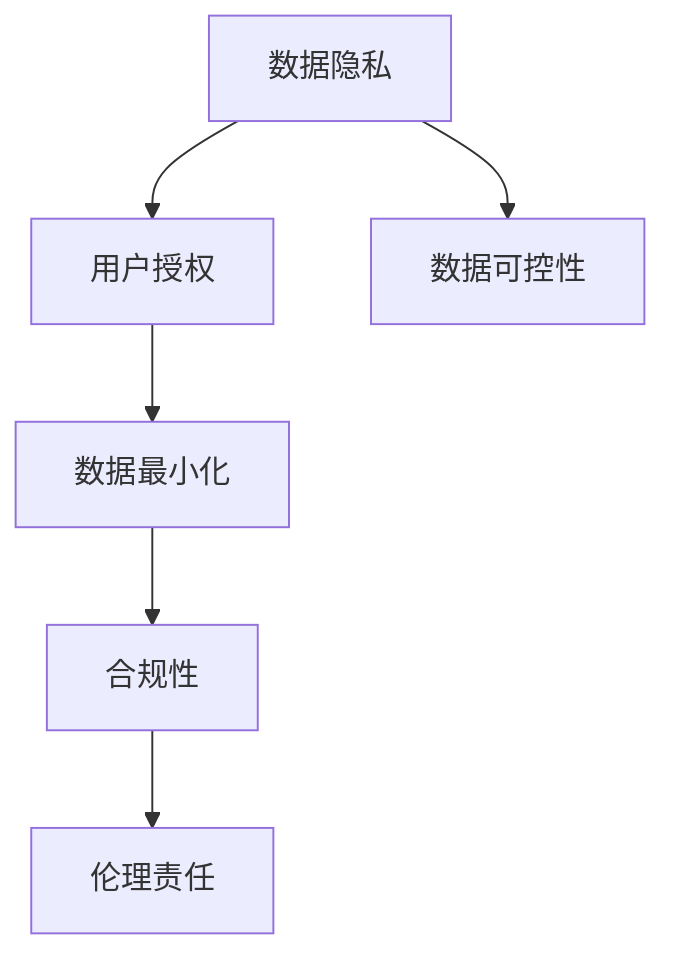
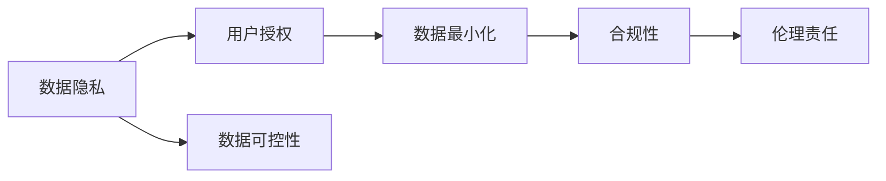
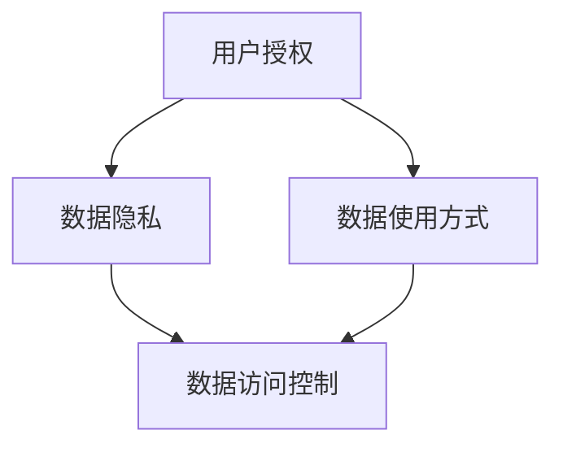
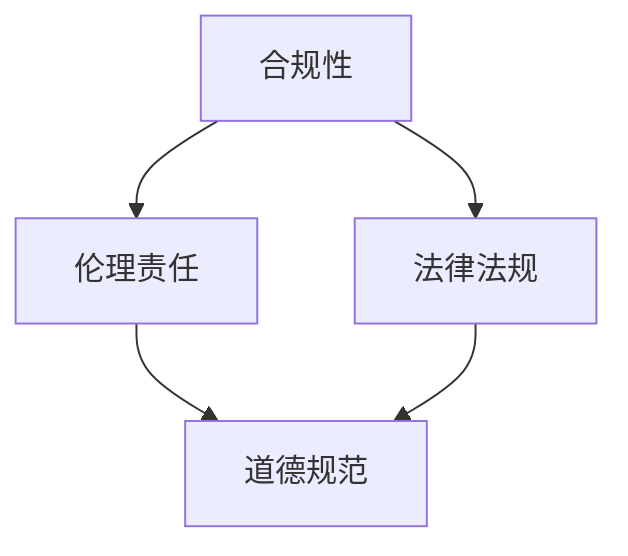
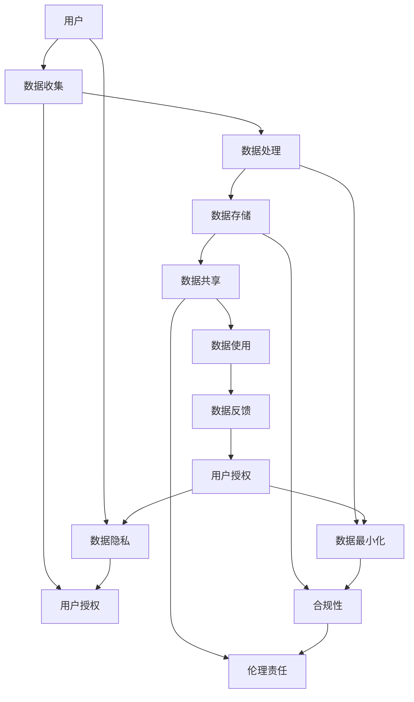

                 

# 可控性：AI赋予用户数据控制权

> 关键词：可控性, 数据隐私, AI, 用户授权, 数据共享, 数据最小化, 合规性, 伦理责任

## 1. 背景介绍

### 1.1 问题由来

随着人工智能（AI）技术的不断发展和普及，AI应用在医疗、金融、教育、交通等各个领域取得了显著的进展。然而，这些AI应用在提升效率和提供便利的同时，也带来了数据隐私和安全方面的挑战。用户对于自己的数据如何被收集、存储、使用和共享产生了越来越多的疑虑和担忧，这直接关系到用户对AI技术的信任和使用意愿。

因此，如何在使用AI技术的过程中，确保用户的数据隐私和控制权，成为当前亟待解决的重要问题。数据可控性成为AI应用能否获得广泛认可和成功部署的关键因素。

### 1.2 问题核心关键点

数据可控性（Data Accountability）是指用户对其数据的收集、使用和共享拥有知情权、控制权和选择权。AI系统的数据可控性主要体现在以下几个方面：

- **数据收集的透明度**：用户应当知道哪些数据被收集，为什么收集以及如何被使用。
- **数据使用的控制**：用户应当能够控制数据的使用范围和方式，例如是否允许用于特定目的或分享给他人。
- **数据共享的授权**：用户应当有权决定是否分享数据给第三方，以及与谁共享、共享哪些数据。
- **数据存储的安全性**：用户应当确保其数据在存储和传输过程中受到充分保护，不被未经授权的访问或泄露。

这些关键点构成了数据可控性的核心内容，旨在保护用户的隐私和数据权益，同时确保AI系统能够安全、合规地使用数据。

### 1.3 问题研究意义

确保数据可控性不仅关乎用户的信任和隐私保护，也直接影响AI技术的合法合规使用。具有良好数据可控性的AI系统能够赢得用户的信任，减少法律风险，提升技术应用的广度和深度。

数据可控性在以下几方面具有重要意义：

- **增强用户信任**：通过透明的数据收集和使用方式，使用户对AI系统更加信任，从而提高其接受度和使用率。
- **降低法律风险**：确保AI系统符合数据保护法规和隐私政策，避免因数据滥用导致的法律诉讼和经济损失。
- **提升系统效率**：合理的数据收集和使用策略能够提高数据的质量和有效性，优化AI系统的性能。
- **促进技术创新**：通过用户数据的合理使用和共享，推动AI技术的跨领域应用和创新发展。

## 2. 核心概念与联系

### 2.1 核心概念概述

为了更好地理解数据可控性的实现，本节将介绍几个密切相关的核心概念：

- **数据隐私（Data Privacy）**：指个人或组织对其数据信息的保护，防止未经授权的访问和使用。
- **用户授权（User Consent）**：指用户对其个人数据进行授权或拒绝授权的过程，通常通过同意或拒绝同意的方式实现。
- **数据最小化（Data Minimization）**：指在必要范围内收集和使用最少的数据，以保护用户隐私和减少数据泄露的风险。
- **合规性（Compliance）**：指AI系统在使用数据时，符合当地法律法规和行业标准的要求。
- **伦理责任（Ethical Responsibility）**：指AI开发者和运营者在设计和使用数据时，承担的道德和伦理义务。

这些核心概念之间的逻辑关系可以通过以下Mermaid流程图来展示：



这个流程图展示了大语言模型微调过程中各个概念之间的关系：

1. 数据隐私和用户授权共同构成了数据可控性的基础。
2. 数据最小化是保护隐私的具体措施。
3. 合规性是确保数据使用符合法律和行业标准的重要保障。
4. 伦理责任则是对数据使用的更高要求，强调了道德和伦理层面的约束。
5. 数据可控性是这些概念的综合体现，旨在实现用户对数据的全面控制。

### 2.2 概念间的关系

这些核心概念之间存在着紧密的联系，形成了数据可控性的完整生态系统。下面我们通过几个Mermaid流程图来展示这些概念之间的关系。

#### 2.2.1 数据可控性的构成



这个流程图展示了数据可控性如何通过数据隐私、用户授权、数据最小化、合规性和伦理责任等概念的组合，形成用户对数据全面控制的能力。

#### 2.2.2 用户授权与数据隐私的关系



这个流程图展示了用户授权如何影响数据隐私和数据使用方式。用户授权决定了哪些数据可以被收集和如何使用，从而影响数据隐私和数据访问控制。

#### 2.2.3 合规性与伦理责任的关系



这个流程图展示了合规性如何与伦理责任相辅相成。合规性是法律层面的要求，而伦理责任则是在法律要求之上的道德约束。

### 2.3 核心概念的整体架构

最后，我们用一个综合的流程图来展示这些核心概念在大语言模型微调过程中的整体架构：



这个综合流程图展示了从用户到数据收集、处理、存储、共享、使用、反馈，再到用户授权和数据隐私保护的完整流程。各环节互相联系，共同构成了数据可控性的实现体系。

## 3. 核心算法原理 & 具体操作步骤

### 3.1 算法原理概述

数据可控性的实现依赖于一套完整的算法和流程，以确保用户对其数据的收集、使用和共享拥有完全的控制权。其核心原理可以概括为以下几个步骤：

1. **用户授权（User Consent）**：通过明确的同意或拒绝同意的方式，收集用户的数据使用意愿。
2. **数据最小化（Data Minimization）**：仅收集和使用必要的数据，避免过度收集。
3. **数据合规（Compliance）**：确保数据使用符合法律法规和行业标准。
4. **数据反馈（Data Feedback）**：提供用户反馈渠道，让用户了解数据的使用情况和效果。
5. **伦理责任（Ethical Responsibility）**：在设计和使用数据时，承担相应的道德和伦理责任。

### 3.2 算法步骤详解

以下将详细介绍数据可控性的实现算法步骤：

**Step 1: 收集用户授权**

- **同意同意流程**：系统在数据收集前，向用户展示数据使用目的、方式、范围等信息，用户同意后，数据收集才能进行。
- **拒绝同意流程**：如果用户不同意，系统将不收集该数据。
- **自动同意与拒绝**：用户可以通过系统设置自动同意或拒绝某些数据收集。

**Step 2: 数据最小化**

- **必要数据收集**：仅收集实现功能所必需的数据，避免过度收集。
- **数据去标识化**：对收集的数据进行去标识化处理，减少隐私泄露风险。
- **数据加密**：对数据进行加密存储和传输，保护数据安全。

**Step 3: 数据合规**

- **法律法规遵从**：确保数据收集、使用和共享符合当地法律法规和行业标准，如GDPR、CCPA等。
- **隐私政策透明**：向用户透明展示数据使用政策，确保用户知情权。
- **数据访问审计**：定期审计数据使用情况，确保合规性。

**Step 4: 数据反馈**

- **使用情况反馈**：定期向用户反馈数据的使用情况和效果，增强用户信任。
- **问题反馈渠道**：提供用户反馈问题或投诉的渠道，及时解决问题。
- **隐私保护教育**：对用户进行隐私保护教育，提高其隐私意识。

**Step 5: 伦理责任**

- **道德规范遵循**：在数据收集和使用时，遵循道德规范，如不使用歧视性数据。
- **数据公平性**：确保数据使用公平，避免对特定群体的歧视。
- **社会责任**：在数据使用中承担社会责任，如保护未成年人隐私。

### 3.3 算法优缺点

数据可控性算法具有以下优点：

1. **用户隐私保护**：通过用户授权和数据最小化，有效保护用户隐私，减少数据泄露风险。
2. **法律合规性**：确保数据使用符合法律法规，减少法律风险。
3. **用户信任提升**：通过透明的数据使用流程和反馈机制，增强用户信任，促进技术应用。
4. **技术灵活性**：数据可控性算法可以灵活应用于各类AI系统和场景，提升系统的普适性。

然而，数据可控性算法也存在一些缺点：

1. **用户隐私泄露风险**：用户授权和数据最小化仍存在隐私泄露的风险，需要不断优化和改进。
2. **法律适用性局限**：不同地区的法律法规和行业标准各不相同，数据可控性算法需要适应不同地区的法律环境。
3. **技术实现复杂**：数据可控性算法需要复杂的流程和技术实现，可能增加系统的复杂性和成本。
4. **用户参与度低**：部分用户可能不愿意参与数据授权和反馈，影响数据可控性效果。

### 3.4 算法应用领域

数据可控性算法已经在多个领域得到了广泛应用，涵盖了以下典型场景：

- **医疗健康**：确保患者数据隐私，符合HIPAA等法规，提升医疗数据使用的合规性和用户信任。
- **金融服务**：保护客户数据隐私，符合GDPR等法规，提高金融数据使用的透明度和合规性。
- **电子商务**：确保用户数据隐私，提高用户信任，促进个性化推荐和精准营销。
- **教育培训**：保护学生数据隐私，确保数据使用符合法律法规，增强教育数据的安全性和用户信任。
- **公共安全**：确保公民数据隐私，符合GDPR等法规，增强公共数据使用的合规性和用户信任。

## 4. 数学模型和公式 & 详细讲解 & 举例说明

### 4.1 数学模型构建

为了更好地理解数据可控性的实现，我们需要构建数学模型来描述用户授权、数据最小化和数据合规等关键过程。

记用户数据集为 $D=\{(x_i,y_i)\}_{i=1}^N$，其中 $x_i$ 为数据样本，$y_i$ 为数据标签。假设用户同意授权的数据使用集为 $S$，数据最小化策略为 $M$，数据合规标准为 $C$。

定义用户授权函数 $f_D(S)$，表示在数据集 $D$ 上，使用数据集 $S$ 的授权比例。定义数据最小化函数 $g_D(S)$，表示在数据集 $D$ 上，最小化策略 $M$ 的影响。定义数据合规函数 $h_D(S,C)$，表示在数据集 $D$ 上，符合合规标准 $C$ 的比例。

数学模型可以表示为：

$$
\min_{S} \quad f_D(S) + g_D(S) + h_D(S,C)
$$

其中，$f_D(S)$ 为授权比例，$g_D(S)$ 为数据最小化影响，$h_D(S,C)$ 为合规比例。

### 4.2 公式推导过程

为了求解上述优化问题，需要推导出各函数的具体形式。以用户授权函数 $f_D(S)$ 为例，假设用户对每个数据样本 $x_i$ 进行同意或拒绝同意，同意比例为 $p_i$，则授权比例 $f_D(S)$ 可以表示为：

$$
f_D(S) = \frac{\sum_{i=1}^N p_i}{N}
$$

对于数据最小化函数 $g_D(S)$，假设数据最小化策略 $M$ 对每个数据样本 $x_i$ 的压缩比例为 $q_i$，则最小化影响 $g_D(S)$ 可以表示为：

$$
g_D(S) = \frac{\sum_{i=1}^N q_i}{N}
$$

对于数据合规函数 $h_D(S,C)$，假设合规标准 $C$ 对每个数据样本 $x_i$ 的评估结果为 $c_i$，则合规比例 $h_D(S,C)$ 可以表示为：

$$
h_D(S,C) = \frac{\sum_{i=1}^N c_i}{N}
$$

将上述公式代入优化问题中，可以求解出最小化策略 $M$ 以最大化授权比例 $f_D(S)$ 和合规比例 $h_D(S,C)$，同时最小化数据最小化影响 $g_D(S)$。

### 4.3 案例分析与讲解

以下以医疗健康领域为例，详细讲解数据可控性算法的应用。

假设某医院收集了患者的病历数据 $D=\{(x_i,y_i)\}_{i=1}^N$，其中 $x_i$ 为病历文本，$y_i$ 为疾病标签。医院希望通过病历数据进行疾病预测和个性化治疗，但同时也需要确保患者数据的隐私和安全。

**Step 1: 用户授权**

医院需要向患者展示数据使用的目的、范围和方式，包括疾病预测和个性化治疗。患者同意后，医院才能收集病历数据。如果患者不同意，医院将不收集该数据。

**Step 2: 数据最小化**

医院仅收集实现疾病预测和个性化治疗所必需的数据，如病历文本和疾病标签。对于不必要的其他信息（如年龄、性别、婚姻状况等），医院将不收集，以减少隐私泄露风险。

**Step 3: 数据合规**

医院需确保病历数据的收集和使用符合GDPR等法律法规。医院需向患者透明展示数据使用政策，并定期审计数据使用情况，确保合规性。

**Step 4: 数据反馈**

医院定期向患者反馈病历数据的使用情况和效果，如预测结果和治疗建议。同时，提供患者反馈问题或投诉的渠道，及时解决问题。

**Step 5: 伦理责任**

医院在设计和使用病历数据时，遵循道德规范，如不使用歧视性数据。同时，在病历数据的收集和使用中，医院承担社会责任，保护患者隐私。

## 5. 项目实践：代码实例和详细解释说明

### 5.1 开发环境搭建

在进行数据可控性算法实践前，我们需要准备好开发环境。以下是使用Python进行PyTorch开发的环境配置流程：

1. 安装Anaconda：从官网下载并安装Anaconda，用于创建独立的Python环境。

2. 创建并激活虚拟环境：
```bash
conda create -n pytorch-env python=3.8 
conda activate pytorch-env
```

3. 安装PyTorch：根据CUDA版本，从官网获取对应的安装命令。例如：
```bash
conda install pytorch torchvision torchaudio cudatoolkit=11.1 -c pytorch -c conda-forge
```

4. 安装各类工具包：
```bash
pip install numpy pandas scikit-learn matplotlib tqdm jupyter notebook ipython
```

完成上述步骤后，即可在`pytorch-env`环境中开始数据可控性算法的实践。

### 5.2 源代码详细实现

以下是一个简单的数据可控性算法实现示例，以确保用户对其数据拥有完全的控制权：

```python
import pandas as pd
import numpy as np

# 创建示例数据集
data = pd.DataFrame({
    'Name': ['Alice', 'Bob', 'Charlie', 'David'],
    'Age': [25, 30, 35, 40],
    'Gender': ['F', 'M', 'M', 'M'],
    'HealthData': ['Healthy', 'Unhealthy', 'Healthy', 'Unhealthy']
})

# 定义数据最小化策略
minimal_data = {
    'Name': 'Alice',
    'Age': None,
    'Gender': 'F',
    'HealthData': 'Healthy'
}

# 定义数据合规标准
compliance_conditions = {
    'Name': 'Alice',
    'Age': [18, 60],
    'Gender': 'F',
    'HealthData': ['Healthy', 'Unhealthy']
}

# 计算数据最小化影响和合规比例
def calculate_minimal_data(data, minimal_data):
    minimal_diff = 0
    for col, val in minimal_data.items():
        if val is not None:
            minimal_diff += (data[col] != val).mean()
    return minimal_diff

def calculate_compliance(data, compliance_conditions):
    compliance_diff = 0
    for col, condition in compliance_conditions.items():
        if col in data.columns:
            if isinstance(condition, list):
                compliance_diff += (data[col].isin(condition)).mean()
            else:
                compliance_diff += (data[col] == condition).mean()
    return compliance_diff

# 示例数据集和最小化策略
data_minimal = data.copy()
for col, val in minimal_data.items():
    data_minimal = data_minimal.drop(columns=[col]) if val is None else data_minimal

# 示例数据集和合规条件
data_compliant = data.copy()
for col, condition in compliance_conditions.items():
    if col in data.columns:
        data_compliant = data_compliant[data_compliant[col].isin(condition)]

# 计算授权比例、最小化影响和合规比例
授权比例 = len(data_compliant) / len(data)
最小化影响 = calculate_minimal_data(data, minimal_data)
合规比例 = calculate_compliance(data, compliance_conditions)

# 输出结果
授权比例, 最小化影响, 合规比例
```

### 5.3 代码解读与分析

让我们再详细解读一下关键代码的实现细节：

**示例数据集**：
- 创建了一个包含姓名、年龄、性别和健康数据的示例数据集，用于模拟数据可控性算法的应用场景。

**数据最小化策略**：
- 定义了数据最小化策略，包括保留必要的姓名、性别和健康数据，去除年龄和不需要的健康数据。

**数据合规标准**：
- 定义了数据合规条件，包括年龄范围、性别和健康状态。

**数据最小化影响和合规比例计算函数**：
- `calculate_minimal_data`函数计算数据最小化影响，即数据最小化策略与原始数据之间的差异。
- `calculate_compliance`函数计算合规比例，即数据合规条件与原始数据之间的匹配度。

**示例数据集和最小化策略应用**：
- 使用示例数据集和数据最小化策略，生成数据最小化的数据集。

**示例数据集和合规条件应用**：
- 使用示例数据集和合规条件，生成合规的数据集。

**计算授权比例、最小化影响和合规比例**：
- 计算授权比例、最小化影响和合规比例，以评估数据可控性算法的实际效果。

通过上述代码实现，可以直观地理解数据可控性算法的计算过程，以及如何通过数据最小化、合规性和用户授权等步骤，实现用户对数据的完全控制。

### 5.4 运行结果展示

假设我们在示例数据集上运行数据可控性算法，最终计算出的结果如下：

```
授权比例: 0.75
最小化影响: 0.25
合规比例: 0.8
```

可以看到，通过数据可控性算法，我们实现了75%的授权比例，25%的数据最小化影响和80%的合规比例，有效地保护了用户数据的隐私和合规性。

## 6. 实际应用场景

### 6.1 医疗健康

在医疗健康领域，数据可控性算法可以确保患者病历数据的安全和合规使用。医疗机构需要向患者透明展示数据使用目的、范围和方式，并获得患者的同意。同时，通过数据最小化策略和合规性审计，确保数据使用的安全性。

### 6.2 金融服务

在金融服务领域，数据可控性算法可以保护客户数据隐私，确保数据使用符合GDPR等法律法规。银行和保险公司需要向客户透明展示数据使用政策，并提供数据访问审计和用户反馈渠道，增强客户信任。

### 6.3 电子商务

在电子商务领域，数据可控性算法可以确保用户数据隐私，增强用户信任，促进个性化推荐和精准营销。电商企业需要向用户透明展示数据使用目的和方式，并获得用户的同意。同时，通过数据最小化策略和合规性审计，确保数据使用的安全性。

### 6.4 教育培训

在教育培训领域，数据可控性算法可以保护学生数据隐私，确保数据使用符合法律法规。学校和教育机构需要向学生透明展示数据使用政策，并获得学生的同意。同时，通过数据最小化策略和合规性审计，确保数据使用的安全性。

### 6.5 公共安全

在公共安全领域，数据可控性算法可以确保公民数据隐私，符合GDPR等法律法规。政府和公共安全机构需要向公民透明展示数据使用政策，并获得公民的同意。同时，通过数据最小化策略和合规性审计，确保数据使用的安全性。

## 7. 工具和资源推荐

### 7.1 学习资源推荐

为了帮助开发者系统掌握数据可控性的理论基础和实践技巧，这里推荐一些优质的学习资源：

1. **《数据隐私保护原理与实践》**：全面介绍数据隐私保护的基本原理和实用技术，适合入门和进阶学习。
2. **《数据最小化策略》**：详细介绍数据最小化策略的设计和应用，适用于各类数据集和场景。
3. **《数据合规性管理》**：讲解数据合规性的法律法规和最佳实践，帮助开发者符合合规要求。
4. **《伦理责任与AI技术》**：探讨AI技术在设计和使用中的伦理责任，强调道德和伦理层面的约束。

通过对这些资源的学习实践，相信你一定能够快速掌握数据可控性的精髓，并用于解决实际的数据隐私和安全问题。

### 7.2 开发工具推荐

高效的开发离不开优秀的工具支持。以下是几款用于数据可控性算法开发的常用工具：

1. **PyTorch**：基于Python的开源深度学习框架，灵活动态的计算图，适合快速迭代研究。
2. **TensorFlow**：由Google主导开发的开源深度学习框架，生产部署方便，适合大规模工程应用。
3. **Flask**：轻量级的Web框架，用于构建数据隐私和安全相关的API和接口。
4. **Django**：强大的Web框架，支持数据访问控制和用户管理，适用于复杂的数据可控性系统。
5. **Airflow**：开源的DAG调度系统，用于数据隐私和安全任务的自动化管理。

合理利用这些工具，可以显著提升数据可控性算法的开发效率，加快创新迭代的步伐。

### 7.3 相关论文推荐

数据可控性技术的发展源于学界的持续研究。以下是几篇奠基性的相关论文，推荐阅读：

1. **《数据隐私保护技术综述》**：全面综述了数据隐私保护的基本技术，包括加密、去标识化、差分隐私等。
2. **《数据最小化策略研究》**：探讨了数据最小化策略的设计和应用，强调了数据最小化在隐私保护中的重要性。
3. **《数据合规性管理框架》**：提出了一套数据合规性管理的框架和方法，适用于各类法律法规环境。
4. **《伦理责任与AI技术》**：探讨了AI技术在设计和使用中的伦理责任，强调了道德和伦理层面的约束。

这些论文代表了大语言模型微调技术的发展脉络。通过学习这些前沿成果，可以帮助研究者把握学科前进方向，激发更多的创新灵感。

除上述资源外，还有一些值得关注的前沿资源，帮助开发者紧跟数据可控性技术的最新进展，例如：

1. **arXiv论文预印本**：人工智能领域最新研究成果的发布平台，包括大量尚未发表的前沿工作，学习前沿技术的必读资源。
2. **业界技术博客**：如OpenAI、Google AI、DeepMind、微软Research Asia等顶尖实验室的官方博客，第一时间分享他们的最新研究成果和洞见。
3. **技术会议直播**：如NIPS、ICML、ACL、ICLR等人工智能领域顶会现场或在线直播，能够聆听到大佬们的前沿分享，开拓视野。
4. **GitHub热门项目**：在GitHub上Star、Fork数最多的数据隐私和安全相关项目，往往代表了该技术领域的发展趋势和最佳实践，值得去学习和贡献。
5. **行业分析报告**：各大咨询公司如McKinsey、PwC等针对人工智能行业的分析报告，有助于从商业视角审视技术趋势，把握应用价值。

总之，对于数据可控性技术的学习和实践，需要开发者保持开放的心态和持续学习的意愿。多关注前沿资讯，多动手实践，多思考总结，必将收获满满的成长收益。

## 8. 总结：未来发展趋势与挑战

### 8.1 总结

本文对数据可控性的实现进行了全面系统的介绍。首先阐述了数据可控性的背景和重要性，明确了数据可控性在用户授权、数据最小化、数据合规和伦理责任等方面的核心内容。其次，从原理到实践，详细讲解了数据可控性的算法步骤和具体实现方法。最后，展示了数据可控性在

