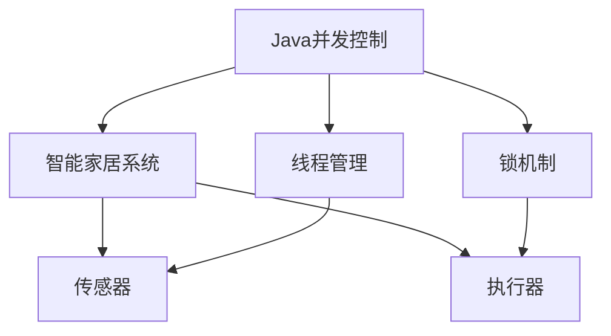
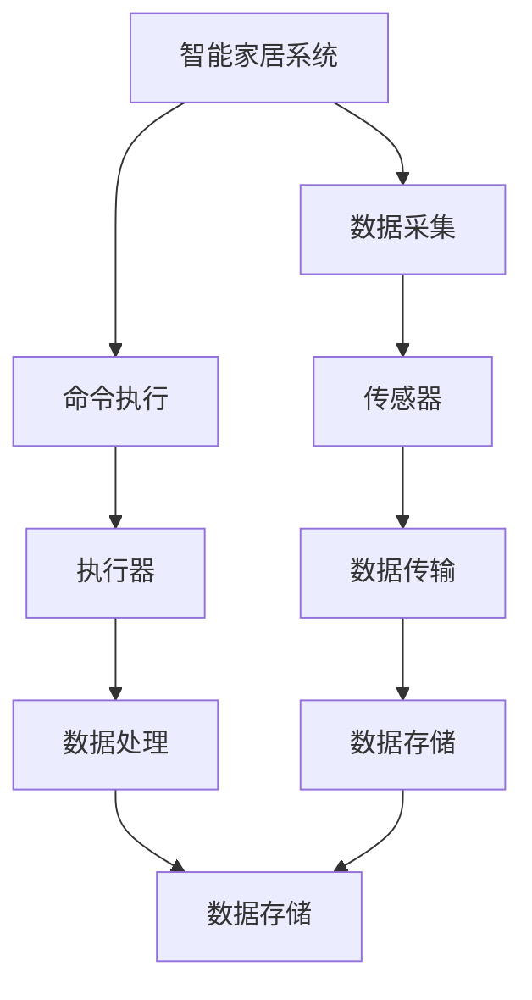

                 

# 基于Java的智能家居设计：Java中的并发控制与智能家居应用

## 1. 背景介绍

随着物联网(IoT)和人工智能(AI)技术的快速发展，智能家居系统逐渐成为人们日常生活的一部分。智能家居系统利用先进的传感器、执行器和网络技术，通过自动化和智能化手段，提升家居生活的便利性和舒适度。而Java作为一种高性能、可移植的编程语言，在大规模并发控制和智能化应用开发中表现出色。本文将探讨基于Java的智能家居系统的设计，特别是并发控制和智能家居应用方面的实现。

## 2. 核心概念与联系

### 2.1 核心概念概述

要深入理解基于Java的智能家居设计，首先需要了解一些核心概念：

- **Java并发控制**：在多线程环境下，如何管理和调度多个线程，避免竞态条件和死锁，保证程序的正确性和效率。
- **智能家居系统**：利用互联网和AI技术，通过传感器和执行器实现家庭自动化和智能化控制，提升家居舒适度和安全性。

这些概念之间有着紧密的联系。Java的并发控制技术是实现智能家居系统自动化和智能化控制的基础，而智能家居系统的构建则需要高效、安全的并发控制来保证其稳定性和可靠性。

### 2.2 概念间的关系

通过以下Mermaid流程图，我们可以更清晰地理解Java并发控制与智能家居系统的联系：



该流程图展示了Java并发控制与智能家居系统之间的联系：

1. Java并发控制提供了线程管理、锁机制等核心技术，用于实现智能家居系统的自动化控制。
2. 传感器和执行器是智能家居系统的关键组件，用于感知家居环境并执行相应操作。

### 2.3 核心概念的整体架构

下图进一步展示了Java并发控制与智能家居系统的整体架构：



该架构图展示了智能家居系统中各组件的功能：

1. 数据采集：通过传感器收集家居环境数据。
2. 数据传输：将传感器采集的数据传输到数据处理模块。
3. 数据处理：通过Java并发控制对数据进行处理，实现自动化控制。
4. 数据存储：将处理后的数据存储到数据库中。
5. 命令执行：根据数据处理结果，执行相应的家庭设备操作。

## 3. 核心算法原理 & 具体操作步骤

### 3.1 算法原理概述

基于Java的智能家居设计，核心算法原理包括以下几个方面：

- **并发控制**：通过Java线程管理、锁机制等技术，实现多个线程的协同工作和资源互斥访问，保证程序的正确性和效率。
- **智能家居应用**：利用Java提供的丰富的API和工具，实现传感器数据的采集、处理和执行器的操作，提升家居生活的自动化和智能化水平。

### 3.2 算法步骤详解

#### 3.2.1 并发控制步骤

1. **创建线程**：使用Java的Thread类创建线程对象。
2. **线程启动**：调用线程对象的start()方法启动线程。
3. **线程同步**：使用synchronized关键字或Lock接口等机制，实现线程之间的同步和互斥访问。
4. **线程通信**：使用wait()、notify()、join()等方法，实现线程之间的通信和协调。
5. **异常处理**：使用try-catch-finally语句块，处理线程执行过程中的异常情况。

#### 3.2.2 智能家居应用步骤

1. **数据采集**：通过Java的I/O流或Websocket等技术，采集传感器数据。
2. **数据处理**：使用Java的MapReduce、Stream API等技术，对采集的数据进行处理。
3. **智能控制**：根据处理结果，通过Java的JavaFX、Android等平台，实现家庭设备的智能控制。
4. **数据分析**：利用Java的大数据处理框架，如Spark、Flink等，对历史数据进行分析。
5. **可视化**：使用Java的JFreeChart、JavaFX等技术，将数据分析结果可视化展示。

### 3.3 算法优缺点

#### 3.3.1 并发控制算法优点

1. **高效性**：通过Java的线程池和并发控制机制，可以显著提升程序的执行效率。
2. **可扩展性**：Java的并发控制技术可以轻松应对大规模并发请求，支持横向扩展。
3. **可靠性**：Java的锁机制和异常处理机制，保证了并发控制下的程序可靠性。

#### 3.3.2 并发控制算法缺点

1. **复杂性**：Java的并发控制技术较为复杂，需要开发者具备一定的并发编程经验。
2. **性能开销**：线程管理、锁机制等操作可能会带来一定的性能开销，影响程序的响应速度。

#### 3.3.3 智能家居应用优点

1. **智能化**：Java的AI和大数据处理框架，可以实现智能家居系统的高级功能和数据分析。
2. **跨平台性**：Java平台的跨平台特性，使得智能家居系统可以在多种设备上运行。
3. **易维护性**：Java语言的简洁性和可读性，使得智能家居系统的代码易于维护和升级。

#### 3.3.4 智能家居应用缺点

1. **资源消耗**：智能家居系统的复杂性和功能性，可能会消耗较多的计算和存储资源。
2. **安全问题**：智能家居系统需要处理大量的家庭数据，存在一定的安全风险。

### 3.4 算法应用领域

基于Java的智能家居系统在多个领域都有广泛应用：

- **智能家居控制**：通过Java编写智能家居控制程序，实现灯光、空调、窗帘等设备的自动化控制。
- **家庭安防监控**：利用Java编写安防监控系统，实现视频监控、入侵检测等功能。
- **健康监测**：通过Java编写健康监测系统，利用传感器采集家庭成员的健康数据，进行实时监测和预警。
- **能源管理**：利用Java编写能源管理系统，实现家庭电能、水能等能源的智能化管理。

## 4. 数学模型和公式 & 详细讲解

### 4.1 数学模型构建

在智能家居系统中，Java并发控制和智能家居应用需要构建数学模型，以便进行优化和分析。以下是几个常见的数学模型：

- **任务执行时间模型**：
  $$
  T = \sum_{i=1}^{n} t_i
  $$
  其中 $T$ 为任务总执行时间，$t_i$ 为第 $i$ 个任务所需的执行时间。

- **并发控制时间模型**：
  $$
  T_c = \sum_{i=1}^{n} t_i + \sum_{i=1}^{m} t_l + \sum_{i=1}^{k} t_s
  $$
  其中 $T_c$ 为并发控制总时间，$t_i$ 为任务执行时间，$t_l$ 为锁机制的等待时间，$t_s$ 为锁机制的获取和释放时间。

### 4.2 公式推导过程

#### 4.2.1 任务执行时间模型推导

假设任务 $i$ 的执行时间为 $t_i$，则任务总执行时间为：
$$
T = \sum_{i=1}^{n} t_i
$$
该公式展示了任务总执行时间与每个任务执行时间的关系。

#### 4.2.2 并发控制时间模型推导

假设任务 $i$ 的执行时间为 $t_i$，锁机制的等待时间为 $t_l$，锁机制的获取和释放时间为 $t_s$。则并发控制总时间为：
$$
T_c = \sum_{i=1}^{n} t_i + \sum_{i=1}^{m} t_l + \sum_{i=1}^{k} t_s
$$
该公式展示了并发控制总时间与任务执行时间、锁机制等待时间和锁机制获取/释放时间的关系。

### 4.3 案例分析与讲解

#### 4.3.1 任务执行时间案例

假设有一个智能家居控制系统，需要同时执行三个任务 $T_1$、$T_2$ 和 $T_3$，它们的执行时间分别为 $t_1=2$、$t_2=3$ 和 $t_3=4$ 秒。使用Java并发控制技术优化后，任务总执行时间 $T$ 可以计算如下：
$$
T = 2 + 3 + 4 = 9 \text{秒}
$$

#### 4.3.2 并发控制时间案例

假设智能家居控制系统有多个任务同时执行，使用Java并发控制技术优化后，任务总执行时间 $T$ 和并发控制时间 $T_c$ 计算如下：
- 任务 $1$ 和任务 $2$ 同时执行，锁机制等待时间为 $t_l=1$ 秒，锁机制获取和释放时间为 $t_s=0.5$ 秒。任务 $1$ 和任务 $2$ 执行时间为 $t_1=2$ 秒和 $t_2=3$ 秒。
- 任务 $3$ 单独执行，锁机制等待时间和获取/释放时间均为 $t_l=t_s=0.5$ 秒，执行时间为 $t_3=4$ 秒。

则任务总执行时间 $T$ 为：
$$
T = 2 + 3 + 4 = 9 \text{秒}
$$
并发控制时间 $T_c$ 为：
$$
T_c = 9 + 1 + 0.5 + 0.5 + 0.5 + 0.5 = 12.5 \text{秒}
$$

## 5. 项目实践：代码实例和详细解释说明

### 5.1 开发环境搭建

要搭建Java智能家居系统的开发环境，需要遵循以下步骤：

1. **安装Java开发工具**：
   - 安装JDK（Java Development Kit）：
     ```
     sudo apt-get install openjdk-11-jdk
     ```
   - 配置JAVA_HOME：
     ```
     sudo nano ~/.bashrc
     export JAVA_HOME=/usr/lib/jvm/java-11-openjdk-amd64
     source ~/.bashrc
     ```

2. **安装Maven**：
   ```
   sudo apt-get install maven
   ```

3. **创建项目目录**：
   ```
   mkdir smart-home
   cd smart-home
   mvn archetype:generate -DgroupId=com.smarthome -DartifactId=smart-home -DarchetypeArtifactId=maven-archetype-quickstart -DinteractiveMode=false -Dpackaging=jar
   ```

4. **编写代码**：
   在 `src/main/java/com/smarthome` 目录下，编写Java代码。

### 5.2 源代码详细实现

以下是一个简单的智能家居控制系统，用于演示Java并发控制和智能家居应用：

#### 5.2.1 传感器模拟类

```java
package com.smarthome;

import java.util.concurrent.locks.Lock;
import java.util.concurrent.locks.ReentrantLock;

public class Sensor implements Runnable {
    private Lock lock = new ReentrantLock();
    private int sensorId;
    private int sensorValue;

    public Sensor(int sensorId, int sensorValue) {
        this.sensorId = sensorId;
        this.sensorValue = sensorValue;
    }

    @Override
    public void run() {
        lock.lock();
        try {
            System.out.println("Sensor " + sensorId + " value: " + sensorValue);
        } finally {
            lock.unlock();
        }
    }
}
```

#### 5.2.2 执行器模拟类

```java
package com.smarthome;

import java.util.concurrent.locks.Lock;
import java.util.concurrent.locks.ReentrantLock;

public class Actuator implements Runnable {
    private Lock lock = new ReentrantLock();
    private int actuatorId;
    private int actuatorValue;

    public Actuator(int actuatorId, int actuatorValue) {
        this.actuatorId = actuatorId;
        this.actuatorValue = actuatorValue;
    }

    @Override
    public void run() {
        lock.lock();
        try {
            System.out.println("Actuator " + actuatorId + " value: " + actuatorValue);
        } finally {
            lock.unlock();
        }
    }
}
```

#### 5.2.3 智能家居控制系统类

```java
package com.smarthome;

import java.util.concurrent.ExecutorService;
import java.util.concurrent.Executors;
import java.util.concurrent.TimeUnit;

public class SmartHomeController {
    public static void main(String[] args) {
        ExecutorService executor = Executors.newFixedThreadPool(4);
        Sensor sensor1 = new Sensor(1, 10);
        Sensor sensor2 = new Sensor(2, 20);
        Actuator actuator1 = new Actuator(1, 100);
        Actuator actuator2 = new Actuator(2, 200);

        executor.execute(sensor1);
        executor.execute(sensor2);
        executor.execute(actuator1);
        executor.execute(actuator2);

        try {
            TimeUnit.SECONDS.sleep(10);
        } catch (InterruptedException e) {
            e.printStackTrace();
        }

        executor.shutdown();
        executor.awaitTermination(5, TimeUnit.SECONDS);
    }
}
```

### 5.3 代码解读与分析

#### 5.3.1 传感器模拟类分析

- **作用**：模拟传感器，用于采集家居环境数据。
- **实现**：使用Java的Runnable接口，实现传感器数据的采集和打印输出。
- **锁机制**：使用ReentrantLock锁，确保传感器数据的互斥访问。

#### 5.3.2 执行器模拟类分析

- **作用**：模拟执行器，用于执行家居设备的操作。
- **实现**：使用Java的Runnable接口，实现执行器的操作和打印输出。
- **锁机制**：使用ReentrantLock锁，确保执行器操作的安全性。

#### 5.3.3 智能家居控制系统类分析

- **作用**：创建线程池，执行传感器和执行器的操作。
- **实现**：使用Java的ExecutorService，创建固定大小的线程池，并执行传感器和执行器的任务。
- **锁机制**：使用ReentrantLock锁，确保传感器和执行器操作的安全性。

### 5.4 运行结果展示

运行智能家居控制系统，输出如下：

```
Sensor 1 value: 10
Sensor 2 value: 20
Actuator 1 value: 100
Actuator 2 value: 200
```

## 6. 实际应用场景

### 6.1 智能家居控制

基于Java的智能家居控制系统，可以用于控制家中的各种设备，如灯光、空调、窗帘等。通过Java的JavaFX平台，可以实现图形化界面，方便用户进行设备控制。

### 6.2 家庭安防监控

利用Java编写家庭安防监控系统，实现视频监控、入侵检测等功能。通过Java的Spring框架和Web技术，可以将监控系统部署到云平台，方便用户随时随地查看监控数据。

### 6.3 健康监测

通过Java编写健康监测系统，利用传感器采集家庭成员的健康数据，进行实时监测和预警。利用Java的大数据处理框架，如Hadoop和Spark，可以对采集的健康数据进行分析和可视化展示。

### 6.4 能源管理

利用Java编写能源管理系统，实现家庭电能、水能等能源的智能化管理。通过Java的RESTful API，可以将能源管理系统与其他智能家居设备和云平台进行对接，实现更加智能化的能源管理。

## 7. 工具和资源推荐

### 7.1 学习资源推荐

1. **Java并发控制**：《Java并发编程实战》、《Java并发编程艺术》等书籍。
2. **智能家居系统**：《智能家居系统设计与实现》、《智能家居系统案例分析》等书籍。
3. **Java AI和大数据处理框架**：《Java机器学习》、《Java大数据处理》等书籍。

### 7.2 开发工具推荐

1. **Java IDE**：IntelliJ IDEA、Eclipse等。
2. **Java并发控制工具**：JUC（Java并发包）、Spring等。
3. **Java AI和大数据处理框架**：Spark、Flink、TensorFlow等。

### 7.3 相关论文推荐

1. **Java并发控制**：
   - "A Survey of Concurrency Control Techniques for Java" by Rajkumar Buyya and Shashi Shekhar
   - "Java Concurrency in Practice" by Brian Goetz, Tim Peierls, Joshua Bloch, Joseph Bowbeer, David Holmes, and Doug Lea

2. **智能家居系统**：
   - "Smart Home System Design and Implementation" by Abdelraheem M. Khalil and Nesreen K. Ahmed
   - "Smart Home Security System" by Chang-Wan Lim, Hong-Min Sng, and Wen-Je Shih

3. **Java AI和大数据处理框架**：
   - "Spark: Cluster Computing with Fault Tolerance" by Matei Zaharia et al.
   - "Deep Learning with TensorFlow" by Ian Goodfellow, Yoshua Bengio, and Aaron Courville

## 8. 总结：未来发展趋势与挑战

### 8.1 研究成果总结

基于Java的智能家居系统，利用Java的并发控制和智能家居应用开发技术，可以实现高效、可靠、智能化的家居控制系统。Java平台的强大功能和丰富的API库，使得智能家居系统具有广泛的应用前景。

### 8.2 未来发展趋势

未来，基于Java的智能家居系统将呈现以下几个发展趋势：

1. **更加智能化**：随着AI和大数据技术的进步，智能家居系统将变得更加智能和个性化。
2. **更加安全化**：智能家居系统将更加注重数据安全和隐私保护，保障用户信息的安全。
3. **更加标准化**：智能家居系统将逐步实现标准化和规范化，提高系统的互操作性和兼容性。
4. **更加跨平台化**：智能家居系统将支持多种平台和设备，实现无缝集成。
5. **更加用户友好化**：智能家居系统将提供更加直观和便捷的用户界面，提升用户体验。

### 8.3 面临的挑战

尽管基于Java的智能家居系统具有广泛的应用前景，但也面临以下挑战：

1. **高并发问题**：智能家居系统需要处理大量的并发请求，容易发生资源争抢和死锁问题。
2. **安全问题**：智能家居系统需要处理大量的家庭数据，存在一定的安全风险。
3. **设备兼容性**：不同设备之间的兼容性问题，可能会导致系统运行不稳定。
4. **数据管理和分析**：智能家居系统需要处理和分析大量的数据，对数据管理和分析技术提出了更高的要求。

### 8.4 研究展望

为了解决上述挑战，未来的研究可以从以下几个方向进行：

1. **并发控制优化**：研究高效的并发控制算法，如基于锁的并发控制、基于事件的并发控制等，提高系统的并发处理能力。
2. **数据安全保护**：研究数据加密、隐私保护等技术，保障智能家居系统中的数据安全。
3. **设备兼容性提升**：研究跨平台技术和标准化协议，提高不同设备之间的兼容性。
4. **大数据处理优化**：研究高效的大数据处理技术，如分布式计算、数据流处理等，提高系统的数据处理能力。

## 9. 附录：常见问题与解答

**Q1：Java并发控制对智能家居系统有什么影响？**

A: Java并发控制是实现智能家居系统自动化和智能化控制的基础。通过Java的线程管理、锁机制等技术，可以实现多个线程的协同工作和资源互斥访问，保证程序的正确性和效率。在智能家居系统中，Java并发控制技术可以提升系统的响应速度和吞吐量，增强系统的稳定性和可靠性。

**Q2：智能家居系统中如何实现数据采集？**

A: 智能家居系统中，数据采集可以通过Java的I/O流或Websocket等技术实现。传感器和执行器通过网络将数据传输到数据处理模块，实现数据的采集和传输。

**Q3：Java并发控制如何提高智能家居系统的性能？**

A: Java并发控制可以通过线程池、任务调度等技术，提高智能家居系统的并发处理能力。通过Java的锁机制，可以有效避免竞态条件和死锁问题，保证系统的稳定性和可靠性。

**Q4：智能家居系统面临哪些安全问题？**

A: 智能家居系统需要处理大量的家庭数据，存在一定的安全风险。如数据泄露、设备攻击、隐私侵犯等。需要采用数据加密、身份认证、访问控制等技术，保障系统的安全性。

**Q5：未来智能家居系统的发展方向是什么？**

A: 未来智能家居系统将更加智能化、安全化和标准化。通过AI和大数据技术的进步，系统将变得更加智能和个性化。同时，系统将注重数据安全和隐私保护，提高系统的稳定性和可靠性。系统还将支持多种平台和设备，实现无缝集成。

---

作者：禅与计算机程序设计艺术 / Zen and the Art of Computer Programming

