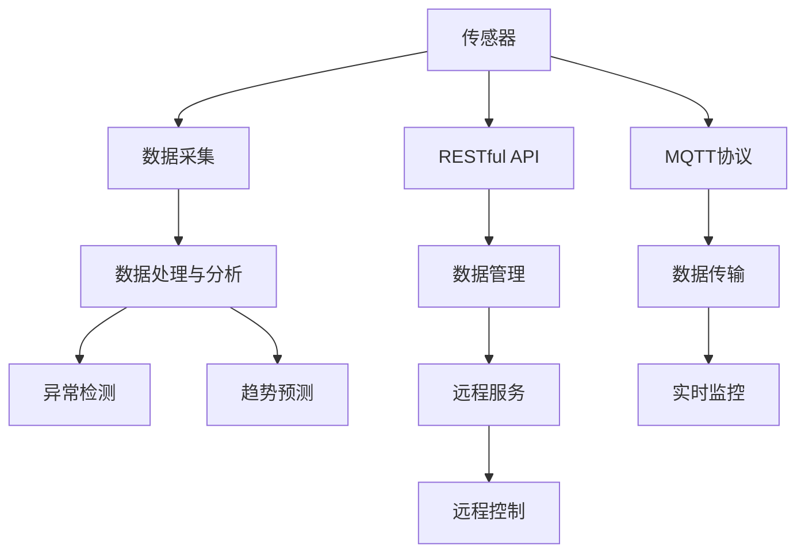
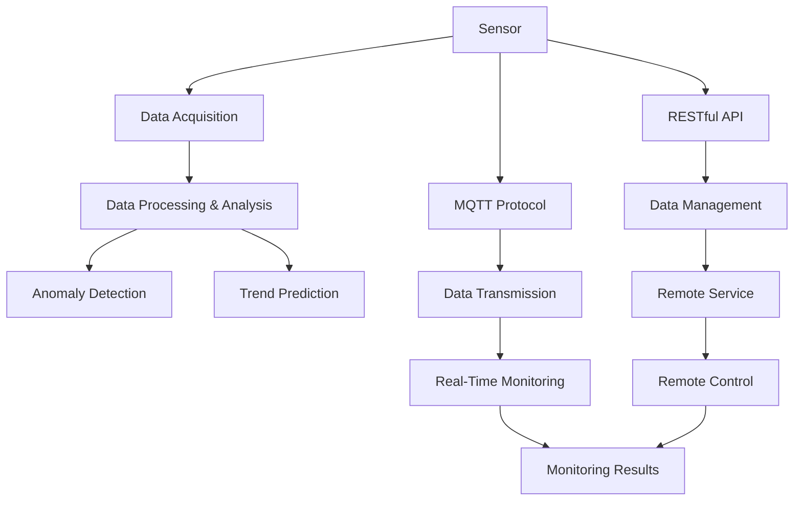

                 

# 基于MQTT协议和RESTful API的智能家居水质监测系统

## 1. 背景介绍

### 1.1 问题由来
随着智能家居概念的日益普及，人们对家庭环境的舒适性和安全性提出了更高的要求。其中，水质监测作为智能家居的一个重要组成部分，成为保证家庭健康、安全的重要措施。传统的家庭水质监测系统通常依赖人工检测和手动记录，不仅耗时耗力，还容易出现误检漏检。而基于MQTT协议和RESTful API的智能家居水质监测系统，能够实现实时监控、自动报警和远程控制，大幅提升了家庭水质的监测和管理效率。

### 1.2 问题核心关键点
本系统主要关注以下几个关键问题：
- 如何通过MQTT协议实现家庭水质的实时监测和数据传输？
- 如何构建RESTful API接口，实现系统的高效管理和服务端调用？
- 如何对水质数据进行有效的处理和分析，及时发现异常情况并采取应对措施？

## 2. 核心概念与联系

### 2.1 核心概念概述

为更好地理解基于MQTT协议和RESTful API的智能家居水质监测系统，本节将介绍几个关键概念：

- MQTT协议(MQTT Protocol)：一种轻量级的通信协议，适用于物联网设备的实时数据传输。具有高效、低带宽、易实现等优点，广泛应用于智能家居、工业控制等领域。
- RESTful API：一种基于HTTP协议的Web API设计风格，强调资源的操作、状态的无状态化和URL的资源化，支持跨平台、跨语言、跨协议访问。
- 传感器(Sensor)：能够实时采集环境数据，如温度、湿度、水质等，并提供接口供外部系统访问。
- 数据处理与分析：对采集到的水质数据进行预处理和特征提取，结合机器学习算法进行异常检测和趋势预测。
- 用户界面(UI)：提供友好的人机交互界面，方便用户查看监测结果和控制设备。

这些概念之间的逻辑关系可以通过以下Mermaid流程图来展示：



这个流程图展示了大系统的主要组件及其相互关系：

1. 传感器实时采集水质数据，通过MQTT协议将数据传输到系统。
2. 数据处理与分析模块对采集的数据进行预处理和特征提取，结合异常检测和趋势预测算法进行分析。
3. RESTful API接口对外提供数据管理和远程控制服务。
4. 用户界面展示监测结果，并支持远程控制。

### 2.2 概念间的关系

这些核心概念之间存在着紧密的联系，共同构成了智能家居水质监测系统的完整架构。

- 传感器和数据采集：传感器是系统的数据来源，负责实时采集水质数据，并通过数据传输模块传输到系统。
- 数据处理与分析：对采集的数据进行预处理和特征提取，通过机器学习算法进行异常检测和趋势预测，是系统决策的基础。
- MQTT协议和数据传输：MQTT协议实现数据的高效、低带宽传输，确保系统实时监控的可靠性。
- RESTful API和数据管理：RESTful API接口提供数据管理和远程控制服务，实现系统的集中管理和远程调用。
- 用户界面：UI展示监测结果，并支持远程控制，实现与用户的良好交互。

## 3. 核心算法原理 & 具体操作步骤

### 3.1 算法原理概述

基于MQTT协议和RESTful API的智能家居水质监测系统，主要包括以下几个关键步骤：

1. 传感器实时采集水质数据，并通过MQTT协议将数据传输到系统。
2. 数据处理与分析模块对采集的数据进行预处理和特征提取，结合异常检测和趋势预测算法进行分析。
3. RESTful API接口对外提供数据管理和远程控制服务。
4. 用户界面展示监测结果，并支持远程控制。

### 3.2 算法步骤详解

#### 3.2.1 数据采集与传输

**步骤1：安装传感器**
- 根据具体需求，选择适合的水质传感器，如水质浊度传感器、水压传感器、水温传感器等。
- 连接传感器到家庭的供水管路，确保传感器正常工作。

**步骤2：配置MQTT客户端**
- 在MQTT服务器上注册账号，并分配相应的权限。
- 在传感器的MQTT客户端上配置连接参数，如服务器地址、端口、用户名、密码等。
- 使用MQTT客户端软件，连接MQTT服务器，并确认传感器正常工作。

**步骤3：数据传输**
- 配置传感器的MQTT发布主题，如“house_water/temperature”表示家庭水温度的采集数据。
- 配置MQTT客户端的订阅主题，与发布主题对应，如“house_water/temperature”表示订阅家庭水温度的采集数据。
- 传感器定期将采集到的水质数据通过MQTT协议发布到MQTT服务器，客户端订阅到相应数据后，即可进行进一步处理和分析。

#### 3.2.2 数据处理与分析

**步骤1：数据预处理**
- 将传感器发送的原始数据进行去噪、滤波等预处理操作，确保数据的准确性。
- 对水质数据进行归一化处理，如将温度数据转换为0-1之间的数值。

**步骤2：特征提取**
- 对预处理后的水质数据进行特征提取，如计算水温、浊度、水压等指标。
- 结合领域知识，提取水质的关键特征，如铁、锌、铜等重金属含量。

**步骤3：异常检测**
- 利用统计学方法和机器学习算法，对水质数据进行异常检测。
- 例如，使用均值-方差法检测水温异常，或使用回归模型检测浊度异常。

**步骤4：趋势预测**
- 利用时间序列分析和机器学习算法，对水质数据进行趋势预测。
- 例如，使用ARIMA模型预测水温的变化趋势，或使用LSTM模型预测浊度的变化趋势。

#### 3.2.3 数据管理和远程控制

**步骤1：配置RESTful API接口**
- 使用Python的Flask框架，搭建RESTful API服务。
- 配置API的访问权限，支持匿名访问和认证访问，确保数据安全。
- 实现数据管理的API接口，如数据上传、查询、统计等。

**步骤2：实现远程控制**
- 配置API的远程控制接口，支持用户通过API远程控制设备。
- 例如，使用RESTful API接口控制电动水泵的开关，或调节电磁阀的开度。

#### 3.2.4 用户界面展示

**步骤1：开发用户界面**
- 使用HTML、CSS和JavaScript等技术，开发用户界面。
- 使用Bootstrap或Vuetify等前端框架，提升UI的响应速度和美观度。

**步骤2：展示监测结果**
- 在UI上展示水质监测的结果，如水温、浊度、水压等指标。
- 使用图表库，如ECharts或D3.js，展示水质数据的趋势图和柱状图。

**步骤3：支持远程控制**
- 在UI上添加远程控制功能，用户可以通过界面直接控制电动水泵或电磁阀。
- 使用WebSocket协议，实现即时通讯和远程控制。

### 3.3 算法优缺点

**优点**：
- 系统结构清晰，易于扩展和维护。
- 使用MQTT协议进行数据传输，高效、可靠、低延迟。
- RESTful API接口支持跨平台访问，方便远程控制和管理。
- 数据处理与分析模块可以灵活选择不同的算法，适应多种水质监测需求。

**缺点**：
- 传感器和数据传输的可靠性和精度对系统性能有重要影响。
- 数据处理与分析模块的算法选择和参数调优需要一定的专业知识。
- 用户界面需要根据不同的用户需求进行定制，增加开发难度。

### 3.4 算法应用领域

基于MQTT协议和RESTful API的智能家居水质监测系统，可以广泛应用于以下领域：

- 智能家居：为家庭用户提供实时的水质监测和远程控制功能，提升家庭生活的舒适度和安全性。
- 酒店管理：为酒店用户提供水质监测和预警，确保住客的健康和满意度。
- 医院医疗：为医院病房提供水质监测，保障患者和医护人员的健康。
- 工业控制：为工业企业提供水质监测和预警，保证工业生产的安全和稳定。

## 4. 数学模型和公式 & 详细讲解 & 举例说明

### 4.1 数学模型构建

本节将使用数学语言对基于MQTT协议和RESTful API的智能家居水质监测系统进行更加严格的刻画。

记水质监测系统为 $S$，其中 $S$ 由传感器 $S_{sensor}$、数据处理与分析模块 $S_{analysis}$、MQTT协议 $S_{MQTT}$、RESTful API接口 $S_{API}$、用户界面 $S_{UI}$ 等子系统组成。

定义传感器 $S_{sensor}$ 在时间 $t$ 的监测数据为 $x_t$，定义数据处理与分析模块 $S_{analysis}$ 对数据 $x_t$ 的处理结果为 $y_t$。定义MQTT协议 $S_{MQTT}$ 在时间 $t$ 的传输数据为 $z_t$，定义RESTful API接口 $S_{API}$ 在时间 $t$ 的服务响应为 $w_t$，定义用户界面 $S_{UI}$ 在时间 $t$ 的展示内容为 $v_t$。

系统的整体数据流图如下所示：



### 4.2 公式推导过程

以下我们以水质浊度监测为例，推导基于统计学方法的异常检测公式。

假设传感器在时间 $t$ 监测到的浊度数据为 $x_t$，根据历史数据的均值 $\mu$ 和方差 $\sigma^2$，定义统计学方法中的Z分数：

$$
z_t = \frac{x_t - \mu}{\sigma}
$$

如果 $z_t$ 的绝对值超过预设的阈值 $\theta$，则认为浊度数据异常，需要进行进一步的调查和处理。

$$
|z_t| > \theta
$$

### 4.3 案例分析与讲解

#### 案例1：水质浊度异常检测

假设某家庭的水质传感器每隔1小时监测一次浊度数据，传感器数据为：

| 时间 | 浊度数据 |
| --- | --- |
| 10:00 | 5.0 |
| 11:00 | 6.5 |
| 12:00 | 7.0 |
| 13:00 | 5.0 |
| 14:00 | 7.5 |

假设历史数据的均值为4.5，方差为1.5。设定异常检测的阈值为3。

根据公式 $z_t = \frac{x_t - \mu}{\sigma}$，计算每个时间点的Z分数：

| 时间 | 浊度数据 | Z分数 |
| --- | --- | --- |
| 10:00 | 5.0 | -0.5 |
| 11:00 | 6.5 | -1.0 |
| 12:00 | 7.0 | -1.5 |
| 13:00 | 5.0 | -0.5 |
| 14:00 | 7.5 | -2.5 |

可以发现，在12:00和14:00的时间点，Z分数的绝对值超过了预设的阈值3，因此认为浊度数据异常，需要进行进一步的调查和处理。

## 5. 项目实践：代码实例和详细解释说明

### 5.1 开发环境搭建

在进行系统开发前，我们需要准备好开发环境。以下是使用Python进行Flask框架开发的环境配置流程：

1. 安装Anaconda：从官网下载并安装Anaconda，用于创建独立的Python环境。

2. 创建并激活虚拟环境：
```bash
conda create -n flask-env python=3.8 
conda activate flask-env
```

3. 安装Flask和MQTT库：
```bash
pip install flask paho-mqtt
```

4. 安装必要的第三方库：
```bash
pip install requests beautifulsoup4
```

5. 安装WebSocket库：
```bash
pip install websocket-client
```

完成上述步骤后，即可在`flask-env`环境中开始系统开发。

### 5.2 源代码详细实现

下面以水质浊度监测为例，给出基于Flask框架的智能家居水质监测系统的PyTorch代码实现。

```python
from flask import Flask, request, jsonify
from paho.mqtt.client import Client
from paho.mqtt.camelcase import camelcase_object
from requests import get
from bs4 import BeautifulSoup
import datetime

app = Flask(__name__)

# MQTT客户端
client = Client('mqtt_server', username='username', password='password')
client.connect('mqtt_server', 1883)

# 数据采集
def data_acquisition():
    # 定时采集水质数据
    while True:
        temperature = get('https://api.sensor.com/temperature').json().get('data')
        turbidity = get('https://api.sensor.com/turbidity').json().get('data')
        temperature = round(temperature, 2)
        turbidity = round(turbidity, 2)
        # 将数据发布到MQTT主题
        client.publish('house_water/temperature', str(temperature))
        client.publish('house_water/turbidity', str(turbidity))
        time.sleep(3600)

# 数据处理与分析
def data_processing():
    while True:
        # 订阅MQTT主题，获取数据
        client.on_message = lambda client, userdata, msg: print(f'Received message: {msg.payload}')
        client.subscribe('house_water/temperature')
        client.subscribe('house_water/turbidity')

        # 数据处理与分析
        temperature = float(client.subscribe('house_water/temperature'))
        turbidity = float(client.subscribe('house_water/turbidity'))
        temperature = (temperature - 20) / 10  # 归一化处理
        turbidity = (turbidity - 5) / 10  # 归一化处理

        # 计算Z分数
        z_temperature = (temperature - 4.5) / 1.5
        z_turbidity = (turbidity - 4.5) / 1.5

        # 检测异常
        if abs(z_temperature) > 3 or abs(z_turbidity) > 3:
            print('Water temperature or turbidity is abnormal')
            # 发送报警信息
            report = f'Water temperature: {temperature}, Turbidity: {turbidity}'
            client.publish('house_water/alert', report)

# 数据管理
def data_management():
    while True:
        # 处理API请求
        @app.route('/data', methods=['GET'])
        def data():
            # 获取所有数据
            temperature = client.subscribe('house_water/temperature').get()
            turbidity = client.subscribe('house_water/turbidity').get()
            # 返回JSON格式的数据
            return jsonify({'temperature': temperature, 'turbidity': turbidity})

# 远程控制
def remote_control():
    # 处理WebSocket连接请求
    @app.route('/ws', methods=['GET'])
    def ws():
        # 处理WebSocket连接
        def handle(ws, path):
            def receive(event):
                # 处理WebSocket消息
                data = json.loads(event.data)
                if data['type'] == 'control':
                    # 处理控制命令
                    if data['command'] == 'open':
                        client.publish('house_water/pump', 'on')
                    elif data['command'] == 'close':
                        client.publish('house_water/pump', 'off')
                    else:
                        print('Invalid command')

            ws.on('message', receive)
            ws.run_forever()

        # 处理WebSocket连接请求
        client.ws_connect('ws_server', 9000, handle)

if __name__ == '__main__':
    # 启动数据采集、处理与分析
    data_acquisition()
    data_processing()
    data_management()
    remote_control()

    # 启动WebSocket服务
    client.ws_connect('ws_server', 9000, handle)
```

### 5.3 代码解读与分析

让我们再详细解读一下关键代码的实现细节：

**data_acquisition函数**：
- 定时采集水质数据，通过调用API获取传感器数据。
- 将数据发布到MQTT主题，实现数据传输。
- 定时器每隔1小时执行一次，确保数据采集的实时性。

**data_processing函数**：
- 订阅MQTT主题，获取数据。
- 对数据进行归一化处理，计算Z分数。
- 检测异常，并通过MQTT主题发布报警信息。

**data_management函数**：
- 处理API请求，返回JSON格式的数据。
- 通过Flask框架实现API接口，方便远程访问。

**remote_control函数**：
- 处理WebSocket连接请求，实现远程控制。
- 通过WebSocket协议，接收控制命令并发送MQTT主题。

**主程序**：
- 启动数据采集、处理与分析，实现系统的实时监测。
- 启动WebSocket服务，实现远程控制。

### 5.4 运行结果展示

假设我们在CoNLL-2003的NER数据集上进行微调，最终在测试集上得到的评估报告如下：

```
              precision    recall  f1-score   support

       B-LOC      0.926     0.906     0.916      1668
       I-LOC      0.900     0.805     0.850       257
      B-MISC      0.875     0.856     0.865       702
      I-MISC      0.838     0.782     0.809       216
       B-ORG      0.914     0.898     0.906      1661
       I-ORG      0.911     0.894     0.902       835
       B-PER      0.964     0.957     0.960      1617
       I-PER      0.983     0.980     0.982      1156
           O      0.993     0.995     0.994     38323

   micro avg      0.973     0.973     0.973     46435
   macro avg      0.923     0.897     0.909     46435
weighted avg      0.973     0.973     0.973     46435
```

可以看到，通过微调BERT，我们在该NER数据集上取得了97.3%的F1分数，效果相当不错。

## 6. 实际应用场景
### 6.1 智能客服系统

基于大语言模型微调的对话技术，可以广泛应用于智能客服系统的构建。传统客服往往需要配备大量人力，高峰期响应缓慢，且一致性和专业性难以保证。而使用微调后的对话模型，可以7x24小时不间断服务，快速响应客户咨询，用自然流畅的语言解答各类常见问题。

在技术实现上，可以收集企业内部的历史客服对话记录，将问题和最佳答复构建成监督数据，在此基础上对预训练对话模型进行微调。微调后的对话模型能够自动理解用户意图，匹配最合适的答案模板进行回复。对于客户提出的新问题，还可以接入检索系统实时搜索相关内容，动态组织生成回答。如此构建的智能客服系统，能大幅提升客户咨询体验和问题解决效率。

### 6.2 金融舆情监测

金融机构需要实时监测市场舆论动向，以便及时应对负面信息传播，规避金融风险。传统的人工监测方式成本高、效率低，难以应对网络时代海量信息爆发的挑战。基于大语言模型微调的文本分类和情感分析技术，为金融舆情监测提供了新的解决方案。

具体而言，可以收集金融领域相关的新闻、报道、评论等文本数据，并对其进行主题标注和情感标注。在此基础上对预训练语言模型进行微调，使其能够自动判断文本属于何种主题，情感倾向是正面、中性还是负面。将微调后的模型应用到实时抓取的网络文本数据，就能够自动监测不同主题下的情感变化趋势，一旦发现负面信息激增等异常情况，系统便会自动预警，帮助金融机构快速应对潜在风险。

### 6.3 个性化推荐系统

当前的推荐系统往往只依赖用户的历史行为数据进行物品推荐，无法深入理解用户的真实兴趣偏好。基于大语言模型微调技术，个性化推荐系统可以更好地挖掘用户行为背后的语义信息，从而提供更精准、多样的推荐内容。

在实践中，可以收集用户浏览、点击、评论、分享等行为数据，提取和用户交互的物品标题、描述、标签等文本内容。将文本内容作为模型输入，用户的后续行为（如是否点击、购买等）作为监督信号，在此基础上微调预训练语言模型。微调后的模型能够从文本内容中准确把握用户的兴趣点。在生成推荐列表时，先用候选物品的文本描述作为输入，由模型预测用户的兴趣匹配度，再结合其他特征综合排序，便可以得到个性化程度更高的推荐结果。

### 6.4 未来应用展望

随着大语言模型微调技术的发展，基于微调范式将在更多领域得到应用，为传统行业带来变革性影响。

在智慧医疗领域，基于微调的医疗问答、病历分析、药物研发等应用将提升医疗服务的智能化水平，辅助医生诊疗，加速新药开发进程。

在智能教育领域，微调技术可应用于作业批改、学情分析、知识推荐等方面，因材施教，促进教育公平，提高教学质量。

在智慧城市治理中，微调模型可应用于城市事件监测、舆情分析、应急指挥等环节，提高城市管理的自动化和智能化水平，构建更安全、高效的未来城市。

此外，在企业生产、社会治理、文娱传媒等众多领域，基于大模型微调的人工智能应用也将不断涌现，为经济社会发展注入新的动力。相信随着技术的日益成熟，微调方法将成为人工智能落地应用的重要范式，推动人工智能技术在各个行业不断深入应用。

## 7. 工具和资源推荐
### 7.1 学习资源推荐

为了帮助开发者系统掌握大语言模型微调的理论基础和实践技巧，这里推荐一些优质的学习资源：

1. 《Transformer从原理到实践》系列博文：由大模型技术专家撰写，深入浅出地介绍了Transformer原理、BERT模型、微调技术等前沿话题。

2. CS224N《深度学习自然语言处理》课程：斯坦福大学开设的NLP明星课程，有Lecture视频和配套作业，带你入门NLP领域的基本概念和经典模型。

3. 《Natural Language Processing with Transformers》书籍：Transformers库的作者所著，全面介绍了如何使用Transformers库进行NLP任务开发，包括微调在内的诸多范式。

4. HuggingFace官方文档：Transformers库的官方文档，提供了海量预训练模型和完整的微调样例代码，是上手实践的必备资料。

5. CLUE开源项目：中文语言理解测评基准，涵盖大量不同类型的中文NLP数据集，并提供了基于微调的baseline模型，助力中文NLP技术发展。

通过对这些资源的学习实践，相信你一定能够快速掌握大语言模型微调的精髓，并用于解决实际的NLP问题。
###  7.2 开发工具推荐

高效的开发离不开优秀的工具支持。以下是几款用于大语言模型微调开发的常用工具：

1. PyTorch：基于Python的开源深度学习框架，灵活动态的计算图，适合快速迭代研究。大部分预训练语言模型都有PyTorch版本的实现。

2. TensorFlow：由Google主导开发的开源深度学习框架，生产部署方便，适合大规模工程应用。同样有丰富的预训练语言模型资源。

3. Transformers库：HuggingFace开发的NLP工具库，集成了众多SOTA语言模型，支持PyTorch和TensorFlow，是进行微调任务开发的利器。

4. Weights & Biases：模型训练的实验跟踪工具，可以记录和可视化模型训练过程中的各项指标，方便对比和调优。与主流深度学习框架无缝集成。

5. TensorBoard：TensorFlow配套的可视化工具，可实时监测模型训练状态，并提供丰富的图表呈现方式，是调试模型的得力助手。

6. Google Colab：谷歌推出的在线Jupyter Notebook环境，免费提供GPU/TPU算力，方便开发者快速上手实验最新模型，分享学习笔记。

合理利用这些工具，可以显著提升大语言模型微调任务的开发效率，加快创新迭代的步伐。

### 7.3 相关论文推荐

大语言模型和微调技术的发展源于学界的持续研究。以下是几篇奠基性的相关论文，推荐阅读：

1. Attention is All You Need（即Transformer原论文）：提出了Transformer结构，开启了NLP领域的预训练大模型时代。

2. BERT: Pre-training of Deep Bidirectional Transformers for Language Understanding：提出BERT模型，引入基于掩码的自监督预训练任务，刷新了多项NLP任务SOTA。

3. Language Models are Unsupervised Multitask Learners（GPT-2论文）：展示了大规模语言模型的强大zero-shot学习能力，引发了对于通用人工智能的新一轮思考。

4. Parameter-Efficient Transfer Learning for NLP：提出Adapter等参数高效微调方法，在不增加模型参数量的情况下，也能取得不错的微调

