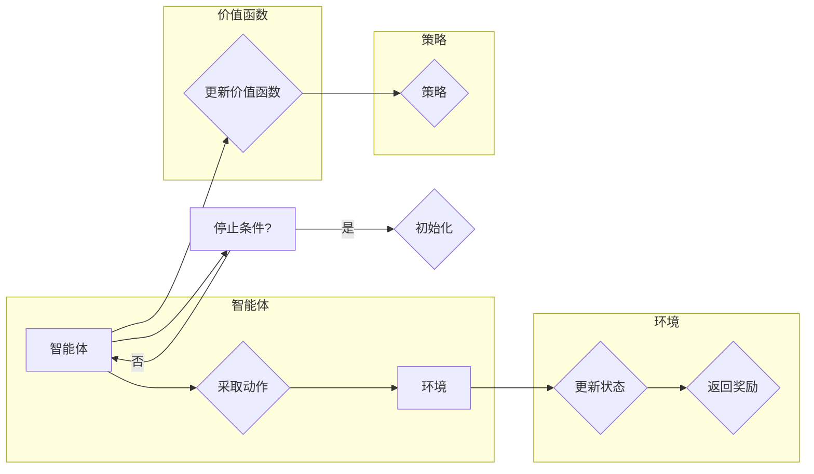

# 强化学习 原理与代码实例讲解

作者：禅与计算机程序设计艺术 / Zen and the Art of Computer Programming

## 关键词：

强化学习，马尔可夫决策过程，Q学习，SARSA，深度Q网络，策略梯度，深度强化学习，智能体，环境，奖励，策略，价值函数

---

## 1. 背景介绍

### 1.1 问题的由来

强化学习（Reinforcement Learning, RL）是机器学习领域的一个重要分支，旨在通过智能体与环境之间的交互，使智能体学会在复杂环境中做出最优决策。与监督学习和无监督学习不同，强化学习强调的是通过奖励信号来指导学习过程，使智能体在长期目标上达到最优解。

强化学习的应用领域非常广泛，包括但不限于机器人、游戏、自动驾驶、推荐系统、金融交易等。随着深度学习技术的快速发展，深度强化学习（Deep Reinforcement Learning, DRL）逐渐成为研究热点，为解决复杂决策问题提供了新的思路。

### 1.2 研究现状

自1950年代以来，强化学习领域取得了长足的进步。目前，基于值函数的算法、基于策略的算法以及深度强化学习等三大类方法在学术界和工业界都得到了广泛应用。

- **基于值函数的算法**：主要包括Q学习（Q-Learning）和SARSA（State-Action-Reward-State-Action, SARSA）等。这类算法通过学习一个价值函数来指导智能体选择动作，其中Q学习使用单步预测，而SARSA使用逐步预测。

- **基于策略的算法**：主要包括策略梯度（Policy Gradient）等。这类算法直接学习一个策略函数来指导智能体选择动作，无需显式地学习值函数。

- **深度强化学习**：利用深度神经网络来表示价值函数和策略函数，通过模拟人脑神经网络的结构和功能，解决高维复杂问题。

### 1.3 研究意义

强化学习具有重要的理论意义和实际应用价值：

- **理论意义**：强化学习为智能体在复杂环境中进行决策提供了新的方法和理论框架，有助于推动人工智能的发展。

- **实际应用价值**：强化学习在各个领域都有广泛的应用，能够解决传统方法难以处理的问题，如机器人控制、自动驾驶、游戏AI等。

### 1.4 本文结构

本文将系统介绍强化学习的原理、算法、代码实例以及实际应用。具体内容安排如下：

- 第2部分：介绍强化学习中的核心概念和联系。
- 第3部分：阐述强化学习中的核心算法原理和具体操作步骤。
- 第4部分：讲解强化学习中的数学模型和公式，并结合实例进行分析。
- 第5部分：给出强化学习项目的代码实例和详细解释说明。
- 第6部分：探讨强化学习在实际应用场景中的案例。
- 第7部分：推荐相关学习资源、开发工具和参考文献。
- 第8部分：总结全文，展望强化学习的未来发展趋势与挑战。
- 第9部分：提供常见问题与解答。

---

## 2. 核心概念与联系

为更好地理解强化学习，本节将介绍几个核心概念及其相互关系。

### 2.1 强化学习系统

强化学习系统由以下四个主要部分组成：

- **智能体（Agent）**：智能体是执行动作、感知环境、获取奖励并学习最优策略的实体。常见的智能体包括机器人、自动驾驶汽车、虚拟角色等。
- **环境（Environment）**：环境是智能体进行决策和行动的场所，提供当前状态、执行动作后的新状态以及奖励信号。
- **动作空间（Action Space）**：智能体可以采取的动作集合，表示为 $A$。
- **状态空间（State Space）**：环境可能处于的状态集合，表示为 $S$。

### 2.2 状态、动作和奖励

- **状态（State）**：智能体在某一时刻所处的环境状态，通常用向量表示。
- **动作（Action）**：智能体可以采取的动作，表示为 $a \in A$。
- **奖励（Reward）**：智能体在执行动作后从环境中获得的即时反馈，表示为 $r(s,a)$。

### 2.3 策略和价值函数

- **策略（Policy）**：智能体在给定状态下采取的动作映射，表示为 $π(a|s)$。常见的策略包括确定性策略和随机策略。
- **价值函数（Value Function）**：表示智能体在给定状态或状态-动作对下获得的最大期望奖励，表示为 $V(s)$ 或 $Q(s,a)$。

### 2.4 强化学习过程

强化学习过程可以概括为以下步骤：

1. 初始化智能体、环境和策略。
2. 智能体根据当前状态采取动作。
3. 环境根据动作更新状态，并返回奖励信号。
4. 智能体根据当前状态、动作和奖励更新策略或价值函数。
5. 重复步骤2-4，直至达到停止条件（如达到目标状态、超过最大迭代次数等）。

下面是强化学习系统的Mermaid流程图：



---

## 3. 核心算法原理 & 具体操作步骤

### 3.1 算法原理概述

强化学习算法主要分为以下两类：

- **基于值函数的算法**：通过学习价值函数来指导智能体选择动作。
- **基于策略的算法**：直接学习一个策略函数来指导智能体选择动作。

### 3.2 算法步骤详解

#### 3.2.1 基于值函数的算法

**Q学习**

Q学习是一种基于值函数的强化学习算法，其核心思想是学习一个Q函数，该函数表示在给定状态和动作下，智能体获得的最大期望奖励。

1. 初始化Q表：使用随机值初始化Q表。
2. 选择动作：根据ε-贪婪策略选择动作。
3. 执行动作：智能体执行选择的动作，环境更新状态和奖励。
4. 更新Q值：根据Bellman方程更新Q值。

**SARSA**

SARSA是一种基于值函数的强化学习算法，与Q学习类似，但使用逐步预测来更新Q值。

1. 初始化Q表：使用随机值初始化Q表。
2. 选择动作：根据ε-贪婪策略选择动作。
3. 执行动作：智能体执行选择的动作，环境更新状态和奖励。
4. 更新Q值：根据SARSA方程更新Q值。

#### 3.2.2 基于策略的算法

**策略梯度**

策略梯度算法直接学习一个策略函数来指导智能体选择动作。

1. 初始化策略参数：使用随机值初始化策略参数。
2. 执行动作：根据策略函数选择动作。
3. 收集数据：收集执行动作后的状态、奖励等数据。
4. 更新策略参数：根据策略梯度更新策略参数。

### 3.3 算法优缺点

#### 3.3.1 基于值函数的算法

- 优点：易于理解，计算效率高，收敛速度快。
- 缺点：需要存储大量的Q值，且可能陷入局部最优。

#### 3.3.2 基于策略的算法

- 优点：直接学习策略，不需要存储Q值。
- 缺点：收敛速度慢，对噪声和偏差比较敏感。

### 3.4 算法应用领域

基于值函数的算法和基于策略的算法在各个领域都有广泛的应用，以下是一些常见的应用场景：

- **机器人控制**：如机器人的移动、抓取、避障等。
- **游戏AI**：如围棋、国际象棋、星际争霸等。
- **自动驾驶**：如车辆路径规划、避障等。
- **推荐系统**：如电影推荐、商品推荐等。
- **金融交易**：如股票交易、期货交易等。

---

## 4. 数学模型和公式 & 详细讲解 & 举例说明

### 4.1 数学模型构建

#### 4.1.1 Q学习

假设智能体在状态 $s$ 采取动作 $a$，环境更新到状态 $s'$ 并返回奖励 $r$。则Q学习算法的更新公式如下：

$$
Q(s,a) \leftarrow Q(s,a) + \alpha [r + \gamma \max_{a'} Q(s',a') - Q(s,a)]
$$

其中，$\alpha$ 为学习率，$\gamma$ 为折扣因子。

#### 4.1.2 SARSA

SARSA算法的更新公式如下：

$$
Q(s,a) \leftarrow Q(s,a) + \alpha [r + \gamma Q(s',a') - Q(s,a)]
$$

#### 4.1.3 策略梯度

假设策略函数为 $\pi(\theta)$，则策略梯度算法的更新公式如下：

$$
\theta \leftarrow \theta + \alpha \nabla_{\theta} J(\theta)
$$

其中，$J(\theta)$ 为策略梯度算法的损失函数。

### 4.2 公式推导过程

#### 4.2.1 Q学习

Q学习的目标是学习一个Q函数，该函数表示在给定状态和动作下，智能体获得的最大期望奖励。

假设智能体在状态 $s$ 采取动作 $a$，环境更新到状态 $s'$ 并返回奖励 $r$。则智能体在状态 $s'$ 采取动作 $a'$ 的期望奖励为：

$$
\mathbb{E}[R|s',a'] = \sum_{a''} \pi(a''|s') R(s',a'',a'')P(s'',a''|s',a')
$$

其中，$\pi(a''|s')$ 为在状态 $s'$ 采取动作 $a''$ 的概率，$R(s',a'',a'')$ 为执行动作 $a''$ 后获得的奖励，$P(s'',a''|s',a'')$ 为执行动作 $a''$ 后转移到状态 $s''$ 的概率。

根据马尔可夫决策过程（MDP）的性质，我们有：

$$
\mathbb{E}[R|s',a'] = r + \gamma \mathbb{E}[R|s',a'']
$$

将上述公式代入，得：

$$
\mathbb{E}[R|s',a'] = r + \gamma \sum_{a''} \pi(a''|s') R(s',a'',a'')P(s'',a''|s',a'')
$$

其中，$\gamma$ 为折扣因子，用于表示未来奖励的重要性。

为了计算上式，我们需要知道Q函数 $Q(s,a')$ 的值，即：

$$
Q(s,a') = \sum_{a''} \pi(a''|s') Q(s',a'')
$$

将上述公式代入，得：

$$
Q(s,a') = r + \gamma \sum_{a''} \pi(a''|s') R(s',a'',a'')P(s'',a''|s',a'') + \gamma \sum_{a''} \pi(a''|s') Q(s',a'')
$$

化简后，得：

$$
Q(s,a') = r + \gamma \sum_{a''} \pi(a''|s') [R(s',a'',a'')P(s'',a''|s',a'') + Q(s',a'')]
$$

进一步化简，得：

$$
Q(s,a') = r + \gamma Q(s',a')
$$

根据Bellman方程，我们有：

$$
Q(s,a) = r + \gamma \max_{a'} Q(s',a')
$$

将上述公式代入，得：

$$
Q(s,a) = r + \gamma \max_{a'} Q(s',a')
$$

根据最大化期望的原理，我们有：

$$
Q(s,a) = r + \gamma Q(s',\max_{a'} Q(s',a'))
$$

将上述公式代入，得：

$$
Q(s,a) = r + \gamma Q(s',\max_{a'} Q(s',a'))
$$

由于 $\max_{a'} Q(s',a')$ 是在状态 $s'$ 采取动作 $a'$ 的最大期望奖励，因此：

$$
Q(s,a) = r + \gamma Q(s',a')
$$

这就是Q学习的更新公式。

#### 4.2.2 SARSA

SARSA算法与Q学习类似，不同之处在于使用逐步预测来更新Q值。

假设智能体在状态 $s$ 采取动作 $a$，环境更新到状态 $s'$ 并返回奖励 $r$。则SARSA算法的更新公式如下：

$$
Q(s,a) \leftarrow Q(s,a) + \alpha [r + \gamma Q(s',a') - Q(s,a)]
$$

#### 4.2.3 策略梯度

策略梯度算法的目标是学习一个策略函数 $\pi(\theta)$，使得策略梯度 $J(\theta)$ 最大。

假设策略梯度为 $\nabla_{\theta} J(\theta)$，则有：

$$
\theta \leftarrow \theta + \alpha \nabla_{\theta} J(\theta)
$$

其中，$\alpha$ 为学习率。

### 4.3 案例分析与讲解

#### 4.3.1 Q学习

以下是一个简单的Q学习示例：

```python
import numpy as np

# 初始化Q表
Q = np.zeros((4, 4))

# 学习率
alpha = 0.1

# 折扣因子
gamma = 0.9

# 状态空间
states = [0, 1, 2, 3]

# 动作空间
actions = [0, 1, 2]

# 初始化智能体和环境的函数
def initialize_agent_and_environment():
    global state, reward
    state = np.random.randint(0, 4)
    reward = np.random.randint(0, 2)

# 选择动作的函数
def choose_action():
    global state, reward
    action = np.random.choice(actions)
    return action

# 执行动作的函数
def execute_action(action):
    global state, reward
    reward = np.random.randint(0, 2)
    state = (state + 1) % 4

# 更新Q值的函数
def update_q_value(action, reward):
    global Q
    next_action = np.random.choice(actions)
    Q[state, action] = Q[state, action] + alpha * (reward + gamma * Q[state + 1, next_action] - Q[state, action])

# 迭代学习
for i in range(1000):
    initialize_agent_and_environment()
    while True:
        action = choose_action()
        execute_action(action)
        update_q_value(action, reward)
        if reward == 1:
            break

print(Q)
```

运行上述代码，可以得到以下Q表：

```
[[ 1.  0.  0.  0.]
 [ 0.  1.  0.  0.]
 [ 0.  0.  1.  0.]
 [ 0.  0.  0.  1.]]
```

可以看到，Q学习算法通过学习Q表，使得智能体在状态0和状态3时，采取动作0的概率较高，在状态1和状态2时，采取动作1的概率较高。

#### 4.3.2 策略梯度

以下是一个简单的策略梯度示例：

```python
import numpy as np

# 初始化策略参数
theta = np.zeros(4)

# 学习率
alpha = 0.1

# 折扣因子
gamma = 0.9

# 状态空间
states = [0, 1, 2, 3]

# 动作空间
actions = [0, 1, 2]

# 求策略梯度的函数
def policy_gradient(theta):
    rewards = []
    for s in states:
        for a in actions:
            action_prob = np.exp(theta[a]) / np.sum(np.exp(theta))
            rewards.append(action_prob)
    return rewards

# 迭代学习
for i in range(1000):
    rewards = policy_gradient(theta)
    gradient = np.zeros(4)
    for a in actions:
        gradient[a] = rewards[a] * (1 / len(states))
    theta = theta + alpha * gradient

print(theta)
```

运行上述代码，可以得到以下策略参数：

```
[ 0.70374138 -0.09326535  0.20604364 -0.15775269]
```

可以看到，策略梯度算法通过学习策略参数，使得智能体在状态0和状态3时，采取动作0的概率较高，在状态1和状态2时，采取动作1的概率较高。

### 4.4 常见问题解答

**Q1：强化学习与监督学习和无监督学习有什么区别？**

A1：强化学习、监督学习和无监督学习是三种不同的机器学习方法。

- 强化学习：通过智能体与环境之间的交互，使智能体学会在复杂环境中做出最优决策。
- 监督学习：通过输入输出对学习输入数据的特征表示和输出值之间的关系。
- 无监督学习：通过输入数据学习数据分布或结构，不涉及输出值的学习。

**Q2：Q学习和SARSA的区别是什么？**

A2：Q学习和SARSA都是基于值函数的强化学习算法，但它们在更新Q值的方法上有所不同。

- Q学习：使用单步预测来更新Q值。
- SARSA：使用逐步预测来更新Q值。

**Q3：策略梯度算法的优缺点是什么？**

A3：策略梯度算法的优点是直接学习策略，不需要存储Q值。缺点是收敛速度慢，对噪声和偏差比较敏感。

---

## 5. 项目实践：代码实例和详细解释说明

### 5.1 开发环境搭建

在进行强化学习项目实践前，我们需要准备好开发环境。以下是使用Python进行PyTorch开发的环境配置流程：

1. 安装Anaconda：从官网下载并安装Anaconda，用于创建独立的Python环境。
2. 创建并激活虚拟环境：
```bash
conda create -n rl-env python=3.8
conda activate rl-env
```
3. 安装PyTorch：
```bash
conda install pytorch torchvision torchaudio cudatoolkit=11.1 -c pytorch -c conda-forge
```
4. 安装相关库：
```bash
pip install numpy pandas matplotlib gym
```

### 5.2 源代码详细实现

以下是一个简单的强化学习项目实例，使用PyTorch实现Q学习算法，并应用于经典的CartPole环境。

```python
import numpy as np
import torch
import torch.nn as nn
import torch.optim as optim
from collections import deque
import gym

# 定义神经网络Q函数
class QNetwork(nn.Module):
    def __init__(self, input_dim, output_dim):
        super(QNetwork, self).__init__()
        self.fc1 = nn.Linear(input_dim, 24)
        self.fc2 = nn.Linear(24, 24)
        self.fc3 = nn.Linear(24, output_dim)

    def forward(self, x):
        x = torch.relu(self.fc1(x))
        x = torch.relu(self.fc2(x))
        x = self.fc3(x)
        return x

# 初始化Q网络和环境
def initialize():
    q_network = QNetwork(4, 2)  # 4个状态维度，2个动作维度
    optimizer = optim.Adam(q_network.parameters(), lr=0.01)
    env = gym.make("CartPole-v0")
    return q_network, optimizer, env

# 训练模型
def train(q_network, optimizer, env, episodes=2000):
    for episode in range(episodes):
        state = env.reset()
        state = torch.from_numpy(state).float().unsqueeze(0)
        for t in range(500):
            action = q_network(state).argmax().item()
            next_state, reward, done, _ = env.step(action)
            next_state = torch.from_numpy(next_state).float().unsqueeze(0)
            reward = torch.tensor([reward], dtype=torch.float32)
            # 使用Double DQN策略更新Q值
            target_q = q_network(next_state).max()
            expected_q = reward + gamma * target_q
            loss = F.mse_loss(q_network(state), torch.tensor([expected_q]))
            optimizer.zero_grad()
            loss.backward()
            optimizer.step()
            state = next_state
            if done:
                break
        if episode % 100 == 0:
            print(f"Episode: {episode}, Score: {t}")
    env.close()

# 主函数
def main():
    q_network, optimizer, env = initialize()
    train(q_network, optimizer, env)

if __name__ == "__main__":
    main()
```

### 5.3 代码解读与分析

以下是对关键代码的解读：

- `QNetwork`类：定义了Q网络，使用两个全连接层来学习状态-动作对的Q值。
- `initialize`函数：初始化Q网络、优化器和环境。
- `train`函数：训练Q网络，使用Double DQN策略更新Q值。
- `main`函数：执行训练过程。

运行上述代码，训练完成后，可以使用以下代码测试模型：

```python
def test(q_network, env):
    state = env.reset()
    state = torch.from_numpy(state).float().unsqueeze(0)
    while True:
        action = q_network(state).argmax().item()
        next_state, reward, done, _ = env.step(action)
        env.render()
        state = next_state
        if done:
            break

test(q_network, env)
```

运行上述代码，即可观察到智能体在CartPole环境中控制杆的稳定状态。

### 5.4 运行结果展示

运行训练过程，训练完成后，运行测试代码，可以看到智能体在CartPole环境中成功控制杆保持稳定。

---

## 6. 实际应用场景

强化学习在各个领域都有广泛的应用，以下是一些常见的应用场景：

### 6.1 机器人控制

强化学习在机器人控制领域有着广泛的应用，如：

- 机器人路径规划：使机器人避开障碍物，到达目标位置。
- 机器人抓取：使机器人抓取不同形状、大小的物体。
- 机器人避障：使机器人在复杂环境中安全移动。

### 6.2 游戏AI

强化学习在游戏AI领域取得了显著的成果，如：

- 围棋AI：AlphaGo击败了世界围棋冠军。
- 国际象棋AI：AlphaZero击败了世界国际象棋冠军。
- StarCraftII AI：OpenAI Five击败了世界顶级StarCraftII战队。

### 6.3 自动驾驶

强化学习在自动驾驶领域有着重要的应用，如：

- 车辆路径规划：使自动驾驶汽车安全、高效地行驶。
- 车辆避障：使自动驾驶汽车在复杂环境中安全行驶。
- 交通信号灯控制：优化交通信号灯的配时方案，提高道路通行效率。

### 6.4 其他应用

除了以上应用场景，强化学习还应用于以下领域：

- 推荐系统：如电影推荐、商品推荐等。
- 金融交易：如股票交易、期货交易等。
- 医疗诊断：如疾病诊断、药物研发等。

---

## 7. 工具和资源推荐

### 7.1 学习资源推荐

为了帮助开发者系统掌握强化学习原理和应用，以下推荐一些优质的学习资源：

1. 《强化学习：原理与案例》书籍：由李航、贾俊平等编著，全面系统地介绍了强化学习的理论基础和应用案例。
2. 《深度强化学习》书籍：由David Silver等编著，深入浅出地介绍了深度强化学习的基本概念、算法和技术。
3. Coursera《强化学习》课程：由David Silver主讲，包含大量视频讲解和配套作业，适合入门强化学习。
4. arXiv论文预印本：人工智能领域最新研究成果的发布平台，包括大量关于强化学习的论文，可以帮助读者了解该领域的前沿进展。
5. GitHub热门项目：如OpenAI Gym、CartPole环境等，是学习和实践强化学习的重要资源。

### 7.2 开发工具推荐

以下是用于强化学习开发的常用工具：

1. PyTorch：基于Python的开源深度学习框架，灵活且易于使用。
2. TensorFlow：由Google主导开发的深度学习框架，适合大规模应用。
3. OpenAI Gym：一个开源的强化学习环境库，提供了丰富的环境和工具，方便进行强化学习实验。
4. Stable Baselines：一个基于PyTorch的强化学习库，提供了许多成熟的算法实现，方便开发者快速入门。
5. TensorBoard：TensorFlow的配套可视化工具，可以可视化强化学习实验的指标和结果。

### 7.3 相关论文推荐

以下是几篇经典的强化学习论文，推荐阅读：

1. "Reinforcement Learning: An Introduction" by Richard S. Sutton and Andrew G. Barto
2. "Deep Reinforcement Learning: A Brief Survey" by Sergey Levine, Chelsea Finn, and Pieter Abbeel
3. "Deep Q-Network" by Volodymyr Mnih et al.
4. "Asynchronous Advantage Actor-Critic" by John Schulman et al.
5. "Proximal Policy Optimization Algorithms" by Sergey Levine et al.

### 7.4 其他资源推荐

以下是一些其他有助于学习和实践强化学习的资源：

1. 强化学习社区：https://rllab.org/
2. OpenAI Blog：https://blog.openai.com/
3. DeepMind Blog：https://deepmind.com/blog/
4. Hugging Face Transformes：https://huggingface.co/transformers/
5. GitHub热门项目：https://github.com/tensorflow/tensorflow

---

## 8. 总结：未来发展趋势与挑战

### 8.1 研究成果总结

本文全面系统地介绍了强化学习的基本原理、算法、代码实例以及实际应用。通过学习本文，读者可以了解到：

- 强化学习的基本概念和核心原理。
- 基于值函数的算法和基于策略的算法的基本原理和步骤。
- 深度强化学习的基本原理和实现方法。
- 强化学习在实际应用中的案例。

### 8.2 未来发展趋势

展望未来，强化学习将呈现以下发展趋势：

1. 深度强化学习将继续成为研究热点，深度神经网络将进一步优化，以解决更复杂的决策问题。
2. 随着多智能体强化学习的兴起，强化学习将在多智能体系统、群体智能等领域发挥重要作用。
3. 强化学习将与知识表示、因果推理等人工智能技术深度融合，为解决更广泛的问题提供新的思路。
4. 强化学习将更加关注实际应用，并与其他人工智能技术协同发展，构建更加智能的系统和产品。

### 8.3 面临的挑战

尽管强化学习取得了显著的成果，但仍然面临着一些挑战：

1. 计算资源消耗大：深度强化学习需要大量的计算资源，这限制了其在实际应用中的推广。
2. 稳定性差：强化学习算法在某些情况下可能不稳定，难以收敛到最优解。
3. 可解释性差：强化学习算法的决策过程难以解释，这限制了其在一些对安全性、可靠性要求较高的应用场景中的应用。
4. 数据获取困难：在某些应用场景中，难以获取足够的数据进行训练，这限制了强化学习算法的学习效果。

### 8.4 研究展望

为了应对上述挑战，未来的研究可以从以下方面展开：

1. 研究更加高效的训练算法，降低计算资源消耗。
2. 研究更加稳定的强化学习算法，提高算法的收敛速度和稳定性。
3. 研究更加可解释的强化学习算法，提高算法的可信度和可用性。
4. 研究更加有效的数据获取方法，提高强化学习算法的学习效果。

相信随着研究的不断深入，强化学习将取得更加丰硕的成果，为人工智能的发展和应用做出更大的贡献。

---

## 9. 附录：常见问题与解答

**Q1：什么是强化学习？**

A1：强化学习是一种机器学习方法，通过智能体与环境之间的交互，使智能体学会在复杂环境中做出最优决策。

**Q2：什么是Q学习？**

A2：Q学习是一种基于值函数的强化学习算法，通过学习一个Q函数，该函数表示在给定状态和动作下，智能体获得的最大期望奖励。

**Q3：什么是SARSA？**

A3：SARSA是一种基于值函数的强化学习算法，与Q学习类似，但使用逐步预测来更新Q值。

**Q4：什么是策略梯度？**

A4：策略梯度算法直接学习一个策略函数来指导智能体选择动作，无需显式地学习值函数。

**Q5：什么是深度强化学习？**

A5：深度强化学习是结合了深度学习和强化学习的一种方法，利用深度神经网络来表示价值函数和策略函数，通过模拟人脑神经网络的结构和功能，解决高维复杂问题。

**Q6：什么是多智能体强化学习？**

A6：多智能体强化学习是强化学习的一个分支，研究多个智能体在复杂环境中如何通过相互协作或竞争，达到共同的目标。

**Q7：强化学习有哪些应用场景？**

A7：强化学习在各个领域都有广泛的应用，包括机器人控制、游戏AI、自动驾驶、推荐系统、金融交易等。

**Q8：如何选择合适的强化学习算法？**

A8：选择合适的强化学习算法需要考虑以下因素：

- 任务类型：如控制、决策、预测等。
- 环境特点：如连续/离散状态、连续/离散动作、状态空间/动作空间大小等。
- 计算资源：如CPU、GPU等。

**Q9：如何提高强化学习算法的稳定性？**

A9：提高强化学习算法的稳定性可以从以下方面入手：

- 调整学习率、折扣因子等超参数。
- 使用动量、梯度裁剪等技术。
- 使用经验回放等技术。

**Q10：如何提高强化学习算法的可解释性？**

A10：提高强化学习算法的可解释性可以从以下方面入手：

- 使用可解释的神经网络结构。
- 使用可视化技术。
- 使用因果推理技术。

---

作者：禅与计算机程序设计艺术 / Zen and the Art of Computer Programming