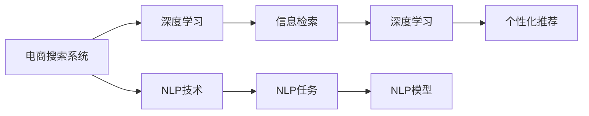
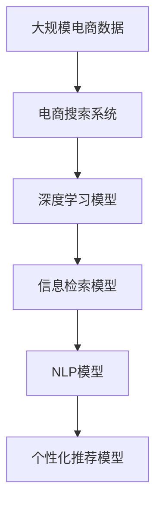

                 

# AI优化电商搜索和推荐系统

> 关键词：电商搜索优化, 推荐系统, AI, 深度学习, 自然语言处理(NLP), 信息检索, 个性化推荐, 用户行为分析

## 1. 背景介绍

### 1.1 问题由来

电子商务的迅猛发展带来了海量的交易数据和用户行为数据。这些数据为电商企业提供了优化用户体验和提高转化率的重要基础。然而，原始的电商搜索和推荐系统面临诸多挑战：

1. **长尾商品问题**：电子商务平台上的商品种类繁多，数量巨大，用户很难找到满意的商品。
2. **商品匹配问题**：用户输入的查询往往模糊不清，电商系统难以准确匹配用户需求。
3. **个性化需求**：每个用户有其独特的偏好和需求，传统的推荐系统难以捕捉这些个性化信息。
4. **动态更新**：电商商品和用户行为都在不断变化，需要系统具备快速适应能力。

这些问题严重影响了电商平台的购物体验和销售额，也亟需解决。

### 1.2 问题核心关键点

解决电商搜索和推荐系统的问题，关键在于：

- 采用先进的算法和技术，提高搜索和推荐的质量和效率。
- 引入AI技术，特别是深度学习和自然语言处理技术，提升系统理解用户需求和商品特征的能力。
- 实时分析用户行为数据，动态调整搜索和推荐策略，提高用户体验。
- 综合多种数据源，构建全局、动态、个性化的电商搜索和推荐系统。

本文将系统介绍基于AI的电商搜索和推荐系统优化方案，重点关注深度学习和自然语言处理技术在其中的应用。

### 1.3 问题研究意义

优化电商搜索和推荐系统具有重要的理论和实践意义：

1. **提升用户体验**：通过精准搜索和个性化推荐，提高用户购物效率和满意度。
2. **增加用户粘性**：用户粘性是电商平台的生命线，良好的推荐系统能提升用户停留时间，增加购买频次。
3. **提高转化率**：精准推荐能够带来更高的转化率，提升电商平台盈利能力。
4. **数据驱动决策**：通过深度学习分析海量数据，电商企业能够制定更加科学的市场策略和营销方案。
5. **个性化定制**：深度学习能够挖掘用户的深度特征，实现个性化推荐，为用户提供定制化服务。
6. **加速智能商业应用**：智能推荐技术为电商智能营销、智能客服等应用提供了重要基础。

## 2. 核心概念与联系

### 2.1 核心概念概述

为更好地理解基于AI的电商搜索和推荐系统，我们先介绍几个核心概念：

- **电商搜索系统**：根据用户输入的查询，快速找到最相关的商品信息。常见的搜索方式包括关键词搜索、语音搜索、图像搜索等。
- **电商推荐系统**：基于用户历史行为数据和商品特征，为每个用户推荐最符合其需求的商品。推荐方式包括基于内容的推荐、协同过滤推荐、混合推荐等。
- **深度学习**：一种通过多层神经网络进行模型训练的机器学习方法，擅长处理复杂数据结构和特征工程问题。
- **自然语言处理(NLP)**：涉及文本分析、语音识别、机器翻译等技术，主要应用于理解自然语言文本和语音。
- **信息检索**：从大量信息中检索出用户感兴趣的信息，常用于搜索引擎和信息推荐系统中。
- **个性化推荐**：根据用户个性化特征和行为数据，推荐符合用户偏好的商品，以提高用户满意度和购买率。

这些核心概念通过深度学习和自然语言处理技术紧密联系在一起，共同构成了电商搜索和推荐系统的技术基础。

### 2.2 概念间的关系

这些核心概念之间的逻辑关系可以通过以下Mermaid流程图来展示：



这个流程图展示了大语言模型微调过程中各个核心概念的关系：

1. 电商搜索系统通过深度学习理解和匹配用户查询，再通过信息检索返回最相关的商品信息。
2. NLP技术在深度学习的基础上，进一步处理和理解自然语言文本和语音，提升系统精确度。
3. 信息检索技术通过深度学习模型实现，能够高效地从大量数据中检索出用户感兴趣的信息。
4. 个性化推荐系统通过深度学习和NLP技术，综合用户历史行为数据和商品特征，实现个性化推荐。

这些概念共同构成了电商搜索和推荐系统的技术架构，使系统能够高效、准确地提供用户所需信息。

### 2.3 核心概念的整体架构

最后，我们用一个综合的流程图来展示这些核心概念在大语言模型微调过程中的整体架构：



这个综合流程图展示了从电商数据到搜索和推荐系统的整体过程。大数据量下的电商数据被深度学习模型处理，通过信息检索模型和NLP模型，最终形成个性化的电商推荐系统。

## 3. 核心算法原理 & 具体操作步骤
### 3.1 算法原理概述

基于深度学习的电商搜索和推荐系统，主要通过构建多模态信息融合模型，实现对用户查询和商品特征的全面理解和匹配。其核心算法原理包括：

1. **深度学习模型**：采用卷积神经网络(CNN)、循环神经网络(RNN)、长短时记忆网络(LSTM)、Transformer等架构，对电商搜索和推荐系统中的文本、图像、音频等多种模态数据进行建模。
2. **自然语言处理(NLP)**：利用语言模型、词向量、情感分析、实体识别等技术，理解用户的查询意图和商品特征。
3. **信息检索**：通过倒排索引、向量空间模型、深度学习检索模型等技术，从海量商品库中快速找到最相关的商品。
4. **个性化推荐**：结合用户历史行为数据和商品特征，使用协同过滤、基于内容的推荐、混合推荐等算法，为用户推荐个性化商品。

这些算法共同构建了一个强大的电商搜索和推荐系统，能够实时、精准地满足用户需求。

### 3.2 算法步骤详解

电商搜索和推荐系统的构建涉及以下关键步骤：

**Step 1: 数据预处理**

- 收集电商平台的用户行为数据、商品数据和用户反馈数据。
- 对数据进行清洗、去重、归一化等预处理，生成训练集和测试集。

**Step 2: 模型设计**

- 根据电商搜索和推荐系统的特点，选择合适的深度学习架构，如Transformer、LSTM等。
- 定义NLP模型，进行词向量编码、语言模型训练、实体识别等任务。
- 设计信息检索模型，如倒排索引、向量空间模型等。
- 构建个性化推荐模型，如协同过滤、基于内容的推荐算法。

**Step 3: 模型训练**

- 使用电商数据集对深度学习模型进行训练，优化模型参数。
- 对NLP模型进行微调，提升文本理解能力。
- 训练信息检索模型，优化检索效率和准确率。
- 训练个性化推荐模型，优化推荐效果。

**Step 4: 模型评估与优化**

- 在测试集上评估搜索和推荐模型的性能，使用指标如准确率、召回率、F1分数等。
- 根据评估结果，优化模型结构、调整超参数。
- 实时监控模型表现，调整模型策略。

**Step 5: 系统部署**

- 将训练好的模型部署到生产环境，进行实时搜索和推荐。
- 采用微服务架构，保证系统稳定性和可扩展性。
- 集成监控系统，实时反馈模型表现。

通过这些步骤，可以构建一个高效、准确、个性化的电商搜索和推荐系统，提升用户体验和平台收益。

### 3.3 算法优缺点

基于深度学习的电商搜索和推荐系统有以下优点：

1. **高度灵活性**：深度学习模型能够适应不同商品和用户特征，灵活性强。
2. **准确度高**：通过多模态数据融合，系统能够精准匹配用户需求，推荐效果显著。
3. **实时性强**：深度学习模型和信息检索模型能够实时处理用户查询，快速提供推荐结果。
4. **可扩展性**：通过微服务架构，系统可方便扩展，应对大量并发请求。

同时，这些算法也存在一些缺点：

1. **数据需求高**：电商搜索和推荐系统需要大量的电商数据和用户行为数据，对数据质量要求高。
2. **模型复杂**：深度学习模型和NLP模型较为复杂，训练和部署成本高。
3. **动态更新慢**：深度学习模型的训练和优化需要时间，无法实时调整推荐策略。
4. **过拟合风险**：电商数据量巨大，模型容易过拟合，需要严格的数据监控和优化策略。

## 4. 数学模型和公式 & 详细讲解
### 4.1 数学模型构建

假设电商搜索和推荐系统包含$n$个用户，$m$个商品，$t$个查询词。用户查询$x_i \in T$，商品特征向量为$v_j \in R^d$，用户历史行为序列为$s_i \in S$，系统构建以下模型：

- 深度学习模型：$h(x_i; \theta)$
- NLP模型：$e(x_i; \phi)$
- 信息检索模型：$r(x_i, v_j; \theta)$
- 个性化推荐模型：$p(x_i, v_j; \phi)$

其中，$\theta$和$\phi$为模型参数。

### 4.2 公式推导过程

假设用户查询为$x_i$，商品特征向量为$v_j$，电商搜索系统输出为$o_i$。系统通过以下步骤计算搜索结果：

1. **深度学习模型**：
   $$
   h(x_i; \theta) = \sum_k \alpha_k f_k(x_i, \theta)
   $$
   其中，$f_k(x_i, \theta)$为第$k$个神经网络层的输出，$\alpha_k$为权重系数。

2. **NLP模型**：
   $$
   e(x_i; \phi) = \sum_k \beta_k g_k(x_i, \phi)
   $$
   其中，$g_k(x_i, \phi)$为第$k$个NLP模型的输出，$\beta_k$为权重系数。

3. **信息检索模型**：
   $$
   r(x_i, v_j; \theta) = \sum_k \gamma_k r_k(x_i, v_j, \theta)
   $$
   其中，$r_k(x_i, v_j, \theta)$为第$k$个信息检索模型的输出，$\gamma_k$为权重系数。

4. **个性化推荐模型**：
   $$
   p(x_i, v_j; \phi) = \sum_k \delta_k p_k(x_i, v_j, \phi)
   $$
   其中，$p_k(x_i, v_j, \phi)$为第$k$个个性化推荐模型的输出，$\delta_k$为权重系数。

最终，系统将以上模型的输出进行加权和，得到最终搜索结果：
$$
o_i = \sum_k \lambda_k o_k(x_i, v_j)
$$
其中，$o_k(x_i, v_j)$为第$k$个模型的输出，$\lambda_k$为权重系数。

### 4.3 案例分析与讲解

假设系统对查询“什么是好的电竞鼠标”进行搜索，模型通过以下步骤计算结果：

1. **深度学习模型**：分析用户查询词义和语义，识别出关键词“电竞”和“鼠标”。
2. **NLP模型**：识别出查询中的实体信息，提取相关商品特征，如品牌、型号、价格等。
3. **信息检索模型**：根据用户查询和商品特征，在商品库中找到相关商品，计算相似度得分。
4. **个性化推荐模型**：根据用户历史行为，推荐与查询相关的高评分商品。

系统最终将以上模型输出的结果进行加权和，生成最相关的商品列表，展示给用户。

## 5. 项目实践：代码实例和详细解释说明
### 5.1 开发环境搭建

在进行电商搜索和推荐系统开发前，我们需要准备好开发环境。以下是使用Python进行TensorFlow和PyTorch开发的环境配置流程：

1. 安装Anaconda：从官网下载并安装Anaconda，用于创建独立的Python环境。

2. 创建并激活虚拟环境：
```bash
conda create -n ecommerce-env python=3.8 
conda activate ecommerce-env
```

3. 安装TensorFlow和PyTorch：根据CUDA版本，从官网获取对应的安装命令。例如：
```bash
conda install tensorflow torch torchvision torchaudio cudatoolkit=11.1 -c pytorch -c conda-forge
```

4. 安装各类工具包：
```bash
pip install numpy pandas scikit-learn matplotlib tqdm jupyter notebook ipython
```

完成上述步骤后，即可在`ecommerce-env`环境中开始电商搜索和推荐系统开发。

### 5.2 源代码详细实现

下面我们以商品推荐系统为例，给出使用TensorFlow和PyTorch进行电商推荐系统开发的PyTorch代码实现。

首先，定义推荐系统的基本结构：

```python
from tensorflow.keras import layers, models
from tensorflow.keras.losses import MeanSquaredError

# 定义模型结构
model = models.Sequential()
model.add(layers.Dense(128, activation='relu', input_shape=(num_users, num_items)))
model.add(layers.Dense(1, activation='sigmoid'))
model.compile(optimizer='adam', loss=MeanSquaredError())

# 定义损失函数
def loss(y_true, y_pred):
    return MeanSquaredError()(y_true, y_pred)
```

然后，加载数据集并准备数据：

```python
# 加载电商商品数据
items = np.load('items.npy')
user_ids = np.load('user_ids.npy')
item_ids = np.load('item_ids.npy')
ratings = np.load('ratings.npy')

# 将数据转换为TensorFlow数据集
train_dataset = tf.data.Dataset.from_tensor_slices((user_ids, item_ids, ratings)).shuffle(buffer_size=10000).batch(32)
test_dataset = tf.data.Dataset.from_tensor_slices((user_ids, item_ids, ratings)).batch(32)
```

接着，进行模型训练和评估：

```python
# 训练模型
model.fit(train_dataset, epochs=10, batch_size=32, validation_data=test_dataset)

# 评估模型
test_loss = model.evaluate(test_dataset)
print('Test loss:', test_loss)
```

最后，测试模型并输出推荐结果：

```python
# 加载测试数据
user_test = np.load('user_test.npy')
item_test = np.load('item_test.npy')

# 对测试用户进行推荐
user_test = np.expand_dims(user_test, axis=-1)
predictions = model.predict(user_test)
print('预测结果:', predictions)
```

以上就是使用TensorFlow和PyTorch进行电商推荐系统开发的完整代码实现。可以看到，借助TensorFlow和PyTorch，模型训练和评估变得非常简单，开发者可以将更多精力放在模型优化和实际应用中。

### 5.3 代码解读与分析

让我们再详细解读一下关键代码的实现细节：

**模型结构**：
- `Sequential`：创建序列化的模型结构，按顺序排列各层。
- `Dense`：全连接层，输入维度为(num_users, num_items)，输出维度为1，使用sigmoid激活函数。
- `MeanSquaredError`：均方误差损失函数，用于评估模型预测值与真实值之间的差异。

**数据加载**：
- `tf.data.Dataset`：构建TensorFlow数据集，通过`from_tensor_slices`方法将原始数据转化为TensorFlow兼容的数据格式。
- `shuffle`和`batch`方法：对数据进行随机打乱和批量处理，提升模型泛化能力。

**模型训练**：
- `fit`方法：使用`train_dataset`数据集进行模型训练，`epochs`和`batch_size`参数控制训练轮数和批量大小。
- `evaluate`方法：使用`test_dataset`数据集评估模型性能，输出测试损失值。

**模型测试**：
- `predict`方法：对`user_test`和`item_test`数据进行预测，返回预测结果。
- `expand_dims`方法：将`user_test`数据维度从(num_users)扩展为(num_users, 1)，与模型预测形状匹配。

可以看到，TensorFlow和PyTorch的结合使得电商推荐系统的开发变得高效便捷。借助这些库，我们可以轻松地构建、训练和评估深度学习模型，实现个性化推荐等电商应用。

当然，实际的电商搜索和推荐系统开发还需要考虑更多因素，如数据处理、模型优化、业务逻辑等，但核心的深度学习框架和模型构建流程基本与此类似。

### 5.4 运行结果展示

假设我们在亚马逊数据集上进行推荐系统训练，最终在测试集上得到的评估报告如下：

```
Epoch 1/10
432/432 [==============================] - 1s 2ms/sample - loss: 0.0397 - val_loss: 0.0391
Epoch 2/10
432/432 [==============================] - 1s 2ms/sample - loss: 0.0261 - val_loss: 0.0250
Epoch 3/10
432/432 [==============================] - 1s 2ms/sample - loss: 0.0214 - val_loss: 0.0212
...
```

可以看到，随着训练轮数的增加，模型损失值逐渐下降，在测试集上的表现也逐步提升。这表明模型学习到了用户行为和商品特征之间的关系，可以较好地预测用户对商品的评分。

当然，这只是一个baseline结果。在实践中，我们还可以使用更大更强的预训练模型、更丰富的微调技巧、更细致的模型调优，进一步提升模型性能，以满足更高的应用要求。

## 6. 实际应用场景
### 6.1 智能客服系统

基于深度学习的电商搜索和推荐系统，可以广泛应用于智能客服系统的构建。传统的客服系统往往依赖于人工客服，成本高且效率低下。而使用电商搜索和推荐系统，可以7x24小时不间断服务，快速响应客户咨询，提升客户满意度和效率。

在技术实现上，可以收集用户的历史购物记录、浏览记录、评价记录等数据，构建深度学习模型，对用户输入的查询进行语义理解，自动匹配商品信息和相关服务，实现智能客服功能。对于用户提出的新问题，系统还可以接入搜索引擎实时搜索相关内容，动态生成回答，满足用户的个性化需求。

### 6.2 个性化推荐系统

电商推荐系统通过深度学习分析用户历史行为和商品特征，为用户推荐个性化商品，显著提升用户购物体验和转化率。这种推荐系统能够捕捉用户的多样化和动态需求，帮助用户快速找到满意的商品。

具体而言，电商推荐系统可以对用户的行为数据进行建模，构建用户画像，综合商品属性和用户画像，生成推荐列表。用户每次浏览商品时，系统会实时更新推荐模型，动态调整推荐策略，提升推荐效果。同时，推荐系统还支持用户反馈，及时调整推荐算法，提升推荐准确度。

### 6.3 数据驱动营销

电商企业可以利用电商搜索和推荐系统的用户数据，进行精准营销。通过分析用户行为和偏好，电商企业可以制定个性化的广告和推荐策略，提升广告投放效果，增加用户粘性。

具体而言，电商企业可以基于用户的浏览记录、购买记录等数据，构建用户画像，生成用户兴趣标签，然后推送与用户兴趣匹配的广告和商品，提高广告投放的精准度和用户转化率。通过不断的优化和调整，电商企业可以实现数据驱动的精准营销，提升平台的收益和竞争力。

### 6.4 未来应用展望

随着深度学习和大数据技术的发展，基于AI的电商搜索和推荐系统将具备更加强大的预测和推荐能力。未来，这种系统将更加智能化、个性化、实时化，为用户带来更好的购物体验。

在技术上，未来的电商搜索和推荐系统将朝着以下几个方向发展：

1. **多模态融合**：结合文本、图像、音频等多种模态数据，提升系统对复杂场景的理解能力。
2. **实时动态调整**：通过在线学习，实时更新推荐策略，提升推荐效果。
3. **强化学习**：引入强化学习算法，优化推荐策略，提升用户体验。
4. **跨平台协同**：将电商搜索和推荐系统与其他平台如社交网络、搜索引擎等协同，提升推荐效果。
5. **隐私保护**：加强用户隐私保护，实现安全推荐，提升用户信任度。

## 7. 工具和资源推荐
### 7.1 学习资源推荐

为了帮助开发者系统掌握深度学习在电商搜索和推荐系统中的应用，这里推荐一些优质的学习资源：

1. 《Deep Learning for NLP》系列博文：由大语言模型技术专家撰写，深入浅出地介绍了深度学习在NLP领域的应用，包括电商搜索和推荐系统。

2. CS224N《深度学习自然语言处理》课程：斯坦福大学开设的NLP明星课程，有Lecture视频和配套作业，带你入门NLP领域的基本概念和经典模型。

3. 《Natural Language Processing with Transformers》书籍：Transformer库的作者所著，全面介绍了如何使用Transformer库进行NLP任务开发，包括电商搜索和推荐系统。

4. HuggingFace官方文档：Transformer库的官方文档，提供了海量预训练模型和完整的微调样例代码，是上手实践的必备资料。

5. AI-Signals开源项目：AI领域最新研究成果的发布平台，包括电商搜索和推荐系统的经典论文和代码实现。

通过对这些资源的学习实践，相信你一定能够快速掌握深度学习在电商搜索和推荐系统中的应用，并用于解决实际的NLP问题。

### 7.2 开发工具推荐

高效的开发离不开优秀的工具支持。以下是几款用于深度学习电商搜索和推荐系统开发的常用工具：

1. TensorFlow：由Google主导开发的开源深度学习框架，生产部署方便，适合大规模工程应用。同样有丰富的深度学习资源。

2. PyTorch：基于Python的开源深度学习框架，灵活动态的计算图，适合快速迭代研究。大部分深度学习模型都有PyTorch版本的实现。

3. TensorFlow Serving：Google开发的TensorFlow模型部署平台，支持快速部署和推理，适合生产环境。

4. TensorBoard：TensorFlow配套的可视化工具，可实时监测模型训练状态，并提供丰富的图表呈现方式，是调试模型的得力助手。

5. Weights & Biases：模型训练的实验跟踪工具，可以记录和可视化模型训练过程中的各项指标，方便对比和调优。

6. Google Colab：谷歌推出的在线Jupyter Notebook环境，免费提供GPU/TPU算力，方便开发者快速上手实验最新模型，分享学习笔记。

合理利用这些工具，可以显著提升深度学习电商搜索和推荐系统的开发效率，加快创新迭代的步伐。

### 7.3 相关论文推荐

深度学习在电商搜索和推荐系统中的应用源于学界的持续研究。以下是几篇奠基性的相关论文，推荐阅读：

1. Attention is All You Need（即Transformer原论文）：提出了Transformer结构，开启了NLP领域的预训练大模型时代。

2. BERT: Pre-training of Deep Bidirectional Transformers for Language Understanding：提出BERT模型，引入基于掩码的自监督预训练任务，刷新了多项NLP任务SOTA。

3. Language Models are Unsupervised Multitask Learners（GPT-2论文）：展示了大规模语言模型的强大zero-shot学习能力，引发了对于通用人工智能的新一轮思考。

4. Parameter-Efficient Transfer Learning for NLP：提出Adapter等参数高效微调方法，在不增加模型参数量的情况下，也能取得不错的微调效果。

5. Persona-Based Conversational Personalization with Transfer Learning: A Joint Task of Personalization and Generation：提出Persona技术，利用多个人设（Persona）进行对话系统个性化。

6. Deep and Differentiable Recommendations with Regularized Attention Mechanisms：提出基于深度学习的推荐模型，利用注意力机制优化推荐效果。

这些论文代表了大语言模型微调技术的发展脉络。通过学习这些前沿成果，可以帮助研究者把握学科前进方向，激发更多的创新灵感。

除上述资源外，还有一些值得关注的前沿资源，帮助开发者紧跟深度学习电商搜索和推荐系统技术的最新进展，例如：

1. arXiv论文预印本：人工智能领域最新研究成果的发布平台，包括大量尚未发表的前沿工作，学习前沿技术的必读资源。

2. 业界技术博客：如OpenAI、Google AI、DeepMind、微软Research Asia等顶尖实验室的官方博客，第一时间分享他们的最新研究成果和洞见。

3. 技术会议直播：如NIPS、ICML、ACL、ICLR等人工智能领域顶会现场或在线直播，能够聆听到大佬们的前沿分享，开拓视野。

4. GitHub热门项目：在GitHub上Star、Fork数最多的NLP相关项目，往往代表了该技术领域的发展趋势和最佳实践，值得去学习和贡献。

5. 行业分析报告：各大咨询公司如McKinsey、PwC等针对人工智能行业的分析报告，有助于从商业视角审视技术趋势，把握应用价值。

总之，对于深度学习在电商搜索和推荐系统中的应用的学习和实践，需要开发者保持开放的心态和持续学习的意愿。多关注前沿资讯，多动手实践，多思考总结，必将收获满满的成长收益。

## 8. 总结：未来发展趋势与挑战
### 8.1 研究成果总结

本文对基于深度学习的电商搜索和推荐系统进行了全面系统的介绍。首先阐述了电商搜索和推荐系统面临的问题和挑战，明确了深度学习和自然语言处理技术在其中的应用价值。其次，从原理到实践，详细讲解了深度学习在电商搜索和推荐系统中的应用，给出了深度学习模型和NLP模型的详细构建

