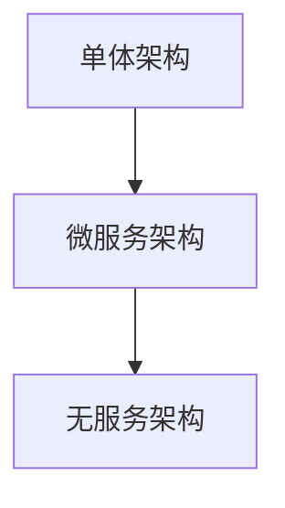
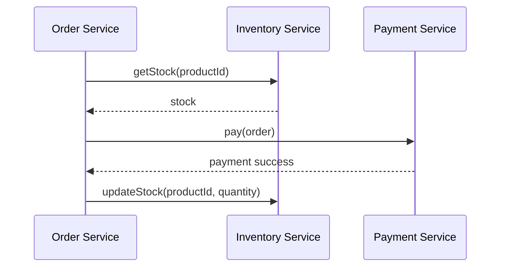

                 

# AI创业公司的技术架构演进：单体架构、微服务架构与无服务架构

> 关键词：AI创业公司, 技术架构, 单体架构, 微服务架构, 无服务架构, 演进历程, 架构模式, 选择原则, 优缺点, 适用场景

## 1. 背景介绍

在当今快速变化的商业环境中，技术架构的演进对AI创业公司的成功至关重要。从早期的单体架构（Monolithic Architecture），到复杂的微服务架构（Microservice Architecture），再到最新的无服务架构（Serverless Architecture），AI创业公司在技术架构的探索中不断前行，以适应不同的业务需求和市场变化。本文将详细介绍这三种架构的特点、优缺点以及适用场景，帮助AI创业者选择合适的技术架构，以实现快速、稳定和可扩展的业务发展。

## 2. 核心概念与联系

### 2.1 核心概念概述

1. **单体架构**：指所有应用组件都部署在一个单独的应用程序中，数据共享和业务逻辑紧密耦合，开发和维护相对简单。

2. **微服务架构**：将应用拆分为多个独立服务，每个服务负责特定的业务功能，通过轻量级的通信机制进行交互，实现独立部署和灵活扩展。

3. **无服务架构**：应用由云服务提供者自动管理，开发者只需关注代码逻辑，无需关心基础设施和资源管理，实现真正的“代码即服务”。

这三个概念间的关系通过以下Mermaid流程图展示：



### 2.2 核心概念间的关系

这些核心概念之间的关系紧密相连，通过以下要点进行详细解释：

- **单体架构**是所有架构的基础，提供了一个简单易用的开发和部署环境。
- **微服务架构**在此基础上引入了模块化、独立部署的思想，解决了单体架构的扩展性和维护性问题。
- **无服务架构**则是在微服务架构的基础上，通过云平台自动化管理和弹性伸缩，进一步提升了系统的灵活性和可扩展性。

通过这三个架构的演进，我们可以看到AI创业公司对系统性能、可扩展性和维护性的不断追求。

## 3. 核心算法原理 & 具体操作步骤
### 3.1 算法原理概述

这三种架构的演进，本质上是为了解决不同的系统问题：

- **单体架构**解决了简单场景下的开发和部署问题，但面对复杂的业务需求时扩展性和维护性不足。
- **微服务架构**通过拆分服务，提升了系统的扩展性和维护性，但带来了服务间通信、数据一致性等问题。
- **无服务架构**通过云平台自动化管理，解决了微服务架构的运维难题，但增加了开发和部署的复杂度。

### 3.2 算法步骤详解

#### 3.2.1 单体架构

1. **开发和部署**：将所有组件整合到一个应用中，一键部署。
2. **运行和维护**：集中管理资源，如数据库、缓存、负载均衡等。
3. **扩展性**：通过垂直扩展来提升系统性能，但扩展复杂度高。
4. **维护性**：修改单个应用即可，但不同功能间的耦合度高，维护困难。

#### 3.2.2 微服务架构

1. **开发和部署**：将应用拆分为多个服务，独立开发和部署。
2. **运行和维护**：每个服务独立运行，但服务间通过API网关、消息队列等方式通信。
3. **扩展性**：通过水平扩展来提升系统性能，易于扩展。
4. **维护性**：服务独立，易于维护和升级，但服务间通信复杂。

#### 3.2.3 无服务架构

1. **开发和部署**：开发者只需关注代码逻辑，云平台自动处理资源管理和扩展。
2. **运行和维护**：云平台自动扩展和伸缩，开发者无需管理基础设施。
3. **扩展性**：易于扩展，云平台自动处理资源分配。
4. **维护性**：自动管理减少了维护复杂性，但开发者需关注服务间逻辑。

### 3.3 算法优缺点

- **单体架构**
  - **优点**：开发和部署简单，易于维护，适合小规模应用。
  - **缺点**：扩展性和维护性差，难以应对复杂业务需求。

- **微服务架构**
  - **优点**：扩展性和维护性好，服务独立，易于升级和扩展。
  - **缺点**：服务间通信复杂，数据一致性问题需额外解决。

- **无服务架构**
  - **优点**：自动扩展和伸缩，易于维护，开发和部署复杂度降低。
  - **缺点**：开发和部署复杂，依赖云平台，运维成本高。

### 3.4 算法应用领域

三种架构在不同的应用领域中有着不同的适用性：

- **单体架构**：适合小型项目、原型开发、内部管理工具等。
- **微服务架构**：适合复杂的应用场景，如电商平台、金融服务、社交网络等。
- **无服务架构**：适合高负载、高可扩展性需求的应用，如实时数据处理、大规模并行计算等。

## 4. 数学模型和公式 & 详细讲解 & 举例说明

### 4.1 数学模型构建

在实际应用中，这些架构的性能和稳定性通常通过以下数学模型来评估：

- **单体架构**：系统性能和可用性可以通过吞吐量、响应时间和故障率等指标来衡量。
- **微服务架构**：服务间的延迟、通信开销和数据一致性问题可以通过分布式系统理论来建模和分析。
- **无服务架构**：资源使用效率和扩展性可以通过弹性计算模型来评估。

### 4.2 公式推导过程

以**微服务架构**为例，假设一个服务的服务请求响应时间为$T$，通信开销为$C$，数据传输延迟为$D$，则服务整体响应时间为：

$$
T_{total} = T + C + D
$$

通过这个模型，可以分析服务间的通信对整体性能的影响。

### 4.3 案例分析与讲解

在实际应用中，例如一个电商平台通过微服务架构提升扩展性和维护性，采用多个服务独立部署，数据和服务逻辑分离，提升了系统的灵活性和可扩展性。通过云平台自动管理资源，实现了高效的扩展和伸缩，但同时也面临服务间通信和数据一致性问题，需要进行额外的设计和优化。

## 5. 项目实践：代码实例和详细解释说明

### 5.1 开发环境搭建

假设我们正在构建一个电商平台的微服务架构：

1. **开发环境配置**：使用Docker容器和Kubernetes进行容器化和集群管理，搭建开发和测试环境。
2. **依赖管理**：使用Maven或Gradle管理项目依赖，确保各服务间模块独立且兼容。

### 5.2 源代码详细实现

以一个订单服务为例，订单服务包括订单管理、库存查询、支付等模块，每个模块独立部署，代码如下：

```java
package com.example.order.service;

import java.util.List;
import java.util.stream.Collectors;

@Component
public class OrderService {
    @Autowired
    private InventoryService inventoryService;
    @Autowired
    private PaymentService paymentService;

    public Order placeOrder(Order order) {
        // 调用库存服务查询商品库存
        int stock = inventoryService.getStock(order.getProductId());

        // 判断库存是否充足
        if (stock < order.getQuantity()) {
            throw new InsufficientStockException();
        }

        // 调用支付服务处理支付
        paymentService.pay(order);

        // 更新库存
        inventoryService.updateStock(order.getProductId(), order.getQuantity());

        return order;
    }
}
```

### 5.3 代码解读与分析

这段代码展示了订单服务的基本逻辑：查询库存、处理支付和更新库存。由于每个服务独立部署，代码逻辑清晰，易于维护和扩展。

### 5.4 运行结果展示

假设运行上述代码，服务调用时序图如下：



## 6. 实际应用场景

### 6.1 智能客服系统

智能客服系统通过微服务架构实现，各服务独立部署，包括自然语言处理、用户意图识别、知识库查询等模块，能够快速响应客户咨询，提供个性化服务。

### 6.2 金融交易系统

金融交易系统通过无服务架构实现，云平台自动管理资源，处理高并发交易，确保交易系统的稳定性和可扩展性。

### 6.3 物联网数据处理平台

物联网数据处理平台通过微服务架构实现，将数据采集、数据存储、数据分析等模块独立部署，提高系统的扩展性和维护性。

## 7. 工具和资源推荐

### 7.1 学习资源推荐

1. **单体架构**：阅读《微服务架构》（Sam Newman），了解单体架构和微服务架构的演变和应用。
2. **微服务架构**：参加《Spring Cloud》（Pivotal）的培训课程，学习微服务架构的开发和部署。
3. **无服务架构**：参加AWS Lambda的官方培训，了解无服务架构的开发和运维。

### 7.2 开发工具推荐

1. **单体架构**：使用Spring Boot进行快速开发和部署。
2. **微服务架构**：使用Spring Cloud和Docker进行微服务架构的搭建和部署。
3. **无服务架构**：使用AWS Lambda、Azure Functions等云服务进行无服务架构的开发和部署。

### 7.3 相关论文推荐

1. **单体架构**：《Monolithic Architecture Patterns》（Mark Richards），详细介绍了单体架构的设计模式和应用。
2. **微服务架构**：《Microservices: Principles and Patterns》（Sam Newman），讨论了微服务架构的设计原则和实现模式。
3. **无服务架构**：《Serverless Computing: Concepts, Technology, and Design Patterns》（Neeraj Bagga），介绍了无服务架构的技术基础和设计模式。

## 8. 总结：未来发展趋势与挑战

### 8.1 研究成果总结

在过去十年中，AI创业公司的技术架构从单体架构演进到微服务架构，再到无服务架构，呈现出从集中式到分布式，从人工运维到自动化运维的趋势。这些架构的演进，不断提升了系统的可扩展性、维护性和业务灵活性。

### 8.2 未来发展趋势

1. **架构微服务化**：未来，微服务架构将继续发展，更加细粒化，便于独立部署和维护。
2. **无服务架构普及**：随着云平台技术的成熟，无服务架构将逐渐普及，带来更高的自动化和弹性。
3. **混合架构应用**：结合单体架构、微服务架构和无服务架构的优点，实现混合架构，以应对不同业务需求。

### 8.3 面临的挑战

1. **架构复杂性增加**：随着架构的演进，系统的复杂性增加，需要更多的管理和维护工作。
2. **数据一致性问题**：微服务和无服务架构中，数据一致性问题需额外关注和解决。
3. **运维成本上升**：自动化运维降低了开发复杂性，但运维成本和管理复杂性仍需投入。

### 8.4 研究展望

未来，AI创业公司需继续探索架构演进的最佳实践，结合业务需求和应用场景，选择最适合的架构模式，确保系统性能、可扩展性和维护性。同时，需关注架构演进带来的挑战，采取相应的优化措施，以应对技术发展的复杂性和不确定性。

## 9. 附录：常见问题与解答

### 9.1 如何选择合适的技术架构？

选择技术架构需考虑业务需求、系统规模、团队能力和资源投入等因素。单体架构适合小规模、低复杂性应用，微服务架构适合中大型、高复杂性应用，无服务架构适合高负载、高可扩展性需求的应用。

### 9.2 单体架构如何优化扩展性？

单体架构可通过水平拆分、引入缓存、异步处理等手段优化扩展性。但需注意拆分后系统复杂性增加，需额外关注服务间通信和数据一致性问题。

### 9.3 微服务架构如何处理服务间通信？

微服务架构可通过消息队列、API网关、分布式锁等技术解决服务间通信问题，确保数据一致性和服务稳定性。

### 9.4 无服务架构如何保证系统可靠性？

无服务架构需关注云平台服务的可用性和性能，通过监控、容错机制和自动恢复策略提升系统可靠性。

---

作者：禅与计算机程序设计艺术 / Zen and the Art of Computer Programming

