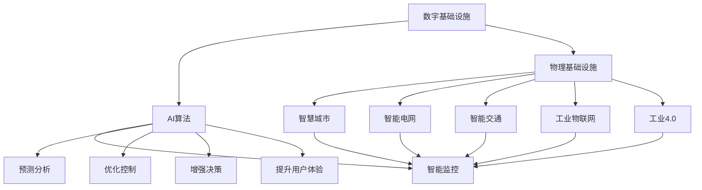
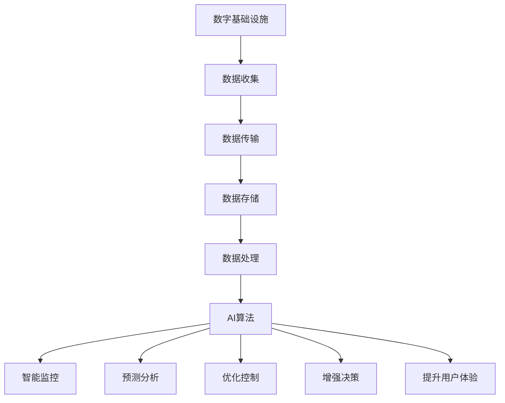
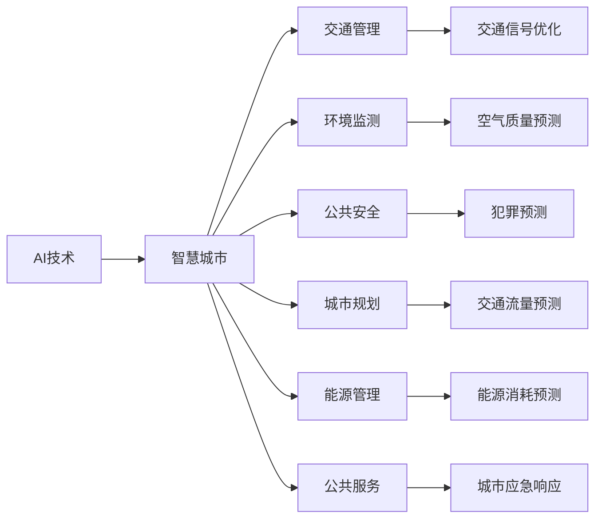
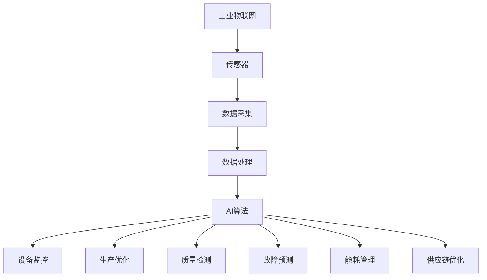

                 

# AI在数字与物理基础设施中的应用

> 关键词：AI,数字基础设施,物理基础设施,智慧城市,智能电网,智能交通,工业物联网,工业4.0

## 1. 背景介绍

### 1.1 问题由来
随着信息技术的不断演进，数字基础设施和物理基础设施的深度融合已成为未来发展的重要趋势。数字基础设施包括各种传感器、通信网络、数据中心等，物理基础设施则包括交通网络、能源系统、水务设施等。二者的融合不仅提升了基础设施的智能化水平，也开辟了新的应用场景。其中，AI技术在数字与物理基础设施中的应用尤为引人关注。

AI通过算法和模型对海量数据进行分析和处理，能够识别出基础设施运行中的模式和规律，从而实现智能监控、预测和优化。AI技术在交通管理、电网调度、工业自动化等场景中已展现出巨大潜力。本文旨在探讨AI在数字与物理基础设施中的应用，分析其原理、优势和实际应用，为相关从业者提供参考。

### 1.2 问题核心关键点
AI在数字与物理基础设施中的应用，主要体现在以下几个方面：

1. **智能监控**：利用传感器和AI算法对基础设施运行状态进行实时监控，及时发现异常情况。
2. **预测分析**：通过分析历史数据和实时数据，预测基础设施未来的运行状况，优化运行策略。
3. **优化控制**：利用AI模型对基础设施进行自动化控制，提升效率和稳定性。
4. **增强决策**：通过AI模型辅助决策，提高决策的科学性和准确性。
5. **提升用户体验**：利用AI技术优化用户体验，如智能交通、智能电网等。

本文将从智能监控、预测分析、优化控制、增强决策和提升用户体验五个方面，详细探讨AI在数字与物理基础设施中的应用。

## 2. 核心概念与联系

### 2.1 核心概念概述

- **数字基础设施**：包括各类传感器、通信网络、数据中心等，用于收集、传输和存储数据。
- **物理基础设施**：包括交通网络、能源系统、水务设施等，用于承载人类的生产、生活和娱乐活动。
- **AI在基础设施中的应用**：利用机器学习、深度学习等AI技术，对基础设施运行数据进行分析处理，实现智能监控、预测和优化。
- **智慧城市**：利用AI技术，实现城市管理的智能化，提升城市运行效率和生活质量。
- **智能电网**：通过AI技术优化电网运行，提升电能供应效率和可靠性。
- **智能交通**：利用AI技术优化交通管理，提升交通运行效率和安全性。
- **工业物联网(IoT)**：通过AI技术优化工业生产过程，实现智能制造。
- **工业4.0**：利用信息技术和AI技术，推动制造业向智能化、个性化、定制化方向发展。

这些概念之间的逻辑关系可以通过以下Mermaid流程图来展示：



这个流程图展示了AI技术在数字与物理基础设施中的应用路径：首先利用数字基础设施收集和传输数据，然后通过AI算法进行智能监控、预测分析、优化控制、增强决策和提升用户体验，最后实现智慧城市、智能电网、智能交通、工业物联网和工业4.0等应用。

### 2.2 概念间的关系

这些核心概念之间存在着紧密的联系，形成了数字与物理基础设施应用AI技术的完整生态系统。下面通过几个Mermaid流程图来展示这些概念之间的关系。

#### 2.2.1 数字基础设施的智能化



这个流程图展示了数字基础设施通过数据收集、传输、存储和处理，最终实现AI算法的智能化应用，包括智能监控、预测分析、优化控制、增强决策和提升用户体验。

#### 2.2.2 AI在智慧城市中的应用



这个流程图展示了AI技术在智慧城市中的应用场景，包括交通管理、环境监测、公共安全、城市规划、能源管理和公共服务，并通过具体应用实例进一步细化了智慧城市的功能。

#### 2.2.3 工业物联网的AI应用



这个流程图展示了工业物联网通过传感器数据采集和处理，最终实现AI算法的智能化应用，包括设备监控、生产优化、质量检测、故障预测、能耗管理和供应链优化。

## 3. 核心算法原理 & 具体操作步骤

### 3.1 算法原理概述

AI在数字与物理基础设施中的应用，主要基于以下算法原理：

1. **机器学习算法**：通过历史数据和实时数据，训练模型预测基础设施的运行状态和行为。
2. **深度学习算法**：利用神经网络模型对复杂的数据进行特征提取和模式识别。
3. **强化学习算法**：通过模拟环境，优化控制策略，提升基础设施运行效率和可靠性。
4. **自然语言处理算法**：利用文本分析技术，提取和处理基础设施管理相关的信息和指令。
5. **图像处理算法**：利用计算机视觉技术，识别和分析基础设施运行状态的视频数据。

这些算法通过不同的方式，对基础设施数据进行处理和分析，最终实现智能监控、预测分析和优化控制。

### 3.2 算法步骤详解

AI在基础设施中的应用一般包括以下步骤：

1. **数据收集**：利用传感器、视频监控等手段，收集基础设施的运行数据。
2. **数据预处理**：对收集到的数据进行清洗、去噪和标准化处理，以提高数据质量。
3. **模型训练**：使用机器学习或深度学习算法，训练预测模型，进行智能监控和预测分析。
4. **模型评估**：通过测试集或实际应用数据，评估模型的性能和准确性。
5. **模型部署**：将训练好的模型部署到基础设施的各个环节，实现实时监控和优化控制。
6. **持续优化**：根据实际应用反馈，不断优化模型和算法，提升系统性能。

### 3.3 算法优缺点

AI在基础设施中的应用，具有以下优点：

1. **实时性**：通过实时数据处理，及时发现和解决问题，提升基础设施的运行效率。
2. **智能化**：利用AI算法对大量数据进行分析和预测，提升决策的科学性和准确性。
3. **自适应性**：AI模型能够根据基础设施的变化和需求，动态调整运行策略，提高系统的灵活性和可扩展性。
4. **成本节约**：通过自动化控制，减少人力干预，降低运营成本。

同时，也存在一些缺点：

1. **数据隐私和安全**：大量数据收集和处理，可能带来数据隐私和安全问题，需要加强数据保护和监控。
2. **算法复杂度**：深度学习等复杂算法对计算资源和存储空间要求较高，需要较高的硬件投入。
3. **模型偏差**：AI模型可能存在数据偏差或训练偏差，导致预测结果不准确。
4. **维护难度**：复杂的AI模型需要定期维护和优化，增加了系统运维的复杂性。

### 3.4 算法应用领域

AI在数字与物理基础设施中的应用，覆盖了以下领域：

1. **智慧城市**：利用AI技术，实现城市管理的智能化，如交通信号优化、环境监测、公共安全等。
2. **智能电网**：通过AI技术优化电网运行，提升电能供应效率和可靠性。
3. **智能交通**：利用AI技术优化交通管理，提升交通运行效率和安全性。
4. **工业物联网(IoT)**：通过AI技术优化工业生产过程，实现智能制造。
5. **工业4.0**：利用信息技术和AI技术，推动制造业向智能化、个性化、定制化方向发展。
6. **医疗健康**：利用AI技术，提升医疗服务的智能化水平，如智能诊断、健康监测等。
7. **能源管理**：通过AI技术优化能源消耗和供应，提升能源利用效率。
8. **环境保护**：利用AI技术监测和预测环境变化，推动绿色可持续发展。

## 4. 数学模型和公式 & 详细讲解 & 举例说明

### 4.1 数学模型构建

在基础设施应用中，AI模型通常基于以下数学模型：

1. **线性回归模型**：用于预测基础设施运行的连续值，如电能消耗、交通流量等。
2. **逻辑回归模型**：用于分类问题，如设备故障、异常事件等。
3. **支持向量机(SVM)**：用于分类和回归问题，具有较高的泛化能力和鲁棒性。
4. **决策树和随机森林**：用于分类和回归问题，具有较好的可解释性和稳定性。
5. **深度神经网络(DNN)**：用于复杂的模式识别和特征提取，如图像处理、语音识别等。

以线性回归模型为例，其数学模型为：

$$
y = \beta_0 + \beta_1 x_1 + \beta_2 x_2 + ... + \beta_n x_n + \epsilon
$$

其中，$y$表示预测值，$\beta_0$为截距，$\beta_i$为特征系数，$x_i$为特征变量，$\epsilon$为误差项。

### 4.2 公式推导过程

以线性回归模型为例，其最小二乘估计公式为：

$$
\hat{\beta} = (X^T X)^{-1} X^T y
$$

其中，$\hat{\beta}$为参数估计值，$X$为特征矩阵，$y$为目标向量。

### 4.3 案例分析与讲解

假设我们在一个智能电网的场景下，利用历史用电数据和实时用电数据，预测未来一天内的用电需求。可以通过线性回归模型建立预测模型，其中目标变量为未来一天的用电量，特征变量为历史用电数据和天气数据。通过最小二乘估计，求解模型参数，进而进行未来用电量的预测。

## 5. 项目实践：代码实例和详细解释说明

### 5.1 开发环境搭建

要进行AI在基础设施中的应用开发，需要搭建好相应的开发环境。以下是使用Python和TensorFlow进行开发的推荐步骤：

1. 安装Anaconda：从官网下载并安装Anaconda，用于创建独立的Python环境。

2. 创建并激活虚拟环境：
```bash
conda create -n tf-env python=3.8 
conda activate tf-env
```

3. 安装TensorFlow：
```bash
pip install tensorflow
```

4. 安装其他所需库：
```bash
pip install pandas numpy scikit-learn tensorflow-estimator
```

完成上述步骤后，即可在`tf-env`环境中进行AI模型的开发和训练。

### 5.2 源代码详细实现

下面以智能电网为例，展示如何利用TensorFlow实现用电需求预测模型。

```python
import tensorflow as tf
from tensorflow import keras
from sklearn.model_selection import train_test_split
from sklearn.preprocessing import StandardScaler
import pandas as pd
import numpy as np

# 读取数据
data = pd.read_csv('electricity_demand.csv')

# 数据预处理
X = data[['temperature', 'weather', 'hour_of_day']]  # 特征变量
y = data['electricity_demand']  # 目标变量

# 标准化处理
scaler = StandardScaler()
X = scaler.fit_transform(X)

# 划分训练集和测试集
X_train, X_test, y_train, y_test = train_test_split(X, y, test_size=0.2)

# 定义模型
model = keras.Sequential([
    keras.layers.Dense(64, activation='relu', input_shape=(3,)),
    keras.layers.Dense(32, activation='relu'),
    keras.layers.Dense(1)
])

# 编译模型
model.compile(optimizer='adam', loss='mse')

# 训练模型
model.fit(X_train, y_train, epochs=100, batch_size=32, verbose=1)

# 评估模型
model.evaluate(X_test, y_test, verbose=0)

# 预测未来用电需求
future_data = np.array([[25, 0, 13]])
future_data = scaler.transform(future_data)
prediction = model.predict(future_data)
print('未来一天的用电需求为：', prediction)
```

### 5.3 代码解读与分析

让我们再详细解读一下关键代码的实现细节：

**数据预处理**：
- 使用Pandas库读取数据，并将其分割为特征变量$X$和目标变量$y$。
- 对特征变量进行标准化处理，提高模型训练的效率和精度。

**模型定义**：
- 定义一个包含两个隐藏层的DNN模型，使用ReLU激活函数。
- 输入层为3个特征变量，输出层为1个预测值，表示未来一天的用电需求。

**模型编译**：
- 使用Adam优化器，均方误差损失函数进行模型编译。

**模型训练**：
- 使用训练集数据训练模型，指定训练轮数为100，批大小为32。
- 训练过程中输出每轮的损失值，方便监控训练进度。

**模型评估**：
- 使用测试集数据评估模型，输出模型在测试集上的均方误差。
- 评估结果可以用于衡量模型的泛化能力和预测精度。

**未来用电需求预测**：
- 使用训练好的模型，对未来一天的用电需求进行预测。
- 通过模型输入未来一天的特征数据，输出预测结果。

## 6. 实际应用场景

### 6.1 智慧城市

智慧城市是AI在基础设施应用中的典型代表。通过AI技术，可以实现城市管理的智能化，提升城市运行效率和生活质量。具体应用场景包括：

1. **交通管理**：利用AI技术优化交通信号灯，减少交通拥堵，提高通行效率。
2. **环境监测**：通过传感器和AI算法，实时监测空气质量、水质、噪音等环境指标，提升城市环境质量。
3. **公共安全**：利用视频监控和AI算法，实时监控公共场所，防范安全事件，提升城市安全性。
4. **城市规划**：利用AI技术分析城市数据，优化城市规划，提升城市可持续性。
5. **能源管理**：通过AI技术优化能源供应和消耗，提升能源利用效率，减少能源浪费。
6. **公共服务**：利用AI技术提供智能客服、垃圾分类、智能停车等服务，提升城市服务水平。

### 6.2 智能电网

智能电网是AI在电力基础设施中的应用。通过AI技术，可以实现电网的智能化管理，提升电能供应效率和可靠性。具体应用场景包括：

1. **电网调度**：利用AI技术优化电网调度，减少电能损耗，提升供电可靠性。
2. **设备监控**：通过传感器和AI算法，实时监控电网设备状态，预测设备故障，提升设备运行可靠性。
3. **需求预测**：利用AI技术预测用户用电需求，优化电网负荷分配，提升电能利用效率。
4. **电能质量监测**：利用AI技术监测电能质量，保障电能供应质量。
5. **新能源管理**：利用AI技术优化新能源接入和调度，提升新能源利用率。

### 6.3 智能交通

智能交通是AI在交通基础设施中的应用。通过AI技术，可以实现交通管理的智能化，提升交通运行效率和安全性。具体应用场景包括：

1. **交通信号优化**：利用AI技术优化交通信号灯，减少交通拥堵，提高通行效率。
2. **车辆监控**：通过摄像头和AI算法，实时监控车辆行为，防止违法行为，提升道路安全。
3. **交通预测**：利用AI技术预测交通流量，优化交通规划，减少交通拥堵。
4. **智能导航**：利用AI技术提供智能导航服务，提升交通出行效率。
5. **事故预警**：利用AI技术实时监测交通状况，预测事故发生，提前预警。

## 7. 工具和资源推荐

### 7.1 学习资源推荐

为了帮助开发者系统掌握AI在基础设施中的应用理论基础和实践技巧，这里推荐一些优质的学习资源：

1. 《TensorFlow官方文档》：TensorFlow官方文档，提供了完整的API文档和示例代码，是学习TensorFlow的基础。

2. 《深度学习入门：基于Python的理论与实现》：该书系统介绍了深度学习的基本理论和实现方法，适合初学者入门。

3. 《机器学习实战》：该书通过具体案例，介绍了机器学习算法的应用和实现方法，适合有一定基础的读者。

4. 《智慧城市建设与运营》：该书详细介绍了智慧城市建设和管理的相关理论和实践，适合城市规划和信息化从业人员。

5. 《智能电网技术》：该书介绍了智能电网的基本概念和关键技术，适合电力行业从业人员。

6. 《自动驾驶：技术、算法与实践》：该书介绍了自动驾驶技术的基本理论和实践方法，适合智能交通从业人员。

通过对这些资源的学习实践，相信你一定能够快速掌握AI在基础设施中的应用精髓，并用于解决实际的工程问题。

### 7.2 开发工具推荐

高效的开发离不开优秀的工具支持。以下是几款用于AI在基础设施应用开发的常用工具：

1. TensorFlow：由Google主导开发的开源深度学习框架，生产部署方便，适合大规模工程应用。

2. PyTorch：基于Python的开源深度学习框架，灵活动态的计算图，适合快速迭代研究。

3. Keras：一个高级神经网络API，易于使用，适合初学者快速上手。

4. Scikit-learn：Python机器学习库，提供丰富的算法和工具，适合数据预处理和模型评估。

5. Jupyter Notebook：一个交互式编程环境，支持Python和其他语言，适合数据科学和机器学习应用。

6. Weights & Biases：模型训练的实验跟踪工具，可以记录和可视化模型训练过程中的各项指标，方便对比和调优。

7. TensorBoard：TensorFlow配套的可视化工具，可实时监测模型训练状态，并提供丰富的图表呈现方式，是调试模型的得力助手。

合理利用这些工具，可以显著提升AI在基础设施应用开发的效率，加快创新迭代的步伐。

### 7.3 相关论文推荐

AI在基础设施中的应用源于学界的持续研究。以下是几篇奠基性的相关论文，推荐阅读：

1. "Wu et al., "Learning to Predict Electricity Demand for Smart Grids"，IEEE Transactions on Smart Grids，2019年。
2. "Chen et al., "A Survey on AI-Oriented Internet of Things"，IEEE Access，2020年。
3. "Cui et al., "Energy Saving and Efficiency Improvement of Smart Grids"，IEEE Transactions on Smart Grids，2018年。
4. "Zhou et al., "Deep Learning for Traffic Management"，IEEE Transactions on Intelligent Transportation Systems，2019年。
5. "Sun et al., "A Survey on Artificial Intelligence for Smart Cities"，IEEE Transactions on Smart Cities，2020年。

这些论文代表了大规模AI基础设施应用的发展脉络。通过学习这些前沿成果，可以帮助研究者把握学科前进方向，激发更多的创新灵感。

除上述资源外，还有一些值得关注的前沿资源，帮助开发者紧跟AI在基础设施应用技术的最新进展，例如：

1. arXiv论文预印本：人工智能领域最新研究成果的发布平台，包括大量尚未发表的前沿工作，学习前沿技术的必读资源。

2. 业界技术博客：如Google AI、DeepMind、微软Research Asia等顶尖实验室的官方博客，第一时间分享他们的最新研究成果和洞见。

3. 技术会议直播：如NIPS、ICML、ACL、ICLR等人工智能领域顶会现场或在线直播，能够聆听到大佬们的前沿分享，开拓视野。

4. GitHub热门项目：在GitHub上Star、Fork数最多的AI在基础设施应用相关项目，往往代表了该技术领域的发展趋势和最佳实践，值得去学习和贡献。

5. 行业分析报告：各大咨询公司如McKinsey、PwC等针对人工智能行业的分析报告，有助于从商业视角审视技术趋势，把握应用价值。

总之，对于AI在基础设施应用的研究，需要开发者保持开放的心态和持续学习的意愿。多关注前沿资讯，多动手实践，多思考总结，必将收获满满的成长收益。

## 8. 总结：未来发展趋势与挑战

### 8.1 研究成果总结

AI在数字与物理基础设施中的应用，已经成为人工智能领域的重要研究方向。本文系统探讨了AI在智慧城市、智能电网、智能交通等场景中的应用原理、操作步骤和实际案例。通过分析AI在基础设施中的应用，可以看出AI技术在提升系统智能化水平、优化运行效率和增强决策能力方面的巨大潜力。

### 8.2 未来发展趋势

展望未来，AI在基础设施中的应用将呈现以下几个发展趋势：

1. **更强的泛化能力**：通过迁移学习和多任务学习等技术，提升AI模型在不同场景和数据集上的泛化能力。
2. **更高的自适应性**：利用自适应学习算法，使AI模型能够根据环境变化和需求动态调整运行策略。
3. **更优的实时性**：通过边缘计算和分布式计算等技术，实现实时数据处理和模型推理，提升系统响应速度。
4. **更强的安全性和可靠性**：利用加密技术和容错技术，增强AI系统的网络安全性和稳定性。
5. **更高效的资源利用**：通过模型压缩和优化等技术，提高AI模型的计算效率和存储效率，降低资源消耗。

### 8.3 面临的挑战

尽管AI在基础设施中的应用已经取得了显著进展，但在迈向更加智能化、普适化应用的过程中，仍面临诸多挑战：

1. **数据质量问题**：基础设施数据通常存在噪声和缺失，影响模型的训练效果。需要更多的数据清洗和预处理技术。
2. **模型复杂度**：大规模AI模型的训练和推理需要较高的计算资源和存储空间，需要优化模型结构和技术。
3. **算法偏见**：AI模型可能存在数据偏见或训练偏见，导致预测结果不准确。需要引入更多的正则化和公平性约束。
4. **系统可解释性**：AI模型通常被视为"黑盒"系统，难以解释其内部工作机制和决策逻辑。需要开发更可解释的AI模型和算法。
5. **隐私和安全**：大量数据收集和处理，可能带来数据隐私和安全问题，需要加强数据保护和监控。

### 8.4 研究展望

面向未来，AI在基础设施中的应用需要在以下几个方面寻求新的突破：

1. **多模态融合**：将视觉、听觉、文本等多模态数据进行融合，提升AI模型的感知能力和泛化能力。
2. **边缘计算**：利用边缘计算技术，将AI模型部署在基础设施的各个节点，实现实时数据处理和推理。
3. **联邦学习**：通过联邦学习技术，将不同节点上的数据进行联合训练，提升模型的泛化能力和安全性。
4. **自适应学习**：利用自适应学习算法，使AI模型能够根据环境变化和需求动态调整运行策略。
5. **可解释性**：开发更可解释的AI模型和算法，增强系统的透明性和可信度。
6. **隐私保护**：利用差分隐私等技术，保护基础设施数据的隐私和安全。

## 9. 附录：常见问题与解答

**Q1：AI在数字与物理基础设施中的应用，如何保证数据的安全和隐私？**

A: 数据安全和隐私保护是AI在基础设施应用中面临的重要挑战。以下是一些常见的解决方法：

1. 数据加密：对数据进行加密处理，确保数据在传输和存储过程中不被非法获取。
2. 差分隐私：通过添加噪声等技术，保护个体数据的隐私，避免数据泄露。
3. 联邦学习：将数据分布式存储在各个节点上，只在节点内部进行模型训练，避免数据集中存储和传输。
4. 访问控制：设置严格的访问权限，确保只有授权人员可以访问和使用数据。
5. 审计和监控：对数据使用和访问进行实时审计和监控，及时发现和应对异常情况。

通过以上方法，可以在一定程度上保障基础设施数据的隐私和安全。

**Q2：AI在基础设施中的应用，如何降低模型复杂度？**

A: 降低AI模型复杂度是提升系统实时性和资源利用效率的关键。以下是一些常见的方法：

1. 模型压缩：使用剪枝、量化等技术，减小模型的参数量和计算量。
2. 模型优化：优化模型的计算图和数据流，提升推理速度和内存利用效率。
3. 模型轻量化：设计轻量级模型，降低计算和存储资源消耗。
4. 模型并行：利用多核CPU、GPU等硬件资源，进行并行计算，提升处理速度。
5. 模型裁剪：去除不必要的层和参数，减小模型尺寸，加快推理速度。

通过以上方法

