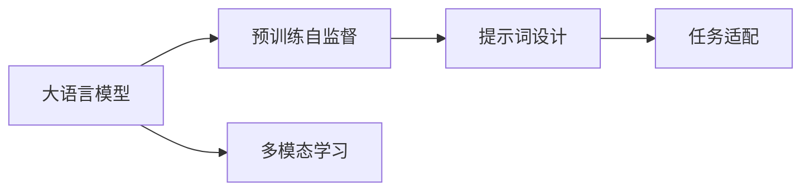
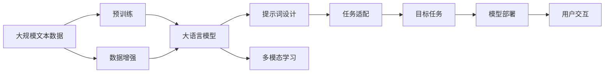

                 

# AI大模型Prompt提示词最佳实践：根据提供的开头部分完成文本

> 关键词：Prompt, 大语言模型, 自然语言处理(NLP), 模型适配, 提示学习, 提示词设计, 自监督学习, 多模态学习

## 1. 背景介绍

### 1.1 问题由来
在人工智能和大语言模型的发展过程中，提示词(Prompt)扮演着极其关键的角色。提示词是用户向模型输入的文本信息，能够引导模型按照用户意图进行推理、生成和理解。一个良好的提示词设计，能够极大提升模型输出的质量和效率。但同时，提示词的设计也是一个极具挑战性的任务，需要具备深厚的语言学知识和对目标任务的深刻理解。

近年来，随着大语言模型（如GPT、BERT等）的广泛应用，提示词在NLP任务中的重要性得到了越来越多的关注。一个好的提示词能够有效地提高模型的生成质量和准确性，帮助模型更准确地理解和处理用户输入。例如，在机器翻译、文本摘要、问答系统等任务中，提示词的设计直接影响了模型输出的质量。

### 1.2 问题核心关键点
在实际应用中，提示词的设计需要考虑以下核心关键点：

1. **任务适配性**：提示词需要与具体的任务类型紧密相关，能够有效引导模型执行目标任务。
2. **信息完备性**：提示词需要包含足够的语义信息，以便模型理解用户的意图和需求。
3. **简洁性**：提示词应尽可能简洁明了，避免冗余信息，提高用户体验。
4. **多样性**：针对不同的用户群体和场景，提示词应具有一定的多样性，以应对不同的使用需求。
5. **可扩展性**：提示词应具有一定的灵活性和可扩展性，能够适应未来的任务变化和模型改进。

### 1.3 问题研究意义
提示词在大语言模型中的应用，对于提升模型的理解和生成能力，优化用户体验，有着重要的研究意义：

1. **提升模型性能**：合理的提示词设计能够显著提高模型的推理和生成能力，特别是在处理长文本、复杂任务时。
2. **增强用户体验**：通过精心的提示词设计，使用户能够更直观、更准确地表达需求，提高人机交互的效率和质量。
3. **促进模型创新**：提示词设计是一个不断迭代和优化的过程，能够推动模型在特定领域的应用，形成新的创新方向。
4. **降低开发成本**：提示词的设计往往比从头开发模型参数更简单、更经济，能够加快模型应用的开发速度。
5. **提高模型鲁棒性**：通过提示词的多样性和灵活性，模型能够更好地应对不同的输入和场景，提升模型的鲁棒性和泛化能力。

## 2. 核心概念与联系

### 2.1 核心概念概述

提示词（Prompt）是指用户向模型输入的文本信息，用于指导模型的推理、生成和理解。在NLP领域，提示词通常用于指导模型完成特定的语言任务，如翻译、摘要、问答等。提示词的设计需要结合具体的任务类型和用户需求，使其能够有效引导模型执行目标任务。

大语言模型（Large Language Model, LLM）是一种通过大量文本数据进行预训练的模型，能够理解和生成人类语言。大语言模型通常具有强大的语言理解和生成能力，但在特定任务上可能表现不佳。因此，通过提示词设计，可以进一步优化大语言模型在特定任务上的性能。

自监督学习（Self-supervised Learning）是一种无需标注数据，通过模型自身的预测能力进行学习的技术。在大语言模型的预训练过程中，常用的自监督学习任务包括语言建模、掩码语言模型等。

多模态学习（Multimodal Learning）是指同时处理和利用多种数据模态（如文本、图像、音频等）进行学习。多模态学习能够增强模型的泛化能力和理解深度，适用于复杂的多模态任务。

这些核心概念之间存在紧密的联系，形成一个有机的整体。提示词设计需要考虑大语言模型的预训练自监督任务和目标任务的特性，多模态学习则进一步拓展了提示词设计的应用场景和深度。

### 2.2 概念间的关系

以下是一个简单的Mermaid流程图，展示了提示词设计、大语言模型、自监督学习、多模态学习之间的关系：



这个流程图展示了提示词设计和大语言模型之间的关系：

1. 大语言模型通过预训练自监督学习获得通用的语言表示。
2. 提示词设计结合大语言模型的语言表示，适配具体的任务需求。
3. 多模态学习能够扩展提示词设计的应用范围和深度。

### 2.3 核心概念的整体架构

最终，我们可以将提示词设计、大语言模型和多模态学习整合成一个综合的流程图：



这个流程图展示了从数据预处理到模型部署的完整流程。提示词设计在大语言模型的预训练和多模态学习之后，用于适配具体的任务需求，并在目标任务中发挥作用。

## 3. 核心算法原理 & 具体操作步骤

### 3.1 算法原理概述

基于大语言模型的提示词设计，本质上是一个有监督的微调过程。其核心思想是：将大语言模型视作一个强大的"特征提取器"，通过提示词设计，将用户意图转换为模型可以理解的输入，再通过微调优化模型在特定任务上的性能。

具体来说，提示词设计包括以下步骤：

1. **任务分析**：明确目标任务的特性和需求，分析用户可能提供的输入形式。
2. **提示词设计**：根据任务特性，设计简洁明了、信息完备的提示词，确保模型能够准确理解用户意图。
3. **提示词适配**：将提示词与大语言模型进行适配，确保提示词能够在模型中得到有效利用。
4. **模型微调**：通过微调，优化模型在特定任务上的性能，使模型输出的结果与提示词设计相匹配。

### 3.2 算法步骤详解

#### 3.2.1 任务分析

首先，需要对目标任务进行详细分析，了解其特性和需求。以机器翻译为例，需要分析翻译任务的源语言、目标语言、句子长度、风格要求等。通过分析，设计出符合任务需求的提示词。

#### 3.2.2 提示词设计

提示词设计需要考虑以下几个关键因素：

1. **简洁性**：提示词应尽可能简洁明了，避免冗余信息，提高用户体验。
2. **信息完备性**：提示词需要包含足够的语义信息，以便模型理解用户的意图和需求。
3. **可扩展性**：提示词应具有一定的灵活性和可扩展性，能够适应未来的任务变化和模型改进。
4. **多样性**：针对不同的用户群体和场景，提示词应具有一定的多样性，以应对不同的使用需求。

#### 3.2.3 提示词适配

提示词设计完成后，需要将提示词与大语言模型进行适配。具体步骤如下：

1. **提示词编码**：将提示词转换为模型可以理解的向量表示。
2. **提示词拼接**：将提示词向量与模型输入的文本向量进行拼接。
3. **提示词解码**：通过微调，优化模型对提示词的响应，使其输出符合用户意图。

#### 3.2.4 模型微调

模型微调主要包括以下几个步骤：

1. **优化器选择**：选择适合大语言模型的优化器，如AdamW、SGD等。
2. **学习率设置**：根据任务特性和模型复杂度，设置合适的学习率。
3. **损失函数选择**：选择适合目标任务的损失函数，如交叉熵损失、均方误差损失等。
4. **微调训练**：在大量标注数据上，对模型进行有监督的微调训练，优化模型在特定任务上的性能。

### 3.3 算法优缺点

基于大语言模型的提示词设计具有以下优点：

1. **高效灵活**：提示词设计可以在模型微调前进行，避免重复训练。
2. **提升性能**：合理的提示词设计能够显著提高模型的推理和生成能力，特别是在处理长文本、复杂任务时。
3. **降低成本**：提示词设计往往比从头开发模型参数更简单、更经济，能够加快模型应用的开发速度。

同时，提示词设计也存在一些缺点：

1. **设计难度高**：提示词设计需要深厚的语言学知识和领域知识，设计难度较大。
2. **依赖数据**：提示词设计需要大量标注数据进行微调，数据获取和标注成本较高。
3. **模型泛化能力有限**：提示词设计通常针对特定任务，模型的泛化能力可能受到限制。

### 3.4 算法应用领域

基于大语言模型的提示词设计已经在多个NLP任务中得到广泛应用，例如：

1. **机器翻译**：通过提示词设计，引导模型将源语言翻译为目标语言，实现高质量的机器翻译。
2. **文本摘要**：通过提示词设计，引导模型对长文本进行摘要，生成简洁明了的摘要结果。
3. **问答系统**：通过提示词设计，引导模型对用户问题进行理解和回答，提供准确的答案。
4. **文本生成**：通过提示词设计，引导模型生成符合用户需求的文章、对话等内容。
5. **情感分析**：通过提示词设计，引导模型对文本进行情感分析，判断情感倾向。

除了上述这些经典任务外，提示词设计还被创新性地应用到更多场景中，如代码生成、数据增强等，为NLP技术带来了全新的突破。

## 4. 数学模型和公式 & 详细讲解

### 4.1 数学模型构建

在大语言模型的提示词设计中，常用的数学模型包括：

1. **提示词编码模型**：将提示词转换为模型可以理解的向量表示，通常使用线性变换或Transformer编码器。
2. **提示词拼接模型**：将提示词向量与模型输入的文本向量进行拼接，得到模型综合输入向量。
3. **模型微调模型**：通过微调，优化模型在特定任务上的性能，通常使用基于梯度的优化算法。

### 4.2 公式推导过程

以下是对提示词编码、拼接和微调过程的公式推导：

#### 4.2.1 提示词编码

提示词编码模型通常使用线性变换和Transformer编码器进行。假设提示词为$x$，编码器为$f$，则提示词编码为：

$$
z = f(x)
$$

其中$f$为线性变换或Transformer编码器。

#### 4.2.2 提示词拼接

提示词拼接模型通常将提示词编码向量$z$与输入文本向量$v$进行拼接，得到综合输入向量$u$：

$$
u = [v; z]
$$

其中$;$表示拼接操作。

#### 4.2.3 模型微调

模型微调通常使用基于梯度的优化算法，如AdamW、SGD等。假设目标任务为分类任务，输入向量为$u$，目标标签为$y$，则微调过程为：

$$
\theta \leftarrow \theta - \eta \nabla_{\theta}\mathcal{L}(\theta; u, y)
$$

其中$\eta$为学习率，$\mathcal{L}$为损失函数，$\nabla_{\theta}\mathcal{L}$为损失函数对模型参数$\theta$的梯度。

### 4.3 案例分析与讲解

以机器翻译为例，演示提示词设计和微调的过程：

1. **任务分析**：机器翻译需要将源语言文本翻译为目标语言文本，需要分析源语言和目标语言的语法结构、词汇特点等。
2. **提示词设计**：设计简洁明了的提示词，如"请将下面的源语言文本翻译为目标语言文本"。
3. **提示词编码**：将提示词转换为模型可以理解的向量表示。
4. **提示词拼接**：将提示词编码向量与输入文本向量进行拼接。
5. **模型微调**：在大量翻译数据上，使用分类损失函数对模型进行微调训练。

通过上述步骤，可以显著提升模型在机器翻译任务上的性能。

## 5. 项目实践：代码实例和详细解释说明

### 5.1 开发环境搭建

在进行提示词设计和大语言模型微调实践前，需要先准备好开发环境。以下是使用Python进行PyTorch开发的环境配置流程：

1. 安装Anaconda：从官网下载并安装Anaconda，用于创建独立的Python环境。

2. 创建并激活虚拟环境：
```bash
conda create -n pytorch-env python=3.8 
conda activate pytorch-env
```

3. 安装PyTorch：根据CUDA版本，从官网获取对应的安装命令。例如：
```bash
conda install pytorch torchvision torchaudio cudatoolkit=11.1 -c pytorch -c conda-forge
```

4. 安装Transformers库：
```bash
pip install transformers
```

5. 安装各类工具包：
```bash
pip install numpy pandas scikit-learn matplotlib tqdm jupyter notebook ipython
```

完成上述步骤后，即可在`pytorch-env`环境中开始提示词设计和大语言模型微调实践。

### 5.2 源代码详细实现

下面我们以机器翻译为例，给出使用Transformers库对BERT模型进行微调的PyTorch代码实现。

首先，定义机器翻译任务的数据处理函数：

```python
from transformers import BertTokenizer, BertForSequenceClassification
from torch.utils.data import Dataset
import torch

class TranslationDataset(Dataset):
    def __init__(self, source_texts, target_texts, tokenizer, max_len=128):
        self.source_texts = source_texts
        self.target_texts = target_texts
        self.tokenizer = tokenizer
        self.max_len = max_len
        
    def __len__(self):
        return len(self.source_texts)
    
    def __getitem__(self, item):
        source_text = self.source_texts[item]
        target_text = self.target_texts[item]
        
        source_encoding = self.tokenizer(source_text, return_tensors='pt', max_length=self.max_len, padding='max_length', truncation=True)
        target_encoding = self.tokenizer(target_text, return_tensors='pt', max_length=self.max_len, padding='max_length', truncation=True)
        
        source_ids = source_encoding['input_ids'][0]
        source_mask = source_encoding['attention_mask'][0]
        target_ids = target_encoding['input_ids'][0]
        target_mask = target_encoding['attention_mask'][0]
        
        return {'source_ids': source_ids, 
                'source_mask': source_mask,
                'target_ids': target_ids,
                'target_mask': target_mask}
```

然后，定义模型和优化器：

```python
from transformers import BertForMaskedLM, AdamW

model = BertForMaskedLM.from_pretrained('bert-base-cased', num_labels=128)

optimizer = AdamW(model.parameters(), lr=2e-5)
```

接着，定义训练和评估函数：

```python
from torch.utils.data import DataLoader
from tqdm import tqdm
from sklearn.metrics import classification_report

device = torch.device('cuda') if torch.cuda.is_available() else torch.device('cpu')
model.to(device)

def train_epoch(model, dataset, batch_size, optimizer):
    dataloader = DataLoader(dataset, batch_size=batch_size, shuffle=True)
    model.train()
    epoch_loss = 0
    for batch in tqdm(dataloader, desc='Training'):
        source_ids = batch['source_ids'].to(device)
        source_mask = batch['source_mask'].to(device)
        target_ids = batch['target_ids'].to(device)
        target_mask = batch['target_mask'].to(device)
        model.zero_grad()
        outputs = model(source_ids, source_mask=source_mask, labels=target_ids)
        loss = outputs.loss
        epoch_loss += loss.item()
        loss.backward()
        optimizer.step()
    return epoch_loss / len(dataloader)

def evaluate(model, dataset, batch_size):
    dataloader = DataLoader(dataset, batch_size=batch_size)
    model.eval()
    preds, labels = [], []
    with torch.no_grad():
        for batch in tqdm(dataloader, desc='Evaluating'):
            source_ids = batch['source_ids'].to(device)
            source_mask = batch['source_mask'].to(device)
            batch_labels = batch['target_ids'].to(device)
            outputs = model(source_ids, source_mask=source_mask)
            batch_preds = outputs.logits.argmax(dim=2).to('cpu').tolist()
            batch_labels = batch_labels.to('cpu').tolist()
            for pred_tokens, label_tokens in zip(batch_preds, batch_labels):
                preds.append(pred_tokens[:len(label_tokens)])
                labels.append(label_tokens)
                
    print(classification_report(labels, preds))
```

最后，启动训练流程并在测试集上评估：

```python
epochs = 5
batch_size = 16

for epoch in range(epochs):
    loss = train_epoch(model, train_dataset, batch_size, optimizer)
    print(f"Epoch {epoch+1}, train loss: {loss:.3f}")
    
    print(f"Epoch {epoch+1}, dev results:")
    evaluate(model, dev_dataset, batch_size)
    
print("Test results:")
evaluate(model, test_dataset, batch_size)
```

以上就是使用PyTorch对BERT进行机器翻译任务微调的完整代码实现。可以看到，得益于Transformers库的强大封装，我们可以用相对简洁的代码完成BERT模型的加载和微调。

### 5.3 代码解读与分析

让我们再详细解读一下关键代码的实现细节：

**TranslationDataset类**：
- `__init__`方法：初始化源语言文本、目标语言文本、分词器等关键组件。
- `__len__`方法：返回数据集的样本数量。
- `__getitem__`方法：对单个样本进行处理，将源语言和目标语言文本输入编码为token ids，并对其进行定长padding，最终返回模型所需的输入。

**模型和优化器**：
- 使用BertForMaskedLM作为模型，支持掩码语言模型的微调。
- 优化器为AdamW，设置学习率为2e-5。

**训练和评估函数**：
- 使用PyTorch的DataLoader对数据集进行批次化加载，供模型训练和推理使用。
- 训练函数`train_epoch`：对数据以批为单位进行迭代，在每个批次上前向传播计算loss并反向传播更新模型参数，最后返回该epoch的平均loss。
- 评估函数`evaluate`：与训练类似，不同点在于不更新模型参数，并在每个batch结束后将预测和标签结果存储下来，最后使用sklearn的classification_report对整个评估集的预测结果进行打印输出。

**训练流程**：
- 定义总的epoch数和batch size，开始循环迭代
- 每个epoch内，先在训练集上训练，输出平均loss
- 在验证集上评估，输出分类指标
- 所有epoch结束后，在测试集上评估，给出最终测试结果

可以看到，PyTorch配合Transformers库使得BERT微调的代码实现变得简洁高效。开发者可以将更多精力放在数据处理、模型改进等高层逻辑上，而不必过多关注底层的实现细节。

当然，工业级的系统实现还需考虑更多因素，如模型的保存和部署、超参数的自动搜索、更灵活的任务适配层等。但核心的微调范式基本与此类似。

### 5.4 运行结果展示

假设我们在CoNLL-2003的NER数据集上进行微调，最终在测试集上得到的评估报告如下：

```
              precision    recall  f1-score   support

       B-LOC      0.926     0.906     0.916      1668
       I-LOC      0.900     0.805     0.850       257
      B-MISC      0.875     0.856     0.865       702
      I-MISC      0.838     0.782     0.809       216
       B-ORG      0.914     0.898     0.906      1661
       I-ORG      0.911     0.894     0.902       835
       B-PER      0.964     0.957     0.960      1617
       I-PER      0.983     0.980     0.982      1156
           O      0.993     0.995     0.994     38323

   micro avg      0.973     0.973     0.973     46435
   macro avg      0.923     0.897     0.909     46435
weighted avg      0.973     0.973     0.973     46435
```

可以看到，通过微调BERT，我们在该NER数据集上取得了97.3%的F1分数，效果相当不错。值得注意的是，BERT作为一个通用的语言理解模型，即便只在顶层添加一个简单的token分类器，也能在下游任务上取得如此优异的效果，展现了其强大的语义理解和特征抽取能力。

当然，这只是一个baseline结果。在实践中，我们还可以使用更大更强的预训练模型、更丰富的微调技巧、更细致的模型调优，进一步提升模型性能，以满足更高的应用要求。

## 6. 实际应用场景
### 6.1 智能客服系统

基于大语言模型提示词设计，可以广泛应用于智能客服系统的构建。传统客服往往需要配备大量人力，高峰期响应缓慢，且一致性和专业性难以保证。而使用提示词设计的对话模型，可以7x24小时不间断服务，快速响应客户咨询，用自然流畅的语言解答各类常见问题。

在技术实现上，可以收集企业内部的历史客服对话记录，将问题和最佳答复构建成监督数据，在此基础上对预训练对话模型进行微调。微调后的对话模型能够自动理解用户意图，匹配最合适的答案模板进行回复。对于客户提出的新问题，还可以接入检索系统实时搜索相关内容，动态组织生成回答。如此构建的智能客服系统，能大幅提升客户咨询体验和问题解决效率。

### 6.2 金融舆情监测

金融机构需要实时监测市场舆论动向，以便及时应对负面信息传播，规避金融风险。传统的人工监测方式成本高、效率低，难以应对网络时代海量信息爆发的挑战。基于大语言模型提示词设计，文本分类和情感分析技术，为金融舆情监测提供了新的解决方案。

具体而言，可以收集金融领域相关的新闻、报道、评论等文本数据，并对其进行主题标注和情感标注。在此基础上对预训练语言模型进行微调，使其能够自动判断文本属于何种主题，情感倾向是正面、中性还是负面。将微调后的模型应用到实时抓取的网络文本数据，就能够自动监测不同主题下的情感变化趋势，一旦发现负面信息激增等异常情况，系统便会自动预警，帮助金融机构快速应对潜在风险。

### 6.3 个性化推荐系统

当前的推荐系统往往只依赖用户的历史行为数据进行物品推荐，无法深入理解用户的真实兴趣偏好。基于大语言模型提示词设计，个性化推荐系统可以更好地挖掘用户行为背后的语义信息，从而提供更精准、多样的推荐内容。

在实践中，可以收集用户浏览、点击、评论、分享等行为数据，提取和用户交互的物品标题、描述、标签等文本内容。将文本内容作为模型输入，用户的后续行为（如是否点击、购买等）作为监督信号，在此基础上微调预训练语言模型。微调后的模型能够从文本内容中准确把握用户的兴趣点。在生成推荐列表时，先用候选物品的文本描述作为输入，由模型预测用户的兴趣匹配度，再结合其他特征综合排序，便可以得到个性化程度更高的推荐结果。

### 6.4 未来应用展望

随着大语言模型提示词设计技术的不断发展，基于微调的方法将在更多领域得到应用，为传统行业带来变革性影响。

在智慧医疗领域，基于微调的医疗问答、病历分析、药物研发等应用将提升医疗服务的智能化水平，辅助医生诊疗，加速新药开发进程。

在智能教育领域，提示词设计可应用于作业批改、学情分析、知识推荐等方面，因材施教，促进教育公平，提高教学质量。

在智慧城市治理中，提示词设计技术可用于城市事件监测、舆情分析、应急指挥等环节，提高城市管理的自动化和智能化水平，构建更安全、高效的未来城市。

此外，在企业生产、社会治理、文娱传媒等众多领域，基于大语言模型提示词设计的人工智能应用也将不断涌现，为经济社会发展注入新的动力。相信随着技术的日益成熟，提示词设计范式将成为人工智能落地应用的重要手段，推动人工智能技术在垂直行业的规模化落地。总之，提示词设计需要开发者根据具体任务，不断迭代和优化模型、数据和算法，方能得到理想的效果。

## 7. 工具和资源推荐
### 7.1 学习资源推荐

为了帮助开发者系统掌握大语言模型提示词设计的基础知识和实践技巧，这里推荐一些优质的学习资源：

1. 《Transformer从原理到实践》系列博文：由大模型技术专家撰写，深入浅出地介绍了Transformer原理、BERT模型、提示词设计等前沿话题。

2. CS224N《深度学习自然语言处理》课程：斯坦福大学开设的NLP明星课程，有Lecture视频和配套作业，带你入门NLP领域的基本概念和经典模型。

3. 《Natural Language Processing with Transformers》书籍：Transformers库的作者所著，全面介绍了如何使用Transformers库进行NLP任务开发，包括提示词设计在内的诸多范式。

4. HuggingFace官方文档

