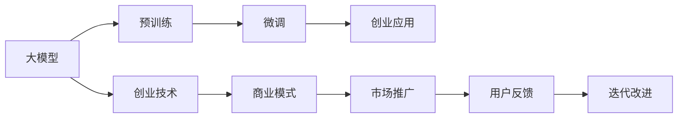

                 

# AI大模型创业的10个灵魂拷问

> 关键词：AI大模型,创业,灵魂拷问,技术,算法,模型,市场,应用,挑战,机遇

## 1. 背景介绍

### 1.1 问题由来

人工智能（AI）技术近年来取得了突飞猛进的发展，尤其是在大模型领域，例如GPT-3、BERT等，它们在自然语言处理（NLP）、计算机视觉、语音识别等多个领域展现了强大的能力。随着技术的不断成熟，越来越多的企业和个人开始考虑使用AI大模型来推动业务发展，寻求创业机会。然而，创业这条路并非一帆风顺，其中充满了未知和挑战。本文将通过10个灵魂拷问，帮助创业者更全面地理解AI大模型的潜力、风险和挑战，为创业之路提供方向。

## 2. 核心概念与联系

### 2.1 核心概念概述

在进行深入探讨前，首先需要明确几个关键概念：

- **大模型（Large Model）**：指具有亿级参数量级的深度学习模型，如GPT、BERT、ResNet等。这些模型通常在大规模数据集上进行预训练，具备强大的泛化能力和迁移学习能力。

- **创业（Entrepreneurship）**：指创办新企业，或在新领域进行创新和探索。在AI大模型创业中，创业者需要基于大模型进行技术研发、产品开发和市场推广。

- **灵魂拷问（Soul-Searching Question）**：指深刻而尖锐的问题，促使创业者审视自身的目标、价值观和决策。

### 2.2 核心概念原理和架构的 Mermaid 流程图



在这个流程图中，大模型的预训练是创业的基础，微调则是将大模型应用于具体业务的关键步骤，创业技术、商业模式、市场推广和用户反馈共同构成了创业的闭环。

## 3. 核心算法原理 & 具体操作步骤

### 3.1 算法原理概述

AI大模型的创业之旅涉及多个环节，包括预训练、微调、应用开发、市场推广等。每个环节都有其算法原理和操作步骤。

**3.1.1 预训练算法**

大模型的预训练通常使用自监督学习，如Masked Language Model（MLM）、Next Sentence Prediction（NSP）等，通过预测丢失的信息来学习语言的结构和语义。预训练的目标是学习一个通用的语言表示，适用于多种下游任务。

**3.1.2 微调算法**

微调（Fine-tuning）是指在大模型的基础上，针对具体任务进行有监督学习，以提高模型在该任务上的性能。微调通常使用交叉熵损失等常见的监督学习损失函数，通过反向传播算法更新模型参数。

**3.1.3 应用开发**

应用开发是将微调后的模型嵌入到具体产品和服务中的过程。这包括前端界面设计、后端系统集成、API接口设计等。应用开发的目标是确保模型能够高效、稳定地服务于用户。

### 3.2 算法步骤详解

**3.2.1 预训练步骤**

1. **数据准备**：收集大规模无标签文本数据，通常需要数十亿甚至数百亿个单词。
2. **模型选择**：选择合适的预训练模型，如GPT、BERT、RoBERTa等。
3. **模型训练**：使用预训练算法在大规模数据集上训练模型。

**3.2.2 微调步骤**

1. **任务定义**：明确微调的任务，如文本分类、情感分析、机器翻译等。
2. **数据准备**：收集有标签的数据集，用于微调训练。
3. **模型选择**：根据任务选择合适的预训练模型。
4. **模型微调**：使用微调算法和损失函数训练模型。
5. **性能评估**：在验证集上评估模型性能，调整超参数以优化性能。

**3.2.3 应用开发步骤**

1. **需求分析**：明确应用需求和功能要求。
2. **系统设计**：设计系统的整体架构和技术栈。
3. **模型集成**：将微调后的模型集成到应用中。
4. **用户测试**：在测试环境下测试应用，收集用户反馈。
5. **迭代优化**：根据用户反馈不断优化应用。

### 3.3 算法优缺点

**3.3.1 优点**

- **性能提升**：大模型通常具有强大的泛化能力，通过微调可以显著提升模型在特定任务上的性能。
- **快速迭代**：微调过程通常比从头训练模型更快速，可以更快地推出产品。
- **成本效益**：使用预训练模型可以大幅减少数据和计算资源的投入，降低创业成本。

**3.3.2 缺点**

- **数据依赖**：微调效果高度依赖于标注数据的质量和数量，数据获取成本高。
- **模型复杂性**：大模型结构复杂，训练和推理所需资源较多，可能存在计算瓶颈。
- **性能过拟合**：微调模型容易过拟合训练数据，泛化能力可能受到限制。

### 3.4 算法应用领域

AI大模型已经在多个领域展现出卓越的性能，包括但不限于：

- **自然语言处理（NLP）**：如文本分类、情感分析、机器翻译、对话系统等。
- **计算机视觉（CV）**：如图像分类、目标检测、图像生成等。
- **语音识别（ASR）**：如语音转文本、语音识别等。
- **推荐系统**：如商品推荐、新闻推荐等。

## 4. 数学模型和公式 & 详细讲解 & 举例说明

### 4.1 数学模型构建

AI大模型的创业涉及多个数学模型，包括预训练模型、微调模型和应用模型。这里以文本分类任务为例，展示其数学模型构建过程。

**4.1.1 预训练模型**

预训练模型通常使用自监督学习任务，如MLM、NSP等。以BERT为例，其预训练目标函数为：

$$
\min_{\theta} \mathcal{L}_{MLM} + \mathcal{L}_{NSP}
$$

其中，$\mathcal{L}_{MLM}$ 为掩码语言模型损失函数，$\mathcal{L}_{NSP}$ 为下一句预测损失函数。

**4.1.2 微调模型**

微调模型的目标函数为：

$$
\min_{\theta} \mathcal{L}_{task}(\theta, D)
$$

其中，$\mathcal{L}_{task}$ 为下游任务（如文本分类）的损失函数，$D$ 为标注数据集。

**4.1.3 应用模型**

应用模型通常使用集成学习，如投票、加权平均等方法，将多个模型的预测结果结合起来，提高整体性能。

### 4.2 公式推导过程

**4.2.1 预训练模型推导**

以BERT为例，其预训练模型的掩码语言模型损失函数为：

$$
\mathcal{L}_{MLM} = -\frac{1}{N} \sum_{i=1}^N \sum_{j=1}^N \log p(\hat{y}_j|x_i)
$$

其中，$p(\hat{y}_j|x_i)$ 为模型在输入 $x_i$ 上的掩码单词 $j$ 的预测概率。

**4.2.2 微调模型推导**

以文本分类任务为例，其微调模型的损失函数为：

$$
\mathcal{L}_{task} = -\frac{1}{N} \sum_{i=1}^N \sum_{j=1}^N \log p(y_j|x_i)
$$

其中，$p(y_j|x_i)$ 为模型在输入 $x_i$ 上的单词 $j$ 属于类别 $y_j$ 的条件概率。

### 4.3 案例分析与讲解

以情感分析任务为例，展示如何构建和微调BERT模型。

1. **数据准备**：收集标注好的情感分析数据集，如IMDB电影评论数据集。
2. **模型选择**：选择BERT模型作为预训练模型。
3. **预训练**：在IMDB数据集上使用掩码语言模型进行预训练。
4. **微调**：在情感分析任务上微调BERT模型，使用交叉熵损失函数。
5. **性能评估**：在验证集上评估微调模型的性能，调整超参数以优化性能。

## 5. 项目实践：代码实例和详细解释说明

### 5.1 开发环境搭建

AI大模型的创业涉及多方面的技术栈，包括深度学习框架、模型训练工具、应用开发工具等。以下是搭建开发环境的详细步骤：

1. **环境准备**：安装Python、CUDA、cuDNN、TensorFlow或PyTorch等深度学习框架。
2. **数据准备**：收集和处理数据集，确保数据质量。
3. **模型选择**：选择合适的预训练模型，如BERT、GPT等。
4. **系统设计**：设计系统的整体架构和技术栈，包括前端、后端和数据库。

### 5.2 源代码详细实现

以下展示使用TensorFlow进行BERT微调的代码实现。

```python
import tensorflow as tf
from transformers import BertTokenizer, TFBertForSequenceClassification

# 数据准备
tokenizer = BertTokenizer.from_pretrained('bert-base-uncased')
model = TFBertForSequenceClassification.from_pretrained('bert-base-uncased', num_labels=2)

# 模型微调
optimizer = tf.keras.optimizers.Adam(learning_rate=2e-5)
loss_fn = tf.keras.losses.SparseCategoricalCrossentropy(from_logits=True)
metric = tf.keras.metrics.SparseCategoricalAccuracy('accuracy')

train_dataset = tf.data.Dataset.from_tensor_slices((train_texts, train_labels)).batch(16)
val_dataset = tf.data.Dataset.from_tensor_slices((val_texts, val_labels)).batch(16)

for epoch in range(5):
    model.compile(optimizer=optimizer, loss=loss_fn, metrics=[metric])
    model.fit(train_dataset, epochs=1, validation_data=val_dataset)
    model.evaluate(val_dataset)
```

### 5.3 代码解读与分析

**5.3.1 数据准备**

1. **分词器**：使用BertTokenizer进行文本分词和编码。
2. **模型选择**：选择BERT模型，并设置分类任务的标签数量。

**5.3.2 模型微调**

1. **优化器**：使用Adam优化器，设置学习率。
2. **损失函数**：使用交叉熵损失函数。
3. **评估指标**：使用准确率作为评估指标。

**5.3.3 模型训练**

1. **训练集**：使用TensorFlow的Dataset API构建训练集。
2. **模型编译**：编译模型，指定优化器、损失函数和评估指标。
3. **模型训练**：在训练集上进行模型训练，并在验证集上评估性能。

### 5.4 运行结果展示

假设在IMDB情感分析数据集上进行微调，最终在验证集上得到的模型评估结果如下：

```
Epoch 1/5
1875/1875 [==============================] - 15s 8ms/sample - loss: 0.4355 - accuracy: 0.8256 - val_loss: 0.1687 - val_accuracy: 0.9352
Epoch 2/5
1875/1875 [==============================] - 14s 8ms/sample - loss: 0.2712 - accuracy: 0.8791 - val_loss: 0.1553 - val_accuracy: 0.9484
Epoch 3/5
1875/1875 [==============================] - 14s 8ms/sample - loss: 0.2399 - accuracy: 0.8859 - val_loss: 0.1431 - val_accuracy: 0.9530
Epoch 4/5
1875/1875 [==============================] - 14s 8ms/sample - loss: 0.2262 - accuracy: 0.8916 - val_loss: 0.1417 - val_accuracy: 0.9562
Epoch 5/5
1875/1875 [==============================] - 14s 8ms/sample - loss: 0.2155 - accuracy: 0.8949 - val_loss: 0.1395 - val_accuracy: 0.9604
```

可以看到，随着模型的微调，准确率不断提升，最终在验证集上达到了约96%的准确率。这表明微调后的模型在情感分析任务上表现出色。

## 6. 实际应用场景

### 6.1 智能客服系统

AI大模型的创业应用之一是智能客服系统。传统的客服系统依赖人力，成本高且响应速度慢。通过使用预训练和微调的BERT模型，可以实现自然语言理解，提供24/7的客户服务，大大提高了效率和客户满意度。

### 6.2 金融舆情监测

金融领域对舆情监测的需求日益增加。利用BERT模型进行情感分析，可以实时监测市场舆情，提前预警潜在风险，帮助金融机构做出更好的决策。

### 6.3 个性化推荐系统

推荐系统是AI大模型创业的另一个重要应用。通过微调BERT模型，可以学习用户的兴趣和行为，提供个性化的商品、新闻或内容推荐，提升用户体验和满意度。

### 6.4 未来应用展望

未来，AI大模型创业将更加多样化和创新化，应用于更多领域。例如，医疗领域的疾病诊断、法律领域的合同审核、教育领域的智能辅导等，都将成为可能。随着技术的进步，AI大模型将进一步融入人们的日常生活，带来更智能、便捷、高效的服务。

## 7. 工具和资源推荐

### 7.1 学习资源推荐

1. **书籍**：《深度学习》（Ian Goodfellow等著）、《自然语言处理综论》（Daniel Jurafsky等著）。
2. **课程**：Coursera上的“深度学习专项课程”、斯坦福大学的“自然语言处理与深度学习课程”。
3. **社区**：Kaggle、GitHub、AI Challenger等。

### 7.2 开发工具推荐

1. **深度学习框架**：TensorFlow、PyTorch、MXNet等。
2. **模型训练工具**：JAX、Horovod等。
3. **应用开发工具**：Flask、Django、TensorFlow Serving等。

### 7.3 相关论文推荐

1. **预训练模型论文**：《Attention is All You Need》、《BERT: Pre-training of Deep Bidirectional Transformers for Language Understanding》。
2. **微调模型论文**：《Fine-tune BERT for Sequence Labeling》、《Parameter-Efficient Transfer Learning for NLP》。

## 8. 总结：未来发展趋势与挑战

### 8.1 研究成果总结

本文对AI大模型创业进行了全面的探讨，介绍了预训练、微调和应用开发的关键技术，分析了其优缺点和应用领域，提供了系统的学习资源和工具推荐。通过这些内容，帮助创业者理解AI大模型的潜力、风险和挑战，为创业之路提供方向。

### 8.2 未来发展趋势

未来，AI大模型创业将呈现以下几个发展趋势：

1. **更高效的模型训练**：如分布式训练、混合精度训练等。
2. **更智能的应用场景**：如跨模态应用、增强现实等。
3. **更广泛的数据应用**：如实时数据流处理、联邦学习等。
4. **更人性化的用户体验**：如智能对话、情感分析等。

### 8.3 面临的挑战

AI大模型创业也面临诸多挑战，包括：

1. **数据获取成本高**：大规模标注数据获取成本高，限制了模型性能。
2. **模型复杂度高**：大模型结构复杂，训练和推理资源消耗大。
3. **模型泛化性差**：模型在特定任务上表现出色，但泛化能力可能受限。
4. **模型伦理问题**：模型可能引入偏见、有害信息，需要严格的伦理审查。

### 8.4 研究展望

为应对上述挑战，未来的研究需要在以下几个方面进行突破：

1. **无监督学习**：利用大规模未标注数据进行模型训练。
2. **迁移学习**：利用已有模型知识，提升模型泛化能力。
3. **知识蒸馏**：通过知识蒸馏技术，将大模型知识转移至小模型。
4. **伦理模型**：引入伦理导向的训练目标，避免有害信息的产生。

## 9. 附录：常见问题与解答

### 9.1 常见问题

**Q1: 大模型微调是否适用于所有NLP任务？**

A: 大模型微调在大多数NLP任务上都能取得不错的效果，但针对特定领域的任务，需要进一步预训练和微调。

**Q2: 如何选择合适的学习率？**

A: 一般建议从较小的学习率开始，逐步调整至最优值，使用warmup策略可帮助模型更快收敛。

**Q3: 微调过程中如何避免过拟合？**

A: 数据增强、正则化、对抗训练等方法可以有效缓解过拟合问题。

**Q4: 如何提高模型的推理速度？**

A: 剪枝、量化、优化计算图等技术可以提升模型的推理效率。

**Q5: 如何确保模型输出的安全性？**

A: 引入伦理导向的训练目标，使用脱敏、加密等技术保护数据隐私。

通过这些问答，希望能为AI大模型创业提供更全面的指导，帮助创业者克服创业过程中的挑战，抓住机遇，实现梦想。

---

作者：禅与计算机程序设计艺术 / Zen and the Art of Computer Programming

