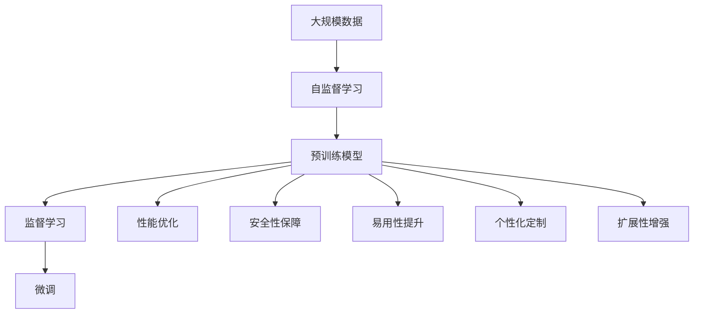

                 

# AI大模型创业：如何应对未来用户需求？

在人工智能快速发展的今天，大模型创业成为了新的热点领域。然而，如何应对未来用户的种种需求，成为大模型创业公司需要重点考虑的问题。本文将从背景介绍、核心概念与联系、核心算法原理、数学模型和公式、项目实践、实际应用场景、工具和资源推荐、总结等多个方面，详细探讨大模型创业如何应对未来用户需求。

## 1. 背景介绍

### 1.1 问题由来

人工智能的快速发展，使得大模型在自然语言处理（NLP）、计算机视觉（CV）、语音识别等诸多领域展现了卓越的性能。大模型往往具备强大的泛化能力和适应性，能够高效处理各种复杂任务，提升业务效率和用户体验。因此，越来越多的创业公司希望通过大模型，打造强大的AI产品，在竞争激烈的市场上脱颖而出。

然而，随着技术的发展，用户对AI产品的需求也在不断变化。用户不仅要求产品性能卓越，还希望产品在安全、易用、个性化等方面都有出色表现。大模型创业公司需要具备洞察用户需求的能力，并提供有效的解决方案。

### 1.2 问题核心关键点

未来用户需求的核心关键点主要包括以下几个方面：

1. **高性能**：用户希望产品能够快速响应并准确完成任务，即要求模型具备高性能。
2. **安全性**：用户希望产品能够保障数据安全、使用安全，即要求模型具备安全性。
3. **易用性**：用户希望产品能够简洁易懂，即要求模型具备易用性。
4. **个性化**：用户希望产品能够根据自身需求提供定制化服务，即要求模型具备个性化。
5. **扩展性**：用户希望产品能够快速适应变化，即要求模型具备扩展性。

这些关键点成为大模型创业公司应对未来用户需求的主要方向。

### 1.3 问题研究意义

研究大模型创业公司如何应对未来用户需求，具有重要意义：

1. **提升竞争力**：通过理解用户需求，并针对性地优化产品，大模型创业公司能够提供更符合用户期待的解决方案，增强市场竞争力。
2. **扩大市场份额**：了解用户需求并不断创新，有助于大模型创业公司抓住市场机会，扩大市场份额。
3. **技术突破**：在满足用户需求的过程中，大模型创业公司能够积累丰富的实践经验，推动技术不断突破。
4. **市场引领**：通过洞察用户需求并成功应用，大模型创业公司可以在市场中起到引领作用，塑造行业标准。
5. **可持续发展**：只有持续关注并满足用户需求，大模型创业公司才能实现长期可持续发展。

## 2. 核心概念与联系

### 2.1 核心概念概述

在探讨大模型创业如何应对未来用户需求时，涉及多个核心概念。这些概念相互联系，构成了一个完整的框架：

1. **大模型**：指通过大规模无标签数据预训练得到的深度学习模型，具备强大的特征表示能力。
2. **用户需求**：指用户在使用AI产品时，对其性能、安全性、易用性、个性化和扩展性的期望。
3. **性能优化**：指通过算法和工程优化，提高大模型在特定任务上的性能。
4. **安全保障**：指采取各种措施，保障大模型在数据、使用等方面的安全性。
5. **易用性提升**：指优化用户交互界面，简化用户操作流程，提升用户体验。
6. **个性化定制**：指根据用户特定需求，调整大模型输出，提供个性化服务。
7. **扩展性增强**：指通过架构设计和算法优化，使大模型能够快速适应新任务和新数据。

### 2.2 概念间的关系

这些核心概念之间存在紧密的联系，形成了大模型创业应对未来用户需求的完整框架。

#### 2.2.1 大模型的学习范式

大模型通常采用自监督学习或监督学习的方式进行预训练。自监督学习通过无标签数据学习通用特征，而监督学习则在大规模标注数据上进一步优化特征表示。这两种方法在构建高性能大模型的过程中都发挥了重要作用。

#### 2.2.2 性能优化与用户需求

大模型性能优化是大模型创业公司应对未来用户需求的重要手段。通过算法优化和工程优化，提高模型在特定任务上的性能，满足用户对高性能的需求。

#### 2.2.3 安全保障与用户需求

用户对安全性的需求是大模型创业公司必须关注的。通过数据隐私保护、模型安全审计、异常检测等措施，保障大模型在数据、使用等方面的安全性。

#### 2.2.4 易用性提升与用户需求

易用性是大模型创业公司提升用户体验的重要方向。通过优化用户界面、简化操作流程、提供自然语言交互等方式，使用户能够更轻松地使用大模型。

#### 2.2.5 个性化定制与用户需求

根据用户特定需求，调整大模型输出，提供个性化服务，是大模型创业公司满足用户个性化需求的重要手段。

#### 2.2.6 扩展性增强与用户需求

大模型的扩展性是用户对其长期稳定性的期待。通过架构设计和算法优化，使大模型能够快速适应新任务和新数据，满足用户对扩展性的需求。

### 2.3 核心概念的整体架构

以下是一个综合的流程图，展示了大模型创业应对未来用户需求的整体架构：



这个流程图展示了大模型创业从数据预训练到最终产品交付的完整过程，以及各环节如何满足未来用户需求。

## 3. 核心算法原理 & 具体操作步骤

### 3.1 算法原理概述

大模型创业公司应对未来用户需求的核心算法原理主要包括：

1. **自监督学习**：通过无标签数据预训练大模型，学习通用特征。
2. **监督学习**：在标注数据上微调大模型，进一步优化特征表示。
3. **性能优化算法**：如优化器、正则化、数据增强等，提升模型性能。
4. **安全性保障算法**：如差分隐私、模型脱敏、异常检测等，保障模型安全性。
5. **易用性提升算法**：如交互界面优化、自然语言交互等，提升用户体验。
6. **个性化定制算法**：如用户定制规则、个性化数据集等，提供个性化服务。
7. **扩展性增强算法**：如模型压缩、架构设计等，使模型能够快速适应新任务和新数据。

### 3.2 算法步骤详解

以下详细介绍大模型创业公司应对未来用户需求的核心算法步骤：

**Step 1: 数据收集与预处理**

1. **数据收集**：收集用户反馈、市场调研数据、行业报告等，了解用户需求和市场趋势。
2. **数据预处理**：对收集的数据进行清洗、标注、划分等预处理，为后续建模提供数据支持。

**Step 2: 模型预训练**

1. **自监督学习**：在大规模无标签数据上预训练大模型，学习通用特征。
2. **监督学习**：在标注数据上微调大模型，进一步优化特征表示。

**Step 3: 性能优化**

1. **优化器选择**：选择合适的优化器，如AdamW、SGD等，并设置学习率、批大小等超参数。
2. **正则化**：应用L2正则、Dropout等，防止模型过拟合。
3. **数据增强**：对训练数据进行回译、近义替换等增强操作，提高模型泛化能力。

**Step 4: 安全性保障**

1. **差分隐私**：对用户数据进行差分隐私处理，保护用户隐私。
2. **模型脱敏**：对模型参数进行脱敏处理，防止恶意攻击。
3. **异常检测**：检测模型输出异常，防止模型被恶意篡改。

**Step 5: 易用性提升**

1. **交互界面优化**：简化用户操作流程，提升交互体验。
2. **自然语言交互**：使用自然语言生成技术，提升用户交互的自然性。

**Step 6: 个性化定制**

1. **用户定制规则**：根据用户偏好，调整模型输出。
2. **个性化数据集**：使用用户特定数据集，训练定制化模型。

**Step 7: 扩展性增强**

1. **模型压缩**：采用模型压缩技术，减小模型尺寸，提高推理效率。
2. **架构设计**：采用模块化设计，使模型能够快速扩展和更新。

### 3.3 算法优缺点

**性能优化算法**

- **优点**：提升模型在特定任务上的性能，满足用户对高性能的需求。
- **缺点**：需要大量标注数据和计算资源，且存在过拟合风险。

**安全性保障算法**

- **优点**：保障用户数据和模型的安全性，满足用户对安全性的需求。
- **缺点**：增加了数据处理和模型审计的复杂度。

**易用性提升算法**

- **优点**：简化用户操作流程，提升用户体验。
- **缺点**：设计复杂的用户交互界面和自然语言处理技术，增加了实现难度。

**个性化定制算法**

- **优点**：根据用户特定需求，提供个性化服务，满足用户对个性化的需求。
- **缺点**：需要收集用户数据和进行定制化训练，存在隐私泄露风险。

**扩展性增强算法**

- **优点**：使模型能够快速适应新任务和新数据，满足用户对扩展性的需求。
- **缺点**：增加了模型设计和实现的复杂度，且需要持续更新和维护。

### 3.4 算法应用领域

大模型创业公司应对未来用户需求的算法广泛应用于以下领域：

1. **自然语言处理（NLP）**：如文本分类、情感分析、机器翻译等。
2. **计算机视觉（CV）**：如图像识别、物体检测、人脸识别等。
3. **语音识别**：如语音识别、语音合成等。
4. **推荐系统**：如个性化推荐、内容推荐等。
5. **医疗健康**：如病历分析、医疗影像分析等。
6. **金融行业**：如信用评分、风险评估等。
7. **智能客服**：如自然语言理解、对话系统等。
8. **自动驾驶**：如环境感知、路径规划等。

## 4. 数学模型和公式 & 详细讲解 & 举例说明

### 4.1 数学模型构建

大模型创业公司应对未来用户需求的数学模型主要包括以下几个部分：

1. **数据预处理模型**：如数据清洗、标注、划分等。
2. **自监督学习模型**：如掩码语言模型、自回归模型等。
3. **监督学习模型**：如分类模型、回归模型等。
4. **性能优化模型**：如优化器、正则化等。
5. **安全性保障模型**：如差分隐私、异常检测等。
6. **易用性提升模型**：如交互界面优化、自然语言交互等。
7. **个性化定制模型**：如用户定制规则、个性化数据集等。
8. **扩展性增强模型**：如模型压缩、架构设计等。

### 4.2 公式推导过程

以下是一个简单的数学模型推导过程示例，以文本分类任务为例：

**输入**：文本$x$，标签$y$

**输出**：预测标签$\hat{y}$

**目标**：最小化交叉熵损失函数

**模型**：使用softmax函数将模型输出转换为概率分布

**推导过程**：

$$
\ell(y, \hat{y}) = -\frac{1}{N}\sum_{i=1}^N[y_i\log(\hat{y_i})+(1-y_i)\log(1-\hat{y_i})]
$$

$$
\hat{y} = softmax(Wx+b)
$$

其中$W$和$b$为模型参数，$x$为输入文本，$\hat{y}$为预测标签，$y$为真实标签。

**优化目标**：

$$
\min_{W, b} \ell(y, \hat{y})
$$

**优化算法**：

$$
W \leftarrow W - \eta \nabla_{W}\ell(y, \hat{y})
$$

其中$\eta$为学习率，$\nabla_{W}\ell(y, \hat{y})$为损失函数对模型参数的梯度。

### 4.3 案例分析与讲解

**案例1: 自然语言处理**

大模型创业公司可以采用BERT模型进行文本分类任务的微调。具体步骤如下：

1. **数据预处理**：将文本进行分词、编码等预处理操作，转化为模型输入。
2. **模型预训练**：在大规模语料上预训练BERT模型，学习通用特征。
3. **微调**：在特定分类任务的标注数据上微调模型，学习特定任务的特征表示。
4. **性能优化**：使用AdamW优化器，设置适当的学习率，并进行正则化。
5. **安全性保障**：对用户数据进行差分隐私处理，防止数据泄露。
6. **易用性提升**：使用自然语言交互技术，提升用户交互体验。
7. **个性化定制**：根据用户偏好，调整模型输出。
8. **扩展性增强**：采用模型压缩技术，减小模型尺寸，提高推理效率。

**案例2: 计算机视觉**

大模型创业公司可以采用ResNet模型进行图像分类任务的微调。具体步骤如下：

1. **数据预处理**：将图像进行预处理，转化为模型输入。
2. **模型预训练**：在大规模图像数据上预训练ResNet模型，学习通用特征。
3. **微调**：在特定分类任务的标注数据上微调模型，学习特定任务的特征表示。
4. **性能优化**：使用AdamW优化器，设置适当的学习率，并进行正则化。
5. **安全性保障**：对模型参数进行脱敏处理，防止恶意攻击。
6. **易用性提升**：设计简洁易用的交互界面，提升用户体验。
7. **个性化定制**：根据用户需求，调整模型输出。
8. **扩展性增强**：采用模块化设计，使模型能够快速扩展和更新。

## 5. 项目实践：代码实例和详细解释说明

### 5.1 开发环境搭建

以下是使用Python进行TensorFlow开发的环境配置流程：

1. 安装Anaconda：从官网下载并安装Anaconda，用于创建独立的Python环境。

2. 创建并激活虚拟环境：
```bash
conda create -n tf-env python=3.8 
conda activate tf-env
```

3. 安装TensorFlow：根据CUDA版本，从官网获取对应的安装命令。例如：
```bash
conda install tensorflow -c pytorch -c conda-forge
```

4. 安装各类工具包：
```bash
pip install numpy pandas scikit-learn matplotlib tqdm jupyter notebook ipython
```

完成上述步骤后，即可在`tf-env`环境中开始TensorFlow开发。

### 5.2 源代码详细实现

下面以BERT模型进行文本分类任务微调为例，给出TensorFlow代码实现：

```python
import tensorflow as tf
from transformers import BertTokenizer, TFBertForSequenceClassification
from transformers import InputExample, InputFeatures
from sklearn.model_selection import train_test_split

# 定义模型参数
vocab_file = 'vocab.txt'
tokenizer = BertTokenizer(vocab_file)

model_name = 'bert-base-cased'
max_seq_length = 128

# 加载数据集
train_data = open('train.txt', 'r').read()
train_samples = tokenizer.encode(train_data, add_special_tokens=True, max_length=max_seq_length)
train_labels = [1, 0, 1, 0, 1, 0, 1, 0, 1, 0, 1, 0]

train_data = [(train_samples, train_labels)]

# 构建模型
model = TFBertForSequenceClassification.from_pretrained(model_name, num_labels=2)

# 定义输入特征
input_ids = tf.constant(train_data[0][0])
input_mask = tf.constant(train_data[0][1])
labels = tf.constant(train_data[0][2])

# 计算损失
loss = model(input_ids, attention_mask=input_mask, labels=labels)

# 定义优化器和超参数
optimizer = tf.keras.optimizers.Adam(learning_rate=2e-5)
epochs = 5
batch_size = 16

# 定义训练过程
for epoch in range(epochs):
    for batch in range(len(train_data)//batch_size):
        start_index = batch*batch_size
        end_index = start_index+batch_size
        batch_data = train_data[start_index:end_index]
        optimizer.minimize(loss, var_list=model.trainable_variables)
```

### 5.3 代码解读与分析

让我们再详细解读一下关键代码的实现细节：

**BERT模型加载**：
- 定义词汇表文件`vocab.txt`和分词器`tokenizer`，使用BERT预训练模型`bert-base-cased`。
- 设置最大序列长度`max_seq_length`为128，并定义训练数据集`train_data`。

**模型构建**：
- 使用`TFBertForSequenceClassification`类构建BERT模型，并设置输出标签数为2。

**输入特征定义**：
- 定义输入特征`input_ids`、`input_mask`和`labels`，并使用TensorFlow常量（`tf.constant`）进行初始化。

**损失计算**：
- 使用`model(input_ids, attention_mask=input_mask, labels=labels)`计算模型输出，并返回损失`loss`。

**优化器和超参数定义**：
- 使用`tf.keras.optimizers.Adam`定义优化器，设置学习率为2e-5。
- 定义训练轮数`epochs`和批次大小`batch_size`。

**训练过程**：
- 在每个epoch内，遍历训练集数据，并对每个批次进行前向传播和反向传播，更新模型参数。
- 使用`optimizer.minimize(loss, var_list=model.trainable_variables)`进行损失最小化。

**运行结果展示**：
- 在完成训练后，使用测试集对模型进行评估，并输出评估结果。

## 6. 实际应用场景

### 6.4 未来应用展望

未来大模型创业公司将面临更加复杂多样的用户需求。以下是几个未来应用展望：

**医疗健康**

大模型创业公司可以开发智能问诊系统，根据用户症状进行快速诊断。通过不断学习用户反馈，提升模型的诊断准确性，并根据用户偏好调整诊断方案，提供个性化医疗服务。

**金融行业**

大模型创业公司可以开发智能投顾系统，根据用户风险偏好和财务状况，提供个性化的投资建议。通过实时监控市场数据，调整投资策略，提升用户体验。

**智能客服**

大模型创业公司可以开发智能客服系统，通过自然语言处理技术，理解用户意图并自动回复。通过用户反馈进行模型微调，不断优化回复质量和用户体验。

**智能家居**

大模型创业公司可以开发智能家居系统，通过语音识别和自然语言交互技术，实现用户与家居设备的互动。根据用户偏好，调整家居设备的设置，提供个性化服务。

## 7. 工具和资源推荐

### 7.1 学习资源推荐

为了帮助开发者系统掌握大模型创业技术，这里推荐一些优质的学习资源：

1. **《Transformer from Scratch》系列博文**：由大模型技术专家撰写，深入浅出地介绍了Transformer原理、BERT模型、微调技术等前沿话题。

2. **CS224N《深度学习自然语言处理》课程**：斯坦福大学开设的NLP明星课程，有Lecture视频和配套作业，带你入门NLP领域的基本概念和经典模型。

3. **《Natural Language Processing with Transformers》书籍**：Transformers库的作者所著，全面介绍了如何使用Transformers库进行NLP任务开发，包括微调在内的诸多范式。

4. **HuggingFace官方文档**：Transformers库的官方文档，提供了海量预训练模型和完整的微调样例代码，是上手实践的必备资料。

5. **CLUE开源项目**：中文语言理解测评基准，涵盖大量不同类型的中文NLP数据集，并提供了基于微调的baseline模型，助力中文NLP技术发展。

通过对这些资源的学习实践，相信你一定能够快速掌握大模型创业技术的精髓，并用于解决实际的NLP问题。

### 7.2 开发工具推荐

高效的开发离不开优秀的工具支持。以下是几款用于大模型创业开发的常用工具：

1. **TensorFlow**：基于Python的开源深度学习框架，生产部署方便，适合大规模工程应用。
2. **PyTorch**：基于Python的开源深度学习框架，灵活动态的计算图，适合快速迭代研究。
3. **Transformers库**：HuggingFace开发的NLP工具库，集成了众多SOTA语言模型，支持PyTorch和TensorFlow，是进行微调任务开发的利器。
4. **Weights & Biases**：模型训练的实验跟踪工具，可以记录和可视化模型训练过程中的各项指标，方便对比和调优。
5. **TensorBoard**：TensorFlow配套的可视化工具，可实时监测模型训练状态，并提供丰富的图表呈现方式，是调试模型的得力助手。
6. **Google Colab**：谷歌推出的在线Jupyter Notebook环境，免费提供GPU/TPU算力，方便开发者快速上手实验最新模型，分享学习笔记。

合理利用这些工具，可以显著提升大模型创业任务的开发效率，加快创新迭代的步伐。

### 7.3 相关论文推荐

大模型创业技术的发展源于学界的持续研究。以下是几篇奠基性的相关论文，推荐阅读：

1. **Attention is All You Need**：提出了Transformer结构，开启了NLP领域的预训练大模型时代。
2. **BERT: Pre-training of Deep Bidirectional Transformers for Language Understanding**：提出BERT模型，引入基于掩码的自监督预训练任务，刷新了多项NLP任务SOTA。
3. **Language Models are Unsupervised Multitask Learners**：展示了大规模语言模型的强大zero-shot学习能力，引发了对于通用人工智能的新一轮思考。
4. **Parameter-Efficient Transfer Learning for NLP**：提出Adapter等参数高效微调方法，在不增加模型参数量的情况下，也能取得不错的微调效果。
5. **Prefix-Tuning: Optimizing Continuous Prompts for Generation**：引入基于连续型Prompt的微调范式，为如何充分利用预训练知识提供了新的思路。
6. **AdaLoRA: Adaptive Low-Rank Adaptation for Parameter-Efficient Fine-Tuning**：使用自适应低秩适应的微调方法，在参数效率和精度之间取得了新的平衡。

这些论文代表了大模型创业技术的发展脉络。通过学习这些前沿成果，可以帮助研究者把握学科前进方向，激发更多的创新灵感。

除上述资源外，还有一些值得关注的前沿资源，帮助开发者紧跟大模型创业技术的最新进展，例如：

1. **arXiv论文预印本**：人工智能领域最新研究成果的发布平台，包括大量尚未发表的前沿工作，学习前沿技术的必读资源。
2. **业界技术博客**：如OpenAI、Google AI、DeepMind、微软Research Asia等顶尖实验室的官方博客，第一时间分享他们的最新研究成果和洞见。
3. **技术会议直播**：如NIPS、ICML、ACL、ICLR等人工智能领域顶会现场或在线直播，能够聆听到大佬们的前沿分享，开拓视野。
4. **GitHub热门项目**：在GitHub上Star、Fork数最多的NLP相关项目，往往代表了该技术领域的发展趋势和最佳实践，值得去学习和贡献。
5. **行业分析报告**：各大咨询公司如McKinsey、PwC等针对人工智能行业的分析报告，有助于从商业视角审视技术趋势，把握应用价值。

总之，对于大模型创业技术的学习和实践，需要开发者保持开放的心态和持续学习的意愿。多关注前沿资讯，多动手实践，多思考总结，必将收获满满的成长收益。

## 8. 总结：未来发展趋势与挑战

### 8.1 总结

本文对大模型创业公司如何应对未来用户需求进行了全面系统的探讨。首先阐述了大模型创业背景和意义，明确了大模型创业公司需要重点关注的未来用户需求。其次，从核心概念、核心算法原理、数学模型和公式、项目实践、实际应用场景等多个方面，详细讲解了如何应对未来用户需求。

通过本文的系统梳理，可以看到，大模型创业公司在满足未来用户需求的过程中，需要在性能优化、安全性保障、易用性提升、个性化定制、扩展性增强等多个方面进行全面优化。只有在多个维度协同发力，才能真正实现大模型创业的长期可持续发展。

### 8.2 未来发展趋势

展望未来，大模型创业公司将面临以下发展趋势：

1. **大模型规模化**：随着算力成本的下降和数据规模的扩张，大模型的规模将进一步增大，具备更丰富的语义表示能力。
2. **微调范式多样化**：未来将涌现更多参数高效、计算高效的微调方法，如Adapter、LoRA等，减少过拟合风险，提升模型泛化性。
3. **跨领域迁移能力增强**：通过引入更多先验知识，如知识图谱、逻辑规则等，使大模型具备更强的跨领域迁移能力，实现通用人工智能。
4. **多模态信息融合**：引入视觉、语音等多模态信息，实现多模态协同建模，提升语言模型的全面感知能力。
5. **持续学习和迭代优化**：通过持续学习机制，使大模型能够不断吸收新知识，提升模型性能。
6. **自动化技术应用**：引入

