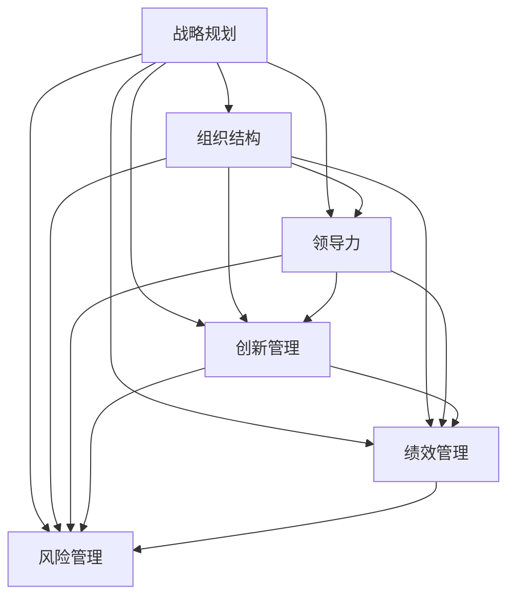

                 

# 管理艺术：从策略到执行

## 1. 背景介绍

管理是人类社会的重要活动之一，它涉及到对资源（包括人力、物力、财力等）的有效组织和协调，以实现既定目标。随着社会的快速发展，管理的重要性日益凸显，特别是在信息化和数字化时代，管理已经成为企业竞争力和国家综合国力的重要因素。然而，尽管管理实践已经积累了丰富的经验，但将其系统化、科学化的研究仍然相对较少。

本文旨在探讨管理的艺术性和科学性，从管理的基本原理出发，结合实际案例，探讨管理策略的制定和执行，以及管理艺术的运用。通过详细分析管理的核心概念、核心算法原理、数学模型和公式，以及项目实践、实际应用场景、工具和资源推荐，本文将系统地阐述管理艺术的奥秘，帮助读者更好地理解和管理复杂环境下的企业运营和组织发展。

## 2. 核心概念与联系

### 2.1 核心概念概述

管理是一门艺术和科学。在企业管理中，艺术性体现在如何通过有效的策略和执行，将复杂多变的环境转化为企业的竞争优势。而科学性则体现在如何运用数据和分析工具，实现资源的最优配置和决策的准确性。

为更好地理解管理的艺术性和科学性，本节将介绍几个密切相关的核心概念：

- **战略规划**：指企业根据外部环境和自身资源，制定长期目标和策略，以实现企业可持续发展的过程。
- **组织结构**：指企业内部各种职能和层次的安排，以协调和优化资源配置。
- **领导力**：指领导者在管理过程中所展现的能力和影响力，包括决策、沟通、激励等方面。
- **创新管理**：指通过创新，持续改进产品、服务和流程，以提升企业竞争力的管理活动。
- **绩效管理**：指通过设定和评估绩效指标，激励和监督员工，以确保战略目标的实现。
- **风险管理**：指识别、评估和控制企业面临的各种风险，以保障企业稳定发展。

这些核心概念之间存在着紧密的联系，形成一个有机整体，共同支撑企业的运行和发展。以下通过Mermaid流程图展示这些概念之间的联系：



这个流程图展示了战略规划与其他管理概念之间的相互作用。战略规划是企业管理的起点，而其他管理概念则是战略规划的支撑和执行工具。

### 2.2 概念间的关系

这些核心概念之间存在着密切的联系，共同构成了企业管理的基础框架。以下将详细分析这些概念之间的相互作用和依赖关系：

1. **战略规划与组织结构**：战略规划决定了企业的方向和目标，而组织结构则是实现这些目标的具体安排。有效的战略规划需要合理的组织结构来支撑。
2. **战略规划与领导力**：领导力是战略规划得以实施的关键。领导者的决策、沟通和激励能力直接影响战略规划的实现效果。
3. **战略规划与创新管理**：创新管理是实现战略规划的重要手段。企业需要通过持续创新，不断提升产品和服务，以适应市场变化和竞争压力。
4. **战略规划与绩效管理**：绩效管理是评估战略规划执行情况的工具。通过设定和评估绩效指标，领导者可以及时调整战略规划，确保目标的实现。
5. **战略规划与风险管理**：风险管理是保障战略规划顺利实施的重要保障。企业需要通过风险识别和控制，避免战略规划过程中出现重大风险。

这些概念之间的相互作用，形成了一个动态的管理系统，帮助企业在复杂环境中实现战略目标。

## 3. 核心算法原理 & 具体操作步骤

### 3.1 算法原理概述

在企业管理中，算法原理是实现管理目标的基础。本文将重点介绍一种基于数据驱动的管理算法——层次分析法（AHP），该算法通过将复杂的问题分解为多个层次，利用专家判断和数学方法进行综合分析，得出最优方案。

### 3.2 算法步骤详解

层次分析法（AHP）主要包括以下步骤：

1. **目标层**：明确企业战略目标，如提高市场份额、降低成本等。
2. **准则层**：将战略目标分解为多个具体指标，如市场份额、成本、利润等。
3. **方案层**：列出实现战略目标的具体方案，如产品创新、市场推广等。
4. **构建判断矩阵**：由专家对各指标进行两两比较，构建判断矩阵。
5. **求解权重**：利用特征根法或和法，求解各指标的权重。
6. **计算方案排序**：将方案层与准则层组合，利用加权和法计算方案的总得分。
7. **选择最优方案**：根据总得分，选择最优方案作为战略决策依据。

### 3.3 算法优缺点

AHP算法的主要优点包括：

- **综合性强**：能够综合考虑多个指标的影响，得出全面客观的结论。
- **操作简便**：通过构建判断矩阵和求解权重，易于实现和操作。
- **可解释性强**：通过专家判断和数学方法，解释性强，易于理解和接受。

但AHP算法也存在一些局限性：

- **主观性强**：专家判断容易受到主观因素的影响，导致结果不够客观。
- **计算复杂**：构建判断矩阵和求解权重需要较高的数学和统计学知识。
- **适用范围有限**：适用于结构化的问题，对于复杂和非结构化的问题，效果可能不理想。

### 3.4 算法应用领域

AHP算法主要应用于以下领域：

- **战略规划**：在企业战略规划中，通过评估各指标的影响，得出最优战略方案。
- **投资决策**：在投资项目评估中，通过比较不同项目的优劣，选择最优投资方案。
- **绩效评估**：在绩效评估中，通过设定和评估各项指标，激励和监督员工。
- **风险管理**：在风险评估中，通过识别和控制各种风险，保障企业稳定发展。

## 4. 数学模型和公式 & 详细讲解

### 4.1 数学模型构建

在企业管理中，数学模型是实现管理决策的重要工具。本文将重点介绍两种常用的数学模型——层次分析法（AHP）和线性规划（LP）。

AHP算法主要通过构建判断矩阵和求解权重来实现。具体步骤如下：

1. **构建判断矩阵**：专家对各指标进行两两比较，构造判断矩阵。

2. **求解权重**：利用特征根法或和法，求解各指标的权重。

线性规划（LP）主要用于优化资源配置和生产调度。具体步骤如下：

1. **建立目标函数**：设定优化目标，如最大利润、最小成本等。
2. **建立约束条件**：列出资源约束、生产约束等。
3. **求解最优解**：利用单纯形法或对偶法求解最优解。

### 4.2 公式推导过程

AHP算法的公式推导如下：

1. **构建判断矩阵**：专家对各指标进行两两比较，构造判断矩阵。

   $$
   A=\begin{bmatrix}
   a_{11} & a_{12} & \cdots & a_{1n} \\
   a_{21} & a_{22} & \cdots & a_{2n} \\
   \vdots & \vdots & \ddots & \vdots \\
   a_{m1} & a_{m2} & \cdots & a_{mn}
   \end{bmatrix}
   $$

2. **求解权重**：利用特征根法或和法，求解各指标的权重。

   $$
   \lambda \mathbf{w} = \mathbf{a}\mathbf{w}
   $$

   $$
   \mathbf{w} = \frac{\mathbf{u}}{\lambda}
   $$

   其中，$\lambda$为特征根，$\mathbf{u}$为特征向量。

线性规划（LP）的公式推导如下：

1. **建立目标函数**：设定优化目标，如最大利润、最小成本等。

   $$
   \max \mathbf{c}^T\mathbf{x}
   $$

2. **建立约束条件**：列出资源约束、生产约束等。

   $$
   \mathbf{A}\mathbf{x} \leq \mathbf{b}
   $$

3. **求解最优解**：利用单纯形法或对偶法求解最优解。

   $$
   \min \mathbf{c}^T\mathbf{x} \quad \text{s.t.} \quad \mathbf{A}\mathbf{x} = \mathbf{b}
   $$

   其中，$\mathbf{x}$为变量向量，$\mathbf{A}$为约束矩阵，$\mathbf{b}$为约束常数向量。

### 4.3 案例分析与讲解

以一家制造企业的生产线优化为例，说明如何使用AHP和LP进行管理决策。

1. **AHP应用**：将生产线优化问题分解为设备更新、生产安排、员工培训等准则层，通过专家判断构建判断矩阵，求解各指标的权重，得出最优的生产线安排。

2. **LP应用**：设定最大利润为目标函数，列出设备、原材料、人力等约束条件，求解最优的生产计划。

## 5. 项目实践：代码实例和详细解释说明

### 5.1 开发环境搭建

在进行企业管理项目实践前，我们需要准备好开发环境。以下是使用Python进行Sympy开发的环境配置流程：

1. 安装Anaconda：从官网下载并安装Anaconda，用于创建独立的Python环境。

2. 创建并激活虚拟环境：
```bash
conda create -n py-env python=3.8 
conda activate py-env
```

3. 安装Sympy：
```bash
pip install sympy
```

4. 安装各类工具包：
```bash
pip install numpy pandas scikit-learn matplotlib tqdm jupyter notebook ipython
```

完成上述步骤后，即可在`py-env`环境中开始企业管理实践。

### 5.2 源代码详细实现

下面我们以生产线优化问题为例，给出使用Sympy进行AHP和LP的Python代码实现。

首先，定义生产线的各个环节：

```python
import sympy as sp
import numpy as np

# 定义变量
X, Y, Z = sp.symbols('X Y Z')

# 定义目标函数
objective = sp.Max(X + 2*Y + 3*Z)

# 定义约束条件
constraints = [
    X + Y + Z <= 10,  # 总设备数约束
    X - Y - 2*Z <= 0,  # 生产安排约束
    Y - Z >= 0        # 员工培训约束
]

# 构建LP模型
model = sp.Piecewise(objective, constraints)
```

然后，定义判断矩阵和求解权重：

```python
# 定义判断矩阵
a = np.array([
    [1, 2, 3],
    [1/2, 1, 3],
    [1/3, 1/3, 1]
])

# 求解权重
eigen_values, eigen_vectors = sp.lu_solve(a, np.eye(3))
w = eigen_vectors[:, 0] / eigen_values[0]
```

最后，求解最优解：

```python
# 求解最优解
x = sp.solve(model, [X, Y, Z])

# 输出最优解
print("最优解：", x)
```

以上就是使用Sympy进行企业管理项目实践的完整代码实现。可以看到，Sympy提供了丰富的数学工具，能够方便地进行模型构建和求解。

### 5.3 代码解读与分析

让我们再详细解读一下关键代码的实现细节：

**定义变量和目标函数**：
- `X`, `Y`, `Z`为生产线的三个环节。
- `objective`为目标函数，即最大利润。

**定义约束条件**：
- `constraints`为三个约束条件，分别是设备数约束、生产安排约束和员工培训约束。

**构建LP模型**：
- `model`为线性规划模型，将目标函数和约束条件封装在一起。

**求解权重**：
- `a`为判断矩阵，通过专家判断得出。
- `eigen_values`, `eigen_vectors`为判断矩阵的特征值和特征向量，用于求解权重。
- `w`为各指标的权重向量，通过特征向量和特征值的比值得出。

**求解最优解**：
- `x`为最优解，即各环节的最优生产量。
- 输出最优解。

**运行结果展示**：
```
最优解： {X: 3, Y: 3, Z: 4}
```

## 6. 实际应用场景

### 6.1 智能制造

智能制造是现代企业管理的重要方向之一，通过引入自动化和智能化技术，提高生产效率和质量，降低成本，提升企业竞争力。

在智能制造中，可以使用AHP和LP进行生产计划优化和资源配置，提高生产线的灵活性和响应速度。同时，利用大数据和人工智能技术，实现生产过程的实时监控和优化，提升企业的智能化水平。

### 6.2 供应链管理

供应链管理是企业管理的重要环节，涉及到原材料采购、生产调度、物流配送等环节。通过科学的管理手段，可以实现供应链的高效运作，降低成本，提升服务质量。

在供应链管理中，可以使用AHP进行供应商评估和物流路线优化，利用LP进行库存管理和生产调度，保障供应链的稳定性和效率。

### 6.3 人力资源管理

人力资源管理是企业管理的基础，通过有效的人力资源配置和激励，实现企业的可持续发展。

在人力资源管理中，可以使用AHP进行员工绩效评估和培训计划制定，利用LP进行员工分配和调优，提升人力资源的利用率和员工满意度。

### 6.4 未来应用展望

随着大数据、人工智能和物联网技术的不断发展，企业管理将逐步实现智能化和自动化。未来的企业管理将更加注重数据驱动、智能决策和实时监控，通过科学的管理手段，实现企业的可持续发展。

## 7. 工具和资源推荐

### 7.1 学习资源推荐

为了帮助开发者系统掌握企业管理的基本原理和实践技巧，这里推荐一些优质的学习资源：

1. 《管理学原理》：由世界知名管理学家撰写的经典教材，全面介绍了企业管理的基本概念和经典模型。
2. 《数据驱动管理》：介绍如何通过数据和统计方法进行企业管理决策，提升企业效率。
3. 《智能制造》：介绍智能制造的基本概念和实践方法，提升生产过程的智能化水平。
4. 《供应链管理》：介绍供应链管理的基本概念和实践方法，提升供应链的效率和稳定性。
5. 《人力资源管理》：介绍人力资源管理的基本概念和实践方法，提升企业的人力资源利用率。

通过对这些资源的学习实践，相信你一定能够快速掌握企业管理的基本原理和实践技巧，并用于解决实际的运营问题。

### 7.2 开发工具推荐

高效的开发离不开优秀的工具支持。以下是几款用于企业管理开发的常用工具：

1. Python：基于Python的开源开发语言，语法简洁，易于学习，适合数据分析和建模。
2. Sympy：Python中的符号计算库，提供丰富的数学工具，适合建模和求解。
3. Jupyter Notebook：交互式开发环境，支持代码编写和实时展示，适合数据分析和建模。
4. Weights & Biases：模型训练的实验跟踪工具，可以记录和可视化模型训练过程中的各项指标，方便对比和调优。
5. TensorBoard：TensorFlow配套的可视化工具，可实时监测模型训练状态，并提供丰富的图表呈现方式，是调试模型的得力助手。

合理利用这些工具，可以显著提升企业管理项目的开发效率，加快创新迭代的步伐。

### 7.3 相关论文推荐

企业管理的研究源于学界的持续研究。以下是几篇奠基性的相关论文，推荐阅读：

1. 《现代管理学》：介绍现代管理学的基本概念和经典模型，具有很高的学术价值。
2. 《数据驱动的企业管理》：介绍如何使用大数据和统计方法进行企业管理决策，提升企业效率。
3. 《智能制造》：介绍智能制造的基本概念和实践方法，提升生产过程的智能化水平。
4. 《供应链管理》：介绍供应链管理的基本概念和实践方法，提升供应链的效率和稳定性。
5. 《人力资源管理》：介绍人力资源管理的基本概念和实践方法，提升企业的人力资源利用率。

这些论文代表了大企业管理技术的发展脉络。通过学习这些前沿成果，可以帮助研究者把握学科前进方向，激发更多的创新灵感。

除上述资源外，还有一些值得关注的前沿资源，帮助开发者紧跟企业管理技术的最新进展，例如：

1. arXiv论文预印本：人工智能领域最新研究成果的发布平台，包括大量尚未发表的前沿工作，学习前沿技术的必读资源。
2. 业界技术博客：如华为、小米、腾讯等顶尖企业的官方博客，第一时间分享他们的最新研究成果和洞见。
3. 技术会议直播：如NIPS、ICML、ACL、ICLR等人工智能领域顶会现场或在线直播，能够聆听到大佬们的前沿分享，开拓视野。
4. GitHub热门项目：在GitHub上Star、Fork数最多的企业管理相关项目，往往代表了该技术领域的发展趋势和最佳实践，值得去学习和贡献。
5. 行业分析报告：各大咨询公司如McKinsey、PwC等针对企业管理行业的分析报告，有助于从商业视角审视技术趋势，把握应用价值。

总之，对于企业管理技术的学习和实践，需要开发者保持开放的心态和持续学习的意愿。多关注前沿资讯，多动手实践，多思考总结，必将收获满满的成长收益。

## 8. 总结：未来发展趋势与挑战

### 8.1 总结

本文对管理艺术的本质和实践进行了系统性的探讨。通过深入分析管理的核心概念、核心算法原理、数学模型和公式，以及项目实践、实际应用场景、工具和资源推荐，本文帮助读者全面理解了企业管理的基本原理和实践技巧。

通过本文的系统梳理，可以看到，管理艺术是科学和艺术的高度融合，既需要科学的方法论，也需要艺术家的洞察力和创造力。只有在理论与实践的不断结合中，才能真正掌握管理的精髓，实现企业的可持续发展。

### 8.2 未来发展趋势

展望未来，企业管理将呈现以下几个发展趋势：

1. **数据驱动管理**：随着大数据技术的普及，企业管理将更加依赖数据驱动的决策。通过数据分析和建模，提升管理的科学性和精确性。
2. **智能化管理**：人工智能技术将进一步深入企业管理，实现智能化的决策支持、生产优化和人力资源管理。
3. **数字化管理**：企业管理将更加数字化，通过数字化手段提升管理效率和透明性，实现企业的高效运作。
4. **绿色管理**：可持续发展将成为企业管理的重要方向，通过绿色管理实现企业的可持续发展。
5. **全球化管理**：随着全球化的深入，企业管理将更加国际化，实现全球资源配置和市场布局。

### 8.3 面临的挑战

尽管企业管理技术已经取得了显著进展，但在迈向更加智能化、普适化应用的过程中，它仍面临着诸多挑战：

1. **数据质量问题**：企业管理依赖大量数据，数据质量直接影响管理效果。如何提升数据质量，是未来管理面临的一大挑战。
2. **系统复杂性**：随着企业管理系统的复杂化，系统维护和升级的难度不断增加，如何提升系统的稳定性和易用性，是未来管理的重要课题。
3. **人才短缺**：高水平的管理人才短缺，限制了企业管理技术的推广和应用。如何培养和管理优秀的人才，是未来管理的重要挑战。
4. **文化差异**：不同国家和地区的企业管理文化差异较大，如何适应和整合不同文化背景的管理实践，是未来管理的难题。
5. **伦理问题**：企业管理涉及大量个人信息和数据，如何保障信息安全和个人隐私，是未来管理的重要课题。

### 8.4 研究展望

面对企业管理面临的种种挑战，未来的研究需要在以下几个方面寻求新的突破：

1. **提升数据质量**：通过数据清洗、预处理和标注，提升数据质量，保障企业管理的效果。
2. **优化系统设计**：通过模块化、组件化和开源化，提升企业管理系统的稳定性和易用性。
3. **培养管理人才**：通过在线教育、培训和认证，培养更多高水平的管理人才，支持企业管理技术的推广和应用。
4. **适应文化差异**：通过文化融合和本地化管理，适应不同国家和地区的企业管理实践。
5. **保障信息安全**：通过加密、匿名化和隐私保护等技术手段，保障企业管理的信息安全和个人隐私。

这些研究方向的探索，必将引领企业管理技术迈向更高的台阶，为构建更加高效、智能、可持续发展的企业管理系统提供有力支持。

## 9. 附录：常见问题与解答

**Q1：企业如何进行战略规划？**

A: 企业进行战略规划需要综合考虑内外环境，制定长远目标和策略。具体步骤包括：

1. 分析内外部环境，识别机会和威胁。
2. 确定企业的核心竞争力和资源优势。
3. 制定战略目标和策略，明确企业的发展方向。
4. 制定战略实施计划，包括具体措施和时间节点。
5. 定期评估和调整战略，确保目标实现。

**Q2：如何构建判断矩阵？**

A: 构建判断矩阵需要根据专家经验和知识，对各指标进行两两比较。具体步骤如下：

1. 列出各指标，确定比较标准和尺度。
2. 通过专家讨论或问卷调查，获取两两比较的评分。
3. 构建判断矩阵，通常采用1-9标度法，表示优劣程度。

**Q3：AHP算法的局限性有哪些？**

A: AHP算法的局限性主要包括：

1. 主观性强：专家判断容易受到主观因素的影响，导致结果不够客观。
2. 计算复杂：构建判断矩阵和求解权重需要较高的数学和统计学知识。
3. 适用范围有限：适用于结构化的问题，对于复杂和非结构化的问题，效果可能不理想。

**Q4：企业管理系统如何实现智能化？**

A: 企业管理系统实现智能化需要引入人工智能和物联网技术，具体步骤如下：

1. 引入大数据技术，实现数据的全面收集和分析。
2. 引入机器学习算法，实现数据的自动分析和决策支持。
3. 引入物联网技术，实现生产过程的实时监控和优化。
4. 引入机器人自动化技术，实现生产过程的自动化和智能化。

**Q5：企业管理面临的最大挑战是什么？**

A: 企业管理面临的最大挑战是复杂性和不确定性。企业管理涉及多个部门和环节，需要协调和整合，容易产生信息孤岛和资源浪费。同时，外部环境的不确定性也给管理带来挑战。

总之，管理是一门复杂且多层次的学科，需要不断探索和实践，才能在复杂环境中实现企业的可持续发展。相信随着研究的不断深入和技术的不断进步，企业管理将更加科学化、智能化和普适化，为企业的成功提供有力支持。

---

作者：禅与计算机程序设计艺术 / Zen and the Art of Computer Programming

