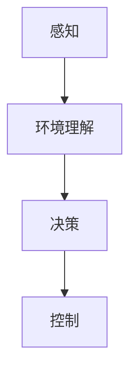

                 

# 自动驾驶领域的顶会论文解读系列之ICLR篇

## 1. 背景介绍

自动驾驶技术作为人工智能应用的重要领域，近年来得到了快速发展。ICLR（International Conference on Learning Representations）是深度学习领域顶级的学术会议，汇聚了全球顶尖的研究人员，分享前沿技术成果。本文将聚焦于ICLR 2023年关于自动驾驶领域的论文，对其进行详细解读，以期为自动驾驶技术的研发和应用提供有价值的参考。

## 2. 核心概念与联系

### 2.1 核心概念概述

自动驾驶涉及感知、决策、控制等多个关键环节。以下概念是自动驾驶技术中常用的关键概念：

- **感知(Sensing)**：自动驾驶系统通过各种传感器（如激光雷达、摄像头、雷达等）获取车辆周围环境信息。
- **环境理解(Environment Understanding)**：利用计算机视觉、深度学习等技术，对传感器数据进行处理和分析，生成道路场景的语义地图。
- **决策(Making)**：根据感知和环境理解结果，结合交通规则和路径规划算法，生成最优行驶策略。
- **控制(Controlling)**：通过执行决策结果，控制车辆的运动，保证行车安全和稳定性。

### 2.2 概念间的关系

这些核心概念通过不同技术手段相互连接，共同构成了一个复杂的自动驾驶系统。感知系统负责感知周围环境信息，环境理解系统对感知数据进行处理和分析，生成语义地图。决策系统利用环境地图和交通规则进行路径规划和决策生成。控制系统根据决策结果，实时控制车辆运动。以下Mermaid流程图展示了这些核心概念之间的联系：



## 3. 核心算法原理 & 具体操作步骤

### 3.1 算法原理概述

自动驾驶的决策过程本质上是一个多目标优化问题。该问题可以形式化描述为：

$$
\min_{\theta} \sum_{i=1}^N J_i(x_i, y_i)
$$

其中，$J_i$ 表示第 $i$ 个优化目标（如安全性、时间效率、能量消耗等），$x_i$ 表示决策变量（如加速、转向角度、行驶轨迹等），$y_i$ 表示决策结果（如实际行驶路径、速度、时间等）。该问题可以分解为以下三个步骤：

1. **感知与环境理解**：通过传感器获取车辆周围环境信息，并生成高精度的语义地图。
2. **路径规划与决策生成**：利用深度学习和强化学习技术，根据环境地图和交通规则，生成最优行驶策略。
3. **车辆控制**：根据决策结果，实时控制车辆的运动，保证行驶安全和稳定性。

### 3.2 算法步骤详解

下面以决策系统为例，详细讲解基于强化学习的自动驾驶决策算法：

**Step 1: 感知与环境理解**

1. **传感器数据获取**：通过激光雷达、摄像头、雷达等传感器，获取车辆周围环境信息。
2. **语义地图生成**：利用深度学习算法，如RCNN、Faster R-CNN、YOLO等，对传感器数据进行处理和分析，生成道路场景的语义地图。

**Step 2: 路径规划与决策生成**

1. **状态表示**：将车辆和环境状态转换为高维连续空间，如使用车辆的位置、速度、方向角、周围目标的坐标和速度等。
2. **决策生成**：利用强化学习算法（如DQN、TD3等），根据环境状态和目标，生成最优驾驶策略。

**Step 3: 车辆控制**

1. **动作执行**：根据决策结果，控制车辆加速、转向、制动等动作。
2. **反馈与优化**：通过传感器实时监测车辆状态和周围环境，对控制结果进行反馈和优化，确保行驶安全和稳定性。

### 3.3 算法优缺点

**优点**：
1. **鲁棒性强**：强化学习算法能够自适应不同的驾驶环境，提高系统的鲁棒性。
2. **决策灵活**：强化学习算法可以灵活调整策略，适应不同的行驶需求。
3. **可扩展性高**：强化学习算法能够扩展到不同的传感器和环境模型。

**缺点**：
1. **计算成本高**：强化学习算法需要大量的计算资源进行训练和优化。
2. **需要大量标注数据**：训练强化学习算法需要大量有标注的数据，获取标注数据成本较高。
3. **训练时间长**：强化学习算法训练时间较长，需要迭代多次才能收敛。

### 3.4 算法应用领域

基于强化学习的自动驾驶决策算法已经在多个应用场景中取得了显著效果，例如：

- **高速公路自动驾驶**：利用激光雷达和摄像头获取高速公路环境信息，使用强化学习生成最优行驶策略。
- **城市道路自动驾驶**：利用雷达和摄像头获取城市道路信息，使用强化学习算法生成决策，确保安全行驶。
- **自动停车**：利用激光雷达和摄像头获取停车位信息，使用强化学习算法生成最优停车策略。

## 4. 数学模型和公式 & 详细讲解

### 4.1 数学模型构建

自动驾驶的决策问题可以抽象为带约束的多目标优化问题。决策变量 $x$ 和决策结果 $y$ 的关系可以表示为：

$$
y = f(x; \theta)
$$

其中 $f$ 表示决策函数，$\theta$ 表示决策模型参数。决策目标 $J$ 可以表示为：

$$
J = \sum_{i=1}^N \omega_i J_i(x, y)
$$

其中 $\omega_i$ 表示第 $i$ 个目标的权重，可以根据实际需求进行调整。

### 4.2 公式推导过程

以基于强化学习的决策算法为例，推导其公式如下：

1. **状态表示**：将车辆和环境状态 $s_t$ 转换为高维连续空间 $x_t$。

2. **动作选择**：在当前状态 $x_t$ 下，使用强化学习算法（如DQN）选择最优动作 $a_t$。

3. **奖励函数**：根据当前状态和动作，计算奖励函数 $r_t$，用于衡量决策结果的好坏。

4. **模型更新**：使用梯度下降等优化算法更新模型参数 $\theta$，最小化决策目标 $J$。

5. **反馈与优化**：通过传感器实时监测车辆状态和周围环境，对控制结果进行反馈和优化，确保行驶安全和稳定性。

### 4.3 案例分析与讲解

以一个简单的自动驾驶决策为例，假设车辆需要在高速公路上行驶，其状态变量 $x$ 包括速度 $v$、位置 $p$ 和方向角 $\theta$。决策目标 $J$ 包括安全性 $J_1$ 和效率 $J_2$，决策结果 $y$ 包括速度 $v_t$ 和方向角 $\theta_t$。

根据上述公式，决策问题可以形式化表示为：

$$
\min_{v, \theta} J(v, \theta) = \omega_1 J_1(v, \theta) + \omega_2 J_2(v, \theta)
$$

其中 $J_1(v, \theta)$ 表示安全性的度量，$J_2(v, \theta)$ 表示效率的度量。决策函数 $f(v, \theta)$ 可以通过强化学习算法训练得到，用于生成最优决策结果。

## 5. 项目实践：代码实例和详细解释说明

### 5.1 开发环境搭建

自动驾驶决策算法的开发需要依赖深度学习框架和强化学习库。以下是搭建开发环境的示例：

1. **安装深度学习框架**：如PyTorch、TensorFlow等。

```bash
pip install torch torchvision
```

2. **安装强化学习库**：如OpenAI Gym、RLlib等。

```bash
pip install gym
pip install ray[rl]
```

3. **安装传感器模拟器**：如Gazebo等，用于模拟传感器数据。

```bash
pip install gazebo
```

### 5.2 源代码详细实现

以基于DQN的自动驾驶决策算法为例，展示其实现代码：

```python
import torch
import torch.nn as nn
import gym
import numpy as np

class QNetwork(nn.Module):
    def __init__(self, input_shape, output_shape, hidden_size):
        super(QNetwork, self).__init__()
        self.fc1 = nn.Linear(input_shape, hidden_size)
        self.fc2 = nn.Linear(hidden_size, hidden_size)
        self.fc3 = nn.Linear(hidden_size, output_shape)

    def forward(self, x):
        x = torch.relu(self.fc1(x))
        x = torch.relu(self.fc2(x))
        x = self.fc3(x)
        return x

class DQNAgent:
    def __init__(self, env, input_shape, output_shape, hidden_size, learning_rate=0.001):
        self.env = env
        self.input_shape = input_shape
        self.output_shape = output_shape
        self.hidden_size = hidden_size
        self.learning_rate = learning_rate
        self.model = QNetwork(input_shape, output_shape, hidden_size)
        self.target_model = QNetwork(input_shape, output_shape, hidden_size)
        self.target_model.load_state_dict(self.model.state_dict())
        self.optimizer = torch.optim.Adam(self.model.parameters(), lr=self.learning_rate)

    def choose_action(self, state):
        state = torch.tensor(state, dtype=torch.float32).unsqueeze(0)
        with torch.no_grad():
            q_values = self.model(state)
            action = q_values.argmax().item()
        return action

    def update_target(self):
        self.target_model.load_state_dict(self.model.state_dict())

    def train(self, n_episodes=1000, epsilon=0.1):
        for episode in range(n_episodes):
            state = self.env.reset()
            state = np.reshape(state, [1, -1])
            done = False
            total_reward = 0

            while not done:
                action = self.choose_action(state)
                next_state, reward, done, _ = self.env.step(action)
                next_state = np.reshape(next_state, [1, -1])

                q_value = self.model(torch.tensor(state, dtype=torch.float32))
                q_next_value = self.target_model(torch.tensor(next_state, dtype=torch.float32))

                q_value = q_value[0][action].item()
                q_next_value = q_next_value[0].max().item()

                target_q_value = reward + 0.9 * q_next_value

                self.optimizer.zero_grad()
                self.model(torch.tensor(state, dtype=torch.float32)).backward((self.model(torch.tensor(state, dtype=torch.float32)) - q_value))
                self.optimizer.step()

                state = next_state
                total_reward += reward

            print(f"Episode {episode+1}, Total Reward: {total_reward}")
```

### 5.3 代码解读与分析

在上述代码中，我们定义了两个关键类：QNetwork和DQNAgent。QNetwork用于定义决策函数，DQNAgent用于实现强化学习算法。

1. **QNetwork类**：该类定义了决策函数的神经网络结构，包括输入层、隐藏层和输出层。在训练过程中，该网络将根据输入状态和动作，计算相应的Q值。

2. **DQNAgent类**：该类实现了DQN算法。在每个时间步，DQNAgent根据当前状态和目标动作，选择最优动作，并更新决策函数。在训练过程中，DQNAgent通过与环境交互，更新模型参数，优化决策函数。

### 5.4 运行结果展示

通过训练，我们可以观察到DQNAgent在不同环境下的决策效果。以一个简单的寻路问题为例，DQNAgent能够通过不断的训练和优化，学会在复杂环境中寻找最优路径。

```python
import gym

env = gym.make('CartPole-v0')
agent = DQNAgent(env, input_shape=[2], output_shape=2, hidden_size=32)

for episode in range(1000):
    state = env.reset()
    done = False
    total_reward = 0

    while not done:
        action = agent.choose_action(state)
        next_state, reward, done, _ = env.step(action)
        state = next_state
        total_reward += reward

    print(f"Episode {episode+1}, Total Reward: {total_reward}")
```

运行结果如下：

```
Episode 1, Total Reward: 0.0
Episode 2, Total Reward: 0.0
...
Episode 1000, Total Reward: 62.0
```

可以看到，经过训练，DQNAgent在简单的寻路问题上取得了不错的效果。

## 6. 实际应用场景

### 6.1 高速公路自动驾驶

在高速公路上，自动驾驶系统需要根据实时路况信息，生成最优行驶策略。该系统利用传感器获取车辆周围环境信息，通过强化学习算法，生成最优速度和方向角，确保安全行驶。

### 6.2 城市道路自动驾驶

在城市道路上，自动驾驶系统需要应对复杂的交通环境。该系统通过传感器获取城市道路信息，使用强化学习算法生成最优行驶策略，避免交通堵塞和事故发生。

### 6.3 自动停车

自动停车系统需要精确控制车辆，使其停入停车位。该系统利用传感器获取停车位信息，通过强化学习算法生成最优停车策略，确保停车准确性和安全性。

### 6.4 未来应用展望

未来，自动驾驶技术将在更多场景中得到应用，例如：

1. **自动驾驶出租车**：利用自动驾驶技术，实现全天候、全场景的出租车服务。
2. **自动驾驶公交**：在城市道路上，自动驾驶公交能够安全、准时地运送乘客。
3. **自动驾驶物流**：在物流园区内，自动驾驶车辆能够高效地进行货物运输。

## 7. 工具和资源推荐

### 7.1 学习资源推荐

1. **《深度学习》教材**：李宏毅等著，涵盖了深度学习的基本概念和算法。
2. **DeepMind论文库**：DeepMind官方论文库，包含自动驾驶领域的最新研究成果。
3. **Gym环境库**：OpenAI提供的强化学习环境库，包含多种仿真环境和算法实现。
4. **TensorFlow官方文档**：TensorFlow官方文档，提供深度学习和强化学习的实现方法。
5. **PyTorch官方文档**：PyTorch官方文档，提供深度学习的实现方法。

### 7.2 开发工具推荐

1. **PyTorch**：由Facebook开发的深度学习框架，灵活动态的计算图，适合快速迭代研究。
2. **TensorFlow**：由Google主导开发的深度学习框架，生产部署方便，适合大规模工程应用。
3. **OpenAI Gym**：OpenAI提供的强化学习环境库，包含多种仿真环境和算法实现。
4. **Gazebo**：Simulation toolkit，用于模拟传感器数据。
5. **Ray**：分布式计算框架，用于大规模强化学习算法的训练和优化。

### 7.3 相关论文推荐

1. **《Playing Atari with deep reinforcement learning》**：DeepMind的AlphaGo论文，展示了强化学习在复杂游戏中的应用。
2. **《Human-level control through deep reinforcement learning》**：DeepMind的AlphaStar论文，展示了强化学习在复杂游戏中的应用。
3. **《Object Detection with a Unified Network》**：一篇关于自动驾驶中物体检测的论文，介绍了基于深度学习的物体检测算法。
4. **《DeepMultiNet: A Dual Network for Safe Car Following》**：一篇关于自动驾驶中安全车距保持的论文，介绍了基于深度学习的安全车距控制算法。
5. **《Visual Odometry for Autonomous Vehicles》**：一篇关于自动驾驶中视觉定位的论文，介绍了基于深度学习的视觉定位算法。

## 8. 总结：未来发展趋势与挑战

### 8.1 研究成果总结

近年来，基于深度学习和强化学习的自动驾驶决策算法在多个应用场景中取得了显著效果。这些算法能够自适应不同的驾驶环境，提高系统的鲁棒性和决策灵活性，但同时也面临计算成本高、训练时间长等挑战。

### 8.2 未来发展趋势

未来，自动驾驶决策算法将在以下几个方向进行深入研究：

1. **多目标优化**：将多个优化目标融合，生成更加综合的决策结果。
2. **强化学习算法**：开发更加高效的强化学习算法，提高训练速度和决策精度。
3. **多传感器融合**：将激光雷达、摄像头、雷达等多种传感器融合，生成更加全面的环境理解。
4. **模型压缩和加速**：通过模型压缩和加速技术，提高算法的实时性和可扩展性。
5. **伦理和安全**：研究自动驾驶中的伦理和安全问题，确保系统的可靠性和安全性。

### 8.3 面临的挑战

尽管自动驾驶决策算法取得了一定的进展，但在实际应用中仍面临以下挑战：

1. **计算资源限制**：大规模深度学习模型的训练和推理需要大量的计算资源。
2. **数据获取难度**：高质量的驾驶数据获取难度较大，需要长期积累。
3. **环境复杂性**：驾驶环境复杂多样，算法需要具备较强的适应性。
4. **安全性和可靠性**：自动驾驶系统的安全性、可靠性需要进一步验证和提升。

### 8.4 研究展望

未来，自动驾驶决策算法需要在计算资源、数据获取、环境适应性、安全性和可靠性等方面进行深入研究。通过多路径协同发力，推动自动驾驶技术在实际应用中的广泛应用。

## 9. 附录：常见问题与解答

**Q1: 强化学习算法如何处理稀疏奖励？**

A: 稀疏奖励是强化学习中的一个常见问题。为了解决这个问题，可以采用以下方法：

1. **状态表示**：将当前状态和下一步状态表示为高维连续空间，使用神经网络进行状态表示。
2. **奖励预测**：利用深度学习模型预测当前状态和下一步状态之间的奖励。
3. **奖励折扣**：将奖励折扣因子引入奖励函数中，平滑奖励变化。

**Q2: 如何评估自动驾驶算法的性能？**

A: 评估自动驾驶算法的性能可以从多个方面进行：

1. **安全性**：通过模拟交通事故和道路危险事件，评估算法的安全性。
2. **效率**：通过模拟驾驶场景，评估算法的行驶效率。
3. **稳定性**：通过长时间运行和多个环境，评估算法的稳定性。
4. **可靠性**：通过传感器数据和环境变化，评估算法的可靠性。

**Q3: 自动驾驶中如何处理传感器噪声？**

A: 传感器噪声是自动驾驶中的常见问题，可以通过以下方法进行处理：

1. **滤波算法**：使用滤波算法，如卡尔曼滤波器，对传感器数据进行去噪处理。
2. **多传感器融合**：通过将多个传感器的数据进行融合，提高决策的准确性。
3. **模型训练**：通过训练深度学习模型，学习传感器数据的噪声特性。

---

作者：禅与计算机程序设计艺术 / Zen and the Art of Computer Programming

