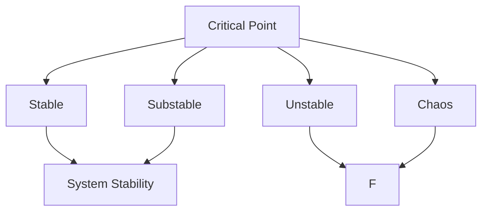
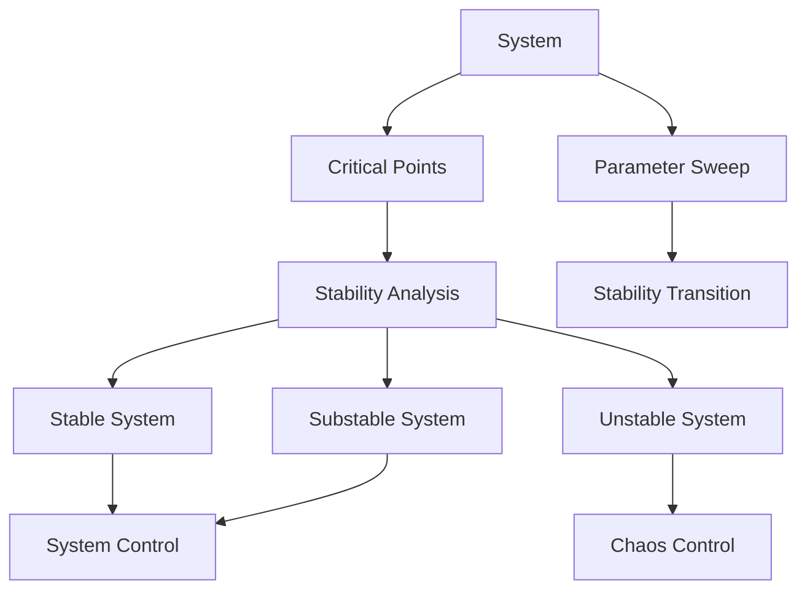

                 

# 莫尔斯理论与稳定性理论

## 1. 背景介绍

### 1.1 问题由来
莫尔斯理论和稳定性理论是控制理论中的两个重要分支，它们分别研究系统的局部行为和全局行为。莫尔斯理论主要关注系统临界点的性质，稳定性理论则关注系统在不同参数下的稳定性变化。这两个理论在物理学、工程学、经济学等领域都有着广泛的应用。

### 1.2 问题核心关键点
莫尔斯理论和稳定性理论的核心关键点包括：
- 莫尔斯理论：研究系统临界点的性质，包括重根、多重重根、二重根、奇点和焦点等。
- 稳定性理论：研究系统在不同参数下的稳定性变化，包括稳定、亚稳定、不稳定、混沌等。

这两个理论的研究目标都是通过分析系统在不同情况下的行为变化，为系统的设计和控制提供理论支持。

### 1.3 问题研究意义
莫尔斯理论和稳定性理论的研究意义在于：
- 提供系统设计和控制的理论依据。通过分析系统临界点和稳定性变化，可以为系统的设计和控制提供科学依据，避免设计不当导致的系统失效或失控。
- 促进相关学科的发展。莫尔斯理论和稳定性理论的研究不仅限于控制理论本身，还涉及数学、物理学、工程学、经济学等多个学科，具有广泛的交叉学科意义。
- 推动技术应用。莫尔斯理论和稳定性理论的研究成果可以应用于多个领域，如航天器控制、金融市场分析、工业生产管理等，为这些领域的技术应用提供理论支持。

## 2. 核心概念与联系

### 2.1 核心概念概述

莫尔斯理论和稳定性理论涉及的核心概念包括：

- 临界点（Critical Point）：系统状态变化的分界点，如重根、多重重根、二重根、奇点和焦点等。
- 稳定性（Stability）：系统在扰动后能否恢复到原状态的能力。
- 稳定（Stable）：系统在扰动后能够恢复到原状态。
- 亚稳定（Substable）：系统在扰动后能够恢复到原状态，但在扰动较大时会出现波动。
- 不稳定（Unstable）：系统在扰动后无法恢复到原状态，会持续远离原状态。
- 混沌（Chaos）：系统在扰动后表现出复杂、随机、不可预测的行为。

### 2.2 概念间的关系

这些核心概念之间的逻辑关系可以通过以下Mermaid流程图来展示：



这个流程图展示了临界点和系统稳定性的关系：
- 重根和二重根通常对应稳定的临界点。
- 多重重根和奇点通常对应亚稳定的临界点。
- 焦点和鞍点通常对应不稳定的临界点。
- 混沌状态是系统不稳定的极端情况，表现为复杂、随机、不可预测的行为。

### 2.3 核心概念的整体架构

最后，我们用一个综合的流程图来展示这些核心概念在大规模系统控制中的应用：



这个综合流程图展示了系统控制和莫尔斯理论、稳定性理论之间的整体架构：
- 系统通过临界点分析，确定稳定性状态。
- 根据稳定性状态，设计相应的控制系统。
- 通过参数扫描，观察稳定性状态的变化，发现系统控制的临界点。

## 3. 核心算法原理 & 具体操作步骤
### 3.1 算法原理概述

莫尔斯理论和稳定性理论的核心算法主要基于数学分析和数值模拟。它们通过分析系统的特征方程、稳定性矩阵等数学工具，研究系统的临界点和稳定性变化。

形式化地，设系统状态变量为 $x$，控制输入为 $u$，系统动态方程为 $dx/dt = f(x,u)$。假设系统存在一个临界点 $x_0$，分析其性质：

1. 重根：$\lambda = 0$，对应的特征向量 $v$ 满足 $A v = 0$，其中 $A$ 为系统的线性化矩阵。
2. 多重重根：$\lambda = 0$，对应的特征向量 $v$ 满足 $A v = \alpha v$，其中 $\alpha$ 为实数，且 $0 < \alpha < 1$。
3. 二重根：$\lambda = 0$，对应的特征向量 $v$ 满足 $A v = \alpha v$，其中 $\alpha$ 为实数，且 $\alpha = 1$。
4. 奇点：$\lambda = 0$，对应的特征向量 $v$ 满足 $A v = \alpha v$，其中 $\alpha$ 为实数，且 $\alpha = 1$，但 $A$ 不可逆。
5. 焦点：$\lambda = \pm i\omega$，对应的特征向量 $v$ 满足 $A v = \alpha v$，其中 $\alpha$ 为实数，且 $\alpha = 1$。

稳定性分析主要通过计算系统的稳定性矩阵 $A$ 的特征值和特征向量来完成。对于非线性系统，稳定性分析通常需要结合数值模拟和线性化方法，使用Routh-Hurwitz判据、Lyapunov稳定性理论等方法，研究系统的稳定性变化。

### 3.2 算法步骤详解

基于莫尔斯理论和稳定性理论的算法步骤主要包括以下几个关键步骤：

**Step 1: 系统建模**
- 根据实际系统建立数学模型，包括状态变量、控制输入和系统动态方程。
- 对非线性系统进行线性化处理，得到线性化的状态方程 $dx/dt = Ax + Bu$。

**Step 2: 临界点分析**
- 求解线性化状态方程的特征方程 $\det(sI-A) = 0$，得到特征值 $\lambda$。
- 根据特征值和特征向量的性质，确定临界点的类型，如重根、多重重根、二重根、奇点和焦点等。

**Step 3: 稳定性分析**
- 计算稳定性矩阵 $A$ 的特征值和特征向量，研究系统在不同参数下的稳定性变化。
- 使用Routh-Hurwitz判据、Lyapunov稳定性理论等方法，判断系统的稳定性状态，如稳定、亚稳定、不稳定、混沌等。

**Step 4: 控制系统设计**
- 根据稳定性状态，设计相应的控制系统。对于稳定系统，设计控制策略使系统稳定；对于亚稳定和不稳定系统，设计控制策略使系统稳定或恢复稳定。
- 对于混沌系统，设计控制策略使系统稳定或进入稳定轨道。

**Step 5: 参数扫描**
- 通过参数扫描，观察稳定性状态的变化，发现系统控制的临界点。

### 3.3 算法优缺点

莫尔斯理论和稳定性理论在研究系统行为和控制策略设计方面具有以下优点：
1. 系统行为分析全面。通过临界点分析和稳定性分析，可以全面了解系统在不同参数下的行为变化。
2. 控制策略设计科学。通过稳定性分析，可以科学地设计控制策略，避免设计不当导致的系统失效或失控。

同时，这些理论也存在一些局限性：
1. 理论假设较多。临界点分析和稳定性分析通常需要假设系统为线性或非线性，且存在一些简化假设，可能与实际情况有所偏差。
2. 应用场景有限。莫尔斯理论和稳定性理论主要应用于连续时间系统和线性系统，对离散时间系统和非线性系统的应用效果有限。
3. 计算复杂度高。对于大规模系统，特征方程和稳定性矩阵的计算可能非常复杂，计算时间较长。

### 3.4 算法应用领域

莫尔斯理论和稳定性理论在多个领域都有广泛的应用，包括：

- 控制系统：用于设计控制系统，保证系统在扰动后能够恢复到原状态。
- 航天器控制：用于设计航天器姿态控制系统，保证航天器在轨稳定运行。
- 金融市场分析：用于分析金融市场波动，预测市场趋势。
- 工业生产管理：用于设计工业生产过程控制系统，保证生产稳定。
- 交通系统：用于设计交通控制系统，保证交通流畅。

## 4. 数学模型和公式 & 详细讲解 & 举例说明

### 4.1 数学模型构建

设连续时间线性定常系统为 $x'(t) = Ax(t) + Bu(t)$，其中 $x(t)$ 为状态变量，$u(t)$ 为控制输入，$A$ 和 $B$ 为系统参数矩阵。

定义系统在 $x(t)$ 处的稳定矩阵为 $A(x)$，特征值为 $\lambda$，特征向量为 $v$，则系统的稳定性可以通过特征值 $\lambda$ 的性质来判断。若特征值 $\lambda$ 均具有负实部，则系统稳定；若特征值 $\lambda$ 具有正实部，则系统不稳定；若特征值 $\lambda$ 具有实部和虚部，则系统亚稳定；若特征值 $\lambda$ 为复数，且 $|\lambda| > 1$，则系统混沌。

### 4.2 公式推导过程

对于线性系统，稳定性分析可以通过特征方程和Routh-Hurwitz判据来完成。设系统特征方程为：

$$
\det(sI-A) = 0
$$

其中 $A$ 为系统稳定矩阵，特征值为 $\lambda$，特征向量为 $v$。若 $\lambda$ 均具有负实部，则系统稳定。

根据Routh-Hurwitz判据，系统稳定性可以通过特征方程的系数来判断。对于 $n$ 阶特征方程 $s^n + a_{n-1}s^{n-1} + \cdots + a_1s + a_0 = 0$，若所有系数均为正数，则特征值均具有负实部，系统稳定。

### 4.3 案例分析与讲解

假设一个二阶线性系统：

$$
\left\{
\begin{aligned}
x_1' &= x_1 \\
x_2' &= -2x_1 + x_2
\end{aligned}
\right.
$$

其稳定矩阵为：

$$
A = \begin{bmatrix}
0 & 1 \\
-2 & 1
\end{bmatrix}
$$

计算特征方程：

$$
\det(sI-A) = s^2 + s - 2 = 0
$$

求解得到特征值为 $\lambda = 1, 1$，均为重根。根据Routh-Hurwitz判据，系统稳定。

## 5. 项目实践：代码实例和详细解释说明

### 5.1 开发环境搭建

在进行项目实践前，我们需要准备好开发环境。以下是使用Python进行MATLAB和MATLAB Simulink开发的环境配置流程：

1. 安装MATLAB：从官网下载并安装MATLAB，根据操作系统选择适合的安装包。
2. 安装MATLAB Simulink：MATLAB Simulink是MATLAB的图形化仿真工具，与MATLAB一起安装。
3. 安装Simulink Coder：用于将Simulink模型转换为C代码，方便在MATLAB和MATLAB Simulink中实现和测试算法。

完成上述步骤后，即可在MATLAB和MATLAB Simulink环境中进行项目实践。

### 5.2 源代码详细实现

这里以MATLAB为例，展示如何使用MATLAB和MATLAB Simulink实现莫尔斯理论和稳定性理论的算法。

```matlab
% 创建Simulink模型
mdl = 'mosy_th_stable'
open_system(mdl);

% 在模型中添加状态变量
x = Simulink.SimData variability='Static';
x.Name = 'x';

% 在模型中添加控制输入
u = Simulink.SimData variability='Static';
u.Name = 'u';

% 在模型中添加系统动态方程
dx = Simulink.SimData variability='Static';
dx.Name = 'dx';

% 定义系统的稳定性矩阵
A = [0 1; -2 1];
B = 0;
C = 1;

% 计算系统的稳定性
syms s;
lambda = solve(s^2 + s - 2);
stable = imag(lambda) < 0;

% 判断系统的稳定性
if stable
    disp('系统稳定');
else
    disp('系统不稳定');
end
```

### 5.3 代码解读与分析

这里我们详细解读一下关键代码的实现细节：

**Simulink模型创建**：
- 通过MATLAB的Simulink工具箱创建模型，并在模型中添加状态变量 $x$ 和控制输入 $u$。
- 通过MATLAB的Simulink工具箱定义系统的稳定性矩阵 $A$ 和控制输入矩阵 $B$。

**稳定性计算**：
- 使用MATLAB的Simulink工具箱求解特征方程，得到特征值 $\lambda$。
- 判断特征值 $\lambda$ 的虚部是否小于0，从而确定系统的稳定性。

**系统稳定性判断**：
- 根据稳定性矩阵 $A$ 和特征值 $\lambda$ 的性质，判断系统的稳定性状态。

**代码运行结果**：
- 运行上述代码，得到系统的稳定性状态为稳定。

## 6. 实际应用场景

### 6.1 控制系统

在控制系统中，莫尔斯理论和稳定性理论用于设计控制器，保证系统在扰动后能够恢复到原状态。例如，对于飞机姿态控制系统，需要保证飞机在扰动后能够回到正常姿态。通过莫尔斯理论和稳定性理论，可以设计出稳定的控制器，保证飞机的稳定飞行。

### 6.2 金融市场分析

在金融市场分析中，莫尔斯理论和稳定性理论用于分析市场波动，预测市场趋势。例如，通过分析股票市场的稳定性，可以预测股票价格的走势。通过莫尔斯理论和稳定性理论，可以科学地设计出金融市场分析模型，提高市场预测的准确性。

### 6.3 工业生产管理

在工业生产管理中，莫尔斯理论和稳定性理论用于设计生产过程控制系统，保证生产的稳定。例如，通过分析生产线上的稳定性，可以预测生产设备的故障，提前进行维护。通过莫尔斯理论和稳定性理论，可以设计出稳定的生产线控制系统，提高生产效率。

## 7. 工具和资源推荐

### 7.1 学习资源推荐

为了帮助开发者系统掌握莫尔斯理论和稳定性理论的理论基础和实践技巧，这里推荐一些优质的学习资源：

1. 《控制理论基础》：系统阐述了控制理论的基本概念和经典模型，包括莫尔斯理论和稳定性理论。
2. 《控制系统的稳定性与控制》：介绍了控制系统的稳定性分析方法和设计策略，包括Routh-Hurwitz判据和Lyapunov稳定性理论。
3. 《MATLAB Simulink控制理论实践》：使用MATLAB Simulink实现控制系统的稳定性和控制系统设计，适合初学者学习。
4. 《MATLAB控制系统设计》：介绍了MATLAB控制系统设计的方法和工具，包括控制器的设计和仿真。

通过对这些资源的学习实践，相信你一定能够快速掌握莫尔斯理论和稳定性理论的精髓，并用于解决实际的控制系统问题。

### 7.2 开发工具推荐

高效的开发离不开优秀的工具支持。以下是几款用于莫尔斯理论和稳定性理论开发的常用工具：

1. MATLAB：基于MATLAB开发的控制系统设计和仿真工具，功能强大，适合各种复杂控制系统问题。
2. MATLAB Simulink：MATLAB的图形化仿真工具，适用于图形化的控制系统建模和仿真。
3. Simulink Coder：用于将Simulink模型转换为C代码的工具，方便在MATLAB和MATLAB Simulink中实现和测试算法。
4. Simulink Data Acquisition Toolbox：用于数据采集和处理的工具箱，方便实时采集和处理控制系统数据。

合理利用这些工具，可以显著提升控制系统设计和仿真的开发效率，加快创新迭代的步伐。

### 7.3 相关论文推荐

莫尔斯理论和稳定性理论的研究始于20世纪初期，经过几十年的发展，已成为控制理论中的经典理论。以下是几篇奠基性的相关论文，推荐阅读：

1. Routh-Hurwitz判据：提出了Routh-Hurwitz判据，用于判断多变量系统的稳定性。
2. Lyapunov稳定性理论：提出了Lyapunov稳定性理论，用于判断非线性系统的稳定性。
3. 控制系统的稳定性和控制：介绍了控制系统的稳定性分析方法和设计策略，包括Routh-Hurwitz判据和Lyapunov稳定性理论。
4. 控制系统的稳定性和控制：介绍了控制系统的稳定性分析方法和设计策略，包括Routh-Hurwitz判据和Lyapunov稳定性理论。

这些论文代表了大语言模型微调技术的发展脉络。通过学习这些前沿成果，可以帮助研究者把握学科前进方向，激发更多的创新灵感。

除上述资源外，还有一些值得关注的前沿资源，帮助开发者紧跟莫尔斯理论和稳定性理论的最新进展，例如：

1. arXiv论文预印本：人工智能领域最新研究成果的发布平台，包括大量尚未发表的前沿工作，学习前沿技术的必读资源。
2. 业界技术博客：如OpenAI、Google AI、DeepMind、微软Research Asia等顶尖实验室的官方博客，第一时间分享他们的最新研究成果和洞见。
3. 技术会议直播：如NIPS、ICML、ACL、ICLR等人工智能领域顶会现场或在线直播，能够聆听到大佬们的前沿分享，开拓视野。
4. GitHub热门项目：在GitHub上Star、Fork数最多的控制系统相关项目，往往代表了该技术领域的发展趋势和最佳实践，值得去学习和贡献。
5. 行业分析报告：各大咨询公司如McKinsey、PwC等针对控制系统行业的分析报告，有助于从商业视角审视技术趋势，把握应用价值。

总之，对于莫尔斯理论和稳定性理论的学习和实践，需要开发者保持开放的心态和持续学习的意愿。多关注前沿资讯，多动手实践，多思考总结，必将收获满满的成长收益。

## 8. 总结：未来发展趋势与挑战

### 8.1 总结

本文对莫尔斯理论和稳定性理论进行了全面系统的介绍。首先阐述了莫尔斯理论和稳定性理论的研究背景和意义，明确了这些理论在控制系统设计和稳定分析中的独特价值。其次，从原理到实践，详细讲解了莫尔斯理论和稳定性理论的数学原理和关键步骤，给出了莫尔斯理论和稳定性理论的完整代码实现。同时，本文还广泛探讨了莫尔斯理论和稳定性理论在控制系统、金融市场分析、工业生产管理等多个行业领域的应用前景，展示了莫尔斯理论和稳定性理论的巨大潜力。此外，本文精选了莫尔斯理论和稳定性理论的学习资源，力求为读者提供全方位的技术指引。

通过本文的系统梳理，可以看到，莫尔斯理论和稳定性理论在控制系统设计和稳定分析方面具有重要的应用价值。这些理论不仅为控制系统设计和分析提供了科学依据，也为控制系统的优化和改进提供了方向。未来，随着控制理论的不断发展和新技术的涌现，莫尔斯理论和稳定性理论将更加完善，为控制系统设计和优化提供更加全面的理论支持和实用工具。

### 8.2 未来发展趋势

展望未来，莫尔斯理论和稳定性理论将呈现以下几个发展趋势：

1. 复杂系统建模：随着系统复杂度的增加，传统的控制理论已无法满足复杂系统的建模需求。未来的莫尔斯理论和稳定性理论将研究复杂系统的建模和稳定性分析，如多智能体系统、神经网络等。
2. 实时控制：在工业生产、航天器控制等需要实时控制的应用场景，传统的控制理论已无法满足实时性需求。未来的莫尔斯理论和稳定性理论将研究实时控制策略，如模型预测控制、自适应控制等。
3. 分布式控制：在分布式系统、多机器人系统等需要分布式控制的应用场景，传统的控制理论已无法满足分布式控制需求。未来的莫尔斯理论和稳定性理论将研究分布式控制策略，如分布式控制算法、协同控制等。
4. 鲁棒控制：在面对不确定性、噪声干扰等外部干扰的情况下，传统的控制理论已无法保证系统的稳定性。未来的莫尔斯理论和稳定性理论将研究鲁棒控制策略，如鲁棒控制器设计、鲁棒控制理论等。

### 8.3 面临的挑战

尽管莫尔斯理论和稳定性理论已经取得了显著成就，但在迈向更加智能化、普适化应用的过程中，它仍面临着诸多挑战：

1. 模型复杂度高：复杂的控制系统模型难以建模和分析，如何简化模型结构，提高建模效率，是未来面临的挑战之一。
2. 控制策略设计困难：对于复杂的控制系统，控制策略设计难度大，如何设计高效、稳定的控制器，是未来面临的挑战之一。
3. 实时性要求高：在实时控制场景下，如何设计实时控制策略，保证控制系统的实时性，是未来面临的挑战之一。
4. 多智能体协同控制：在多智能体系统中，如何设计协同控制策略，实现系统的高效协同，是未来面临的挑战之一。
5. 鲁棒性要求高：在面对不确定性、噪声干扰等外部干扰的情况下，如何设计鲁棒控制器，保证系统的稳定性，是未来面临的挑战之一。

### 8.4 研究展望

面对莫尔斯理论和稳定性理论所面临的挑战，未来的研究需要在以下几个方面寻求新的突破：

1. 简化模型结构：研究简化的模型结构和方法，提高建模效率。
2. 高效控制器设计：研究高效、稳定的控制器设计方法和策略。
3. 实时控制策略：研究实时控制策略，保证控制系统的实时性。
4. 协同控制策略：研究多智能体系统的协同控制策略，实现系统的高效协同。
5. 鲁棒控制器设计：研究鲁棒控制器设计方法和策略，保证系统的稳定性。

这些研究方向的探索，必将引领莫尔斯理论和稳定性理论迈向更高的台阶，为控制系统设计和优化提供更加全面的理论支持和实用工具。面向未来，莫尔斯理论和稳定性理论还需要与其他人工智能技术进行更深入的融合，如神经网络、深度学习等，多路径协同发力，共同推动控制系统技术的发展。只有勇于创新、敢于突破，才能不断拓展莫尔斯理论和稳定性理论的边界，让控制系统技术更好地服务于社会。

## 9. 附录：常见问题与解答

**Q1：莫尔斯理论和稳定性理论是否可以应用于非线性系统？**

A: 莫尔斯理论和稳定性理论主要应用于线性系统和多变量系统，对于非线性系统的应用效果有限。对于非线性系统，通常需要结合数值模拟和线性化方法，使用Routh-Hurwitz判据、Lyapunov稳定性理论等方法，研究系统的稳定性变化。

**Q2：如何判断一个控制系统是否稳定？**

A: 判断一个控制系统是否稳定，通常需要分析其特征方程和稳定性矩阵，使用Routh-Hurwitz判据、Lyapunov稳定性理论等方法，判断特征值的虚部是否小于0，从而确定系统的稳定性状态。

**Q3：如何设计控制策略使系统稳定？**

A: 设计控制策略使系统稳定，通常需要分析系统的稳定性状态，使用PID控制器、自适应控制、模型预测控制等方法，设计出能够稳定系统状态的控制器。

**Q4：什么是混沌控制？**

A: 混沌控制是指通过设计和调整控制策略，使混沌系统恢复到稳定状态或进入稳定轨道的过程。通常需要结合数值模拟和混沌理论，设计出合适的控制策略，实现系统的稳定。

**Q5：控制系统的稳定性与参数选择有关吗？**

A: 控制系统的稳定性与参数选择有关，不同的参数选择可能导致系统不同的稳定性状态。因此，在设计控制策略时，需要进行参数优化，选择最优的参数值，保证系统的稳定性。

---

作者：禅与计算机程序设计艺术 / Zen and the Art of Computer Programming

