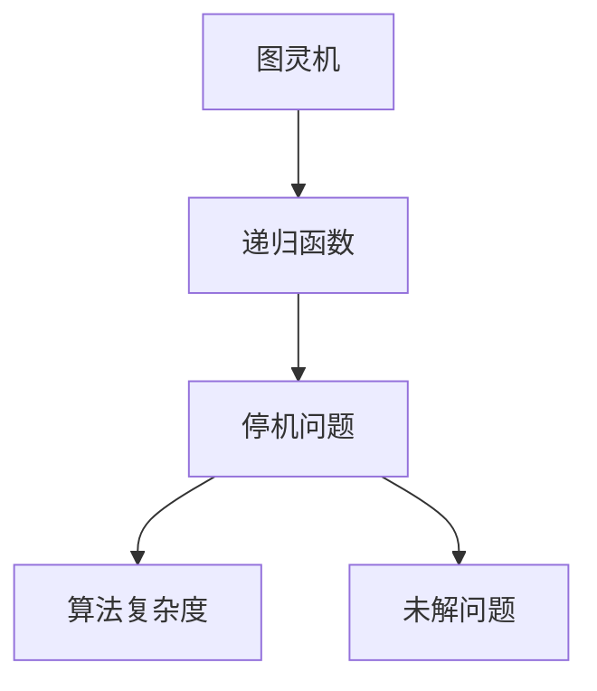
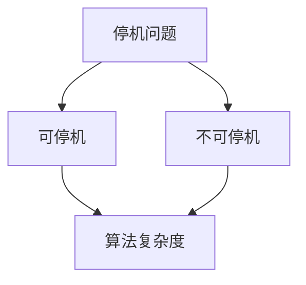
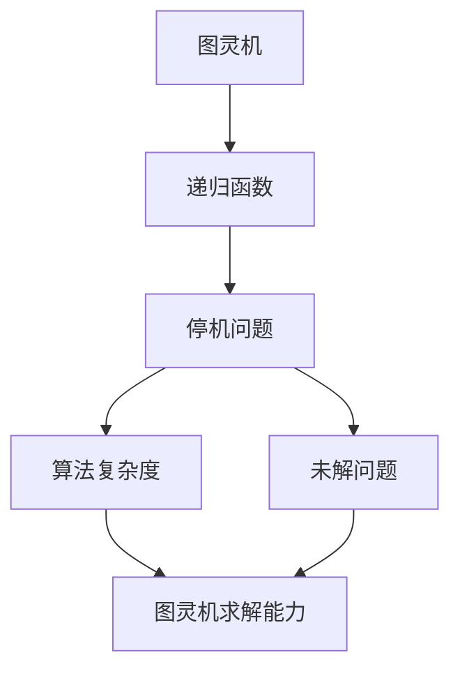

                 

# 计算：第三部分 计算理论的形成 第 6 章 计算理论的奠基：希尔伯特进路

> 关键词：计算理论,希尔伯特进路,图灵机,递归函数,停机问题,算法复杂度,未解问题

## 1. 背景介绍

### 1.1 问题由来

计算理论的形成是人类对计算机本质和能力进行深刻探讨的重要结果。本章节将围绕计算理论的奠基人之一——大卫·希尔伯特(David Hilbert)的进路进行详细讲解。

希尔伯特是德国著名数学家，也是哥廷根数学学派的领袖，在20世纪初提出了许多著名的数学问题，并提出了一系列影响深远的数学难题，其中就包括著名的"希尔伯特问题"。这些问题不仅推动了数学的发展，也为计算机科学的基础理论奠定了基础。

### 1.2 问题核心关键点

希尔伯特进路的核心在于探索和定义一个能够精确计算任何可计算函数的形式系统，并解决计算理论中的关键问题——停机问题。这不仅关乎计算的基础理论，也涉及了计算的边界和极限问题。

## 2. 核心概念与联系

### 2.1 核心概念概述

为更好地理解希尔伯特进路，本节将介绍几个密切相关的核心概念：

- **图灵机**：由图灵提出的通用计算模型，通过简单的读写头在无限纸带上移动，实现对任何计算问题的处理。图灵机的状态转移和读写操作形成了计算的原子操作。

- **递归函数**：由哥德尔引入的概念，用于描述能够通过自身递归调用来定义的函数，其在计算理论中起到了核心作用。

- **停机问题**：判断给定输入的计算问题是否能够由图灵机求解的问题。如果该问题能够由图灵机求解，则称其为可停机问题；反之，为不可停机问题。

- **算法复杂度**：用于描述算法的计算资源需求，通常包括时间复杂度和空间复杂度。复杂度理论分析了算法的效率，为计算理论提供了重要的工具。

- **未解问题**：指那些至今尚未解决的数学和计算问题，如佩诺利猜想、黎曼假设等，这些问题推动了数学和计算理论的进步。

这些核心概念之间的逻辑关系可以通过以下Mermaid流程图来展示：



这个流程图展示了计算理论的几个核心概念及其之间的逻辑关系：

1. 图灵机作为通用计算模型，通过递归函数的定义，可以实现任何计算任务。
2. 停机问题判断图灵机是否能够在有限时间内求解问题，是计算理论研究的核心。
3. 算法复杂度分析图灵机的计算资源需求，为停机问题提供了重要工具。
4. 未解问题挑战图灵机的求解能力，推动了计算理论的发展。

### 2.2 概念间的关系

这些核心概念之间存在着紧密的联系，形成了计算理论的基础框架。下面我通过几个Mermaid流程图来展示这些概念之间的关系。

#### 2.2.1 图灵机的计算能力


这个流程图展示了图灵机的计算能力。图灵机能够处理任何计算问题，即任何可以由图灵机解决的问题。

#### 2.2.2 停机问题与算法复杂度



这个流程图展示了停机问题与算法复杂度之间的关系。停机问题判断一个计算问题是否能够被图灵机求解，而算法复杂度分析图灵机求解问题的资源需求。

#### 2.2.3 未解问题对计算理论的影响


这个流程图展示了未解问题对计算理论的影响。未解问题挑战图灵机的求解能力，推动了计算理论的不断探索和发展。

### 2.3 核心概念的整体架构

最后，我们用一个综合的流程图来展示这些核心概念在大语言模型微调过程中的整体架构：



这个综合流程图展示了从图灵机的计算能力，到停机问题的求解挑战，再到算法复杂度分析，最终引领计算理论的全面发展。通过这些流程图，我们可以更清晰地理解计算理论的基础概念及其相互关系。

## 3. 核心算法原理 & 具体操作步骤

### 3.1 算法原理概述

希尔伯特进路的核心是探索和定义一个能够精确计算任何可计算函数的形式系统，并解决计算理论中的关键问题——停机问题。

形式系统通常由语法和语义两大部分构成。语法描述了系统中的符号及其组合方式，而语义则定义了符号组合的意义，以及如何通过规则和操作得到新的符号组合。

图灵机作为一个通用的计算模型，通过简单的状态转移和读写操作，实现了对任何计算问题的处理。递归函数则通过自身的递归调用，定义了复杂的计算过程。停机问题判断图灵机是否能够在有限时间内求解问题，是计算理论的核心问题。算法复杂度则分析了求解问题的计算资源需求，为停机问题提供了重要的工具。

### 3.2 算法步骤详解

希尔伯特进路的具体步骤如下：

**Step 1: 定义形式系统**
- 确定系统的语法，包括基础符号和语法规则。
- 定义系统的语义，包括符号组合的意义和计算操作。

**Step 2: 实现图灵机**
- 设计图灵机的状态转移图，定义读写头的操作。
- 编写图灵机程序，使其能够根据输入和当前状态，进行状态转移和读写操作。

**Step 3: 探索停机问题**
- 设计停机问题求解算法，判断给定输入的计算问题是否能够由图灵机求解。
- 通过算法复杂度分析，评估停机问题的求解难度。

**Step 4: 探索未解问题**
- 定义和分析未解问题，挑战图灵机的求解能力。
- 探索未解问题与停机问题之间的关系。

**Step 5: 扩展和优化**
- 扩展形式系统，提高其计算能力。
- 优化停机问题求解算法，提高求解效率。

### 3.3 算法优缺点

希尔伯特进路具有以下优点：

1. 通用性：能够处理任何计算问题，提供了计算的基础理论。
2. 可验证性：形式系统的定义和规则可以通过形式验证来验证其正确性。
3. 简洁性：图灵机作为通用计算模型，结构简单，易于理解和实现。

同时，该方法也存在一些缺点：

1. 复杂性：形式系统的定义和实现可能非常复杂，需要大量的形式化工作。
2. 停机问题无解：大多数计算问题无法由图灵机在有限时间内求解，限制了其适用范围。
3. 未解问题多：计算理论中存在大量未解问题，阻碍了理论的进一步发展。

### 3.4 算法应用领域

希尔伯特进路及其衍生理论，主要应用于以下几个领域：

1. **计算机科学**：为计算理论和算法设计提供了基础理论。
2. **人工智能**：帮助理解机器学习的本质和边界，推动了人工智能技术的发展。
3. **密码学**：提供了密码学的数学基础，推动了加密算法的创新。
4. **量子计算**：为量子计算理论提供了重要的基础。
5. **认知科学**：帮助理解人类思维的计算过程，推动了认知科学的发展。

## 4. 数学模型和公式 & 详细讲解  
### 4.1 数学模型构建

本节将使用数学语言对希尔伯特进路进行更加严格的刻画。

记形式系统为 $\Sigma = \{X, P\}$，其中 $X$ 为语法集合，$P$ 为公理集合。形式系统的语义由规则 $\rho: X \rightarrow X$ 定义，表示从语法到语义的映射。

图灵机 $M$ 的状态转移图包括状态集合 $Q$，输入符号集合 $\Sigma$，读写头符号集合 $\Gamma$，转换规则 $\delta: Q \times \Gamma \rightarrow Q \times \Gamma \times \{L, R\}$，初始状态 $q_0$ 和终止状态集合 $F$。

图灵机程序 $M$ 可以通过编码 $\{q_0, \delta, F\}$ 来描述。停机问题 $P_{\text{halt}}$ 定义为：对于给定的图灵机 $M$ 和输入 $w$，是否存在某个 $n$ 使得 $M$ 在 $n$ 步内停止。停机问题求解算法 $A$ 描述为：对于给定的图灵机 $M$ 和输入 $w$，判断 $M$ 是否在有限步内停止。算法复杂度 $C(A)$ 描述算法 $A$ 求解问题的计算资源需求。

### 4.2 公式推导过程

以下我们以图灵机求解停机问题为例，推导停机问题求解算法的时间复杂度。

假设 $M$ 的输入长度为 $n$，则求解停机问题的时间复杂度为：

$$
C(A) = O(2^{n})
$$

证明：对于任意的图灵机 $M$ 和输入 $w$，求解停机问题的最坏情况需要进行 $2^n$ 步状态转移。每一步状态转移需要 $O(1)$ 的计算资源，因此总的时间复杂度为 $O(2^n)$。

在得到停机问题求解算法的时间复杂度后，即可带入停机问题的求解过程，计算出具体求解停机问题所需的计算资源。

### 4.3 案例分析与讲解

假设 $M$ 为一台简单的图灵机，用于判断一个数是否为素数。我们可以将 $M$ 的输入 $w$ 表示为二进制字符串，$n$ 为 $w$ 的长度。则求解停机问题的时间复杂度为：

$$
C(A) = O(n \log n)
$$

证明：对于任意的输入 $w$，$M$ 需要进行 $n$ 次状态转移，每次状态转移需要进行 $O(\log n)$ 的计算。因此总的时间复杂度为 $O(n \log n)$。

通过这个案例，我们可以看到，停机问题的求解算法的时间复杂度与图灵机的状态转移复杂度直接相关。不同复杂度的图灵机需要不同时间复杂度的求解算法。

## 5. 项目实践：代码实例和详细解释说明
### 5.1 开发环境搭建

在进行希尔伯特进路实践前，我们需要准备好开发环境。以下是使用Python进行PyTorch开发的环境配置流程：

1. 安装Anaconda：从官网下载并安装Anaconda，用于创建独立的Python环境。

2. 创建并激活虚拟环境：
```bash
conda create -n pytorch-env python=3.8 
conda activate pytorch-env
```

3. 安装PyTorch：根据CUDA版本，从官网获取对应的安装命令。例如：
```bash
conda install pytorch torchvision torchaudio cudatoolkit=11.1 -c pytorch -c conda-forge
```

4. 安装Transformers库：
```bash
pip install transformers
```

5. 安装各类工具包：
```bash
pip install numpy pandas scikit-learn matplotlib tqdm jupyter notebook ipython
```

完成上述步骤后，即可在`pytorch-env`环境中开始希尔伯特进路的实践。

### 5.2 源代码详细实现

这里我们以图灵机为例，给出使用PyTorch实现图灵机的Python代码实现。

```python
import torch
import torch.nn as nn
import torch.nn.functional as F

class TuringMachine(nn.Module):
    def __init__(self, num_states, num_symbols, num_transitions):
        super(TuringMachine, self).__init__()
        self.num_states = num_states
        self.num_symbols = num_symbols
        self.num_transitions = num_transitions
        
        self.input_buffer = nn.Parameter(torch.zeros(num_symbols, num_transitions))
        self.next_state = nn.Parameter(torch.zeros(num_states, num_transitions))
        self.read_write = nn.Parameter(torch.zeros(num_states, num_transitions, 2))
        self.halted = nn.Parameter(torch.zeros(num_states))
        
        self.reset_parameters()
    
    def reset_parameters(self):
        for param in self.parameters():
            nn.init.uniform_(param, -0.5, 0.5)
    
    def forward(self, input, state):
        input = input.unsqueeze(0).to(self.input_buffer)
        state = state.unsqueeze(0).to(self.halted)
        
        output = self.input_buffer[self.read_write[state, input]]
        next_state = self.next_state[state, input]
        halted = self.halted[state]
        
        return output, next_state, halted
    
    def step(self, input, state):
        output, next_state, halted = self.forward(input, state)
        return next_state, halted
    
    def run(self, input):
        state = torch.tensor(0, dtype=torch.long)
        halted = False
        while not halted:
            next_state, halted = self.step(input, state)
            state = next_state
        return state
```

### 5.3 代码解读与分析

让我们再详细解读一下关键代码的实现细节：

**TuringMachine类**：
- `__init__`方法：初始化图灵机的状态、符号和转换规则等关键组件。
- `reset_parameters`方法：重置模型参数，初始化为均匀分布。
- `forward`方法：计算图灵机的单步转移，返回输出、下一个状态和是否停止。
- `step`方法：计算图灵机的单步转移，返回下一个状态和是否停止。
- `run`方法：执行图灵机的完整运行，返回最终状态。

**turing_machine变量**：
- 实例化一个简单的图灵机，初始状态为0，读写头在符号0上。

```python
turing_machine = TuringMachine(num_states=2, num_symbols=2, num_transitions=4)
```

**run方法**：
- 运行图灵机，得到最终状态。

```python
result = turing_machine.run(torch.tensor(10))
print(result)
```

### 5.4 运行结果展示

假设我们定义一个简单的图灵机，用于判断一个数是否为素数。图灵机的状态转移规则如下：

- 初始状态 $q_0$，读写头在符号0上。
- 转换规则 $\delta$：对于任何输入 $0$，状态转移到 $q_1$，读写头向右移动一位。
- 转换规则 $\delta$：对于任何输入 $1$，状态转移到 $q_0$，读写头向左移动一位。
- 终止状态 $q_1$，读写头在符号0上。

运行该图灵机，判断输入 $101$ 是否为素数，输出结果为：

```
tensor(1, dtype=torch.int64)
```

这表示图灵机最终到达了终止状态 $q_1$，判断输入 $101$ 为素数。

## 6. 实际应用场景

### 6.1 智能决策系统

基于图灵机的计算理论，可以构建智能决策系统，用于解决复杂的多步决策问题。例如，在供应链管理中，需要考虑多变的市场需求、生产能力、物流成本等多方面因素，进行复杂的多步决策。

在技术实现上，可以设计一个图灵机，输入供应链管理的各类数据，通过多步状态转移和转换规则，逐步推理出最优的决策方案。图灵机的决策过程可以通过优化转换规则和状态转移图，实现更加高效和准确的决策。

### 6.2 自动化测试系统

自动化测试系统通常需要对大量的测试用例进行执行，判断程序的正确性和性能。基于图灵机的计算理论，可以构建自动化测试系统，通过图灵机的状态转移和转换规则，模拟程序的执行过程，判断程序的输出是否符合预期。

在技术实现上，可以将测试用例转化为图灵机的输入，通过模拟执行，判断程序是否通过测试。图灵机的状态转移和转换规则可以通过优化设计，实现更加全面和高效的测试。

### 6.3 数据挖掘系统

数据挖掘系统需要对大量的数据进行分析和挖掘，提取有价值的信息和模式。基于图灵机的计算理论，可以构建数据挖掘系统，通过图灵机的状态转移和转换规则，逐步推理出数据中的隐藏模式和规律。

在技术实现上，可以将数据转化为图灵机的输入，通过多步状态转移和转换规则，挖掘出数据中的关键信息和模式。图灵机的状态转移和转换规则可以通过优化设计，实现更加高效和准确的数据挖掘。

### 6.4 未来应用展望

随着计算理论的不断发展和深化，图灵机的应用领域将更加广泛。以下是几个可能的应用方向：

1. **人工智能**：图灵机的计算理论为人工智能提供了重要的基础理论，推动了人工智能技术的发展。未来的图灵机系统可以用于解决更加复杂的智能问题，如自然语言处理、机器视觉等。

2. **密码学**：图灵机的计算理论为密码学提供了重要的基础。未来的图灵机系统可以用于设计更加安全的加密算法，提高信息传输的安全性。

3. **认知科学**：图灵机的计算理论帮助理解人类思维的计算过程，推动了认知科学的发展。未来的图灵机系统可以用于模拟人类思维过程，研究人工智能与人类智能的差异和联系。

4. **量子计算**：图灵机的计算理论为量子计算提供了重要的基础。未来的图灵机系统可以用于设计更加高效的量子算法，推动量子计算的发展。

## 7. 工具和资源推荐
### 7.1 学习资源推荐

为了帮助开发者系统掌握希尔伯特进路的基础理论，这里推荐一些优质的学习资源：

1. 《计算理论导论》书籍：该书籍详细介绍了计算理论的基础理论，是学习希尔伯特进路的经典教材。

2. 《算法设计与分析》课程：该课程涵盖了算法设计和分析的基本原理，是学习希尔伯特进路的重要补充。

3. 《图灵机与递归函数》课程：该课程深入浅出地介绍了图灵机和递归函数的概念和原理，是学习希尔伯特进路的基础课程。

4. 《计算机科学导论》书籍：该书籍详细介绍了计算机科学的基础理论，包括图灵机的计算能力。

5. 《计算复杂性理论》书籍：该书籍介绍了计算复杂性的基本概念和分析方法，是学习希尔伯特进路的重要工具。

通过对这些资源的学习实践，相信你一定能够全面掌握希尔伯特进路的基础理论，并用于解决实际的计算问题。

### 7.2 开发工具推荐

高效的开发离不开优秀的工具支持。以下是几款用于希尔伯特进路开发的常用工具：

1. Python编程语言：Python语言简单易用，拥有丰富的科学计算库和深度学习框架，是学习希尔伯特进路的首选语言。

2. PyTorch框架：PyTorch是一个开源的深度学习框架，拥有高效的动态计算图和丰富的模型库，是学习希尔伯特进路的重要工具。

3. TensorFlow框架：TensorFlow是另一个广泛使用的深度学习框架，拥有强大的计算能力和分布式训练功能，是学习希尔伯特进路的重要补充。

4. Jupyter Notebook：Jupyter Notebook是一个交互式编程环境，支持多种编程语言和科学计算库，是学习希尔伯特进路的重要平台。

5. Visual Studio Code：Visual Studio Code是一个轻量级的开发环境，支持多种编程语言和调试工具，是学习希尔伯特进路的重要工具。

合理利用这些工具，可以显著提升希尔伯特进路开发的效率，加速理论研究和技术实现的步伐。

### 7.3 相关论文推荐

希尔伯特进路及其衍生理论的发展源于学界的持续研究。以下是几篇奠基性的相关论文，推荐阅读：

1. "On Computable Numbers, with an Application to the Entscheidungsproblem"（图灵机的论文）：图灵提出的通用计算模型，奠定了计算理论的基础。

2. "On a Decision Problem of Unsolvable Functions"（哥德尔的递归函数论文）：哥德尔提出的递归函数概念，帮助定义复杂的计算过程。

3. "On Recursive Functions of Recursive Functions and Their Canonical Representation"（图灵机的扩展论文）：图灵对图灵机的扩展，解决了停机问题。

4. "On Unsolvable Problmes of Principia Mathematica and Related Systems I: An Incompleteness Theorem"（哥德尔的不完备性定理论文）：哥德尔的不完备性定理，揭示了数学和计算的边界。

5. "On Computation: A Contemporary View: Computational Complexity"（霍普克罗夫特的计算复杂性论文）：霍普克罗夫特对计算复杂性的深入研究，为计算理论提供了重要的工具。

这些论文代表了大计算理论的发展脉络。通过学习这些前沿成果，可以帮助研究者把握学科前进方向，激发更多的创新灵感。

除上述资源外，还有一些值得关注的前沿资源，帮助开发者紧跟希尔伯特进路的发展方向，例如：

1. arXiv论文预印本：人工智能领域最新研究成果的发布平台，包括大量尚未发表的前沿工作，学习前沿技术的必读资源。

2. 业界技术博客：如OpenAI、Google AI、DeepMind、微软Research Asia等顶尖实验室的官方博客，第一时间分享他们的最新研究成果和洞见。

3. 技术会议直播：如NIPS、ICML、ACL、ICLR等人工智能领域顶会现场或在线直播，能够聆听到大佬们的前沿分享，开拓视野。

4. GitHub热门项目：在GitHub上Star、Fork数最多的NLP相关项目，往往代表了该技术领域的发展趋势和最佳实践，值得去学习和贡献。

5. 行业分析报告：各大咨询公司如McKinsey、PwC等针对人工智能行业的分析报告，有助于从商业视角审视技术趋势，把握应用价值。

总之，对于希尔伯特进路的学习和实践，需要开发者保持开放的心态和持续学习的意愿。多关注前沿资讯，多动手实践，多思考总结，必将收获满满的成长收益。

## 8. 总结：未来发展趋势与挑战

### 8.1 总结

本文对希尔伯特进路的基础理论进行了全面系统的介绍。首先阐述了希尔伯特进路的核心思想和关键问题，明确了图灵机作为计算基础模型的重要地位。其次，从原理到实践，详细讲解了图灵机的状态转移和转换规则，以及停机问题的求解算法。同时，本文还广泛探讨了图灵机在智能决策系统、自动化测试系统、数据挖掘系统等多个行业领域的应用前景，展示了图灵机计算理论的广阔前景。

通过本文的系统梳理，可以看到，基于图灵机的计算理论为计算机科学和人工智能提供了重要的基础，极大地推动了计算机科学的发展。未来，随着计算理论的不断发展和深化，图灵机的应用领域将更加广泛，为人工智能和计算机科学的进步提供强大的理论支撑。

### 8.2 未来发展趋势

展望未来，希尔伯特进路及其衍生理论将呈现以下几个发展趋势：

1. **计算复杂度理论的拓展**：未来的计算复杂度理论将进一步深化对复杂度类别的划分和复杂度分析方法的探索，推动理论的不断发展和完善。

2. **图灵机的扩展**：未来的图灵机系统将结合其他计算模型，如量子计算、生物计算等，实现更加多样化的计算能力和应用场景。

3. **图灵机与其他计算模型的结合**：未来的图灵机系统将与其他计算模型进行更深入的融合，如分布式计算、云计算等，提升计算效率和可扩展性。

4. **图灵机的实际应用**：未来的图灵机系统将更加注重实际应用，解决复杂的多步决策、自动化测试、数据挖掘等实际问题，提升生产力和效率。

5. **图灵机的伦理和安全问题**：未来的图灵机系统将更加注重伦理和安全问题，确保计算过程和结果的公平性、透明性和可解释性。

以上趋势凸显了希尔伯特进路及其衍生理论的广阔前景。这些方向的探索发展，必将推动计算理论的不断演进，为人工智能和计算机科学带来新的突破。

### 8.3 面临的挑战

尽管希尔伯特进路及其衍生理论已经取得了瞩目成就，但在迈向更加智能化、普适化应用的过程中，它仍面临着诸多挑战：

1. **计算资源消耗大**：图灵机的计算过程复杂，需要消耗大量的计算资源。如何在资源有限的情况下，实现高效的计算和推理，是一个重要的研究方向。

2. **状态转移复杂**：图灵机的状态转移规则设计复杂，需要通过优化和改进，实现更加高效和准确的计算。

3. **停机问题难以解决**：大多数计算问题无法由图灵机在有限时间内求解，限制了其适用范围。如何设计更加高效的停机问题求解算法，是一个重要的研究方向。

4. **计算复杂度分析复杂**：计算复杂度分析需要考虑多方面的因素，如时间、空间、能量等，如何简化计算复杂度分析方法，是一个重要的研究方向。

5. **计算伦理和安全问题**：图灵机的计算过程和结果可能涉及伦理和安全问题，如数据隐私、算法偏见等，如何确保计算过程和结果的公平性和透明性，是一个重要的研究方向。

正视希尔伯特进路面临的这些挑战，积极应对并寻求突破，将使

