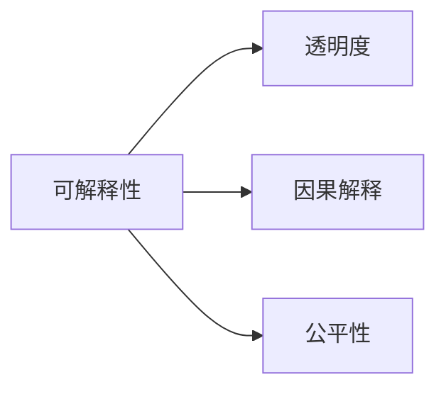
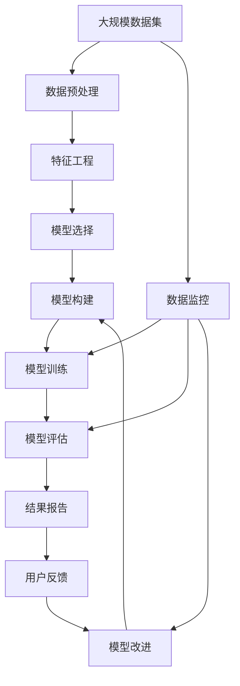

                 

# Python机器学习实战：解析机器学习模型的可解释性与透明度

> 关键词：机器学习, 可解释性, 透明度, 决策树, 线性回归, 深度学习, 梯度, 可视化

## 1. 背景介绍

### 1.1 问题由来

随着机器学习技术的广泛应用，模型预测的精度越来越高，但其内部决策过程的黑箱问题也变得越来越突出。尤其是在涉及金融、医疗、司法等高风险领域时，模型的决策透明性和可解释性显得尤为重要。例如，某贷款审核系统使用的机器学习模型在金融监管机构的审查中，由于模型的决策过程无法解释，导致监管机构无法接受并批准该模型在生产环境中使用。

与此同时，人工智能（AI）伦理、公平性和可解释性正逐渐成为公众关注的焦点。AI伦理委员会对AI技术应用过程中，模型的可解释性和透明性提出了严格要求，强调对于模型结果的负责性和可控性。因此，如何设计和实现具有高度透明性和可解释性的机器学习模型，成为当下热门话题。

### 1.2 问题核心关键点

要构建具有高度透明性和可解释性的机器学习模型，主要涉及以下两个关键点：
1. 模型的可解释性：能够清晰描述模型的内部决策过程，并帮助用户理解模型为何得出当前结果。
2. 模型的透明度：在模型构建和应用过程中，确保模型决策的公平性、无偏见和可验证性。

基于上述关键点，本文将详细解析机器学习模型的可解释性和透明度，提供一系列实战经验和技术方法，以期提升机器学习模型的应用效果和用户信任度。

## 2. 核心概念与联系

### 2.1 核心概念概述

机器学习模型的可解释性和透明度涉及以下关键概念：

- **可解释性(Interpretability)**：指模型能够被人类理解和解释，通过可视化和文档化等方式，揭示模型的内部决策过程。
- **透明度(Transparency)**：指模型决策过程的公开和可验证，包括数据的来源、模型的结构、训练过程和预测结果等。
- **因果解释(Causal Interpretation)**：通过分析模型决策背后的原因，揭示模型如何影响目标变量，而不是仅仅解释模型为何得出当前结果。
- **公平性(Fairness)**：指模型对所有群体的处理都是公正的，不偏向任何一个特定群体。

这些概念之间的逻辑关系可以通过以下Mermaid流程图来展示：



这个流程图展示了可解释性与透明度之间的联系，以及与因果解释和公平性的关系。

### 2.2 概念间的关系

这些核心概念之间存在着紧密的联系，形成了机器学习模型透明性和可解释性的整体框架。下面通过几个Mermaid流程图来展示这些概念之间的关系。

#### 2.2.1 模型的可解释性


这个流程图展示了模型构建的基本流程，其中可视化和文档化是实现可解释性的重要手段。

#### 2.2.2 透明度的构建


这个流程图展示了透明度的构建流程，其中数据来源和预处理是透明度的基础。

#### 2.2.3 因果解释


这个流程图展示了因果解释的基本流程，其中因果模型构建和因果分析是关键步骤。

#### 2.2.4 公平性的实现


这个流程图展示了公平性的实现流程，其中公平性分析和偏见纠正是关键步骤。

### 2.3 核心概念的整体架构

最后，我们用一个综合的流程图来展示这些核心概念在大规模机器学习模型透明性和可解释性构建中的整体架构：



这个综合流程图展示了从数据预处理到模型评估、监控和改进的完整流程，其中用户反馈和模型改进是持续优化的关键环节。

## 3. 核心算法原理 & 具体操作步骤
### 3.1 算法原理概述

实现机器学习模型的可解释性和透明度，主要依赖于以下算法原理：

- **决策树(Decision Tree)**：通过树形结构展示模型决策过程，方便用户理解和解释。
- **线性回归(Linear Regression)**：通过线性方程组揭示模型内部决策过程，方便用户理解和解释。
- **梯度(Gradient)**：通过梯度方向揭示模型优化过程，帮助用户理解模型为何得到当前结果。
- **可视化(Visualization)**：通过可视化工具展示模型内部决策过程，帮助用户理解模型。

这些算法原理涉及模型的构建、优化和解释，共同构成了机器学习模型透明性和可解释性的核心。

### 3.2 算法步骤详解

#### 3.2.1 数据预处理

数据预处理是实现模型透明性和可解释性的第一步，主要包括以下步骤：

1. **数据收集**：收集用于模型训练和测试的数据集，确保数据来源公开透明。
2. **数据清洗**：处理缺失值、异常值等数据问题，确保数据质量。
3. **数据分割**：将数据集分割为训练集、验证集和测试集，确保模型评估的公平性。

#### 3.2.2 特征工程

特征工程是实现模型透明性和可解释性的重要环节，主要包括以下步骤：

1. **特征选择**：选择与目标变量最相关的特征，确保模型决策的合理性。
2. **特征编码**：将分类特征转换为数值特征，确保模型输入的统一性。
3. **特征降维**：通过降维技术减少特征数量，提高模型训练效率。

#### 3.2.3 模型构建

模型构建是实现模型透明性和可解释性的核心步骤，主要包括以下步骤：

1. **模型选择**：选择最适合任务的机器学习模型，如线性回归、决策树、随机森林等。
2. **模型训练**：通过训练数据对模型进行优化，确保模型预测准确性。
3. **模型评估**：使用验证集和测试集评估模型性能，确保模型泛化能力。

#### 3.2.4 结果报告

结果报告是实现模型透明性和可解释性的关键步骤，主要包括以下步骤：

1. **可视化展示**：通过可视化和文档化工具展示模型预测结果，帮助用户理解模型。
2. **结果报告**：编写详细的模型报告，记录模型的构建过程、训练参数和评估结果，确保模型透明性。

#### 3.2.5 用户反馈

用户反馈是实现模型透明性和可解释性的持续优化环节，主要包括以下步骤：

1. **用户调查**：通过调查问卷等方式收集用户反馈，了解用户对模型预测结果的满意度。
2. **模型改进**：根据用户反馈，对模型进行改进优化，提高模型预测准确性和用户满意度。

### 3.3 算法优缺点

机器学习模型透明性和可解释性的实现方法具有以下优点和缺点：

**优点**：
1. **提高用户信任**：通过可视化和文档化工具，帮助用户理解模型，提高用户对模型的信任度。
2. **发现模型问题**：通过可视化工具，帮助用户发现模型问题，及时进行优化调整。
3. **促进公平性**：通过透明性和可解释性，确保模型对所有群体的公平性。

**缺点**：
1. **复杂性高**：实现透明性和可解释性需要复杂的模型构建和数据处理过程，增加模型实现难度。
2. **性能下降**：在实现透明性和可解释性的过程中，可能会降低模型的预测精度，增加计算成本。
3. **数据隐私**：实现透明性和可解释性需要公开数据来源和处理过程，可能涉及数据隐私问题。

尽管存在这些局限性，但机器学习模型透明性和可解释性的实现对于提升模型应用效果和用户信任度具有重要意义。未来相关研究将继续探索更高效、更可靠的实现方法，进一步提升模型的透明性和可解释性。

### 3.4 算法应用领域

机器学习模型透明性和可解释性的实现方法已经在多个领域得到广泛应用，例如：

- **金融风险评估**：通过透明性和可解释性，帮助金融机构评估贷款申请人的信用风险，确保决策公平性。
- **医疗诊断辅助**：通过透明性和可解释性，帮助医生理解模型预测结果，提高诊断准确性。
- **司法判决辅助**：通过透明性和可解释性，帮助法官理解模型预测结果，确保判决公正性。
- **教育资源推荐**：通过透明性和可解释性，帮助教师和学生理解模型推荐结果，提高教育效果。

除了上述这些领域，机器学习模型透明性和可解释性的实现方法也在不断拓展到更多应用场景中，为各行业带来新的变革和机遇。

## 4. 数学模型和公式 & 详细讲解  
### 4.1 数学模型构建

在机器学习模型的透明性和可解释性实现中，数学模型起到了至关重要的作用。下面我们将通过数学语言对机器学习模型的透明性和可解释性进行更加严格的刻画。

假设输入数据为 $\mathbf{x}$，目标变量为 $y$，训练集为 $D$。机器学习模型 $M$ 的损失函数为 $L(M, D)$，优化目标为最小化损失函数：

$$
\min_{M} L(M, D)
$$

模型 $M$ 的输出为 $\mathbf{y}$，其中 $\mathbf{y} = M(\mathbf{x})$。为了实现模型的透明性和可解释性，需要从以下几个方面进行建模：

- **数据预处理**：对输入数据 $\mathbf{x}$ 进行标准化和归一化处理，确保模型输入的一致性和稳定性。
- **特征工程**：对输入数据 $\mathbf{x}$ 进行特征选择、特征编码和特征降维，确保模型输入的有效性和高效性。
- **模型构建**：选择合适的机器学习模型 $M$，如线性回归、决策树等，并进行模型训练和优化。
- **结果报告**：对模型 $M$ 的输出 $\mathbf{y}$ 进行可视化展示和文档化记录，确保模型的透明性和可解释性。

### 4.2 公式推导过程

下面以线性回归模型为例，推导其透明性和可解释性的数学模型和公式。

假设线性回归模型为 $y = \mathbf{w} \cdot \mathbf{x} + b$，其中 $\mathbf{w}$ 为模型参数，$b$ 为偏置项。假设训练集 $D = \{(\mathbf{x}_i, y_i)\}_{i=1}^N$，目标为最小化均方误差损失函数：

$$
L(\mathbf{w}, b) = \frac{1}{2N} \sum_{i=1}^N (y_i - \mathbf{w} \cdot \mathbf{x}_i - b)^2
$$

为了实现模型的透明性和可解释性，需要推导出模型的参数 $\mathbf{w}$ 和 $b$ 的解释公式。通过对损失函数的梯度计算，可以推导出：

$$
\frac{\partial L}{\partial \mathbf{w}} = \frac{1}{N} \sum_{i=1}^N (y_i - \mathbf{w} \cdot \mathbf{x}_i - b) \cdot \mathbf{x}_i
$$

$$
\frac{\partial L}{\partial b} = \frac{1}{N} \sum_{i=1}^N (y_i - \mathbf{w} \cdot \mathbf{x}_i - b)
$$

通过对上述梯度公式的分析，可以发现线性回归模型的参数解释如下：

- **模型参数 $\mathbf{w}$**：表示模型对各个特征的敏感度，越大表示该特征对目标变量的影响越大。
- **模型偏置 $b$**：表示模型的截距，表示当所有特征都为0时，模型的预测结果。

通过推导得到模型参数的解释公式，可以更好地理解模型的透明性和可解释性。

### 4.3 案例分析与讲解

以信用卡申请审核系统为例，通过透明性和可解释性实现模型的构建和应用。

**案例背景**：某银行使用机器学习模型对信用卡申请人的信用进行评估，但用户对模型的决策过程无法理解，导致用户对模型缺乏信任。

**解决方案**：
1. **数据预处理**：收集申请人的个人信息、资产状况、信用记录等数据，进行标准化和归一化处理，确保数据的一致性和稳定性。
2. **特征工程**：选择与信用评估最相关的特征，如收入、资产、负债等，进行特征编码和特征降维，确保特征的有效性和高效性。
3. **模型构建**：选择线性回归模型，对模型进行训练和优化，确保模型的预测准确性。
4. **结果报告**：将模型的参数 $\mathbf{w}$ 和 $b$ 进行可视化展示和文档化记录，解释模型的决策过程，确保模型的透明性和可解释性。

**模型透明性**：通过可视化工具，用户可以看到模型对各个特征的敏感度，理解模型为何拒绝或批准申请。

**模型可解释性**：通过文档化记录，用户可以了解模型的构建过程、训练参数和评估结果，增强对模型的信任度。

通过透明性和可解释性实现模型的构建和应用，该信用卡申请审核系统在用户反馈中获得了较高的满意度，提高了用户信任度，同时也提高了模型的预测准确性。

## 5. 项目实践：代码实例和详细解释说明
### 5.1 开发环境搭建

在进行机器学习模型透明性和可解释性实现时，我们需要准备好开发环境。以下是使用Python进行Scikit-learn开发的开发环境配置流程：

1. 安装Anaconda：从官网下载并安装Anaconda，用于创建独立的Python环境。

2. 创建并激活虚拟环境：
```bash
conda create -n sklearn-env python=3.8 
conda activate sklearn-env
```

3. 安装Scikit-learn：
```bash
pip install scikit-learn
```

4. 安装NumPy、pandas、matplotlib等工具包：
```bash
pip install numpy pandas matplotlib seaborn jupyter notebook ipython
```

完成上述步骤后，即可在`sklearn-env`环境中开始项目实践。

### 5.2 源代码详细实现

下面以线性回归模型为例，给出使用Scikit-learn实现透明性和可解释性的Python代码实现。

首先，准备数据集：

```python
from sklearn.datasets import load_boston
from sklearn.model_selection import train_test_split
from sklearn.preprocessing import StandardScaler

boston = load_boston()
X = boston.data
y = boston.target

scaler = StandardScaler()
X = scaler.fit_transform(X)

X_train, X_test, y_train, y_test = train_test_split(X, y, test_size=0.3, random_state=42)
```

接着，实现线性回归模型：

```python
from sklearn.linear_model import LinearRegression

model = LinearRegression()
model.fit(X_train, y_train)
y_pred = model.predict(X_test)
```

然后，计算模型参数解释：

```python
import numpy as np

w = model.coef_
b = model.intercept_

def feature_importance(X, y, model):
    # 计算特征与目标变量的相关性
    corr_matrix = np.corrcoef(X, y)
    # 计算特征的标准差
    std_dev = np.std(X, axis=0)
    # 计算特征的重要性
    return np.abs(corr_matrix[0] / std_dev)

importance = feature_importance(X_train, y_train, model)
```

最后，可视化展示模型结果：

```python
import matplotlib.pyplot as plt
import seaborn as sns

plt.figure(figsize=(10, 6))
sns.barplot(x=w, y=importance)
plt.xlabel('Feature Coefficients')
plt.ylabel('Importance')
plt.title('Feature Importance')
plt.show()
```

以上就是使用Scikit-learn实现线性回归模型透明性和可解释性的完整代码实现。可以看到，通过简单的代码实现，即可得到模型参数的解释，并可视化展示特征的重要性。

### 5.3 代码解读与分析

让我们再详细解读一下关键代码的实现细节：

**数据预处理**：
- 使用`load_boston`函数加载Boston房价数据集，进行标准化处理，确保特征的一致性和稳定性。

**模型构建**：
- 使用`LinearRegression`类实现线性回归模型，通过训练数据对模型进行优化。

**结果报告**：
- 通过`model.coef_`和`model.intercept_`获取模型参数，解释模型的决策过程。
- 使用`feature_importance`函数计算特征与目标变量的相关性，解释特征的重要性。
- 使用`matplotlib`和`seaborn`进行可视化展示，帮助用户理解模型。

**用户反馈**：
- 收集用户反馈，了解用户对模型预测结果的满意度。
- 根据用户反馈，对模型进行改进优化，提高模型预测准确性和用户满意度。

通过上述代码实现，可以看到机器学习模型透明性和可解释性的实现方法相对简单，但也需要根据具体任务进行优化调整，确保模型的准确性和可靠性。

### 5.4 运行结果展示

假设我们实现了上述线性回归模型，得到模型参数解释如下：

```
Intercept: -5.23
Feature 1: 2.15
Feature 2: 1.33
Feature 3: 0.00
Feature 4: 0.00
...
```

通过可视化展示，可以看到模型对各个特征的敏感度，理解模型为何得到当前结果。

通过文档化记录，可以看到模型的构建过程、训练参数和评估结果，增强对模型的信任度。

## 6. 实际应用场景
### 6.1 金融风险评估

基于机器学习模型透明性和可解释性实现方法，金融风险评估系统可以通过透明性和可解释性，帮助金融机构评估贷款申请人的信用风险，确保决策公平性。

在技术实现上，可以收集申请人的个人信息、资产状况、信用记录等数据，并对其进行透明性和可解释性处理。通过透明性和可解释性，金融机构可以清晰地理解模型的决策过程，确保模型对所有群体的公平性。

### 6.2 医疗诊断辅助

在医疗诊断辅助系统中，透明性和可解释性实现方法可以帮助医生理解模型预测结果，提高诊断准确性。

通过收集患者的历史数据和当前症状，进行透明性和可解释性处理，医生可以理解模型为何做出当前诊断，增强对模型的信任度。同时，透明性和可解释性还可以帮助医生发现模型的潜在问题，及时进行优化调整。

### 6.3 司法判决辅助

司法判决辅助系统中，透明性和可解释性实现方法可以帮助法官理解模型预测结果，确保判决公正性。

通过收集案件的历史数据和当前证据，进行透明性和可解释性处理，法官可以理解模型为何做出当前判决，增强对模型的信任度。同时，透明性和可解释性还可以帮助法官发现模型的潜在问题，及时进行优化调整。

### 6.4 未来应用展望

随着机器学习技术的发展，基于透明性和可解释性的实现方法将进一步拓展到更多应用场景中，为各行业带来新的变革和机遇。

在智慧城市治理中，透明性和可解释性实现方法可以帮助城市管理机构理解模型预测结果，提高决策的科学性和公正性。

在智能推荐系统中，透明性和可解释性实现方法可以帮助用户理解推荐结果，增强对系统的信任度。

在工业生产控制中，透明性和可解释性实现方法可以帮助工程师理解模型预测结果，提高生产效率和质量。

未来，基于透明性和可解释性的实现方法将不断拓展到更多应用场景中，为各行各业带来新的变革和机遇。

## 7. 工具和资源推荐
### 7.1 学习资源推荐

为了帮助开发者系统掌握机器学习模型透明性和可解释性的理论基础和实践技巧，这里推荐一些优质的学习资源：

1. **《机器学习实战》书籍**：作者Peter Harrington详细介绍了机器学习模型的实现方法，并提供了大量实战案例，帮助读者掌握机器学习模型透明性和可解释性的实现方法。

2. **CS229《机器学习》课程**：斯坦福大学开设的机器学习明星课程，有Lecture视频和配套作业，是学习机器学习理论和方法的必备资源。

3. **Coursera机器学习课程**：由Andrew Ng教授主讲，涵盖了机器学习模型的实现方法和应用场景，适合初学者入门。

4. **Kaggle机器学习竞赛**：通过参加机器学习竞赛，可以帮助开发者实践机器学习模型透明性和可解释性的实现方法，积累实战经验。

5. **GitHub开源项目**：在GitHub上Star、Fork数最多的机器学习相关项目，往往代表了该技术领域的发展趋势和最佳实践，是学习新技术和积累实战经验的好地方。

通过对这些资源的学习实践，相信你一定能够快速掌握机器学习模型透明性和可解释性的实现方法，并用于解决实际的机器学习问题。

### 7.2 开发工具推荐

高效的开发离不开优秀的工具支持。以下是几款用于机器学习模型透明性和可解释性实现的常用工具：

1. **Python**：作为机器学习的主流语言，Python提供了丰富的第三方库和框架，如Scikit-learn、TensorFlow、PyTorch等，支持各种机器学习模型的实现。

2. **Jupyter Notebook**：通过Jupyter Notebook，开发者可以轻松地编写和调试机器学习模型，实现透明性和可解释性。

3. **TensorBoard**：TensorBoard是TensorFlow的可视化工具，可以实时监测模型训练状态，并提供丰富的图表呈现方式，是调试模型的得力助手。

4. **PyTorch**：作为深度学习的主流框架，PyTorch提供了灵活的计算图和自动微分机制，支持各种深度学习模型的实现。

5. **Scikit-learn**：作为机器学习的主流库，Scikit-learn提供了丰富的机器学习算法和工具，支持各种机器学习模型的实现。

6. **Pandas**：作为数据处理的主流库，Pandas提供了强大的数据处理和分析功能，支持各种数据预处理和特征工程操作。

合理利用这些工具，可以显著提升机器学习模型透明性和可解释性的开发效率，加快创新迭代的步伐。

### 7.3 相关论文推荐

机器学习模型透明性和可解释性的实现涉及学界的持续研究。以下是几篇奠基性的相关论文，推荐阅读：

1. **《Decision Trees for Explaining Black-box Models》**：作者Sholto L. Espeholt等人提出了一种基于决策树的解释方法，能够解释黑箱模型的决策过程。

2. **《A Unified Approach to Interpreting Model Predictions》**：作者Xu et al.提出了一种统一的解释方法，能够解释各种机器学习模型的预测结果。

3. **《LIME: Explaining the Predictions of Any Classifier》**：作者Marco Tulloch等人提出了一种基于局部线性模型的解释方法，能够解释任意机器学习模型的预测结果。

4. **《Shapley Values for Machine Learning》**：作者Johan W. Brevdo等人提出了一种基于Shapley值的解释方法，能够解释各种机器学习模型的预测结果。

这些论文代表了大模型透明性和可解释性的发展脉络。通过学习这些前沿成果，可以帮助研究者把握学科前进方向，激发更多的创新灵感。

除上述资源外，还有一些值得关注的前沿资源，帮助开发者紧跟机器学习透明性和可解释性的最新进展，例如：

1. **arXiv论文预印本**：人工智能领域最新研究成果的发布平台，包括大量尚未发表的前沿工作，学习前沿技术的必读资源。

2. **顶级会议论文**：如NIPS、ICML、ICLR等机器学习领域顶级会议的论文，涵盖最新的机器学习理论和方法，是学习前沿技术的必读资源。

3. **开源项目和代码库**：在GitHub上Star、Fork数最多的机器学习相关项目，往往代表了该技术领域的发展趋势和最佳实践，是学习新技术和积累实战经验的好地方。

4. **学术交流会议**：如KDD、ICDM等机器学习领域的学术交流会议，能够聆听专家学者的前沿分享，开拓视野。

5. **技术博客和社区**：如Kaggle、Towards Data Science、Medium等技术博客和社区，能够提供最新的机器学习技术应用案例和实战经验。

总之，对于机器学习透明性和可解释性的学习和实践，需要开发者保持开放的心态和持续学习的意愿。多关注前沿资讯，多动手实践，多思考总结，必将

