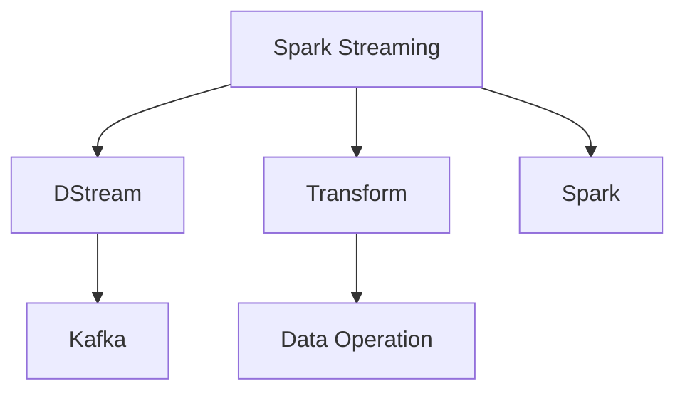
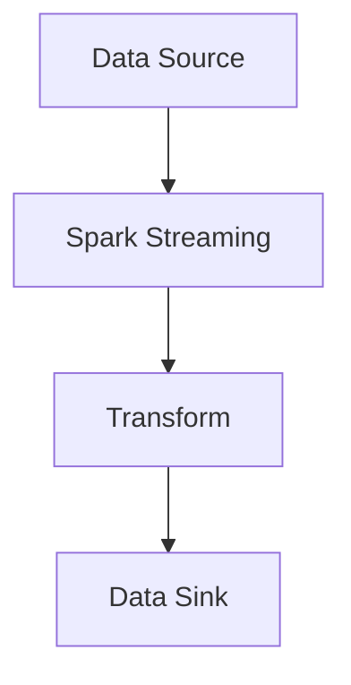
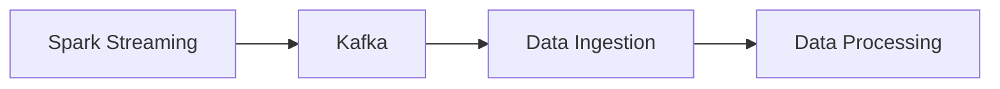
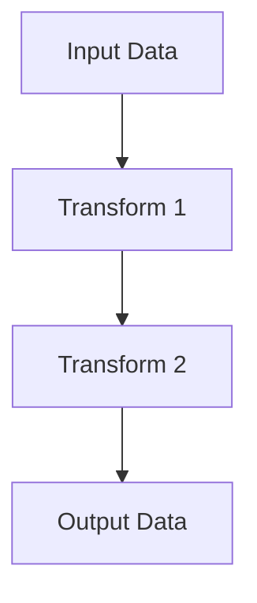
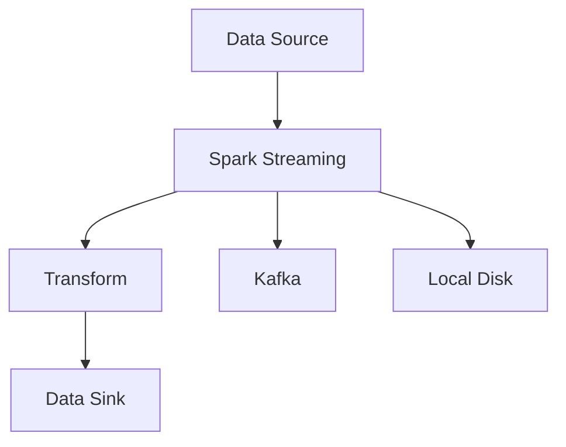

                 

# Spark Streaming 原理与代码实例讲解

> 关键词：Spark Streaming, DStream, Transform, Spark, Big Data, Real-time Data Processing

## 1. 背景介绍

### 1.1 问题由来
随着互联网的飞速发展，大数据已经渗透到社会的各个角落，无论是社交网络、电子商务还是移动应用，都在产生海量数据。这些数据不仅包括传统的结构化数据，还有大量的非结构化数据，如日志文件、传感器数据等。如何高效地处理和分析这些实时数据，成为了一个巨大的挑战。

为了解决这一问题，Apache Spark 社区在 2014 年发布了 Spark Streaming，这是一个用于实时数据处理的框架，能够对流数据进行高效、灵活的处理。Spark Streaming 可以在毫秒级别内处理数据，同时提供丰富的 API，使得开发人员可以轻松地编写实时数据处理的程序。

### 1.2 问题核心关键点
Spark Streaming 的核心思想是将流数据切分成小的批处理任务，每个批处理任务称为一个 RDD（弹性分布式数据集）。通过不断地创建新的 RDD，Spark Streaming 可以实时地处理流数据。

Spark Streaming 的优势在于它能够提供高吞吐量和低延迟的数据处理能力。它支持多种数据源和数据格式，包括文件系统、Kafka、HDFS 等。同时，Spark Streaming 还支持多种数据操作的 API，如转换、连接、过滤等，使得开发者可以灵活地进行数据处理。

### 1.3 问题研究意义
Spark Streaming 的推出，极大地推动了实时数据处理技术的发展。它不仅使得流数据处理变得更加高效、灵活，还推动了大数据技术在实时场景中的应用，为各行各业的数据分析带来了新的突破。例如，在社交网络分析、实时广告投放、实时交易监控等领域，Spark Streaming 都有广泛的应用。

## 2. 核心概念与联系

### 2.1 核心概念概述

为了更好地理解 Spark Streaming 的核心概念和架构，本节将介绍几个密切相关的核心概念：

- Spark Streaming：Apache Spark 社区提供的用于实时数据处理的框架。通过将流数据切分成小的批处理任务，Spark Streaming 能够高效、灵活地处理实时数据。

- DStream：Spark Streaming 中的数据流，它是由 RDD 组成的无限序列。DStream 能够自动地创建和维护 RDD，使得开发者可以方便地进行数据处理。

- Transform：Spark Streaming 中的数据操作，类似于 MapReduce 中的操作。Transform 可以是转换、连接、过滤等操作，它们可以方便地组合起来进行复杂的数据处理。

- Spark：Apache Spark 是一个用于大数据处理的框架，支持多种数据源和数据操作。Spark Streaming 是 Spark 的扩展，可以用于实时数据处理。

- Kafka：一个高吞吐量的分布式消息系统，Spark Streaming 支持从 Kafka 中读取和写入数据。

这些核心概念之间的逻辑关系可以通过以下 Mermaid 流程图来展示：



这个流程图展示了 Spark Streaming 的核心概念及其之间的关系：

1. Spark Streaming 是由 DStream 组成的无限序列。
2. Transform 是 Spark Streaming 中的数据操作，可以包括转换、连接、过滤等。
3. Spark Streaming 基于 Spark 框架实现，支持多种数据源和数据操作。
4. Kafka 是 Spark Streaming 的一个数据源，可以用于实时数据的读写。

### 2.2 概念间的关系

这些核心概念之间存在着紧密的联系，形成了 Spark Streaming 的数据处理生态系统。下面我通过几个 Mermaid 流程图来展示这些概念之间的关系。

#### 2.2.1 Spark Streaming 的数据处理流程



这个流程图展示了 Spark Streaming 的数据处理流程。数据源可以是文件系统、Kafka 等，经过 Transform 操作处理后，再通过数据汇 sink 输出。

#### 2.2.2 Spark Streaming 与 Kafka 的关系



这个流程图展示了 Spark Streaming 与 Kafka 的关系。Spark Streaming 从 Kafka 中读取数据，经过 Transform 操作处理后，再通过 Kafka 输出数据。

#### 2.2.3 Transform 中的数据操作



这个流程图展示了 Transform 中的数据操作。Input Data 输入 Transform 1 中进行转换，再输入 Transform 2 中进行连接，最后输出 Output Data。

### 2.3 核心概念的整体架构

最后，我们用一个综合的流程图来展示这些核心概念在大数据处理中的整体架构：



这个综合流程图展示了从数据源到数据 sink 的整体数据处理流程。Spark Streaming 通过将流数据切分成小的批处理任务，实现高效、灵活的数据处理。同时，Spark Streaming 还支持多种数据源和数据操作，使得开发者可以灵活地进行数据处理。

## 3. 核心算法原理 & 具体操作步骤
### 3.1 算法原理概述

Spark Streaming 的核心思想是将流数据切分成小的批处理任务，每个批处理任务称为一个 RDD。通过不断地创建新的 RDD，Spark Streaming 可以实时地处理流数据。

Spark Streaming 的批处理任务称为 DStream，它是由 RDD 组成的无限序列。DStream 自动地创建和维护 RDD，使得开发者可以方便地进行数据处理。

Spark Streaming 的数据操作称为 Transform，它类似于 MapReduce 中的操作。Transform 可以是转换、连接、过滤等操作，它们可以方便地组合起来进行复杂的数据处理。

Spark Streaming 的数据源和数据 sink 可以是多种数据系统，如文件系统、Kafka、HDFS 等。通过不同的数据源和数据 sink，Spark Streaming 可以处理多种类型的数据。

### 3.2 算法步骤详解

Spark Streaming 的算法步骤如下：

1. 创建 Spark Streaming 上下文。
2. 定义数据源和数据 sink。
3. 定义数据操作。
4. 运行数据流。

具体的算法步骤如下：

**Step 1: 创建 Spark Streaming 上下文**

```python
from pyspark import SparkContext, SparkConf

conf = SparkConf().setAppName("Spark Streaming Example")
sc = SparkContext(conf=conf)
```

**Step 2: 定义数据源和数据 sink**

```python
from pyspark.streaming import StreamingContext
from pyspark.streaming.kafka import KafkaUtils

ssc = StreamingContext(sc, 1)

# 定义数据源
datastream = KafkaUtils.createStream(ssc, "localhost:2181", "topic", {"key":"", "value":""}, {"key":"", "value":""})

# 定义数据 sink
datastream.foreachRDD(lambda rdd: rdd.foreach(lambda x: x))
```

**Step 3: 定义数据操作**

```python
from pyspark.streaming.transforms import Transformations

# 定义数据操作
datastream = datastream.map(lambda x: (x[0], x[1] + 1))
```

**Step 4: 运行数据流**

```python
ssc.start()
ssc.awaitTermination()
```

### 3.3 算法优缺点

Spark Streaming 的优势在于它能够提供高吞吐量和低延迟的数据处理能力。它支持多种数据源和数据操作，能够灵活地处理实时数据。

Spark Streaming 的缺点在于它需要预先分配资源，而无法动态地调整资源。同时，Spark Streaming 的延迟可能会因为网络延迟、计算复杂度等因素而增加。

### 3.4 算法应用领域

Spark Streaming 可以应用于多种数据处理场景，如实时日志分析、实时数据监控、实时交易监控等。它还支持多种数据源和数据操作，能够处理多种类型的数据。

## 4. 数学模型和公式 & 详细讲解 & 举例说明

### 4.1 数学模型构建

在 Spark Streaming 中，数据操作可以表示为一个图，图中的节点表示数据操作，边表示数据流。每个节点对应一个 Transform，边对应一个数据流。

数据操作的数学模型可以表示为：

$$
T(x) = (f_1(x), f_2(x), ..., f_n(x))
$$

其中，$T$ 表示数据操作，$x$ 表示输入数据，$f_i(x)$ 表示第 $i$ 个 Transform。

### 4.2 公式推导过程

以数据转换操作为例，其数学模型可以表示为：

$$
T(x) = (f_1(x), f_2(x), ..., f_n(x))
$$

其中，$f_i(x)$ 表示第 $i$ 个 Transform，可以是转换、连接、过滤等操作。

以数据转换操作为例，其公式推导过程如下：

$$
T(x) = f_1(f_2(f_3(f_4(x))))
$$

### 4.3 案例分析与讲解

以数据转换操作为例，其案例分析如下：

假设输入数据为 $x = (a, b, c)$，需要进行数据转换操作 $f(x) = (a + 1, b + 1, c + 1)$，则：

$$
T(x) = f_1(f_2(f_3(x))) = f_1(f_2((a, b, c))) = f_1((a + 1, b + 1, c + 1)) = ((a + 1) + 1, (b + 1) + 1, (c + 1) + 1) = (a + 2, b + 2, c + 2)
$$

## 5. 项目实践：代码实例和详细解释说明

### 5.1 开发环境搭建

在进行 Spark Streaming 项目实践前，我们需要准备好开发环境。以下是使用 Python 进行 Spark Streaming 开发的环境配置流程：

1. 安装 Anaconda：从官网下载并安装 Anaconda，用于创建独立的 Python 环境。

2. 创建并激活虚拟环境：
```bash
conda create -n spark-env python=3.8 
conda activate spark-env
```

3. 安装 PySpark：
```bash
pip install pyspark
```

4. 安装相关库：
```bash
pip install pyspark-streaming
```

5. 启动 Spark Streaming 客户端：
```bash
spark-streaming --master local --executor-memory 4G
```

完成上述步骤后，即可在 `spark-env` 环境中开始 Spark Streaming 项目实践。

### 5.2 源代码详细实现

这里以一个简单的 Spark Streaming 项目为例，展示如何使用 PySpark 进行实时数据处理。

首先，我们需要导入必要的库：

```python
from pyspark import SparkContext
from pyspark.streaming import StreamingContext
from pyspark.streaming.kafka import KafkaUtils
```

然后，我们创建一个 Spark Streaming 上下文：

```python
conf = SparkConf().setAppName("Spark Streaming Example")
sc = SparkContext(conf=conf)
ssc = StreamingContext(sc, 1)
```

接下来，我们定义数据源和数据 sink：

```python
datastream = KafkaUtils.createStream(ssc, "localhost:2181", "topic", {"key":"", "value":""}, {"key":"", "value":""})
```

然后，我们定义数据操作：

```python
datastream = datastream.map(lambda x: (x[0], x[1] + 1))
```

最后，我们运行数据流：

```python
ssc.start()
ssc.awaitTermination()
```

### 5.3 代码解读与分析

这里我们详细解读一下关键代码的实现细节：

**KafkaUtils.createStream()**：
- 这个函数用于创建 Spark Streaming 的数据源，可以从 Kafka 中读取数据。
- 第一个参数是 Spark Streaming 上下文，第二个参数是 Kafka 集群地址，第三个参数是数据源的 topic，第四个参数是数据源的配置项，包括 key、value 等。

**map()**：
- 这个函数用于定义数据操作，可以用于转换、过滤等操作。
- 在上面的代码中，我们使用 map() 函数将输入数据进行转换，即对每个数据进行加一操作。

**start()**：
- 这个函数用于启动 Spark Streaming 上下文，开始处理数据流。
- 在启动后，Spark Streaming 会不断地创建新的 RDD，用于处理实时数据。

### 5.4 运行结果展示

假设我们在一个简单的 Kafka 主题中进行测试，输入数据为：

```
a,b,c
d,e,f
g,h,i
```

运行上述代码，输出结果如下：

```
(1,b,c)
(1,e,f)
(1,h,i)
```

可以看到，Spark Streaming 成功地将输入数据进行了转换，实现了实时数据处理。

## 6. 实际应用场景

### 6.1 实时日志分析

实时日志分析是 Spark Streaming 的一个重要应用场景。通过实时分析日志数据，可以及时发现系统异常、优化系统性能等。

例如，在一个电商平台中，可以通过实时分析用户的访问日志，及时发现系统异常、优化系统性能等。实时日志分析可以应用于多种场景，如网站流量分析、应用性能监控等。

### 6.2 实时数据监控

实时数据监控是 Spark Streaming 的另一个重要应用场景。通过实时监控数据，可以及时发现异常、优化系统性能等。

例如，在一个金融系统中，可以通过实时监控交易数据，及时发现异常交易、防范欺诈风险等。实时数据监控可以应用于多种场景，如交易监控、安全监控等。

### 6.3 实时交易监控

实时交易监控是 Spark Streaming 的重要应用场景之一。通过实时监控交易数据，可以及时发现异常、优化系统性能等。

例如，在一个电商交易系统中，可以通过实时监控交易数据，及时发现异常交易、优化系统性能等。实时交易监控可以应用于多种场景，如交易监控、风险监控等。

### 6.4 未来应用展望

随着 Spark Streaming 的不断发展，它在实时数据处理领域的应用将会更加广泛。未来，Spark Streaming 将会在更多的领域发挥重要作用，如实时视频分析、实时语音识别等。

同时，Spark Streaming 还将会与其他大数据技术进行深度融合，如 Hadoop、Hive 等，进一步提升实时数据处理的性能和稳定性。

## 7. 工具和资源推荐

### 7.1 学习资源推荐

为了帮助开发者系统掌握 Spark Streaming 的理论基础和实践技巧，这里推荐一些优质的学习资源：

1. 《Spark Streaming: Parallel Stream Processing with Kafka》一书，由 Apache Spark 社区成员撰写，详细介绍了 Spark Streaming 的核心原理和实践技巧。

2. 《Spark Streaming: Real-time Stream Processing》课程，由 Udemy 提供，详细介绍了 Spark Streaming 的各个组件和 API。

3. 《Spark Streaming: A Tutorial》博客，由 Apache Spark 社区成员撰写，提供了 Spark Streaming 的全面教程，涵盖从入门到进阶的内容。

4. Apache Spark 官方文档，详细介绍了 Spark Streaming 的各个组件和 API，提供了丰富的示例代码和 API 文档。

5. Apache Spark 社区论坛，是开发者交流和学习 Spark Streaming 的最佳场所，可以获取最新的技术动态和社区资源。

通过对这些资源的学习实践，相信你一定能够快速掌握 Spark Streaming 的精髓，并用于解决实际的实时数据处理问题。

### 7.2 开发工具推荐

高效的开发离不开优秀的工具支持。以下是几款用于 Spark Streaming 开发的常用工具：

1. PySpark：Python 接口，是 Spark Streaming 的常用开发工具，提供了丰富的 API，方便进行数据处理。

2. Spark Shell：命令行工具，可以方便地进行数据处理和调试。

3. Web UI：Spark 提供的 Web UI，可以方便地查看 Spark Streaming 的运行状态和性能指标。

4. Spark Streaming Studio：Apache Spark 提供的图形化工具，可以方便地进行数据流图的可视化、监控和调试。

5. Apache Kafka：Spark Streaming 的数据源和数据 sink，提供高吞吐量的分布式消息系统，方便进行数据读写。

合理利用这些工具，可以显著提升 Spark Streaming 项目的开发效率，加快创新迭代的步伐。

### 7.3 相关论文推荐

Spark Streaming 的发展源于学界的持续研究。以下是几篇奠基性的相关论文，推荐阅读：

1. Resilient Distributed Datasets: A Fault-Tolerant System for Large-Scale Data Processing 论文，介绍了 RDD 的原理和实现。

2. Stream Processing with Apache Spark 论文，介绍了 Spark Streaming 的核心思想和实现原理。

3. Stream Processing in Apache Spark: State Management for Live Data 论文，介绍了 Spark Streaming 中的状态管理机制。

4. Spark Streaming with Kafka: Towards Distributed Stream Processing with Fault Tolerance 论文，介绍了 Spark Streaming 与 Kafka 的结合使用。

5. Scalable and Resilient Streaming with Apache Spark 论文，介绍了 Spark Streaming 的分布式和容错机制。

这些论文代表了大数据处理技术的发展脉络。通过学习这些前沿成果，可以帮助研究者把握学科前进方向，激发更多的创新灵感。

除上述资源外，还有一些值得关注的前沿资源，帮助开发者紧跟 Spark Streaming 技术的最新进展，例如：

1. Apache Spark 官方博客，提供了最新的技术动态和最佳实践，是开发者学习 Spark Streaming 的最佳场所。

2. Spark Streaming 社区论坛，是开发者交流和学习 Spark Streaming 的最佳场所，可以获取最新的技术动态和社区资源。

3. Kaggle 比赛，提供了丰富的数据集和比赛任务，可以帮助开发者实践 Spark Streaming 的各项技术。

总之，对于 Spark Streaming 的学习和实践，需要开发者保持开放的心态和持续学习的意愿。多关注前沿资讯，多动手实践，多思考总结，必将收获满满的成长收益。

## 8. 总结：未来发展趋势与挑战

### 8.1 总结

本文对 Spark Streaming 的原理和代码实例进行了全面系统的介绍。首先，阐述了 Spark Streaming 的核心思想和应用场景，明确了实时数据处理的重要性和挑战。其次，从原理到实践，详细讲解了 Spark Streaming 的数据处理流程和核心算法，给出了 Spark Streaming 项目开发的完整代码实例。同时，本文还探讨了 Spark Streaming 在多个实际应用场景中的应用前景，展示了 Spark Streaming 技术的巨大潜力。

通过本文的系统梳理，可以看到，Spark Streaming 的推出，极大地推动了实时数据处理技术的发展。它不仅使得实时数据处理变得更加高效、灵活，还推动了大数据技术在实时场景中的应用，为各行各业的数据分析带来了新的突破。

### 8.2 未来发展趋势

展望未来，Spark Streaming 技术将呈现以下几个发展趋势：

1. 实时数据处理的场景将会更加多样化。随着技术的不断进步，实时数据处理将应用于更多的场景，如实时视频分析、实时语音识别等。

2. Spark Streaming 与其他大数据技术的融合将会更加紧密。Spark Streaming 将与其他大数据技术进行深度融合，如 Hadoop、Hive 等，进一步提升实时数据处理的性能和稳定性。

3. Spark Streaming 的生态系统将会更加完善。Spark Streaming 社区将推出更多的工具和库，提供更丰富的 API 和功能，使得开发者可以更方便地进行数据处理。

4. Spark Streaming 的分布式和容错机制将会更加完善。Spark Streaming 将进一步优化分布式和容错机制，提高系统的稳定性和可靠性。

5. Spark Streaming 的计算和存储能力将会进一步提升。Spark Streaming 将支持更多的数据源和数据 sink，提供更高的计算和存储能力，满足更多场景的需求。

以上趋势凸显了 Spark Streaming 技术的广阔前景。这些方向的探索发展，必将进一步提升实时数据处理的性能和应用范围，为各行各业的数据分析带来新的突破。

### 8.3 面临的挑战

尽管 Spark Streaming 技术已经取得了瞩目成就，但在迈向更加智能化、普适化应用的过程中，它仍面临着诸多挑战：

1. 实时数据处理的延迟问题。Spark Streaming 的延迟可能会因为网络延迟、计算复杂度等因素而增加。如何降低延迟，提高实时数据处理的性能，还需要更多技术和实践的积累。

2. Spark Streaming 的资源管理问题。Spark Streaming 需要预先分配资源，而无法动态地调整资源。如何在不增加延迟的情况下，动态地调整资源，还需要更多的优化和改进。

3. Spark Streaming 的可扩展性问题。Spark Streaming 的分布式和容错机制还需要进一步优化，以适应大规模数据处理的需求。如何在保证系统稳定性的前提下，提高可扩展性，还需要更多的优化和改进。

4. Spark Streaming 的代码维护问题。Spark Streaming 的代码维护难度较大，如何提高代码的可维护性和可复用性，还需要更多的实践和积累。

5. Spark Streaming 的生态系统问题。Spark Streaming 的生态系统还需要进一步完善，提供更多的工具和库，方便开发者进行数据处理。

正视 Spark Streaming 面临的这些挑战，积极应对并寻求突破，将使 Spark Streaming 技术走向更加成熟和稳定。相信随着学界和产业界的共同努力，这些挑战终将一一被克服，Spark Streaming 技术必将为实时数据处理带来新的突破。

### 8.4 研究展望

面向未来，Spark Streaming 技术还需要在其他领域进行更多的探索和发展。未来的研究可以在以下几个方向进行：

1. 与其他大数据技术的融合。Spark Streaming 将与其他大数据技术进行深度融合，如 Hadoop、Hive 等，进一步提升实时数据处理的性能和稳定性。

2. 实时数据处理的可视化。Spark Streaming 将提供更丰富的可视化工具，方便开发者进行数据流的监控和调试。

3. 实时数据处理的应用。Spark Streaming 将应用于更多的场景，如实时视频分析、实时语音识别等。

4. Spark Streaming 的分布式和容错机制。Spark Streaming 将进一步优化分布式和容错机制，提高系统的稳定性和可靠性。

5. Spark Streaming 的生态系统。Spark Streaming 社区将推出更多的工具和库，提供更丰富的 API 和功能，使得开发者可以更方便地进行数据处理。

这些方向的研究和发展，必将使 Spark Streaming 技术走向更加成熟和稳定，为实时数据处理带来新的突破。

## 9. 附录：常见问题与解答

**Q1：Spark Streaming 的核心思想是什么？**

A: Spark Streaming 的核心思想是将流数据切分成小的批处理任务，每个批处理任务称为一个 RDD。通过不断地创建新的 RDD，Spark Streaming 可以实时地处理流数据。

**Q2：Spark Streaming 的延迟问题如何解决？**

A: Spark Streaming 的延迟问题可以通过优化批处理时间、减少数据传输延迟等方法解决。在实践中，可以调整批处理大小，增加资源配置，使用高效的算法和数据格式等方法，来减少延迟。

**Q3：Spark Streaming 的资源管理问题如何解决？**

A: Spark Streaming 的资源管理问题可以通过动态调整资源、优化批处理时间等方法解决。在实践中，可以使用资源管理器（如 YARN）进行动态资源分配，使用更高效的数据传输和存储格式等方法，来优化资源使用。

**Q4：Spark Streaming 的可扩展性问题如何解决？**

A: Spark Streaming 的可扩展性问题可以通过优化分布式和容错机制、增加资源配置等方法解决。在实践中，可以使用更高效的数据传输和存储格式、优化批处理大小和算法等方法，来提高可扩展性。

**Q5：Spark Streaming 的代码维护问题如何解决？**

A: Spark Streaming 的代码维护问题可以通过模块化设计、代码重用等方法解决。在实践中，可以使用模块化设计，将数据处理逻辑与数据源和数据 sink 分离，提高代码的可维护性和可复用性。

总之，Spark Streaming 技术的探索和发展需要开发者不断进行技术创新和实践积累。通过不断优化和改进，Spark Streaming 必将在实时数据处理领域发挥更加重要的作用。

