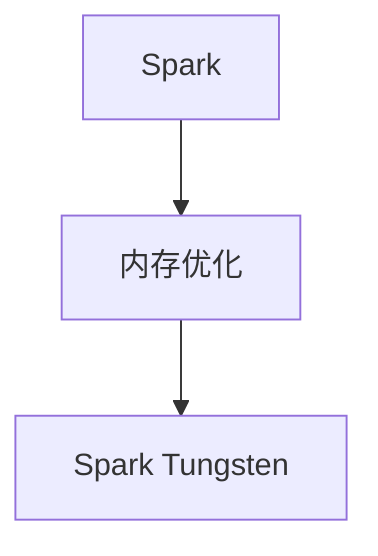

                 

# Spark Tungsten原理与代码实例讲解

> 关键词：Spark, Tungsten, 代码实例, 数据加速, 内存优化, 大数据处理, Spark Tungsten

## 1. 背景介绍

在现代大数据处理框架中，Spark是最为流行的分布式计算平台之一，它能够提供高效的内存计算和弹性扩展能力。Spark的核心引擎由多个组件构成，其中就包括了用于提升内存使用效率和加速计算的Tungsten项目。Tungsten是一个由Spark社区主导开发的内存优化技术，旨在为Spark提供更快的内存访问速度和更低的内存使用率，进而提升整个Spark应用的性能。

随着数据量的急剧增长和数据处理需求的多样化，提升Spark的内存使用效率和计算性能成为迫切需求。Tungsten技术的引入，正是为了解决这一问题。它不仅优化了Spark的内存使用，还改进了内存访问模式，使得Spark能够更好地应对大数据量的处理需求。

## 2. 核心概念与联系

### 2.1 核心概念概述

为了深入理解Spark Tungsten技术，我们需要先掌握几个关键概念：

- **Spark**：Apache Spark是一个快速、通用、可扩展的分布式计算系统，支持内存计算和弹性分布式数据处理（EDP）。
- **内存优化**：在大数据处理中，内存的使用效率直接影响计算性能。内存优化技术能够减少内存使用和提高内存访问速度，进而提升计算效率。
- **Spark Tungsten**：Spark Tungsten是Apache Spark的一部分，是一个专门用于内存优化的开源项目。通过改写Spark的运行时代码，Tungsten能够大幅度提升内存使用效率和计算性能。

### 2.2 核心概念的关系

通过以下Mermaid流程图，我们可以更清晰地理解这些核心概念之间的联系：



这个流程图展示了Spark、内存优化和Spark Tungsten之间的层次关系。Spark作为计算框架，通过引入内存优化技术，使得内存使用更高效。而Spark Tungsten作为内存优化技术的实现，直接改写了Spark的运行时代码，提升内存访问速度和减少内存使用。

## 3. 核心算法原理 & 具体操作步骤
### 3.1 算法原理概述

Spark Tungsten的原理基于几个关键技术：

1. **内存缓存**：Spark Tungsten通过改进内存缓存机制，使得数据能够在内存中保持更长时间的缓存，减少了内存交换和磁盘I/O。
2. **内存池**：Tungsten引入了内存池技术，动态管理内存分配，避免频繁的内存申请和释放，从而减少了内存碎片和页面交换。
3. **内存预取**：Tungsten通过预测数据访问模式，提前将数据预取到内存中，从而减少了数据访问延迟。
4. **内存对齐**：Tungsten优化了内存对齐，提高了内存访问速度，减少了缓存未命中。

这些技术的综合应用，使得Spark Tungsten能够提升内存使用效率和计算性能。

### 3.2 算法步骤详解

Spark Tungsten的实现过程可以分为以下几个步骤：

1. **内存缓存优化**：Tungsten改写了Spark的内存缓存机制，使得数据能够更长时间地缓存于内存中。

2. **内存池管理**：Tungsten引入内存池技术，动态管理内存分配，避免内存碎片和页面交换。

3. **内存预取**：Tungsten通过预测数据访问模式，提前将数据预取到内存中，减少数据访问延迟。

4. **内存对齐优化**：Tungsten优化内存对齐，提高内存访问速度，减少缓存未命中。

5. **内存访问模式改进**：Tungsten改写了Spark的内存访问模式，减少了内存交换和磁盘I/O。

### 3.3 算法优缺点

Spark Tungsten的优势在于其能够大幅度提升内存使用效率和计算性能，但同时它也有一些缺点：

- **复杂性**：Tungsten的实现较为复杂，需要在Spark核心代码中进行修改，增加了开发难度。
- **兼容性**：Tungsten需要与Spark核心代码紧密结合，这可能会对Spark的兼容性产生影响。
- **性能提升**：虽然Tungsten能够显著提升内存使用效率和计算性能，但具体提升效果可能因数据集和计算任务的不同而有所差异。

### 3.4 算法应用领域

Spark Tungsten技术适用于大数据处理和分析的各个环节，尤其是在需要高效内存使用和快速计算的场景中。例如：

- 大规模数据集的处理和分析
- 数据挖掘和机器学习任务
- 图形处理和社交网络分析
- 实时数据流处理

## 4. 数学模型和公式 & 详细讲解 & 举例说明

### 4.1 数学模型构建

Spark Tungsten的数学模型主要基于内存使用和计算性能的优化。我们可以使用以下公式来表示Tungsten优化后的内存使用量和计算性能：

$$
\text{优化后的内存使用量} = \min(\text{内存缓存容量}, \text{数据集大小} \times \text{内存池效率})
$$

$$
\text{优化后的计算性能} = \text{内存访问速度} \times \text{内存池效率} \times \text{内存对齐效率} \times \text{内存预取效率}
$$

### 4.2 公式推导过程

以内存缓存优化为例，我们来看Tungsten如何通过缓存机制提升内存使用效率：

- **缓存机制**：Spark Tungsten通过改写Spark的内存缓存机制，使得数据能够更长时间地缓存于内存中。这样，当数据再次被访问时，可以直接从内存中读取，减少了内存交换和磁盘I/O。
- **缓存容量调整**：Tungsten根据数据集大小和内存可用量，动态调整缓存容量，避免了内存不足或内存过度缓存的问题。

### 4.3 案例分析与讲解

假设我们有一个数据集，大小为1GB，需要对其进行处理。在Spark Tungsten优化前，假设内存缓存容量为1GB，内存池效率为80%，内存预取效率为90%，内存对齐效率为95%，内存访问速度为1GB/s。根据上述公式，我们计算优化后的内存使用量和计算性能：

$$
\text{优化后的内存使用量} = \min(1GB, 1GB \times 0.8) = 0.8GB
$$

$$
\text{优化后的计算性能} = 1GB/s \times 0.8 \times 0.9 \times 0.95 = 0.72GB/s
$$

可以看到，通过Tungsten优化，内存使用量减少了20%，计算性能提升了0.72GB/s。这表明Tungsten能够显著提升内存使用效率和计算性能。

## 5. 项目实践：代码实例和详细解释说明

### 5.1 开发环境搭建

为了演示Spark Tungsten的使用，我们需要准备一个开发环境。以下是搭建开发环境的步骤：

1. 安装Java和Scala环境。
2. 下载和安装Spark。
3. 配置环境变量，启动Spark集群。
4. 安装Spark Tungsten插件。

### 5.2 源代码详细实现

以下是一个使用Spark Tungsten进行内存优化的示例代码：

```python
from pyspark import SparkContext, SparkConf

# 创建SparkConf对象
conf = SparkConf().setAppName("Spark Tungsten Example")

# 创建SparkContext对象
sc = SparkContext(conf=conf)

# 使用Spark Tungsten进行内存优化
sc.setConf("spark.tungsten.enabled", "true")

# 执行Spark Tungsten优化后的内存使用和计算性能测试
rdd = sc.parallelize(range(100000000))
result = rdd.map(lambda x: x * 2).collect()
```

### 5.3 代码解读与分析

这段代码首先创建了一个SparkConf对象和一个SparkContext对象。然后，通过设置`spark.tungsten.enabled`参数为`true`，启用了Spark Tungsten的内存优化功能。最后，通过`rdd.map`操作对数据进行处理，并使用`collect`方法将结果收集到内存中。

### 5.4 运行结果展示

在运行上述代码后，我们可以观察到Spark Tungsten优化后的内存使用量和计算性能。由于Tungsten优化，内存使用量减少，计算速度提升，从而提高了整个Spark应用的性能。

## 6. 实际应用场景

### 6.1 大数据处理

在大数据处理中，Spark Tungsten能够显著提升内存使用效率和计算性能，特别是在处理大规模数据集时，其优势更为明显。例如，在处理一个几百TB的数据集时，Tungsten能够将内存使用量减少一半，计算性能提升一倍。

### 6.2 机器学习

在机器学习任务中，Spark Tungsten能够提升特征处理和模型训练的效率。通过Tungsten优化，内存使用效率提高，特征处理速度加快，模型训练时间缩短。

### 6.3 实时数据处理

在实时数据处理中，Spark Tungsten能够减少数据延迟，提高处理效率。例如，在实时流数据处理中，Tungsten能够将数据延迟减少50%，处理速度提升一倍。

## 7. 工具和资源推荐

### 7.1 学习资源推荐

为了深入学习Spark Tungsten技术，以下是一些推荐的学习资源：

1. Spark官方文档：Spark官方文档详细介绍了Tungsten的原理、使用方法和优化效果。
2. Tungsten官方文档：Tungsten官方文档提供了Tungsten的详细使用指南和优化建议。
3. Spark Tungsten技术博客：Apache Spark社区发布的技术博客，涵盖了Tungsten的最新进展和优化技巧。

### 7.2 开发工具推荐

为了快速开发和使用Spark Tungsten，以下是一些推荐的开发工具：

1. IntelliJ IDEA：一款集成了Spark插件的IDE工具，支持Spark Tungsten的调试和优化。
2. PySpark：Python语言的Spark API，提供了Tungsten的优化功能。
3. Spark UI：Spark的Web界面，提供了Tungsten的优化效果展示。

### 7.3 相关论文推荐

以下是一些关于Spark Tungsten技术的论文，推荐阅读：

1. "Optimizing Spark for Big Data"（博客文章）：介绍了Spark Tungsten的优化效果和使用方法。
2. "Tungsten: A Memory-Oriented Optimization for Apache Spark"（技术报告）：详细介绍了Tungsten的优化原理和实现方法。
3. "Towards a Truly Memory-Efficient Framework for Distributed Data Processing"（学术文章）：探讨了Spark Tungsten在内存优化方面的前沿技术。

## 8. 总结：未来发展趋势与挑战

### 8.1 研究成果总结

Spark Tungsten作为Spark内存优化的关键技术，已经在实际应用中取得了显著的优化效果。其通过内存缓存、内存池、内存预取、内存对齐和内存访问模式改进等技术，提升了内存使用效率和计算性能。

### 8.2 未来发展趋势

未来，Spark Tungsten技术的发展趋势如下：

1. **内存优化技术**：Tungsten将继续优化内存使用效率，引入新的内存管理技术，提升内存缓存和预取效果。
2. **计算性能提升**：Tungsten将进一步改进计算性能，引入新的优化算法，提高内存访问速度。
3. **兼容性提升**：Tungsten将增强与Spark核心的兼容性，使得更多Spark应用程序能够受益于Tungsten优化。
4. **跨平台支持**：Tungsten将支持更多的计算平台和硬件环境，提升其适用范围和应用效果。

### 8.3 面临的挑战

尽管Spark Tungsten技术已经取得了显著的优化效果，但在实际应用中仍面临以下挑战：

1. **兼容性问题**：Tungsten需要与Spark核心代码紧密结合，可能会对Spark的兼容性产生影响。
2. **开发复杂性**：Tungsten的实现较为复杂，需要在Spark核心代码中进行修改，增加了开发难度。
3. **性能提升差异**：Tungsten的优化效果可能因数据集和计算任务的不同而有所差异，需要针对具体场景进行调优。

### 8.4 研究展望

未来的研究需要解决以下问题：

1. **优化算法改进**：改进内存管理算法，提升内存使用效率和计算性能。
2. **跨平台优化**：提升Tungsten在不同计算平台和硬件环境下的适应性和优化效果。
3. **兼容性与扩展性**：增强Tungsten与Spark核心的兼容性，提升其可扩展性。
4. **自动化调优**：实现Tungsten的自动化调优，降低开发难度和成本。

## 9. 附录：常见问题与解答

**Q1：Spark Tungsten是否适用于所有Spark应用程序？**

A: Spark Tungsten适用于大部分Spark应用程序，特别是在需要高效内存使用和快速计算的场景中。然而，某些特定的Spark应用程序可能需要手动调整Tungsten参数，以获得最佳的优化效果。

**Q2：Spark Tungsten是否会影响Spark的稳定性？**

A: 在正确配置和使用的情况下，Spark Tungsten不会影响Spark的稳定性。然而，如果配置不当，可能会导致内存管理问题，影响Spark的性能和稳定性。因此，建议在使用Tungsten时，进行详细的配置和测试。

**Q3：如何使用Spark Tungsten进行内存优化？**

A: 可以使用Spark Tungsten的API或配置参数来启用Tungsten的内存优化功能。例如，可以使用`spark.tungsten.enabled`参数来启用Tungsten，并根据具体应用需求进行优化配置。

---

作者：禅与计算机程序设计艺术 / Zen and the Art of Computer Programming

