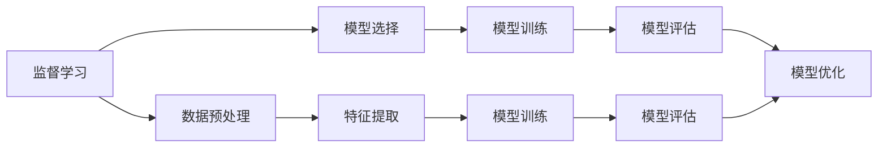

                 

# Supervised Learning 原理与代码实战案例讲解

> 关键词：监督学习, 算法原理, 具体操作步骤, 数学模型, 代码实践, 应用场景, 学习资源

## 1. 背景介绍

监督学习（Supervised Learning）是机器学习（Machine Learning）的一个重要分支，通过训练数据中带有标签的样本，让模型学习输入数据与输出标签之间的映射关系。与无监督学习（Unsupervised Learning）和强化学习（Reinforcement Learning）不同，监督学习能够通过已知的输入输出对模型进行指导，使得模型能够预测新的、未标记的数据。

### 1.1 问题由来
监督学习在机器学习和人工智能中应用广泛，例如自然语言处理（Natural Language Processing, NLP）、计算机视觉（Computer Vision）、推荐系统（Recommendation System）等。通过监督学习，我们能够实现各种智能应用，如语音识别、图像分类、文本分类、推荐系统等。但是，监督学习的关键在于如何选择合适的训练算法、调整模型参数以及如何处理数据集中的噪声和偏差。

### 1.2 问题核心关键点
监督学习的核心问题是如何从训练数据中提取特征，并利用这些特征进行模型的训练和优化。监督学习通常包括以下几个关键步骤：
1. 数据预处理：包括数据清洗、特征提取、归一化等。
2. 模型选择：根据任务选择合适的模型，如线性回归、逻辑回归、支持向量机（SVM）、决策树、随机森林、神经网络等。
3. 模型训练：通过优化算法如梯度下降（Gradient Descent）、随机梯度下降（Stochastic Gradient Descent）、AdaGrad、Adam等优化模型参数。
4. 模型评估：使用交叉验证（Cross Validation）、学习曲线（Learning Curve）、混淆矩阵（Confusion Matrix）等评估模型性能。
5. 模型优化：通过正则化（Regularization）、正则化参数调整、学习率调整等优化模型性能。

## 2. 核心概念与联系

### 2.1 核心概念概述

为了更好地理解监督学习，我们首先需要明确几个核心概念：

- **监督学习（Supervised Learning）**：通过已知输入输出数据对模型进行训练，使其能够预测新数据的输出。
- **模型（Model）**：用于表示输入数据和输出标签之间的映射关系的数学模型。
- **损失函数（Loss Function）**：用于度量模型预测输出与真实标签之间差异的函数。
- **优化算法（Optimization Algorithm）**：用于最小化损失函数的算法。
- **过拟合（Overfitting）**：模型在训练集上表现良好，但在测试集上表现较差的现象。
- **欠拟合（Underfitting）**：模型在训练集和测试集上均表现较差的现象。
- **泛化（Generalization）**：模型在未见过的数据上表现良好的能力。

### 2.2 概念间的关系

通过以下Mermaid流程图，我们可以更直观地理解这些核心概念之间的联系：



这个流程图展示了监督学习的基本流程：

1. **数据预处理**：数据预处理是监督学习的第一步，包括数据清洗、特征提取、归一化等，确保数据的可用性和质量。
2. **模型选择**：根据任务选择合适的模型，如线性回归、逻辑回归、SVM、决策树、随机森林、神经网络等。
3. **模型训练**：通过优化算法（如梯度下降）最小化损失函数，优化模型参数。
4. **模型评估**：使用交叉验证、学习曲线、混淆矩阵等评估模型性能。
5. **模型优化**：通过正则化、学习率调整等优化模型性能，避免过拟合和欠拟合。

这些概念构成了监督学习的核心框架，使得模型能够从训练数据中学习到输入输出之间的映射关系，并泛化到新的、未标记的数据。

## 3. 核心算法原理 & 具体操作步骤

### 3.1 算法原理概述

监督学习的核心原理是通过最小化损失函数来优化模型参数，使得模型能够准确地预测新的、未标记的数据。具体的，我们希望找到最优参数 $\theta$，使得模型在训练数据上的损失函数最小。形式化地，我们有：

$$
\theta^* = \arg\min_{\theta} \mathcal{L}(y, M_\theta(x))
$$

其中 $y$ 是训练数据的真实标签，$x$ 是输入数据，$M_\theta(x)$ 是模型在输入数据 $x$ 上的预测输出。

常见的损失函数包括均方误差（Mean Squared Error, MSE）、交叉熵（Cross Entropy）、对数似然（Log-Likelihood）等。

### 3.2 算法步骤详解

监督学习的具体步骤包括以下几个关键环节：

**步骤1：数据预处理**

数据预处理是监督学习的第一步，包括数据清洗、特征提取、归一化等。数据预处理的目标是提高数据的质量和可用性，确保数据能够有效地被模型学习。

**步骤2：模型选择**

根据任务选择合适的模型，如线性回归、逻辑回归、SVM、决策树、随机森林、神经网络等。模型的选择应基于任务的特点和数据分布，以确保模型的有效性和泛化能力。

**步骤3：模型训练**

模型训练的目标是最小化损失函数，优化模型参数。常见的优化算法包括梯度下降、随机梯度下降、Adam等。

**步骤4：模型评估**

模型评估的目标是评估模型在新数据上的表现。常用的评估指标包括准确率（Accuracy）、精确率（Precision）、召回率（Recall）、F1-Score等。

**步骤5：模型优化**

模型优化的目标是通过正则化、学习率调整等手段优化模型性能，避免过拟合和欠拟合。常见的正则化方法包括L1正则化、L2正则化、Dropout等。

### 3.3 算法优缺点

监督学习的优点包括：
- 能够利用已知的数据进行训练，提高模型的泛化能力。
- 算法简单，易于实现和理解。
- 适用于各种类型的任务，如分类、回归、聚类等。

监督学习的缺点包括：
- 需要大量的标注数据，标注成本较高。
- 模型性能依赖于标注数据的质量，数据偏差可能导致模型性能下降。
- 模型容易过拟合，需要进行正则化和交叉验证等优化。

### 3.4 算法应用领域

监督学习在多个领域得到了广泛应用，包括：

- **自然语言处理（NLP）**：如文本分类、情感分析、机器翻译、问答系统等。
- **计算机视觉（CV）**：如图像分类、目标检测、人脸识别等。
- **推荐系统**：如电商推荐、视频推荐、新闻推荐等。
- **医疗**：如疾病预测、影像诊断、基因分析等。
- **金融**：如信用评估、股票预测、风险管理等。

## 4. 数学模型和公式 & 详细讲解 & 举例说明

### 4.1 数学模型构建

监督学习的数学模型通常包括输入数据 $x$、模型参数 $\theta$ 和损失函数 $\mathcal{L}$。常见的模型包括线性回归、逻辑回归、SVM、决策树、随机森林、神经网络等。

### 4.2 公式推导过程

以线性回归为例，我们通过最小化损失函数（均方误差）来优化模型参数 $\theta$：

$$
\theta^* = \arg\min_{\theta} \frac{1}{2N}\sum_{i=1}^N (y_i - M_\theta(x_i))^2
$$

其中 $M_\theta(x)$ 为线性回归模型，$y_i$ 为真实标签，$x_i$ 为输入数据。

根据链式法则，我们可以计算梯度：

$$
\frac{\partial \mathcal{L}}{\partial \theta} = \frac{1}{N}\sum_{i=1}^N (y_i - M_\theta(x_i))(-x_i)
$$

通过梯度下降算法，我们可以更新模型参数 $\theta$：

$$
\theta = \theta - \eta \frac{\partial \mathcal{L}}{\partial \theta}
$$

其中 $\eta$ 为学习率。

### 4.3 案例分析与讲解

以手写数字识别为例，我们可以使用MNIST数据集进行监督学习。数据预处理包括将原始图像归一化、转换为向量等。我们选择了多层感知器（MLP）模型，并使用交叉熵损失函数。模型训练使用随机梯度下降算法，学习率设置为 $0.1$。在模型评估时，我们使用了准确率和混淆矩阵。

## 5. 项目实践：代码实例和详细解释说明

### 5.1 开发环境搭建

在开始项目实践前，我们需要搭建开发环境。以下是一个简单的Python开发环境搭建过程：

1. 安装Python：从官网下载并安装Python，选择一个合适的版本。
2. 安装相关库：安装NumPy、SciPy、Pandas、Scikit-Learn等常用库。
3. 安装TensorFlow或PyTorch：选择一个合适的深度学习框架，并根据框架要求安装相应的库和工具。
4. 安装Jupyter Notebook：安装Jupyter Notebook，方便进行代码调试和结果展示。

### 5.2 源代码详细实现

以下是一个使用Scikit-Learn进行线性回归的代码示例：

```python
import numpy as np
from sklearn.linear_model import LinearRegression
from sklearn.metrics import mean_squared_error, r2_score

# 生成随机数据
np.random.seed(42)
x = np.random.rand(100, 1)
y = 0.5 * x + np.random.randn(100, 1) + 2

# 创建模型
model = LinearRegression()

# 训练模型
model.fit(x, y)

# 预测并评估
x_test = np.random.rand(10, 1)
y_pred = model.predict(x_test)
mse = mean_squared_error(y_test, y_pred)
r2 = r2_score(y_test, y_pred)

print('MSE:', mse)
print('R2:', r2)
```

### 5.3 代码解读与分析

**代码解释**

上述代码中，我们首先生成了100个随机数据点，其中$y = 0.5x + \epsilon$，其中$\epsilon$为高斯噪声。然后，我们创建了一个线性回归模型，并使用随机梯度下降算法训练模型。最后，我们预测了10个新数据点，并使用均方误差（MSE）和决定系数（R2）评估了模型性能。

**代码分析**

- `np.random.seed(42)`：设置随机种子，确保结果的可复现性。
- `model.fit(x, y)`：训练模型，将输入数据`x`和真实标签`y`作为训练数据。
- `model.predict(x_test)`：使用训练好的模型预测新数据点`x_test`的输出。
- `mean_squared_error(y_test, y_pred)`：计算均方误差，评估预测结果与真实标签之间的差异。
- `r2_score(y_test, y_pred)`：计算决定系数，评估模型对输入数据变化的解释能力。

## 6. 实际应用场景

### 6.1 智能客服系统

智能客服系统是一种典型的监督学习应用，通过训练数据中的客户咨询和回复，模型能够自动回答客户问题，提升客服效率和客户满意度。

### 6.2 金融风控系统

金融风控系统通过训练数据中的历史交易数据和用户行为数据，模型能够预测用户是否存在违约风险，从而进行风险控制和信用评估。

### 6.3 医疗诊断系统

医疗诊断系统通过训练数据中的影像和病历数据，模型能够辅助医生进行疾病诊断和预测，提高诊断准确率。

## 7. 工具和资源推荐

### 7.1 学习资源推荐

为了更好地理解监督学习的原理和实践，以下推荐一些优质的学习资源：

- **《机器学习》（周志华）**：国内最经典的机器学习教材之一，涵盖监督学习的基本原理和算法。
- **《Python机器学习》（Sebastian Raschka）**：介绍了Python在机器学习中的应用，包括数据预处理、模型选择、模型评估等。
- **Coursera《机器学习》课程**：由斯坦福大学教授Andrew Ng主讲，系统讲解了监督学习的基本原理和算法。
- **Kaggle**：一个开源的数据科学竞赛平台，提供大量数据集和竞赛项目，可以实践和挑战自己的学习成果。

### 7.2 开发工具推荐

开发工具的选择对于监督学习的实践至关重要，以下推荐一些常用的开发工具：

- **Jupyter Notebook**：一个开源的交互式笔记本，方便进行代码调试和结果展示。
- **TensorFlow**：一个开源的深度学习框架，支持分布式训练和模型部署。
- **PyTorch**：一个开源的深度学习框架，支持动态图和静态图，易于使用和扩展。
- **Scikit-Learn**：一个开源的机器学习库，提供了丰富的算法和工具，方便进行模型训练和评估。

### 7.3 相关论文推荐

监督学习的研究已经取得了丰硕的成果，以下是一些经典的监督学习论文：

- **Adaptive Boosting**（Yoav Freund et al.）：提出了Adaboost算法，通过不断调整训练数据的权重，提升模型的性能。
- **Support Vector Machines**（Corinna Cortes et al.）：提出了支持向量机算法，通过最大化间隔来优化模型。
- **Random Forest**（Breiman et al.）：提出了随机森林算法，通过集成多个决策树来提升模型性能。
- **Neural Networks**（Rumelhart et al.）：介绍了神经网络的原理和应用，奠定了深度学习的基础。
- **Deep Learning**（Goodfellow et al.）：介绍了深度学习的原理和应用，涵盖了监督学习、无监督学习、强化学习等多个方面。

## 8. 总结：未来发展趋势与挑战

### 8.1 总结

本文对监督学习的基本原理和实践进行了详细讲解，包括数据预处理、模型选择、模型训练、模型评估和模型优化等关键环节。通过具体的代码实例，我们展示了线性回归的应用过程，并分析了模型性能的影响因素。

监督学习在机器学习和人工智能中具有广泛的应用，未来有望在更多的领域得到进一步发展。

### 8.2 未来发展趋势

未来监督学习的发展趋势包括：

- **深度学习**：深度学习在监督学习中逐渐成为主流，通过多层次的神经网络结构，能够处理更加复杂的数据。
- **强化学习**：强化学习结合了监督学习，通过奖励机制优化模型，能够处理更加复杂和动态的任务。
- **迁移学习**：迁移学习通过在多个任务之间共享知识，能够提高模型的泛化能力。
- **联邦学习**：联邦学习通过分布式训练，能够在保护隐私的前提下，提高模型的性能和鲁棒性。
- **在线学习**：在线学习通过持续更新模型，能够处理实时数据流，提升模型的适应性。

### 8.3 面临的挑战

监督学习面临的挑战包括：

- **数据质量**：数据质量对模型的性能至关重要，需要解决数据噪声、数据偏差等问题。
- **模型复杂度**：深度学习模型结构复杂，需要解决模型过拟合和欠拟合等问题。
- **计算资源**：深度学习模型需要大量的计算资源，需要解决计算瓶颈等问题。
- **模型解释性**：深度学习模型通常是“黑盒”模型，需要解决模型解释性问题。
- **隐私保护**：深度学习模型需要处理大量敏感数据，需要解决隐私保护问题。

### 8.4 研究展望

未来的研究需要解决上述挑战，探索更加高效、可解释、可解释的监督学习算法。同时，需要结合其他人工智能技术，如知识图谱、因果推理、强化学习等，进一步提升模型的性能和应用范围。

总之，监督学习在机器学习和人工智能中具有重要的地位，未来的发展将更加广泛和深入，为各个领域的智能化应用提供坚实的技术基础。

## 9. 附录：常见问题与解答

**Q1：监督学习与无监督学习有什么区别？**

A: 监督学习与无监督学习的区别在于数据是否有标签。监督学习利用已知的标签数据进行训练，使得模型能够预测新的、未标记的数据。而无监督学习则通过数据本身的分布特征进行学习，不依赖于标签数据。

**Q2：模型过拟合和欠拟合的解决方法有哪些？**

A: 过拟合的解决方法包括正则化、Dropout、数据增强等。欠拟合的解决方法包括增加模型复杂度、增加训练数据量、调整超参数等。

**Q3：监督学习的优点和缺点是什么？**

A: 监督学习的优点包括能够利用已知的数据进行训练，提高模型的泛化能力。缺点包括需要大量的标注数据，标注成本较高，模型容易过拟合等。

**Q4：常用的监督学习算法有哪些？**

A: 常用的监督学习算法包括线性回归、逻辑回归、支持向量机（SVM）、决策树、随机森林、神经网络等。

**Q5：监督学习的应用有哪些？**

A: 监督学习在机器学习和人工智能中具有广泛的应用，如自然语言处理、计算机视觉、推荐系统、金融风控、医疗诊断等。

---

作者：禅与计算机程序设计艺术 / Zen and the Art of Computer Programming

