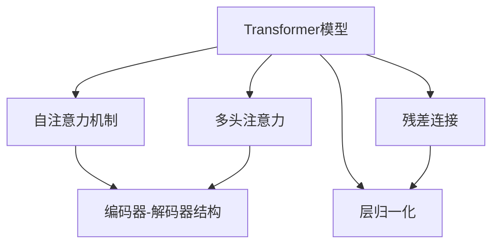
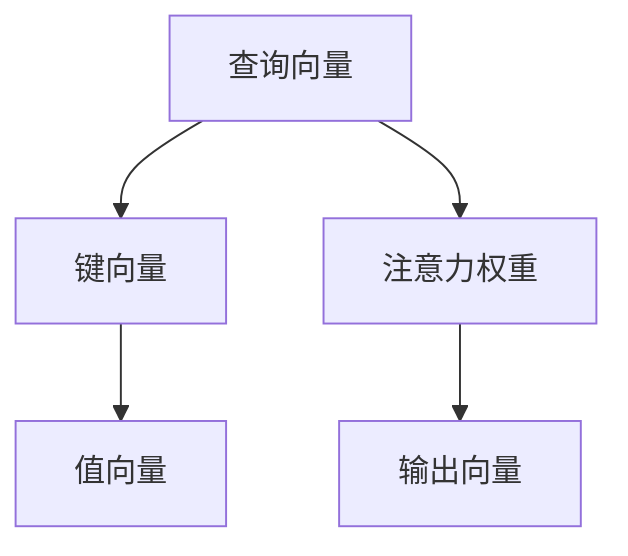
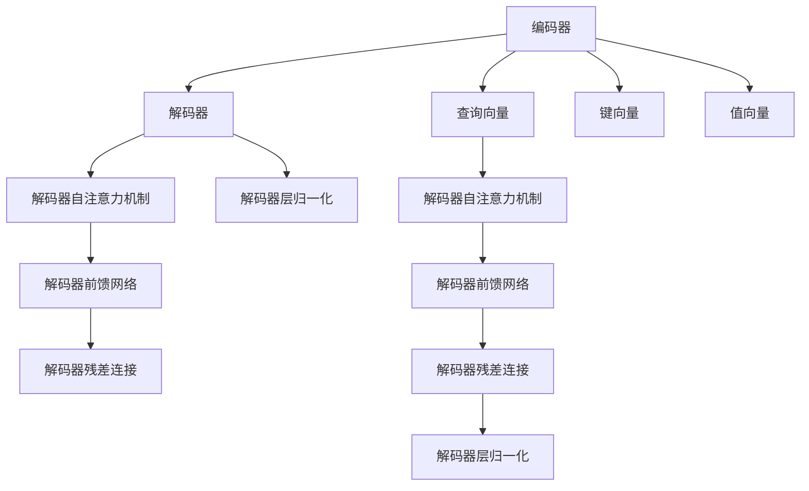
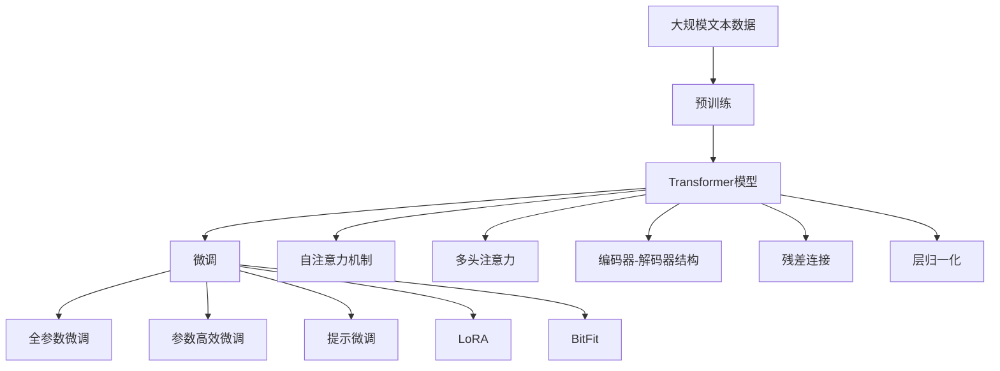

                 

# Transformer 原理与代码实例讲解

> 关键词：Transformer, 自注意力机制, 多头注意力, 编码器-解码器结构, 注意力机制, 代码实例, 自监督学习, 深度学习, 自然语言处理(NLP)

## 1. 背景介绍

### 1.1 问题由来
Transformer架构是近年来深度学习领域的重大突破之一，由Google于2017年提出。Transformer最初用于机器翻译领域，通过多头注意力机制实现了无需卷积和循环操作的序列建模，有效提升了翻译精度和效率。随着Transformer架构的进一步优化和推广，它在文本生成、自然语言理解、问答系统等NLP任务上也展现了出色的性能。

Transformer架构的成功，在于其创新的自注意力机制。该机制能够捕捉序列中任意位置的依赖关系，从而提升了模型的泛化能力和表达能力。此外，Transformer结构简单高效，易于部署和优化，迅速成为深度学习领域的标配。

### 1.2 问题核心关键点
Transformer的核心思想在于通过多头注意力机制捕捉序列中不同位置之间的依赖关系。其核心技术点包括：
- 自注意力机制：通过计算序列中任意位置与其它位置之间的相似度，捕捉序列全局依赖关系。
- 编码器-解码器结构：采用编码器自注意力机制生成查询、键和值，通过解码器自注意力机制生成输出序列。
- 多头注意力机制：通过将查询、键和值线性投影为多个子空间，提升注意力机制的表达能力。
- 残差连接和层归一化：使用残差连接和层归一化技术，提升模型的训练稳定性和收敛速度。

这些关键技术共同构成了Transformer架构的核心理念，使其在序列建模和生成任务上取得了显著效果。Transformer的成功，推动了深度学习在NLP领域的应用，催生了诸如BERT、T5等重要模型。

### 1.3 问题研究意义
研究Transformer架构和其相关技术，对于提升深度学习模型的表达能力和泛化能力，拓展其在NLP领域的应用范围，具有重要意义：

1. 提升了序列建模精度：Transformer通过自注意力机制捕捉序列中任意位置之间的依赖关系，有效提升了模型的表达能力和泛化能力，能够在不同任务上获得优异的表现。
2. 简化了模型结构：与传统的卷积和循环神经网络相比，Transformer结构更加简单高效，易于训练和优化，便于实际应用。
3. 加速了NLP技术的产业化：Transformer架构的广泛应用，促进了NLP技术的商业化落地，加速了智能客服、机器翻译、情感分析等NLP应用的发展。
4. 推动了深度学习领域的创新：Transformer的成功，带动了深度学习领域的多项创新，如多任务学习、预训练-微调范式等，进一步推动了人工智能技术的发展。
5. 提供了丰富的研究范式：Transformer架构为研究者提供了丰富的研究范式，如注意力机制的优化、残差连接的改进、多模态融合等，为深入探索深度学习的本质提供了新的视角。

## 2. 核心概念与联系

### 2.1 核心概念概述

为更好地理解Transformer架构，本节将介绍几个密切相关的核心概念：

- Transformer模型：基于自注意力机制的编码器-解码器结构，用于序列建模和生成任务。Transformer由多个编码层和解码层组成，每个层内包含多头自注意力机制、前馈网络以及残差连接等组件。
- 自注意力机制：通过计算序列中任意位置与其它位置之间的相似度，捕捉序列全局依赖关系。自注意力机制包含查询、键和值三个向量，通过多头线性投影得到多个子空间的注意力权重，从而提升表达能力。
- 多头注意力机制：通过将查询、键和值线性投影为多个子空间，提升注意力机制的表达能力，能够更好地捕捉序列中的依赖关系。
- 编码器-解码器结构：采用编码器自注意力机制生成查询、键和值，通过解码器自注意力机制生成输出序列，有效捕捉序列中不同位置之间的依赖关系。
- 残差连接和层归一化：使用残差连接和层归一化技术，提升模型的训练稳定性和收敛速度，降低过拟合风险。

这些核心概念之间的逻辑关系可以通过以下Mermaid流程图来展示：



这个流程图展示了大语言模型中的核心概念及其之间的关系：

1. Transformer模型基于自注意力机制，能够捕捉序列中任意位置的依赖关系。
2. 自注意力机制包含查询、键和值三个向量，通过多头线性投影得到多个子空间的注意力权重，提升表达能力。
3. 多头注意力机制通过将查询、键和值线性投影为多个子空间，进一步提升注意力机制的表达能力。
4. 编码器-解码器结构采用自注意力机制生成查询、键和值，通过解码器自注意力机制生成输出序列。
5. 残差连接和层归一化技术提升模型的训练稳定性和收敛速度，降低过拟合风险。

这些概念共同构成了Transformer架构的核心理念，使其在序列建模和生成任务上取得了显著效果。通过理解这些核心概念，我们可以更好地把握Transformer的工作原理和优化方向。

### 2.2 概念间的关系

这些核心概念之间存在着紧密的联系，形成了Transformer架构的完整生态系统。下面我们通过几个Mermaid流程图来展示这些概念之间的关系。

#### 2.2.1 自注意力机制的原理



这个流程图展示了自注意力机制的基本原理：

1. 将输入序列中的每个位置表示为一个查询向量。
2. 将输入序列中的每个位置表示为一个键向量和值向量。
3. 通过计算查询向量与键向量的相似度，得到注意力权重。
4. 通过注意力权重对值向量进行加权求和，得到输出向量。

#### 2.2.2 多头注意力机制的应用


这个流程图展示了多头注意力机制的应用：

1. 将查询向量线性投影为多个子空间，每个子空间对应一个注意力机制。
2. 每个子空间的注意力机制计算注意力权重，对值向量进行加权求和，得到多个子空间的输出向量。
3. 多个子空间的输出向量拼接起来，得到最终的多头注意力机制输出。

#### 2.2.3 编码器-解码器结构



这个流程图展示了编码器-解码器结构的基本流程：

1. 编码器对输入序列进行编码，生成查询向量、键向量和值向量。
2. 解码器对编码器输出的键向量和值向量进行自注意力机制计算，生成注意力权重。
3. 解码器对注意力权重进行线性投影，得到多个子空间的输出向量。
4. 解码器对多个子空间的输出向量进行前馈网络计算，得到解码器输出向量。
5. 解码器对前馈网络输出进行残差连接和层归一化，提升模型的稳定性和收敛速度。

通过这些流程图，我们可以更清晰地理解Transformer架构中各个核心概念的关系和作用，为后续深入讨论具体的算法和实现奠定基础。

### 2.3 核心概念的整体架构

最后，我们用一个综合的流程图来展示这些核心概念在大语言模型微调过程中的整体架构：



这个综合流程图展示了从预训练到微调，再到持续学习的完整过程。大语言模型首先在大规模文本数据上进行预训练，然后通过微调（包括全参数微调和参数高效微调等）或提示微调（包括LoRA和BitFit等）来适应特定任务。最后，通过持续学习技术，模型可以不断更新和适应新的任务和数据。 通过这些流程图，我们可以更清晰地理解Transformer架构中各个核心概念的关系和作用，为后续深入讨论具体的算法和实现奠定基础。

## 3. 核心算法原理 & 具体操作步骤
### 3.1 算法原理概述

Transformer架构的核心思想在于通过自注意力机制捕捉序列中任意位置的依赖关系。其核心技术点包括：

- 自注意力机制：通过计算序列中任意位置与其它位置之间的相似度，捕捉序列全局依赖关系。
- 多头注意力机制：通过将查询、键和值线性投影为多个子空间，提升注意力机制的表达能力。
- 编码器-解码器结构：采用编码器自注意力机制生成查询、键和值，通过解码器自注意力机制生成输出序列。
- 残差连接和层归一化：使用残差连接和层归一化技术，提升模型的训练稳定性和收敛速度。

Transformer的注意力机制采用多头线性投影的方式，将查询、键和值线性投影为多个子空间，通过多头注意力机制进行计算。这种多头线性投影方式能够捕捉序列中不同位置之间的依赖关系，提升模型的表达能力。编码器-解码器结构通过自注意力机制生成查询、键和值，通过解码器自注意力机制生成输出序列，捕捉序列中不同位置之间的依赖关系。

### 3.2 算法步骤详解

Transformer架构的微调步骤主要包括：

**Step 1: 准备预训练模型和数据集**
- 选择合适的预训练Transformer模型，如BERT、GPT等。
- 准备下游任务的数据集，划分为训练集、验证集和测试集。

**Step 2: 添加任务适配层**
- 根据任务类型，在预训练模型的顶层设计合适的输出层和损失函数。
- 对于分类任务，通常在顶层添加线性分类器和交叉熵损失函数。
- 对于生成任务，通常使用语言模型的解码器输出概率分布，并以负对数似然为损失函数。

**Step 3: 设置微调超参数**
- 选择合适的优化算法及其参数，如AdamW、SGD等，设置学习率、批大小、迭代轮数等。
- 设置正则化技术及强度，包括权重衰减、Dropout、Early Stopping等。
- 确定冻结预训练参数的策略，如仅微调顶层，或全部参数都参与微调。

**Step 4: 执行梯度训练**
- 将训练集数据分批次输入模型，前向传播计算损失函数。
- 反向传播计算参数梯度，根据设定的优化算法和学习率更新模型参数。
- 周期性在验证集上评估模型性能，根据性能指标决定是否触发 Early Stopping。
- 重复上述步骤直到满足预设的迭代轮数或 Early Stopping 条件。

**Step 5: 测试和部署**
- 在测试集上评估微调后模型，对比微调前后的精度提升。
- 使用微调后的模型对新样本进行推理预测，集成到实际的应用系统中。
- 持续收集新的数据，定期重新微调模型，以适应数据分布的变化。

以上是Transformer架构的微调一般流程。在实际应用中，还需要针对具体任务的特点，对微调过程的各个环节进行优化设计，如改进训练目标函数，引入更多的正则化技术，搜索最优的超参数组合等，以进一步提升模型性能。

### 3.3 算法优缺点

Transformer架构的微调方法具有以下优点：

- 简单高效。只需准备少量标注数据，即可对预训练模型进行快速适配，获得较大的性能提升。
- 通用适用。适用于各种NLP下游任务，包括分类、匹配、生成等，设计简单的任务适配层即可实现微调。
- 参数高效。利用参数高效微调技术，在固定大部分预训练参数的情况下，仍可取得不错的提升。
- 效果显著。在学术界和工业界的诸多任务上，基于微调的方法已经刷新了最先进的性能指标。

同时，该方法也存在一定的局限性：

- 依赖标注数据。微调的效果很大程度上取决于标注数据的质量和数量，获取高质量标注数据的成本较高。
- 迁移能力有限。当目标任务与预训练数据的分布差异较大时，微调的性能提升有限。
- 负面效果传递。预训练模型的固有偏见、有害信息等，可能通过微调传递到下游任务，造成负面影响。
- 可解释性不足。微调模型的决策过程通常缺乏可解释性，难以对其推理逻辑进行分析和调试。

尽管存在这些局限性，但就目前而言，Transformer架构的微调方法仍是NLP领域的主流范式。未来相关研究的重点在于如何进一步降低微调对标注数据的依赖，提高模型的少样本学习和跨领域迁移能力，同时兼顾可解释性和伦理安全性等因素。

### 3.4 算法应用领域

Transformer架构的微调方法在NLP领域已经得到了广泛的应用，覆盖了几乎所有常见任务，例如：

- 文本分类：如情感分析、主题分类、意图识别等。通过微调使模型学习文本-标签映射。
- 命名实体识别：识别文本中的人名、地名、机构名等特定实体。通过微调使模型掌握实体边界和类型。
- 关系抽取：从文本中抽取实体之间的语义关系。通过微调使模型学习实体-关系三元组。
- 问答系统：对自然语言问题给出答案。将问题-答案对作为微调数据，训练模型学习匹配答案。
- 机器翻译：将源语言文本翻译成目标语言。通过微调使模型学习语言-语言映射。
- 文本摘要：将长文本压缩成简短摘要。将文章-摘要对作为微调数据，使模型学习抓取要点。
- 对话系统：使机器能够与人自然对话。将多轮对话历史作为上下文，微调模型进行回复生成。

除了上述这些经典任务外，Transformer架构的微调方法也被创新性地应用到更多场景中，如可控文本生成、常识推理、代码生成、数据增强等，为NLP技术带来了全新的突破。随着预训练模型和微调方法的不断进步，相信NLP技术将在更广阔的应用领域大放异彩。

## 4. 数学模型和公式 & 详细讲解  
### 4.1 数学模型构建

本节将使用数学语言对Transformer架构的微调过程进行更加严格的刻画。

记预训练Transformer模型为 $T_{\theta}:\mathcal{X} \rightarrow \mathcal{Y}$，其中 $\mathcal{X}$ 为输入空间，$\mathcal{Y}$ 为输出空间，$\theta \in \mathbb{R}^d$ 为模型参数。假设微调任务的训练集为 $D=\{(x_i,y_i)\}_{i=1}^N, x_i \in \mathcal{X}, y_i \in \mathcal{Y}$。

定义模型 $T_{\theta}$ 在数据样本 $(x,y)$ 上的损失函数为 $\ell(T_{\theta}(x),y)$，则在数据集 $D$ 上的经验风险为：

$$
\mathcal{L}(\theta) = \frac{1}{N} \sum_{i=1}^N \ell(T_{\theta}(x_i),y_i)
$$

微调的优化目标是最小化经验风险，即找到最优参数：

$$
\theta^* = \mathop{\arg\min}_{\theta} \mathcal{L}(\theta)
$$

在实践中，我们通常使用基于梯度的优化算法（如AdamW、SGD等）来近似求解上述最优化问题。设 $\eta$ 为学习率，$\lambda$ 为正则化系数，则参数的更新公式为：

$$
\theta \leftarrow \theta - \eta \nabla_{\theta}\mathcal{L}(\theta) - \eta\lambda\theta
$$

其中 $\nabla_{\theta}\mathcal{L}(\theta)$ 为损失函数对参数 $\theta$ 的梯度，可通过反向传播算法高效计算。

### 4.2 公式推导过程

以下我们以二分类任务为例，推导交叉熵损失函数及其梯度的计算公式。

假设模型 $T_{\theta}$ 在输入 $x$ 上的输出为 $\hat{y}=T_{\theta}(x) \in [0,1]$，表示样本属于正类的概率。真实标签 $y \in \{0,1\}$。则二分类交叉熵损失函数定义为：

$$
\ell(T_{\theta}(x),y) = -[y\log \hat{y} + (1-y)\log (1-\hat{y})]
$$

将其代入经验风险公式，得：

$$
\mathcal{L}(\theta) = -\frac{1}{N}\sum_{i=1}^N [y_i\log T_{\theta}(x_i)+(1-y_i)\log(1-T_{\theta}(x_i))]
$$

根据链式法则，损失函数对参数 $\theta_k$ 的梯度为：

$$
\frac{\partial \mathcal{L}(\theta)}{\partial \theta_k} = -\frac{1}{N}\sum_{i=1}^N (\frac{y_i}{T_{\theta}(x_i)}-\frac{1-y_i}{1-T_{\theta}(x_i)}) \frac{\partial T_{\theta}(x_i)}{\partial \theta_k}
$$

其中 $\frac{\partial T_{\theta}(x_i)}{\partial \theta_k}$ 可进一步递归展开，利用自动微分技术完成计算。

在得到损失函数的梯度后，即可带入参数更新公式，完成模型的迭代优化。重复上述过程直至收敛，最终得到适应下游任务的最优模型参数 $\theta^*$。

## 5. 项目实践：代码实例和详细解释说明
### 5.1 开发环境搭建

在进行微调实践前，我们需要准备好开发环境。以下是使用Python进行PyTorch开发的环境配置流程：

1. 安装Anaconda：从官网下载并安装Anaconda，用于创建独立的Python环境。

2. 创建并激活虚拟环境：
```bash
conda create -n pytorch-env python=3.8 
conda activate pytorch-env
```

3. 安装PyTorch：根据CUDA版本，从官网获取对应的安装命令。例如：
```bash
conda install pytorch torchvision torchaudio cudatoolkit=11.1 -c pytorch -c conda-forge
```

4. 安装Transformers库：
```bash
pip install transformers
```

5. 安装各类工具包：
```bash
pip install numpy pandas scikit-learn matplotlib tqdm jupyter notebook ipython
```

完成上述步骤后，即可在`pytorch-env`环境中开始微调实践。

### 5.2 源代码详细实现

下面我们以命名实体识别(NER)任务为例，给出使用Transformers库对BERT模型进行微调的PyTorch代码实现。

首先，定义NER任务的数据处理函数：

```python
from transformers import BertTokenizer
from torch.utils.data import Dataset
import torch

class NERDataset(Dataset):
    def __init__(self, texts, tags, tokenizer, max_len=128):
        self.texts = texts
        self.tags = tags
        self.tokenizer = tokenizer
        self.max_len = max_len
        
    def __len__(self):
        return len(self.texts)
    
    def __getitem__(self, item):
        text = self.texts[item]
        tags = self.tags[item]
        
        encoding = self.tokenizer(text, return_tensors='pt', max_length=self.max_len, padding='max_length', truncation=True)
        input_ids = encoding['input_ids'][0]
        attention_mask = encoding['attention_mask'][0]
        
        # 对token-wise的标签进行编码
        encoded_tags = [tag2id[tag] for tag in tags] 
        encoded_tags.extend([tag2id['O']] * (self.max_len - len(encoded_tags)))
        labels = torch.tensor(encoded_tags, dtype=torch.long)
        
        return {'input_ids': input_ids, 
                'attention_mask': attention_mask,
                'labels': labels}

# 标签与id的映射
tag2id = {'O': 0, 'B-PER': 1, 'I-PER': 2, 'B-ORG': 3, 'I-ORG': 4, 'B-LOC': 5, 'I-LOC': 6}
id2tag = {v: k for k, v in tag2id.items()}

# 创建dataset
tokenizer = BertTokenizer.from_pretrained('bert-base-cased')

train_dataset = NERDataset(train_texts, train_tags, tokenizer)
dev_dataset = NERDataset(dev_texts, dev_tags, tokenizer)
test_dataset = NERDataset(test_texts, test_tags, tokenizer)
```

然后，定义模型和优化器：

```python
from transformers import BertForTokenClassification, AdamW

model = BertForTokenClassification.from_pretrained('bert-base-cased', num_labels=len(tag2id))

optimizer = AdamW(model.parameters(), lr=2e-5)
```

接着，定义训练和评估函数：

```python
from torch.utils.data import DataLoader
from tqdm import tqdm
from sklearn.metrics import classification_report

device = torch.device('cuda') if torch.cuda.is_available() else torch.device('cpu')
model.to(device)

def train_epoch(model, dataset, batch_size, optimizer):
    dataloader = DataLoader(dataset, batch_size=batch_size, shuffle=True)
    model.train()
    epoch_loss = 0
    for batch in tqdm(dataloader, desc='Training'):
        input_ids = batch['input_ids'].to(device)
        attention_mask = batch['attention_mask'].to(device)
        labels = batch['labels'].to(device)
        model.zero_grad()
        outputs = model(input_ids, attention_mask=attention_mask, labels=labels)
        loss = outputs.loss
        epoch_loss += loss.item()
        loss.backward()
        optimizer.step()
    return epoch_loss / len(dataloader)

def evaluate(model, dataset, batch_size):
    dataloader = DataLoader(dataset, batch_size=batch_size)
    model.eval()
    preds, labels = [], []
    with torch.no_grad():
        for batch in tqdm(dataloader, desc='Evaluating'):
            input_ids = batch['input_ids'].to(device)
            attention_mask = batch['attention_mask'].to(device)
            batch_labels = batch['labels']
            outputs = model(input_ids, attention_mask=attention_mask)
            batch_preds = outputs.logits.argmax(dim=2).to('cpu').tolist()
            batch_labels = batch_labels.to('cpu').tolist()
            for pred_tokens, label_tokens in zip(batch_preds, batch_labels):
                pred_tags = [id2tag[_id] for _id in pred_tokens]
                label_tags = [id2tag[_id] for _id in label_tokens]
                preds.append(pred_tags[:len(label_tokens)])
                labels.append(label_tags)
                
    print(classification_report(labels, preds))
```

最后，启动训练流程并在测试集上评估：

```python
epochs = 5
batch_size = 16

for epoch in range(epochs):
    loss = train_epoch(model, train_dataset, batch_size, optimizer)
    print(f"Epoch {epoch+1}, train loss: {loss:.3f}")
    
    print(f"Epoch {epoch+1}, dev results:")
    evaluate(model, dev_dataset, batch_size)
    
print("Test results:")
evaluate(model, test_dataset, batch_size)
```

以上就是使用PyTorch对BERT进行命名实体识别任务微调的完整代码实现。可以看到，得益于Transformers库的强大封装，我们可以用相对简洁的代码完成BERT模型的加载和微调。

### 5.3 代码解读与分析

让我们再详细解读一下关键代码的实现细节：

**NERDataset类**：
- `__init__`方法：初始化文本、标签、分词器等关键组件。
- `__len__`方法：返回数据集的样本数量。
- `__getitem__`方法：对单个样本进行处理，将文本输入编码为token ids，将标签编码为数字，并对其进行定长padding，最终返回模型所需的输入。

**tag2id和id2tag字典**：
- 定义了标签与数字id之间的映射关系，用于将token-wise的预测结果解码回真实的标签。

**训练和评估函数**：
- 使用PyTorch的DataLoader对数据集进行批次化加载，供模型训练和推理使用。
- 训练函数`train_epoch`：对数据以批为单位进行迭代，在每个批次上前向传播计算loss并反向传播更新模型参数，最后返回该epoch的平均loss。
- 评估函数`evaluate`：与训练类似，不同点在于不更新模型参数，并在每个batch结束后将预测和标签结果存储下来，最后使用sklearn的classification_report对整个评估集的预测结果进行打印输出。

**训练流程**：

